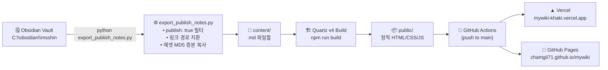

# 📚 MS Wiki — Personal Knowledge Vault

[](https://quartz.jzhao.xyz/)
[](https://nodejs.org/)
[](https://python.org/)
[](https://mywiki-khaki.vercel.app)
[](https://chamgil71.github.io/mywiki)
[](LICENSE.txt)

> **Obsidian 노트 → Quartz v4 빌드 → Vercel / GitHub Pages 이중 배포**  
> AI · 투자 · 기술 리서치 개인 지식 창고. `publish: true` 메타데이터가 붙은 노트만 웹에 공개된다.

---

## 🌐 배포 URL

| 환경 | URL | 상태 |
|------|-----|------|
| Vercel (주 서비스) | https://mywiki-khaki.vercel.app | 운영 중 |
| GitHub Pages (백업) | https://chamgil71.github.io/mywiki | 운영 중 |

---

## ✨ Key Features

- **🧠 Digital Garden** — Obsidian 위키링크(`[[]]`)·백링크·그래프 뷰를 웹에서 그대로 제공
- **🇰🇷 한국어 최적화** — IBM Plex Sans KR 폰트, `ko-KR` 로케일, 한글 정렬 지원
- **🔒 선택적 공개** — Obsidian 노트에 `publish: true` 설정한 파일만 빌드에 포함
- **⚡ 증분 동기화** — `export_publish_notes.py`가 변경된 파일·에셋만 복사 (MD5 해시 비교)
- **🌗 다크/라이트 모드** — Blue(`#2563EB`) 계열 커스텀 테마
- **🔍 전문 검색** — FlexSearch 기반 클라이언트 사이드 풀텍스트 검색
- **📊 KaTeX 수식** — 기술 노트용 LaTeX 수식 렌더링 지원
- **📡 RSS Feed** — `/index.xml` 자동 생성

---

## 🔄 전체 파이프라인



---

## 📂 디렉토리 구조

```
mywiki/
├── content/                    # Quartz가 읽는 마크다운 콘텐츠 (Obsidian에서 복사)
│   ├── index.md                # 위키 홈 (index_md.py로 자동 생성 가능)
│   ├── report/
│   │   └── AIreport/           # AI 기술·산업 분석 리포트
│   ├── techbook/
│   │   ├── 기술노트/            # 개발 기술 학습 정리
│   │   ├── 기술도서작성/         # 기술 도서 집필 초안
│   │   ├── 러버블/              # Lovable 바이브코딩 노트
│   │   ├── 옵시디언가이드/       # Obsidian 사용 가이드
│   │   ├── AI교육자료/           # AI 교육 커리큘럼
│   │   └── vibecoding/          # 바이브코딩 실습 노트
│   ├── memo/
│   │   └── 개발중/              # 작업 중 메모
│   ├── note/
│   │   └── webclipping/         # 웹 스크랩 모음
│   └── assets/
│       ├── images/              # 이미지 에셋
│       └── docs/                # PDF·PPT 등 첨부 문서
│
├── quartz/                     # Quartz v4 엔진 소스 (upstream)
│   ├── components/             # Preact UI 컴포넌트
│   ├── plugins/                # 트랜스포머·필터·에미터 플러그인
│   └── util/                   # 공통 유틸리티
│
├── public/                     # 빌드 결과물 (git 추적 안 함)
│
├── docs/                       # 프로젝트 설계 문서
│   └── 통합-서비스-구성-계획.md  # dailynews·creative-spark 통합 계획
│
├── .github/
│   └── workflows/
│       └── deploy.yaml         # GitHub Actions: 빌드 → Pages 배포
│
├── export_publish_notes.py     # Obsidian → content/ 동기화 스크립트
├── index_md.py                 # content/index.md 자동 생성 스크립트
├── quartz.config.ts            # Quartz 전역 설정 (테마·플러그인·URL)
├── quartz.layout.ts            # 페이지 레이아웃 컴포넌트 배치
├── vercel.json                 # Vercel 배포 설정 (cleanUrls)
├── .env                        # 로컬 경로 설정 (git 제외)
├── .env_sample                 # 환경변수 템플릿
└── package.json                # Node.js 의존성 및 빌드 스크립트
```

---

## 🚀 시작하기

### 1. 사전 요구사항

| 도구 | 버전 | 확인 명령 |
|------|------|---------|
| Node.js | 22+ | `node -v` |
| npm | 10.9.2+ | `npm -v` |
| Python | 3.10+ | `python --version` |

### 2. 저장소 클론 및 의존성 설치

```bash
git clone https://github.com/chamgil71/mywiki.git
cd mywiki
npm install
```

### 3. 환경변수 설정

```bash
cp .env_sample .env
```

`.env` 파일을 열어 본인 환경에 맞게 수정:

```env
# Obsidian 볼트 경로 (예: C:\obsidian\msshin)
OBSIDIAN_PATH=C:\obsidian\msshin

# Quartz content 폴더 경로
CONTENT_PATH=C:\ai\mywiki\content

# 공개할 Obsidian 폴더 목록 (쉼표 구분, 깊은 경로 우선 매칭)
PUBLISH_FOLDERS=msshin/60-AI/기술도서작성,msshin/10-Projects/AIreport

# 에셋 저장 위치
IMAGE_DIR=assets/images
DOC_DIR=assets/docs
```

### 4. 로컬 개발 서버

```bash
npm run dev
# → http://localhost:8080 에서 미리보기
```

---

## 📤 노트 발행 워크플로우

### Step 1 — Obsidian에서 노트 작성 및 `publish: true` 설정

```markdown
---
title: "나의 기술 노트"
publish: true       ← 이 줄이 있어야 웹에 공개됨
tags: [AI, Python]
---

노트 내용...
```

> **`publish: true`가 없는 노트**는 `RemoveDrafts()` 필터에 의해 빌드에서 제외됨.

### Step 2 — Obsidian → content/ 동기화

```bash
python export_publish_notes.py
```

| 기능 | 설명 |
|------|------|
| 선택적 복사 | `publish: true` 노트만 복사 |
| 경로 매핑 | `PUBLISH_FOLDERS` 규칙에 따라 `content/<폴더명>/...`으로 배치 |
| 링크 치환 | `![[이미지]]` → `` |
| 중복 방지 | 동명 파일 충돌 시 상위 폴더명 또는 MD5 prefix 자동 부여 |
| 증분 업데이트 | MD5 해시 비교로 변경된 파일만 덮어씀 |

### Step 3 — Quartz 빌드

```bash
npm run build
# → public/ 폴더에 정적 파일 생성
```

### Step 4 — 배포

```bash
git add .
git commit -m "📝 노트 업데이트"
git push origin main
# → GitHub Actions가 자동으로 빌드 → GitHub Pages 배포
# → Vercel은 push 감지 후 자체 빌드 배포
```

---

## 🛠️ 스크립트 레퍼런스

### `export_publish_notes.py` — Obsidian 동기화

```bash
python export_publish_notes.py
```

| 단계 | 설명 |
|------|------|
| 1. 스캔 | `OBSIDIAN_PATH` 하위 전체 `.md` 파일 탐색 |
| 2. 필터 | 상단 20줄 내 `publish: true` 존재 여부 확인 |
| 3. 경로 결정 | `PUBLISH_FOLDERS` 규칙으로 `content/` 하위 목적지 경로 계산 |
| 4. 중복 처리 | 같은 이름 파일 → 상위폴더명\_파일명 또는 해시4자리\_파일명 |
| 5. 콘텐츠 처리 | 이미지·문서 위키링크 → 웹 경로 치환 + 에셋 복사 |
| 6. 쓰기 | 변경된 파일만 물리 복사 (MD5 비교) |

### `index_md.py` — 인덱스 자동 생성

```bash
python index_md.py
```

`content/` 하위 모든 `.md` 파일을 스캔해 `content/index.md`를 위키링크 목록으로 자동 재생성.  
> ⚠️ 실행 시 기존 `index.md`를 덮어씀. 수동 편집 내용이 있다면 백업 후 실행.

---

## ⚙️ Quartz 설정 (`quartz.config.ts`)

| 항목 | 값 | 설명 |
|------|----|------|
| `pageTitle` | `"MS wiki"` | 브라우저 탭·헤더 타이틀 |
| `locale` | `"ko-KR"` | 날짜 표시·정렬 로케일 |
| `baseUrl` (Vercel) | `mywiki-khaki.vercel.app` | `$VERCEL` 환경변수로 분기 |
| `baseUrl` (Pages) | `chamgil71.github.io` | GitHub Actions 환경 |
| `analytics` | Plausible | 쿠키 없는 방문 통계 |
| `enableSPA` | `false` | 전체 페이지 전환 (SEO 우선) |
| `enablePopovers` | `true` | 링크 호버 미리보기 |
| Header 폰트 | IBM Plex Sans KR | 한국어 지원 테크 폰트 |
| Code 폰트 | JetBrains Mono | 개발자 선호 코드 폰트 |
| Primary Color | `#2563EB` (Blue) | 링크·강조 색상 |

### 활성화된 플러그인

```
Transformers: FrontMatter, CreatedModifiedDate, SyntaxHighlighting,
              ObsidianFlavoredMarkdown, GitHubFlavoredMarkdown,
              TableOfContents, CrawlLinks, Description, Latex(katex)

Filters:      RemoveDrafts          ← draft: false 노트만 공개

Emitters:     AliasRedirects, ContentPage, FolderPage(한글정렬),
              TagPage, ContentIndex(RSS), Assets, Static, Favicon,
              NotFoundPage
```

---

## 🤖 GitHub Actions (`.github/workflows/deploy.yaml`)

```
push to main
    │
    ├── actions/checkout (fetch-depth: 0)
    ├── setup-node v22
    ├── npm ci
    ├── npm run build  →  public/
    ├── upload-pages-artifact
    │
    └── deploy-pages  →  chamgil71.github.io/mywiki
```

| 항목 | 설정값 |
|------|--------|
| 트리거 | `push: main`, `workflow_dispatch` |
| Node.js | 22 |
| 빌드 결과 | `public/` 폴더 |
| `concurrency.group` | `pages` — 동시 배포 방지 |

> **Vercel 배포**: 별도 GitHub Actions 없이 Vercel이 `main` 브랜치 push를 감지해 자체 빌드.

---

## 📋 콘텐츠 영역 안내

| 폴더 | 설명 | Obsidian 소스 |
|------|------|--------------|
| `report/AIreport/` | AI·LLM·반도체 산업 분석 리포트 | `msshin/10-Projects/AIreport` |
| `techbook/기술도서작성/` | 기술 도서 집필 초안 및 기록 | `msshin/60-AI/기술도서작성` |
| `techbook/러버블/` | Lovable 바이브코딩 실습 노트 | - |
| `techbook/vibecoding/` | 바이브코딩(AI 코딩) 연구 | - |
| `techbook/AI교육자료/` | AI 입문 교육 커리큘럼 | - |
| `memo/개발중/` | 진행 중인 작업 메모 | - |
| `note/webclipping/` | 웹 스크랩 및 북마크 정리 | - |

---

## 🔗 연관 프로젝트 및 통합 계획

현재 mywiki와 연관된 서비스 목록:

| 프로젝트 | URL | 연계 상태 |
|---------|-----|---------|
| **dailynews** | https://ms-dailynews.vercel.app | 별도 배포 (통합 검토 중) |
| **KAIB2026** | https://budget-n.vercel.app | 별도 배포 |
| **AI 생성툴 가이드** | https://aitoolguide-ms.netlify.app | Netlify 독립 운영 |

> 📄 **통합 계획**: `docs/통합-서비스-구성-계획.md`  
> dailynews HTML과 creative-spark React 앱을 mywiki의 `/news/`, `/spark/` 경로 하위로 통합하는 빌드 타임 통합 방안이 설계되어 있음.

---

## 🛠️ 자주 쓰는 명령어

```bash
# 로컬 개발 서버 (hot reload)
npm run dev

# 프로덕션 빌드
npm run build

# 코드 포맷 체크
npm run check

# 코드 자동 포맷
npm run format

# TypeScript 타입 체크
npx tsc --noEmit

# Obsidian 노트 동기화 후 빌드
python export_publish_notes.py && npm run build

# 인덱스 페이지 재생성
python index_md.py
```

---

## 🔧 트러블슈팅

| 증상 | 원인 | 해결 |
|------|------|------|
| 노트가 사이트에 안 보임 | `publish: true` 없음 또는 `draft: true` | Frontmatter 확인 |
| 이미지가 깨짐 | `export_publish_notes.py` 미실행 | 스크립트 재실행 후 빌드 |
| 로컬 빌드는 되는데 Actions 실패 | `fetch-depth: 0` 누락 (git 날짜 메타 필요) | `deploy.yaml` 체크 |
| Vercel URL 리소스 404 | `baseUrl` 환경 분기 미작동 | `quartz.config.ts` `process.env.VERCEL` 확인 |
| 한글 파일명 정렬이 이상함 | FolderPage locale 미설정 | `quartz.config.ts` FolderPage 정렬 함수 확인 |

---

## 📚 참고 자료

| 자료 | 링크 |
|------|------|
| Quartz v4 공식 문서 | https://quartz.jzhao.xyz/ |
| Quartz GitHub | https://github.com/jackyzha0/quartz |
| Obsidian 공식 문서 | https://help.obsidian.md/ |
| Vercel 배포 설정 | https://vercel.com/docs/project-configuration |
| IBM Plex Sans KR | https://fonts.google.com/specimen/IBM+Plex+Sans+KR |
| 통합 서비스 구성 계획 | `docs/통합-서비스-구성-계획.md` |
