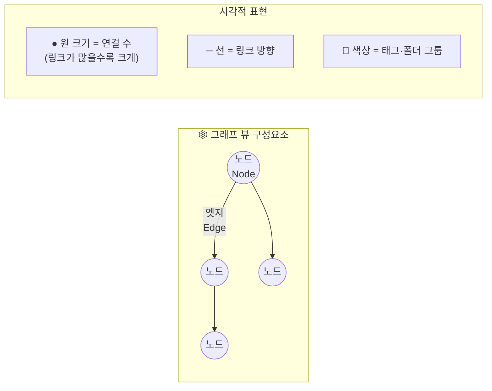

---
created:
  "{ date }":
status: 진행중
publish: true
---
# Chapter 10. 그래프 뷰 & 로컬 그래프
> 전체 그래프 · 필터 · 색상 그룹 · 로컬 그래프 · 시각적 인사이트

---

## 0) 연결 고리 (Bridge)

Chapter 09에서 텍스트 검색으로 원하는 노트를 찾는 방법을 익혔습니다.  
이 챕터에서는 보관소 전체를 **시각적인 지식 지도**로 보는 그래프 뷰를 다룹니다.  
그래프 뷰는 단순한 시각화를 넘어, **연결되지 않은 지식의 고립 지점과 허브 노트를 발견하는 분석 도구**로 활용됩니다.

---

## 1) 개념 정의 및 필요성

### 그래프 뷰란?

> **그래프 뷰(Graph View)는 보관소 안의 모든 노트(노드)와 그 사이의 링크(엣지)를 시각화한 인터랙티브 지도입니다.**

노트가 많아질수록 개별 노트를 파일 탐색기에서 보는 것만으로는 전체 지식 구조를 파악하기 어렵습니다. 그래프 뷰는 한눈에 다음을 파악하게 해줍니다.

- **허브 노트:** 많은 링크가 연결된 핵심 노트
- **고립 노트:** 아무것과도 연결되지 않은 노트
- **클러스터:** 서로 밀집하게 연결된 주제 그룹
- **브릿지 노트:** 서로 다른 클러스터를 연결하는 노트

| 뷰 유형 | 열기 방법 | 보여주는 것 |
|---|---|---|
| 전체 그래프(Graph View) | `Ctrl/Cmd + G` | 보관소 전체 노트 연결 지도 |
| 로컬 그래프(Local Graph) | 명령 팔레트 → "local graph" | 현재 노트와 직접 연결된 노트만 |

---

## 2) 핵심 원리 및 구조

### 그래프 구성 요소



**그래프 뷰 조작법:**

| 조작 | 방법 |
|---|---|
| 이동 | 빈 공간 드래그 |
| 확대/축소 | 마우스 휠 / 트랙패드 핀치 |
| 노드 이동 | 노드 드래그 |
| 노트 열기 | 노드 클릭 |
| 로컬 그래프로 전환 | 노드 클릭 후 로컬 그래프 아이콘 |

---

## 3) 실습 예제 및 실행 환경

### 실습 10-1. 전체 그래프 뷰 열기

```
단축키: Ctrl/Cmd + G
또는 리본 → 🕸️ (그래프 뷰) 아이콘
```

그래프 뷰가 열리면 오른쪽에 **필터 패널**이 표시됩니다.

---

### 실습 10-2. 그래프 필터 설정

필터 패널의 주요 옵션을 하나씩 조작해보세요.

**필터 (Filters) 섹션:**
```
검색: 검색어 입력 → 관련 노드만 표시
태그: 특정 태그 노트만 표시/숨기기
첨부 파일: 이미지·PDF 노드 표시 여부
기존 노트만: 링크는 있지만 노트가 없는 노드 숨기기
```

**그룹 (Groups) 섹션 — 색상으로 분류:**
```
① [그룹 추가] 클릭
② 쿼리 입력 (검색 연산자 사용 가능):
   - tag:#실습     → 실습 태그 노트를 파란색으로
   - path:part1    → Part 1 노트를 초록색으로
   - path:part2    → Part 2 노트를 주황색으로
③ 색상 선택
④ 여러 그룹을 추가해 보관소 지형을 시각화
```

> 💡 **TIP:** 그룹 색상을 설정하면 어떤 주제의 노트가 서로 연결돼 있는지, 서로 다른 주제 간에 어떤 노트가 브릿지 역할을 하는지 한눈에 파악할 수 있습니다.

**표시 (Display) 섹션:**
```
노드 크기: 링크 수에 비례해 노드 크기 조절
링크 강도: 연결선의 두께 조절
텍스트 표시 임계값: 몇 개 이상의 노드가 있을 때 이름 표시
```

**힘 (Forces) 섹션:**
```
중심 힘: 노드가 중앙으로 모이는 힘의 강도
반발력: 노드 간 밀어내는 힘 (겹침 방지)
링크 거리: 연결된 노드 간 거리
```

---

### 실습 10-3. 그래프로 인사이트 발견하기

색상 그룹을 설정한 뒤 아래 항목을 눈으로 찾아보세요.

```
① 가장 큰 노드 = 허브 노트 (링크가 가장 많음)
   → 어떤 노트인가? 왜 이 노트에 연결이 많은가?

② 완전히 고립된 노드 (작고 혼자 떨어진 노드)
   → 어떤 노트인가? 다른 노트와 연결이 필요한가?

③ 두 클러스터 사이에 혼자 있는 노드 = 브릿지 노트
   → 두 주제를 연결하는 중요한 노트일 수 있음

④ 밀집된 클러스터 = 특정 주제가 잘 발전된 영역
```

---

### 실습 10-4. 로컬 그래프 — 현재 노트 중심 보기

로컬 그래프는 현재 노트와 **직접 연결된 노트들만** 보여주는 집중 뷰입니다.

```
열기 방법:
① 노트를 열고 있는 상태에서
② 명령 팔레트(Ctrl/Cmd+P) → "local graph" → [로컬 그래프 열기]
③ 또는 우측 상단 [...] 메뉴 → [로컬 그래프]
```

**로컬 그래프 깊이(Depth) 설정:**
```
깊이 1: 직접 링크된 노트만 표시 (기본값)
깊이 2: 링크의 링크까지 표시
깊이 3: 3단계 연결까지 표시

→ 필터 패널 상단 "깊이" 슬라이더로 조절
```

**활용 방법:**
```
① "허브 노트"를 열고 로컬 그래프 실행
   → 허브와 연결된 모든 노트가 방사형으로 표시

② "나의 첫 번째 노트"를 열고 깊이 2로 변경
   → 첫 노트 → 연결된 노트 → 그 노트와 연결된 노트까지 표시

③ 로컬 그래프에서 연결되어야 하는데 빠진 노트 발견
   → 본문으로 돌아가 링크 추가
```

> 💡 **TIP:** 로컬 그래프를 우측 사이드바에 고정해두면, 노트를 이동할 때마다 자동으로 현재 노트의 연결 관계가 업데이트됩니다. 글을 쓰면서 실시간으로 지식 연결 구조를 확인할 수 있습니다.

---

### 실습 10-5. 그래프 뷰 색상 그룹 설계

내 보관소에 맞는 색상 그룹을 설계하고 적용해보세요.

**권장 그룹 설정 예시:**
```
그룹 1 — 파트별 색상:
  path:part1 → 파란색
  path:part2 → 초록색
  path:part3 → 주황색

그룹 2 — 상태별 색상:
  tag:#status/진행중 → 노란색
  tag:#status/완료   → 회색
  tag:#status/inbox  → 빨간색

그룹 3 — 유형별 색상:
  tag:#type/독서노트  → 보라색
  tag:#type/회의록    → 청록색
  tag:#type/아이디어  → 분홍색
```

---

## 4) 실무 시나리오 (Best Practice)

### 그래프 뷰 정기 점검 루틴

**주 1회 그래프 점검 (10분):**
```
① 전체 그래프 뷰 열기
② 고립 노트 확인 → 링크 추가 또는 아카이브
③ 예상보다 작은 허브 노트 → 링크 보강
④ 뜻밖의 연결 발견 → 새 인사이트로 발전
```

**새 노트 작성 후 루틴:**
```
① 로컬 그래프 열기 (깊이 2)
② "이 노트와 연결될 수 있는 노트가 더 있는가?" 점검
③ 빠진 링크 즉시 추가
```

### 안티 패턴

- **그래프를 장식으로만 활용:** 예쁜 그래프를 만드는 것 자체가 목표가 되는 경우입니다. 그래프는 분석 도구입니다. 인사이트를 찾는 목적으로 사용하세요
- **모든 노트에 강제로 링크:** 연결이 없는 노트가 나쁜 것이 아닙니다. 단일 주제 메모, 일회성 노트는 고립 상태가 정상입니다
- **그래프 보기에만 시간 투자:** 그래프를 보는 것보다 노트를 작성하고 링크를 추가하는 것이 더 중요합니다

---

## 5) 트러블슈팅 & 주의사항

### Q1. 그래프 뷰가 너무 복잡하고 느립니다

노트가 500개가 넘으면 전체 그래프 뷰가 느려질 수 있습니다. 이 경우 필터에서 특정 폴더나 태그만 표시하도록 좁히거나, 로컬 그래프(깊이 1~2)를 주로 활용하세요.

### Q2. 그래프에서 노드를 클릭해도 노트가 열리지 않습니다

클릭이 아닌 **더블클릭**으로 노트를 여세요. 단순 클릭은 노드 선택, 더블클릭은 노트 열기입니다.

### Q3. 색상 그룹 설정이 저장이 안 됩니다

그래프 뷰 설정은 현재 보관소에 자동 저장됩니다. 단, 보관소를 새로 만들면 설정이 초기화됩니다. `.obsidian/graph.json` 파일을 복사하면 다른 보관소에 설정을 이식할 수 있습니다.

### Q4. 첨부 파일(이미지 등)이 그래프에 표시됩니다

필터 패널에서 "첨부 파일" 토글을 끄면 `.md` 파일 노트만 표시됩니다.

---

## 6) 한 줄 요약

> 💡 **Key Takeaway:**  
> 그래프 뷰는 보관소의 지식 지형도다. 허브·고립·클러스터·브릿지를 발견하는 **분석 도구**로 활용하고, 로컬 그래프는 현재 노트의 맥락을 실시간으로 파악하는 **집필 보조 도구**로 활용하라.

---

## 🔖 이 챕터의 체크리스트

- [ ] 전체 그래프 뷰를 열고 색상 그룹을 3가지 이상 설정했다
- [ ] 허브 노트·고립 노트·브릿지 노트를 시각적으로 발견했다
- [ ] 로컬 그래프를 열고 깊이를 1→2→3으로 변경해봤다
- [ ] 로컬 그래프를 우측 사이드바에 고정해봤다
- [ ] 그래프에서 발견한 누락 링크를 추가했다

---

*이전 챕터: [Chapter 09 — 검색 완전 정복](ch09-search.md)*  
*다음 챕터: [Chapter 11 — 코어 플러그인 심층 해부](ch11-core-plugins.md)*
