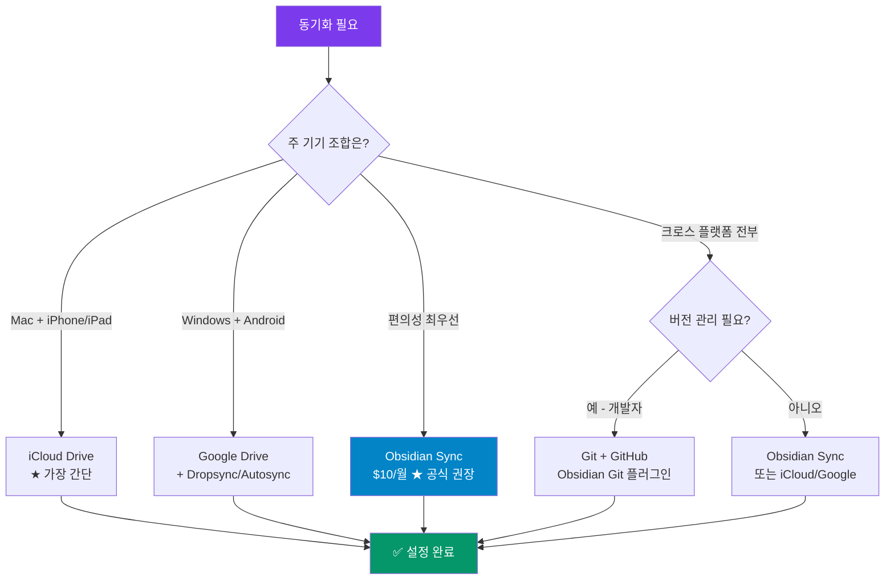

---
created:
  "{ date }":
status: 진행중
publish: true
---
# Chapter 17. 동기화와 백업 전략
> iCloud · Google Drive · Git · Obsidian Sync · 충돌 해결

---

## 0) 연결 고리 (Bridge)

Chapter 16까지 노트 작성, 시각화, 자동화를 완전히 익혔습니다.  
이제 가장 현실적인 질문에 답할 차례입니다. **"여러 기기에서 쓰려면? 데이터가 날아가면?"**  
이 챕터에서는 3가지 무료 동기화 방법과 공식 유료 서비스를 비교하고, 상황에 맞는 전략을 선택하도록 안내합니다.

---

## 1) 개념 정의 및 필요성

### 옵시디언의 데이터 영속성 문제

옵시디언의 핵심 장점은 로컬 파일 기반이지만, 이는 동시에 **동기화와 백업을 직접 책임져야 한다**는 의미이기도 합니다.

| 위험 시나리오 | 해결 방법 |
|---|---|
| 컴퓨터 고장·분실 | 클라우드 백업 (iCloud/Google Drive/Git) |
| 여러 기기 사용 | 동기화 설정 |
| 실수로 파일 삭제 | Git 버전 관리 또는 파일 복구 플러그인 |
| 대규모 변경 후 롤백 | Git 커밋 히스토리 |
| 팀 공유 | Obsidian Publish 또는 Git 공개 리포지토리 |

**4가지 동기화 옵션 비교:**

| 방법 | 비용 | 난이도 | 버전 히스토리 | 최적 사용자 |
|---|---|---|---|---|
| iCloud (Mac+iPhone) | 무료(5GB) | ⭐ | ❌ | Mac+iOS 사용자 |
| Google Drive | 무료(15GB) | ⭐⭐ | ❌ | Windows+Android |
| Git + GitHub | 무료 | ⭐⭐⭐ | ✅ (무제한) | 개발자·기술 사용자 |
| Obsidian Sync | $10/월 | ⭐ | ✅ (1년) | 편의성 최우선 |

---

## 2) 핵심 원리 및 구조

### 동기화 선택 흐름



---

## 3) 실습 예제 — 3가지 동기화 설정

### 실습 17-1. 방법 A: iCloud Drive 동기화 (Mac + iPhone)

**Mac 설정:**
```
① System Settings → Apple ID → iCloud → iCloud Drive 켜기
② Finder → iCloud Drive 폴더 확인
③ 보관소 위치를 iCloud Drive로 이동:
   현재 위치: ~/Documents/my-vault
   새 위치:   ~/Library/Mobile Documents/iCloud~md~obsidian/Documents/my-vault
   
   또는 더 간단하게:
   옵시디언 → 보관소 열기 → iCloud Drive에서 새 보관소 만들기
```

**iPhone 설정:**
```
① 설정 → [내 이름] → iCloud → iCloud Drive 켜기
② 설정 → Obsidian → iCloud Drive 접근: 허용
③ 옵시디언 앱 실행 → [iCloud Drive에서 열기]
④ Mac의 보관소 폴더 선택
⑤ 초기 동기화 대기 (보관소 크기에 따라 수 분 소요)
```

> ⚠️ **WARNING:** iCloud 동기화 중에 옵시디언을 강제 종료하거나 파일을 직접 편집하면 충돌이 발생할 수 있습니다. 두 기기에서 **동시에 같은 노트를 편집하지 마세요.**

> 💡 **TIP:** iCloud 동기화 상태는 Finder에서 파일 아이콘의 구름 표시로 확인합니다. ☁️ = 클라우드에만 있음 / ✅ = 로컬+클라우드 동기화됨

---

### 실습 17-2. 방법 B: Google Drive 동기화 (Windows + Android)

**Windows 설정:**
```
① Google Drive 데스크탑 앱 설치
   https://www.google.com/drive/download/
② 로그인 후 동기화 폴더 설정 (기본: G:\My Drive\)
③ 보관소를 Google Drive 폴더로 이동 또는 새로 생성:
   G:\My Drive\obsidian-vault\
④ 이 경로로 옵시디언 보관소 열기
```

**Android 설정:**
```
옵션 A: Dropsync 앱 사용 (권장)
  ① Google Play에서 "Dropsync" 설치
  ② Google Drive 계정 연결
  ③ 동기화 쌍 설정:
     원본: Google Drive/obsidian-vault/
     대상: 기기 내 /storage/.../obsidian-vault/
  ④ 동기화 간격: 15분 또는 수동
  ⑤ 옵시디언에서 기기 내 경로 열기

옵션 B: Autosync for Google Drive 앱 사용
  (Dropsync와 유사한 방법)
```

> 📌 **NOTE:** Google Drive의 공식 Android 앱은 옵시디언과 직접 연동이 안 됩니다. Dropsync처럼 **로컬 폴더와 Google Drive를 양방향 동기화**하는 서드파티 앱이 필요합니다.

---

### 실습 17-3. 방법 C: Git + GitHub 동기화 (전 플랫폼, 버전 관리 포함)

**전제 조건:**
```
① Git 설치: https://git-scm.com/downloads
② GitHub 계정 생성: https://github.com
③ Obsidian Git 플러그인 설치·활성화 (Ch 12 참고)
```

**보관소 Git 초기화:**
```bash
# 터미널에서 보관소 폴더로 이동
cd ~/Documents/my-vault

# Git 초기화
git init

# .gitignore 파일 생성 (중요!)
echo ".obsidian/workspace.json" > .gitignore
echo ".obsidian/workspace-mobile.json" >> .gitignore
echo ".trash/" >> .gitignore
echo "*.tmp" >> .gitignore

# 첫 커밋
git add .
git commit -m "Initial vault commit"
```

**GitHub 원격 저장소 연결:**
```bash
# GitHub에서 새 Private 리포지토리 생성 후
git remote add origin https://github.com/사용자명/my-vault.git
git push -u origin main
```

**Obsidian Git 플러그인 설정:**
```
설정 → Obsidian Git:
  자동 백업 간격: 10분 (권장)
  자동 커밋 메시지: "vault backup: {{date}}"
  자동 push: 켜기
  자동 pull (시작 시): 켜기
  변경 없을 때 커밋 안 함: 켜기
```

**모바일에서 Git 사용 (iPhone):**
```
① Working Copy 앱 설치 (iOS, 유료 $19.99)
   또는 a-Shell 앱 (무료, Git 명령 직접 실행)
② GitHub 리포지토리 클론
③ Obsidian에서 해당 폴더를 보관소로 열기
④ Working Copy에서 수동 pull/push
```

> 💡 **TIP:** iPhone에서 Git 동기화는 Obsidian Git 플러그인이 iOS에서 완전히 작동하지 않습니다. 현재(v1.7 기준) **Working Copy + Shortcuts 자동화**로 반자동 동기화를 구성하는 것이 가장 안정적인 방법입니다.

---

### 실습 17-4. 방법 D: Obsidian Sync (공식 유료 서비스)

```
설정 → 동기화:
  ① [새 보관소 만들기] 또는 [기존 보관소 연결]
  ② E2E 암호화 비밀번호 설정 (잊으면 복구 불가!)
  ③ 동기화할 내용 선택:
     - 노트 (항상 켜짐)
     - 설정·플러그인 (선택)
     - 테마 (선택)
  ④ 모바일 앱에서 동일 계정으로 연결
```

**Obsidian Sync 버전 히스토리:**
```
설정 → 동기화 → [버전 히스토리]
→ 노트별로 최대 1년치 변경 이력 확인
→ 원하는 버전 선택 → [복구]
```

> 📌 **NOTE:** Obsidian Sync는 E2E(종단간) 암호화를 적용해 Anthropic을 포함한 어떤 서드파티도 내용을 볼 수 없습니다. 보안이 중요한 업무 노트에 가장 적합합니다.

---

### 실습 17-5. 충돌 해결 전략

여러 기기에서 동시 편집 시 파일 충돌이 발생할 수 있습니다.

**iCloud/Google Drive 충돌:**
```
충돌 발생 시 파일명:
  원본: 회의록.md
  충돌본: 회의록 (충돌, 2024-01-15).md 또는
          회의록 (iPhone의 충돌 복사본).md

해결 방법:
  ① 두 파일을 모두 열어 내용 비교
  ② 더 최신·완전한 내용으로 합치기
  ③ 충돌본 삭제
```

**Git 충돌:**
```bash
# 충돌 발생 시 파일 내용:
<<<<<<< HEAD
로컬에서 수정한 내용
=======
원격에서 수정한 내용
>>>>>>> origin/main

# 해결:
# 1. 원하는 내용으로 파일 편집 (<<<, ===, >>> 줄 모두 삭제)
# 2. git add 파일명
# 3. git commit
```

> ⚠️ **WARNING:** 충돌은 **두 기기에서 동시에 같은 노트를 편집할 때** 발생합니다. 예방하려면 기기를 전환하기 전에 반드시 동기화 완료를 확인하세요.

---

## 4) 실무 시나리오 (Best Practice)

### 상황별 최적 전략 선택

**시나리오 A: Mac 한 대 + iPhone, 간단하게 시작**
```
→ iCloud Drive (무료, 설정 5분)
→ iCloud+ 플랜(50GB) 구독 시 충분한 용량 확보
```

**시나리오 B: Windows PC + Android 폰 출퇴근 활용**
```
→ Google Drive + Dropsync (무료, 설정 30분)
→ 또는 Obsidian Sync ($10/월, 설정 5분)
```

**시나리오 C: 개발자, 버전 관리 필수, 다중 플랫폼**
```
→ Git + GitHub (무료, 설정 1시간)
→ PC: Obsidian Git 자동화
→ iPhone: Working Copy 반자동화
```

**시나리오 D: 보안 중요, 가장 안전한 방법 원함**
```
→ Obsidian Sync ($10/월) + Git 이중 백업
→ E2E 암호화 + 1년 버전 히스토리
```

### 이중 백업 권장 구성

```
기본 동기화: iCloud 또는 Google Drive (실시간 접근)
    +
보조 백업: Obsidian Git (주기적 스냅샷, 롤백 가능)
```

이 조합이면 컴퓨터 고장, 실수 삭제, 대규모 변경 롤백 모두 대응 가능합니다.

---

## 5) 트러블슈팅 & 주의사항

### Q1. iCloud 동기화 후 이미지가 표시되지 않습니다

iCloud의 "기기 저장 공간 최적화" 기능이 켜져 있으면 일부 파일이 클라우드에만 있고 로컬에 없을 수 있습니다. `System Settings → Apple ID → iCloud → iCloud Drive → 이 Mac에서 옵션` 을 확인하거나, 옵시디언 보관소 폴더에서 파일을 강제 다운로드하세요.

### Q2. Obsidian Git 자동 커밋이 안 됩니다

가장 흔한 원인: `git` 명령어가 시스템 PATH에 없는 경우입니다. `설정 → Obsidian Git → Git 경로` 항목에 Git 실행 파일 경로를 직접 입력하세요. (Windows: `C:\Program Files\Git\bin\git.exe`)

### Q3. 두 기기의 플러그인 설정이 달라집니다

`.obsidian/` 폴더를 동기화 대상에 포함하면 플러그인 설정이 공유됩니다. 단, `workspace.json` 파일은 기기마다 다른 레이아웃을 사용하므로 `.gitignore`에 추가하는 것을 권장합니다.

---

## 6) 한 줄 요약

> 💡 **Key Takeaway:**  
> 동기화 전략은 기기 조합과 필요에 따라 선택한다.  
> **Mac+iPhone이면 iCloud, Windows+Android면 Google Drive+Dropsync, 버전 관리가 필요하면 Git, 돈을 내고 편리함을 원하면 Obsidian Sync. 어떤 방법이든 이중 백업은 필수다.**

---

## 🔖 이 챕터의 체크리스트

- [ ] 내 기기 조합에 맞는 동기화 방법을 선택했다
- [ ] 선택한 방법으로 실제 동기화를 설정했다
- [ ] 모바일 앱에서 보관소를 열 수 있다
- [ ] 노트를 작성하고 다른 기기에 동기화됨을 확인했다
- [ ] `.gitignore` 설정 또는 충돌 예방 방법을 이해했다

---

*이전 챕터: [Chapter 16 — Excalidraw](ch16-excalidraw.md)*  
*다음 챕터: [Chapter 18 — PARA 방법론 구축](../part5/ch18-para.md)*
