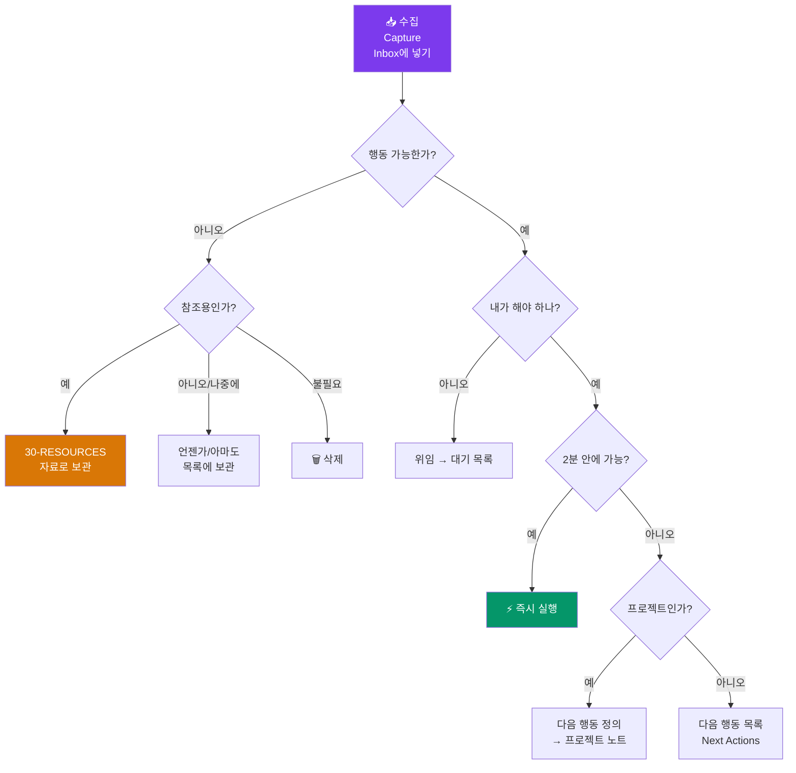

---
created:
  "{ date }":
status: 진행중
publish: true
---
# Chapter 19. GTD와 할일 관리
> Getting Things Done · 수집 · 처리 · 정리 · 검토 · 실행

---

## 0) 연결 고리 (Bridge)

Chapter 18에서 PARA로 보관소의 공간 구조를 설계했습니다.  
이 챕터에서는 그 안에서 **할일을 어떻게 처리하는가**를 다룹니다.  
GTD(Getting Things Done)는 David Allen이 개발한 생산성 방법론으로, "머릿속을 비워 행동에만 집중하는" 시스템입니다.

---

## 1) 개념 정의 및 필요성

### GTD의 5단계

> **GTD의 핵심: 모든 "해야 할 것"을 신뢰할 수 있는 외부 시스템(옵시디언)에 기록해 머릿속의 부하를 제거하는 것.**

| 단계 | 행동 | 옵시디언 구현 |
|---|---|---|
| **수집(Capture)** | 모든 생각·할일을 Inbox에 기록 | 00-INBOX + 빠른 캡처 단축키 |
| **처리(Clarify)** | Inbox의 각 항목이 "행동 가능한가" 판단 | 매일 Inbox 처리 루틴 |
| **정리(Organize)** | 행동 가능한 항목을 적절한 목록에 배치 | PARA + 체크박스 + 태그 |
| **검토(Reflect)** | 목록을 정기적으로 검토·업데이트 | 주간 리뷰 템플릿 |
| **실행(Engage)** | 상황과 에너지에 맞는 항목 선택·실행 | Dataview 필터링 대시보드 |

---

## 2) 핵심 원리 및 구조

### GTD 처리 흐름도



---

## 3) 실습 예제 — GTD 옵시디언 구현

### 실습 19-1. 핵심 GTD 목록 노트 5종

**`10-PROJECTS/다음-행동.md` (Next Actions):**
```markdown
---
tags: [GTD, next-actions]
---
# ⚡ 다음 행동 목록

> **원칙:** 구체적인 물리적 행동 단위로 기록 (동사로 시작)

## 💻 컴퓨터에서 할 것
- [ ] (프로젝트A) 기획서 초안 구글독에 작성
- [ ] (블로그) 3월 콘텐츠 캘린더 완성
- [ ] 영어 스터디 자료 이메일 답장

## 📞 전화·연락
- [ ] 병원 예약 전화 (02-xxxx-xxxx)
- [ ] 홍길동에게 프로젝트 피드백 요청 슬랙

## 🏃 외출 중 할 것
- [ ] 문구점 → 노트 구매
- [ ] 은행 → 공과금 이체

## 🏠 집에서 할 것
- [ ] 서재 정리 (15분)
- [ ] 운동기구 조립
```

**`10-PROJECTS/대기-목록.md` (Waiting For):**
```markdown
---
tags: [GTD, waiting-for]
---
# 🕐 대기 목록 (남에게 위임한 것)

| 내용 | 담당자 | 요청일 | 기대일 |
|---|---|---|---|
| 계약서 검토 | 법무팀 김철수 | 2024-01-10 | 2024-01-17 |
| 디자인 시안 | 디자이너 이영희 | 2024-01-12 | 2024-01-19 |
| API 문서 | 백엔드 박민준 | 2024-01-15 | 2024-01-22 |
```

**`10-PROJECTS/언젠가-아마도.md` (Someday/Maybe):**
```markdown
---
tags: [GTD, someday-maybe]
---
# 💭 언젠가 / 아마도

> 지금은 아니지만 나중에 하고 싶은 것들. 주간 리뷰에서 검토.

## 배우고 싶은 것
- [ ] Rust 프로그래밍
- [ ] 수채화 그리기
- [ ] 스페인어

## 가고 싶은 곳
- [ ] 교토 벚꽃 시즌
- [ ] 뉴질랜드 피오르드랜드

## 만들고 싶은 것
- [ ] 개인 블로그 완전 리뉴얼
- [ ] 사이드 프로젝트 앱 아이디어 A
```

---

### 실습 19-2. 옵시디언 GTD 대시보드

Dataview로 모든 GTD 목록을 한 화면에 모아보는 대시보드를 만듭니다.

**`00-INBOX/GTD 대시보드.md`:**
````markdown
---
tags: [GTD, dashboard]
---
# 🎯 GTD 대시보드

## 📥 Inbox (처리 필요)
```dataview
LIST
FROM "00-INBOX"
WHERE file.name != "GTD 대시보드"
SORT file.ctime ASC
```

## ⚡ 오늘 할 것
```dataview
TASK
FROM "10-PROJECTS"
WHERE !completed AND contains(text, "오늘") OR due = date(today)
SORT due ASC
```

## 📋 진행 중인 프로젝트
```dataview
TABLE status AS "상태", due_date AS "마감", priority AS "우선순위"
FROM "10-PROJECTS"
WHERE type = "project" AND status = "진행중"
SORT priority ASC, due_date ASC
```

## 🕐 대기 중인 것
```dataview
TABLE WITHOUT ID "**" + rows.담당자 AS "담당자", rows.기대일 AS "기대일"
FROM "10-PROJECTS/대기-목록"
FLATTEN file.lists AS L
WHERE L.task AND !L.checked
GROUP BY L.담당자
```

## ⚠️ 기한 초과 항목
```dataview
TASK
FROM ""
WHERE !completed AND due < date(today)
SORT due ASC
```
````

---

### 실습 19-3. 빠른 캡처 설정

GTD의 핵심은 생각이 떠오르는 즉시 기록하는 것입니다.

**옵션 A: 모바일 빠른 캡처 (iPhone)**
```
① 옵시디언 앱 설정 → 퀵 캡처
   → 캡처 노트: 00-INBOX/quick-capture.md
   → 위젯 또는 바로 가기 설정
② iOS 위젯에 옵시디언 퀵 캡처 추가
   → 잠금 화면에서도 즉시 기록 가능
```

**옵션 B: 단축키 설정 (PC)**
```
설정 → 단축키 → "오늘의 노트 열기" → Ctrl+Alt+D 지정
→ 데일리 노트에 즉시 기록

또는 Templater 커맨드 단축키:
설정 → Templater → 템플릿 단축키 설정
```

**옵션 C: 애플 단축어 자동화 (iPhone+Mac)**
```
Shortcuts 앱:
① 새 단축어 생성
② "텍스트 입력 받기" 액션 추가
③ "파일에 추가" 액션 → iCloud Drive/Obsidian/00-INBOX/quick-capture.md
④ Siri 명령어: "옵시디언에 추가"
```

---

### 실습 19-4. 컨텍스트 기반 할일 필터링

GTD의 **컨텍스트(Context)** 는 "이 행동을 하기 위해 필요한 상황·도구"입니다.

```
컨텍스트 태그 체계:
#context/computer   → 컴퓨터가 필요한 작업
#context/phone      → 전화가 필요한 작업
#context/outside    → 외출 중 할 수 있는 작업
#context/home       → 집에서만 가능한 작업
#context/focus      → 집중 시간이 필요한 작업 (딥 워크)
#context/quick      → 5분 이내 빠른 작업
```

**컨텍스트 필터 Dataview:**
````markdown
## 💻 지금 컴퓨터로 할 수 있는 것
```dataview
TASK
FROM ""
WHERE !completed AND contains(tags, "context/computer")
SORT file.mtime DESC
LIMIT 10
```
````

---

### 실습 19-5. 주간 GTD 리뷰 템플릿

GTD 시스템을 살아있게 유지하는 것은 **주간 리뷰(Weekly Review)** 입니다.

```markdown
---
tags: [GTD, weekly-review]
date: 2026-03-03
week: 2026-W10
---

# 🔄 주간 GTD 리뷰 — 2026-W10

## 📥 1단계: 수집 정리 (10분)
- [ ] 물리적 Inbox 처리 (책상, 메모지 등)
- [ ] 디지털 Inbox 처리 (이메일, 메신저, 옵시디언 Inbox)
- [ ] 머릿속 생각 모두 쏟아내기

## ⚙️ 2단계: 처리·정리 (15분)
- [ ] 다음 행동 목록 업데이트
- [ ] 대기 목록 확인 (응답 없으면 팔로업)
- [ ] 기한 초과 항목 처리 또는 삭제
- [ ] 언젠가/아마도 목록 검토

## 📊 3단계: 프로젝트 검토 (10분)
- [ ] 진행 중인 프로젝트 각각에 다음 행동이 있는가?
- [ ] 완료된 프로젝트 → Archives 이동
- [ ] 새 프로젝트 추가 필요 여부 확인

## 🌟 4단계: 지난 주 회고 (5분)
잘 된 것:

개선할 것:

## 🎯 5단계: 다음 주 우선순위 (5분)
1. 
2. 
3. 
```

---

## 4) 실무 시나리오 (Best Practice)

### GTD + PARA 통합 운영 루틴

**매일 아침 (10분):**
```
① 데일리 노트 열기 (Templater 자동)
② Inbox 3개 이하로 유지 → 처리
③ 오늘의 Top 3 할일 결정
④ GTD 대시보드에서 기한 초과 항목 확인
```

**매주 금요일 (45분):**
```
① 주간 GTD 리뷰 템플릿 실행
② PARA Projects 업데이트
③ 다음 주 캘린더 확인
④ 언젠가/아마도 목록 검토
```

### 안티 패턴

- **Next Actions를 프로젝트 이름으로 적기:** "프레젠테이션 준비"는 행동이 아닙니다. "PowerPoint 열고 슬라이드 1~3 초안 작성"처럼 구체적인 물리적 행동으로 기록하세요
- **GTD 목록을 수백 개로 불리기:** 목록이 너무 길면 보기 싫어집니다. 목록을 정기적으로 정리하고, "언젠가" 항목은 과감히 삭제하세요
- **시스템만 정교하게 만들고 실행은 안 하기:** 완벽한 GTD 시스템을 구축하는 것보다, 불완전해도 매일 실행하는 것이 중요합니다

---

## 5) 트러블슈팅 & 주의사항

### Q1. Dataview TASK 쿼리가 체크박스를 불러오지 못합니다

`TASK` 쿼리는 `- [ ]` 형식의 체크박스만 인식합니다. `* [ ]` 또는 `1. [ ]` 형식은 인식되지 않습니다. 또한 Dataview 설정에서 `Task completion tracking` 이 켜져 있는지 확인하세요.

### Q2. 같은 할일이 여러 노트에 중복으로 보입니다

Dataview `TASK FROM ""` 은 보관소 전체를 스캔하므로 여러 노트에 동일한 내용이 있으면 중복 표시됩니다. `FROM "특정 폴더"` 로 범위를 좁히거나, 할일은 특정 노트에만 기록하는 규칙을 만드세요.

### Q3. 완료된 체크박스를 어떻게 처리해야 하나요?

선택지가 세 가지입니다: ①완료 상태 유지(기록 목적) ②삭제 ③별도 "완료 아카이브" 섹션으로 이동. Dataview `WHERE !completed` 조건으로 완료된 항목은 대시보드에서 자동으로 숨길 수 있습니다.

---

## 6) 한 줄 요약

> 💡 **Key Takeaway:**  
> GTD는 "머릿속을 비우는" 시스템이다. 모든 할일을 신뢰할 수 있는 외부 시스템(옵시디언)에 기록하고, 다음 행동을 구체적인 물리적 행동으로 정의하라.  
> **주간 리뷰를 빠뜨리지 않는 한 GTD 시스템은 살아있다.**

---

## 🔖 이 챕터의 체크리스트

- [ ] GTD 핵심 목록 5종(다음 행동·대기·언젠가·프로젝트·자료)을 만들었다
- [ ] GTD 대시보드 노트를 완성하고 Dataview 쿼리가 작동함을 확인했다
- [ ] 컨텍스트 태그를 5종 이상 설정하고 할일에 적용했다
- [ ] 주간 GTD 리뷰 Templater 템플릿을 만들었다
- [ ] 주간 리뷰를 1회 완전히 실행했다

---

*이전 챕터: [Chapter 18 — PARA 방법론](ch18-para.md)*  
*다음 챕터: [Chapter 20 — 독서 노트 시스템](ch20-reading.md)*
