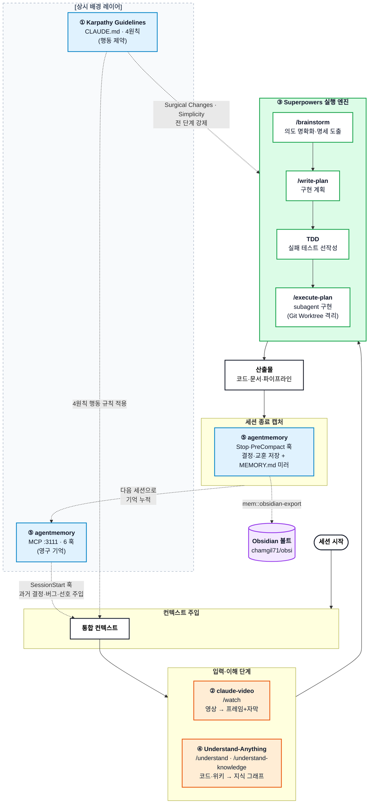

```toc  
minLevel: 1  
maxLevel: 1
```

# AI 코딩 에이전트 5대 오픈소스 도구 정리

> [!info] 문서 성격 Claude Code / Codex / Cursor 등 코딩 에이전트의 **행동·방법론·입력·이해·기억** 5개 레이어를 각각 보강하는 오픈소스 도구 5종을 원문 기준으로 정리. 원문 대비 저장소 이관·스타 수·세부 동작 변경분을 반영함 (검증일 2026-06-23).
> 
> **v2 추가분:** §7 데이터 보안·반출 매트릭스 · §8 통합 충돌·운영 리스크 · agentmemory 라이선스 정정(Apache-2.0) · Obsidian export 경로(다이어그램 반영).

---

## 0. 5대 도구 한눈 매핑

|#|프로젝트|담당 레이어|한 줄 정의|형태|라이선스|비고|
|---|---|---|---|---|---|---|
|1|Karpathy Guidelines|**행동(Behavior)**|4원칙으로 LLM 코딩 실수 차단|CLAUDE.md / 플러그인|MIT|~56k★|
|2|claude-video|**입력(Input)**|영상→프레임+자막 변환해 Claude가 "시청"|`/watch` 스킬|MIT|~1.2k★|
|3|Superpowers|**방법론(Method)**|brainstorm→plan→TDD 강제|스킬 프레임워크|MIT|~137k★, v6|
|4|Understand-Anything|**이해(Comprehension)**|코드·위키→지식 그래프 시각화|멀티에이전트 플러그인|MIT|~55k★, Egonex-AI 이관|
|5|agentmemory|**기억(Memory)**|세션 간 영구 기억 (SQLite+MCP+훅)|메모리 서버|**Apache-2.0**|~23k★, LongMemEval-S 95.2%|

---

## 1. Karpathy Guidelines

- **저장소:** https://github.com/multica-ai/andrej-karpathy-skills
- **레이어:** 행동 규칙 (always-on)
- **라이선스/규모:** MIT, 약 56k 스타

### 개요

안드레 카파시(Andrej Karpathy)가 X에 올린 "LLM 코딩의 함정" 관찰을 바탕으로 만든 단일 `CLAUDE.md` 파일. 카파시가 지적한 3대 문제:

1. 멋대로 가정하고 확인 없이 진행 — 혼란을 관리하지 않고, 트레이드오프를 제시하지 않으며, 필요할 때 밀어붙이지 않음
2. 코드·API를 과도하게 복잡화, 추상화 부풀림 (100줄이면 될 것을 1000줄로)
3. 작업과 무관한 주석·코드를 충분히 이해하지 못한 채 변경·삭제

### 4대 원칙 (상세)

1. **Think Before Coding** — 가정 금지, 혼란 은폐 금지, 트레이드오프 표면화. 불확실하면 질문, 모호하면 복수 해석 제시, 더 단순한 방법 있으면 명시, 막히면 멈추고 무엇이 불분명한지 짚기
2. **Simplicity First** — 문제를 푸는 최소 코드만. 요청 없는 기능·추상화·"유연성"·과잉 예외처리 금지. 200줄이 50줄로 가능하면 재작성
3. **Surgical Changes** — 꼭 필요한 부분만. 인접 코드 "개선"·불필요한 리팩터링 금지, 기존 스타일 준수, 변경된 모든 라인이 요청으로 직접 추적 가능해야 함
4. **Goal-Driven Execution** — 명령형 지시를 검증 가능한 목표로 전환 ("검증 추가" → "잘못된 입력 테스트를 작성하고 통과시켜라"). 카파시: "LLM은 구체적 목표까지 루프 도는 데 능하다 — 무엇을 하라 말고 성공 기준을 주고 지켜봐라"

### 설치

- Claude Code 플러그인: `/plugin marketplace add` → `/plugin install`
- 또는 기존 `CLAUDE.md`에 `curl`로 내용 append
- Cursor: `.cursor/rules/karpathy-guidelines.mdc` 포함

### 활용 사례

- config-code 분리·"추측 기반 구현 거부" 원칙을 강제하는 워크플로우의 기본 룰셋
- 기존 CLAUDE.md / 서브에이전트 구조에 4원칙 표 병합 → "diff에 요청한 변경만 나타나는지" 점검

---

## 2. claude-video

- **저장소:** https://github.com/bradautomates/claude-video
- **레이어:** 입력 (멀티모달 영상 인제스트)
- **라이선스/규모:** MIT, 약 1.2k 스타, 제작자 Brad Bonanno

### 개요

`/watch [URL]`로 영상을 받아 다운로드→프레임 추출→전사 후 Claude에 전달, "영상을 보게" 만드는 스킬. Anthropic이 비디오 모델을 출시하지 않은 한계를 우회.

### 작동 방식 (상세)

1. **yt-dlp** — 1,000+ 사이트(YouTube·TikTok·Instagram·Loom 등)에서 영상 다운로드 (로컬 파일은 in-place)
2. **ffmpeg** — 자동 스케일 비율로 프레임 + 16kHz 모노 오디오 분리
3. **전사 2단계** — ①yt-dlp가 네이티브 자막 무료·즉시 확보 → ②없을 때만 Whisper(Groq 권장 / OpenAI)로 전사
4. 프레임 + 타임스탬프 전사를 Claude에 전달, 각 프레임을 이미지로 Read

> [!warning] 제약 조건
> 
> - 정확도 최적: **10분 이하** (초과 시 "sparse scan" 경고)
> - 하드 캡: **2 fps · 100 프레임** (토큰 비용 = 프레임 수 비례)
> - Whisper 업로드 한도 25MB (≈50분)
> - 화면 텍스트(슬라이드·코드) 읽기 → `--resolution 1024`

### 활용 사례

- **콘텐츠 리버스 엔지니어링** — `/watch <viral-video> what hook did they open with?` (오프닝 훅·구조 분석)
- **버그 진단** — 화면 녹화로 `/watch bug-repro.mov what's going wrong?`
- **세컨드 브레인 자동화** — 시청 대상 영상을 Obsidian에 구조화 노트로 자동 요약·축적

> [!tip] 변형 포크 로컬 전사(API 키 불필요, Apple Silicon `mlx-whisper`) + 로그인 게이트 소스 쿠키 지원 필요 시 → `mathiaschu/watch`

---

## 3. Superpowers

- **저장소:** https://github.com/obra/superpowers
- **마켓플레이스:** https://github.com/obra/superpowers-marketplace
- **레이어:** 개발 방법론 (SDLC 강제)
- **라이선스/규모:** MIT, 약 137k 스타, v6.0.x, 제작자 Jesse Vincent(Prime Radiant)

### 개요

TDD·디버깅·협업 패턴 등 검증된 기법을 담은 에이전틱 스킬 라이브러리. **무의존성(zero-dependency)** 설계 원칙.

### 작동 방식 (상세)

- 에이전트 기동 즉시 작동 → 코드부터 쓰지 않고 "진짜 무엇을 하려는지" 질문
- **brainstorm → spec → plan → implement** 흐름 (`/brainstorm`, `/write-plan`, `/execute-plan`)
- 명세를 읽을 수 있는 분량으로 분할 제시 → 승인 후 주니어도 따라올 구현 계획 수립
- **TDD 강제** — 실패 테스트 선작성 → 통과 최소 코드만
- **Git Worktrees** 격리 환경
- **subagent-driven development** (v6 핵심) — 작업별 검토를 저렴·엄격하게 재작성, 평가 기준 약 2배 속도·약 50% 토큰 절감
- 멀티 하네스: Claude Code, Codex, Cursor, Gemini CLI, Copilot CLI, Antigravity 등

### 활용 사례

- 회귀 위험 큰 멀티버전 파이프라인(예: 파서 v15, 데일리뉴스 v6)에서 실패 테스트 선작성 + worktree 격리로 안정적 증분 개발
- "바이브 코딩"을 방법론으로 전환

> [!caution] 기여 정책 PR 거부율 94% 표방 — 스킬 콘텐츠 수정 기준 매우 엄격. 커스터마이징은 **별도 플러그인**으로 분리 권장.

---

## 4. Understand-Anything

- **저장소:** https://github.com/Lum1104/Understand-Anything → 현재 **`Egonex-AI/Understand-Anything`** 이관
- **홈페이지:** understand-anything.com
- **레이어:** 코드/지식 이해 (지식 그래프)
- **라이선스/규모:** MIT, TypeScript, 약 55k 스타. 원작자 Lum1104(Yuxiang Lin)가 0→55k+ 성장 후 EgonexAI에서 유지보수

### 개요

멀티 에이전트 파이프라인으로 코드베이스·지식 베이스를 분석해 상호작용 지식 그래프 생성. 파일·함수·클래스·의존성을 추출해 `.understand-anything/knowledge-graph.json`에 저장.

### 명령어 (상세)

|명령|기능|
|---|---|
|`/understand`|전체 스캔·그래프 생성 (증분, 변경 파일만 재분석)|
|`/understand-chat`|코드베이스에 자연어 질문|
|`/understand-diff`|현재 변경의 영향(ripple) 분석|
|`/understand-explain <path>`|특정 파일·함수 심층 설명|
|`/understand-onboard`|신규 팀원 온보딩 가이드 생성|
|`/understand-domain`|비즈니스 도메인·플로우·스텝 추출|
|`/understand-knowledge <wiki>`|**Karpathy 패턴 LLM wiki 지식 베이스 분석**|

- 의미 기반 검색: "결제 처리 부분은?" → 'payment' 단어 없는 노드도 탐색
- 아키텍처 레이어(API·Service·Data·UI·Utility) 색상 구분
- 페르소나 적응형 UI (주니어/PM/파워유저)
- 다국어 출력: `--language ko` (한국어 지원)

### 활용 사례 (선생님 프로젝트 직접 연관)

- **LLM Wiki 시스템** (문서 패밀리 클러스터링·canonical 버전 선택·revivable 블록 인덱싱) → `/understand-knowledge`로 위키 구조를 지식 그래프화
- Obsidian 볼트 노트 간 관계를 시각적으로 탐색
- 팀이 생성된 JSON 그래프를 커밋 → 공유 온보딩·PR 리뷰

---

## 5. agentmemory

- **저장소:** https://github.com/rohitg00/agentmemory
- **레이어:** 영구 메모리 (cross-session)
- **라이선스/규모:** **Apache-2.0**(특허 조항 포함), 약 23k 스타, 제작자 rohitg00. LongMemEval-S 검색 정확도 95.2%

### 개요

iii-engine의 3 프리미티브(Worker/Function/Trigger) 위에 구축한 영구 메모리 시스템. 상태는 파일 기반 SQLite(`./data/state_store.db`)에 저장.

### 작동 방식 (상세)

- **연결:** `agentmemory connect claude-code` (copilot-cli·codex·cursor·gemini-cli 등 50+ 에이전트)
- **서버:** :3111 포트, MCP로 53개 도구 프록시 (서버 없을 땐 7개 로컬 폴백)
- **6개 라이프사이클 훅** — SessionStart · UserPromptSubmit · PreToolUse · PostToolUse · PreCompact · Stop → LLM 호출 전 컨텍스트 주입 + 턴 캡처 + MEMORY.md 미러링
- **15개 스킬** (SKILL.md 형식) — 호출형 8개(remember·recall·recap·handoff·forget·commit-context·commit-history·session-history) + 참조형 7개
- **검색:** 하이브리드 retrieval (원문 표현: BM25 키워드 + 벡터 임베딩 + 지식 그래프 3중 결합)

> [!note] 비용 최적화 권고 압축(요약)은 품질 기준이 느슨 → DeepSeek-V4-Pro / Qwen3-Coder가 Sonnet 대비 ~10배 저렴·거의 동등. 프리미엄 모델은 직접 읽는 쿼리용으로 아낄 것.

### 활용 사례

- 세션 전환 시 아키텍처 결정·반복 버그·선호 스타일 기억 → "프로젝트 규칙 재설명" 제거
- MEMORY.md를 git 추적 파일로 두어 CI·팀원·타 도구 공유
- **N100 홈서버** 등 항시 가동 환경과 궁합 (메모리 서버 상시 구동 필요)
- **Obsidian 연계** — `mem::obsidian-export` 엔드포인트로 누적 메모리를 Obsidian 볼트로 내보내기 가능 (선생님 볼트 직결)

> [!success] 로컬 우선 설계 (반출 불가 환경 적합) 
> ① API 키 없으면 LLM 호출 0(no-op 기본값) · 
> ② 로컬 임베딩(`@xenova/transformers` + `onnxruntime`) · 
> ③ 한국어/CJK 토크나이저(`@node-rs/jieba`, `tiny-segmenter`) · 
> ④ 전송 전 PEM 개인키·JWT 자동 레닥션 · 
> ⑤ `AGENTMEMORY_AGENT_SCOPE=isolated` 에이전트 간 메모리 격리. 
> **단, `agentmemory stop`→재시작 시 데이터 소실 이슈(#843) 보고 → SQLite(`state_store.db`) 스냅샷 백업 권장.** 대안: 벡터 DB 기반 **mem0** (이미 벡터 인프라가 있는 팀에 적합).

---

## 6. 통합 워크플로우 다이어그램

5개 도구를 하나의 Claude Code 환경에 결합한 표준 흐름. **행동(Karpathy)** 과 **기억(agentmemory)** 은 상시 배경 레이어, **입력(claude-video)·이해(Understand-Anything)** 는 컨텍스트 공급, **방법론(Superpowers)** 은 실행 엔진.



### 결합 시 레이어별 역할 요약

|레이어|도구|작동 시점|역할|
|---|---|---|---|
|행동|① Karpathy|전 단계 상시|4원칙으로 추측·과복잡·범위 이탈 차단|
|기억|⑤ agentmemory|세션 시작/종료|과거 컨텍스트 주입 + 신규 교훈 저장|
|입력|② claude-video|영상 소스 있을 때|영상 콘텐츠를 분석 가능한 형태로 변환|
|이해|④ Understand-Anything|신규 코드·위키 진입 시|구조·도메인을 지식 그래프로 파악|
|방법론|③ Superpowers|실제 개발 시|brainstorm→plan→TDD→구현 강제|

> [!example] 실전 시나리오 
> 
> 1. N100 홈서버에서 **agentmemory** 서버 상시 구동 → Claude Code 세션 시작 시 과거 파이프라인 결정 자동 주입
> 2. 새 기능 참고용 튜토리얼 영상을 **claude-video** `/watch`로 인제스트
> 3. 기존 LLM Wiki 코드베이스를 **Understand-Anything** `/understand`로 지식 그래프화 → 변경 영향 사전 파악(`/understand-diff`)
> 4. **Superpowers**로 명세→TDD→worktree 격리 구현, 전 과정 **Karpathy 4원칙** 준수
> 5. 세션 종료 시 결정·교훈을 **agentmemory**가 MEMORY.md로 미러 → git 추적 → 다음 세션 누적

---

## 7. 데이터 보안·반출 매트릭스 (반출 불가 환경 채택 기준)

도구 채택 가부를 가르는 핵심 표. **데이터가 외부로 나가는지**가 1차 필터.

|도구|외부 전송|무엇이 나가나|반출 불가 환경 채택|
|---|---|---|---|
|① Karpathy|**없음**|행동 규칙만 주입|✅ 무조건 가능|
|③ Superpowers|**없음**|방법론·스킬만 주입|✅ 무조건 가능|
|⑤ agentmemory|**조건부(기본 OFF)**|API 키 설정 시에만 압축·임베딩 호출. 로컬 모델로 0 전송 가능|✅ 로컬 모드로 가능|
|② claude-video|**조건부**|네이티브 자막 없을 때 오디오→Groq/OpenAI|⚠️ 로컬 포크 `mathiaschu/watch` 필수|
|④ Understand-Anything|**모델 의존**|클라우드 모델 사용 시 코드·위키 내용 전송|⚠️ 로컬 모델 경로 확인 필수|

> [!warning] 민감 문서(LLM Wiki) 작업 시 원칙
> 
> - **claude-video** — 사내 영상은 반드시 로컬 전사 포크(mlx-whisper) 사용. 본가는 자막 없으면 오디오 외부 전송
> - **Understand-Anything** — 반출 불가 코드/위키는 로컬 LLM 백엔드로만 실행. 클라우드 모델 연결 금지
> - **agentmemory** — API 키 미설정(no-op) 또는 로컬 임베딩으로 구동. PEM/JWT 자동 레닥션 활성 확인

---

## 8. 통합 충돌·운영 리스크 (다이어그램의 빈틈)

> [!caution] 동시 사용 시 점검 포인트
> 
> - **SessionStart 훅 경합** — Superpowers와 agentmemory가 **둘 다 세션 시작 컨텍스트를 주입**. 토큰 예산 경쟁·주입 순서에 따라 한쪽이 밀릴 수 있음 → 주입량 모니터링 필요
> - **행동 규칙 우선순위** — Superpowers 스킬은 "기본 동작 오버라이드, 단 사용자 CLAUDE.md/AGENTS.md 지시가 충돌 시 우선"이라 명시. 따라서 Karpathy 4원칙을 **CLAUDE.md에 두면 충돌 시 CLAUDE.md가 승** (다이어그램의 'Karpathy 전 단계 강제'를 보장하는 근거)
> - **단일 장애점** — agentmemory는 :3111 서버 + iii-engine(:49134) 상시 구동 필수. `agentmemory stop`→재시작 시 **데이터 소실 이슈(#843)** 보고 → SQLite 스냅샷 백업 필수
> - **자체 호스팅 보안** — viewer 프록시 경로 순회 SSRF(#898) 패치 진행 중 → 버전 추적 필요

---

## 출처

- Karpathy Guidelines — https://github.com/multica-ai/andrej-karpathy-skills
- claude-video — https://github.com/bradautomates/claude-video
- Superpowers — https://github.com/obra/superpowers
- Understand-Anything — https://github.com/Lum1104/Understand-Anything (현 Egonex-AI/Understand-Anything)
- agentmemory — https://github.com/rohitg00/agentmemory

_검증일: 2026-06-23 · 스타 수·버전은 검증 시점 기준이며 변동 가능_