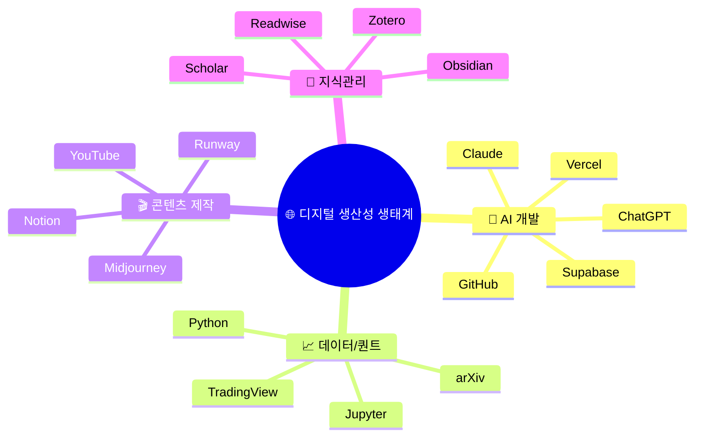
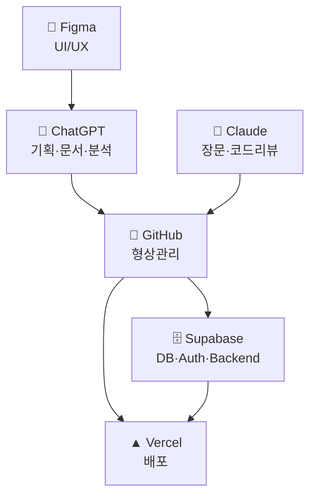
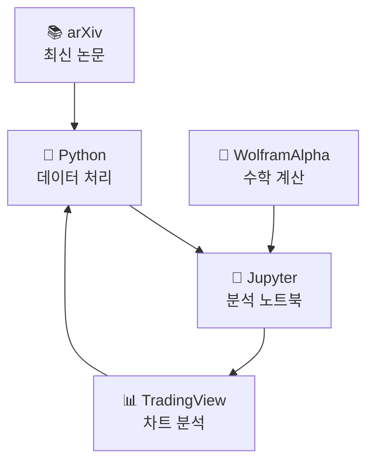
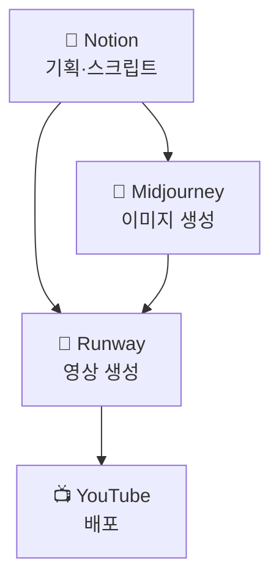
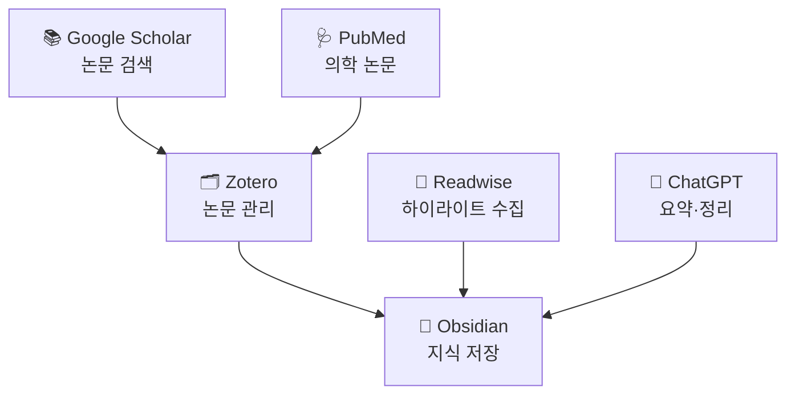

```toc
minLevel: 2
maxLevel: 3
```

# 디지털 시대 분야별 대표 서비스 가이드

현대의 디지털 생태계는 특정 분야를 대표하는 “사실상 표준급 서비스”들을 중심으로 형성되어 있다.

이 문서는 다음 내용을 체계적으로 정리한다.

- 분야별 대표 글로벌 서비스
- 각 서비스의 핵심 특징 및 강점
- 한국에서 주로 사용되는 대응 서비스
- 글로벌 우위 / 국내 우위 영역 비교
- 실사용 관점의 추천 조합


## 🏗️ 전체 생태계 관점




---
## 1. AI / LLM 대표 서비스

| 분야         | 대표 서비스                                    | 핵심 특징 / 비교 포인트                      |
| ---------- | ----------------------------------------- | ----------------------------------- |
| 범용 AI      | [ChatGPT](https://chatgpt.com/)           | 범용 AI 비서, 문서 작성·코딩·분석·대화 균형         |
| 장문·코딩      | [Claude](https://claude.ai/)              | 긴 문맥 처리 강점, 코드 리팩토링·문서 분석 우수        |
| 구글 연동      | [Gemini](https://gemini.google.com/)      | Gmail·Drive·YouTube 등 Google 생태계 연동 |
| 오픈소스 모델 허브 | [Hugging Face](https://huggingface.co/)   | AI 모델 공유·배포·실험의 사실상 표준              |
| AI 검색      | [Perplexity](https://www.perplexity.ai/)  | 출처 기반 AI 검색 특화                      |
| 이미지 생성     | [Midjourney](https://www.midjourney.com/) | 고품질 감성 이미지 생성                       |
| 영상 생성      | [Runway](https://runwayml.com/)           | AI 영상 생성·편집 특화                      |

---
## 2. 개발 / 프로그래밍

|분야|대표 서비스|핵심 특징 / 비교 포인트|
|---|---|---|
|코드 저장소|[GitHub](https://github.com/)|오픈소스·협업 개발의 사실상 표준|
|개발자 Q&A|[Stack Overflow](https://stackoverflow.com/)|전세계 개발자 지식 아카이브|
|패키지 저장소(JS)|[npm](https://www.npmjs.com/)|JavaScript/Node.js 패키지 생태계|
|파이썬 패키지|[PyPI](https://pypi.org/)|Python 라이브러리 공식 저장소|
|API 테스트|[Postman](https://www.postman.com/)|API 테스트·문서화·협업|
|온라인 코드 실행|[CodePen](https://codepen.io/)|프론트엔드 실험·공유|
|서버리스 배포|[Vercel](https://vercel.com/)|Next.js 기반 프론트엔드 배포 최강|
|백엔드 플랫폼|[Supabase](https://supabase.com/)|Firebase 대안, PostgreSQL 기반 BaaS|

---
## 3. 디자인 / UIUX

| 분야         | 대표 서비스                                   | 핵심 특징 / 비교 포인트     |
| ---------- | ---------------------------------------- | ------------------ |
| UI 디자인     | [Figma](https://www.figma.com/)          | 실시간 협업 UI 디자인 표준   |
| 디자이너 포트폴리오 | [Dribbble](https://dribbble.com/)        | UI/브랜딩 쇼케이스 중심     |
| 디자인 영감     | [Behance](https://www.behance.net/)      | Adobe 기반 글로벌 포트폴리오 |
| 아이콘        | [Font Awesome](https://fontawesome.com/) | 웹 아이콘 생태계 대표       |
| 일러스트       | [unDraw](https://undraw.co/)             | 무료 SVG 일러스트 제공     |

---
## 4. 데이터 / 분석 / 수학

| 분야         | 대표 서비스                                        | 핵심 특징 / 비교 포인트   |
| ---------- | --------------------------------------------- | ---------------- |
| 계산 엔진      | [WolframAlpha](https://www.wolframalpha.com/) | 수학·과학 계산 특화 엔진   |
| 데이터 분석 노트북 | [Jupyter](https://jupyter.org/)               | 데이터사이언스 표준 분석 환경 |
| 통계 계산      | [R Project](https://www.r-project.org/)       | 통계·학술 분석 강점      |
| 인터랙티브 그래프  | [Desmos](https://www.desmos.com/)             | 교육용 수학 그래프 시각화   |
| 논문 검색      | [Google Scholar](https://scholar.google.com/) | 학술 논문 검색 표준      |
| 연구 논문      | [arXiv](https://arxiv.org/)                   | 최신 연구 논문 공개 저장소  |

---
## 5. 생산성 / 문서 / 협업

| 분야     | 대표 서비스                                      | 핵심 특징 / 비교 포인트     |
| ------ | ------------------------------------------- | ------------------ |
| 협업 문서  | [Notion](https://www.notion.so/)            | 문서·DB·위키 통합 워크스페이스 |
| 오피스    | [Google Docs](https://docs.google.com/)     | 실시간 공동 문서 작업       |
| 스프레드시트 | [Google Sheets](https://sheets.google.com/) | 클라우드 기반 데이터 협업     |
| 팀 협업   | [Slack](https://slack.com/)                 | 개발팀·스타트업 메신저 표준    |
| 화이트보드  | [Miro](https://miro.com/)                   | 온라인 협업 보드          |
| 자동화    | [Zapier](https://zapier.com/)               | 서비스 간 자동화 연결       |

---
## 6. 영상 / 방송 / 콘텐츠

| 분야       | 대표 서비스                                                                      | 핵심 특징 / 비교 포인트  |
| -------- | --------------------------------------------------------------------------- | --------------- |
| 동영상      | [YouTube](https://www.youtube.com/)                                         | 글로벌 영상 플랫폼 절대강자 |
| 라이브 스트리밍 | [Twitch](https://www.twitch.tv/)                                            | 게임·실시간 방송 중심    |
| 숏폼       | [TikTok](https://www.tiktok.com/)                                           | 추천 알고리즘 기반 숏폼   |
| 팟캐스트     | [Spotify](https://spotify.com/)                                             | 음악+팟캐스트 통합 플랫폼  |
| 영상 편집    | [DaVinci Resolve](https://www.blackmagicdesign.com/products/davinciresolve) | 전문가급 무료 영상 편집   |

---
## 7. 재테크 / 금융 / 투자

| 분야        | 대표 서비스                                        | 핵심 특징 / 비교 포인트 |
| --------- | --------------------------------------------- | -------------- |
| 미국 주식 데이터 | [TradingView](https://www.tradingview.com/)   | 차트 분석·트레이딩 표준  |
| 기업 재무     | [Yahoo Finance](https://finance.yahoo.com/)   | 글로벌 기업 재무 정보   |
| ETF 정보    | [ETF.com](https://www.etf.com/)               | ETF 전문 데이터     |
| 암호화폐 데이터  | [CoinMarketCap](https://coinmarketcap.com/)   | 암호화폐 시가총액·거래량  |
| 퀀트 백테스트   | [QuantConnect](https://www.quantconnect.com/) | 알고리즘 트레이딩 연구   |

---
## 8. 교육 / 학습

| 분야       | 대표 서비스                                        | 핵심 특징 / 비교 포인트 |
| -------- | --------------------------------------------- | -------------- |
| 무료 강의    | [Khan Academy](https://www.khanacademy.org/)  | 무료 기초 교육 대표    |
| 대학 강의    | [Coursera](https://www.coursera.org/)         | 대학·기업 연계 강의    |
| 실무 강의    | [Udemy](https://www.udemy.com/)               | 실무 중심 온라인 강좌   |
| 프로그래밍 학습 | [freeCodeCamp](https://www.freecodecamp.org/) | 무료 코딩 학습 플랫폼   |
| 알고리즘 문제  | [LeetCode](https://leetcode.com/)             | 개발자 코딩 테스트 표준  |

---
## 9. 인문학 분야

### 9.1 역사

| 분야       | 대표 서비스                                                                   | 핵심 특징 / 비교 포인트 |
| -------- | ------------------------------------------------------------------------ | -------------- |
| 온라인 백과   | [Wikipedia](https://www.wikipedia.org/)                                  | 범용 지식 백과       |
| 역사 원문 자료 | [Internet History Sourcebooks Project](https://sourcebooks.fordham.edu/) | 역사 원문 아카이브     |
| 디지털 고문서  | [Project Gutenberg](https://www.gutenberg.org/)                          | 고전 문헌 무료 공개    |
| 세계 문화유산  | [UNESCO World Heritage Centre](https://whc.unesco.org/)                  | 세계 문화유산 공식 정보  |
| 역사 지도    | [David Rumsey Map Collection](https://www.davidrumsey.com/)              | 고지도 전문 컬렉션     |

### 9.2 철학

| 분야    | 대표 서비스                                                             | 핵심 특징 / 비교 포인트 |
| ----- | ------------------------------------------------------------------ | -------------- |
| 철학 백과 | [Stanford Encyclopedia of Philosophy](https://plato.stanford.edu/) | 철학계 표준 참고자료    |
| 철학 논문 | [PhilPapers](https://philpapers.org/)                              | 철학 논문 검색       |
| 철학 입문 | [Internet Encyclopedia of Philosophy](https://iep.utm.edu/)        | 입문·개론 설명 강점    |

### 9.3 문학

| 분야        | 대표 서비스                                                 | 핵심 특징 / 비교 포인트 |
| --------- | ------------------------------------------------------ | -------------- |
| 무료 고전문학   | [Project Gutenberg](https://www.gutenberg.org/)        | 저작권 만료 고전 제공   |
| 독서 기록     | [Goodreads](https://www.goodreads.com/)                | 독서 기록·추천       |
| 시·문학 아카이브 | [Poetry Foundation](https://www.poetryfoundation.org/) | 영미권 시 자료       |
| 전세계 도서 검색 | [Open Library](https://openlibrary.org/)               | 글로벌 디지털 도서관    |

### 9.4 언어학 / 외국어

|분야|대표 서비스|핵심 특징 / 비교 포인트|
|---|---|---|
|언어 학습|[Duolingo](https://www.duolingo.com/)|게임형 언어 학습|
|번역|[DeepL](https://www.deepl.com/)|자연스러운 AI 번역|
|영어 사전|[Merriam-Webster](https://www.merriam-webster.com/)|대표 영어 사전|
|어원 사전|[Etymonline](https://www.etymonline.com/)|단어 어원 분석|

---
## 10. 자연과학 분야

### 10.1 물리학

|분야|대표 서비스|핵심 특징 / 비교 포인트|
|---|---|---|
|논문|[arXiv Physics](https://arxiv.org/archive/physics)|최신 물리 논문 공개|
|입자물리|[CERN](https://home.cern/)|세계 최대 입자물리 연구기관|
|천체 데이터|[NASA](https://www.nasa.gov/)|우주·천체 데이터|
|우주 시뮬레이션|[Universe Sandbox](https://universesandbox.com/)|우주 물리 시뮬레이션|

### 10.2 화학

| 분야        | 대표 서비스                                       | 핵심 특징 / 비교 포인트 |
| --------- | -------------------------------------------- | -------------- |
| 화합물 데이터   | [PubChem](https://pubchem.ncbi.nlm.nih.gov/) | 화학물질 공개 DB     |
| 화학 데이터베이스 | [ChemSpider](https://www.chemspider.com/)    | 화합물 검색         |
| 분자 시각화    | [MolView](https://molview.org/)              | 3D 분자 시각화      |

### 10.3 생물학 / 의학

| 분야     | 대표 서비스                                       | 핵심 특징 / 비교 포인트 |
| ------ | -------------------------------------------- | -------------- |
| 의학 논문  | [PubMed](https://pubmed.ncbi.nlm.nih.gov/)   | 의학 논문 표준 검색    |
| 유전자 정보 | [NCBI](https://www.ncbi.nlm.nih.gov/)        | 유전체 데이터        |
| 단백질 구조 | [Protein Data Bank](https://www.rcsb.org/)   | 단백질 구조 저장소     |
| 인체 해부  | [Visible Body](https://www.visiblebody.com/) | 3D 해부학 시각화     |

### 10.4 천문학

| 분야        | 대표 서비스                                     | 핵심 특징 / 비교 포인트 |
| --------- | ------------------------------------------ | -------------- |
| 실시간 우주 사진 | [APOD](https://apod.nasa.gov/)             | NASA 오늘의 천체사진  |
| 별 지도      | [Stellarium](https://stellarium.org/)      | 실시간 천체 시뮬레이션   |
| 천체 시뮬레이션  | [Celestia](https://celestiaproject.space/) | 우주 탐사형 시뮬레이터   |

---
## 11. 여행 / 레저

### 11.1 여행 계획

| 분야    | 대표 서비스                                      | 핵심 특징 / 비교 포인트 |
| ----- | ------------------------------------------- | -------------- |
| 숙소    | [Booking.com](https://www.booking.com/)     | 글로벌 숙소 예약      |
| 항공권   | [Skyscanner](https://www.skyscanner.com/)   | 항공권 메타검색       |
| 여행 리뷰 | [Tripadvisor](https://www.tripadvisor.com/) | 여행 리뷰 커뮤니티     |
| 지도    | [Google Maps](https://maps.google.com/)     | 글로벌 지도 표준      |
| 여행 루트 | [Rome2Rio](https://www.rome2rio.com/)       | 교통 루트 통합 검색    |

### 11.2 캠핑 / 아웃도어

| 분야    | 대표 서비스                                          | 핵심 특징 / 비교 포인트 |
| ----- | ----------------------------------------------- | -------------- |
| 등산 지도 | [AllTrails](https://www.alltrails.com/)         | 등산·트레킹 GPS     |
| 캠핑 예약 | [Hipcamp](https://www.hipcamp.com/)             | 캠핑 예약 플랫폼      |
| 날씨    | [Windy](https://www.windy.com/)                 | 풍속·기상 시각화      |
| 별 관측  | [Dark Site Finder](https://darksitefinder.com/) | 광공해 지도         |

### 11.3 항공 / 철도 / 교통 덕후

| 분야        | 대표 서비스                                          | 핵심 특징 / 비교 포인트 |
| --------- | ----------------------------------------------- | -------------- |
| 항공 실시간 추적 | [Flightradar24](https://www.flightradar24.com/) | 전세계 항공기 추적     |
| 선박 추적     | [MarineTraffic](https://www.marinetraffic.com/) | 선박 AIS 추적      |
| 철도 정보     | [Rail Europe](https://www.raileurope.com/)      | 유럽 철도 예약       |

## 12. 취미 활동

### 12.1 음악

| 분야      | 대표 서비스                                              | 핵심 특징 / 비교 포인트 |
| ------- | --------------------------------------------------- | -------------- |
| 음악 스트리밍 | [Spotify](https://spotify.com/)                     | 글로벌 음악 추천      |
| 악보      | [MuseScore](https://musescore.com/)                 | 커뮤니티 악보 공유     |
| 기타 코드   | [Ultimate Guitar](https://www.ultimate-guitar.com/) | 기타 코드 데이터베이스   |

### 12.2 사진

| 분야       | 대표 서비스                                  | 핵심 특징 / 비교 포인트 |
| -------- | --------------------------------------- | -------------- |
| 사진 공유    | [Flickr](https://www.flickr.com/)       | 사진 커뮤니티        |
| 사진 포트폴리오 | [500px](https://500px.com/)             | 사진작가 중심        |
| RAW 편집   | [Darktable](https://www.darktable.org/) | 오픈소스 사진 편집     |

### 12.3 독서 / 지식관리

| 분야     | 대표 서비스                                  | 핵심 특징 / 비교 포인트 |
| ------ | --------------------------------------- | -------------- |
| 독서 기록  | [Goodreads](https://www.goodreads.com/) | 독서 리뷰·추천       |
| 전자책    | [Kindle](https://www.amazon.com/kindle) | 전자책 생태계        |
| 북마크 저장 | [Pocket](https://getpocket.com/)        | 읽기 저장 서비스      |
| 지식 정리  | [Obsidian](https://obsidian.md/)        | 로컬 기반 PKM      |

### 12.4 게임 / 시뮬레이션

| 분야        | 대표 서비스                                   | 핵심 특징 / 비교 포인트 |
| --------- | ---------------------------------------- | -------------- |
| PC 게임 플랫폼 | [Steam](https://store.steampowered.com/) | PC 게임 플랫폼 표준   |
| 게임 방송     | [Twitch](https://www.twitch.tv/)         | 게임 스트리밍 대표     |
| 모드 커뮤니티   | [Nexus Mods](https://www.nexusmods.com/) | 게임 모드 생태계      |

---
## 13. 분야별 압도적 표준 서비스

| 분야     | 대표 서비스                              | 의미            |
| ------ | ----------------------------------- | ------------- |
| 철학     | Stanford Encyclopedia of Philosophy | 철학계 표준 참고자료   |
| 수학     | WolframAlpha                        | 계산 엔진 표준      |
| 물리     | arXiv                               | 최신 연구 논문 표준   |
| 의학논문   | PubMed                              | 의학 논문 검색 표준   |
| 여행지도   | Google Maps                         | 글로벌 지도 인프라    |
| 항공추적   | Flightradar24                       | 항공 추적 표준      |
| 등산     | AllTrails                           | GPS 등산 플랫폼 대표 |
| 음악스트리밍 | Spotify                             | 글로벌 음악 플랫폼    |
| 독서기록   | Goodreads                           | 독서 커뮤니티 대표    |
| 지식관리   | Obsidian                            | 개인 지식관리 대표    |

---
## 14. 한국 대응 서비스 비교

### 14.1 지도 / 여행

|글로벌|국내 대응|비교 포인트|
|---|---|---|
|Google Maps|네이버지도|한국 대중교통·상권 정보 강점|
|Google Maps|카카오맵|로컬 길찾기·맛집 정보 우수|
|Booking.com|야놀자|국내 숙박 특화|
|Tripadvisor|여기어때|국내 여행 리뷰 강점|
|Skyscanner|인터파크투어|국내 여행 상품 연동|

### 14.2 검색 / 커뮤니티

| 글로벌            | 국내 대응  | 비교 포인트       |
| -------------- | ------ | ------------ |
| Google         | 네이버    | 블로그·카페 중심 검색 |
| Reddit         | 디시인사이드 | 익명 커뮤니티 문화   |
| Stack Overflow | OKKY   | 국내 개발자 커뮤니티  |
| Reddit         | 클리앙    | IT·생활 커뮤니티   |
| Reddit         | 루리웹    | 게임·서브컬처 중심   |

### 14.3 생산성 / 메신저

|글로벌|국내 대응|비교 포인트|
|---|---|---|
|Slack|카카오톡|국민 메신저 수준|
|Notion|네이버웍스|기업 협업 중심|
|Google Docs|한컴독스|한글 문서 친화적|

### 14.4 콘텐츠 / 음악

| 글로벌     | 국내 대응 | 비교 포인트       |
| ------- | ----- | ------------ |
| YouTube | 치지직   | 게임 스트리밍 강화   |
| Twitch  | SOOP  | 국내 인터넷 방송 문화 |
| Spotify | 멜론    | 국내 음원 차트 강세  |
| Spotify | 지니뮤직  | 통신사 연계       |
| Spotify | FLO   | 개인화 추천 강화    |

### 14.5 금융 / AI

|글로벌|국내 대응|비교 포인트|
|---|---|---|
|TradingView|네이버증권|국내 주식 접근성|
|Yahoo Finance|증권플러스|모바일 투자 편의성|
|ChatGPT|CLOVA X|한국어 특화|
|Claude|Wrtn|AI 콘텐츠 생성 중심|

---
## 15. 한국이 강한 분야 vs 글로벌 우위 분야

### 한국 서비스가 강한 분야

|분야|이유|
|---|---|
|지도|실시간 로컬 데이터|
|배달|초고밀도 물류|
|메신저|카카오 네트워크|
|웹툰|한국 중심 생태계|
|게임|온라인 게임 문화|
|커뮤니티|한국어 기반 문화|

### 글로벌 서비스가 압도적인 분야

|분야|이유|
|---|---|
|개발|GitHub 중심 생태계|
|AI 모델|OpenAI·Google·Anthropic|
|논문|arXiv·PubMed|
|클라우드|AWS·GCP·Azure|
|오픈소스|글로벌 협업 구조|
|수학·과학|WolframAlpha 등 연구 생태계|

---

## 16. 실전 추천 조합 

### 🤖 AI 개발자 조합



#### 핵심 흐름

- Figma → UI 설계
- ChatGPT / Claude → 코드 생성·리팩토링
- GitHub → 협업·버전관리
- Supabase → 백엔드
- Vercel → 서비스 배포

#### 특징

- 스타트업 MVP 구성 최적화
- 소규모 팀 생산성 극대화
- 서버 관리 부담 최소화
- AI 기반 개발 워크플로우

---
### 📈 데이터 / 퀀트 조합



#### 핵심 흐름

- arXiv → 최신 논문 조사
- Python → 데이터 처리
- Jupyter → 실험·시각화
- WolframAlpha → 수학 검증
- TradingView → 시장 분석

#### 특징

- 퀀트·데이터사이언스 표준 조합
- 연구 → 분석 → 투자 연결 가능
- 백테스트 및 모델링 중심

---

### 🎬 콘텐츠 제작 조합



#### 핵심 흐름

- Notion → 콘텐츠 기획
- Midjourney → 이미지 생성
- Runway → 영상 제작
- YouTube → 배포 및 운영

#### 특징

- 1인 크리에이터 생산성 극대화
- AI 기반 영상 제작 파이프라인
- 쇼츠·광고·브랜딩 제작에 적합

---
### 🧠 지식관리 / 연구형 사용자 조합



#### 핵심 흐름

- Scholar / PubMed → 논문 탐색
- Zotero → 레퍼런스 정리
- Readwise → 핵심 문장 수집
- ChatGPT → 요약·연결
- Obsidian → 최종 지식 자산화

#### 특징

- PKM(Personal Knowledge Management) 중심
- 연구·독서·메모 통합
- 장기적 지식 축적 구조

---


## 🔑 현재 시대의 핵심 패턴

**1. AI가 “중앙 허브” 역할**

- ChatGPT, Claude, Gemini 등이
  - 문서, 코드, 분석, 자동화 전반을 연결하는 중심 역할 수행.

**2. “로컬 저장 + 클라우드 협업” 혼합 구조**

- Obsidian → 로컬 지식 저장
- GitHub → 코드 저장
- Notion → 협업 공유
  
**3. 생성형 AI + 자동화 결합**

흐름 예시:
```text
ChatGPT → 코드 생성 → GitHub Push → Vercel 자동배포
```

```text
Midjourney → Runway → YouTube Shorts 업로드
```

**4. 개인도 “소규모 플랫폼 운영자” 가능**

현재는 개인도:
- AI 개발자
- 콘텐츠 스튜디오
- 데이터 분석가
- 연구자
역할을 동시에 수행 가능한 시대.

---