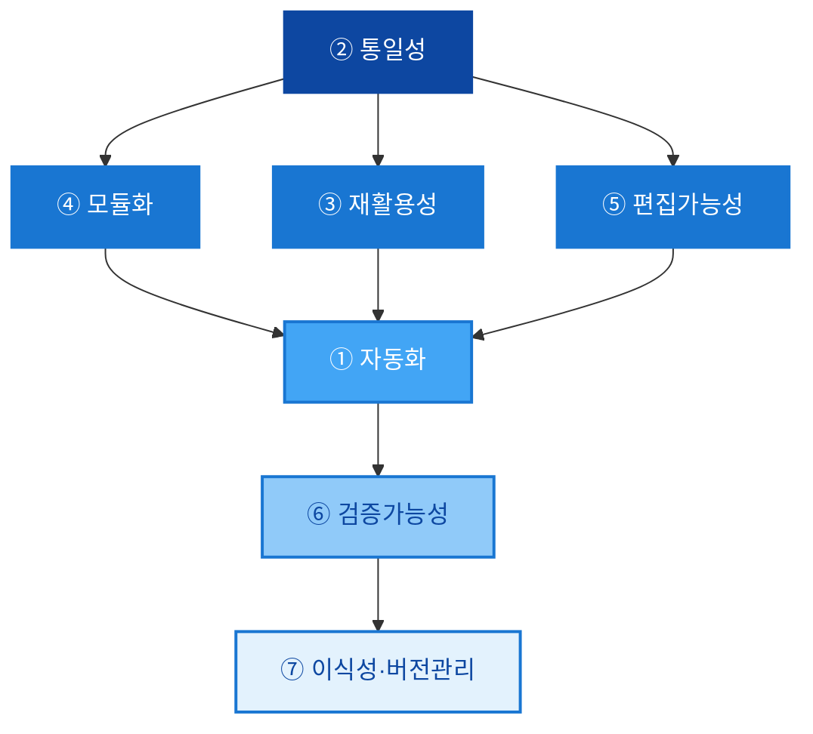
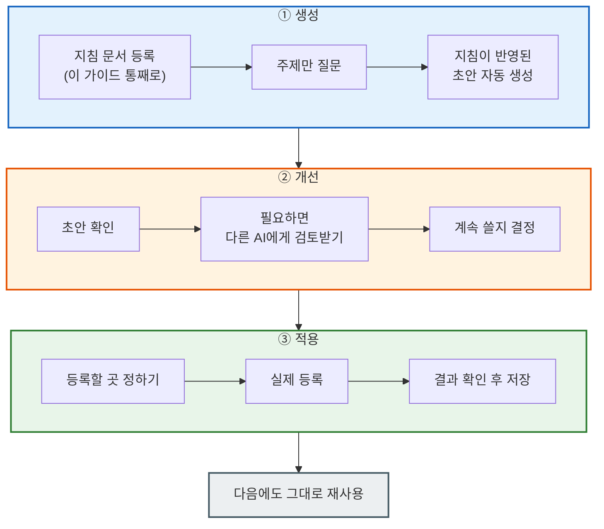
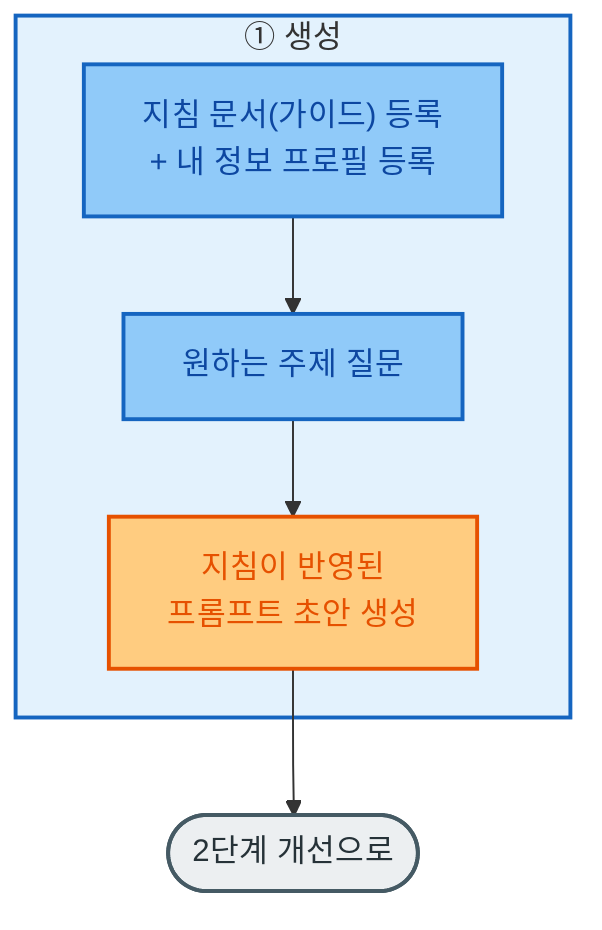
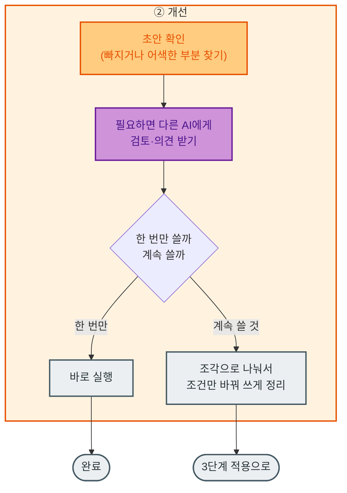
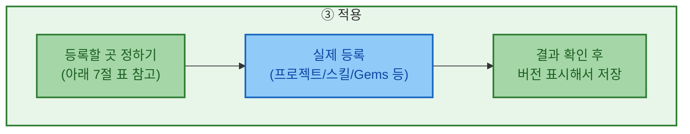

# 통합 프롬프트 마스터 가이드

이 문서는 AI에게 원하는 결과를 정확하게 얻기 위한 프롬프트 작성법을 정리한 가이드입니다.

>**요약**: 
프롬프트에 포함되는 내용을 기존 5대 구성요소·CoT/ToT·대화 진행 방법·내 정보 프로필로 구성하고, 
① 스킬/프롬프트 **설계 원칙을 7개로 확장**, 
② 프롬프트를 매번 손으로 다듬지 않도록 **"생성 → 개선 → 적용" 3단계**로 정리
(이 가이드 자체를 지침으로 먼저 등록해두고, 그다음부터는 주제만 던지면 지침이 반영된 초안이 나오는 방식), 
③ Claude/Gemini 등에도 동일하게 적용. **플랫폼별 등록·운영 방법**을 신설. 

## 1. 프롬프트에 들어가야 할 5가지

명확한 응답을 유도하기 위해 프롬프트는 다음 5가지 요소를 포함해야 합니다.

* **지시 (Instruction)**: AI가 수행할 주요 작업과 핵심 목표를 구체적이고 간결하게 명시합니다.
* **맥락 (Context)**: 작업의 배경 정보나 상황을 제공하여 질문의 의도에 맞는 관련성 높은 응답을 유도합니다.
* **역할 (Role)**: AI에게 특정 역할(예: 분야별 전문가, 컨설턴트 등)을 부여하여 전문성과 문제 해결 성능을 높입니다.
* **예시 (Examples)**: 복잡하거나 모호한 작업일수록 원하는 출력의 사례(Q&A 쌍 등)를 제공하여 패턴을 학습시킵니다.
* **형식 (Formatting)**: 결과물의 포맷(마크다운, JSON, 표, 불렛 포인트 등)을 명확히 지정합니다. 구조화를 위해 XML 태그(`<instruction>`, `<example>` 등)와 마크다운 문법을 적극 활용합니다.

## 2. 깊게 생각하게 만드는 방법 (CoT & ToT)

* **단계별로 생각하기 (CoT, Chain of Thought)**: "단계별로 생각해서 답변해줘"라고 지시해서, AI가 바로 답을 내지 않고 충분히 생각할 공간을 갖게 합니다.
* **여러 갈래로 따져보기 (ToT, Tree of Thought)**: 한 가지 방법만 보지 않고, 가능한 방법 여러 개를 나열한 뒤 각각 장단점을 비교해서 고르게 합니다.
* **여러 번 생각해서 답 고르기 (Self-consistency)**: 같은 문제를 다른 방식으로 최소 2번 이상 풀어보게 한 뒤, 가장 일관되고 그럴듯한 답을 고르게 합니다.
* **근거를 밝히게 하기**: 결론만 내지 말고, 왜 그렇게 판단했는지(출처, 데이터, 논리)를 반드시 함께 쓰게 합니다.

## 3. 대화 진행 방법

* **넓게 뽑고 → 좁혀서 다듬기**: 먼저 아이디어를 여러 개 넓게 뽑아내고, 그중 하나를 골라 자세히 다듬는 식으로 프롬프트를 두 번에 나눠 연결합니다.
* **미리 채우기**: AI가 답변을 시작할 첫 문장을 사용자가 미리 정해줍니다.
* **다시 쓰기**: "이런 기준으로 고쳐줘"처럼 명확한 평가 기준을 주고 다시 쓰게 해서, 여러 번에 걸쳐 품질을 올립니다.

## 4. 나에 대한 정보 미리 알려주기 (내 정보 프로필)

매번 내 상황을 새로 설명하지 않으려면, 아래 세 가지를 미리 정리해서 프롬프트 앞부분이나 시스템 지침에 등록해 둡니다. 이렇게 등록해 둔 "내 정보 세트"를 **내 정보 프로필**이라고 부릅니다.

* **누구인지**: 직업, 주로 다루는 분야, 얼마나 익숙한지(초보/전문가)
* **어떤 결과물을 원하는지**: 완성된 글 vs 간단한 개요, 답변 길이, 원하는 출력 형태
* **어떤 말투를 원하는지**: 전문적인 말투인지 편한 말투인지, 반대 의견도 듣고 싶은지

---

## 5. 프롬프트/스킬 설계 원칙 (7대 원칙)

기존 5개 원칙에, 실제 스킬 운영에서 드러나는 두 가지를 더해 7개로 확장합니다. ⑥⑦은 신님의 기존 스킬(HWPX validate 게이트, ai-strategy-report/design-doc-architect의 Phase Gate, 스킬 버전 v3/v6)에서 이미 실천되고 있던 것을 원칙으로 명문화한 것입니다.

| # | 원칙 | 쉽게 말하면 | 실무 적용 예 |
|---|---|---|---|
| ① | **자동화** | 사람이 매번 손대지 않아도 처음부터 끝까지 순서대로 이어져서 결과가 나옴 | HWPX: `분석 → 읽기 → 설정 불러오기 → 조립 → 확인` |
| ② | **통일성** | 위치·글꼴·색 같은 기준이 항상 똑같이 적용됨 | 슬라이드/문서 템플릿의 설정파일, 마스터 슬라이드 |
| ③ | **재활용성** | 한 번 만든 걸 조건만 바꿔서 계속 써도 품질이 유지됨 | 스킬의 실행 조건 + 바꿔 쓸 수 있게 만든 지침 |
| ④ | **모듈화** | 전체를 한 번에 만들지 않고, 작은 조각으로 나눠서 조립해서 씀 | character-consistency(인물 정하기) → veo-scene-director(영상 만들기)처럼 스킬을 역할별로 나눔 |
| ⑤ | **편집가능성** | 기준(마스터/설정) 하나만 고치면 전체 결과물에 한 번에 반영됨 | PPTX 마스터 편집, 설정값만 바꾸면 전체가 바뀌는 구조 |
| ⑥ | **검증가능성** *(신규)* | 결과가 맞는지 확인하는 절차가 따로 있음 | HWPX 결과 확인 통과, 승인 없이는 다음 단계로 못 넘어가는 규칙 |
| ⑦ | **이식성·버전관리** *(신규)* | 같은 지침을 다른 AI로 옮겨도 그대로 쓸 수 있고, 몇 번째 수정본인지 표시해 둠 | 스킬 버전 v3/v6/v2.7 표시, 스킬 파일로 묶어서 저장 |

> **⑥⑦은 왜 필요한가**: ①~⑤는 "결과물을 어떻게 잘 만들 것인가"에 관한 원칙입니다. ⑥은 "만든 결과가 실제로 맞는지 어떻게 확인하는가", ⑦은 "이 지침을 다른 AI로 옮겨도 똑같이 작동하는가"를 다룹니다. Gemini와 Claude를 함께 쓰는 지금 같은 경우, ⑦이 없으면 같은 지침을 도구마다 새로 만들어야 합니다.

### 5-1. 원칙 간 위계 구조

7개 원칙은 나열식이 아니라 **의존 관계**를 가집니다. "통일성"이라는 기준선이 먼저 있어야 "모듈화·재활용성·편집가능성"이 의미를 갖고, 이 세 가지가 갖춰져야 비로소 "자동화"가 가능해지며, 자동화된 결과는 "검증가능성"으로 신뢰를 확인받고, 마지막으로 "이식성·버전관리"를 통해 다른 플랫폼/다음 버전으로 이어집니다. 색은 파란색 한 계열만 쓰고, **진할수록 더 근본적인(선행) 원칙**이라는 뜻입니다.



---

## 6. 프롬프트 만드는 과정: 생성 → 개선 → 적용

핵심은 이겁니다 — **이 가이드(1~5절)를 매번 사람이 손으로 체크하는 게 아니라, AI에게 지침으로 미리 등록해 둡니다.** 그러면 이후에는 주제만 던져도 AI가 이 지침(5대 구성요소, CoT/ToT, 7대 원칙)에 맞춰 초안을 알아서 만들어 줍니다. 그래서 흐름은 **"생성(지침 기반으로 바로 만들기) → 개선(사람이 다듬기) → 적용(실제로 등록해서 계속 쓰기)"** 3단계입니다. 한 장에 다 넣으면 복잡하니 개괄 1장 + 단계별 세부 3장으로 나누고, 각 단계는 핵심만 3개씩 담았습니다.

### 6-1. 개괄 (전체 흐름)



> ※ 3단계(적용)에서 결과가 마음에 안 들면 2단계(개선)로 돌아가 다시 다듬습니다. 도식에는 되돌아가는 화살표를 넣지 않고 문구로만 안내합니다.

### 6-2. ① 생성 단계 세부

핵심은 "매번 설명하지 않기"입니다. 이 가이드 문서(1~5절)를 AI에 미리 올려두고 "이 지침대로 만들어줘"라고 한 번 등록해 두면, 그다음부터는 주제만 던져도 5대 구성요소·CoT/ToT·7대 원칙이 이미 반영된 초안이 나옵니다.



### 6-3. ② 개선 단계 세부

생성 단계에서 이미 지침이 반영된 초안이 나왔으니, 여기서는 **사람이 실제로 읽어보고 다듬는** 단계입니다. 애매하거나 중요한 내용이면 다른 AI에게 보여주고 의견을 받아 반영합니다.



### 6-4. ③ 적용 단계 세부

계속 쓸 것으로 정리된 지침을 실제 도구(Claude/Gemini/ChatGPT)에 등록해서 반복 사용하는 단계입니다.



> ※ 등록한 결과가 기대와 다르면 2단계(개선)로 돌아가 다시 다듬습니다.

---

## 7. 어디에 등록해서 쓸까 (플랫폼별 적용 방법)

같은 지침이라도 도구마다 등록하는 방식이 다릅니다. "③ 적용" 단계를 실제로 어디에 넣을지 정리한 표입니다.

### 7-1. Claude

| 방식 | 이게 뭔가요 | 언제 쓰면 좋은가 |
|---|---|---|
| **프로젝트** | 대화창 상단에 "기본 지침"과 참고 파일을 걸어두는 기능. 여러 대화에서 같은 말투·맥락·자료를 계속 씀 | 가볍게 개인화만 하고 싶을 때. 조각으로 나눠 쓰긴 어려움 |
| **스킬** | 지침 파일 + 필요한 스크립트를 하나로 묶어(.skill 파일) "스킬 저장" 버튼으로 등록. Claude Code에서는 정해진 폴더에 넣기만 하면 됨 | 자동화·조각화·일괄수정까지 다 필요할 때 가장 적합. "승인 후 다음 단계로" 같은 규칙이나, `분석→읽기→조립→확인`처럼 여러 단계를 통째로 안에 넣을 수 있음 |
| **Claude Code + 스크립트** | AI가 매번 판단하지 않고, 정해진 코드대로만 똑같이 처리하게 만드는 방식(예: PPTX 마스터 일괄 편집) | "편집가능성"이 특히 중요한, 매번 정확히 똑같이 반복돼야 하는 작업 |

### 7-2. Gemini

| 방식           | 이게 뭔가요                                                                                  | 언제 쓰면 좋은가                                          |
| ------------ | --------------------------------------------------------------------------------------- | -------------------------------------------------- |
| **Gems**     | 짧은 지침(역할 + 출력 규칙)을 등록해두는 기능                                                             | 업로드한 이미지의 1~2단계. 통일성·재활용성은 확보되지만 조각으로 나눠 쓰긴 어려움    |
| **Notebook** | 올려둔 자료를 근거로 답변하게 하는 기능. Gems가 만든 답변을 자료로 쌓아두고, 이후 디자인 지침(레이아웃/색/아이콘)을 따로 요청해서 시각 자료를 만듦 | 업로드한 이미지의 3~5단계. "생성→개선→적용"을 노트북 안에서 한 번 더 반복하는 구조 |

### 7-3. ChatGPT (참고)

| 방식 | 이게 뭔가요 |
|---|---|
| **Custom GPT / Projects** | 지침 + 참고파일 등록. Claude 프로젝트와 비슷하지만, 코드를 묶어서 자동 실행시키는 "스킬" 같은 기능은 상대적으로 약함 |

### 7-4. 등록 전 마지막 확인

- [ ] 지침이 7대 원칙을 다 만족하는가
- [ ] 예시가 최소 1개는 들어있는가
- [ ] 결과가 맞는지 확인하는 절차가 있는가
- [ ] 몇 번째 수정본인지 표시했는가 (v1, v2…)
- [ ] 다른 도구로 옮길 때 고쳐야 할 부분(그 도구에서만 쓰는 용어 등)이 따로 표시돼 있는가

---

## [부록] 마스터 프롬프트 템플릿 예시

1절(5대 구성요소)과 2절(CoT/ToT), 그리고 6번째 줄의 검증(⑥ 검증가능성)을 담아, **복잡한 과제 하나를 지시할 때** 쓰는 템플릿입니다. 이게 바로 6-2절에서 말한 "① 생성 단계의 지침 문서"의 실제 예시입니다 — 이 템플릿을 그대로 Claude 프로젝트/스킬이나 Gemini Gems에 먼저 등록해두면, 그다음부터는 `[구체적인 목표와 지시 내용]` 자리에 주제만 바꿔 넣어도 지침이 반영된 답이 나옵니다.

> 이 프롬프트 자체를 반복 재사용할 스킬로 만들 계획이라면, 등록 전에 7-4절 체크리스트(통일성·재활용성·모듈화·편집가능성·이식성까지)로 한 번 더 점검하세요. 아래 템플릿은 단일 과제용이라 그 부분까지는 담고 있지 않습니다.

```text
너는 [도메인/분야]의 최고 전문가로서 [역할]을 수행한다.
나의 현재 정보 프로필은 다음과 같다: [나의 전문성, 원하는 말투, 원하는 출력 형태 요약]

다음의 지시 사항을 수행하라:
[구체적인 목표와 지시 내용]

이 문제를 해결하기 위해 즉시 답을 내지 말고, 다음 과정을 거쳐라:
1. (CoT) 문제의 유형과 핵심 목표를 명확히 정의하고 세분화하라.
2. (ToT) 해결을 위해 가능한 접근 경로(대안)를 최소 3가지 이상 제시하라.
3. (평가) 각 경로를 실무적 기준과 실현 가능성을 바탕으로 평가 및 가지치기하라.
4. (일관성) 서로 다른 추론을 거쳐 가장 합리적이고 일관된 최적의 경로를 선택하라.
5. (근거) 최종 결론에 도달한 이유와 근거(데이터, 논리적 추론)를 명시하라.
6. (검증) 결과물이 반영해야 할 검증 기준(형식/데이터 정합성 등)을 명시하고, 통과 여부를 스스로 점검하라.

출력은 반드시 [원하는 포맷/마크다운/XML 등]으로 작성하며, 다음 예시의 구조를 참고하라.

<example>
### 1. 문제 정의 및 세분화 (CoT)
- **핵심 목표**: 신규 개발된 'AI 기반 문서 자동화 솔루션'의 초기 기업 고객(레퍼런스) 3곳을 한 달 내에 확보한다.
- **하위 과제**: 1) 초기 타겟 고객군 좁히기, 2) 접근 채널 선정, 3) 설득을 위한 가치 제안(Value Proposition) 도출.

### 2. 해결 경로 탐색 (ToT)
- **경로 A (인바운드 콘텐츠 마케팅)**: 블로그와 웨비나를 통해 자동화의 필요성을 알리고 자연스러운 잠재 고객 유입을 유도한다.
- **경로 B (아웃바운드 콜드 메일)**: 문서 작업이 많아 고충이 심한 중소형 법무/회계 법인 100곳을 추출하여 타겟화된 제안 메일을 발송한다.
- **경로 C (기존 파트너십 활용)**: 기존 협력 중인 IT 인프라 구축(SI) 업체의 영업망을 활용하여, 도입 가능성이 높은 기업을 직접 소개받는다.

### 3. 대안 평가 및 가지치기 (평가)
- **경로 A 평가**: 장기적인 브랜딩에는 필수적이나, '한 달 내 3곳 확보'라는 단기 목표에는 시간이 너무 오래 걸리므로 현재 우선순위에서 배제한다 (가지치기).
- **경로 B 평가**: 타겟이 명확하고 즉각적인 실행이 가능하지만, 스팸으로 분류될 확률이 높아 전환율이 낮을 수 있다.
- **경로 C 평가**: 파트너의 신뢰도를 빌릴 수 있어 미팅 성사율과 도입 확률이 가장 높다. 단, 파트너사와의 수익 배분율 협의가 필요하다.

### 4. 최종 결론 및 근거 (일관성 및 근거)
- **최종 결론**: 단기 레퍼런스 확보를 위해서는 **'경로 C(파트너십)를 핵심 동력으로 삼고, 경로 B(콜드 메일)를 보조 채널로 활용하는 하이브리드 전략'**이 가장 타당하다.
- **도출 근거**: B2B SaaS의 초기 성장은 신뢰(Trust) 기반의 레퍼런스가 핵심이다. 파트너 추천을 통한 영업 전환율이 콜드 메일 등 냉대 채널보다 평균 4배 이상 높으므로, 전환율이 높은 경로 C에 영업력을 80% 집중하고 파트너망이 닿지 않는 니치 마켓에 한해 경로 B를 20% 병행하는 것이 자원 대비 효율이 가장 뛰어나다.

### 5. 최종 결과물: 초기 실행 계획표
| 실행 단계 | 주요 액션 아이템 | 대상 및 채널 | 예상 일정 |
| :--- | :--- | :--- | :--- |
| **1. 파트너 미팅** | 우호적인 SI 파트너사 3곳 방문 및 솔루션 시연 | 오프라인 대면 미팅 | 1주 차 |
| **2. 리드 발굴** | 파트너사 추천 기업 및 직원 수 50인 이하 법무법인 30곳 리스트업 | 파트너망 / 링크드인 | 2주 차 |
| **3. PoC 제안** | 긍정적 회신을 준 리드 대상 1개월 무료 기술 검증(PoC) 제안 | 온/오프라인 하이브리드 | 3~4주 차 |
</example>

모든 사고 과정을 단계별로 명확히 드러낸 후 최종 결과물을 제시하라.
```