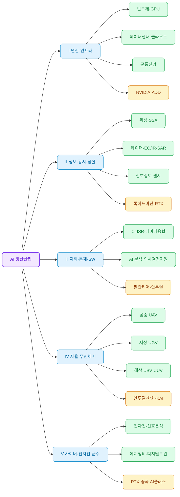

# AI 융합 방위산업 동향 분석

## Executive Summary

작성일자: 2026.08.31

### ■ 전체 내용 요약

- AI 융합 방위산업은 연산·인프라(Ⅰ)→ISR(Ⅱ)→지휘통제·SW(Ⅲ)→자율무인체계(Ⅳ)로 이어지고 사이버·전자전·군수(Ⅴ)가 이를 지원하는 5대 분야 구조이며, 본 보고서는 Ⅲ·Ⅳ를 중심으로 심층분석했다.
- 시장규모는 정의범위에 따라 2026년 기준 10.9억~297.3억 달러로 편차가 크며, 전체 AI산업 대비 방산AI 비중은 약 0.7~8.0% 수준으로 추정된다.
- 미국은 CDAO 주도의 빅테크 조달과 '전쟁부' 개칭 등 조직·문화 변화가 동시에 진행 중이며, 소프트웨어 신생기업(안두릴·팔란티어)과 전통 프라임(록히드마틴·RTX)이 Golden Dome 컨소시엄에서 대등하게 결합하는 새로운 산업구조가 자리잡고 있다.
- 중국은 군민융합을 국가대전략으로 추진하며 국영대기업 중심의 위계구조를 유지하되, 민간 빅테크로도 그 영향이 확산되고 있음이 미국의 규제 대응을 통해 간접 확인된다.
- 한국은 2026년 국방예산 중 AI기반 유무인복합전투체계 투자가 77.6% 증가하며 가장 가파른 증가세를 보였고, 독자 파운데이션모델 개발과 방산 스타트업 육성이 동시에 추진되고 있으나 조달제도 성숙도는 초기 단계다.

### 목차

| 챕터  | 제목                           |
| --- | ---------------------------- |
| 1   | 글로벌 AI 방산 시장 개관 (+ 방위산업의 구조) |
| 2   | 방산 관련 기술동향                   |
| 3   | 미국 AI 방산 정책·현황               |
| 4   | 중국 AI 방산 정책·현황               |
| 5   | 한국 AI 방산 정책·현황               |
| 6   | 각국 대표기업 현황                   |
| 7   | 기업분석 — 록히드마틴                 |
| 8   | 기업분석 — 안두릴                   |
| 9   | 기업분석 — RTX                   |
| 10  | 기업분석 — 팔란티어                  |
| 11  | 기업 연계 생태계 분석                 |
| 12  | 종합 분석 및 시사점                  |
| 13  | 전체 요약                        |
### 전체 보고서의 한계

본 보고서는 5대 분야 중 Ⅰ(연산·인프라)·Ⅱ(ISR)는 개관·요약 수준으로, Ⅴ(사이버·전자전·군수)는 부분적으로 다뤘다(상세는 챕터1 "본 보고서가 다루는 범위와 한계" 참조). 중국 관련 챕터는 1차 공식자료 접근 제한으로 2·3차 자료 의존도가 높다. 시장규모 수치는 조사기관별 정의범위 차이로 인한 편차가 크므로 절대치보다 방향성 중심으로 해석해야 한다.

---

## 챕터 1. 글로벌 AI 방산 시장 개관

### 0. 방위산업의 구조: 「AI 융합 방위산업」 5대 분야

AI가 결합된 방위산업은 단일 산업이 아니라, 서로 다른 계층이 연쇄적으로 결합된 구조다. 본 보고서는 이를 5대 분야로 구분해 다룬다.

| 분야 | 성격 | 세부 구성요소 |
|---|---|---|
| Ⅰ. AI 연산·디지털 인프라 | AI를 구동하는 기반 계층 | AI반도체, GPU·AI가속기, 엣지컴퓨팅, 국방클라우드, 데이터센터, 군통신인프라 |
| Ⅱ. 전장 정보·감시·정찰(ISR) | 전장의 데이터를 수집하는 감지 계층 | 위성, 레이더, EO/IR, SAR, 각종 센서, 정보수집체계 |
| Ⅲ. AI 지휘·통제 및 국방 소프트웨어 | 데이터를 분석하고 의사결정을 지원하는 지능 계층 | AI분석플랫폼, C4ISR, 지휘통제, 전장데이터융합, 의사결정지원, 국방클라우드SW |
| Ⅳ. 자율·무인 방위체계 | AI의 판단을 물리적 행동으로 전환하는 실행 계층 | UAV·무인전투기, UGV, USV, UUV, 군사용로봇, 군집무인체계 |
| Ⅴ. 사이버·전자전 및 지능형 군수지원 | 전장 보호와 지속적 작전능력을 담당하는 지원 계층 | AI기반 사이버보안, 전자전(EW), 신호정보분석, 예지정비, AI군수관리, 디지털트윈, 시뮬레이션 |

※ 무기체계의 자율성을 다루는 Ⅳ번 분야는 "자율무기"보다 "자율·무인 방위체계"라는 표현이 더 포괄적이고 중립적이어서 본 보고서에서 이 용어를 사용한다.

Ⅰ~Ⅳ는 정보가 흐르는 순서(인프라→수집→판단→실행)로 연결되며, Ⅴ는 이 네 계층 전체를 가로질러 보호·지속시키는 지원계층이다.

나눌 만합니다. 다만 하위분류 + 기업을 모두 붙이면 노드가 20개→40개 가까이 늘어 flowchart LR에서는 너무 빽빽해질 수 있어서, **하위분류는 늘리되 기업 태그는 도메인 레벨에만 유지**하는 절충안을 추천합니다.

Ⅰ, Ⅱ, Ⅳ는 챕터1 표에도 이미 성격이 다른 하위요소가 여러 개 있어 나누는 게 자연스럽고, Ⅲ·Ⅴ는 억지로 3개씩 채우면 밀도만 늘어날 수 있습니다.

※ Ⅴ(사이버·전자전 및 지능형 군수지원)는 위 흐름의 특정 단계가 아니라 Ⅰ~Ⅳ 전 계층에 걸쳐 보호·지속 기능을 제공하는 공통 지원계층이다

일반 독자를 위해 인체에 비유하면 다음과 같다.

| 인간   | AI 방산       |
| ---- | ----------- |
| 눈    | 위성·카메라·레이더  |
| 귀    | SIGINT·전자정보 |
| 뇌    | AI 분석·판단    |
| 신경망  | 통신·C4ISR    |
| 손·발  | 드론·로봇·무인체계  |
| 기억   | 데이터 플랫폼     |
| 면역체계 | 사이버보안       |
| 건강관리 | 예지정비        |

#### 본 보고서가 다루는 범위와 한계

챕터7~10에서 심층분석할 4개 기업(록히드마틴·안두릴·RTX·팔란티어)의 사업영역이 Ⅲ·Ⅳ 분야에 집중되어 있는 만큼, 본 보고서의 서술 밀도도 분야별로 균일하지 않다.

| 분야 | 본 보고서 커버리지 | 비고 |
|---|---|---|
| Ⅰ 연산·인프라 | 개관 수준(챕터2) | 데이터센터 확보경쟁 위주로 다루며, 반도체 벤더별 상세분석은 범위 밖 |
| Ⅱ ISR | 요약 수준(챕터2) | 위성·SSA를 개괄했으나 레이더·EO/IR·SAR 등 개별 센서기술은 범위 밖 |
| Ⅲ 지휘·통제·SW | 심층(챕터2·3·9·10) | JADC2, 팔란티어 기업분석 등에서 집중적으로 다룸 |
| Ⅳ 자율·무인체계 | 심층(챕터2·8) | 드론스웜 동향, 안두릴 기업분석에서 집중적으로 다룸 |
| Ⅴ 사이버·전자전·군수 | 부분적(챕터2·4) | 중국 전자전 사례 위주이며 미국·한국의 세부 프로그램은 상대적으로 얕게 다룸 |

---

### 1. 시장 규모 및 성장 전망

#### 정의범위별 시장 추정치 편차

조사기관마다 AI 방산 시장의 정의범위가 상이해 2026년 기준 추정치가 10.9억 달러에서 297.3억 달러까지 27배 이상 벌어진다. 세부 수치는 아래 표와 같다.

| 시장 정의 | 출처기관 | 2026년 규모 | 2030년(또는 목표연도) 전망 | CAGR |
|---|---|---|---|---|
| 생성형AI 국방 응용(협의) | Research and Markets | $1.09B | $2.53B(2030) | 23.4% |
| AI 국방·안보 전반(중간 정의) | Research and Markets | $15.96B | $25.58B(2030) | 12.5% |
| AI+로봇틱스 항공우주·방산(광의) | GlobeNewswire 취합 | $29.73B | $44.09B(2030) | 10.4~10.5% |
| AI 군사시장(military AI) | Persistence/Grand View/Precedence 등 5개사 평균 편차 | $9.3B~$30B | $19.3B~$35.6B(2030~35) | 11~20% |

> 출처 : [Generative Artificial Intelligence in Defense Market Report 2026(Research and Markets, 2026)](https://www.researchandmarkets.com/reports/6035166/generative-artificial-intelligence-in-defense?utm_code=rl_m8h5gm&utm_exec=chdomsai)
>
> 출처 : [Artificial Intelligence in Defense and Security Market Report 2026(Research and Markets, 2026)](https://www.researchandmarkets.com/reports/6215084/artificial-intelligence-in-defense-security)
>
> 출처 : [AI and Robotics in Aerospace and Defense Report 2026(GlobeNewswire, 2026.01.29)](https://finance.yahoo.com/news/artificial-intelligence-robotics-aerospace-defense-144200032.html)
>
> 출처 : [AI in Military Market Size & Competitive Analysis(Persistence Market Research, 2026.07.25)](https://www.persistencemarketresearch.com/market-research/ai-in-military-market.asp)

#### 전체 AI 산업 대비 방산 AI 비중

방산 AI는 전체 AI 산업 내에서 아직 작은 비중이나 성장률은 전체 평균과 대등하거나 상회한다.
- 광의 정의(AI+로봇틱스 방산 297.3억 달러)를 전체 AI산업(3,717억~4,506.6억 달러)과 대비하면 약 6.6~8.0% 수준이다.
- 협의 정의(생성형AI 국방 10.9억 달러)를 생성형AI 전체 시장(833억~1,610억 달러)과 대비하면 0.7~1.3%로 낮아진다. 정의범위가 좁을수록 비중이 작게 산출되는 구조적 특성이 있다.

| 구분 | 출처기관 | 규모(연도) |
|---|---|---|
| 글로벌 AI 산업 전체(인프라+SW+서비스 합산) | 산업연구원(KIET), KDI 재인용 | $371.71B(2025) |
| — AI 인프라(데이터센터·반도체 등) | 산업연구원(KIET) | $174.42B(2025) |
| — AI 소프트웨어 | 산업연구원(KIET) | $149.24B(2025) |
| — AI 서비스 | 산업연구원(KIET) | $48.05B(2025) |
| 글로벌 AI 시장 전체 | Straits Research | $450.66B(2026) |
| 글로벌 생성형AI 시장(협의 비교군) | GMI/Fortune Business Insights | $83.3B~$161.0B(2026) |

> 출처 : [글로벌 AI 산업의 현황 및 성장 요인 분석과 시사점(산업연구원, KDI 경제교육정보센터, 2026)](https://eiec.kdi.re.kr/policy/domesticView.do?ac=0000197499)
>
> 출처 : [Artificial Intelligence Market Size(Straits Research, 2026)](https://straitsresearch.com/ko/report/artificial-intelligence-market)

#### 지역별 동향

북미가 압도적 지역 점유율을 유지하는 가운데 아시아태평양이 가장 빠른 성장률을 보인다.
- 북미는 2026년 42%의 매출 점유율로 시장을 주도하며, 이는 미 국방부의 방대한 AI 투자 파이프라인과 CDAO의 실전 배치 프로그램, 기밀취급 인가를 받은 방산 프라임 계약사 밀집도에 기인한다.
- 아태지역은 중국 인민해방군의 지능화 전략, 인도의 자주국방 현대화, 일본의 GDP 2% 국방비 확대 방침이 맞물려 가장 빠른 성장률을 기록할 전망이다.

> 출처 : [AI in Military Market Size & Competitive Analysis, 2033(Persistence Market Research, 2026.07.25)](https://www.persistencemarketresearch.com/market-research/ai-in-military-market.asp)

### 2. 성장 동인

시장 성장을 이끄는 공통 요인은 자율무기체계 실전배치, AI기반 지휘통제 시스템 확산, 예측정비 수요 확대이다.
- AI 국방·안보 시장의 역사적 성장은 자율무기체계 실행, AI기반 지휘통제 시스템 활용, 예측정비 솔루션 도입, 안면·생체인식 시스템 배치, 임무계획 지원서비스 투자가 견인했다.
    - 향후 전망 기간에는 실시간 AI 위협분석 확대, 다중 방산영역에 걸친 자율시스템 통합, AI지원 병참·공급망 최적화, AI기반 시뮬레이션·훈련 플랫폼 도입, 상호운용 가능한 AI 국방네트워크 수요가 성장을 뒷받침할 것으로 분석된다.

> 출처 : [Artificial Intelligence in Defense and Security Market Report 2026(Research and Markets, 2026)](https://www.researchandmarkets.com/reports/6215084/artificial-intelligence-in-defense-security)

---

## 챕터 2. 방산 관련 기술동향

본 챕터는 확정된 기술구조(반도체·컴퓨팅 인프라 → AI 핵심기술 → 통합플랫폼 → 응용도메인 → 작전수행)를 기준으로 서술한다.

### 1. 인프라 계층: 반도체·컴퓨팅

#### AI 데이터센터 확보 경쟁

미 국방부가 자체 기지 부지에 상업용 하이퍼스케일 AI 데이터센터를 유치하는 방향으로 전환하고 있다.
- 국방부는 포트후드, 포트브래그, 포트블리스, 듀게이웨이 시험장 등 유휴 기지부지 개발 제안요청을 발주했으며, 현대 AI시설은 개소당 50~100메가와트 이상의 전력을 소비한다.
- 국방부 자체 AI전략 문서는 데이터센터부터 엣지까지 컴퓨팅 인프라 확장에 상당한 투자를 예고했으나, 프로젝트는 초기 단계로 공식 계약사·운영일정은 아직 미공개 상태다.

> 출처 : [Pentagon Plans AI Data Centers at Military Bases(Military.com, 2026.07.27)](https://www.military.com/pentagon-plans-ai-data-centers-at-military-bases-across-multiple-branches)
>
> 출처 : [AI Strategy for the Department of War(U.S. DoD, 2026.01)](https://media.defense.gov/2026/Jan/12/2003855671/-1/-1/0/ARTIFICIAL-INTELLIGENCE-STRATEGY-FOR-THE-DEPARTMENT-OF-WAR.PDF)
>
> 출처 : [Pentagon Solicits AI Data Center Proposals for Four(Introl, 2026.01.14)](https://introl.com/blog/dod-military-base-ai-data-centers-2026)

### 2. 통합 플랫폼/데이터 융합 계층

#### JADC2(합동전영역지휘통제)

약 95억 달러 규모로 추산되는 JADC2는 전군의 센서·시스템을 단일 네트워크로 연결하는 최대 규모 통합사업이다.
- 국방부는 이행계획을 발표하며 전장인식과 의사결정 주기 단축, C2 시스템 복원력 강화를 목표로 다국적 훈련을 지속하고 있다.
    - 다만 CSBA 등 싱크탱크는 중앙집중화 방식과 예산배분에 따라 '중간 수준의 진전(middling progress)'에 그칠 위험이 있다고 지적하며, 이 경우에도 미군이 상대적으로 열위에 놓이지 않도록 정책적 안전장치가 필요하다고 권고한다.

> 출처 : [Big Centralization, Small Bets... JADC2's Trajectory(CSBA, 2026.02.27)](https://csbaonline.org/research/publications/big-centralization-small-bets-and-the-warfighting-implications-of-middling-progress-three-concerns-about-jadc2s-trajectory)
>
> 출처 : [Multi-Nation Training Efforts... $9.5 Billion JADC2 Effort(Defense Security Monitor, 2024.11.12)](https://dsm.forecastinternational.com/2024/11/12/multi-nation-training-efforts-and-real-world-use-help-advance-9-5-billion-jadc2-effort/)

#### 민간 빅테크 파트너십(분류망 배치)

2026년 5월 국방부가 8개 AI기업과 계약을 맺고 이들 모델을 기밀 분류망에 배치하기로 하면서 통합플랫폼 경쟁구도가 재편됐다.
- SpaceX, OpenAI, Google, NVIDIA, Reflection, Microsoft, Oracle, AWS가 국방부 IL6·IL7 등급 분류망에 AI를 배치하는 계약을 체결했으며, 목적은 전장 데이터 통합·상황이해·의사결정 지원이다.
- 앤트로픽은 '공급망 리스크'로 지정돼 이번 계약에서 제외됐다.
- 2025년 7월 CDAO가 구글·오픈AI·앤트로픽·xAI 4개사에 최대 8억 달러 규모 계약을 발주했던 것과 비교하면, 약 10개월 사이 참여기업 구성이 크게 재편됐다.

> 출처 : [Pentagon makes agreements with 8 companies(Nextgov/FCW, 2026.05.04)](https://www.nextgov.com/artificial-intelligence/2026/05/pentagon-makes-agreements-7-companies-add-ai-classified-networks/413264/)
>
> 출처 : [Seven AI firms agree to deploy tech in Pentagon classified networks(The Hill, 2026.05.01)](https://thehill.com/policy/technology/5858995-pentagon-ai-companies-classified-work-deal/)

### 3. 응용 도메인별 동향

#### 3-1. 자율무기·무인체계(드론스웜)

자율 드론스웜이 실전배치 단계에 진입하며 전장의 속도와 경제성을 근본적으로 바꾸고 있다.
- 2026년 초 실전지역에서는 에이전틱 AI가 임무분담을 자율 재편하는 사례가 보고됐다. 드론 10기가 격추되면 남은 190기가 자동으로 표적을 재분배하는 방식이다.
- 미 국방부는 'Crucible' 이니셔티브로 4기 이상 무인기가 인간개입 없이 정찰·표적화 임무를 종단간 완수하는 능력을 시험 중이다.
- DARPA는 최대 500대 규모 자율드론 편대를 수납·발사하는 컨테이너형 인프라를 개발 중이며, 중국도 2026년 3월 'ATLAS' 드론스웜 운용체계와 'Swarm-2' 지상전투차량을 공개해 대응하고 있다.

> 출처 : [The Silicon Battlefield: Autonomous Weapons(TechNewsWorld, 2026.03.09)](https://www.technewsworld.com/story/the-silicon-battlefield-autonomous-weapons-and-the-next-era-of-warfare-180207.html)
>
> 출처 : [Pentagon preparing for drone swarm 'crucible'(DefenseScoop, 2026.03.31)](https://defensescoop.com/2026/03/31/pentagon-preparing-drone-swarm-crucible/)
>
> 출처 : [U.S. Explores Autonomous Containerized Drone Hubs(Army Recognition, 2026.05.11)](https://www.armyrecognition.com/news/army-news/2026/u-s-explores-autonomous-drone-containers-to-enable-persistent-swarm-warfare-from-dispersed-positions)

#### 3-2. 우주·위성 AI(요약)

위성은 드론과 유사하게 비가시적 전력승수 역할을 수행하며, AI 분석이 이를 가속화하고 있다.
- 미 우주군은 상업위성 영상·통신·SAR 데이터에 AI 분석을 결합해 군사우주력을 전환하는 중이며, 2026년 국방전략은 우주를 새로운 '높은 고지'로 규정한다.
- AI 기반 우주상황인식(SSA)은 적 위성의 궤도 이상기동이나 대위성무기 배치 징후를 탐지하는 핵심 역량으로 제시된다.

본 보고서에서는 우주·위성 AI를 별도 심층챕터로 다루지 않고 기술동향의 한 축으로만 요약한다.

> 출처 : [The commercial satellite revolution is changing warfare(DefenseScoop, 2026.08.07)](https://defensescoop.com/2026/08/07/commercial-satellite-revolution-changing-warfare-how-america-can-stay-ahead/)
>
> 출처 : [The Ultimate High Ground: Space in US Defense Strategy(Military.com, 2026.02.15)](https://www.military.com/feature/2026/02/12/ultimate-high-ground-space-us-defense-strategy.html)

#### 3-3. 사이버·전자전

AI는 전자전 영역에서 신호예측·교란기술을 고도화하는 데 활용되고 있다.
- 중국은 적의 교란장치를 역교란하기 위한 전자전 시스템에 AI를 도입하는 이른바 'AI 플러스' 전략을 추진 중이며, 위성 없이도 최대 5,000킬로미터 떨어진 드론을 교란하는 방법을 예측하는 데 AI를 활용한다.

이 영역은 국가별 세부현황이 상이해 챕터 3·4·5(미·중·한 정책현황)에서 이어서 다룬다.

> 출처 : [[AI 프리즘] 중국군 AI 전면 도입…미국과 지능화 전쟁 경쟁(위키리크스한국, 2026.06.18)](http://www.wikileaks-kr.org/news/articleView.html?idxno=188704)

#### 3-4. 운용·정비·군수 및 훈련·시뮬레이션

예측정비와 AI기반 훈련 플랫폼이 도입되며 유지비용과 준비태세 관리 방식이 바뀌고 있다.
- AI 국방시장의 성장동인 중 하나로 예측정비 솔루션 도입이 꼽히며, 이는 장비 고장을 사전탐지해 가동률을 높이는 데 기여한다.
- 우주군은 다지역 가디언들이 가상시뮬레이션에 참여하는 분산형 디지털훈련 환경 'Space Warfighter Operational Readiness Domain'을 추진 중이다.

> 출처 : [Artificial Intelligence in Defense and Security Market Report 2026(Research and Markets, 2026)](https://www.researchandmarkets.com/reports/6215084/artificial-intelligence-in-defense-security)
>
> 출처 : [Space warfare in 2026: A pivotal year for US readiness(Defense News, 2026.02.23)](https://www.defensenews.com/space/2026/01/05/space-warfare-in-2026-a-pivotal-year-for-us-readiness/)

### 4. 거버넌스 제약: 인간통제·LAWS 규범

자율무기 확산에도 핵심 전략자산에 대해서는 인간통제 원칙이 국제적으로 유지되고 있다.
- 2024년 미중 정상은 핵무기 사용 결정을 AI가 아닌 인간의 통제 아래 유지해야 한다는 데 합의했으며, 이는 양국 모두 AI가 핵지휘통제체계에 미칠 위험을 전략안보 문제로 인식하고 있음을 보여준다.

다만 현재 공개자료만으로 각국이 완전자율무기까지 어디까지 허용할지는 불확실하며, 이는 챕터 12(종합분석 및 시사점)에서 전략적 함의로 재론한다.

> 출처 : [중국 AI 공공재론 이면 군민융합…한국 핵안보 전략 변수(에너지안전신문, 2026.08)](https://www.esnews.kr/news/articleView.html?idxno=5678)

---

## 챕터 3. 미국 AI 방산 정책·현황

### 1. 조직체계: CDAO와 DIU

CDAO(최고디지털·AI책임관실)는 2022년 6월 JAIC·DDS·최고데이터책임관실·Advana 4개 조직을 통합해 신설됐으며, 국방부 부장관 직속으로 보고체계가 격상됐다. 초대 국장 크레이그 마텔(2022.6~2024.3)에 이어 2024년 초부터 라다 플럼이 이끌고 있다.
- CDAO는 데이터·분석·AI 전략수립과 정책수립을 총괄하며, 자체 연구보다 상업AI 조달에 집중한다. Tradewinds Solutions Marketplace를 통해 비전통 방산기업의 조달 소요기간을 단축하는 방식을 취한다.
- FY2026 예산에서는 효율화 조치로 CTO 국이 폐지됐다. CDAO 자체 예산은 FY2025 기준 1억3990만 달러로 국방부 전체 규모에 비하면 작다.

국방혁신단(DIU)은 상업기술을 상업 속도로 조달하는 별도 조직으로, FY2026 예산요청 기준 9억7900만 달러(연구개발 6억6100만 달러 포함)를 확보해 CDAO보다 큰 예산을 운용한다.

> 출처 : [Realignment of DOD's Chief Digital and AI Officer(Congress.gov CRS, 2026)](https://www.congress.gov/crs-product/IN12615)
>
> 출처 : [DoD CDAO to Cut CTO Directorate in FY2026 Budget(MeriTalk, 2025.07.07)](https://www.meritalk.com/articles/dod-cdao-to-cut-cto-directorate-in-fy2026-budget/)
>
> 출처 : [Pentagon AI Budget Hits $13 Billion(Granted AI, 2026.02.24)](https://grantedai.com/blog/pentagon-ai-budget-beyond-darpa-funding)

### 2. 조달 관계 재편: 빅테크 파트너십

2025년 7월 CDAO는 구글·오픈AI·앤트로픽·xAI 4개사에 최대 8억 달러 규모 계약을 발주했다. 그러나 10개월 뒤인 2026년 5월에는 SpaceX·OpenAI·Google·NVIDIA·Reflection·Microsoft·Oracle·AWS 8개사가 IL6·IL7 등급 분류망 배치 계약을 맺으며 참여기업 구성이 재편됐고, 이 과정에서 앤트로픽은 '공급망 리스크'로 지정돼 제외됐다(세부내용은 챕터2 참조).

펜타곤 전체 AI 관련 예산은 2026년 130억 달러 규모로 추산되며, DARPA를 비롯한 여러 기관이 각자의 채널로 AI 기술을 조달하는 다원화된 구조를 이루고 있다.

> 출처 : [Pentagon Awards $800M in AI Contracts to Tech Giants(2025.07)](https://www.goodreads.com/author_blog_posts/25918352-pentagon-awards-800m-in-ai-contracts-to-tech-giants-a-historic-defense)
>
> 출처 : [Pentagon makes agreements with 8 companies(Nextgov/FCW, 2026.05.04)](https://www.nextgov.com/artificial-intelligence/2026/05/pentagon-makes-agreements-7-companies-add-ai-classified-networks/413264/)

### 3. 법제: FY2026 국방수권법(NDAA)

2025년 12월 18일 트럼프 대통령이 FY2026 NDAA에 서명하며 9000억 달러 규모 국방 지출을 승인했다.
- 법안에는 사이버사령부-민간 AI협력 로드맵 수립(2026.8.1까지), AI 샌드박스 환경 구축 태스크포스 설치(2026.4.1까지), AI 모델 평가·감독 전담팀 구성(2026.6.1까지) 등 구체적 시한이 명시된 AI 관련 조항이 다수 포함됐다.
- 이는 CDAO·CIO 등 기존 조직의 역할을 법률로 재확인하는 성격이 강해, 행정부 주도 조직개편과 의회의 감독강화 요구가 병행되는 구도로 해석할 수 있다.

> 출처 : [NDAA Expands US Trade, Technology, and Security Regulations in 2026(Fenwick & West/JD Supra, 2026)](https://www.jdsupra.com/topics/procurement-guidelines/defense-sector/ndaa)
>
> 출처 : [House/Senate Defense Committees Advance AI Provisions(Akin, 2025.09.03)](https://www.akingump.com/en/insights/alerts/housesenate-defense-committees-advance-ai-provisions-in-must-pass-defense-bills)

### 4. 조직문화 변화: "전쟁부(Department of War)" 개칭

2025년 9월 5일 트럼프 대통령이 행정명령 14347호에 서명해 국방부(DoD)를 전쟁부(Department of War)로 개칭하는 절차에 착수했다.
- 행정명령은 국방장관에게 '전쟁장관(Secretary of War)' 등 2차 명칭 사용을 승인했으며, 실제로 국방부 공식 웹사이트(defense.gov)가 war.gov로 리다이렉트되고 펜타곤 내 표지판도 교체됐다.
- 다만 법적 명칭 변경은 의회 입법이 필요해 완전한 개칭은 아직 완료되지 않았으며, 헤그세스 장관은 의회에 입법·행정 조치를 건의하도록 지시받은 상태다.

이 개칭은 실질적 정책보다 상징적 성격이 강하지만, 본 보고서 전반에서 "국방부"와 "전쟁부(DoW)"가 혼용되는 배경이자, "공격 우선(warrior ethos)" 기조를 반영한 조직문화 변화의 신호로 해석할 수 있다.

> 출처 : [Trump signs executive order rebranding Pentagon as the Department of War(CNN, 2025.09.05)](https://www.cnn.com/2025/09/04/politics/department-of-war-trump-executive-order)
>
> 출처 : [Executive Order 14347: Restoring the United States Department of War(Wikipedia/Federal Register, 2025.09.05)](https://en.wikipedia.org/wiki/Executive_Order_14347)

---

## 챕터 4. 중국 AI 방산 정책·현황

### 1. 정책 격상 연혁: 군민융합(军民融合)

시진핑은 2015년 3월 전국인민대표대회 해방군대표단 회의에서 군민융합정책을 국가 대전략으로 격상했다. 이는 군사기술과 민간기술의 상호협력을 강화해 국가발전을 추진하려는 거시전략으로, 산업적 측면과 군사안보적 요소를 동시에 내포한다.
- 2017년 1월 22일 중국공산당 중앙정치국회의는 중앙군민융합발전위원회를 설립했으며, 시진핑이 직접 주임을 맡았다.
- 2018년 3월 2일 동 위원회는 '군민융합 전략요강'을 통과시켰다. 이 문서는 AI·우주·사이버·심해능력을 미국 대비 열세 극복 및 급소공략("점혈전", acupuncture warfare) 분야로 지정했다.

> 출처 : [중국의 군민융합과 미중관계에의 함의(서울대학교 아시아연구소, 2026)](https://snuac.snu.ac.kr/?u_event=%EC%A4%91%EA%B5%AD%EC%9D%98-%EA%B5%B0%EB%AF%BC%EC%9C%B5%ED%95%A9%E5%86%9B%E6%B0%91%E8%9E%8D%E5%90%88-%EA%B3%BC-%EB%AF%B8-%EC%A4%91%EA%B4%80%EA%B3%84%EC%97%90%EC%9D%98-%ED%95%A8%EC%9D%98)
>
> 출처 : [중국의 민군융합 통한 지능화군(知能化軍) 건설전략(한국해양전략연구소, 2026)](https://kims.or.kr/issubrief/kims-periscope/peri166/)

### 2. 조직구조

중앙군사위원회 산하 과학기술위원회가 군사AI 연구·무기체계 지능화를 총괄하는 핵심기구다. 실행 단계에서는 국영방산대기업이 분야별로 역할을 분담한다.

| 기관 | 담당 분야 |
|---|---|
| 중앙군사위 과학기술위원회 | AI·무기체계 지능화 연구 총괄 |
| CETC(중국전자과기집단) | C4ISR 지능화 |
| CASC(중국항천과기집단) | 우주·미사일 시스템 |
| NORINCO(중국북방공업그룹) | 드론·지상무기체계 |

> 출처 : [[인공지능 시대의 국제정치] ③ 중국의 국방 AI(EAI, 2026)](https://www.eai.or.kr/press/press_01_view.php?no=13420)

### 3. 최근 동향(2026)

시진핑은 2026년 정치국 집단학습에서 "무인 AI기술의 군사적 활용을 강화하고 네트워크 정보체계 구축·운용을 심화해 스마트화한 군사 체계를 점차 구축해야 한다"고 재차 지시했다.
- 중국 공군은 100개 단위 전력을 동시 지휘하는 AI 작전수립체계를 공개했다.
- 전문가들은 미국이 프로젝트 메이븐류의 전장상황인식·정보분석 중심으로 접근하는 것과 달리, 중국은 다중 플랫폼·무기체계를 융합하는 '체계전(体系战)' 지휘통제 자동화에 집중한다고 분석한다.
- 전자전 영역에서는 적의 교란장치를 역교란하는 'AI 플러스' 전략을 추진 중이며, 위성 없이도 최대 5,000킬로미터 떨어진 드론을 교란하는 방법을 예측하는 데 AI를 활용한다.

> 출처 : [시진핑, 'AI 군사적 활용' 주문…중국군 현대화 목표(MBC뉴스, 2026.07)](https://imnews.imbc.com/news/2026/world/article/6841571_36925.html)
>
> 출처 : [중국 공군, 100개 단위 전력 동시 지휘 AI 작전수립체계 운용 공개(SBHNews, 2026.08.04)](https://www.sbhnews.com/news/china-ai-military-strike-planning-system-2026-08-04-AM-11-17)
>
> 출처 : [[AI 프리즘] 중국군 AI 전면 도입…미국과 지능화 전쟁 경쟁(위키리크스한국, 2026.06.18)](http://www.wikileaks-kr.org/news/articleView.html?idxno=188704)

### 4. 미국 AI모델 활용 정황: 모델 증류

로이터·제임스타운재단이 중국 학술논문·특허 80여 건을 검토한 결과, 인민해방군과 군 관련 연구기관이 미국 AI모델의 출력값을 소형 특화모델 훈련에 활용한 사례가 다수 확인됐다.
- PLA 96941부대는 민감한 군사용 소스코드를 GPT-3.5로 먼저 요약한 뒤, 그 결과를 바탕으로 군 내부망 전용 모델을 훈련했다. 원본 민감데이터를 외부에 노출하지 않으면서 외부모델의 응답을 중간가공층으로 활용하는 접근이다.
- 북방공업대학 연구진은 앤트로픽의 클로드3 하이쿠를 이용해 소셜미디어 모니터링·콘텐츠 분류 모델 학습용 합성데이터를 생성했다.

> 출처 : [중국 군사 연구진, 미국 AI 모델로 국방 시스템 학습 정황 확인(ZDNet Korea, 2026.08.03)](https://zdnet.co.kr/view/?no=20260803143039)

### 5. 공식 담론과 실제 정책의 간극

2026년 7월 상하이 세계인공지능대회(WAIC)에서 시진핑은 오픈소스·국제협력·인간에 의한 AI통제를 공개적으로 강조했다. 인민일보 역시 중국이 '사람 중심 AI'를 선택했다고 주장한다.

그러나 2017년 국무원 '차세대 인공지능 발전계획'에는 'AI 분야 군민융합 강화'가 핵심 과제로 명시돼 있으며, 위 4번 항목의 모델증류 사례처럼 실제로는 AI의 군사 활용이 병행 추진되고 있다. 다만 현재 공개자료만으로 중국이 AI를 핵탄두 설계나 발사결정에 직접 사용한다고 단정할 근거는 없으며, 2024년 미중 정상은 핵무기 사용결정을 AI가 아닌 인간의 통제 아래 유지해야 한다는 데 합의했다.

> 출처 : [중국 AI 공공재론 이면 군민융합…한국 핵안보 전략 변수(에너지안전신문, 2026.08)](https://www.esnews.kr/news/articleView.html?idxno=5678)

---

## 챕터 5. 한국 AI 방산 정책·현황

### 1. 최상위 전략: 국방혁신 4.0

2023년 3월 발표된 '국방혁신4.0 기본계획'은 '국방개혁에관한법률'에 근거한 국방기획체계 문서로, 국방기획지침·합동군사전략서 등 후속 계획 수립의 기준으로 활용된다.
- 북핵·미사일 대응 능력 강화, 군사전략·작전개념 선도발전, AI기반 핵심첨단전력 확보, 군구조·교육훈련 혁신, 국방R&D·전력증강체계 재설계라는 5대 중점·16개 과제로 구성된다.
- 대표 개념인 'Kill Web'은 그물망 형태의 지휘통제체계를 구축해 AI가 실시간으로 북한 핵·미사일에 대한 최적 타격수단을 판단하도록 지원하는 체계다.

> 출처 : [AI 과학기술 강군 육성한다…국방혁신 4.0 기본계획 발표(대한민국 정책브리핑, 2023.03.03)](https://www.korea.kr/news/policyNewsView.do?newsId=148912349)

### 2. 예산(2026)

2026년 국방예산은 전년 대비 8.2% 증가한 66조2947억원으로, 7년 만에 최대폭 증가를 기록했다.

| 항목 | 2025년 | 2026년 | 증가율 |
|---|---|---|---|
| 국방예산 총액 | - | 66조2,947억원 | +8.2% |
| 방위력개선비 | - | 20조1,744억원 | +13.0% |
| 한국형 3축체계 | 7조2,838억원 | 8조9,049억원 | +22.3% |
| AI기반 유·무인 복합전투체계 | 1,915억원 | 3,402억원 | +77.6% |

AI 관련 세부항목 중에서는 유·무인 복합전투체계 투자가 가장 가파르게 늘어, 정부가 이 영역을 예산배분의 우선순위로 두고 있음을 보여준다.

> 출처 : [2026년 국방예산 정부안(방위사업청, 2025.09.03)](https://www.dapa.go.kr/dapa/doc/selectDoc.do?bbsSeq=326&docSeq=21667&menuSeq=3069)

### 3. 제도 혁신: 국방첨단전력법

방위사업청은 2026년 하반기 업무계획에서 '국방첨단전력법' 제정을 통해 공모형·애자일 방식의 첨단기술 특화 획득절차 도입을 추진한다고 밝혔다.
- 이와 함께 2026 미래도전국방기술사업 예산 3,495억원 중 1,000억원을 피지컬AI 로봇·드론, 스텔스 전투기 등 신규과제 11건에 투입한다.
- 신속시범사업 개발기간 단축(Spin-on), 드론/대드론 공공수요 통합획득(Spin-off) 등 획득제도 전반의 신속화·개방화를 병행 추진한다.

> 출처 : [2026년 하반기 방위사업청 업무 계획 보고(대한민국 정책브리핑, 2026.08)](https://www.korea.kr/multi/visualNewsView.do?newsId=148969523&pWise=sub&pWiseSub=C1)

### 4. 국방 자체 AI 인프라

국방과학연구소(ADD)는 예하에 국방AI기술연구원(구 국방AI센터)을 설립해 국방 AI R&D를 전담한다.
- ADD는 2026년 7월 폐쇄망 전용 생성형AI '애디(Add+i)'를 자체 개발해 전 직원 대상 운영을 시작했다. 규정검색·문서요약·번역뿐 아니라 코드작성·오류분석·테스트코드 생성 등 소프트웨어 개발 전 과정을 지원하는 '바이브 코딩' 환경을 제공한다. ADD는 내부적으로 약 10개의 LLM을 운용 중이다.
- 방위사업청은 2026년 예산에 엔비디아 B200 GPU 320장 확보 예산을 배정해 국방 특화 AI 모델 개발용 인프라를 마련했다. 국방 특화 모델은 자체 사전학습 대신 민간 파운데이션모델을 국방데이터로 파인튜닝하는 방식으로 개발되며, LG AI연구원·업스테이지·네이버클라우드·SK텔레콤·NC AI 5개 컨소시엄이 참여해 반기별 평가로 탈락자를 가리는 방식으로 2027년까지 최대 2개팀이 최종 생존하는 경쟁구조로 진행된다.
- 현장 연구진은 "토종 AI가 국방 소요의 10%도 못 채운다"며 경량·고성능 모델 평가기준 확대와 민간 파운데이션모델 파인튜닝 병행이 현실적 대안이라고 제시한다.

> 출처 : [국방 연구개발 전용 AI '애디' 구축(뉴스토마토, 2026.07.06)](https://www.newstomato.com/ReadNews.aspx?no=1306223)
>
> 출처 : [정부, 군 전용 AI 모델 개발 추진(전자신문, 2025.11.09)](https://www.etnews.com/20251109000045)
>
> 출처 : ["토종 AI 국방소요 10%도 못 채워…민간 모델 파인튜닝 핵심"(ZDNet Korea, 2026.04.15)](https://zdnet.co.kr/view/?no=20260415150127)

### 5. 유무인복합체계 실전화

육군은 2026년 7월 강원 홍천 11기동사단에서 드론·다족로봇·무인차량을 전투원과 함께 운용하는 유무인복합분대를 첫 실증했다.
- 현대로템 무인차량 'HR-셰르파'는 DMZ·GOP 시범운용을 마치고 4세대 모델까지 고도화됐으며, 향후 기존 유인 무기체계와 연계한 유무인복합체계 역량을 강화할 계획이다.
- KAI는 차세대 공중전투체계(NACS)를 미래 6대 사업 1순위로 두고, KF-21·FA-50과 연동되는 협업무인기 MUCCA·SUCA 개발에 속도를 내고 있다.
- 국방드론본부는 2030년까지 저비용 소모성 드론 2만대 이상을 확보할 계획이며, 미국의 저비용 무인전투체계 'LUCAS'를 한국형으로 적용한 'K-LUCAS' 전력화 시점을 2030년대 중반에서 2030년 이전으로 앞당기고 있다.

> 출처 : [육군, 드론·로봇 결합한 유무인복합분대 첫 실증(한국탑뉴스, 2026.07.29)](https://koreatopnews.net/news/article.html?no=415705)
>
> 출처 : [K-방산의 다음 승부처 '무인체계'(SR타임스, 2026.08)](http://www.srtimes.kr/news/articleView.html?idxno=210577)

### 6. 산업 현황(참고)

K-방산 수출 수주액은 2023년 135억 달러, 2024년 96억 달러, 2025년 154억 달러로 등락을 거듭하다 2026년 7월 말 기준 약 80억 달러에 그쳐 전년 동기 대비 절반 수준으로 떨어졌다. 방산4사(한화에어로스페이스·현대로템·KAI·LIG D&A) 합산 수주잔고도 1분기 말 100조1,574억원에서 2분기 말 98조5,119억원으로 감소했다. 이 중 무인체계(아리온스멧) 중심의 한화에어로스페이스만 소폭 증가했다.

> 출처 : [K-방산의 다음 승부처 '무인체계'...실전 수준 인프라 확충 시급(SR타임스, 2026.08)](http://www.srtimes.kr/news/articleView.html?idxno=210577)

---

## 챕터 6. 각국 대표기업 현황

본 챕터는 챕터7~10에서 다룰 4개사(록히드마틴·안두릴·RTX·팔란티어) 심층분석에 앞서, 미·중·한 3국의 AI 방산 기업 지형을 개관한다.

### 1. 미국: "네오프라임(Neoprime)"의 부상

미국 방산 생태계는 록히드마틴·RTX·보잉·노스롭그루먼·제너럴다이내믹스로 대표되는 전통 프라임 체계에 소프트웨어 중심 신생기업이 빠르게 진입하는 이중구조로 재편되고 있다.
- 2026년 방산테크 스타트업에 대한 벤처투자는 146억 달러를 넘어서 2025년 전체 기록(96억 달러)을 이미 상회했다. 안두릴은 2026년 5월 50억 달러 규모 시리즈H를 유치하며 기업가치 610억 달러를 기록해 다른 방산테크 기업과 다른 재무등급에 진입했다.
- 실드AI(127억 달러), 새로닉(수십억달러대), 헬싱(약 180억 달러) 등이 안두릴을 뒤쫓고 있으며, 업계는 이들을 전통 프라임을 대체할 "네오프라임" 후보로 지목한다.
- 다만 매출 규모로는 록히드마틴이 여전히 약 510억 달러로 압도적이며, 신생기업들은 인력당 계약수주액(obligations per employee) 등 생산성 지표에서 우위를 보이는 방식으로 격차를 좁히고 있다.

전통 프라임과 신생기업이 대립하기보다 대형 프로그램에서 결합하는 방식으로 나타나는 사례도 있다. 미사일방어체계 'Golden Dome' 사업은 안두릴·팔란티어·스페이스X·Scale AI 같은 소프트웨어 신생기업과 전통 프라임을 하나의 프로그램에 묶어, AI기반 지휘통제·데이터융합 역량을 대륙 미사일방어에 적용하는 대표 사례로 꼽힌다.

> 출처 : [Investment in defense tech is soaring(Washington Times, 2026.06.22)](https://www.washingtontimes.com/news/2026/jun/18/investment-defense-tech-soaring-pentagon-encourages-venture/)
>
> 출처 : [Defense Tech: what are the top startups now?(New Market Pitch, 2026.06.29)](https://newmarketpitch.com/blogs/news/defense-tech-top-startups)
>
> 출처 : [It's Not Just Anduril and Palantir Anymore(Lodi 411, 2026.06.12)](https://lodi411.com/lodi-eye/its-not-just-anduril-and-palantir-anymore-the-2026-defense-tech-landscape)
>
> 출처 : [Neoprimes and the Future of Defense Tech 2026(JOBSwithDOD, 2026.02.16)](https://jobswithdod.com/defense-industry-career-articles/neoprimes-and-the-future-of-defense-tech-2026-a-disruptors-career-guide/)

### 2. 중국: 국영 대기업과 민간 빅테크의 경계 흐림

중국은 CETC·CASC·NORINCO 등 국영방산대기업이 여전히 고가치 AI 프로젝트를 주도하지만(챕터4 참조), 민간 빅테크와 방산의 경계가 미국 정책에 의해 강제로 드러나는 양상이 나타나고 있다.

미 국방부는 '중국 군사기업(CMC)' 명단을 매년 갱신하는데, 2026년 6월 명단에 알리바바(전자상거래)·CXMT(창신메모리, 메모리반도체) 등 비국영 민간기업까지 추가해 총 188개 중국 법인을 지정했다.
- 이 명단에 오른 기업은 공식 제재 대상은 아니지만, 미 국방부와의 계약·조달에서 배제되며 2027년부터는 제3자를 통한 우회구매도 금지된다.
- AP통신은 이를 "비국영 기업의 역량을 군사적 목적으로 활용하려는 중국의 전략에 대한 우려가 커지고 있음을 반영한다"고 평가했다.
- 드론 제조사 DJI는 앞서 인민해방군 연계 '중국 군사기업'으로 지정돼 2025년 12월 미국 FCC 인증이 전면 취소되며 미국 시장에서 사실상 퇴출됐다.

이러한 지정 확대는 중국의 군민융합 전략(챕터4)이 실제로 국영기업을 넘어 민간 빅테크 영역까지 파고들고 있다는 미국 측의 판단을 보여주는 간접 지표로 해석할 수 있다.

> 출처 : [알리바바·BYD까지… 美, 中 민간 빅테크도 '군사기업' 지정(국민일보, 2026.06.09)](https://www.kmib.co.kr/article/view.asp?arcid=1780995688&code=11141400&sid1=int)
>
> 출처 : [DJI(나무위키, 2026)](https://namu.wiki/w/DJI)

### 3. 한국: 4대 방산기업과 스타트업 생태계 육성

한국의 AI 방산은 한화에어로스페이스·현대로템·KAI·LIG넥스원(LIG D&A) 4대 기업이 육·해·공 무인체계와 유무인복합체계를 나눠 주도하는 구조다(세부 사업은 챕터5 참조). 여기에 정부가 스타트업의 방산 진입을 별도로 육성하는 이중 트랙이 형성되고 있다.

중소벤처기업부와 방위사업청은 2026년 서울 용산 전쟁기념관에서 '방산 스타트업 육성방안'을 발표하고 창업진흥원·국방과학연구소 등 6개 기관과 업무협약을 체결했다.
- 드론·로봇·AI 등 민간주도 첨단분야에서는 스타트업이 무기체계 성능·개념을 직접 제안하는 공모형 획득제도가 도입된다.
- 우주AI 솔루션 스타트업 텔레픽스는 코스닥 상장을 앞두고 150억원 규모 프리IPO를 유치했으며, 사족보행로봇 기업 디든로보틱스는 엔비디아 GTC 2026 젠슨황 기조연설에서 자사 로봇이 소개되며 주목받았다.

다만 조달제도의 성숙도는 아직 과도기다. 2026년 국방부 등 5개 정부기관이 공동주최한 '대한민국 드론 공방전' 예선에서 국산부품 규정을 어긴 컨소시엄이 본선에 진출한 사실이 알려지며 특혜 의혹이 제기됐고, 해당 컨소시엄은 규정상 금지된 DJI 고글 등 중국산 부품을 사용한 것으로 확인됐다. 이는 정부가 스타트업 육성과 국산화·안보를 동시에 추구하는 과정에서 조달 관리 역량이 아직 따라가지 못하는 사례로 볼 수 있다.

> 출처 : [전쟁이 바꾼 K-스타트업 지형 드론·AI 방산, 뭉칫돈 몰린다(헤럴드경제, 2026.03.20)](https://biz.heraldcorp.com/article/10698892)
>
> 출처 : [[단독] "DJI 안 된다더니"…국산 대신 중국산 택했다(한국경제TV, 2026.06.25)](https://www.wowtv.co.kr/NewsCenter/News/Read?articleId=A202606220221)

---

## 챕터 7. 기업분석 — 록히드마틴(Lockheed Martin)

### 1. 재무 현황

록히드마틴은 2026년 2분기 매출 201억 달러(전년동기 대비 11% 증가), 순이익 18억 달러(주당순이익 7.94달러)를 기록하며 시장 예상치를 상회했다.
- 수주잔고는 2026년 2분기 기준 2,304억 달러로 사상 최대치를 기록했으며, 전년동기 대비 약 640억 달러 늘었다. 신규수주 650억 달러, 수주잔고 대비 매출 비율(book-to-bill)은 3.2대 1이다.
- 실적 호조에 힘입어 2026년 연간 매출 가이던스를 797.5억~817.5억 달러로 상향했으며, 잉여현금흐름 전망도 70억~72억 달러로 높였다.
- 수주잔고의 약 30%가 향후 12개월 내, 약 50%가 24개월 내 매출로 인식될 것으로 예상돼 중기 실적 가시성이 높다.

> 출처 : [Lockheed Martin Reports Second Quarter 2026 Financial Results(Lockheed Martin, 2026.07.23)](https://news.lockheedmartin.com/2026-07-23-Lockheed-Martin-Reports-Second-Quarter-2026-Financial-Results)
>
> 출처 : [LOCKHEED MARTIN CORP Form 10-Q(SEC, 2026)](https://www.sec.gov/Archives/edgar/data/0000936468/000162828026049411/lmt-20260628.htm)

### 2. AI·자율체계 투자 전략

록히드마틴은 스컹크웍스(Skunk Works) 산하에서 AI·자율체계 연구를 전담하며, 오픈시스템아키텍처(OMS/UCI)를 기반으로 다양한 자율기술을 신속히 통합하는 방식을 취한다.
- X-62A VISTA(가변비행시뮬레이션시험기)는 DARPA의 공중전투진화(ACE) 프로그램 핵심기체로, AI 기반 유·무인 공중전 기술을 검증한다. 최근에는 센서기반 자율성 시험에서 유의미한 진전을 보였다.
- DARPA로부터 460만 달러 규모 'AI 보강(AIR)' 프로그램 계약을 수주해, 복수기체·시계외(BVR) 공중전을 위한 AI 에이전트와 모델링·시뮬레이션 역량을 자체 ARISE 인프라 기반으로 개발 중이다.
- PAC-3 미사일방어체계에도 AI·머신러닝을 통합해 더 빠르고 적응적인 요격 판단이 가능하도록 고도화하고 있으며, 최대 538.6억 달러 규모 7년짜리 PAC-3 MSE 계약이 최근 성과 중 가장 비중이 크다.

투자 조직 측면에서는 록히드마틴벤처스(LMV)가 상시운용펀드를 기존 2억 달러에서 4억 달러로 두 배 증액하며 초기단계 기술기업 발굴을 강화했다. 스카이디오(자율드론)·레드6(공중전 훈련용 증강현실)·피들러(AI 설명가능성)·칼립소AI(AI 모델 보안) 등에 투자해, 차세대 유무인 협업전투기(CCA) 프로그램에 필요한 인간-기계 협업 기술 파이프라인을 구축하고 있다.

> 출처 : [Skunk Works AI and Autonomy(Lockheed Martin, 2026)](https://www.lockheedmartin.com/en-us/who-we-are/business-areas/aeronautics/skunkworks/skunkworks-ai-autonomy.html)
>
> 출처 : [Should Lockheed's AI-Driven Fighter Autonomy Tests Reshape the Next-Gen Defense Narrative(Yahoo Finance, 2026.08)](https://finance.yahoo.com/technology/ai/articles/lockheeds-ai-driven-fighter-autonomy-051013056.html)
>
> 출처 : [Lockheed Martin's AI Strategy: Analysis of Dominance in Aerospace, Defense(Klover.ai, 2025.07.24)](https://www.klover.ai/lockheed-martin-ai-strategy-analysis-of-dominance-in-aerospace-defense/)

### 3. 5대 분야 매핑

록히드마틴의 AI 투자는 챕터1에서 정의한 5대 분야 중 Ⅲ(지휘통제·SW)과 Ⅳ(자율무인체계)에 집중되며, 우주(SPY-7 레이더 등)를 통해 Ⅱ(ISR) 분야에도 발을 걸치고 있다.

| 분야 | 록히드마틴의 관련 사업 |
|---|---|
| Ⅱ ISR | SPY-7 레이더(일본 이지스함), 우주 ISR 자산 |
| Ⅲ 지휘·통제·SW | ARISE 인프라 기반 AI 에이전트, 디지털트윈 설계 |
| Ⅳ 자율·무인체계 | X-62A VISTA, CCA 프로그램, Vectis 무인해상체계, 5G.MIL 노드 |

> 출처 : [Delivering the Future of Defense Tech(Lockheed Martin, 2026.03)](https://www.lockheedmartin.com/en-us/news/features/2026/2026-Look-Ahead-Delivering-the-Future-of-Defense.html)

---

## 챕터 8. 기업분석 — 안두릴(Anduril Industries)

### 1. 사업모델: 소프트웨어 중심 방산

안두릴은 2017년 설립된 비상장 방산테크 기업으로, AI 기반 지휘통제 플랫폼 'Lattice OS'를 핵심 자산으로 삼아 하드웨어를 소프트웨어에 종속시키는 역방향 개발 방식을 취한다.
- Lattice OS는 공중·지상·해상·우주의 자율체계를 통합하는 AI 지휘통제 플랫폼으로, 업계는 이를 국방부(DoW)의 '디지털 접착제(glue layer)'로 표현한다.
- 안두릴은 정부 계약을 따내기 전에 벤처캐피털로 먼저 연구개발 자금을 조달하는 방식으로 전통 프라임과 차별화된 개발속도를 확보한다. 누적 조달금액은 60억 달러 이상이며, 2026년 5월에는 쓰라이브캐피털·안드리센호로위츠 주도로 50억 달러 규모 시리즈H를 유치해 기업가치 610억 달러를 기록했다. 2026년 7월에는 로이터 보도 기준 약 1,000억 달러 밸류에이션의 신규 라운드를 논의 중인 것으로 알려졌다.

> 출처 : [What Is Anduril? Inside the Defense Tech Startup(Built In, 2026)](https://builtin.com/articles/what-is-anduril)
>
> 출처 : [Anduril Industries — Company profile(Silicon Valley Investclub, 2026.08)](https://siliconvalleyinvestclub.com/id/companies/anduril-industries/)

### 2. 재무·생산 현황

안두릴은 2025년 매출이 22억 달러로 전년 대비 두 배로 늘었고, 2026년에는 43억 달러로 재차 두 배 성장이 전망된다. 다만 2026년에도 약 10억 달러의 영업손실이 예상되며, 회사는 2030년 이전에는 흑자전환을 기대하지 않는다고 밝혔다.
- 오하이오주 'Arsenal-1' 초대형 공장은 완공 시 4,000명 이상을 고용하고 500만 평방피트 이상의 생산공간을 갖출 예정이며, 1호 건물(77.5만 평방피트 생산공간)은 2026년 3월 예정보다 앞당겨 가동을 시작해 CCA 프로그램의 'Fury' 자율전투기 생산에 들어갔다.
- 이는 소프트웨어 중심 방산기업이 물리적 양산 능력까지 갖출 수 있음을 보여주는 사례로 업계에서 주목받는다.

> 출처 : [What Is Anduril? Inside the Defense Tech Startup(Built In, 2026)](https://builtin.com/articles/what-is-anduril)
>
> 출처 : [Anduril Industries 2026: $61B Valuation, Arsenal-1 Factory(TOPONE Markets, 2026.06.15)](https://www.top1markets.com/news/anduril-industries-2026-valuation-contracts-lattice-ai)

### 3. 주요 계약(2026년)

| 시기 | 계약 | 규모/내용 |
|---|---|---|
| 2026.3 | 미 육군 10년 엔터프라이즈 계약 | 최대 200억 달러, 기존 조달절차 120건 이상 통합 |
| 2026.3 | ExoAnalytic Solutions 인수 | 400개+ 망원경 우주감시망 확보 |
| 2026.4 | Golden Dome 우주기반요격체 | 12개사 중 하나로 32억 달러 규모 컨소시엄 참여 |
| 2026.5 | Golden Dome 우주기반요격체 컨소시엄 주도 | Impulse Space·K2 Space 등과 팀 구성, 요격체 개발 주도 |
| 2026.5 | 저비용 컨테이너형 미사일 1만발+ 계약 | 국방부와 협의 |
| 2026.6 | 미 국경보호청(CBP) 감시타워 확장 | 감시타워 200기 추가 |
| - | 쿠웨이트 대드론(C-UAS) 계약 | 약 19.8억 달러, 단일 C-UAS 계약 중 최대규모로 보도 |

Golden Dome(1,850억 달러 규모 미사일방어체계) 프로그램에서는 안두릴이 팔란티어와 함께 핵심 소프트웨어(지휘통제·데이터융합)를 공동개발하는 것으로 알려져 있으며, 스페이스X·록히드마틴·RTX 등 전통 프라임과도 함께 참여한다(챕터9·10 참조).

> 출처 : [Anduril revenue, valuation & funding(Sacra, 2026)](https://sacra.com/c/anduril/)
>
> 출처 : [The Neo Prime Ascendancy: Analyzing Anduril's Continued Expansion(FedSavvy Strategies, 2026.04.21)](https://www.fedsavvystrategies.com/the-neo-prime-ascendancy-analyzing-andurils-continued-expansion/)
>
> 출처 : [Anduril Industries 2026: $61B Valuation, Arsenal-1 Factory(TOPONE Markets, 2026.06.15)](https://www.top1markets.com/news/anduril-industries-2026-valuation-contracts-lattice-ai)
>
> 출처 : [Palantir and Anduril Developing Core Software for $185 Billion Golden Dome(Capture Cascade Timeline, 2026.03.24)](https://capturecascade.org/event/2026-03-24--palantir-anduril-golden-dome-software-development)

### 4. 5대 분야 매핑

| 분야 | 안두릴의 관련 사업 |
|---|---|
| Ⅱ ISR | ExoAnalytic 우주감시망, 국경 감시타워 |
| Ⅲ 지휘·통제·SW | Lattice OS(핵심 플랫폼) |
| Ⅳ 자율·무인체계 | Fury(CCA), Barracuda 순항미사일, 우주기반요격체 |

---

## 챕터 9. 기업분석 — RTX(레이시온)

### 1. 사업구조와 재무 현황

RTX는 콜린스에어로스페이스·프랫앤휘트니·레이시온 3개 사업부로 구성된 전통 프라임으로, 2025년 매출 880억 달러 이상을 기록했으며 2026년에는 약 930억 달러로 성장할 전망이다.
- 2026년 1분기 조정영업이익률 기준 EPS는 1.78달러(전년동기 대비 21% 증가), 매출은 220.8억 달러(8.7% 증가)를 기록했다.
- 수주잔고는 2,360억 달러 규모이며, book-to-bill 비율은 1.86이다. 유럽·중동·아태 지역의 신규계약이 수주잔고 확대에 기여했다.
- R&D 투자는 연간 70억 달러 이상이며, 6만건 이상의 특허 포트폴리오를 보유해 2026년 클래리베이트·해리티 특허분석·EPO 특허지수 등 3개 순위에서 항공우주·방산 부문 1위를 차지했다.

> 출처 : [How The Investment Story For RTX Is Shifting(Yahoo Finance, 2026.06.05)](https://finance.yahoo.com/markets/stocks/articles/investment-story-raytheon-technologies-rtx-181345835.html)
>
> 출처 : [RTX Posts Double-Digit Growth in 2025(GovCon Wire, 2026.01.28)](https://www.govconwire.com/articles/rtx-2025-financial-results-2026-outlook)
>
> 출처 : [RTX tops 3 patent and innovation rankings in 2026(StockTitan, 2026.04.29)](https://www.stocktitan.net/news/RTX/rtx-recognized-as-global-leader-in-patents-and-mvs64ydprjaj.html)

### 2. AI 통합 무기체계

레이시온 사업부는 미사일·레이더 등 하드웨어 중심 제품에 AI를 접목하는 방식으로 접근한다.
- PhantomStrike 레이더는 X-62A VISTA(록히드마틴의 AI 자율비행 시험기, 챕터7 참조)에 탑재되는 소형 화력통제 레이더로, 무게 150파운드 이하에 디지털 빔포밍·다중모드 운용을 지원하며 경쟁 레이더 대비 약 절반 비용으로 개발됐다.
- Collins Aerospace는 미 공군 CCA(협업전투기) 프로그램의 임무자율성 소프트웨어 비행시험을 완료해, 안두릴(챕터8)과 함께 이 프로그램의 소프트웨어 공급사로 참여하고 있다.
- 대드론(counter-UAS) 분야에서는 비운동성(non-kinetic) Coyote 이펙터를 미 육군 시험에서 시연해, 재사용 가능한 저비용 요격수단을 제시했다.
- 양자컴퓨팅 자회사 BBN Technologies는 초전도 큐비트 기반 양자제어, 최적화·물리시뮬레이션용 양자알고리즘, 방위용 양자광센서를 개발 중이다.

> 출처 : [rtx corporation rtx raytheon wins(Yahoo Finance, 2026)](https://finance.yahoo.com/news/rtx-corporation-rtx-raytheon-wins-164207376.html)
>
> 출처 : [RTX Corporation Earnings - Q2 2026 Analysis(Alpha Sense, 2026)](https://www.alpha-sense.com/earnings/rtx/)

### 3. 주요 계약(2025~2026)

| 시기 | 계약 | 규모 |
|---|---|---|
| 2025 | 국방군수국(DLA) 패트리어트 우산계약 | 500억 달러, 20년 |
| 2026.6~ | Tomahawk 순항미사일 7년 계약 | 229억 달러, 연 1,000발+ 양산 목표 |
| 2026 | SPY-6 레이더 생산(4차 옵션) | 6.46억 달러(누적 최대 30억 달러) |
| 2026.7 | SPY-6 계열 레이더 하드웨어 생산·지원 | 18억 달러 |
| 2025 | Missile Defense Agency SHIELD(다수계약사) 등재 | Golden Dome 관련 연구개발·시제·유지 지원 |

Tomahawk의 경우 2026년 상반기 인도량이 전년 동기 대비 3배로 늘어, 실전 수요 증가에 대응한 생산능력 확장이 실제로 진행되고 있음을 보여준다.

> 출처 : [RTX's Raytheon Awarded $22.9B Tomahawk Contract(StockTitan, 2026.08.17)](https://www.stocktitan.net/news/RTX/rtx-s-raytheon-awarded-seven-year-contract-for-tomahawk-cruise-3l8wc9cvi3v3.html)
>
> 출처 : [RTX's Raytheon awarded $1.8 billion hardware production and sustainment contract for SPY-6(RTX, 2026.07.21)](https://www.rtx.com/news/news-center/2026/07/21/rtxs-raytheon-awarded-1-8-billion-hardware-production-and-sustainment-contract)
>
> 출처 : [RTX Posts Double-Digit Growth in 2025(GovCon Wire, 2026.01.28)](https://www.govconwire.com/articles/rtx-2025-financial-results-2026-outlook)

### 4. 5대 분야 매핑

| 분야 | RTX의 관련 사업 |
|---|---|
| Ⅱ ISR | SPY-6 레이더, PhantomStrike 레이더 |
| Ⅲ 지휘·통제·SW | Collins CCA 임무자율성 소프트웨어 |
| Ⅳ 자율·무인체계 | Coyote 대드론 이펙터, CCA 참여 |
| Ⅴ 사이버·전자전·군수 | 전자전 이펙터, BBN 양자컴퓨팅(암호·센싱) |

---

## 챕터 10. 기업분석 — 팔란티어(Palantir)

### 1. 사업구조: 정부·상업 이중 플랫폼

팔란티어는 정부(고담·메이븐)와 상업(파운드리·AIP) 두 축으로 사업을 운영하며, 2026년 기준 정부 부문이 매출의 약 54~55%를 차지한다.
- 고담(Gotham)은 국방·정보기관용 분석 플랫폼이며, 메이븐(Maven)은 국방부의 대표적 AI 전장분석체계로 드론영상 등 감시데이터 처리에 쓰인다. 2018년 구글이 메이븐 참여를 두고 직원반발로 철수했던 사업을 팔란티어가 이어받아 확대했다.
- 파운드리(Foundry)는 상업 고객 대상 데이터통합 플랫폼이며, 2023년 출시된 AIP(Artificial Intelligence Platform)는 기업이 자사 데이터 위에 거대언어모델을 배치하도록 지원하는 상업성장의 핵심 동력이다. '부트캠프' 전략으로 잠재고객이 며칠 안에 실제 애플리케이션을 구축해보게 하는 영업방식을 쓴다.

> 출처 : [Palantir (PLTR) Stock in 2026(Phemex, 2026.03.01)](https://phemex.com/academy/palantir-pltr-stock-2026)

### 2. 재무 현황

2026년 팔란티어의 매출 가이던스는 76.5억~76.6억 달러로, 전년 대비 60%대 성장이 예상된다.
- 2026년 1분기 미국 정부 매출은 전년동기 대비 84% 증가한 6.87억 달러를 기록했다. 미국 상업 매출도 2025년 109% 성장에 이어 2026년 115% 이상 성장이 전망되며, 정부 의존도를 낮추는 방향으로 사업이 재편되고 있다.
- 2026년 8월 기준 미국 정부 계약 누적 10억 달러를 돌파했다. 국방부는 8월 팔란티어 서비스에 최대 2.44억 달러 추가자금을 배정했으며, 메이븐 AI 표적화 플랫폼 예산 한도도 약 13억 달러로 상향됐다.

> 출처 : [Palantir Q1 FY 2026 Revenue Beats Estimates(Futurum Group, 2026.05.06)](https://futurumgroup.com/insights/palantir-q1-fy-2026-revenue-beats-estimates-us-demand-drives-outlook-raise/)
>
> 출처 : [Palantir Surpasses $1 Billion in U.S. Government Contracts in 2026(KuCoin, 2026.08)](https://www.kucoin.com/news/flash/palantir-surpasses-1-billion-in-u-s-government-contracts-in-2026)

### 3. 주요 계약

| 시기 | 계약 | 규모/내용 |
|---|---|---|
| 2025.7 | 미 육군 10년 엔터프라이즈 계약 | 최대 100억 달러 |
| 2025.12 | 영국 국방부(MoD) | 2.4억 파운드, 3년, 무입찰 수의계약 |
| 2026 | 해군 제조프로그램 | 부품목록(BOM) 승인시간을 200시간→15초로 단축 |
| 2026 | USDA 계약 | 최대 3억 달러, 농가지원·공급망·부정수급 방지 |
| 2026 | 국방부 메이븐 예산 상향 | 약 13억 달러 |
| 2026.8 | 국방부 추가자금 배정 | 최대 2.44억 달러(2027.3까지) |

Golden Dome 미사일방어체계(1,850억 달러 규모)에서는 안두릴(챕터8)과 공동으로 핵심 지휘통제·데이터융합 소프트웨어를 개발하는 것으로 알려져 있다. 이 소프트웨어는 분산센서 데이터를 처리해 지휘관이 실시간으로 무기체계를 조율하도록 지원하며, 팔란티어의 감시분석 역량(패턴인식·데이터융합·표적화)과 안두릴의 자율무기 조율역량(Lattice OS)이 결합되는 구조다.

> 출처 : [Palantir Earnings Lift 2026 Guidance(InsiderFinance, 2026.03.02)](https://www.insiderfinance.io/news/palantir-earnings-lift-2026-guidance)
>
> 출처 : [Palantir and Anduril Developing Core Software for $185 Billion Golden Dome(Capture Cascade Timeline, 2026.03.24)](https://capturecascade.org/event/2026-03-24--palantir-anduril-golden-dome-software-development)

### 4. 5대 분야 매핑

| 분야 | 팔란티어의 관련 사업 |
|---|---|
| Ⅲ 지휘·통제·SW | 고담, 메이븐, AIP(팔란티어의 핵심 사업 전체) |
| Ⅳ 자율·무인체계 | Golden Dome 공동 소프트웨어(안두릴과 협업) |
| Ⅴ 사이버·전자전·군수 | 해군 부품승인·물자계획 자동화(예지정비 인접영역) |

---

## 챕터 11. 기업 연계 생태계 분석

### 1. 4개사 연계도: Golden Dome이 만든 교차점

챕터7~10에서 다룬 록히드마틴·안두릴·RTX·팔란티어 4개사는 별개로 경쟁하기보다, 미사일방어체계 'Golden Dome'을 매개로 하나의 네트워크에 얽혀 있다.

미 국방부는 Golden Dome의 지휘통제(C2) 계층 개발을 '성과기반 컨소시엄' 방식으로 운영한다. 애초 6개사로 출발해 2026년 3월 록히드마틴·RTX·노스롭그루먼이 추가되며 9개사로 확대됐다.
- 공개적으로 확인된 참여사는 Aalyria·Scale AI·안두릴·팔란티어·Swoop·록히드마틴·RTX·노스롭그루먼이다.
- 이 컨소시엄의 특징은 "저성과 멤버를 동료평가로 퇴출할 수 있다"는 성과기반 구조로, 전통 프라임과 소프트웨어 신생기업이 대등한 지위로 한 팀을 이뤄 서로를 감시·평가한다.
- 2026년 8월 시행된 초기 실증에서 C2 네트워크가 기존 미사일방어청(MDA) 레거시 체계와 "비교 가능한(comparable)" 수준임이 확인됐다.

이 컨소시엄 밖에서도 개별 연계가 확인된다. 안두릴과 팔란티어는 Golden Dome의 핵심 소프트웨어(지휘통제·데이터융합)를 공동개발하는 것으로 알려져 있으며(챕터8·10), 록히드마틴의 X-62A VISTA 시험기에는 RTX 레이시온의 PhantomStrike 레이더가 탑재된다(챕터7·9). 공중전투체계(CCA) 프로그램에서는 안두릴과 RTX 콜린스가 각각 기체·소프트웨어를 맡아 함께 참여한다.

> 출처 : [All About the DOW's Unexpected, Novel Consortium Model for Golden Dome C2(Potomac Officers Club, 2026.04.14)](https://www.potomacofficersclub.com/articles/golden-dome-c2-missile-defense-performance-consortium/)
>
> 출처 : [Guetlein Names Golden Dome C2 Primes(Defense Daily, 2026.03.17)](https://www.defensedaily.com/guetlein-names-golden-dome-c2-primes-adds-10-billion-to-total-cost/missile-defense/)
>
> 출처 : [Initial Golden Dome tests focused on C2, software(DefenseScoop, 2026.08.27)](https://defensescoop.com/2026/08/27/initial-golden-dome-tests-focused-on-c2-software/)

### 2. 미국 생태계: 경쟁에서 하이브리드 결합으로

챕터6에서 다룬 "네오프라임 부상" 구도는 Golden Dome 사례에서 한 단계 더 나아간다. 안두릴·팔란티어 같은 소프트웨어 신생기업이 록히드마틴·RTX·노스롭그루먼 같은 전통 프라임을 대체하기보다, 같은 프로그램 안에서 역할을 나눠 갖는 하이브리드 구조가 대형 프로그램의 표준 모델로 자리잡고 있다.
- 신생기업은 AI 소프트웨어·통합 플랫폼(Lattice OS, AIP)을, 전통 프라임은 하드웨어·양산·기존 체계와의 연동을 각각 담당하는 분업 구도다.
- 이런 구조는 챕터3에서 다룬 CDAO의 빅테크 조달(OpenAI·Google·NVIDIA 등)과도 연결된다. 국방부 분류망에 빅테크 AI모델이 배치되고, 그 위에서 팔란티어·안두릴 같은 응용 소프트웨어 기업이 작동하며, 록히드마틴·RTX가 이를 실제 무기체계에 통합하는 3중 구조로 볼 수 있다.

### 3. 중국 생태계: 국가주도 위계구조

중국의 생태계는 미국과 뚜렷이 대비된다(챕터4·6 참조). 중앙군사위 과학기술위원회가 연구를 총괄하고, CETC·CASC·NORINCO 등 국영대기업이 각기 C4ISR·우주미사일·드론지상무기 영역을 분담하는 위계적 구조다.
- 민간 빅테크와의 경계는 미국의 '중국 군사기업(CMC)' 지정 확대(2026년 6월 188개사, 알리바바·CXMT 포함)를 통해 역설적으로 드러난다. 이는 중국의 군민융합 전략이 국영기업을 넘어 민간 빅테크 영역까지 사실상 침투하고 있음을 시사한다.
- 다만 미국처럼 신생기업과 전통기업이 대등하게 컨소시엄을 이루는 수평적 구조라기보다, 국가가 지정한 위계 안에서 각 기업이 역할을 배정받는 수직적 구조에 가깝다.

### 4. 한국 생태계: 정부주도-대기업-스타트업 이원 트랙

한국은 방위사업청(정부)이 국방과학연구소(ADD)를 통해 R&D를 총괄하고, 한화에어로스페이스·현대로템·KAI·LIG넥스원 4대 기업이 양산을 담당하는 구조 위에, 최근 스타트업 육성 트랙이 별도로 추가되는 양상이다(챕터5·6 참조).
- ADD 국방AI기술연구원은 자체 생성형AI '애디'를 구축하는 한편, 독자 파운데이션모델(독파모) 개발은 네이버클라우드·SK텔레콤 등 민간 빅테크 컨소시엄에 위탁하는 이중 접근을 취한다.
- 중기부-방사청의 '방산 스타트업 육성방안'은 텔레픽스·디든로보틱스 같은 신생기업의 무기체계 직접제안(공모형 획득)을 허용해, 미국의 네오프라임 모델과 유사한 방향을 지향하지만 아직 조달제도 성숙도는 초기 단계다(챕터6의 드론공방전 특혜의혹 사례 참조).

### 5. 3국 생태계 비교

| 구분 | 미국 | 중국 | 한국 |
|---|---|---|---|
| 구조 | 수평적 컨소시엄(전통프라임+네오프라임 대등) | 수직적 위계(중앙군사위→국영대기업) | 정부주도 대기업 양산 + 스타트업 트랙 병행 |
| 자금원 | 벤처캐피털(2026년 146억 달러)+국방예산 | 국가재정+군민융합 지정 | 국방예산 중심, 스타트업 투자 초기단계 |
| 민간기업 관계 | 빅테크가 국방부와 직접계약(공식·공개) | 민간기업이 사실상 편입되나 비공식·불투명 | 민간 컨소시엄에 국방AI 개발 위탁(공식) |
| 대표사례 | Golden Dome 9개사 컨소시엄 | CETC/CASC/NORINCO+CMC지정 민간기업 | ADD+독파모 5개 컨소시엄+스타트업육성 |

---

## 챕터 12. 종합 분석 및 시사점

본 챕터는 챕터1~11의 조사 내용을 4개 맥락으로 재구성해 핵심 시사점을 도출하고, 각 시사점을 전략수립 방향으로 연계한다. 시나리오 분기 대신 확인된 사실 기반의 맥락별 분석에 집중한다.

### 1. 맥락 A: 컴퓨팅·플랫폼 접근권이 새로운 안보 자산이 되고 있다

미국은 자체 AI 데이터센터 구축(챕터2)과 동시에 8개 빅테크의 AI모델을 분류망에 배치했고(챕터2·3), 이 과정에서 앤트로픽이 '공급망 리스크'로 배제됐다. 이는 어떤 AI모델·인프라에 접근할 수 있느냐 자체가 국방 역량의 일부가 됐음을 보여준다. 한국도 방사청이 엔비디아 B200 GPU 320장 확보 예산을 배정하고 독자 파운데이션모델(독파모) 컨소시엄을 운영하는 등(챕터5) 동일한 문제의식을 갖고 움직이고 있다.

**전략수립 방향**: 특정 해외 벤더(칩·모델)에 대한 의존도를 낮추는 동시에, 독파모처럼 민간 컨소시엄에 국방AI 개발을 위탁하는 접근을 다변화해 단일 실패점을 줄일 필요가 있다. ADD의 '애디'처럼 폐쇄망 자체개발과 민간 파인튜닝 위탁을 병행하는 이중전략은 방향성 자체는 합리적이나, 현장에서 지적된 "토종 AI가 소요의 10%도 못 채운다"는 격차(챕터5)를 좁히는 것이 병행과제다.

### 2. 맥락 B: 소프트웨어 신생기업과 전통 프라임의 하이브리드 결합이 표준 모델이 되고 있다

Golden Dome의 9개사 성과기반 컨소시엄(챕터11)은 안두릴·팔란티어 같은 소프트웨어 신생기업과 록히드마틴·RTX·노스롭그루먼 같은 전통 프라임이 대등한 지위로 협업하며 서로를 동료평가하는 구조다. 이는 미국 방산테크 벤처투자가 2026년 146억 달러로 사상 최고치를 기록한 자금환경(챕터6)이 뒷받침한다. 한국도 중기부-방사청의 스타트업 육성방안과 공모형 획득제도(챕터6·5)로 유사한 방향을 지향하지만, 2026년 드론공방전에서 드러난 조달 관리 부실 사례(챕터6)는 제도 성숙도가 아직 초기임을 보여준다.

**전략수립 방향**: 국방첨단전력법의 공모형·애자일 획득절차(챕터5)를 조기 안착시키되, 스타트업 진입 확대와 병행해 조달 공정성·검증 체계(국산화 규정 준수 여부 등)를 함께 강화해야 실효성이 담보된다. 미국처럼 신생기업과 대기업이 대등하게 경쟁·협업하는 컨소시엄 모델을 일부 대형 프로그램에 시범 적용하는 방안도 검토할 만하다.

### 3. 맥락 C: 중국의 군민융합은 공식 담론과 실제 정책 사이 간극이 크고, 외부에서 실체 파악이 어렵다

중국은 WAIC 등 공개석상에서 오픈소스·인간통제·국제협력을 강조하지만(챕터4), 실제로는 국영대기업과 민간 빅테크를 아우르는 군민융합이 심화되고 있으며, 이는 로이터·제임스타운재단의 논문분석이나 미 국방부의 CMC 지정 확대(챕터4·6)처럼 외부 조사기관을 통해서만 간접 확인된다. 본 보고서 스스로도 중국 챕터의 서술이 1차 공식자료 부족으로 미·한 대비 얕을 수밖에 없었다는 한계를 안고 있다(챕터4).

**전략수립 방향**: 중국 방산AI 동향을 파악할 때 관영매체의 공식담론과 실제 정책동향을 분리해서 추적하는 이원적 모니터링 체계가 필요하다. 아울러 국내 AI모델·데이터가 의도치 않게 역외에서 군사적으로 활용될 가능성(챕터4의 모델증류 사례)에 대한 기술유출 통제 관점의 점검도 함께 고려할 만하다.

### 4. 맥락 D: 자율무기체계의 실전화 속도가 규범 논의를 앞서가고 있다

드론스웜은 이미 임무 재분배를 자율 수행하는 단계에 진입했고(챕터2), 한국도 유무인복합분대 실증과 K-LUCAS 전력화 시점을 앞당기고 있다(챕터5). 반면 완전자율무기의 허용범위에 대한 국제규범은 핵무기 수준의 인간통제 합의(2024 미중정상)를 제외하면 사실상 공백 상태다(챕터2·4).

**전략수립 방향**: 실전화 속도를 늦추기보다, 한국이 이미 보유한 인간통제 중심의 획득체계(Kill Web의 AI는 의사결정 '지원'으로 설계됨, 챕터5)를 대외적으로 명확히 하고, 향후 형성될 국제규범 논의에 선제적으로 참여해 K-방산의 신뢰성을 높이는 근거로 활용할 수 있다.

---

## 챕터 13. 전체 요약

AI 융합 방위산업은 Ⅰ연산·인프라, Ⅱ정보·감시·정찰, Ⅲ지휘·통제·SW, Ⅳ자율·무인체계 4개 계층이 순서대로 연결되고, Ⅴ사이버·전자전·군수지원이 전 계층을 지원하는 5대 분야로 구성된다. 본 보고서는 Ⅲ·Ⅳ 분야를 심층적으로, Ⅰ·Ⅱ는 개관·요약 수준으로, Ⅴ는 부분적으로 다뤘다.

- 시장규모는 정의범위에 따라 2026년 기준 10.9억~297.3억 달러로 27배 편차가 있으며, 방산AI는 전체 AI산업(3,717억~4,506.6억 달러)의 약 0.7~8.0%를 차지한다.
- 핵심 기술동향은 자율드론스웜의 실전화(임무 자율재편), 미 국방부-빅테크 8개사의 분류망 배치(앤트로픽 제외), 국방부 자체 AI데이터센터 건설, JADC2(약 95억 달러) 등이다.

- **미국**: CDAO(2022년 설립)가 상업AI 조달을 주도하며, FY2026 NDAA(9000억 달러)에 AI 관련 시한부 조항이 다수 포함됐다. 2025년 9월 국방부는 '전쟁부(Department of War)'로 개칭 절차에 착수했다.
- **중국**: 2015년 군민융합이 국가대전략으로 격상됐고, 중앙군사위 과기위와 국영대기업(CETC·CASC·NORINCO)이 실행을 담당한다. PLA 관련 연구기관이 미국 AI모델(GPT-3.5, 클로드3 하이쿠)을 모델증류 방식으로 활용한 정황이 확인됐다.
- **한국**: 2026년 국방예산 66.3조원(+8.2%) 중 AI기반 유무인복합전투체계가 77.6% 증가한 3,402억원으로 가장 가파르게 늘었다. ADD는 자체 생성형AI '애디'를 구축했고, 방사청은 독자 파운데이션모델(독파모) 5개 컨소시엄을 운영 중이다.

- 미국은 안두릴(기업가치 610억 달러)·팔란티어(2026년 매출 76.5억 달러 전망) 등 "네오프라임"이 록히드마틴(수주잔고 2,304억 달러)·RTX(2026년 매출 약 930억 달러) 등 전통 프라임과 대등하게 결합하는 구조로 재편되고 있다.
- 중국은 국영대기업 중심 위계구조이며, 미국의 '중국 군사기업' 지정 확대(188개사)가 민간 빅테크까지 침투한 군민융합의 실체를 간접적으로 드러낸다.
- 한국은 4대 방산기업(한화에어로스페이스·현대로템·KAI·LIG넥스원)의 양산체계에 스타트업 육성 트랙이 새로 추가되고 있다.
- 4개사는 Golden Dome 9개사 컨소시엄(성과기반·동료평가 구조)에서 교차하며, 안두릴-팔란티어 소프트웨어 공동개발, 록히드마틴-RTX 레이더 탑재 등 개별 연계도 확인된다.

1. 컴퓨팅·플랫폼 접근권이 안보자산화 → 벤더 다변화와 독자모델 개발 병행 필요
2. 신생기업-전통프라임 하이브리드가 표준모델화 → 조달 공정성·검증체계 강화 병행 필요
3. 중국 군민융합의 공식담론-실제정책 간극 → 이원적 모니터링 체계 필요
4. 자율무기 실전화가 규범논의를 앞서감 → 인간통제 중심 설계를 대외신뢰 자산화

---

## 부록. 챕터별 관련근거·출처 및 데이터 한계사항

---

### 부록 1. 챕터별 관련근거 및 출처

#### 챕터 1. 글로벌 AI 방산 시장 개관

- [Generative Artificial Intelligence in Defense Market Report 2026(Research and Markets, 2026)](https://www.researchandmarkets.com/reports/6035166/generative-artificial-intelligence-in-defense?utm_code=rl_m8h5gm&utm_exec=chdomsai)
- [Artificial Intelligence in Defense and Security Market Report 2026(Research and Markets, 2026)](https://www.researchandmarkets.com/reports/6215084/artificial-intelligence-in-defense-security)
- [AI and Robotics in Aerospace and Defense Report 2026(GlobeNewswire, 2026.01.29)](https://finance.yahoo.com/news/artificial-intelligence-robotics-aerospace-defense-144200032.html)
- [AI in Military Market Size & Competitive Analysis, 2033(Persistence Market Research, 2026.07.25)](https://www.persistencemarketresearch.com/market-research/ai-in-military-market.asp)
- [Artificial Intelligence In Military Market Report, 2025-2030(Grand View Research, 2024)](https://www.grandviewresearch.com/industry-analysis/artificial-intelligence-military-market-report)
- [Artificial Intelligence In Military Market size to USD 35.57 billion by 2035(Precedence Research, 2025.12.18)](https://www.precedenceresearch.com/artificial-intelligence-in-military-market)
- [글로벌 AI 산업의 현황 및 성장 요인 분석과 시사점(산업연구원, KDI 경제교육정보센터, 2026)](https://eiec.kdi.re.kr/policy/domesticView.do?ac=0000197499)
- [Artificial Intelligence Market Size(Straits Research, 2026)](https://straitsresearch.com/ko/report/artificial-intelligence-market)

#### 챕터 2. 방산 관련 기술동향

- [Pentagon Plans AI Data Centers at Military Bases(Military.com, 2026.07.27)](https://www.military.com/pentagon-plans-ai-data-centers-at-military-bases-across-multiple-branches)
- [AI Strategy for the Department of War(U.S. DoD, 2026.01)](https://media.defense.gov/2026/Jan/12/2003855671/-1/-1/0/ARTIFICIAL-INTELLIGENCE-STRATEGY-FOR-THE-DEPARTMENT-OF-WAR.PDF)
- [Pentagon Solicits AI Data Center Proposals for Four(Introl, 2026.01.14)](https://introl.com/blog/dod-military-base-ai-data-centers-2026)
- [Big Centralization, Small Bets... JADC2's Trajectory(CSBA, 2026.02.27)](https://csbaonline.org/research/publications/big-centralization-small-bets-and-the-warfighting-implications-of-middling-progress-three-concerns-about-jadc2s-trajectory)
- [Multi-Nation Training Efforts... $9.5 Billion JADC2 Effort(Defense Security Monitor, 2024.11.12)](https://dsm.forecastinternational.com/2024/11/12/multi-nation-training-efforts-and-real-world-use-help-advance-9-5-billion-jadc2-effort/)
- [Pentagon makes agreements with 8 companies(Nextgov/FCW, 2026.05.04)](https://www.nextgov.com/artificial-intelligence/2026/05/pentagon-makes-agreements-7-companies-add-ai-classified-networks/413264/)
- [Seven AI firms agree to deploy tech in Pentagon classified networks(The Hill, 2026.05.01)](https://thehill.com/policy/technology/5858995-pentagon-ai-companies-classified-work-deal/)
- [The Silicon Battlefield: Autonomous Weapons(TechNewsWorld, 2026.03.09)](https://www.technewsworld.com/story/the-silicon-battlefield-autonomous-weapons-and-the-next-era-of-warfare-180207.html)
- [Pentagon preparing for drone swarm 'crucible'(DefenseScoop, 2026.03.31)](https://defensescoop.com/2026/03/31/pentagon-preparing-drone-swarm-crucible/)
- [U.S. Explores Autonomous Containerized Drone Hubs(Army Recognition, 2026.05.11)](https://www.armyrecognition.com/news/army-news/2026/u-s-explores-autonomous-drone-containers-to-enable-persistent-swarm-warfare-from-dispersed-positions)
- [The commercial satellite revolution is changing warfare(DefenseScoop, 2026.08.07)](https://defensescoop.com/2026/08/07/commercial-satellite-revolution-changing-warfare-how-america-can-stay-ahead/)
- [The Ultimate High Ground: Space in US Defense Strategy(Military.com, 2026.02.15)](https://www.military.com/feature/2026/02/12/ultimate-high-ground-space-us-defense-strategy.html)
- [[AI 프리즘] 중국군 AI 전면 도입…미국과 지능화 전쟁 경쟁(위키리크스한국, 2026.06.18)](http://www.wikileaks-kr.org/news/articleView.html?idxno=188704)
- [Space warfare in 2026: A pivotal year for US readiness(Defense News, 2026.02.23)](https://www.defensenews.com/space/2026/01/05/space-warfare-in-2026-a-pivotal-year-for-us-readiness/)
- [중국 AI 공공재론 이면 군민융합…한국 핵안보 전략 변수(에너지안전신문, 2026.08)](https://www.esnews.kr/news/articleView.html?idxno=5678)

#### 챕터 3. 미국 AI 방산 정책·현황

- [Realignment of DOD's Chief Digital and AI Officer(Congress.gov CRS, 2026)](https://www.congress.gov/crs-product/IN12615)
- [DoD CDAO to Cut CTO Directorate in FY2026 Budget(MeriTalk, 2025.07.07)](https://www.meritalk.com/articles/dod-cdao-to-cut-cto-directorate-in-fy2026-budget/)
- [Pentagon AI Budget Hits $13 Billion(Granted AI, 2026.02.24)](https://grantedai.com/blog/pentagon-ai-budget-beyond-darpa-funding)
- [Pentagon Awards $800M in AI Contracts to Tech Giants(2025.07)](https://www.goodreads.com/author_blog_posts/25918352-pentagon-awards-800m-in-ai-contracts-to-tech-giants-a-historic-defense)
- [Pentagon makes agreements with 8 companies(Nextgov/FCW, 2026.05.04)](https://www.nextgov.com/artificial-intelligence/2026/05/pentagon-makes-agreements-7-companies-add-ai-classified-networks/413264/)
- [NDAA Expands US Trade, Technology, and Security Regulations in 2026(Fenwick & West/JD Supra, 2026)](https://www.jdsupra.com/topics/procurement-guidelines/defense-sector/ndaa)
- [House/Senate Defense Committees Advance AI Provisions(Akin, 2025.09.03)](https://www.akingump.com/en/insights/alerts/housesenate-defense-committees-advance-ai-provisions-in-must-pass-defense-bills)
- [Trump signs executive order rebranding Pentagon as the Department of War(CNN, 2025.09.05)](https://www.cnn.com/2025/09/04/politics/department-of-war-trump-executive-order)
- [Executive Order 14347: Restoring the United States Department of War(Wikipedia/Federal Register, 2025.09.05)](https://en.wikipedia.org/wiki/Executive_Order_14347)

#### 챕터 4. 중국 AI 방산 정책·현황

- [중국의 군민융합과 미중관계에의 함의(서울대학교 아시아연구소, 2026)](https://snuac.snu.ac.kr/?u_event=%EC%A4%91%EA%B5%AD%EC%9D%98-%EA%B5%B0%EB%AF%BC%EC%9C%B5%ED%95%A9%E5%86%9B%E6%B0%91%E8%9E%8D%E5%90%88-%EA%B3%BC-%EB%AF%B8-%EC%A4%91%EA%B4%80%EA%B3%84%EC%97%90%EC%9D%98-%ED%95%A8%EC%9D%98)
- [중국의 민군융합 통한 지능화군 건설전략(한국해양전략연구소, 2026)](https://kims.or.kr/issubrief/kims-periscope/peri166/)
- [[인공지능 시대의 국제정치] ③ 중국의 국방 AI(EAI, 2026)](https://www.eai.or.kr/press/press_01_view.php?no=13420)
- [시진핑, 'AI 군사적 활용' 주문…중국군 현대화 목표(MBC뉴스, 2026.07)](https://imnews.imbc.com/news/2026/world/article/6841571_36925.html)
- [중국 공군, 100개 단위 전력 동시 지휘 AI 작전수립체계 운용 공개(SBHNews, 2026.08.04)](https://www.sbhnews.com/news/china-ai-military-strike-planning-system-2026-08-04-AM-11-17)
- [[AI 프리즘] 중국군 AI 전면 도입…미국과 지능화 전쟁 경쟁(위키리크스한국, 2026.06.18)](http://www.wikileaks-kr.org/news/articleView.html?idxno=188704)
- [중국 군사 연구진, 미국 AI 모델로 국방 시스템 학습 정황 확인(ZDNet Korea, 2026.08.03)](https://zdnet.co.kr/view/?no=20260803143039)
- [중국 AI 공공재론 이면 군민융합…한국 핵안보 전략 변수(에너지안전신문, 2026.08)](https://www.esnews.kr/news/articleView.html?idxno=5678)

#### 챕터 5. 한국 AI 방산 정책·현황

- [AI 과학기술 강군 육성한다…국방혁신 4.0 기본계획 발표(대한민국 정책브리핑, 2023.03.03)](https://www.korea.kr/news/policyNewsView.do?newsId=148912349)
- [2026년 국방예산 정부안(방위사업청, 2025.09.03)](https://www.dapa.go.kr/dapa/doc/selectDoc.do?bbsSeq=326&docSeq=21667&menuSeq=3069)
- [2026년 하반기 방위사업청 업무 계획 보고(대한민국 정책브리핑, 2026.08)](https://www.korea.kr/multi/visualNewsView.do?newsId=148969523&pWise=sub&pWiseSub=C1)
- [국방 연구개발 전용 AI '애디' 구축(뉴스토마토, 2026.07.06)](https://www.newstomato.com/ReadNews.aspx?no=1306223)
- [정부, 군 전용 AI 모델 개발 추진(전자신문, 2025.11.09)](https://www.etnews.com/20251109000045)
- ["토종 AI 국방소요 10%도 못 채워…민간 모델 파인튜닝 핵심"(ZDNet Korea, 2026.04.15)](https://zdnet.co.kr/view/?no=20260415150127)
- [육군, 드론·로봇 결합한 유무인복합분대 첫 실증(한국탑뉴스, 2026.07.29)](https://koreatopnews.net/news/article.html?no=415705)
- [K-방산의 다음 승부처 '무인체계'...실전 수준 인프라 확충 시급(SR타임스, 2026.08)](http://www.srtimes.kr/news/articleView.html?idxno=210577)

#### 챕터 6. 각국 대표기업 현황

- [Investment in defense tech is soaring(Washington Times, 2026.06.22)](https://www.washingtontimes.com/news/2026/jun/18/investment-defense-tech-soaring-pentagon-encourages-venture/)
- [Defense Tech: what are the top startups now?(New Market Pitch, 2026.06.29)](https://newmarketpitch.com/blogs/news/defense-tech-top-startups)
- [It's Not Just Anduril and Palantir Anymore(Lodi 411, 2026.06.12)](https://lodi411.com/lodi-eye/its-not-just-anduril-and-palantir-anymore-the-2026-defense-tech-landscape)
- [Neoprimes and the Future of Defense Tech 2026(JOBSwithDOD, 2026.02.16)](https://jobswithdod.com/defense-industry-career-articles/neoprimes-and-the-future-of-defense-tech-2026-a-disruptors-career-guide/)
- [알리바바·BYD까지… 美, 中 민간 빅테크도 '군사기업' 지정(국민일보, 2026.06.09)](https://www.kmib.co.kr/article/view.asp?arcid=1780995688&code=11141400&sid1=int)
- [DJI(나무위키, 2026)](https://namu.wiki/w/DJI)
- [전쟁이 바꾼 K-스타트업 지형 드론·AI 방산, 뭉칫돈 몰린다(헤럴드경제, 2026.03.20)](https://biz.heraldcorp.com/article/10698892)
- [[단독] "DJI 안 된다더니"…국산 대신 중국산 택했다(한국경제TV, 2026.06.25)](https://www.wowtv.co.kr/NewsCenter/News/Read?articleId=A202606220221)

#### 챕터 7. 기업분석 — 록히드마틴(Lockheed Martin)

- [Lockheed Martin Reports Second Quarter 2026 Financial Results(Lockheed Martin, 2026.07.23)](https://news.lockheedmartin.com/2026-07-23-Lockheed-Martin-Reports-Second-Quarter-2026-Financial-Results)
- [LOCKHEED MARTIN CORP Form 10-Q(SEC, 2026)](https://www.sec.gov/Archives/edgar/data/0000936468/000162828026049411/lmt-20260628.htm)
- [Skunk Works AI and Autonomy(Lockheed Martin, 2026)](https://www.lockheedmartin.com/en-us/who-we-are/business-areas/aeronautics/skunkworks/skunkworks-ai-autonomy.html)
- [Should Lockheed's AI-Driven Fighter Autonomy Tests Reshape the Next-Gen Defense Narrative(Yahoo Finance, 2026.08)](https://finance.yahoo.com/technology/ai/articles/lockheeds-ai-driven-fighter-autonomy-051013056.html)
- [Lockheed Martin's AI Strategy: Analysis of Dominance in Aerospace, Defense(Klover.ai, 2025.07.24)](https://www.klover.ai/lockheed-martin-ai-strategy-analysis-of-dominance-in-aerospace-defense/)
- [Delivering the Future of Defense Tech(Lockheed Martin, 2026.03)](https://www.lockheedmartin.com/en-us/news/features/2026/2026-Look-Ahead-Delivering-the-Future-of-Defense.html)

#### 챕터 8. 기업분석 — 안두릴(Anduril Industries)

- [What Is Anduril? Inside the Defense Tech Startup(Built In, 2026)](https://builtin.com/articles/what-is-anduril)
- [Anduril revenue, valuation & funding(Sacra, 2026)](https://sacra.com/c/anduril/)
- [Anduril to lead industry team for Golden Dome space-based interceptors(Air Force Technology, 2026.05.06)](https://www.airforce-technology.com/news/anduril-us-golden-dome/)
- [SpaceX, Anduril among companies to win Golden Dome contracts(Fortune, 2026.04.25)](https://fortune.com/2026/04/25/spacex-anduril-lockheed-raytheon-northrop-golden-dome-interceptor-contracts/)
- [The Neo Prime Ascendancy: Analyzing Anduril's Continued Expansion(FedSavvy Strategies, 2026.04.21)](https://www.fedsavvystrategies.com/the-neo-prime-ascendancy-analyzing-andurils-continued-expansion/)
- [Anduril, Team of Partners to Work on Space Force's SBI(ASDNews, 2026.05.06)](https://www.asdnews.com/news/defense/2026/05/05/anduril-team-partners-work-space-forces-spacebased-interceptors-golden-dome-america)
- [Anduril Industries 2026: $61B Valuation, Arsenal-1 Factory(TOPONE Markets, 2026.06.15)](https://www.top1markets.com/news/anduril-industries-2026-valuation-contracts-lattice-ai)
- [Palantir and Anduril Developing Core Software for $185 Billion Golden Dome(Capture Cascade Timeline, 2026.03.24)](https://capturecascade.org/event/2026-03-24--palantir-anduril-golden-dome-software-development)

#### 챕터 9. 기업분석 — RTX(레이시온)

- [How The Investment Story For RTX Is Shifting(Yahoo Finance, 2026.06.05)](https://finance.yahoo.com/markets/stocks/articles/investment-story-raytheon-technologies-rtx-181345835.html)
- [RTX Posts Double-Digit Growth in 2025(GovCon Wire, 2026.01.28)](https://www.govconwire.com/articles/rtx-2025-financial-results-2026-outlook)
- [RTX Corporation Earnings - Q2 2026 Analysis(Alpha Sense, 2026)](https://www.alpha-sense.com/earnings/rtx/)
- [RTX tops 3 patent and innovation rankings in 2026(StockTitan, 2026.04.29)](https://www.stocktitan.net/news/RTX/rtx-recognized-as-global-leader-in-patents-and-mvs64ydprjaj.html)
- [rtx corporation rtx raytheon wins(Yahoo Finance, 2026)](https://finance.yahoo.com/news/rtx-corporation-rtx-raytheon-wins-164207376.html)
- [RTX's Raytheon Awarded $22.9B Tomahawk Contract(StockTitan, 2026.08.17)](https://www.stocktitan.net/news/RTX/rtx-s-raytheon-awarded-seven-year-contract-for-tomahawk-cruise-3l8wc9cvi3v3.html)
- [RTX's Raytheon awarded $1.8 billion hardware production and sustainment contract for SPY-6(RTX, 2026.07.21)](https://www.rtx.com/news/news-center/2026/07/21/rtxs-raytheon-awarded-1-8-billion-hardware-production-and-sustainment-contract)

#### 챕터 10. 기업분석 — 팔란티어(Palantir)

- [Palantir (PLTR) Stock in 2026(Phemex, 2026.03.01)](https://phemex.com/academy/palantir-pltr-stock-2026)
- [Palantir Q1 FY 2026 Revenue Beats Estimates(Futurum Group, 2026.05.06)](https://futurumgroup.com/insights/palantir-q1-fy-2026-revenue-beats-estimates-us-demand-drives-outlook-raise/)
- [Palantir Surpasses $1 Billion in U.S. Government Contracts in 2026(KuCoin, 2026.08)](https://www.kucoin.com/news/flash/palantir-surpasses-1-billion-in-u-s-government-contracts-in-2026)
- [3 Reasons Palantir Is Unavoidable in AI Infrastructure by 2026(Yahoo Finance, 2025.12.22)](https://finance.yahoo.com/news/3-reasons-palantir-unavoidable-ai-193400121.html)
- [Palantir Earnings Lift 2026 Guidance(InsiderFinance, 2026.03.02)](https://www.insiderfinance.io/news/palantir-earnings-lift-2026-guidance)
- [Palantir and Anduril Developing Core Software for $185 Billion Golden Dome(Capture Cascade Timeline, 2026.03.24)](https://capturecascade.org/event/2026-03-24--palantir-anduril-golden-dome-software-development)

#### 챕터 11. 기업 연계 생태계 분석

- [All About the DOW's Unexpected, Novel Consortium Model for Golden Dome C2(Potomac Officers Club, 2026.04.14)](https://www.potomacofficersclub.com/articles/golden-dome-c2-missile-defense-performance-consortium/)
- [Golden Dome Czar Charts Two-Year Plan(Air & Space Forces Magazine, 2026.01.23)](https://www.airandspaceforces.com/golden-dome-czar-charts-two-year-plan-focused-on-command-and-control-interceptors/)
- [Industry Consortium Conducts Live C2 Demo for Golden Dome(Air & Space Forces Magazine, 2026.03.19)](https://www.airandspaceforces.com/industry-consortium-live-c2-demo-golden-dome/)
- [Initial Golden Dome tests focused on C2, software(DefenseScoop, 2026.08.27)](https://defensescoop.com/2026/08/27/initial-golden-dome-tests-focused-on-c2-software/)
- [Golden Dome budget plan gets $10B plus-up(DefenseScoop, 2026.03.17)](https://defensescoop.com/2026/03/17/golden-dome-budget-plan-increase-space-capabilities-guetlein/)
- [Guetlein Names Golden Dome C2 Primes(Defense Daily, 2026.03.17)](https://www.defensedaily.com/guetlein-names-golden-dome-c2-primes-adds-10-billion-to-total-cost/missile-defense/)
- [Inside Golden Dome's push to court commercial tech firms(SpaceNews, 2026.05.18)](https://spacenews.com/inside-golden-domes-push-to-court-commercial-tech-firms-and-investors/)

---

### 부록 2. 챕터별 데이터 한계사항

#### 챕터 1. 글로벌 AI 방산 시장 개관

**데이터 한계사항**: 시장규모 추정치는 조사기관별 정의범위(협의~광의) 차이로 27배 편차가 존재해 단일 확정치 제시가 불가능하다. 최종 종합분석(챕터 12)에서는 이 방법론적 한계를 전제로 성장률과 방향성 중심으로 시사점을 도출한다.

#### 챕터 2. 방산 관련 기술동향

**데이터 한계사항**: 사이버·전자전(3-3) 영역은 국가별 세부동향이 상이해 본 챕터에서는 개괄만 다루고, 챕터 3·4·5(미·중·한 정책현황)에서 심화한다. 거버넌스(4번) 영역은 공개자료가 제한적이라 확정적 결론보다 불확실성 명시에 주력했다.

#### 챕터 3. 미국 AI 방산 정책·현황

**데이터 한계사항**: CDAO 예산은 공개된 개별 항목(FY25 1.399억 달러)과 언론이 추산한 펜타곤 전체 AI예산(130억 달러) 사이에 정의범위 차이가 있어 직접 비교하기 어렵다.

#### 챕터 4. 중국 AI 방산 정책·현황

**데이터 한계사항**: 중국은 군사AI 관련 1차 공식자료(정부·군 발간물)에 대한 접근이 제한적이라, 본 챕터는 로이터·싱크탱크 조사 및 관영매체 보도(2차·3차 자료)에 상당 부분 의존했다. 조직 예산 규모 등 정량적 수치는 미·한 대비 확인 가능한 공개출처가 부족하다.

#### 챕터 5. 한국 AI 방산 정책·현황

**데이터 한계사항**: 독자 파운데이션 모델(독파모) 국방 적용 프로젝트는 2027년 최종 결과물이 나오기까지 진행형 사업으로, 현재는 중간 진행상황만 확인 가능하다.

#### 챕터 6. 각국 대표기업 현황

**데이터 한계사항**: 미국 신생기업 기업가치(안두릴 610억 달러 등)는 비상장 기업의 최근 투자라운드 기준 평가액으로, 상장기업 시가총액과 직접 비교하기 어렵다. 중국 민간기업의 군사 연계 정도는 미국 정부의 지정 기준에 의존한 정보로, 중국 측 공식 확인은 없다.

#### 챕터 7. 기업분석 — 록히드마틴(Lockheed Martin)

**데이터 한계사항**: LMV 펀드의 개별 투자금액은 비공개이며, 스타트업 투자목록은 3차 자료(Klover.ai 분석)에 의존했다.

#### 챕터 8. 기업분석 — 안두릴(Anduril Industries)

**데이터 한계사항**: 안두릴은 비상장기업으로 재무제표가 공식 공개되지 않아, 매출·손익 수치는 The Information 등 언론 보도(3차 자료)에 의존했다. 1,000억 달러 밸류에이션 신규라운드는 2026년 8월 시점 기준 논의 단계로, 확정 여부는 불확실하다.

#### 챕터 9. 기업분석 — RTX(레이시온)

**데이터 한계사항**: RTX는 AI 관련 R&D 지출을 별도 항목으로 공시하지 않아, 연 70억 달러 R&D 규모 중 AI·자율기술 비중은 확인하지 못했다.

#### 챕터 10. 기업분석 — 팔란티어(Palantir)

**데이터 한계사항**: 메이븐·고담 등 개별 프로그램의 세부 계약금액은 국방부 비공개 정보가 많아, 공개된 예산상한선과 누적계약액 중심으로 서술했다.

#### 챕터 11. 기업 연계 생태계 분석

**데이터 한계사항**: Golden Dome C2 컨소시엄의 9번째 멤버는 공개자료에서 명확히 특정되지 않아 8개사만 명시했다. 중국 기업 간 실제 협업관계(하청·컨소시엄 등)는 국영기업 특성상 세부 계약구조가 공개되지 않아, 국가지정 관계(CMC 명단) 수준에서만 파악했다.

#### 챕터 12. 종합 분석 및 시사점

**데이터 한계사항**: 4개 맥락은 본 보고서가 조사한 범위(챕터1의 "다루는 범위와 한계" 참조) 내에서 도출된 것으로, Ⅰ·Ⅱ·Ⅴ 분야처럼 상대적으로 얕게 다룬 영역에서는 추가 조사 시 시사점이 보강될 여지가 있다.