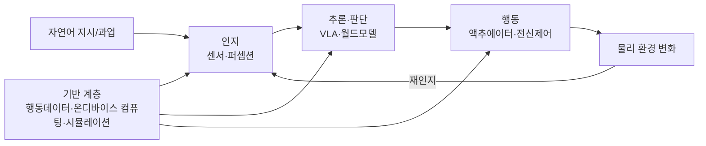

```toc
minLevel: 2
maxLevel: 2
```

# 2026 피지컬AI 산업 동향 조사

## Ⅰ. 총론 — 피지컬 AI의 부상과 핵심 이슈

### 1. 개념과 정의: 디지털 AI에서 피지컬 AI로의 패러다임 전환

피지컬 AI는 소프트웨어 안에만 머무르던 지능이 센서와 구동계를 통해 물리 세계를 인식하고 행동하는 단계로 넘어간 것을 가리킨다. 전통 AI가 "생각"에 그친다면 피지컬 AI는 "생각하고 행동"하며, 언어모델이 컵을 드는 방법을 설명하는 데 비해 피지컬 AI 시스템은 실제로 손을 뻗어 컵을 쥔다. 엔비디아는 이를 로봇·자율주행차 같은 물리 시스템에 AI를 통합해 환경을 인식하고 그 안에서 작동하게 하는 것으로 규정하며, 화면 위 데이터를 처리하는 챗봇과 실제 팔레트를 옮기는 지게차의 차이로 설명한다.

> 출처 : [What is Physical AI?(Encord, 2026.02.05)](https://encord.com/blog/physical-ai/) 
> 출처 : [Physical AI: How Embodied Machines Operate in 2026(Label Your Data, 2026.06.05)](https://labelyourdata.com/articles/physical-ai)

이 개념은 AI 진화의 네 번째 단계로 자리매김한다. Zheshang Securities는 판별형(Perceptual)·생성형(Generative)·에이전틱(Agentic) AI에 이어 피지컬 AI를 다음 단계로 규정하며, 그 핵심을 모델이 현실 상태를 이해·예측하는 능력에서 찾는다. 국내 정부도 동일한 계보로 인식한다. 과기정통부는 피지컬 AI를 생성형·에이전틱 AI에 이어 실제 물리 세계와 상호작용하는 '자율 적응 행동지능'으로 정의한다.

> 출처 : [The Next Stop of the AI Revolution(Jianshi, 2026.05.27)](https://jianshiapp.com/the-next-stop-of-the-ai-revolution-what-are-the-new-advances-in-physical-ai/) 
> 출처 : ['피지컬AI 수출하는 나라로'...3년 내 집중 육성(ZDNet Korea, 2026.07.01)](https://zdnet.co.kr/view/?no=20260701161645)

2025~2026년이 변곡점으로 지목되는 이유는 '모델 계층'의 도약이다. NVIDIA Cosmos 같은 월드 파운데이션 모델과 Isaac GR00T 같은 VLA 모델이 등장하면서, 로봇이 수작업 프로그래밍에 의존하지 않고 스스로 학습·추론하게 됐다. 엔비디아 CEO 젠슨 황은 2026년 3월 GTC에서 이를 "로보틱스의 챗GPT 순간"으로 규정했다.

> 출처 : [What is Physical AI?(Encord, 2026.02.05)](https://encord.com/blog/physical-ai/) 
> 출처 : [Physical AI: How Embodied Machines Operate in 2026(Label Your Data, 2026.06.05)](https://labelyourdata.com/articles/physical-ai)

개념적 뿌리는 오래됐다는 점도 짚을 필요가 있다. 피지컬 AI의 사상적 원형은 1940년대 위너의 사이버네틱스(인식→행동→피드백 순환), 1960년대 SRI의 'Shakey', 1980년대 로드니 브룩스의 체화된 지능론으로 거슬러 올라가며, 2012년 딥러닝의 컴퓨터비전 돌파가 실질적 동력을 제공했다. 즉 피지컬 AI는 새로운 개념의 발명이 아니라, 오랜 '체화된 지능' 담론이 파운데이션 모델·엣지 반도체의 성숙으로 비로소 구현 가능해진 사건에 가깝다.

> 출처 : [Physical AI Series 1: What Is It?(Superb AI, 2026.02.03)](https://superb-ai.com/en/resources/blog/physical-ai-series-1-what-is-it-en)

### 2. 기술 구조 개관: 인지–추론–행동의 폐루프

피지컬 AI는 세 가지 축이 하나의 닫힌 순환을 이루는 구조로 작동한다. RobotToday는 이를 '인식 → 추론 → 행동 → 환경 반응 → 재인식'의 연속 피드백 루프로 정리하며, 인지가 순수 기호연산이 아니라 구체적 물리 형상에 정박(grounding)된다는 점을 특징으로 든다. Zheshang Securities도 체화지능을 '인식–이해–추론–행동' 폐루프의 핵심 담체로 정의한다.

> 출처 : [Physical AI Landscape(RobotToday, 2026.07)](https://robottoday.com/article/physical-ai-landscape-from-digital-intelligence-to-the-embodied-physical-world) 
> 출처 : [The Next Stop of the AI Revolution(Jianshi, 2026.05.27)](https://jianshiapp.com/the-next-stop-of-the-ai-revolution-what-are-the-new-advances-in-physical-ai/)

각 계층의 역할은 다음과 같이 구분된다. 이 구조는 Ⅱ장에서 풀스택 관점으로 심화한다.

|계층|기능|대표 요소기술|
|---|---|---|
|인지(Perception)|센서 신호를 3D 구조적 이해로 변환|카메라·라이다·레이더·IMU·힘토크 센서, 센서퓨전|
|추론·판단(Reasoning)|상황 이해를 행동 정책으로 매핑|VLA 모델, 월드모델, 파운데이션 모델|
|행동(Action)|정책을 물리 구동으로 실행|액추에이터·서보모터·감속기, 전신 제어|

인지 계층은 카메라·라이다·깊이·관성·힘토크 센서로 시작해, 어떤 물체가 어디에 있고 어떻게 움직이는지를 구조화하며, 이어 정책(policy)이 자연어 지시를 따르고 장면을 추론하는 VLA 모델 형태로 이 이해를 물리 행동에 연결한다.

> 출처 : [Physical AI: How Embodied Machines Operate in 2026(Label Your Data, 2026.06.05)](https://labelyourdata.com/articles/physical-ai)

### 3. 핵심 이슈: 행동데이터 병목 · 실시간 처리 · 물리적 안전

피지컬 AI가 디지털 AI와 결정적으로 다른 지점은 '실패의 비용이 물리적'이라는 점이며, 여기서 세 가지 구조적 난제가 파생된다.

첫째, 행동데이터 병목이다. 텍스트·이미지와 달리 로봇의 동작·물리력 데이터는 희소해, 정확한 멀티모달 학습데이터 확보가 피지컬 AI 확산의 최대 병목으로 지목된다. 이 병목이 국내 정책의 출발점이기도 하다. 과기정통부는 정부사업에서 생산되는 로봇 행동 데이터와 산업 데이터를 국가 데이터 라이브러리에 집적하는 것을 4대 분야의 첫 축으로 삼았다.

> 출처 : [What is Physical AI?(Encord, 2026.02.05)](https://encord.com/blog/physical-ai/) 
> 출처 : [정부, 피지컬AI 3년 승부수(머니투데이, 2026.07.01)](https://www.mt.co.kr/tech/2026/07/01/2026070110293521549)

둘째, 실시간 처리와 시뮬레이션-현실 격차다. 물리 행동은 클라우드 왕복이 아니라 온디바이스 실시간 추론을 요구하며, 시뮬레이션에서 학습한 정책을 실제 하드웨어로 옮기는 sim-to-real 격차가 상용화의 핵심 관문으로 남아 있다. Tesla가 대규모 시뮬레이션 학습과 sim-to-real 이전에 집중하는 것도 이 격차를 좁히기 위한 접근이다.

> 출처 : [Physical AI Landscape(RobotToday, 2026.07)](https://robottoday.com/article/physical-ai-landscape-from-digital-intelligence-to-the-embodied-physical-world)

셋째, 물리적 충돌과 안전·신뢰성이다. 기존 산업용 로봇은 고정 좌표를 반복 실행할 뿐 지능이 없어, 차체가 2인치만 어긋나도 적응하지 못하고 허공을 용접하거나 금속에 충돌해 라인 정지를 유발한다. 피지컬 AI는 이 비적응성을 극복하려 하지만, 그 대가로 '오작동이 곧 물리적 사고'라는 새로운 위험을 안는다. 이 쟁점은 Ⅳ장 글로벌 거버넌스와 Ⅴ장 국내 신뢰·안전 정책에서 구체화한다.

> 출처 : [Why Jensen Huang Says Physical AI is the Next ChatGPT Moment(press.farm, 2026.06)](https://press.farm/why-jensen-huang-says-physical-ai-is-the-next-chatgpt-moment/)

### 4. 분석 프레임워크

본 보고서는 기술 동향(What) → 정책적 함의(So What) → 실행 방안(Now What)의 통합 프레임으로 피지컬 AI를 분석한다. 분석 범위와 관점은 다음과 같이 설정한다.

- 시간 범위: 2025년 하반기~2026년 상반기의 최신 동향을 중심으로 하되, 3년(2026~2028) 골든타임과 2030년 목표를 전망 축으로 둔다.
- 공간 범위: 미국·중국·EU·일본 해외 4개국(Ⅳ장)과 대한민국(Ⅴ장)을 분리해, 국내 현황·정책을 별도 장에서 심화한다.
- 구성: Ⅱ 기술 → Ⅲ 시장·수요산업(플레이어 지형 분야별 세분화) → Ⅳ 해외·거버넌스 → Ⅴ 국내 → Ⅵ 종합, 그리고 부록 A(주요 성공사례)·부록 B(출처)로 구성한다.

시장 규모에 대해서는 해석상 주의가 필요하다. Coatue는 피지컬(피직스) AI 시장이 최소 6조 달러로 디지털 AI보다 약 50% 클 수 있다고 추정하고, 젠슨 황은 CES 2026에서 이 기술이 약 50조 달러 규모의 제조·물류 산업을 재편할 수 있다고 언급했다. 다만 이러한 초대형 추정치는 '재편 대상 산업 전체'를 가리키는 것으로, 피지컬 AI 자체의 시장 규모(협의)와는 층위가 다르다. 본 보고서는 Ⅲ장에서 대표 출처 3~4개만 명기하고 그 정의·범위의 한계를 함께 기록하는 방식으로 규모를 다룬다.

> 출처 : [The Next Stop of the AI Revolution(Jianshi, 2026.05.27)](https://jianshiapp.com/the-next-stop-of-the-ai-revolution-what-are-the-new-advances-in-physical-ai/)

---
## Ⅱ. 기술 동향 — 풀스택 관점

피지컬 AI의 경쟁은 특정 부품이 아니라 인지–추론–행동–인프라로 이어지는 풀스택 전반에서 벌어진다. 본 장은 Ⅰ.2에서 제시한 폐루프 구조를 계층별로 심화하고, 각 계층의 기술 성숙도와 병목을 정리한다.

### 0. 풀스택 개요 — 인지·추론·행동의 연결과 순환

피지컬 AI의 세 계층은 독립적으로 작동하지 않는다. 자연어 지시가 인지 계층의 센서 신호와 결합해 상황 이해로 변환되고, 이 이해가 추론 계층에서 행동 계획으로 매핑되며, 행동 계층이 이를 물리 구동으로 실행하면 환경이 변하고 그 변화가 다시 센서로 되먹임되는 하나의 실시간 폐루프를 이룬다.



각 계층은 앞 계층의 출력을 입력으로 받아 다음 계층으로 넘기는 방식으로 연결된다. 이 입출력 연쇄가 곧 피지컬 AI를 '지능형 시스템'으로 만드는 핵심이다.

|단계|입력|처리|출력(다음 단계로)|
|---|---|---|---|
|인지|센서 원신호(카메라·라이다·힘토크)|퍼셉션 스택|3D 장면 이해|
|추론·판단|3D 이해 + 언어 지시|VLA·월드모델(고수준 계획 5~10Hz)|행동 계획·정책|
|행동|행동 계획|정책 헤드(고속 제어 50~100Hz)→구동|물리 동작|
|환경 반응|물리 동작|실제 물리 법칙의 반응|새 센서 신호(→재인지)|

연결의 두 가지 특징이 중요하다. 첫째, 계획과 제어의 '주파수 분리'다. 무거운 추론(System 2)은 5~10Hz로 느리게 계획하고, 가벼운 제어(System 1)는 50~100Hz로 빠르게 실행해, 지능과 실시간성을 동시에 확보한다. 둘째, 세 계층 아래를 관통하는 '기반 계층'이다. 2026년의 스택은 VLA 백본 + 디퓨전/플로우 정책 헤드 + 강화학습 전신제어기 + 생성형 월드모델로 수렴하며, 이 전체를 행동데이터·온디바이스 컴퓨팅·시뮬레이션이 떠받친다.

> 출처 : [The robot stack convergence(Nextomoro, 2026.05.14)](https://nextomoro.com/robotics-roundup/) 출처 : [Vision-Language-Action Models 2026(Internet Pros, 2026.05.03)](https://internet-pros.com/blog/vision-language-action-models-robotics-2026/)

### 1. 인지 계층 — 복합 센싱과 센서 퓨전

**복합 센서 구성과 힘 제어**

인지 계층은 이종 센서의 원신호를 3D 구조적 이해로 변환하는 관문이다. 카메라·라이다·레이더·깊이센서에 관성측정장치(IMU)와 힘·토크 센서가 결합되며, 최근에는 정밀 조작을 위한 촉각(tactile) 센싱이 핵심 변수로 부상했다. 특히 6축 힘/토크 센서는 모든 선형·회전 액추에이터에 배치돼 힘 감지와 제어를 담당한다. Tesla Optimus가 각 액추에이터에 6차원 토크 센서를 적용해 단순한 구조로도 정밀한 힘 제어를 구현하는 것이 대표적이다.

> 출처 : [Opportunities for Materials in Humanoid Robots 2026(Daydream, 2026.04.28)](https://www.daydream.eu/opportunities-materials-humanoid-robots-market-2026/)

**촉각·지문 센싱의 부상**

촉각·지문 센싱은 정밀 조작 능력을 좌우하는 관건으로 지목된다. 손끝 센서는 섬세한 파지를 가능케 해 상용화의 핵심 단계로 평가되며, 이 영역은 미국 기업이 선도하는 가운데 중국 기업이 빠르게 추격하는 구도다.

> 출처 : [New Gains in PRC Robotics Software & Hardware(Jamestown, 2025.11.13)](https://jamestown.org/new-gains-in-prc-robotics-software-hardware/)

### 2. 추론·판단 계층 — VLA·월드모델·대규모 행동모델

2025~2026년 도약의 핵심은 추론 계층이다. 로봇이 자연어 지시를 이해하고 장면을 추론해 행동으로 옮기는 VLA(Vision-Language-Action) 모델이 연구를 벗어나 상용 시스템으로 진입했다.

**VLA 아키텍처의 4대 계열과 이중 시스템**

VLA는 행동 생성 방식에 따라 자기회귀(autoregressive)·플로우매칭(flow-based)·디퓨전(diffusion)·하이브리드의 4계열로 구분되며, 관련 기여의 대부분이 2024~2026년에 집중됐다.

> 출처 : [VLA Models for Aerial Robotics and Bimanual Manipulation: A Review(arXiv, 2026)](https://arxiv.org/pdf/2607.06706)

실시간성 확보를 위해 2026년 배치의 지배적 패턴은 '이중 시스템'이다. 무거운 VLM이 5~10Hz로 계획·재계획을 담당하고, 가벼운 디퓨전/플로우매칭 정책이 50~100Hz로 행동을 생성하는 구조로, NVIDIA GR00T와 Figure Helix가 이 패턴을 정식화했다. 여기에 한 번의 추론으로 8~50개의 미래 행동을 묶어 실행하는 '액션 청킹'이 결합돼 추론 빈도를 낮추고 동작을 매끄럽게 한다.

> 출처 : [Vision-Language-Action Models 2026(Internet Pros, 2026.05.03)](https://internet-pros.com/blog/vision-language-action-models-robotics-2026/)

**대표 파운데이션 모델 비교**

|모델|개발주체|구조 특징|비고|
|---|---|---|---|
|Isaac GR00T N1.x|NVIDIA|오픈웨이트 VLA, flow-matching DiT, 이중시스템|크로스임바디먼트, Jetson Thor 구동|
|Helix|Figure AI|이중시스템(고수준 VLM+고속 시각운동), 단일 가중치|온보드 저전력, BMW 공장 배치|
|π0|Physical Intelligence|flow-matching 액션헤드|다단계 정밀조작에 유리|
|Gemini Robotics|Google DeepMind|Gemini 멀티모달 기반, 온디바이스 변형|양팔 조작·3D 공간추론|
|OpenVLA|오픈소스|7B, DINOv2+SigLIP+Llama2, 시연 97만 건|55B RT-2-X를 성능 상회|
|BFM·GCFM|AgiBot|행동모방(BFM)+생성제어(GCFM)|오픈 데이터셋 AgiBot World|

Figure Helix는 단일 신경망 가중치로 집기·서랍/냉장고 사용·로봇 간 협업을 태스크별 미세조정 없이 수행하며, 저전력 온보드 GPU에서 전량 구동된다. OpenVLA는 97만 건의 실제 로봇 시연으로 학습된 70억 파라미터 오픈모델로, 7배 큰 폐쇄형 RT-2-X(550억)를 29개 태스크에서 16.5%p 앞섰다.

> 출처 : [Top 10 Physical AI Models 2026(MarkTechPost, 2026.04.28)](https://www.marktechpost.com/2026/04/28/top-10-physical-ai-models-powering-real-world-robots-in-2026/) 
> 출처 : [VLA Models are the next leap(The Robot Report, 2026.02.27)](https://www.therobotreport.com/vision-language-action-models-are-the-next-leap-in-autonomous-robotics/)

**월드모델과 대규모 행동모델**

월드모델은 현실의 물리 변화를 예측·시뮬레이션해 학습과 의사결정을 지원하는 축이다. NVIDIA Cosmos가 합성데이터 생성과 정책 평가용 월드모델을 제공하며, Toyota Research Institute의 대규모 행동모델(LBM), AgiBot의 행동 파운데이션 모델이 경쟁 축을 형성한다. 2026년의 스택은 VLA 백본 + 디퓨전/플로우 정책 헤드 + 강화학습 전신제어기 + 생성형 월드모델(시뮬레이터 겸 평가기)로 수렴하는 양상이다.

> 출처 : [The robot stack convergence(Nextomoro, 2026.05.14)](https://nextomoro.com/robotics-roundup/)

다만 월드모델 기반 계획에는 고유의 위험이 있다. 환각(hallucination)이 잘못된 제어를 낳고, 이것이 학습 분포에서 더 멀어지며 추가 환각을 부르는 악순환 가능성이 지적된다.

> 출처 : [Robots Need More Than VLAs & World Models(arXiv, 2026.06.04)](https://arxiv.org/html/2606.06556v1)

### 3. 행동 계층 — 액추에이터·감속기·정밀 구동

**핵심 부품과 원가 병목**

행동 계층은 정책을 물리 구동으로 옮기는 하드웨어 영역으로, 원가와 성능의 핵심 병목이 밀집한다. 휴머노이드 1대는 전통 산업용 로봇이 필요로 하지 않는 규모인 20~40개의 정밀 감속기(하모닉·유성)를 요구한다. 고토크 액추에이터는 출력밀도 확보를 위해 네오디뮴철붕소(NdFeB) 희토류 영구자석에 의존하며, 정밀 핸드는 단일 항목 기준 부품표(BOM)의 약 31%를 차지하는 최대 원가 요소로 꼽힌다.

> 출처 : [China's Components Supply Chain(Tianxia Gongchang, 2026.07)](https://faxiangongchang.com/en/reports/china-humanoid-robot-supply-chain-2026) 
> 출처 : [The Global Humanoid Robots Market 2026-2036(Research and Markets, 2026)](https://www.researchandmarkets.com/report/humanoid-robot)

핵심 부품과 공급망 이슈는 다음과 같다.

|부품군|기술적 관건|공급망 특징|
|---|---|---|
|정밀 감속기(하모닉·유성)|1대당 20~40개, 정밀·내구|대량양산용 최적화 미완|
|무프레임 토크모터·중공컵모터|출력밀도·경량화|NdFeB 희토류 의존|
|6축 힘/토크 센서|정밀 힘 제어|중국 국산화 선행 완료|
|촉각·지문 센서|정밀 조작 확장 관건|미국 선도, 중국 추격|
|정밀 핸드(엔드이펙터)|미세 구동·유연 소재|단일 최대 원가(BOM 약 31%)|

**전신 제어와 sim-to-real**

전신 제어(whole-body control)에서는 강화학습 기반으로 무게·관성을 제어하는 접근이 표준화되고 있으며, 시뮬레이션에서 수백만 시간을 반복 학습해 sim-to-real 격차를 좁히는 방식이 병행된다.

> 출처 : [Understand the Industrial Chain(36Kr, 2026)](https://eu.36kr.com/en/p/3476581554018438)

### 4. 인프라·소부장 — 온디바이스 컴퓨팅·시뮬레이션·공급망

**온디바이스 컴퓨팅과 엣지 반도체**

물리 행동은 클라우드 왕복 없이 온디바이스 실시간 추론을 요구한다. NVIDIA Jetson AGX Thor T5000은 Blackwell GPU 기반 2,070 FP4 TFLOPS 성능을 로봇 탑재형 폼팩터에서 제공하며, Jetson T4000은 40~70W 전력에서 1,200 TFLOPS를 내는 등 전력·발열 제약 하의 엣지 연산이 급진전했다. 이로써 프런티어급 AI가 로봇 위에서 실시간으로 구동되는 첫 세대가 열렸다.

> 출처 : [Nvidia wants to be the Android of generalist robotics(TechCrunch, 2026.01.05)](https://techcrunch.com/2026/01/05/nvidia-wants-to-be-the-android-of-generalist-robotics/)
> 출처 : [NVIDIA Isaac GR00T Reference Humanoid Robot(NVIDIA Newsroom, 2026.05.31)](https://nvidianews.nvidia.com/news/nvidia-open-humanoid-robot-reference-design)

엣지 반도체 생태계에서는 NVIDIA가 '두뇌' 프로세서를, 유럽 반도체 기업이 안전전장·센싱·모션제어의 '신체' 부품을 제공하는 상보 구조가 형성됐다. Infineon(정밀 모션제어 MCU), NXP(실시간 전신 데이터 처리·저지연 네트워킹), Texas Instruments(밀리미터파 레이더)가 대표적이다.

> 출처 : [NVIDIA Expands Robotics Ecosystem at GTC(TrendForce, 2026.03.19)](https://www.trendforce.com/news/2026/03/19/insights-nvidia-expands-robotics-ecosystem-at-gtc-as-physical-ai-moves-toward-large-scale-deployment/)

**시뮬레이션·디지털트윈**

시뮬레이션·디지털트윈은 학습·검증 비용을 낮추는 인프라다. NVIDIA Isaac Sim/Lab(Newton 물리엔진 기반), Cosmos 월드모델, Gazebo·MuJoCo 등이 활용되며, Synopsys는 소프트웨어 정의 제품·피지컬 AI용 전자 디지털트윈(eDT) 플랫폼을 출시했다.

> 출처 : [Physical AI Market Report(Grand View Research, 2026.06.05)](https://www.grandviewresearch.com/industry-analysis/physical-ai-market-report)

**공급망 지정학 리스크**

공급망은 지정학 리스크가 큰 영역이다. 한 분석은 중국 공급사 없이 Tesla Optimus Gen 2를 제조하면 부품표가 약 4.6만 달러에서 13.1만 달러로 약 3배 뛴다고 추정했다. 중국은 희토류 채굴의 약 69%, 자석 정련·가공 능력의 약 90%를 통제하고 있어, 이 의존이 피지컬 AI 하드웨어 전반의 구조적 변수로 작용한다.

> 출처 : [Scaling the humanoid robotics supply chain(McKinsey, 2026.04.17)](https://www.mckinsey.com/industries/industrials/our-insights/turning-humanoid-supply-chain-constraints-into-billion-dollar-wins)

### 5. 기술 성숙도 및 표준화 동향

**성숙도: 하드웨어가 소프트웨어를 앞서는 비대칭**

피지컬 AI의 성숙도는 계층 간 비대칭이 특징이다. 업계는 인상적 데모와 신뢰성 있는 배치 사이의 간극을 대체로 소프트웨어(AI) 문제로 규정하며, 하드웨어가 소프트웨어를 앞서는 경우가 많다고 본다. 좁고 구조화된 태스크에서는 이미 아마존·BMW·마그나·현대차 시설에서 파일럿이 진행되지만, 광범위·유연한 99.99% 신뢰성 배치의 현실적 시점은 2028~2032년으로 추정된다.

> 출처 : [Humanoid Robotics Challenges 2026(RoboZaps, 2026.06.10)](https://blog.robozaps.com/b/challenges-in-humanoid-robotics)

원가·신뢰성 병목도 여전하다. 액추에이터가 제조원가의 약 60~70%를 차지하고, 배터리 한계와 함께 전신 신뢰성이 산업용 로봇의 95~99% 가동률에 크게 못 미친다. 계층별 성숙도와 병목을 정리하면 다음과 같다.

|계층|성숙도|남은 병목|
|---|---|---|
|인지|중상|촉각·지문 센싱 미성숙|
|추론·판단|중(급상승)|엣지케이스·월드모델 환각·견고성|
|행동(HW)|중|감속기·정밀핸드 양산 최적화, 신뢰성|
|인프라|중상|공급망 지정학, 전력·발열|

> 출처 : [Robotics, Humanoids & Physical AI Leaders(RAISE Summit, 2026)](https://www.raisesummit.com/post/robotics-humanoids-physical-ai-leaders)

**평가·벤치마크의 표준 부재**

정책(모델)이 범용화될수록 평가가 어려워지지만, 표준화된 벤치마크가 부재하다. 실제 환경 리셋이 병렬화되지 않아 평가 병목이 크며, 이를 완화하려 RoboArena(분산 실환경 평가)·RobotArena∞(real-to-sim 변환) 같은 시도가 등장했다. NVIDIA GR00T N2가 MolmoSpaces·RoboArena에서 1위를 기록하는 등 벤치마크 성적이 경쟁 지표로 부상하고 있다.

> 출처 : [RobotArena ∞: Scalable Robot Benchmarking(arXiv, 2025.10.27)](https://arxiv.org/html/2510.23571v1) 
> 출처 : [NVIDIA and Global Robotics Leaders Take Physical AI to the Real World(NVIDIA Newsroom, 2026)](https://nvidianews.nvidia.com/news/nvidia-and-global-robotics-leaders-take-physical-ai-to-the-real-world)

**안전 표준화가 상용화의 관문**

안전 표준은 기술 문제를 넘어 시장 확대의 핵심 열쇠다. Agility Robotics는 향후 5년 창고 휴머노이드 확산의 최대 관건을 AI·배터리가 아니라 '인간과 분리 구역 없이 나란히 일할 안전성'으로 지목하고, ISO/TC 299·ISO 25785 협동 안전 표준 마련에 참여 중이다. 이 인증이 물리적 격리를 제거해 인간 중심 공간에서의 자유로운 이동을 허용하고, 결국 대량 채택을 여는 열쇠라는 것이다.

> 출처 : [From Simulation to Shop Floor(Tech Briefs, 2026)](https://www.techbriefs.com/component/content/article/55435-from-simulation-to-shop-floor-bridging-the-sim-to-real-gap-for-humanoid-robots)

미국은 ANSI/A3 R15.06-2025로 출력·힘 제한, 속도·이격 감시, 위험평가를 규율하며, 공유 작업공간의 휴머노이드도 이에 포섭된다. 이는 OSHA 준수와 기업 보험 가입의 전제조건이기도 하다. 표준 지형을 관할·대상·지위별로 정리하면 다음과 같다. 상세 규제·거버넌스는 Ⅳ.6에서 국가별로 다룬다.

|관할·기구|표준|대상|지위|
|---|---|---|---|
|ISO|10218:2025|산업용 로봇|시행|
|ISO|13482:2025|서비스·개인돌봄 로봇|시행|
|ISO|25785-1|이족보행(능동 균형)|2025.5 첫 제정, 산업용 한정|
|ISO/TS|15066|협동로봇|시행|
|미국 ANSI/A3|R15.06-2025|협동·공유작업|2025.10|
|EU|AI Act|자율로봇=고위험|고위험 제품규정 2027 전환|
|중국 MIIT|표준체계(2026판)|휴머노이드·체화지능|6대 축, 2026.2|
|ISO/IEC·IEEE|42001·23894·7001, NIST AI RMF|AI 관리·위험·투명성|보완 프레임|

> 출처 : [Humanoid Robots Manufacturing Readiness 2026(Theresarobotforthat, 2026.06.08)](https://theresarobotforthat.com/blog/humanoid-robots-manufacturing-readiness-2026/) 
> 출처 : [Embodied AI: Emerging Risks and Opportunities(arXiv, 2026)](https://arxiv.org/pdf/2509.00117)

**분석: 표준 주도가 곧 시장 주도**

종합하면 표준화가 배치 속도를 따라가지 못하는 국면이며, 소비자용·가정용을 아우르는 통일 규범은 아직 공백 상태다. 안전·시험인증 체계의 완비가 대규모 조달의 전제인 만큼, 표준을 선점하는 주체가 시장 규칙을 규정하게 된다. 여기에 IT/OT 융합에 따른 사이버보안이 새로운 조달 심사 축으로 더해진다. 국내도 이를 인식해 피지컬 AI 얼라이언스의 기반 거버넌스 분과에서 국제표준·시험인증 체계 마련을 추진 중이며, 이는 Ⅴ장에서 상술한다.

> 출처 : [정부, K-피지컬 AI 풀스택 전략 공개(ZDNet Korea, 2026.06.19)](https://zdnet.co.kr/view/?no=20260619115919)

---

## Ⅲ. 시장 및 수요산업 동향

본 장은 피지컬 AI의 시장 규모와 부문별 구조를 정리하고, 실제 수요가 발생하는 산업과 이를 공급하는 플레이어 지형을 분야별로 세분화한다.

### 1. 글로벌 시장 규모와 전망

**대표 추정치와 성장 방향**

피지컬 AI 시장은 2026년을 데모에서 상업 배치로 넘어가는 변곡점으로 본다는 데 이견이 없으나, 규모 추정치는 출처마다 크게 갈린다. 정의 범위가 다르기 때문이다. 대표 추정치를 성격별로 정리하면 다음과 같다.

|출처|정의 성격|기준 규모|전망|CAGR|
|---|---|---|---|---|
|MarketsandMarkets|협의(embodied AI SW·시스템)|$15억(2026)|$152억(2032)|47.2%|
|Grand View Research|광의(로봇+AI 결합)|$816억(2025)|$9,604억(2033)|36.1%|
|Yole Group|휴머노이드 한정|$60억(2030)|$510억(2035)|56%|
|Deloitte(UBS 추정)|휴머노이드 TAM|—|$300~500억(2035)|—|

공통 신호는 세 가지다. 아시아·태평양이 최대이자 최고성장 지역이고, 하드웨어가 현재 최대 비중이나 소프트웨어가 최고 성장률을 보이며, 제조·물류가 최초의 대규모 수요처라는 점이다.

> 출처 : [Physical AI Market(MarketsandMarkets, 2026.06)](https://www.marketsandmarkets.com/Market-Reports/physical-ai-market-240269196.html) 
> 출처 : [Physical AI Market Report(Grand View Research, 2026.06.05)](https://www.grandviewresearch.com/industry-analysis/physical-ai-market-report) 
> 출처 : [Humanoid Robots Manufacturing Readiness 2026(Theresarobotforthat, 2026.06.08)](https://theresarobotforthat.com/blog/humanoid-robots-manufacturing-readiness-2026/) 
> 출처 : [Physical AI and humanoid robots(Deloitte Insights, 2025.12.10)](https://www.deloitte.com/us/en/insights/topics/technology-management/tech-trends/2026/physical-ai-humanoid-robots.html)

**분야별 시장 구조 요약**

전체 규모와 별개로, 세부 분야별 비중·성장률을 정리하면 어디에서 성장이 집중되는지가 드러난다. 아래 수치는 단일 모델이 아니라 복수 리서치의 대표값을 교차 정리한 것으로, 절대치보다 구조적 방향을 보기 위한 것이다(리서치별 총규모가 달라 비중·CAGR의 출처가 상이함). 본문 각 절의 수치와도 일치한다.

|구분 축|세부 분야|2025 비중|성장 지표(CAGR)|
|---|---|---|---|
|구성별|하드웨어(센서·액추에이터·연산)|최대(약 52~57%)|기반 유지|
||소프트웨어·파운데이션 모델|—|최고 성장(약 34~55%)|
|로봇 유형별|산업용 로봇|최대(약 58%)|56.7%|
||휴머노이드|42%(임베디먼트)|최고 성장 유형|
||전문 서비스 로봇|—|39.7%|
|기술별|컴퓨터비전|최대(약 45%)|—|
||VLA(비전-언어-행동)|55%|—|
||강화학습·제어|—|최고 성장(약 31%)|
|응용별|제조·물류|최대(약 38%)|—|
||헬스케어|—|최고 성장(약 39~44%)|
||물류 창고 자동화|€95~142억(2026)|15~20%|
|자율수준별|반자율(Semi)|52%|—|
||Level 3(고급 자율)|—|60.8%|
|배치별|온디바이스|71.4%|—|
||하이브리드|—|42.6%|

핵심은 세 방향의 성장 집중이다. 구성에서는 하드웨어가 현 최대 비중을 유지하나 소프트웨어가 최고 성장률로 장기 가치가 이동하고, 유형에서는 산업용 로봇이 최대 규모·고성장을 병행하는 가운데 휴머노이드가 최고 성장 유형으로 부상하며, 응용에서는 제조·물류가 최대 시장이되 헬스케어가 최고 성장률을 보인다.

> 출처 : [Physical AI Market(Mordor Intelligence, 2026)](https://www.mordorintelligence.com/industry-reports/physical-ai-market) 
> 출처 : [Physical AI Market(MarketsandMarkets, 2026)](https://www.marketsandmarkets.com/Market-Reports/physical-ai-market-240269196.html) 
> 출처 : [Physical AI Market(Astute Analytica, 2026)](https://www.astuteanalytica.com/industry-report/physical-ai-market) 
> 출처 : [Physical AI Market Report(Grand View Research, 2026.06.05)](https://www.grandviewresearch.com/industry-analysis/physical-ai-market-report)

**추정치 해석의 한계**

위 수치를 단일 근거로 삼는 것은 위험하다. 첫째, 정의 범위가 협의(체화 AI 소프트웨어)·광의(로봇+AI 전체)·휴머노이드 단독으로 갈려 규모가 수십 배 차이 난다. 둘째, 초기 시장이라 표본·가정에 따른 편차가 크다. 셋째, Coatue의 6조 달러, 젠슨 황의 50조 달러 같은 초대형 수치는 피지컬 AI 자체 시장이 아니라 '재편 대상 산업 전체'를 가리키는 상한 개념이다. 따라서 본 보고서는 절대 규모보다 성장률·구조·지역 분포를 판단 근거로 삼는다.

> 출처 : [The Next Stop of the AI Revolution(Jianshi, 2026.05.27)](https://jianshiapp.com/the-next-stop-of-the-ai-revolution-what-are-the-new-advances-in-physical-ai/)

### 2. 하드웨어·바디 시장

**휴머노이드: 최대이자 최고성장 세그먼트**

바디 시장의 중심은 휴머노이드다. 인간 중심으로 설계된 기존 시설을 개조 없이 그대로 활용할 수 있다는 경제성 때문에 기업들이 이족·양팔 형태를 선호하며, 일부 분석은 휴머노이드가 임베디먼트 기준 최대 점유(약 42%, 2025)를 차지한다고 본다. 단가 하락이 확산을 가속한다. 소재비가 2025년 약 3.5만 달러에서 향후 10년 1.3만~1.7만 달러로 떨어지고, 2030년경 대량생산 시 약 2만 달러로 자동차 수준에 근접할 것으로 전망된다.

> 출처 : [Physical AI Market Size Growth 2035(Astute Analytica, 2026)](https://www.astuteanalytica.com/industry-report/physical-ai-market) 
> 출처 : [Physical AI and humanoid robots(Deloitte Insights, 2025.12.10)](https://www.deloitte.com/us/en/insights/topics/technology-management/tech-trends/2026/physical-ai-humanoid-robots.html)

**4족·다족 로봇과 협동로봇·매니퓰레이터**

휴머노이드 외에도 4족·다족 로봇(Boston Dynamics Spot, Unitree Go 시리즈)이 점검·보안·물류에서 이미 매출을 내고 있으며, 협동로봇(Cobot)과 지능형 매니퓰레이터는 AI 접목으로 정밀 조립·검사 능력이 확장되는 중이다. 산업용 로봇 세그먼트는 예측기간 중 가장 높은 성장률(일부 추정 56.7%)이 전망된다.

> 출처 : [Physical AI Market(MarketsandMarkets, 2026)](https://www.marketsandmarkets.com/Market-Reports/physical-ai-market-240269196.html)

### 3. 소프트웨어·브레인 시장

**행동모델·파운데이션 모델이 최고 부가가치 축**

부문별로는 소프트웨어 계층이 가장 빠르게 성장하는 축으로, 일부는 2034년까지 54.7% 수준의 CAGR을 전망한다. 로봇을 특정 태스크에서 해방시키는 대규모 행동모델(LAM/LBM)과 범용 파운데이션 모델이 장기적으로 가장 매력적인 상업 기회로 지목된다. 실제로 미래 시장의 승부처가 로봇 완제품이 아니라, 이기종 로봇 fleet을 실제로 활용하게 만드는 운영체제·배치 도구·워크플로 소프트웨어에 있다는 관측이 늘고 있다.

> 출처 : [Physical AI Market(Kaiso Research, 2026.05)](https://www.kaisoresearch.com/report-store/global-physical-ai-market) 
> 출처 : [Unitree G1 Reshaping the Robotics Investment Stack(Forbes, 2026.04.27)](https://www.forbes.com/sites/jonmarkman/2026/04/27/unitree-g1-humanoid-robots-are-reshaping-the-robotics-investment-stack/)

**시뮬레이션·디지털트윈·합성데이터**

브레인 시장의 또 다른 축은 학습·검증 인프라다. 행동데이터 병목을 완화하기 위해 시뮬레이션·디지털트윈이 합성데이터를 생성하고 정책을 평가하는 역할을 맡으며, 월드모델 기반 가상 검증 플랫폼이 이 영역의 핵심으로 부상했다. 이 축은 Ⅱ.4(인프라)에서 다룬 기술이 시장으로 전환되는 지점이다.

> 출처 : [Physical AI Market Report(Grand View Research, 2026.06.05)](https://www.grandviewresearch.com/industry-analysis/physical-ai-market-report)

### 4. 수요산업별 적용 실태

**제조·물류: 최초의 대규모 스케일 시장**

가장 먼저 규모화되는 시장은 제조와 물류다. 반구조화된 환경에서 투자수익이 즉시 계량되기 때문이다. 자동차 제조가 선도 시장으로, BMW·마그나·아마존·현대차 시설에서 휴머노이드 파일럿이 진행된다. 물류에서는 Amazon·DHL·Ocado가 구조화된 창고 작업에 휴머노이드를 검증 중이며, Amazon의 Sequoia 시스템은 창고 효율을 75% 높인 것으로 보고된다. 산업 흐름은 로봇이 사람을 보조하는 P2G에서 로봇이 자율 수행하는 R2G로 이동하고 있다.

> 출처 : [Physical AI Market(Kaiso Research, 2026.05)](https://www.kaisoresearch.com/report-store/global-physical-ai-market) 
> 출처 : [Robotics, Humanoids & Physical AI Leaders(RAISE Summit, 2026)](https://www.raisesummit.com/post/robotics-humanoids-physical-ai-leaders)

**모빌리티·무인운송**

자율주행차는 피지컬 AI 월드모델을 실차에 적용하는 대표 영역으로, Tesla의 FSD 데이터 기반 접근과 중국 완성차의 월드모델(Geely WAM 등) 경쟁이 두드러진다. 여기에 도심항공모빌리티(UAM/eVTOL)와 자율운항 선박이 비정형 환경 극복·돌발 장애물 회피를 과제로 확장되고 있다.

> 출처 : [The Next Stop of the AI Revolution(Jianshi, 2026.05.27)](https://jianshiapp.com/the-next-stop-of-the-ai-revolution-what-are-the-new-advances-in-physical-ai/)

**의료·특수/재난·농업·국방**

수요는 고위험·고부가 영역으로도 확산된다. 수술로봇은 주요 병원 시술의 상당 부분을 차지하며(Intuitive의 da Vinci 5 등), CMR Versius·J&J Monarch·LEM Dynamis가 NVIDIA Cosmos·Isaac 기반으로 자율 팔을 학습·검증한다. 재활용 외골격은 상환 가능한 기관 조달 시장으로 진입 중이다. 농업에서는 자율주행 트랙터와 레이저 제초 로봇(Terra Robotics), 국방에서는 자율 지상·공중 시스템의 장주기 조달이 형성되고 있다.

> 출처 : [NVIDIA and Global Robotics Leaders Take Physical AI to the Real World(NVIDIA Newsroom, 2026)](https://nvidianews.nvidia.com/news/nvidia-and-global-robotics-leaders-take-physical-ai-to-the-real-world) 
> 출처 : [National Robotics Week Physical AI(NVIDIA Blog, 2026.04.13)](https://blogs.nvidia.com/blog/national-robotics-week-2026/) 
> 출처 : [Physical AI Market(Kaiso Research, 2026.05)](https://www.kaisoresearch.com/report-store/global-physical-ai-market)

## 5. 주요 글로벌 플레이어 지형 (분야별 세분화)

피지컬 AI 경쟁은 단일 완제품이 아니라 스택의 각 분야에서 별도로 전개된다. 분야를 브레인·바디·칩/엣지·소부장·시뮬레이션의 5개로 나누어 대표 플레이어와 경쟁 특징을 정리한다.

|분야|대표 플레이어|경쟁 특징|
|---|---|---|
|브레인(모델·SW)|NVIDIA(GR00T·Cosmos), Google DeepMind(Gemini Robotics), Physical Intelligence(π0), Skild AI, Toyota(LBM), Meta|파운데이션 모델 주도권 각축, 오픈-폐쇄 병존|
|바디(휴머노이드)|Tesla, Figure, Boston Dynamics, Agility, Apptronik, 1X / Unitree, AgiBot, UBTech|美 자본·야망 vs 中 양산·저가|
|칩·엣지 컴퓨팅|NVIDIA(Jetson Thor), Qualcomm, Infineon·NXP·TI, Horizon Robotics|두뇌+신체전장의 상보 구조|
|소부장(부품)|Moog·Festo, Harmonic Drive, Fourier·Leadshine, Sharpa·Inspire·ZWEI|감속기·정밀핸드·센서 원가·양산 경쟁|
|시뮬·데이터|NVIDIA(Isaac·Cosmos), World Labs, Synopsys, Hugging Face(LeRobot)|생태계·개발도구 표준 선점|

**브레인(모델·소프트웨어): 가장 치열한 프런티어 각축**

파운데이션 모델 계층은 현재 AI 연구에서 가장 격렬히 경쟁하는 영역 중 하나다. NVIDIA(오픈웨이트 GR00T·Cosmos), Google DeepMind(Gemini Robotics), Physical Intelligence(π0), Toyota Research Institute(LBM), Meta의 체화 연구가 경쟁하며, Figure·1X·Boston Dynamics·Unitree·Apptronik·Agility 같은 하드웨어 기업이 이들의 실질적 고객이 된다. NVIDIA는 GR00T·Cosmos를 오픈 배포하고 Hugging Face LeRobot과 통합해 '로보틱스의 안드로이드' 생태계를 지향한다.

|주체|대표 모델|개방성|아키텍처 특징|전략 포지션|
|---|---|---|---|---|
|NVIDIA|GR00T·Cosmos|오픈웨이트|flow-matching 이중시스템 + 월드모델|플랫폼(생태계 장악)|
|Google DeepMind|Gemini Robotics|폐쇄(온디바이스 변형)|Gemini 멀티모달·3D 추론|대규모 범용|
|Physical Intelligence|π0|폐쇄|flow 기반 범용 정책|순수 모델 전문기업|
|Toyota(TRI)|LBM|연구 단계|대규모 행동모델|OEM 내재화|
|Figure AI|Helix|폐쇄|이중시스템·단일 가중치|수직통합(자체 로봇)|

브레인 경쟁의 축은 '개방 대 폐쇄'와 '플랫폼 대 수직통합'이다. NVIDIA는 오픈 배포로 생태계 표준을 노리고, Google·Physical Intelligence는 폐쇄형 고성능으로, Figure·Toyota는 자체 하드웨어에 모델을 내재화하는 수직통합으로 차별화한다.

> 출처 : [The robot stack convergence(Nextomoro, 2026.05.14)](https://nextomoro.com/robotics-roundup/) 
> 출처 : [Nvidia wants to be the Android of generalist robotics(TechCrunch, 2026.01.05)](https://techcrunch.com/2026/01/05/nvidia-wants-to-be-the-android-of-generalist-robotics/)

**바디(휴머노이드 완제품): 미국 자본 대 중국 양산**

완제품 지형은 미·중 양강 구도다. 
미국은 야망과 자본에서 앞선다. Figure는 시리즈 B에서만 6.75억 달러를 조달했고, Boston Dynamics는 CES 2026 이후 100조 원대 기업가치가 거론되며, Agility는 SPAC 상장으로 6.2억 달러 양산 자금과 3억 달러 확정 수주를 확보했다. 
중국은 양산과 가격에서 앞선다. 2025년 AgiBot(약 5,168대)·Unitree(약 5,500대)가 세계 출하의 85~90%를 점하고, Unitree는 6월 상하이 STAR마켓 상장심사를 통과했다.

|기업|진영|2025 출하·상태|강점|전략|밸류·자금|
|---|---|---|---|---|---|
|Tesla(Optimus)|미국|목표(5,000대) 미달|수직통합·FSD 데이터|자사공장 우선 투입|—|
|Figure AI|미국|약 150대|자본·BMW 실증|상용 휴머노이드|하반기 ~100조원 관측|
|Boston Dynamics|미국(현대차)|Atlas 양산형 공개|엔지니어링 깊이|고난도 제조 공정|~100조원 거론|
|Agility(Digit)|미국|약 150대|실전 운행 데이터|물류 특화·SPAC 상장|6.2억 달러 조달|
|1X(NEO)|미국|가정용 초기|수직통합 공장|소비자용($2만)|연 1만 대 목표|
|Unitree|중국|약 5,500대|가격·반복 속도|저가 공세·IPO|62억 달러 밸류|
|AgiBot|중국|약 5,168대|양산·데이터 수집|표준화 공급망|Q1 대규모 조달|
|UBTech|중국|약 1,000대|산업 내구성|공장 B2B|—|

비교의 핵심은 '수직통합 대 특화', '자본 대 양산'이다. Tesla·1X·Figure는 로봇·모델·공장을 함께 쥔 수직통합을, Agility·UBTech는 물류·산업 특화를 택했다. 미국은 개별 조달 규모(Figure·BD 100조원대 밸류)로, 중국은 출하량·가격(세계 85~90%)으로 앞서, 향후 승부는 실전 배치 데이터를 누가 더 빨리 축적하느냐에 달렸다는 평가가 지배적이다.

> 출처 : [Unitree G1 Reshaping the Robotics Investment Stack(Forbes, 2026.04.27)](https://www.forbes.com/sites/jonmarkman/2026/04/27/unitree-g1-humanoid-robots-are-reshaping-the-robotics-investment-stack/) 
> 출처 : [Humanoid Robots: China Ships 90% of Global Units(TechTimes, 2026.06.18)](https://www.techtimes.com/articles/318641/20260618/humanoid-robots-china-ships-90-global-units-now-leads-ai-benchmarks.htm)
> 출처 : [Physical AI Market Size Growth 2035(Astute Analytica, 2026)](https://www.astuteanalytica.com/industry-report/physical-ai-market) 
> 출처 : [휴머노이드 1R 뺏긴 현대차(서플, 2026.07)](https://supple.kr/news/cmr8p4930002r14fw4ehcu5yw)

**칩·엣지 컴퓨팅: 두뇌와 신체전장의 상보**

연산 지형은 NVIDIA가 '두뇌' 프로세서(Jetson Thor)를, 유럽·미국 반도체 기업이 '신체' 부품을 제공하는 상보 구조다. Qualcomm이 NEURA와 협력하고, Infineon(모션제어)·NXP(저지연 네트워킹)·Texas Instruments(밀리미터파 레이더)가 안전전장·센싱을 담당한다. 중국은 미국 반도체 수출통제에 대응해 Horizon Robotics 등이 자국 엣지 연산 대안에 투자하고 있다.

> 출처 : [NVIDIA Expands Robotics Ecosystem at GTC(TrendForce, 2026.03.19)](https://www.trendforce.com/news/2026/03/19/insights-nvidia-expands-robotics-ecosystem-at-gtc-as-physical-ai-moves-toward-large-scale-deployment/) 
> 출처 : [Physical AI Market Global Forecast to 2032(GlobeNewswire, 2026.06.02)](https://www.globenewswire.com/news-release/2026/06/02/3305403/0/en/physical-ai-market-size-share-regions-companies-growth-report-global-forecast-to-2032.html)

**소부장(핵심 부품): 감속기·정밀핸드·센서의 원가 각축**

부품 지형은 가치사슬에서 구조적으로 중요한 위치를 점한다. 액추에이터·정밀 힘 제어 수요가 커지면서 Moog·Festo 같은 정밀 모션 전문기업의 위상이 높아지고, 감속기(Harmonic Drive, Fourier)·무프레임 모터(Leadshine)·정밀핸드(Sharpa·Inspire·ZWEI)에서 양산·원가 경쟁이 벌어진다. 6축 힘/토크 센서는 중국이 국산화를 선행했고, 촉각·지문 센서는 미국이 선도하는 가운데 중국이 추격 중이다.

> 출처 : [China's Components Supply Chain(Tianxia Gongchang, 2026.07)](https://faxiangongchang.com/en/reports/china-humanoid-robot-supply-chain-2026) 
> 출처 : [Physical AI Market Global Forecast to 2032(GlobeNewswire, 2026.06.02)](https://www.globenewswire.com/news-release/2026/06/02/3305403/0/en/physical-ai-market-size-share-regions-companies-growth-report-global-forecast-to-2032.html)

**시뮬레이션·데이터: 생태계 표준 선점 경쟁**

플랫폼 계층에서는 오픈 모델·시뮬레이션 파트너십·개발자 인증 네트워크를 통한 생태계 구축이 핵심 경쟁 차원으로 떠올랐다. NVIDIA(Isaac·Cosmos)가 선도하는 가운데 World Labs(월드모델), Synopsys(전자 디지털트윈), Hugging Face(LeRobot 오픈 커뮤니티)가 각축하며, 표준 개발 스택을 먼저 장악하는 쪽이 장기 주도권을 갖는 구도다.

> 출처 : [Physical AI Market Global Forecast to 2032(GlobeNewswire, 2026.06.02)](https://www.globenewswire.com/news-release/2026/06/02/3305403/0/en/physical-ai-market-size-share-regions-companies-growth-report-global-forecast-to-2032.html)

---

## Ⅳ. 해외 주요국 생태계 및 글로벌 거버넌스

본 장은 미국·중국·EU·일본 4개국을 동일 프레임(정책·전략 → 핵심 기업·실증 → 강점·약점)으로 분석하고, 이를 글로벌 안전·거버넌스와 국가별 종합 비교·한국 시사점으로 마무리해 Ⅴ장으로 연결한다. 대한민국은 Ⅴ장에서 별도 심화한다.

### 0. 국가별 공통 분석 프레임

각국은 같은 기술을 두고 서로 다른 강점에 기대어 경쟁한다. 비교의 일관성을 위해 4개국 모두 다음 세 축으로 분석한다. 첫째 정책·전략(정부 목표·예산·규제), 둘째 핵심 기업·기관과 대표 실증, 셋째 강점·약점이다. 개별 실증 사례의 상세는 부록 A에서 다룬다.

### 1. 미국 — 모델·플랫폼·자본의 선도

**정책·전략**

미국은 시장 주도형 생태계에 정부가 수요·규제로 뒷받침하는 구조다. DARPA의 지속적 자율시스템 투자와 국방부의 자율 물류·감시 조달이 상용 기술의 마중물이 되고, OSHA는 협동로봇 안전기준을 갱신하며 지원적 규제 환경을 조성한다. 벤처자본 집중도 두드러져, 2025년 로보틱스 벤처투자는 세계적으로 385억 유로(전체 VC의 9%)를 기록했고 그 상당분이 미국에 몰렸다.

> 출처 : [Physical AI Market Global Forecast to 2032(GlobeNewswire, 2026.06.02)](https://www.globenewswire.com/news-release/2026/06/02/3305403/0/en/physical-ai-market-size-share-regions-companies-growth-report-global-forecast-to-2032.html) 출처 : [How Japan Is Leading the Next Industrial Revolution(Chandler News, 2026.06)](https://www.chandlernews.com/online_features/press_releases/physical-ai-market-to-reach-82-8-billion-how-japan-is-leading-the-next-industrial/article_32a375aa-a1e7-568a-af5b-c8b3115c414a.html)

**핵심 기업·기관과 실증**

플랫폼 축은 NVIDIA가 GR00T·Cosmos·Jetson Thor로 풀스택을 장악하고, 모델 축은 Google DeepMind·Physical Intelligence·Skild AI가 경쟁한다. 완제품에서는 Tesla(Optimus, FSD 데이터), Figure(BMW Spartanburg에 Helix 탑재 Figure 02), Agility(Amazon·Toyota 캐나다에 Digit 배치), 1X(가정용 NEO 공장), Apptronik(Mercedes)이 실증을 이끈다. Boston Dynamics는 미국 소재이나 현대차 소유로, 상세는 Ⅴ장에서 다룬다.

> 출처 : [Vision-Language-Action Models are the next leap(The Robot Report, 2026.02.27)](https://www.therobotreport.com/vision-language-action-models-are-the-next-leap-in-autonomous-robotics/) 
> 출처 : [AI Humanoid Robots 2026(Articsledge, 2026.01.03)](https://www.articsledge.com/post/ai-humanoid-robots)

**강점·약점**

강점은 파운데이션 모델·플랫폼·자본·생태계 표준 선점이다. 반면 약점은 양산 역량과 부품 공급망의 중국 의존이다. 한 분석은 중국 공급사 없이 Optimus Gen 2를 만들면 부품표가 약 3배로 뛴다고 추정했으며, 출하량에서도 중국에 크게 뒤진다.

> 출처 : [Scaling the humanoid robotics supply chain(McKinsey, 2026.04.17)](https://www.mckinsey.com/industries/industrials/our-insights/turning-humanoid-supply-chain-constraints-into-billion-dollar-wins)

### 2. 중국 — 양산·가격·데이터의 물량전

**정책·전략**

중국은 국가 주도 산업정책으로 물량을 밀어붙인다. 2021년 14차 5개년 계획에서 휴머노이드를 핵심 돌파 분야로 지정하고, Made in China 2025와 휴머노이드 행동계획, 약 200억 달러 규모 보조금·우선조달·연구자금으로 수요를 견인한다. 2026년 2월 MIIT는 6대 축의 '휴머노이드·체화지능 표준체계(2026판)'를 발표해 표준까지 선점을 노린다. 상하이 당국이 지원하는 데이터 수집 사이트에서 수백 대의 로봇을 원격조종해 학습데이터를 생산하는 것도 특징이다.

> 출처 : [China is winning the humanoid robot race(Rest of World, 2026.02.25)](https://restofworld.org/2026/china-humanoid-robots-unitree-agibot-tesla-optimus/) 
> 출처 : [Why China's new humanoid robot standards matter(Robotics & Automation News, 2026.03.31)](https://roboticsandautomationnews.com/2026/03/31/why-chinas-new-humanoid-robot-standards-could-change-the-industry/100263/)

**핵심 기업·기관과 실증**

Unitree(G1·R1, STAR마켓 IPO)와 AgiBot(Expedition 시리즈, 누적 1만 대)가 출하를 주도하고, UBTech Walker S2는 BYD·Geely·Foxconn·Airbus 등 공장에 투입됐다. Leju·Fourier 등 다수 기업이 뒤를 잇는다. 2025년 중국은 산업용 로봇 약 27.6만 대를 설치해 일본·미국을 합친 것보다 많았고, 춘절 갈라쇼 등으로 대중 인지도를 끌어올렸다.

> 출처 : [Chinese Humanoid Manufacturing Adoption(iFactory AI, 2026.05.27)](https://ifactoryapp.com/industries/manufacturing-plant/chinese-humanoid-manufacturing-agibot-xpeng-ubtech-byd) 출처 : [China Robotics Market 2026(SVRC, 2026.04.17)](https://www.roboticscenter.ai/robotics-market-china)

**강점·약점**

강점은 양산·가격·공급망(부품의 약 70% 통제)·정책·데이터·산업로봇 설치 규모다. 약점은 첨단 AI 반도체의 대외 의존으로, 미국 수출통제에 취약해 Horizon Robotics 등이 자국 대안에 투자 중이다. 촉각·지문 센서 등 일부 정밀 영역에서도 추격 단계다.

> 출처 : [Physical AI Market(Kaiso Research, 2026.05)](https://www.kaisoresearch.com/report-store/global-physical-ai-market) 
> 출처 : [China Begins Mass Production of Humanoid Robots(Futurism/Vocal, 2026)](https://vocal.media/futurism/china-begins-mass-production-of-humanoid-robots-agi-bot-and-unitree-lead-the-future-of-ai-robotic)

### 3. EU — 규제·산업자동화 기반의 정공법

**정책·전략**

EU는 규제 주도형 시장이다. AI Act가 자율로봇을 고위험으로 분류하고, 기계규정(Machinery Regulation)과 개정 제조물책임지침이 안전·책임의 틀을 짠다. Horizon Europe 등 공적 자금이 공동 휴머노이드 연구를 지원한다. 규제가 부담이자 동시에 '신뢰 기반 시장'이라는 차별화 자산으로 작동한다.

> 출처 : [Beyond Tools and Persons(arXiv, 2026)](https://arxiv.org/pdf/2604.05568) 
> 출처 : [Humanoid Robot Ownership Laws & Regulations(Humanoid Sports Network, 2025.12.03)](https://humanoidsportsnetwork.com/humanoid-robot-ownership-laws-regulations-and-insurance-what-you-need-to-know-in-2025/)

**핵심 기업·기관과 실증**

독일이 대륙의 허브다. ABB(유럽 로보틱스 본부)·Festo(정밀 액추에이터)·KUKA(산업로봇)·Siemens가 밀집하고, BMW는 Figure 02를 스파르탄버그에 이어 2026년 2월 라이프치히 공장에 휴머노이드로 도입했다. NEURA Robotics는 Porsche 디자인 3세대 휴머노이드와 Qualcomm 협력을 추진하고, ABB는 2026년 3월 NVIDIA와 손잡아 RobotStudio에 Omniverse를 통합했다.

> 출처 : [Physical AI Market(MarketsandMarkets, 2026)](https://www.marketsandmarkets.com/Market-Reports/physical-ai-market-240269196.html) 
> 출처 : [Physical AI Market Global Forecast to 2032(GlobeNewswire, 2026.06.02)](https://www.globenewswire.com/news-release/2026/06/02/3305403/0/en/physical-ai-market-size-share-regions-companies-growth-report-global-forecast-to-2032.html)

**강점·약점**

강점은 산업자동화 기반·정밀부품·안전 표준 선도다. 약점은 자체 파운데이션 모델과 벤처자본의 상대적 열세, 그리고 규제 준수 부담이다. 모델 계층에서 미·중에 뒤져 NVIDIA 스택에 의존하는 경향이 크다.

> 출처 : [AI Humanoid Robots 2026(Articsledge, 2026.01.03)](https://www.articsledge.com/post/ai-humanoid-robots)

### 4. 일본 — 소부장·산업로봇·고령화 수요의 저력

**정책·전략**

일본은 인구 위기를 동력 삼아 로봇을 국가 존립 과제로 삼는다. 65세 이상이 인구의 약 29%로 세계 최고이며 2040년 약 1,100만 명 노동력 부족이 예상된다. METI는 2025년 로보틱스 전략에서 휴머노이드 개발에 5천억 엔을 배정하고, 2026년 3월 2040년 세계 피지컬 AI 시장 30% 점유를 목표로 FY2026에 3,873억 엔(1.23조 엔 AI·반도체 패키지 내)을 투입한다고 밝혔다. 2026년 7월에는 18개 분야 사회구현을 담은 국가 AI로봇 전략과 주권 AI를 위한 Noetra 컨소시엄을 공개했다.

> 출처 : [Japan targets 30% of Physical AI market by 2040(Physical AI Safety, 2026)](https://physical-ai-safety.com/blog/japan-physical-ai-ecosystem) 출처 : [Japan Unveils Sovereign AI Plan(ZeroHedge, 2026.07)](https://www.zerohedge.com/ai/japan-unveils-61-billion-sovereign-ai-plan-targeting-10-million-robots-across-18-sectors-2040)

**핵심 기업·기관과 실증**

Big Five(FANUC·Yaskawa·Kawasaki·DENSO·Mitsubishi Electric)가 세계 산업용 로봇의 약 38%를 공급하는 제조 저력이 기반이다. Toyota(Research Institute·대규모 행동모델·돌봄), Sony(탁구 로봇 Ace), Honda, Cyberdyne(의료 외골격)이 응용을 넓히며, SoftBank·NEC·Sony·Honda가 주도하는 Noetra가 로봇용 멀티모달 파운데이션 모델 개발에 착수했다.

> 출처 : [Japan Robotics Market 2026(SVRC, 2026.04.17)](https://www.roboticscenter.ai/robotics-market-japan) 출처 : [Japan Unveils Sovereign AI Plan(ZeroHedge, 2026.07)](https://www.zerohedge.com/ai/japan-unveils-61-billion-sovereign-ai-plan-targeting-10-million-robots-across-18-sectors-2040)

**강점·약점**

강점은 산업로봇·정밀 소부장·고령화 실수요·안전 중시 문화다. 약점은 휴머노이드 완제품과 모델 계층의 상대적 후발성, 벤처자본의 소규모다. 2025년 일본 로보틱스 스타트업 VC 투자는 약 4.2억 달러로 미국의 수십억 달러급에 못 미친다.

> 출처 : [How Japan Is Leading the Next Industrial Revolution(Chandler News, 2026.06)](https://www.chandlernews.com/online_features/press_releases/physical-ai-market-to-reach-82-8-billion-how-japan-is-leading-the-next-industrial/article_32a375aa-a1e7-568a-af5b-c8b3115c414a.html)

### 5. 글로벌 안전·거버넌스 — 책임 있는 피지컬 AI

앞선 4개국 분석에서 정부 정책이 서로 다른 규제 태도로 갈렸듯, 이를 거버넌스 차원에서 종합하면 세 갈래의 경로와 공통의 안전 과제가 드러난다.

**규제 경로의 3대 모델**

2026년은 물리 공간 자율 AI의 규제가 본격화되는 원년이다. 접근법은 셋으로 갈린다. EU는 AI Act로 자율로봇을 고위험으로 사전 규제하며, 발효(2024.8)·금지조항(2025.2)·GPAI(2025.8)를 거쳐 고위험 제품규정은 2027년으로 전환기간이 연장됐다. 미국은 OSHA 일반의무조항과 ANSI/A3 R15.06-2025 등 컨센서스 표준에 기반한 사후·표준형이다. 중국은 MIIT 표준체계와 상하이 자발적 거버넌스 가이드라인에 더해 국가정보법상 의무가 얹혀, 서방이 Unitree 백도어 취약점(CVE) 등을 근거로 안보 우려를 제기한다.

> 출처 : [Fostering Robots: Governance-First Framework(arXiv, 2026)](https://arxiv.org/pdf/2509.23821) 
> 출처 : [Humanoid Robots: China Ships 90% of Global Units(TechTimes, 2026.06.18)](https://www.techtimes.com/articles/318641/20260618/humanoid-robots-china-ships-90-global-units-now-leads-ai-benchmarks.htm)

**안전 표준·인증 인프라**

기술 표준은 산업용 ISO 10218:2025, 서비스·돌봄 ISO 13482:2025, 이족보행 ISO 25785-1, 협동 ISO/TS 15066으로 정비되며(상세는 Ⅱ.5), Agility 등이 ISO/TC 299 협동 안전 표준 마련에 참여한다. 일본은 하드코드 안전 오버라이드와 수동 셧오프를 비타협 기본값으로 두는 안전 철학이 두드러진다. 공백이던 'AI 구동 로봇의 풀스택 안전'은 2026년 6월 NVIDIA Halos for Robotics 같은 벤더중립 접근으로 메워지기 시작했다.

> 출처 : [From Simulation to Shop Floor(Tech Briefs, 2026)](https://www.techbriefs.com/component/content/article/55435-from-simulation-to-shop-floor-bridging-the-sim-to-real-gap-for-humanoid-robots) 
> 출처 : [Japan physical AI ecosystem & safety(Physical AI Safety, 2026)](https://physical-ai-safety.com/blog/japan-physical-ai-ecosystem)

**책임 있는 피지컬 AI의 쟁점**

핵심 쟁점은 사고 책임, 사이버보안, 노동 전환이다. 물리적 오작동의 배상 책임은 개정 제조물책임지침 등으로 다뤄지고, 클라우드·AI로 연결된 로봇은 IT/OT 융합에 따른 보안 심사가 조달의 전제로 부상했다. 이 세 쟁점은 표준·인증이 배치 속도를 따라가지 못하는 국면에서 시장 확대의 실질적 관문으로 작동하며, 국가 간 규제 표준 선점 경쟁의 성격을 띤다.

> 출처 : [Top 5 Global Robotics Trends 2026(IFR, 2026)](https://ifr.org/ifr-press-releases/news/top-5-global-robotics-trends-2026)

### 6. 국가별 종합 비교 및 한국 시사점

**4개국 전략 비교**

네 나라는 스택의 서로 다른 지점에서 우위를 점한다. 미국은 상단(모델·플랫폼), 중국은 하단(양산·부품)과 데이터, EU는 규제·산업자동화, 일본은 소부장·산업로봇에 강하다.

|비교 축|미국|중국|EU|일본|
|---|---|---|---|---|
|전략 포지션|모델·플랫폼·자본|양산·가격·데이터|규제·산업자동화|소부장·산업로봇·고령화|
|정부 전략|DARPA·DoD, 지원적 규제|Made in China·MIIT표준·보조금|AI Act·Horizon Europe|METI 2040년 30%·3,873억엔|
|대표 기업|NVIDIA·Tesla·Figure|Unitree·AgiBot·UBTech|ABB·Festo·KUKA·NEURA|FANUC·Yaskawa·Toyota|
|핵심 강점|GR00T·Cosmos, VC 집중|세계 출하 85~90%|정밀부품·안전 표준|세계 산업로봇 38%|
|핵심 약점|부품 공급망 中 의존|첨단 AI칩 수출통제 취약|자체 모델·자본 열세|완제품·모델 후발|

**한국의 현재 좌표**

이 지형에서 한국의 위치는 이중적이다. 하드웨어는 세계 수준에 근접해 있다. 현대차그룹은 보스턴다이내믹스 아틀라스로 완제품 상단을, 삼성전자는 레인보우로보틱스로 국내 기술기업을 직접 끌어안았다. 그러나 피지컬 AI 소프트웨어(파운데이션·월드모델)에서는 미·중을 추격하는 단계로 평가된다. 즉 '검증된 몸'은 갖췄으나 '독자적 두뇌'와 '충분한 행동데이터'가 부족한 상태다.

> 출처 : [한국 휴머노이드 로봇 기술, 어디까지 왔나(Korea Business Review, 2026.06.19)](https://www.koreabizreview.com/articles/kbr-analysis-kbr-research-notes-robot-20260619-33gp)

**각국 모델에서 도출되는 전략 선택지**

네 나라의 경로는 한국에 네 가지 참조 모델을 제시한다. 미국형(모델·플랫폼 선점), 중국형(양산·데이터 물량전), 일본형(소부장·안전·고령화 수요 결합), EU형(규제·신뢰 기반 차별화)이다. 다만 한국의 차별점은 어느 하나를 모방하는 데 있지 않다. 한국은 반도체(삼성·SK)·AI 모델·로봇 하드웨어를 모두 보유한 몇 안 되는 풀스택 국가로, 이를 결집하면 개별 강국을 부분적으로 넘어설 여지가 있다. 실제로 정부가 반도체(두뇌)·피지컬AI(신체)·데이터센터(창고)를 삼각축으로 묶어 독자 생태계를 지향하는 것도 이 논리에 서 있다.

> 출처 : [울산·동해·세종 550조, 새만금·대구경북권 로봇 생산 거점(경향신문, 2026.06.29)](https://www.khan.co.kr/article/202606292137005)

**Ⅴ장으로의 연결: 네 가지 핵심 질문**

따라서 한국의 과제는 '풀스택 잠재력을 3년 골든타임 안에 실제 경쟁력으로 전환할 수 있는가'로 압축된다. 이는 구체적으로 네 가지 질문으로 나뉜다. 첫째, 어떤 기반기술(파운데이션 모델·월드모델·온디바이스 NPU)을 국산화할 것인가. 둘째, 최대 병목인 행동데이터를 어떻게 국가 차원에서 확보할 것인가. 셋째, 양산·실증 체계를 어디에·어떻게 구축할 것인가. 넷째, 안전·표준·인재·거버넌스를 어떻게 주도할 것인가. 다음 Ⅴ장은 이 네 질문에 대한 국내 산업 현황과 정책·전략의 답을 심화한다.

> 출처 : ['피지컬 AI 1강' 청사진 나왔다…핵심 경쟁력 확보 전략 공개(대한민국 정책브리핑, 2026.07)](https://www.korea.kr/news/policyNewsView.do?newsId=148967446)

---

## Ⅴ. 국내 현황 및 정책·전략

본 장은 Ⅳ.6에서 제기한 네 가지 질문(기반기술 국산화·행동데이터 확보·양산 실증·안전 표준)에 대한 국내의 현황과 답을 심화한다. 한국은 '검증된 몸'과 풀스택 잠재력을 갖췄으나, 이를 3년 골든타임 안에 실제 경쟁력으로 전환해야 하는 과제를 안고 있다.

### 1. 국내 산업구조와 현황 — '잘 쓰는 나라'의 역설

**세계 1위 로봇밀도, 그러나 생산 1%**

한국의 출발점은 압도적 활용 경험이다. IFR 기준 2023년 제조업 로봇밀도는 근로자 1만 명당 1,012대로 세계 1위이며, 2위 싱가포르(730대)·3위 독일(415대)과 큰 격차를 보인다. 국가 전체가 거대한 테스트베드로 기능한다는 의미다. 그러나 만드는 역량은 취약하다. 2025년 휴머노이드 생산량 비중은 중국 86%·미국 4%·한국 1%에 그친다. 전략의 출발점이 '로봇을 잘 쓰는 나라'에서 '잘 만드는 나라'로의 전환인 이유다.

> 출처 : [대한민국은 어떻게 로봇 산업의 중심이 됐을까(현대자동차그룹, 2026.03.03)](https://www.hyundaimotorgroup.com/ko/story/korea-global-robotics-industry-hub) 
> 출처 : [韓로봇 밀도 1위에도 생산 비중 1%(뉴스, 2026.06.29)](https://v.daum.net/v/20260629165548346)

**후방 생태계와 대기업 수요처**

강점은 부품부터 완제품, 대형 수요처까지 촘촘히 연결된 후방 생태계다. 스타트업·중견·대기업이 밀집해 아이디어를 빠르게 제품으로 전환할 수 있고, 제조업 AI 전환 협력체 M.AX 얼라이언스에는 1,500여 개 기관과 삼성·현대차·LG 같은 대형 수요처가 참여한다. 미·중 갈등 속에서 신뢰할 수 있는 파트너라는 지정학적 이점도 더해진다.

> 출처 : [HANARO K휴머노이드 테마(NH-Amundi, 2026)](https://www.nh-amundi.com/investment/pick/AJeGMGPT6EbscLxc)

### 2. 국내 시장 규모와 전망

**내수 편중과 수출 격차**

국내 로봇 산업은 활용도는 높으나 시장 구조가 내수에 편중돼 있다. 산업용 로봇 신규 설치는 세계 4위권이지만, 총 출하의 71.2%가 내수용인 반면 일본은 출하의 70% 이상을 수출한다. 이 격차의 근본 원인으로 핵심 소재·부품의 해외 의존이 지목된다.

> 출처 : [한국 로봇 밀도 세계 1위인데 핵심 부품 국산화율 40%대(서울경제, 2026.01.25)](https://m.sedaily.com/amparticle/20000190)

**성장 동력과 지정학 수혜**

전망의 동력은 수요와 정책이다. 고령화·생산가능인구 감소에 따른 노동력 부족이 구조적 수요를 만들고, 정부의 대규모 투자와 기술 임계점 돌파가 맞물린다. 현대차그룹만 해도 2030년까지 국내 로보틱스에 125조 2,000억 원 투자를 예고했다. 다만 피지컬 AI 자체의 국내 시장 규모는 초기 단계라 신뢰할 추정치가 제한적이므로, 절대 규모보다 생산 전환·수출 경쟁력을 판단 축으로 삼는 것이 합리적이다.

> 출처 : [대한민국은 어떻게 로봇 산업의 중심이 됐을까(현대자동차그룹, 2026.03.03)](https://www.hyundaimotorgroup.com/ko/story/korea-global-robotics-industry-hub)

### 3. 국내 기업 동향과 소부장 자립화 과제

**국내 기업 주요 동향**

완제품·모델·부품 세 축에서 기업들의 움직임이 빨라졌다. 
완제품에서는 현대차그룹이 CES 2026에서 아틀라스 양산형을 공개하고 보스턴다이내믹스를 100% 완전자회사로 편입하며, 새만금에 9조 원을 투자해 연 3만 대 규모 양산과 현장 데이터 선순환을 구축한다. 현대모비스는 전자식 조향(EPS) 기술로 아틀라스 액추에이터를 공급한다. 삼성전자가 지분 35%를 보유한 레인보우로보틱스는 양팔로봇 RB-Y1을 앞세워 액추에이터·감속기를 내재화한 국내 유일 기업으로 2026년 매출 4,186억 원(+46%)이 전망되며, LG전자는 가정용 휴머노이드를 준비한다. 
모델·플랫폼에서는 두산로보틱스가 엔비디아와 AI 엔진을 융합하고, KT가 K-RaaS 플랫폼을, 마음AI·네이버·LG AI연구원이 파운데이션·월드모델을 개발한다.

> 출처 : [현대차그룹 3대 메가프로젝트 참여…새만금 로보틱스 수직계열화(뉴시스, 2026.06.29)](https://www.newsis.com/view/NISX20260629_0003687540) 
> 출처 : [2026년 피지컬 AI 대장주 총정리(KINYU, 2026.02.24)](https://kinyu.blog/physical-ai-leaders-2026/)

**글로벌 빅테크와의 분야별 비교**

스택을 네 분야로 나눠 국내 대표와 글로벌 선도를 비교하면 강약이 분명하다.

|분야|글로벌 선도|국내 대표|현주소|
|---|---|---|---|
|브레인(파운데이션·월드모델)|NVIDIA GR00T·Cosmos, Google Gemini Robotics, Physical Intelligence π0|월드모델 컨소시엄(LG전자·마음AI·KT·KAIST·서울대), 네이버|초기·추격, 전략 육성 착수|
|바디(휴머노이드 완제품)|Tesla Optimus, Figure, Unitree, AgiBot|현대차-보스턴다이내믹스 아틀라스, 레인보우 RB-Y1|기술 근접, 양산·출하 열세|
|구동 소부장(감속기·액추에이터·센서)|하모닉드라이브·야스카와(일본), 중국 부품|에스피지·에스비비테크·에이딘로보틱스, 레인보우(내재화)|국산화율 40%대, 탈중국 반사이익|
|컴퓨팅·칩(온디바이스 NPU·메모리)|NVIDIA Jetson·GPU|삼성·SK(HBM·메모리), 리벨리온·퓨리오사(NPU)|메모리 강점, NPU 추격|

종합하면 한국은 바디와 메모리 반도체에서 세계 수준에 근접하나, 브레인(모델)과 온디바이스 NPU·구동 소부장에서 격차를 좁혀야 하는 비대칭 구조다. 정부 전략이 모델·데이터·부품에 집중되는 것도 이 비대칭을 메우려는 것이다.

> 출처 : [한국 휴머노이드 로봇 기술, 어디까지 왔나(Korea Business Review, 2026.06.19)](https://www.koreabizreview.com/articles/kbr-analysis-kbr-research-notes-robot-20260619-33gp) 출처 : [Physical AI Market Size Growth 2035(Astute Analytica, 2026)](https://www.astuteanalytica.com/industry-report/physical-ai-market)

**소부장 국산화율 40%대의 벽**

가장 큰 구조적 약점은 부품이다. 핵심 소재·부품 국산화율이 40%대에 머물러 완제품 생산이 늘수록 부품 수입이 함께 증가한다. 영구자석은 수입의 88.8%가 중국에 집중되고, 정밀감속기·제어기의 최대 수입국도 일본·중국이다. 정부가 국산화율이 낮은 3대 취약 부품으로 액추에이터·로봇 손·센서를 지목한 이유다.

> 출처 : [한국 로봇 밀도 세계 1위인데 핵심 부품 국산화율 40%대(서울경제, 2026.01.25)](https://m.sedaily.com/amparticle/20000190)
> 출처 : [AI 로봇 점유율 20% 목표 2030년 피지컬 AI 세계 1위로(한국일보, 2026.06.29)](https://www.hankookilbo.com/news/article/A2026062917120005539)

**국산화 진전 사례**

미국 로봇·빅테크의 탈중국 기조가 국산 부품에 반사이익을 주고 있다. 에스피지는 유성·하모닉·사이클로이드 3종 감속기를 모두 생산하며 액추에이터 모듈 양산에 진입했고, 레인보우로보틱스 협동·양팔로봇 전 모델에 감속기를 단독 공급한다. 에스비비테크는 하모닉 감속기를 일본 대비 약 70% 공급가로 공략한다. 국산화의 실마리가 열리고 있으나, 탈희토류 기술과 3대 취약 부품 확보가 핵심 과제로 남는다.

> 출처 : [피지컬 AI 로봇 핵심 부품, 韓 감속기가 뛴다(뉴스, 2025.12.02)](https://v.daum.net/v/20251202060153235)

### 4. 국가 육성전략 — 3년 골든타임의 총력전

정부는 향후 3년을 골든타임으로 규정하고 2030년 피지컬 AI 1강 도약을 목표로, 과기정통부(기술·데이터)와 산업부(양산·확산)가 역할을 나눠 총력전에 나섰다.

**과기정통부 '핵심경쟁력 확보전략' — K-문샷 4대 전략**

7월 1일 공개된 확보전략은 K-문샷 프로젝트의 일환으로 데이터·기술·확산·생태계 4대 추진전략을 담는다. 
첫째 데이터 축은 정부사업에서 나오는 로봇 행동데이터 등 범용·특화 데이터를 한 곳에 집적하고 유효성 검증·상호운용성 표준으로 품질을 관리하며, 기업이 찾아와 자유롭게 획득·학습·실증하도록 개방한다. 
둘째 기술 축은 파운데이션 모델·월드모델·온디바이스 컴퓨팅의 3대 공통 기반기술을 확보해 풀스택을 갖추는 것으로, LG전자·마음AI·KT·KAIST·서울대 컨소시엄이 월드모델부터 착수했다. 
셋째 확산 축은 범부처 수요를 발굴해 개별 공정 단위의 빠른 성과형 프로젝트와 안전·국방·돌봄·농업의 완결형 자율지능 프로젝트를 병행한다. 
넷째 생태계 축은 법적 기반·맞춤형 투자(스타트업~핵심기업)·실무~고급 인재 양성과 얼라이언스 2기를 통한 풀스택 국산화·수출을 담는다.

> 출처 : ['피지컬 AI 1강' 청사진 나왔다…핵심 경쟁력 확보 전략 공개(대한민국 정책브리핑, 2026.07.01)](https://www.korea.kr/news/policyNewsView.do?newsId=148967446)

**산업부 '3대 메가프로젝트'와 3M 전략**

산업부는 6.29 3대 메가프로젝트에서 반도체·피지컬AI·데이터센터를 삼각축으로 묶고, 3M 전략(제조업 AI전환 M.AX·마스터 핵심기술·매스 프로덕션 지역양산)으로 2030년 AI로봇 글로벌 3강과 휴머노이드 생산 점유율 1%→20%를 목표한다. 현대차 투자를 마중물로 새만금에 로봇 파운드리·부품 클러스터를, 대경권에 실증 테스트필드를, 구미에 삼성 마더팩토리·양산라인을 조성한다. M.AX 얼라이언스(1,500여 기관)는 업종별 특화 휴머노이드를 2028년 상용화해 매년 1,000대 이상 보급하고, 정부가 교육·국방·재난대응 로봇을 선제 구매해 초기 시장을 창출한다. 국민성장펀드는 피지컬 AI에 16조 원을 배정했다.

> 출처 : [새만금·TK에 로봇 생산·실증 거점…AI로봇기업 30개·인력 1만명(파이낸셜뉴스, 2026.06.29)](https://www.fnnews.com/news/202606291826197771) 
> 출처 : [새만금·대경권 양대 축으로 AI로봇 글로벌 3강(전자신문, 2026.06.29)](https://www.etnews.com/20260629000377)

**행동데이터 확보 체계**

최대 병목인 행동데이터에는 별도 인프라로 대응한다. 자동차·조선 등 10대 업종별 데이터팩토리를 구축해 로봇 파운데이션 모델의 해외 의존도를 낮추고, 얼라이언스 2기는 현실·가상을 연계해 대규모 행동데이터를 생산·축적하는 트레이닝센터를 전국 단위로 추진한다. 서울대 최준원 교수는 학습 데이터 확보를 최대 난관으로 지목하며, 엔비디아도 중국도 이 플랫폼을 아직 완성하지 못했다고 평가했다.

> 출처 : [AI 로봇 점유율 20% 목표 2030년 피지컬 AI 세계 1위로(한국일보, 2026.06.29)](https://www.hankookilbo.com/news/article/A2026062917120005539) 출처 : [기술자립·데이터·제조실증 3대 축 가동(ZDNet Korea, 2026.06.19)](https://zdnet.co.kr/view/?no=20260619131502)

### 5. 생태계·인재·안전

**얼라이언스·진흥법 거버넌스**

민관 결집은 얼라이언스와 법제로 뒷받침된다. 2026년 6월 출범한 피지컬 AI 얼라이언스 2기는 기존 10개 분과를 K-피지컬 AI 풀스택(기술 자립)·버티컬 산업 브릿지(산업 확산)·기반 거버넌스(표준·안전·인재)의 3대 분과 15개 액션그룹으로 압축하고, 과기정통부·KOSA 공동의장 체제의 실행형 플랫폼으로 전환됐다. 분과장은 이재욱 서울대 AI연구원장·박상원 KT 전무·장영재 KAIST 교수가 맡았다. AI반도체·모델·데이터·로봇을 통신·보안·시스템통합까지 아우르는 '피지컬 AI 토탈 솔루션 플랫폼'과 국산 NPU 기반 풀스택을 지향하며, 트레이닝센터 구축과 (가칭)피지컬 AI 진흥법 정비가 올해 과제다. 산업부 K-휴머노이드 연합(2025.4, 40여 사)도 2030년 세계 선두를 겨냥해 1조 원 이상을 투입한다.

> 출처 : [정부, K-피지컬 AI 풀스택 전략 공개(ZDNet Korea, 2026.06.19)](https://zdnet.co.kr/view/?no=20260619115919) 
> 출처 : [피지컬 AI '세계 1강' 이끌 얼라이언스 탄생(전자신문, 2026.06.19)](https://www.etnews.com/20260619000256)

**인재양성과 산학연**

인력은 데이터·부품과 함께 3대 축이다. 정부는 로봇 특성화대학원 선정 등을 통해 향후 5년간 AI 로봇 전문인력 1만 명을 양성하고, 산·학·연 오픈 콜라보와 규제샌드박스로 실증을 가속한다. AI-하드웨어 융복합형 엔지니어 육성이 특히 강조된다.

> 출처 : [AI 로봇 점유율 20% 목표 2030년 피지컬 AI 세계 1위로(한국일보, 2026.06.29)](https://www.hankookilbo.com/news/article/A2026062917120005539)

**안전·표준·신뢰**

안전·표준은 시장 확대의 관문이자 수출 경쟁력의 조건이다. 얼라이언스 기반 거버넌스 분과가 국제표준·시험인증 체계와 통신·보안·신뢰성 확보를 맡아, Ⅳ.5의 글로벌 규제 흐름에 국내가 능동적으로 대응하도록 설계됐다. 한편 휴머노이드 확산이 고용·노사 문제로 번지며 로봇세 등 노동 전환 논의도 병행되고 있어, 기술·산업 정책과 사회적 수용성의 조화가 과제로 남는다.

> 출처 : [정부, K-피지컬 AI 풀스택 전략 공개(ZDNet Korea, 2026.06.19)](https://zdnet.co.kr/view/?no=20260619115919) 
> 출처 : [한국 휴머노이드 로봇 기술, 어디까지 왔나(Korea Business Review, 2026.06.19)](https://www.koreabizreview.com/articles/kbr-analysis-kbr-research-notes-robot-20260619-33gp)

---

## Ⅵ. 종합 및 전략 시사점

### 1. 종합 진단 — 어디까지 왔나

**기술·시장·글로벌·국내의 네 축**

기술적으로 피지컬 AI는 인지-추론-행동의 폐루프를 지향하며, VLA·이중시스템·월드모델이 프런티어를 형성했다. 다만 시뮬레이션과 현실의 간극(sim-to-real)과 행동데이터 부족이 최대 난관으로 남아, 산업 현장 신뢰성 확보는 2028~2032년으로 전망된다. 시장은 정의에 따라 추정 편차가 크지만 고성장에는 이견이 없고, 현재 하드웨어가 최대 비중을 유지하는 가운데 소프트웨어가 최고 성장률을 보이며 휴머노이드·헬스케어가 부상한다. 글로벌 지형은 미국(모델·자본)·중국(양산·데이터, 출하 85~90%)·EU(규제)·일본(소부장)의 분점 구도이며, 2026년은 규제·표준 경쟁이 본격화된 원년이다.

> 출처 : [Physical AI Market(MarketsandMarkets, 2026)](https://www.marketsandmarkets.com/Market-Reports/physical-ai-market-240269196.html)

**한국의 좌표**

한국은 로봇밀도 세계 1위(1,012대)의 활용 강국이지만 휴머노이드 생산 비중은 1%에 그친다. 하드웨어·시스템통합은 세계 수준에 근접한 반면 모델·데이터·구동 소부장에서 미·중을 추격하는 비대칭 구조다. 그러나 반도체·모델·하드웨어를 모두 보유한 풀스택 잠재력을 지녔고, 정부는 향후 3년을 골든타임으로 규정해 과기정통부·산업부가 총력전에 나섰다.

> 출처 : [韓로봇 밀도 1위에도 생산 비중 1%(뉴스, 2026.06.29)](https://v.daum.net/v/20260629165548346)

### 2. 구조적 쟁점과 불확실성

**세 가지 관전 포인트**

첫째는 데이터·sim-to-real 병목이다. 엔비디아도 중국도 완성하지 못한 행동데이터 플랫폼을 누가 먼저 구축하느냐가 승부를 가른다. 
둘째는 공급망 안보다. 휴머노이드 부품의 중국 편중과 미국의 첨단칩 수출통제가 맞물려, 감속기·영구자석·센서의 자립과 탈희토류가 국가 과제로 부상했다. 
셋째는 안전·표준·책임이다. 물리 공간에서 작동하는 특성상 사고 책임·사이버보안·노동 전환이 시장 확대의 실질적 관문이자 규제 선점 경쟁의 대상이 된다.

> 출처 : [AI 로봇 점유율 20% 목표 2030년 피지컬 AI 세계 1위로(한국일보, 2026.06.29)](https://www.hankookilbo.com/news/article/A2026062917120005539)

### 3. 시나리오 전망

**2030년 한국의 세 갈래 경로**

전략 실행의 성패에 따라 2030년 한국의 위상은 크게 갈린다. 핵심 변수는 모델·행동데이터 자립, 소부장 국산화, 양산 속도다.

|구분|낙관|현실|비관|
|---|---|---|---|
|전제|풀스택 결집 성공, 월드모델·행동데이터 확보|하드웨어·양산 성과, 모델·데이터 부분 자립|모델·데이터 종속 지속, 소부장 정체|
|생산 점유|20% 근접|5~10%대|1~3% 정체|
|위상|글로벌 3강|특정 버티컬(제조·물류) 강국|조립·내수 중심, 핵심가치 해외 귀속|
|소부장|3대 취약부품 자립 진전|일부 부품 개선|부품 수입 증가 고착|

현실 시나리오가 기본값이나, 골든타임 내 데이터·소부장·모델의 동시 돌파 여부가 낙관과 비관을 가르는 분기점이다.

### 4. 한국의 전략 방향 — 다섯 개의 실행 지렛대


**① 행동데이터·모델 — 최우선 병목의 선점**

근거는 명확하다. 엔비디아도 중국도 행동데이터 플랫폼을 완성하지 못했고, 국내 전문가는 이를 최대 난관으로 지목한다. 여기가 아직 열려 있는 창이다. 실행은 세 겹이다. 국가 행동데이터 라이브러리에 정부사업 데이터를 집적하고, 현실·가상을 연계해 합성데이터를 생산하는 트레이닝센터를 전국에 두며, 자동차·조선 등 10대 업종 데이터팩토리로 도메인 데이터를 모은다. 세계 1위 로봇밀도라는 현장 자체가 최대 데이터 소스이므로, 이를 학습 자산으로 전환하는 것이 핵심이다. 월드모델 컨소시엄(LG전자·마음AI·KT·KAIST·서울대)의 조기 성과 창출이 관건이다.

> 출처 : [AI 로봇 점유율 20% 목표 2030년 피지컬 AI 세계 1위로(한국일보, 2026.06.29)](https://www.hankookilbo.com/news/article/A2026062917120005539)

**② GPU·NPU 이원화 — 학습과 추론의 분리 설계**

피지컬 AI의 컴퓨팅 수요는 성격이 다른 두 축으로 갈리며, 정책도 이를 분리해 설계해야 한다. 학습단은 파운데이션·월드모델을 대규모로 훈련하는 영역으로, 고성능 GPU 클러스터가 필요하다. 정부는 1조 4,600억 원을 투입해 GPU 1만 장을 확보하고 8,500장 규모 슈퍼컴 6호기를 구축하며, 2027년 국가 AI컴퓨팅센터를 열어 자원을 확충하되 국산 AI반도체 비중을 최대 50%로 끌어올린다. NIPA의 고성능 컴퓨팅 지원사업(167억 원)도 GPU와 국산 반도체 두 갈래로 운영된다.

추론·온디바이스단은 성격이 정반대다. 로봇 본체의 실시간 제어는 고주파 저지연 루프여서 전력·발열·크기 제약이 크고, 이 조건에서는 저전력 NPU가 GPU보다 구조적으로 유리하다. 정부도 GPU의 전력·비용 한계를 명시하며 추론 특화 NPU를 새 기회로 규정했고, 2030년 추론이 시장의 60%를 차지할 것으로 본다. 이미 딥엑스는 로봇·스마트팩토리에, 모빌린트는 포스코DX 지능형 팩토리에 국산 NPU를 투입하고 있으며, 퓨리오사·리벨리온은 서버·랙 단위로 올라섰다. 실행 방향은 국산 NPU를 로봇의 추론 두뇌로 표준 탑재하고, 자동차·기계·로봇·방산 등 주력산업 온디바이스 상용화와 공공선도 구매·세액공제로 초기 수요를 창출하는 것이다. 이 온디바이스 NPU 축이야말로 CUDA 종속을 실질적으로 끊는 관문이며, 미국을 빼면 서버·엣지를 아우르는 NPU 패키지 역량을 가진 나라가 드물다는 점이 한국의 승부처다.

> 출처 : [첨단 GPU 확보 추진 방안…국가 AI컴퓨팅센터 2027년 개소(IT's Korea, 2026.05)](https://itskorea.kr/boardDetail.do?currentPage=127&idx=18461&searchText=&searchType=&type=8)
> 출처 : [K-반도체 글로벌 잭팟…국산 NPU 로봇·팩토리 확산(뉴시스, 2026.06.17)](https://www.newsis.com/view/NISX20260617_0003672407)

**③ 소부장 자립 — 3대 취약부품과 탈희토류**

근거는 국산화율 40%대, 영구자석 88.8% 중국 의존이다. 실행은 액추에이터·로봇 손·센서 3대 취약부품 전용 R&D와 탈희토류 기술에 집중하고, 성장 국면에 진입한 국산 감속기 기업(에스피지·에스비비테크)을 스케일업하는 것이다. 현대모비스가 조향(EPS) 기술로 아틀라스 액추에이터를 공급하듯, 기존 자동차·정밀기계 제조역량을 로봇 부품으로 전환하는 것이 현실적 경로다.

> 출처 : [한국 로봇 밀도 세계 1위인데 핵심 부품 국산화율 40%대(서울경제, 2026.01.25)](https://m.sedaily.com/amparticle/20000190)

**④ 실증·양산 선순환 — 테스트베드의 무기화**

로봇밀도 1위이면서 생산은 1%인 역설을 뒤집는 지렛대는 현장이다. 새만금 로봇 파운드리·부품 클러스터, 대경권 실증 테스트필드, 구미 양산라인으로 지역 생산기반을 깔고, 교육·국방·재난 로봇 공공 선제구매와 M.AX의 연 1,000대 보급으로 초기 수요를 만든다. 여기서 나온 현장 데이터가 다시 ①의 학습으로 순환하는 구조를 설계하는 것이 핵심이다.

> 출처 : [새만금·TK에 로봇 생산·실증 거점…AI로봇기업 30개·인력 1만명(파이낸셜뉴스, 2026.06.29)](https://www.fnnews.com/news/202606291826197771)

**⑤ 안전·표준·인재 — 신뢰를 수출 자산으로**

2026년 규제 원년이라는 점을 역이용한다. 기반 거버넌스 분과를 통해 국제표준·인증을 주도하고, 보안·신뢰성을 앞세운 클린 로봇을 수출 차별화 자산으로 삼는다. 5년간 AI로봇 전문인력 1만 명 양성과 노동 전환 논의를 병행해 사회적 수용성을 확보한다.

> 출처 : [피지컬 AI '세계 1강' 이끌 얼라이언스 탄생…풀스택·국제표준 선도(전자신문, 2026.06.19)](https://www.etnews.com/20260619000256)

### 5. 왜 지금이 골든타임인가

**협공 구도 — 위는 열려 있고 아래는 닫히는 중**

3년이라는 시한은 여유가 아니라 마지막 진입 시점이다. 두 방향의 시계가 서로 다른 속도로 돌고 있기 때문이다. 위쪽(모델·행동데이터)은 엔비디아도 중국도 풀지 못한 무주공산이어서 지금은 창이 열려 있다. 그러나 아래쪽(양산)은 이미 중국이 세계 출하의 85~90%로 굳히는 중이다. 글로벌 휴머노이드는 2025년 누적 2만 대에서 2040년 3억 대로 폭증할 전망이며, 판세가 고착되기 전에 들어가야 한다.

> 출처 : [韓로봇 밀도 1위에도 생산 비중 1%(뉴스, 2026.06.29)](https://v.daum.net/v/20260629165548346)

**놓치면 잃는 것**

타이밍의 상징도 지금에 몰려 있다. 국산 NPU가 2026년 상반기 '구호에서 실물로' 전환했고, 정부 전략과 얼라이언스가 동시에 가동됐다. 이 창을 놓치면 한국은 몸(하드웨어)은 만들되 두뇌(모델)와 감각(데이터)은 빌려 쓰는 조립·내수 국가로 밀려나고, 부가가치의 핵심은 해외로 귀속된다. 반대로 3년 안에 데이터·컴퓨팅·소부장을 동시에 돌파하면, 과거 DRAM이 그랬듯 후발에서 강자로 도약하는 두 번째 신화가 가능하다. 관건은 잠재력의 유무가 아니라 실행의 속도다. 

> 출처 : [국산 NPU, 구호에서 실물로…AI반도체 판이 바뀐다(아시아경제, 2026.06.29)](https://view.asiae.co.kr/article/2026062915173519601)

---

## 부록 A. 주요 성공사례 분석

본문에서 개괄한 실증 사례를 개별 단위로 심화한다. 각 사례는 개요·구현·성과·시사점의 동일 프레임으로 정리하며, 선정 기준은 실제 현장에 배치돼 검증 가능한 성과가 확인된 사례다.

### A-1. Figure AI × BMW — 완성차 공정의 휴머노이드 상용 실증

**개요**

Figure AI는 자체 파운데이션 모델 Helix를 탑재한 Figure 02를 BMW 스파르탄버그 공장에 투입한 뒤, 2026년 2월 독일 라이프치히 공장으로 확대했다. 미국 모델 기업이 유럽 완성차 공정에서 검증받은 대표 사례다.

**구현**

Helix는 이중 시스템 구조로 작동한다. 상위 시스템이 5~10Hz로 장면을 이해하고 계획을 세우면, 하위 시스템이 50~100Hz로 실시간 제어를 수행한다. 두 시스템이 단일 가중치로 통합돼 별도 태스크별 학습 없이 새 작업에 적응한다.

**성과·시사점**

정형화된 반복 공정에서 인간 작업자와 함께 부품을 다루는 수준까지 도달했다. 시사점은 두 가지다. 첫째, 휴머노이드의 첫 상용 진입점이 '비정형 서비스'가 아니라 '구조화된 제조 공정'이라는 점이다. 둘째, 모델 기업(Figure)과 수요 기업(BMW)의 분업 구조가 성립한다는 점으로, 하드웨어를 보유하지 않은 수요기업도 실증 파트너로 참여할 수 있음을 보여준다.

> 출처 : [Vision-Language-Action Models are the next leap(The Robot Report, 2026.02.27)](https://www.therobotreport.com/vision-language-action-models-are-the-next-leap-in-autonomous-robotics/) 
> 출처 : [Physical AI Market Global Forecast to 2032(GlobeNewswire, 2026.06.02)](https://www.globenewswire.com/news-release/2026/06/02/3305403/0/en/physical-ai-market-size-share-regions-companies-growth-report-global-forecast-to-2032.html)

### A-2. Agility Robotics — 물류 특화와 실전 운행 데이터

**개요**

Agility Robotics는 이족 물류로봇 Digit을 Amazon·GXO 등 물류 현장에 배치해 왔으며, SPAC 상장으로 6.2억 달러 규모 양산 자금과 3억 달러 확정 수주를 확보했다.

**구현**

범용 휴머노이드를 지향하는 대신 토트(tote) 운반이라는 단일 과업에 집중해, 기존 물류 설비·워크플로에 로봇을 끼워넣는 통합 방식을 택했다. 동시에 ISO/TC 299 협동 안전 표준 마련에 참여해 안전 규격을 사업 조건으로 내재화했다.

**성과·시사점**

2025년 출하는 약 150대 수준으로 중국 기업에 못 미치나, 실전 운행 시간에서 축적된 데이터가 자산이다. 시사점은 '범용 전에 특화'다. 좁은 과업에서 신뢰성을 확보한 뒤 확장하는 경로가 초기 상용화의 현실적 해법이며, 안전 표준 참여가 조달의 전제 조건이 되고 있음을 보여준다.

> 출처 : [Physical AI Market Size Growth 2035(Astute Analytica, 2026)](https://www.astuteanalytica.com/industry-report/physical-ai-market) 
> 출처 : [From Simulation to Shop Floor(Tech Briefs, 2026)](https://www.techbriefs.com/component/content/article/55435-from-simulation-to-shop-floor-bridging-the-sim-to-real-gap-for-humanoid-robots)

### A-3. Unitree·AgiBot — 중국식 양산·가격 전략

**개요**

2025년 AgiBot(약 5,168대)과 Unitree(약 5,500대)는 세계 휴머노이드 출하의 85~90%를 점했다. Unitree는 상하이 STAR마켓 상장 심사를 통과하며 62억 달러 밸류를 인정받았고, AgiBot은 누적 1만 대를 넘어섰다.

**구현**

핵심은 공급망 내재화와 가격이다. 중국은 휴머노이드 부품의 약 70%를 통제하며, 이 원가 우위가 저가 공세를 뒷받침한다. 상하이 당국이 지원하는 데이터 수집 사이트에서 수백 대의 로봇을 원격조종해 학습데이터를 대량 생산하는 것도 특징이다.

**성과·시사점**

출하량·가격·데이터의 삼각 우위를 구축했다. 시사점은 물량이 곧 데이터라는 점이다. 배치된 로봇이 많을수록 행동데이터가 쌓이고, 이것이 모델 성능으로 환류된다. 다만 첨단 AI 반도체의 대외 의존이라는 구조적 취약점은 남는다.

> 출처 : [Humanoid Robots: China Ships 90% of Global Units(TechTimes, 2026.06.18)](https://www.techtimes.com/articles/318641/20260618/humanoid-robots-china-ships-90-global-units-now-leads-ai-benchmarks.htm)
> 출처 : [China is winning the humanoid robot race(Rest of World, 2026.02.25)](https://restofworld.org/2026/china-humanoid-robots-unitree-agibot-tesla-optimus/)

### A-4. UBTech Walker S2 — 공장 B2B의 다변화

**개요**

UBTech의 Walker S2는 BYD·Geely·Foxconn·Airbus 등 다수 공장에 투입되며, 단일 고객이 아닌 복수 산업으로 레퍼런스를 넓힌 사례다.

**구현·성과**

완성차·전자·항공이라는 서로 다른 공정에 동일 플랫폼을 적용해, 산업 내구성과 범용성을 동시에 검증했다. 2025년 출하는 약 1,000대 수준으로 추정된다.

**시사점**

특정 대기업 전속이 아니라 복수 산업 레퍼런스를 축적하는 전략은, 수요처가 제한적인 초기 시장에서 판로를 넓히는 유효한 방식이다. 국내 기업에도 참고가 되는 확산 모델이다.

> 출처 : [Chinese Humanoid Manufacturing Adoption(iFactory AI, 2026.05.27)](https://ifactoryapp.com/industries/manufacturing-plant/chinese-humanoid-manufacturing-agibot-xpeng-ubtech-byd)

### A-5. 현대차그룹 × 보스턴다이내믹스 — 수직계열화와 데이터 선순환

**개요**

현대차그룹은 2020년 보스턴다이내믹스를 인수(약 1조 원, 지분 80%)한 뒤 완전자회사로 편입했고, CES 2026에서 아틀라스 양산형을 공개했다. 2025년 10월 HMGMA(조지아 공장)에서 PoC를 시작해 2028년 공장 투입, 연 3만 대 양산을 목표한다.

**구현**

강점은 수직계열화다. 현대모비스가 전자식 조향(EPS) 기술로 액추에이터를 공급하고, 새만금에 9조 원을 투자해 로봇 파운드리·부품 클러스터를 조성한다. 제조-물류-판매로 이어지는 그룹 밸류체인 자체가 실증 현장이자 데이터 소스로 기능한다.

**성과·시사점**

기업가치는 100조 원대가 거론되며, 2030년까지 국내 로보틱스에 125조 2,000억 원 투자가 예고됐다. 시사점은 '현장 보유가 곧 데이터 우위'라는 점이다. 다만 출하 규모에서 중국에 뒤진 상태로, 양산 속도가 관건이다.

> 출처 : [현대차그룹 3대 메가프로젝트 참여…새만금 로보틱스 수직계열화(뉴시스, 2026.06.29)](https://www.newsis.com/view/NISX20260629_0003687540) 
> 출처 : [대한민국은 어떻게 로봇 산업의 중심이 됐을까(현대자동차그룹, 2026.03.03)](https://www.hyundaimotorgroup.com/ko/story/korea-global-robotics-industry-hub)

### A-6. 삼성전자 × 레인보우로보틱스 — 부품 내재화와 물류 실증

**개요**

삼성전자가 지분 35%를 확보한 레인보우로보틱스는 양팔로봇 RB-Y1을 쿠팡 물류 현장 등에 적용하며, 액추에이터·감속기를 직접 내재화한 국내 유일 기업이다.

**구현**

부품 내재화가 차별점이다. 국내 감속기 기업 에스피지가 협동·양팔로봇 전 모델에 감속기를 단독 공급해 국산 부품 생태계와 연결되며, AWS·구글 클라우드와 협력해 AI 두뇌를 고도화한다.

**성과·시사점**

2026년 매출 4,186억 원(전년 대비 +46%)이 전망된다. 시사점은 대기업 자본과 기술기업의 결합이 부품 국산화의 실질적 통로가 된다는 점이다. 국산화율 40%대라는 구조적 약점을 개별 기업의 내재화로 돌파한 사례로 평가된다.

> 출처 : [2026년 피지컬 AI 대장주 총정리(KINYU, 2026.02.24)](https://kinyu.blog/physical-ai-leaders-2026/) 출처 : [피지컬 AI 로봇 핵심 부품, 韓 감속기가 뛴다(뉴스, 2025.12.02)](https://v.daum.net/v/20251202060153235)

### A-7. 사례 종합 비교

**여섯 사례의 전략 축**

|사례|진입 방식|핵심 무기|검증 현장|한계|
|---|---|---|---|---|
|Figure × BMW|모델-수요 분업|Helix 이중시스템|완성차 공정|출하 소규모|
|Agility|과업 특화|실전 운행 데이터·안전표준|물류 창고|범용성 제한|
|Unitree·AgiBot|양산·가격|공급망 70% 통제|다수 현장|첨단칩 의존|
|UBTech|복수 산업 확산|산업 내구성|완성차·전자·항공|모델 경쟁력|
|현대차 × BD|수직계열화|그룹 밸류체인 데이터|조지아·새만금|양산 속도|
|삼성 × 레인보우|자본-기술 결합|부품 내재화|쿠팡 물류|규모 열세|

**공통 성공 요인**

여섯 사례를 관통하는 요인은 셋이다. 첫째, 모두 비정형 환경이 아닌 구조화된 산업 현장에서 시작했다. 둘째, 실제 배치를 통해 행동데이터를 축적하는 선순환을 설계했다. 셋째, 모델·부품·현장 중 최소 하나를 통제 가능한 자산으로 확보했다. 반대로 어느 사례도 범용 가정용 휴머노이드로 상용화에 도달하지 못했으며, 이는 본문에서 진단한 sim-to-real 간극과 신뢰성 한계가 여전히 유효함을 뒷받침한다.

---

## 부록 B. 통합 출처

본 보고서 본문(Ⅰ~Ⅵ)과 부록 A에 인용된 출처를 유형별로 통합 정리한다. 동일 URL의 중복 인용은 하나로 합쳤으며, 접속 기준일은 2026년 7월이다.

### B-1. 국내 정부·정책

- ['피지컬 AI 1강' 청사진 나왔다…핵심 경쟁력 확보 전략 공개(대한민국 정책브리핑, 2026.07.01)](https://www.korea.kr/news/policyNewsView.do?newsId=148967446)
- [첨단 GPU 확보 추진 방안…국가 AI컴퓨팅센터 2027년 개소(IT's Korea, 2026.05)](https://itskorea.kr/boardDetail.do?currentPage=127&idx=18461&searchText=&searchType=&type=8)

### B-2. 국내 언론·산업 분석

- [정부, K-피지컬 AI 풀스택 전략 공개(ZDNet Korea, 2026.06.19)](https://zdnet.co.kr/view/?no=20260619115919)
- [기술자립·데이터·제조실증 3대 축 가동(ZDNet Korea, 2026.06.19)](https://zdnet.co.kr/view/?no=20260619131502)
- ['피지컬AI 수출하는 나라로'...3년 내 집중 육성(ZDNet Korea, 2026.07.01)](https://zdnet.co.kr/view/?no=20260701161645)
- [피지컬 AI '세계 1강' 이끌 얼라이언스 탄생…풀스택·국제표준 선도(전자신문, 2026.06.19)](https://www.etnews.com/20260619000256)
- [새만금·대경권 양대 축으로 AI로봇 글로벌 3강(전자신문, 2026.06.29)](https://www.etnews.com/20260629000377)
- [새만금·TK에 로봇 생산·실증 거점…AI로봇기업 30개·인력 1만명(파이낸셜뉴스, 2026.06.29)](https://www.fnnews.com/news/202606291826197771)
- [AI 로봇 점유율 20% 목표 2030년 피지컬 AI 세계 1위로(한국일보, 2026.06.29)](https://www.hankookilbo.com/news/article/A2026062917120005539)
- [울산·동해·세종 550조, 새만금·대구경북권 로봇 생산 거점(경향신문, 2026.06.29)](https://www.khan.co.kr/article/202606292137005)
- [정부, 피지컬AI 3년 승부수(머니투데이, 2026.07.01)](https://www.mt.co.kr/tech/2026/07/01/2026070110293521549)
- [K-반도체 글로벌 잭팟…국산 NPU 로봇·팩토리 확산(뉴시스, 2026.06.17)](https://www.newsis.com/view/NISX20260617_0003672407)
- [현대차그룹 3대 메가프로젝트 참여…새만금 로보틱스 수직계열화(뉴시스, 2026.06.29)](https://www.newsis.com/view/NISX20260629_0003687540)
- [국산 NPU, 구호에서 실물로…AI반도체 판이 바뀐다(아시아경제, 2026.06.29)](https://view.asiae.co.kr/article/2026062915173519601)
- [한국 로봇 밀도 세계 1위인데 핵심 부품 국산화율 40%대(서울경제, 2026.01.25)](https://m.sedaily.com/amparticle/20000190)
- [韓로봇 밀도 1위에도 생산 비중 1%(뉴스, 2026.06.29)](https://v.daum.net/v/20260629165548346)
- [피지컬 AI 로봇 핵심 부품, 韓 감속기가 뛴다(뉴스, 2025.12.02)](https://v.daum.net/v/20251202060153235)
- [한국 휴머노이드 로봇 기술, 어디까지 왔나(Korea Business Review, 2026.06.19)](https://www.koreabizreview.com/articles/kbr-analysis-kbr-research-notes-robot-20260619-33gp)
- [휴머노이드 1R 뺏긴 현대차(서플, 2026.07)](https://supple.kr/news/cmr8p4930002r14fw4ehcu5yw)
- [2026년 피지컬 AI 대장주 총정리(KINYU, 2026.02.24)](https://kinyu.blog/physical-ai-leaders-2026/)
- [HANARO K휴머노이드 테마(NH-Amundi, 2026)](https://www.nh-amundi.com/investment/pick/AJeGMGPT6EbscLxc)
- [대한민국은 어떻게 로봇 산업의 중심이 됐을까(현대자동차그룹, 2026.03.03)](https://www.hyundaimotorgroup.com/ko/story/korea-global-robotics-industry-hub)
- [Physical AI Series 1: What Is It?(Superb AI, 2026.02.03)](https://superb-ai.com/en/resources/blog/physical-ai-series-1-what-is-it-en)

### B-3. 시장조사·컨설팅

- [Physical AI Market(MarketsandMarkets, 2026)](https://www.marketsandmarkets.com/Market-Reports/physical-ai-market-240269196.html)
- [Physical AI Market Report(Grand View Research, 2026.06.05)](https://www.grandviewresearch.com/industry-analysis/physical-ai-market-report)
- [Physical AI Market(Mordor Intelligence, 2026)](https://www.mordorintelligence.com/industry-reports/physical-ai-market)
- [Physical AI Market Size Growth 2035(Astute Analytica, 2026)](https://www.astuteanalytica.com/industry-report/physical-ai-market)
- [Physical AI Market(Kaiso Research, 2026.05)](https://www.kaisoresearch.com/report-store/global-physical-ai-market)
- [Physical AI Market Global Forecast to 2032(GlobeNewswire, 2026.06.02)](https://www.globenewswire.com/news-release/2026/06/02/3305403/0/en/physical-ai-market-size-share-regions-companies-growth-report-global-forecast-to-2032.html)
- [The Global Humanoid Robots Market 2026-2036(Research and Markets, 2026)](https://www.researchandmarkets.com/report/humanoid-robot)
- [Scaling the humanoid robotics supply chain(McKinsey, 2026.04.17)](https://www.mckinsey.com/industries/industrials/our-insights/turning-humanoid-supply-chain-constraints-into-billion-dollar-wins)
- [Physical AI and humanoid robots(Deloitte Insights, 2025.12.10)](https://www.deloitte.com/us/en/insights/topics/technology-management/tech-trends/2026/physical-ai-humanoid-robots.html)
- [Top 5 Global Robotics Trends 2026(IFR, 2026)](https://ifr.org/ifr-press-releases/news/top-5-global-robotics-trends-2026)
- [China Robotics Market 2026(SVRC, 2026.04.17)](https://www.roboticscenter.ai/robotics-market-china)
- [Japan Robotics Market 2026(SVRC, 2026.04.17)](https://www.roboticscenter.ai/robotics-market-japan)
- [Opportunities for Materials in Humanoid Robots 2026(Daydream, 2026.04.28)](https://www.daydream.eu/opportunities-materials-humanoid-robots-market-2026/)
- [Humanoid Robots Manufacturing Readiness 2026(Theresarobotforthat, 2026.06.08)](https://theresarobotforthat.com/blog/humanoid-robots-manufacturing-readiness-2026/)

### B-4. 기업·기관 1차 자료

- [NVIDIA Isaac GR00T Reference Humanoid Robot(NVIDIA Newsroom, 2026.05.31)](https://nvidianews.nvidia.com/news/nvidia-open-humanoid-robot-reference-design)
- [NVIDIA and Global Robotics Leaders Take Physical AI to the Real World(NVIDIA Newsroom, 2026)](https://nvidianews.nvidia.com/news/nvidia-and-global-robotics-leaders-take-physical-ai-to-the-real-world)
- [National Robotics Week Physical AI(NVIDIA Blog, 2026.04.13)](https://blogs.nvidia.com/blog/national-robotics-week-2026/)
- [NVIDIA Expands Robotics Ecosystem at GTC(TrendForce, 2026.03.19)](https://www.trendforce.com/news/2026/03/19/insights-nvidia-expands-robotics-ecosystem-at-gtc-as-physical-ai-moves-toward-large-scale-deployment/)
- [Robotics, Humanoids & Physical AI Leaders(RAISE Summit, 2026)](https://www.raisesummit.com/post/robotics-humanoids-physical-ai-leaders)

### B-5. 해외 언론·산업 분석

- [Nvidia wants to be the Android of generalist robotics(TechCrunch, 2026.01.05)](https://techcrunch.com/2026/01/05/nvidia-wants-to-be-the-android-of-generalist-robotics/)
- [Vision-Language-Action Models are the next leap(The Robot Report, 2026.02.27)](https://www.therobotreport.com/vision-language-action-models-are-the-next-leap-in-autonomous-robotics/)
- [Unitree G1 Reshaping the Robotics Investment Stack(Forbes, 2026.04.27)](https://www.forbes.com/sites/jonmarkman/2026/04/27/unitree-g1-humanoid-robots-are-reshaping-the-robotics-investment-stack/)
- [Humanoid Robots: China Ships 90% of Global Units(TechTimes, 2026.06.18)](https://www.techtimes.com/articles/318641/20260618/humanoid-robots-china-ships-90-global-units-now-leads-ai-benchmarks.htm)
- [China is winning the humanoid robot race(Rest of World, 2026.02.25)](https://restofworld.org/2026/china-humanoid-robots-unitree-agibot-tesla-optimus/)
- [Chinese Humanoid Manufacturing Adoption(iFactory AI, 2026.05.27)](https://ifactoryapp.com/industries/manufacturing-plant/chinese-humanoid-manufacturing-agibot-xpeng-ubtech-byd)
- [China Begins Mass Production of Humanoid Robots(Futurism/Vocal, 2026)](https://vocal.media/futurism/china-begins-mass-production-of-humanoid-robots-agi-bot-and-unitree-lead-the-future-of-ai-robotic)
- [China's Components Supply Chain(Tianxia Gongchang, 2026.07)](https://faxiangongchang.com/en/reports/china-humanoid-robot-supply-chain-2026)
- [Understand the Industrial Chain(36Kr, 2026)](https://eu.36kr.com/en/p/3476581554018438)
- [New Gains in PRC Robotics Software & Hardware(Jamestown, 2025.11.13)](https://jamestown.org/new-gains-in-prc-robotics-software-hardware/)
- [Why China's new humanoid robot standards matter(Robotics & Automation News, 2026.03.31)](https://roboticsandautomationnews.com/2026/03/31/why-chinas-new-humanoid-robot-standards-could-change-the-industry/100263/)
- [Japan Unveils Sovereign AI Plan(ZeroHedge, 2026.07)](https://www.zerohedge.com/ai/japan-unveils-61-billion-sovereign-ai-plan-targeting-10-million-robots-across-18-sectors-2040)
- [Japan physical AI ecosystem & safety / Japan targets 30% of Physical AI market by 2040(Physical AI Safety, 2026)](https://physical-ai-safety.com/blog/japan-physical-ai-ecosystem)
- [How Japan Is Leading the Next Industrial Revolution(Chandler News, 2026.06)](https://www.chandlernews.com/online_features/press_releases/physical-ai-market-to-reach-82-8-billion-how-japan-is-leading-the-next-industrial/article_32a375aa-a1e7-568a-af5b-c8b3115c414a.html)
- [The robot stack convergence(Nextomoro, 2026.05.14)](https://nextomoro.com/robotics-roundup/)
- [Top 10 Physical AI Models 2026(MarkTechPost, 2026.04.28)](https://www.marktechpost.com/2026/04/28/top-10-physical-ai-models-powering-real-world-robots-in-2026/)
- [From Simulation to Shop Floor(Tech Briefs, 2026)](https://www.techbriefs.com/component/content/article/55435-from-simulation-to-shop-floor-bridging-the-sim-to-real-gap-for-humanoid-robots)
- [Humanoid Robotics Challenges 2026(RoboZaps, 2026.06.10)](https://blog.robozaps.com/b/challenges-in-humanoid-robotics)
- [AI Humanoid Robots 2026(Articsledge, 2026.01.03)](https://www.articsledge.com/post/ai-humanoid-robots)
- [Physical AI Landscape(RobotToday, 2026.07)](https://robottoday.com/article/physical-ai-landscape-from-digital-intelligence-to-the-embodied-physical-world)
- [What is Physical AI?(Encord, 2026.02.05)](https://encord.com/blog/physical-ai/)
- [Physical AI: How Embodied Machines Operate in 2026(Label Your Data, 2026.06.05)](https://labelyourdata.com/articles/physical-ai)
- [Vision-Language-Action Models 2026(Internet Pros, 2026.05.03)](https://internet-pros.com/blog/vision-language-action-models-robotics-2026/)
- [The Next Stop of the AI Revolution(Jianshi, 2026.05.27)](https://jianshiapp.com/the-next-stop-of-the-ai-revolution-what-are-the-new-advances-in-physical-ai/)
- [Why Jensen Huang Says Physical AI is the Next ChatGPT Moment(press.farm, 2026.06)](https://press.farm/why-jensen-huang-says-physical-ai-is-the-next-chatgpt-moment/)
- [Humanoid Robot Ownership Laws & Regulations(Humanoid Sports Network, 2025.12.03)](https://humanoidsportsnetwork.com/humanoid-robot-ownership-laws-regulations-and-insurance-what-you-need-to-know-in-2025/)

### B-6. 학술·연구

- [Robots Need More Than VLAs & World Models(arXiv, 2026.06.04)](https://arxiv.org/html/2606.06556v1)
- [VLA Models for Aerial Robotics and Bimanual Manipulation: A Review(arXiv, 2026)](https://arxiv.org/pdf/2607.06706)
- [RobotArena ∞: Scalable Robot Benchmarking(arXiv, 2025.10.27)](https://arxiv.org/html/2510.23571v1)
- [Embodied AI: Emerging Risks and Opportunities(arXiv, 2026)](https://arxiv.org/pdf/2509.00117)
- [Fostering Robots: Governance-First Framework(arXiv, 2026)](https://arxiv.org/pdf/2509.23821)
- [Beyond Tools and Persons(arXiv, 2026)](https://arxiv.org/pdf/2604.05568)

### B-7. 출처 활용상의 유의사항

본 보고서는 다음 원칙으로 출처를 다뤘다. 
- 첫째, 시장 규모 등 수치는 리서치 기관별 정의 차이로 편차가 크므로 복수 출처를 병기하고 단일 수치를 확정하지 않았다. 
- 둘째, 정부 정책은 정책브리핑·부처 발표 등 1차 자료를 우선하고 언론 보도로 보완했다. 
- 셋째, 기업 출하량·기업가치 등은 비공개 정보가 많아 추정치임을 명시했다. 
- 넷째, 2026년 상반기 이후 정보는 변동 가능성이 크므로 활용 시 최신 확인이 필요하다.