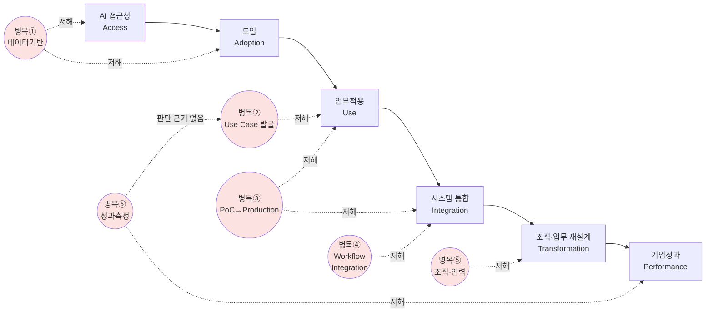

```toc  
minLevel: 2
maxLevel: 2
```

# 중소기업 AI 전환(AX) 성과 병목 분석


>[!note] 자료량이 방대해서 스크롤 압박이 있음
>자료 내용은 개인이 검토한 내용이라 오류가 있을 수 있음

## 목차

| 파일                   | 장   | 제목                    | 핵심 내용                                                   |
| -------------------- | --- | --------------------- | ------------------------------------------------------- |
| 00_연구보고서_요약.md       | —   | 연구보고서 요약              | Ⅰ~Ⅻ장·부록 전체를 약 5페이지로 압축, 주요 수치·근거 포함                     |
| 01_연구개요.md           | Ⅰ   | 연구 개요                 | 연구배경, 연구목적·질문(Q1~Q5), 방법론, 통합가설(H1~H5)                  |
| 02_AX개념과이론적배경.md     | Ⅱ   | AX의 개념과 이론적 배경        | DX-AX 재정립, OECD AI 성숙도 분류(Novice~Champion), 생산성 J-커브 이론 |
| 03_국내외AI도입현황.md      | Ⅲ   | 국내외 중소기업 AI 도입 현황     | 글로벌·국내 도입률, 광의-협의 지표 괴리, 서비스업·소상공인 현황                   |
| 04_6대구조적병목.md        | Ⅳ   | 중소기업 AX·DX의 6대 구조적 병목 | 병목①~⑥ 유형화, 병목 연결 다이어그램                                  |
| 05_병목의근본원인분석.md      | Ⅴ   | 병목의 근본원인 분석           | 기술·경제·조직·정책 4대 원인, GPU 조달 사례                            |
| 06_사례분석.md           | Ⅵ   | 중소기업 AI 도입 사례 분석      | KAMP 성공사례, 국내 실패 패턴, 성공-실패 비교                           |
| 07_국내정책현황분석.md       | Ⅶ   | 국내 AX·DX 정책 현황 분석     | 정책 추진체계, AI바우처·AX원스톱바우처 등 심층비교, 병목-정책 매핑                |
| 08_해외정책비교.md         | Ⅷ   | 해외 중소기업 AI 지원정책 비교    | 독일·EU·미국·일본·싱가포르·중국 비교                                  |
| 09_정책패러다임전환.md       | Ⅸ   | 정책 패러다임 전환 방향         | 기술공급 중심 패러다임의 한계, 문제기반 성과연계 패러다임 제안                     |
| 10_단계별지원체계와성과평가체계.md | Ⅹ   | 단계별 지원체계 재설계 및 성과평가체계 | 성숙도 연계형 지원체계, Output-Outcome-Impact 지표                  |
| 11_정책실행로드맵과결론.md     | Ⅺ   | 정책 실행 로드맵 및 결론        | 단기·중기·장기 과제, 5대 핵심 정책제언, 결론                             |
| 12_연구의한계및향후과제.md     | Ⅻ   | 연구의 한계 및 향후 과제        | 방법론적 한계, 확보하지 못한 데이터, 향후 실증연구 설계안                       |
| 13_부록.md             | —   | 부록                    | 국내 지원사업 심층비교표, 정책사다리, 참고문헌 통합(78건)                      |


---

## 중소기업 AI 전환(AX) 성과 병목 분석 요약


핵심 질문: "중소기업의 AI 도입은 왜 생산성·매출·품질 등 실질적 기업성과로 충분히 전환되지 않는가, 현행 정책은 이 전환 과정의 어느 지점을 지원하는가?"

---

### 01. 연구 개요

- OECD 2026년 조사: 글로벌 SME의 61%가 AI를 사용하나 76%는 최저단계(Novice)에 머무름. 도입 기업 중 '변혁적 효과' 체감은 21%뿐.
- 기업규모별 AI 격차는 2023년 23%p→2025년 35%p로 확대.
- 한국 SME AI 도입률 31%(일본 27%, 독일 51%). 국내 50~249인 27.4% vs 250인+ 63.3%.
- 통합가설 5개(H1~H5): 도입-성과 격차(H1), 업무통합 중요성(H2), 보완투자 필요성(H3), 조직전환 필요성(H4), 정책설계 전환 필요성(H5).
- 표본조사(설문·회귀분석)는 직접 수행하지 않고 문헌·정책매핑·사례연구로 대체(설계안은 12장에 별도 제시).

### 02. AX의 개념과 이론적 배경

- "AI 도입(Adoption)"과 "AI 전환(AX)"을 구분: 도구 사용 확대가 아니라 업무 판단·흐름 자체의 재설계가 AX.
- OECD/G7 'AI Adopters 분류체계' 채택: Novice→Explorer→Optimiser→Champion 4단계.
- 생산성 J-커브 이론(Brynjolfsson et al.): AI는 도입 초기 생산성을 오히려 낮추다가 보완투자 축적 후 상승. 2025년 미국 생산성 2.7%(과거10년평균 1.4%)를 이 이론으로 설명(Stanford AI Index 2026).
- 유럽 12,000개 기업 연구: AI 도입 시 생산성 +4%, 교육훈련 병행 시 +5.9%p 추가.
- 6단계 전환 경로 설정: Access→Adoption→Use→Integration→Transformation→Performance.

### 03. 국내외 중소기업 AI 도입 현황

- **핵심 발견**: "광의(31%)"와 "협의(제조 AI 실제 도입 0.1%)" 지표 간 극단적 괴리. 스마트공장 도입 75.5%가 데이터 수집만 하는 기초단계.
- 대한상의(2025.11): 중소기업 AI 활용도 정확히 4.2%(대기업 49.2%). AI 투자비용 부담 중소 79.7% vs 대기업 57.1%.
- 소상공인(중기중앙회, 2026.06): 광의 활용률 80.0%, 업종별 46~98% 편차. 정부 지원사업 참여경험 3.2%, 76.2%가 "몰랐다".
- 서울시 소상공인 조사: 실제 AI 도입 약 10%(광의 80%와 대비) — 제조업과 동일한 광의-협의 괴리 패턴 재확인.
- 한국 인구수준 AI 확산율 30.7%(18위, 조사국 중 최대 상승폭) — 기업지표와는 다른 척도.

### 04. 6대 구조적 병목

### 04. 6대 구조적 병목

- 6개 병목은 상호 강화적(병목⑥→②로 되먹임): 순차 해소가 아니라 구조 전체 개입 필요.
- 직무별 생산성 연구: 정형화된 업무(상담+14~15%, 개발+26%, 마케팅+50%, 회계+55%)는 효과 뚜렷, 판단력 요구 업무는 오히려 -19%(METR 연구, Stanford AI Index).

① 데이터·데이터 기반 부족
- 데이터가 정비되지 않아 AI가 학습·판단할 자산 자체가 없음

② AI Use Case 발굴 실패(대기업도 AI 고도화율 9%)
- "AI로 무엇을 풀 것인가"를 정의하는 역량·프로세스 부재

③ PoC→Production 단절(글로벌 PoC의 88%가 대규모 배포 부적합)
- 통제된 실험환경과 실제 현장의 간극, 확산을 이끌 주체·예산 부재

④ Workflow Integration 실패(OECD: 고립적용 2% vs 전사배포 23%, 11배 격차)
- AI 산출물이 기존 시스템·업무흐름과 분리된 채 고립적으로만 적용됨

⑤ 조직·인력 병목(AI전문인력 부재 80.7%)
- AI 활용 인력 부재, 충원 계획도 없음

⑥ 성과측정 실패
- 성과 기준이 없어 투자 타당성 판단과 확산 근거 확보가 불가능

### 05. 병목의 근본원인 분석

- 기술적: 데이터 인프라 미비 + GPU 임대료 43.6%↑(2025.Q1~2026.8) — 중소기업은 견적조차 못 받아 정부 AX 과제 입찰 포기 사례 확인(서울경제, 2026.09.21).
- 경제적: 초기투자비 부담 + 지속적으로 상승하는 클라우드 비용.
- 조직적: 매출규모별 AI 배포단계 격차(McKinsey/Stanford) — 국제적으로 공통된 패턴.
- 정책적: **GPU 조달 신청요건 자체가 병목을 심화시키는 역설** 확인.
- 4대 원인은 상호작용: 정책 설계가 기술적 병목을 완화하기는커녕 심화시키는 사례가 실제로 존재.

### 06. 사례분석

- 성공사례(KAMP, 정부검증 플랫폼): 인터로조(사출성형 공정 최적화), 정인산업(압출공정 AI), 임픽스(SI→AI솔루션 기업 전환).
- 실패패턴: 기업이 실패를 공개하지 않는 현실적 제약으로 개별사례 대신 패턴 분석. KOSA 조사(제조업 AI활용 17.9%, Use Case파악 어려움 41.6%) + 전문가 인터뷰(대기업 10~20억 vs 중소 3천만원 투자격차).
- 핵심 시사점: 성공사례는 모두 정부가 데이터·인프라를 **미리 표준화해 제공**한 경우. KAMP식 "공동 기반 제공"이 개별 바우처보다 효과적.

### 07. 국내 정책현황 분석

- NIPA 2026 예산 3조 1,223억 원(92개 사업). AI바우처 276.25억 원, AX원스톱바우처 260억 원(20개 과제). 소상공인 지원 직접사업 1조 3,410억 원(전년비+64%).
- AX원스톱바우처: AI바우처 등과 병존하는 상위 통합트랙. 컨소시엄 요건(배점40%)이 정작 영세기업 진입을 막는 역설.
- 성과관리 제도(5년 추적조사, AI바우처 성과발표회, 우수사례 공모전 10개사 선정)는 이미 존재 — 문제는 부재가 아니라 **집계·공개 여부가 불투명**하다는 것.
- 「AI 기본계획 2026~2028」이 AI인재양성 부처간 연계·효율화 방안 마련을 2026년 2분기 목표 실행과제로 제시.

### 08. 해외 정책비교

- 독일: Digitaler Mittelstand KI(PoC~운영단계 통합 지원) + Catena-X(민간 데이터표준 동맹, 세계 상위 100대 부품사 절반 이상 가동).
- EU: Digital Europe Programme(최대75%지원) + AI Act(2026.8 시행) — **지원과 규제를 결합**한 이중구조.
- 미국: NIST 중심 인프라·표준. SME 전용 AI교육법은 재발의 상태(미제정).
- 일본: 'デジタル化・AI導入補助金2026' — 사업명을 단일 브랜드로 통합.
- 싱가포르: AI도입률 4.3%→23.5% 등 **전수 집계 지표 공개**, 400% 세액공제.
- 중국: 시범기업 1,000곳·시범단지 100곳 육성하는 하향식 확산모델(확산효과 정량근거는 미확보).

### 09. 정책 패러다임 전환 방향

- 기존 "기술공급 중심 패러다임(Technology Push)"의 결함: 기술배급과 성과확인이 분리되어 피드백되지 않음.
- 제안: **'문제기반 성과연계 패러다임'** — Problem(문제정의)→AI(기술적용)→Process(업무재설계)→Performance(성과검증)→(다시 Problem으로 환류).
- 5대 참고원칙(해외사례 대응): 통합지원 진입장벽 완화(독일)/공동기반 우선구축(Catena-X·KAMP)/지원-사후관리 결합(EU)/접근경로 단순화(일본)/정량지표 공개(싱가포르).

### 10. 단계별 지원체계·성과평가체계

- 성숙도(Novice~Champion) 연계형 지원: 국내기업 76%가 Novice인데 현 정책은 Explorer~Optimiser에 초점 — **지원 무게중심이 한 단계 앞서 있음**.
- 제안: Novice단계 사전진단 신설, Optimiser단계 컨소시엄 매칭지원 신설, Champion단계 KAMP 서비스업 확장.
- Output-Outcome-Impact 3단 지표체계 제안. 현재 성과공개는 "선별적 우수사례"(AI바우처, NIA 등 모두 소수만 선별) → "전수 집계"로 전환 제안(단, 신규 의무 부과 아닌 기존 자료 활용).

### 11. 정책 실행 로드맵 및 결론

- 단기(1년): 사전진단·컨소시엄매칭 시범, 5년 추적자료 첫 집계, GPU 우선배정 검토.
- 중기(1~3년): 지표체계 정착, KAMP 서비스업 확장, 소상공인 26개 사업 창구 단순화.
- 장기(3~5년+): 지원-규제 결합 제도화, 성과환류 공식절차화.
- 5대 제언 모두 **신규 대규모 예산이 아닌 기존 요소의 연결**을 전제.
- 결론: 광의(31%)-협의(0.1%) 괴리로 요약되는 도입-성과 전환실패는 6대 병목과 4대 원인에서 비롯되며, 정책 설계(GPU요건·컨소시엄요건)가 병목을 오히려 심화시킨 사례가 확인됨. 해법은 새 예산이 아니라 기존 요소(AX원스톱·KAMP·5년추적)의 연결.


---

# 중소기업 AI 전환(AX) 성과 병목 분석

## Ⅰ. 연구 개요

### 1. 연구 배경 및 필요성

- 2026년 OECD D4SME 조사에서 중소기업의 61%가 AI 애플리케이션을 최소 1개 이상 사용 중인 것으로 나타난다.
    - 그러나 이 중 76%는 단순 범용 도구를 개별 업무에만 쓰는 'AI novice' 단계에 머무르며, 복수 업무에 AI를 통합 활용하는 'AI Explorer'는 5%, 조직 전반에 AI를 배치한 'AI Champion'은 3.6%에 불과하다.
> 출처 : [Empowering SMEs in the age of AI: The 2026 OECD D4SME Survey(OECD, 2026)](https://www.oecd.org/content/dam/oecd/en/publications/reports/2026/04/empowering-smes-in-the-age-of-ai_7f58652c/bf5a9816-en.pdf)

- AI 도입 기업 중 절반 이상(54%)이 최소한의 성과 개선을 보고하지만, '유의미하거나 변혁적인 효과'(significant or transformational impact)를 체감한 기업은 21%에 그친다.
    - 이는 "AI를 쓴다"는 것과 "AI로 성과를 낸다"는 것 사이에 뚜렷한 간극이 존재함을 보여주는 핵심 수치다.
> 출처 : [Empowering SMEs in the age of AI: The 2026 OECD D4SME Survey(OECD, 2026)](https://www.oecd.org/content/dam/oecd/en/publications/reports/2026/04/empowering-smes-in-the-age-of-ai_7f58652c/bf5a9816-en.pdf)

- 대기업과 중소기업 간 AI 활용 격차는 오히려 확대되는 추세다. 기업규모별 AI 활용 격차는 2023년 23%p에서 2025년 35%p로 벌어졌다.
> 출처 : [Empowering SMEs in the age of AI: The 2026 OECD D4SME Survey(OECD, 2026)](https://www.oecd.org/content/dam/oecd/en/publications/reports/2026/04/empowering-smes-in-the-age-of-ai_7f58652c/bf5a9816-en.pdf)

#### 1) 한국 중소기업의 상황

- 한국의 상황도 유사하다. OECD 조사에서 한국 중소기업의 AI 도입률은 31%로, 일본(27%)보다는 높지만 독일(51%)·아일랜드(45%)·오스트리아(42%)에 비해 낮은 수준이다.
    - 특히 국내 기업 규모별 격차가 뚜렷하다. 50~249인 기업의 AI 도입률은 27.4%인 반면, 250인 이상 기업은 63.3%로 2배 이상 차이가 난다.
> 출처 : [Artificial Intelligence and the Labour Market in Korea(OECD, 2025.10)](https://www.oecd.org/content/dam/oecd/en/publications/reports/2025/10/artificial-intelligence-and-the-labour-market-in-korea_af668423/68ab1a5a-en.pdf)

#### 2) 국내 정책 대응 현황

- 2026년 3월 12일 중기부·과기정통부·산업부 3개 부처는 AI 에이전트·AX 스프린트·산업AI 솔루션 실증·AI 바우처 등 총 11개 사업, 4,230억 원 규모의 2026년도 AX 사업을 통합 공고했다.
> 출처 : [중기부-과기정통부-산업부, AX 사업 통합 공고를 통해 기업의 사업 편의 제고(중소벤처기업부, 대한민국 정책브리핑, 2026.03.12)](https://www.korea.kr/briefing/pressReleaseView.do?newsId=156748625)

- 중소벤처기업부는 별도로 '중소기업 AI 전환 우수사례 공모전'을 2025년에 이어 2026년에도 2회째 시행 중이며, AI 도입을 통해 경영 성과를 낸 기업 사례를 발굴·확산하는 데 목적을 둔다.
> 출처 : [중소벤처기업부, 성과를 창출한 중소기업과 지역 AI 전환 유공자를 찾습니다(중소벤처기업부 보도자료 원문 재게재, 뉴스서울, 2026.09.01)](https://newsseoul.co.kr/news/view/1065622216297609)

이러한 배경에서, AI 접근성 확대와 정부 지원 확대라는 '공급 측면'의 변화 속도에 비해, 실제 기업 현장에서 도입이 성과로 전환되는 '수요 측면'의 병목이 무엇인지는 상대적으로 충분히 규명되지 않았다. 본 연구는 이 간극을 구조적으로 분석하는 데 목적을 둔다.

---

### 2. 연구 목적 및 핵심 연구질문

본 연구의 핵심 질문은 다음과 같다.

> "중소기업의 AI 도입은 왜 생산성·매출·품질 등 실질적 기업성과로 충분히 전환되지 않는가, 그리고 현행 정책은 이 전환 과정의 어느 지점을 지원하고 있는가?"

이를 세부적으로 아래 5개 질문으로 분해한다.

| 구분 | 세부 연구질문 | 주 대응 장 |
|---|---|---|
| Q1 | 국내외 중소기업의 AI 도입·활용 수준과 격차는 얼마나 벌어져 있는가 | Ⅲ |
| Q2 | AI 도입이 기업성과로 이어지는 과정에서 어느 단계에 병목이 발생하는가(6대 구조) | Ⅳ |
| Q3 | 이러한 병목은 기술·경제·조직·정책 중 어떤 근본원인에서 비롯되는가 | Ⅴ |
| Q4 | 국내외 실제 기업 사례는 이 병목구조를 어떻게 뒷받침하는가 | Ⅵ |
| Q5 | 현행 국내·해외 정책은 병목을 얼마나 해소하고 있으며, 어떤 정책설계로 전환해야 하는가 | Ⅶ, Ⅷ, Ⅸ, Ⅹ |

---

### 3. 연구방법론

| 방법론 | 적용 범위 |
|---|---|
| 문헌·정책자료 조사 | 전 장에 걸쳐 적용. OECD·중기부·과기정통부·산업부·NIPA 공식자료를 1차 출처로 우선 활용 |
| 병목구조 분석 | Ⅳ장. 문헌·해외사례 기반 6대 병목 유형화 |
| 국내외 정책 매핑 | Ⅶ·Ⅷ장. 병목별 정책 커버리지 대조 |
| 사례연구 | Ⅵ장. 중기부 AX 우수사례 공모전 등 공개자료 기반 심층조사 |

본 연구는 실제 표본조사(설문·회귀분석)를 직접 수행하지 않는다. 이는 조사 인프라·일정·예산이 본 연구 범위를 벗어나기 때문이며, 대신 Ⅻ장에서 향후 실증연구를 위한 설계안(표본설계·측정지표·분석모형)을 별도로 제시한다.

---

### 4. 통합 가설 체계

두 참고자료가 제시한 가설을 중복 제거·통합하여 아래 5개로 압축한다.

| 가설 | 내용 | 대응 장 |
|---|---|---|
| H1 | AI Adoption–Performance Gap: 중소기업의 AI 도입률 증가는 기업성과 증가와 동일한 비율로 연결되지 않는다 | Ⅲ, Ⅳ |
| H2 | Integration Hypothesis: AI의 기업성과는 단순 사용 여부보다 기존 업무프로세스·정보시스템과의 통합 수준에 더 크게 좌우된다 | Ⅳ, Ⅵ |
| H3 | Complementary Investment Hypothesis: AI 투자만으로는 불충분하며 데이터·인프라·인력·업무재설계 등 보완적 투자가 성과전환의 핵심 조건이다 | Ⅳ, Ⅴ |
| H4 | Organisational Transformation Hypothesis: AI를 도입해도 업무·조직 운영방식이 변화하지 않으면 성과효과가 제한된다 | Ⅴ, Ⅵ |
| H5 | Policy Design Hypothesis: 보급 중심 정책보다 업무통합·고도화·성과검증까지 연결하는 단계적 지원정책이 실질적 성과전환에 더 적합하다 | Ⅶ~Ⅹ |

---

### 출처 및 참고자료 목록

#### Ⅰ-1. 연구 배경 및 필요성
> 출처 : [Empowering SMEs in the age of AI: The 2026 OECD D4SME Survey(OECD, 2026)](https://www.oecd.org/content/dam/oecd/en/publications/reports/2026/04/empowering-smes-in-the-age-of-ai_7f58652c/bf5a9816-en.pdf)
> 출처 : [Artificial Intelligence and the Labour Market in Korea(OECD, 2025.10)](https://www.oecd.org/content/dam/oecd/en/publications/reports/2025/10/artificial-intelligence-and-the-labour-market-in-korea_af668423/68ab1a5a-en.pdf)
> 출처 : [중기부-과기정통부-산업부, AX 사업 통합 공고를 통해 기업의 사업 편의 제고(중소벤처기업부, 대한민국 정책브리핑, 2026.03.12)](https://www.korea.kr/briefing/pressReleaseView.do?newsId=156748625)
> 출처 : [중소벤처기업부, 성과를 창출한 중소기업과 지역 AI 전환 유공자를 찾습니다(중소벤처기업부 보도자료 원문 재게재, 뉴스서울, 2026.09.01)](https://newsseoul.co.kr/news/view/1065622216297609)


---

# 중소기업 AI 전환(AX) 성과 병목 분석과 정책 재설계

## Ⅱ. AX의 개념과 이론적 배경

### 1. DX와 AX의 개념적 재정립

#### 1) AX의 정의

- AX(AI Transformation, 인공지능 전환)는 기존 디지털 전환(DX)을 넘어, AI 기술을 중심에 두고 산업·조직의 구조, 업무 방식, 의사결정 과정을 전면 재구성하는 흐름을 뜻한다. 2025년 12월 과기정통부·국방부·산업부·중기부 4개 부처가 국방 AX 협력을 발표하며 사용한 정의이기도 하다.
> 출처 : [과기정통부·국방부·산업부·중기부, 최초 맞손…국방 AX 본격 협력(ZDNet Korea, 2025.12.03)](https://zdnet.co.kr/view/?no=20251203173515)

- DX와 AX는 단절 관계가 아니라 연속 관계다. DX가 축적한 디지털 데이터·클라우드·프로세스 기반이 없으면 AX 단계의 LLM·RAG 등 AI 기술이 참조할 원료 자체가 없기 때문이다. 즉 DX는 "업무 수단을 디지털로 바꾸는 전환"이고, AX는 "업무의 판단 주체와 방식을 바꾸는 전환"으로 구분된다.
> 출처 : [AX vs DX — 디지털 전환과 AI 전환, 무엇이 다른가(MSAP.ai, 2026 게재)](https://www.msap.ai/ax/ax-vs-dx/)

#### 2) "AI 도입"과 "AI 전환(AX)"의 구분

일부 AX 관련 논의에서는 "AI가 업무의 주체가 되고, 인간은 검증·승인 역할로 축소된다"는 식의 표현이 쓰이기도 하나, 본 연구는 이러한 과도한 표현을 채택하지 않는다. 업계 정의를 검토한 결과에서도 AX의 핵심은 AI가 인간을 대체하는 것이 아니라, **AI가 판단을 보조하거나 1차 실행을 담당하고 인간이 예외처리·전략판단을 맡는 방식으로 업무 흐름 자체가 재설계되는 것**에 있다. 즉:

- **AI 도입(Adoption):** 특정 부서가 챗봇·문서요약 등 개별 도구를 도입해 쓰기 시작하는 단계. 도구의 수가 늘어나는 것.
- **AI 전환(AX):** 업무의 판단 흐름 자체가 AI를 중심으로 재설계되는 것. 예컨대 고객 응대의 1차 분류·응답을 AI가 담당하고 사람이 예외 건만 처리하도록 업무 절차 자체를 재구성하는 경우.

> 출처 : [AX(AI 전환)란 무엇인가 — 정의부터 DX와의 차이, 추진 4단계까지(MSAP.ai, 2026 게재)](https://msap.ai/blog-home/blog/what-is-ax)

이 구분은 본 연구 전체를 관통하는 핵심 전제다. Ⅲ장 이하에서 다루는 "AI 도입률"은 이 정의상 **도입(Adoption) 단계의 지표**이며, 본 연구가 규명하고자 하는 "성과 병목"은 도입 이후 전환(AX)으로 이어지지 못하는 지점에서 발생한다.

---

### 2. AI 활용 성숙도 모델

#### 1) 모델 선정 근거

AI 활용 성숙도 분류에는 여러 접근이 있을 수 있으나, 본 연구는 외부에서 공식적으로 검증된 모델을 우선한다. OECD가 G7 산업·디지털·기술 트랙을 위해 개발하고 2025년 12월 G7 장관성명(SME AI Adoption Blueprint)에서 정책설계 도구로 공식 채택한 **"AI Adopters 분류체계"(Taxonomy of AI Adopters)**를 채택한다. 이는 디지털 성숙도·AI 활용 복잡성·적용 범위라는 3개 기준으로 SME를 4개 유형으로 분류하는 모델이다.
> 출처 : [AI adoption by small and medium-sized enterprises: OECD discussion paper for the G7(OECD, 2025.12)](https://www.oecd.org/content/dam/oecd/en/publications/reports/2025/12/ai-adoption-by-small-and-medium-sized-enterprises_9c48eae6/426399c1-en.pdf)
> 출처 : [G7 Industry, Digital and Technology Ministerial Statement on the SME AI Adoption Blueprint(G7, 2025.12.09)](https://www.g7.utoronto.ca/ict/2025-sme-ai-adoption-blueprint.html)

#### 2) OECD/G7 AI Adopters 분류체계

| 유형 | 정의 | 적용 범위 |
|---|---|---|
| AI Novices | 챗GPT·Copilot 등 범용 도구를 주변적 업무에 초기 실험 수준으로 활용 | 개별·고립적 업무 |
| AI Explorers | 데이터 집약적 맥락에서 맞춤형·업종특화 AI를 제한된 규모로 실험 | 특정 기능 단위 |
| AI Optimisers | 여러 업무 기능에 걸쳐 다수의 AI 도구를 통합 활용 | 복수 기능 단위 |
| AI Champions | 통합 인프라·데이터·내부역량을 기반으로 운영·전략 의사결정 전반에 AI를 내재화 | 조직 전체 |

> 출처 : [AI adoption by small and medium-sized enterprises: OECD discussion paper for the G7(OECD, 2025.12)](https://www.oecd.org/content/dam/oecd/en/publications/reports/2025/12/ai-adoption-by-small-and-medium-sized-enterprises_9c48eae6/426399c1-en.pdf)

#### 3) 글로벌 SME의 분포 현황

- 2026년 OECD D4SME 조사에서 조사대상 SME의 61%가 AI를 사용 중이지만, 이 중 76%가 AI Novice 단계에 머무른다. AI Explorer는 5%, AI Champion은 3.6%에 불과하다.
    - 즉 "AI를 쓴다"고 답한 기업 10곳 중 약 8곳이 여전히 가장 낮은 활용 단계에 머물러 있다는 뜻이며, 이는 Ⅰ장에서 제시한 '21%만 변혁적 효과 체감'이라는 수치와 정합적으로 연결된다.
> 출처 : [Empowering SMEs in the age of AI: The 2026 OECD D4SME Survey(OECD, 2026)](https://www.oecd.org/content/dam/oecd/en/publications/reports/2026/04/empowering-smes-in-the-age-of-ai_7f58652c/bf5a9816-en.pdf)

---

### 3. AI 도입-성과 전환구조: Adoption-Performance Gap 모형

#### 1) 이론적 근거: 생산성 J-커브와 범용기술 확산이론

AI 도입이 곧바로 기업성과로 이어지지 않는 현상은 본 연구만의 관찰이 아니라, **'AI 생산성 역설(AI Productivity Paradox)'**이라는 이름으로 국제 학계에서 폭넓게 연구되어 온 주제다.

- Brynjolfsson, Rock & Syverson(2021)은 AI와 같은 범용기술(General Purpose Technology)이 도입 초기에는 오히려 생산성을 일시적으로 낮추고, 조직 재설계·업무 프로세스 재구축·인력 재교육 등 '보완적 무형투자'(complementary intangible investments)가 축적된 이후에야 생산성이 가속적으로 상승하는 패턴을 보인다는 **'생산성 J-커브'** 이론을 제시했다. 전기화(electrification)의 역사적 사례에서도 실제 생산성 효과가 온전히 나타나기까지 20~30년의 보완투자 기간이 필요했다.
> 출처 : [Artificial Intelligence and the Modern Productivity Paradox(Brynjolfsson, Rock & Syverson, NBER Working Paper No.24001)](https://www.nber.org/system/files/working_papers/w24001/w24001.pdf)

- 이 이론은 제조업 현장에서도 실증적으로 확인된다. MIT Sloan이 소개한 최근 연구에서는, AI를 업무기능에 도입한 기업들이 규모·업력·자본·IT 인프라 등을 통제한 이후에도 오히려 생산성이 1.33%p 하락하는 것으로 나타났다. 이는 신규 디지털 도구와 기존 운영 프로세스 간의 정합성 부족에서 비롯되며, 데이터 인프라·인력교육·업무흐름 재설계라는 보완투자가 갖춰지지 않으면 첨단 AI 시스템조차 성과 대신 새로운 병목을 만들어낸다는 것이 확인되었다.
> 출처 : [The 'productivity paradox' of AI adoption in manufacturing firms(MIT Sloan, 게재일 미상)](https://mitsloan.mit.edu/ideas-made-to-matter/productivity-paradox-ai-adoption-manufacturing-firms)

#### 2) 2026년 최신 실증: 스탠포드 AI Index가 재확인한 J-커브와 보완투자 효과

스탠포드대 인간중심AI연구소(HAI)가 2026년 발간한 'AI Index Report 2026'(9회차)은 이 이론을 최신 데이터로 재확인한다.

- 유럽 12,000개 기업(2019~2024년)을 분석한 연구(Aldasoro et al., 2026)는 AI 도입이 노동생산성을 4% 높였으며, 교육훈련을 병행한 기업에서는 훈련 지출 1%당 5.9%p의 추가 생산성 향상이 나타났다고 보고했다. 이는 Ⅱ.3.1)에서 다룬 '보완적 투자'(H3) 가설을 뒷받침하는 최신 국제 근거다.
- 2025년 미국 생산성 증가율은 2.7%로, 이전 10년 평균(1.4%)의 거의 2배였다. Brynjolfsson(2026)은 이를 "AI 도입 기업들이 비용을 먼저 흡수하고, 이후 더 큰 생산성 향상이 통계로 나타나는" J-커브 초기 국면으로 해석했다. OECD도 향후 10년간 G7 경제권에서 연 0.2~1.3%p의 생산성 향상을 전망한다(Filippucci et al., 2025).
- 그러나 동시에, 4개국 경영진 6,000명을 대상으로 한 별도 조사(Yotzov et al., 2026)는 "광범위한 도입에도 불구하고 실질적으로 체감되는 생산성 향상은 미미했다"고 보고하며, 향후 3년간 고용이 0.7% 감소할 것으로 전망했다. 이는 본 연구의 핵심 문제의식(H1, Adoption-Performance Gap)이 한국에 국한된 현상이 아니라 2026년 현재 국제적으로 확인되는 패턴임을 보여준다.
> 출처 : [AI Index Report 2026, Chapter 4: Economy(Stanford HAI, 2026)](https://hai.stanford.edu/assets/files/ai_index_report_2026_chapter_4_economy.pdf)

이 국제 학계의 논의는 본 연구의 핵심 문제의식과 정확히 일치한다. 즉 "AI 도입률이 늘어도 성과가 뒤따르지 않는다"는 현상은 일시적 이상 현상이 아니라, **범용기술이 확산되는 과정에서 구조적으로 나타나는 이행기 현상(transition-period phenomenon)**이며, 이 이행기를 단축시키는 것이 바로 정책 개입의 역할이다.

#### 2) 분석틀 설정: 6단계 전환 경로

위 이론적 배경 위에서, 본 연구는 아래 6단계 전환 경로를 분석틀로 채택한다. 이는 특정 기관의 공식 모델이 아니라 **본 연구가 Ⅳ장 이하의 병목 분석을 위해 설정하는 자체 분석 프레임**임을 명시한다.

```
AI 접근성(Access) → 도입(Adoption) → 업무적용(Use) → 시스템 통합(Integration)
→ 조직·업무 재설계(Transformation) → 기업성과(Performance)
```

각 단계는 J-커브 이론의 '보완적 무형투자' 개념과 아래와 같이 대응한다.

| 전환 단계 | 정의 | J-커브 이론과의 대응 | 실패 시 나타나는 현상 |
|---|---|---|---|
| Access | AI 기술·서비스에 접근할 수 있는 여건(인터넷·클라우드·예산) | 물적 기반 | 애초에 도구를 써볼 기회조차 없음 |
| Adoption | 개별 부서·업무 단위에서 AI 도구를 도입해 사용 시작 | 초기 투자 | 표면적 '도입률' 통계는 상승 |
| Use | 특정 업무에서 AI를 실제로, 반복적으로 활용 | 초기 투자의 정착 | 시범적으로만 쓰고 중단(1회성 PoC) |
| Integration | AI 산출물이 ERP·MES 등 기존 정보시스템·업무흐름에 연결 | 보완투자(프로세스 재구축) | AI 결과가 별도 산출물로 고립, 재입력 필요 |
| Transformation | 업무 절차·조직·역할이 AI 중심으로 재설계 | 보완투자(조직 재설계·인력 재교육) | 기존 업무에 AI가 '추가'될 뿐 구조는 그대로 |
| Performance | 생산성·매출·품질 등 실질 경영성과로 귀결 | J-커브의 상승 구간 | 성과 측정 자체가 이뤄지지 않음(Ⅳ장 병목⑥) |

핵심 논리는, 각 단계 사이에서 발생하는 이탈·저해 요인이 누적되어 최종적으로 도입률 대비 성과전환율을 낮춘다는 것이다(H1). 특히 Integration과 Transformation 두 단계가 J-커브 이론이 강조하는 '보완적 무형투자'에 해당하며, 국내외 다수 연구가 바로 이 두 단계에서 병목이 집중된다고 지적한다(H2, H4). Ⅳ장은 이 프레임 위에서 "어느 화살표 구간에서, 왜 병목이 발생하는가"를 6개 병목 유형으로 분해한다.

#### 3) 전환의 전제조건(Enablers)

OECD는 SME의 AI 도입을 위한 4대 전제조건으로 **연결성(connectivity), 데이터·알고리즘·컴퓨트(data, algorithms and compute), 역량(skills), 자금(finance)**을 제시한다. 이 네 가지가 갖춰지지 않으면 위 전환 경로의 초기 단계(Access→Adoption)부터 정체된다.
> 출처 : [AI adoption by small and medium-sized enterprises: OECD discussion paper for the G7(OECD, 2025.12)](https://www.oecd.org/content/dam/oecd/en/publications/reports/2025/12/ai-adoption-by-small-and-medium-sized-enterprises_9c48eae6/426399c1-en.pdf)

이 4대 전제조건은 Ⅳ장의 병목①(디지털·데이터 기반)·병목⑥(경제성) 분석과 직접 연결되며, Ⅴ장(근본원인 분석)에서 기술적·경제적 원인 구조로 재구성된다.

---

### 출처 및 참고자료 목록

#### Ⅱ-1. DX와 AX의 개념적 재정립
> 출처 : [과기정통부·국방부·산업부·중기부, 최초 맞손…국방 AX 본격 협력(ZDNet Korea, 2025.12.03)](https://zdnet.co.kr/view/?no=20251203173515)
> 출처 : [AX vs DX — 디지털 전환과 AI 전환, 무엇이 다른가(MSAP.ai, 2026 게재)](https://www.msap.ai/ax/ax-vs-dx/)
> 출처 : [AX(AI 전환)란 무엇인가 — 정의부터 DX와의 차이, 추진 4단계까지(MSAP.ai, 2026 게재)](https://msap.ai/blog-home/blog/what-is-ax)

#### Ⅱ-2. AI 활용 성숙도 모델
> 출처 : [AI adoption by small and medium-sized enterprises: OECD discussion paper for the G7(OECD, 2025.12)](https://www.oecd.org/content/dam/oecd/en/publications/reports/2025/12/ai-adoption-by-small-and-medium-sized-enterprises_9c48eae6/426399c1-en.pdf)
> 출처 : [G7 Industry, Digital and Technology Ministerial Statement on the SME AI Adoption Blueprint(G7, 2025.12.09)](https://www.g7.utoronto.ca/ict/2025-sme-ai-adoption-blueprint.html)
> 출처 : [Empowering SMEs in the age of AI: The 2026 OECD D4SME Survey(OECD, 2026)](https://www.oecd.org/content/dam/oecd/en/publications/reports/2026/04/empowering-smes-in-the-age-of-ai_7f58652c/bf5a9816-en.pdf)

#### Ⅱ-3. AI 도입-성과 전환구조
> 출처 : [Artificial Intelligence and the Modern Productivity Paradox(Brynjolfsson, Rock & Syverson, NBER Working Paper No.24001)](https://www.nber.org/system/files/working_papers/w24001/w24001.pdf)
> 출처 : [The 'productivity paradox' of AI adoption in manufacturing firms(MIT Sloan, 게재일 미상)](https://mitsloan.mit.edu/ideas-made-to-matter/productivity-paradox-ai-adoption-manufacturing-firms)
> 출처 : [AI adoption by small and medium-sized enterprises: OECD discussion paper for the G7(OECD, 2025.12)](https://www.oecd.org/content/dam/oecd/en/publications/reports/2025/12/ai-adoption-by-small-and-medium-sized-enterprises_9c48eae6/426399c1-en.pdf)
> 출처 : [AI Index Report 2026, Chapter 4: Economy(Stanford HAI, 2026)](https://hai.stanford.edu/assets/files/ai_index_report_2026_chapter_4_economy.pdf)


---

# 중소기업 AI 전환(AX) 성과 병목 분석과 정책 재설계

## Ⅲ. 국내외 중소기업 AI 도입 현황

### 1. 글로벌 현황

#### 1) OECD 전체 도입률 추이

- OECD 회원국 전체 기업의 AI 사용률(10인 이상 기업 기준)은 2023년 8.7%에서 2024년 14.2%, 2025년 20.2%로 2년 만에 2배 이상 증가했다.
> 출처 : [AI use by individuals surges across the OECD as adoption by firms continues to expand(OECD, 2026.01)](https://www.oecd.org/en/about/news/announcements/2026/01/ai-use-by-individuals-surges-across-the-oecd-as-adoption-by-firms-continues-to-expand.html)

#### 2) 기업 규모별 격차

| 규모 | 2024년 | 2025년(잠정) |
|---|---|---|
| 대기업(250인 이상) | 40% | 약 52% |
| 중견기업(50~249인) | 20.4% | 약 30% |
| 소기업(10~49인) | 11.9% | 약 17% |

- 규모별 격차는 빠르게 벌어지고 있다. 대기업과 소기업 간 도입률 격차는 2023년 23%p에서 2025년 35%p로 확대되었다.
> 출처 : [AI adoption by small and medium-sized enterprises: OECD discussion paper for the G7(OECD, 2025.12)](https://www.oecd.org/content/dam/oecd/en/publications/reports/2025/12/ai-adoption-by-small-and-medium-sized-enterprises_9c48eae6/426399c1-en.pdf)
> 출처 : [Empowering SMEs in the age of AI: The 2026 OECD D4SME Survey(OECD, 2026)](https://www.oecd.org/content/dam/oecd/en/publications/reports/2026/04/empowering-smes-in-the-age-of-ai_7f58652c/bf5a9816-en.pdf)

#### 3) 산업별 격차

- 2025년 기준 업종별 AI 사용률은 ICT 산업이 57.3%로 가장 높고, 전문·과학·기술서비스업이 36.8%로 뒤를 잇는다. 반면 건설업(7.2%)·숙박음식업(7.8%, 2024년 기준)은 여전히 낮은 수준에 머문다.
    - 지식집약적 서비스업에 AI 활용이 집중되고, 전통 제조·대면서비스업은 확산이 더디다는 뜻이다.
> 출처 : [AI use by individuals surges across the OECD as adoption by firms continues to expand(OECD, 2026.01)](https://www.oecd.org/en/about/news/announcements/2026/01/ai-use-by-individuals-surges-across-the-oecd-as-adoption-by-firms-continues-to-expand.html)

#### 4) 참고: 인구 수준 AI 확산율에서 본 한국의 위치

지금까지의 수치는 모두 "기업"을 조사 단위로 한 것이다. 이와 별개로, 스탠포드 AI Index 2026이 인용한 Microsoft AI Economy Institute 자료는 "인구 대비 AI 사용률"이라는 다른 척도로 국가를 비교한다. 이 기준에서 한국은 2025년 하반기 30.7%로 조사대상 30개국 중 18위였으며, 상반기(25.9%) 대비 4.8%p 상승해 조사대상국 중 가장 큰 상승폭을 기록했다(25위→18위). 싱가포르(60.9%)·아랍에미리트(64.0%)가 최상위권이며, 미국은 AI 투자·모델개발을 주도함에도 28.3%로 24위에 그쳤다.
> 출처 : [AI Index Report 2026, Chapter 4: Economy(Stanford HAI, 2026 — 원자료: Microsoft AI Economy Institute, 2025)](https://hai.stanford.edu/assets/files/ai_index_report_2026_chapter_4_economy.pdf)

이 수치는 "기업의 AI 도입률"이 아니라 "개인의 AI 사용률"이라는 점에서 본 장의 다른 통계와 직접 비교할 수는 없다. 다만 한국이 기업 단위에서는 격차·병목이 뚜렷한 반면, 개인 단위 확산 속도는 국제적으로 빠른 편에 속한다는 점은, "개인 차원의 AI 친숙도가 기업의 AI 전환으로 자연 전이되지 않는다"는 본 연구의 문제의식(Ⅱ장 AI 도입≠AX)을 다른 각도에서 뒷받침한다.

---

### 2. 국내 현황 및 대·중소 양극화

#### 1) 광의의 AI 사용률: 국제비교 관점

- OECD 조사에서 한국 중소기업의 AI 도입률은 31%로, 일본(27%)보다는 높지만 독일(51%)에 비해서는 크게 낮다. 국내 기업 규모별로도 50~249인 기업 27.4% 대 250인 이상 기업 63.3%로 격차가 뚜렷하다(Ⅰ장 참조).
> 출처 : [Artificial Intelligence and the Labour Market in Korea(OECD, 2025.10)](https://www.oecd.org/content/dam/oecd/en/publications/reports/2025/10/artificial-intelligence-and-the-labour-market-in-korea_af668423/68ab1a5a-en.pdf)

#### 2) 협의의 AI 사용률: 국내 1차 통계로 본 실제 그림

**그러나 위 수치는 챗봇·문서작성 도구 등 범용 AI 사용까지 폭넓게 포함하는 자기응답 기반 지표다.** 생산 현장에 실제로 AI가 통합된 정도를 보여주는 국내 1차 통계는 전혀 다른 그림을 보여준다.

- 중소벤처기업부·스마트제조혁신추진단이 2025년 4월 28일 발표한 「제1차 스마트제조혁신 실태조사」(정책브리핑 공식 보도자료)에 따르면, 공장을 보유한 중소·중견 제조기업 16만 3,273개사 중 스마트공장 도입률은 19.5%(중소기업 18.6%)다. 그러나 이 중 제조 AI를 실제로 도입한 기업은 전체의 **0.1%**에 불과하며, 전체 지능형(스마트)공장의 75.5%는 기초단계(센서·바코드로 데이터 수집만 하고 분석·공정최적화에는 미활용)에 머물러 있다. 보도자료 부제 자체가 "스마트공장 활용률은 80%를 상회, 제조AI 도입률은 0.1% 수준"이다.
    - 다섯 곳 중 한 곳이 스마트공장을 갖추었지만, 천 곳 중 한 곳만 AI를 실제로 쓰고 있는 구조다.
> 출처 : [2024년 스마트제조혁신실태조사 결과 발표(중소벤처기업부, 대한민국 정책브리핑, 2025.04.28)](https://www.korea.kr/briefing/pressReleaseView.do?newsId=156686561)

- 같은 실태조사에서 기업규모별 격차도 뚜렷하다. 조사대상 기업 구성은 소상공인 61.8%·소기업 27.2%·중기업 9.7%·중견기업 1.3%였으며, 기업 규모가 클수록 스마트공장 도입률이 높아지는 것으로 확인됐다.
> 출처 : [2024년 스마트제조혁신실태조사 결과 발표(중소벤처기업부, 대한민국 정책브리핑, 2025.04.28)](https://www.korea.kr/briefing/pressReleaseView.do?newsId=156686561)

- 대한상공회의소가 2025년 11월 19일 발표한 「K-성장 시리즈(7) 기업의 AI 전환 실태와 개선방안」보고서(제조기업 504개사 대상)에서도, 응답 기업의 82.3%가 'AI를 경영에 활용하지 않고 있다'(개인 단위 생성형 AI 사용은 제외하고 생산·물류·운영 등 AI 솔루션 도입·활용 여부만 질문)고 답했다. 대기업의 AI 활용률(49.2%)에 비해 중소기업은 **4.2%**에 그쳤다.
    - 같은 보고서에서 AI 투자비용이 '부담된다'고 답한 기업은 73.6%였고, 규모별로는 대기업(57.1%)보다 중소기업(79.7%)의 부담 호소 비율이 더 높았다.
> 출처 : [K-성장 시리즈(7) 기업의 AI 전환 실태와 개선방안 보고서(대한상공회의소, 2025.11.19)](https://www.korcham.net/nCham/Service/Economy/appl/KcciReportDetail.asp?SEQ_NO_C010=20120943454&CHAM_CD=B001)

#### 3) 두 통계 간 괴리가 갖는 의미

"한국 중소기업 AI 도입률 31%"(OECD, 광의)와 "제조 AI 실제 도입률 0.1%"(중기부, 협의)라는 두 수치는 서로 다른 대상을 측정한 것이지만, 그 괴리 자체가 본 연구의 핵심 문제의식을 뒷받침한다. 즉 **"AI를 쓴다"는 응답과 "AI가 업무구조에 통합되어 있다"는 사실은 전혀 다른 차원**이라는 것이며, 이는 Ⅱ장에서 정립한 "AI 도입(Adoption)"과 "AI 전환(AX)"의 구분이 통계적으로도 확인되는 지점이다. (아래 Ⅲ.4.3에서 서비스·소상공인 부문에서도 동일한 패턴이 재확인됨을 다룬다.) 이후 장부터는 어느 수치를 인용하든 반드시 측정 정의(광의의 사용 vs 협의의 통합)를 함께 명시한다.

---

### 3. 산업·규모별 격차의 배경 요인

3.2에서 확인한 극단적인 격차(제조업 실제 AI 도입 0.1%)는 왜 발생하는가. 국내 조사들은 공통적으로 인력·비용·데이터 세 가지 배경 요인을 지목한다. 이는 Ⅳ장의 병목 분석으로 이어지는 예비적 근거다.

| 배경 요인 | 수치 | 조사 주체·시점 |
|---|---|---|
| AI 전문인력 부재 | 80.7% | 대한상공회의소, 2025.11 |
| AI 인력 충원 계획 없음 | 82.1% | 대한상공회의소, 2025.11 |
| 스마트공장 운영 애로: 전문 운영인력 부족 | 43.8% | 중소기업중앙회, 2025.10(스마트공장 참여기업 502개사) |
| 스마트공장 운영 애로: 유지관리 비용 부담 | 25.9% | 중소기업중앙회, 2025.10 |
| 데이터 관련 애로: 담당자·전문인력 부족 | 50.4% | 중소기업중앙회, 2025.10 |
| AI 도입 투자예정액 1억 원 이하 | 68.9% | 중소기업중앙회, 2025.10 |
| AI 도입 최대 장애요인: 초기 투자비 부담 | 44.2% | 중소기업중앙회, 2025.10 |
> 출처 : [스마트공장 사업 참여기업 운영실태 조사(중소기업중앙회, 2025.10, 스마트공장 참여기업 502개사) — 원문 미확인·재인용: 제조 AI 도입률 0.1%, 소형 AI가 답이 못 되는 이유(한국데이터경제신문, 2026.09.14)](https://www.dataeconomy.co.kr/news/articleView.html?idxno=42577)

한편 도입에 성공한 기업의 성과는 이 격차를 방치할 수 없는 이유를 보여준다. KDI 분석에 따르면 스마트공장을 성공적으로 도입한 7,903개사는 평균 생산성 28.5% 증가, 품질 42.5% 향상, 원가 15.5% 절감을 달성했다.
> 출처 : [스마트공장 도입효과 분석(KDI) — 원문 미확인·재인용: 제조 AI 도입률 0.1%, 소형 AI가 답이 못 되는 이유(한국데이터경제신문, 2026.09.14)](https://www.dataeconomy.co.kr/news/articleView.html?idxno=42577)

정부도 이 격차를 인지하고 있다. 중소벤처기업부는 2025년 10월 'AI 기반 스마트제조혁신 3.0 전략'을 통해 2030년까지 AI 스마트공장 1만 2천 개를 보급하여 AI 도입률을 약 1%에서 10%로 끌어올리겠다는 목표를 제시했다. 2026년 정부 AI 총예산은 9.9조 원으로 전년(3.3조 원) 대비 3배 증가했다.
> 출처 : ['AI 기반 스마트제조혁신 3.0 전략'(중소벤처기업부, 2025.10) — 원문 미확인·재인용: 제조 AI 도입률 0.1%, 소형 AI가 답이 못 되는 이유(한국데이터경제신문, 2026.09.14)](https://www.dataeconomy.co.kr/news/articleView.html?idxno=42577)

### 4. 서비스업·소상공인 부문 보충조사

#### 1) 소상공인 디지털·AI 활용 현황

- 중소기업중앙회가 2026년 6월 9일 발표한 '소상공인 DX·AX 현황 및 정책 수요 설문조사'(소상공인 500개사 대상)에 따르면, 소상공인의 80.0%가 디지털·AI 기술을 활용 중이라고 응답했다(활용 경험 없음 19.6%, 활용 중단 0.4%). 다만 이 조사의 원문 보고서(PDF)는 중소기업중앙회 누리집에서 직접 확인하지 못했으며, 발표일과 수치는 복수 언론(더퍼블릭·시사저널·이데일리)이 동일하게 보도한 내용을 교차 확인한 것이다.
    - 이 수치에는 키오스크·배달앱·문서작성 프로그램 등 일상적 디지털 도구 활용까지 폭넓게 포함되어 있어, Ⅲ.2에서 확인한 "광의의 AI 사용률"과 같은 성격의 지표로 해석해야 한다.
> 출처 : ['소상공인 DX·AX 현황 및 정책 수요 설문조사'(중소기업중앙회, 2026.06.09 발표, 소상공인 500개사) — 원문 미확인·재인용: 더퍼블릭](https://www.thepublic.kr/news/articleView.html?idxno=307250)

- 업종별 편차가 크다. 교육·여가업이 98.0%로 가장 높고, 외식업(94.5%)·개인서비스업(94.0%)·숙박업(92.0%)이 뒤를 잇는다. 반면 소매업은 46.0%에 그쳐 업종 간 최대 52%p 차이를 보인다.
> 출처 : ['소상공인 DX·AX 현황 및 정책 수요 설문조사'(중소기업중앙회, 2026.06.09 발표) — 원문 미확인·재인용: 시사저널](https://www.sisajournal.com/news/articleView.html?idxno=375810)

- 활용 중인 업체 중에서도 절반 이상(52.8%)이 '입문 단계'(키오스크·배달앱·SNS 등 보편화된 도구를 무리 없이 사용하는 수준)에 머물러, Ⅱ장에서 정립한 OECD 'AI Novice' 개념과 유사한 양상이 소상공인 부문에서도 확인된다.
> 출처 : ['소상공인 DX·AX 현황 및 정책 수요 설문조사'(중소기업중앙회, 2026.06.09 발표) — 원문 미확인·재인용: 이데일리](https://edaily.co.kr/News/Read?mediaCodeNo=257&newsId=03020886645480080)

#### 2) 활용 분야 및 정책 체감도

- 활용 분야는 경영지원(54.5%, 그중 디지털 POS 68.3%)이 가장 많고, 고객응대(31.8%, AI 통화비서·챗봇 66.9%), 판매·유통(22.3%, 온라인쇼핑몰 운영 51.1%), 마케팅·홍보(21.3%, SNS 채널 운영 52.9%) 순이다. 디지털·AI 활용 기업의 70%는 업무 효율이 개선되었다고 응답했다.
> 출처 : ['소상공인 DX·AX 현황 및 정책 수요 설문조사'(중소기업중앙회, 2026.06.09 발표) — 원문 미확인·재인용: 이데일리](https://edaily.co.kr/News/Read?mediaCodeNo=257&newsId=03020886645480080)

- 그러나 정부 디지털·AI 지원사업 참여 경험은 3.2%에 불과했고, 비참여 사유로는 "지원사업이 있는 줄 몰랐다"는 응답이 76.2%에 달했다. 가장 필요한 정책으로는 운영비 지원, AI 교육·서비스 도입 지원이 꼽혔다.
> 출처 : ['소상공인 DX·AX 현황 및 정책 수요 설문조사'(중소기업중앙회, 2026.06.09 발표) — 원문 미확인·재인용: 시사저널](https://www.sisajournal.com/news/articleView.html?idxno=375810)

이는 Ⅶ장(국내 정책현황 분석)에서 다룰 정책 인지도·접근성 문제의 핵심 근거가 된다. "정책이 없어서"가 아니라 "정책을 몰라서" 소상공인의 정책 체감도가 낮다는 점은, 이후 병목 분석(Ⅳ장)에서 정보 비대칭 요인으로 다룰 필요가 있다.

#### 3) 협의의 지표: 서비스·소상공인 부문에서도 확인되는 광의-협의 괴리

중소기업중앙회 서울지역본부가 실시한 '서울시 소상공인 AI 인식 및 활용 수준 실태조사'는 "실제 사업장에 AI를 도입한 소상공인은 10곳 중 1곳(약 10%)에 그친다"고 밝혔다. 이는 중기중앙회 전국조사의 "광의 80.0%"와 극명하게 대비되는 수치다.

이로써 Ⅲ.2에서 제조업 부문에 대해 확인한 "광의 31% vs 협의 0.1%" 패턴이, 서비스·소상공인 부문에서도 "광의 80.0% vs 협의 약 10%"라는 유사한 구조로 재확인된다. 측정 정의에 따라 통계가 크게 달라진다는 점은 제조업만의 특수성이 아니라, 한국 중소기업 AI 통계 전반에 걸친 일반적 패턴으로 판단된다.
> 출처 : ['서울시 소상공인 AI 인식 및 활용 수준 실태조사'(중소기업중앙회 서울지역본부, 발표일 미상) — 원문 미확인·재인용: 데일리안, 2026.09.23](https://www.dailian.co.kr/news/view/1693939/%EC%84%9C%EC%9A%B8-%EC%98%81%EB%93%B1%ED%8F%AC%EA%B5%AC-%EC%86%8C%EC%83%81%EA%B3%B5%EC%9D%B8-%EB%8C%80%EC%83%81-AI-%EC%8B%A4-2026)

#### 4) 제조업-서비스업 활용 패턴 비교 (참고자료, 2023년 조사)

한국지능정보사회진흥원 계열 SPRi의 2023년 8월 이슈리포트(2021~2022년 조사 자료 기반)는 제조업과 서비스업의 AI 활용 패턴 차이를 보여준다. 다만 조사 시점이 3년 이상 경과했으므로 추세 확인용 참고자료로만 활용하고, 수치 자체는 최신성이 낮음을 명시한다.

| 구분 | 제조업 | 서비스업 |
|---|---|---|
| AI 도입 1년 미만 기업 비중 | 20.7% | 26.6% |
| 외부 경로(구매·위탁개발)로 AI 도입하는 비중 | 36.3% | 57.4% |
| 주된 AI 활용 분야 | 생산관리(79.6%), 제품/서비스 개발(62.7%) | 고객지원·응대(54.0%) 등 |
> 출처 : [국내 인공지능(AI) 도입기업 현황 분석 및 시사점(SPRi 이슈리포트 IS-164, 2023.08.30)](https://spri.kr/download/23319)

이 표는 제조업이 자체 개발·내재화 경향이 강한 반면, 서비스업은 외부 상용 솔루션 구매·위탁 비중이 높다는 방향성을 보여준다. Ⅳ장(병목 분석)에서 병목②(Use Case 발굴)·병목①(데이터 기반) 논의 시 이 업종 간 차이를 고려한다.

---

### 출처 및 참고자료 목록

#### Ⅲ-1. 글로벌 현황
> 출처 : [AI use by individuals surges across the OECD as adoption by firms continues to expand(OECD, 2026.01)](https://www.oecd.org/en/about/news/announcements/2026/01/ai-use-by-individuals-surges-across-the-oecd-as-adoption-by-firms-continues-to-expand.html)
> 출처 : [AI adoption by small and medium-sized enterprises: OECD discussion paper for the G7(OECD, 2025.12)](https://www.oecd.org/content/dam/oecd/en/publications/reports/2025/12/ai-adoption-by-small-and-medium-sized-enterprises_9c48eae6/426399c1-en.pdf)
> 출처 : [Empowering SMEs in the age of AI: The 2026 OECD D4SME Survey(OECD, 2026)](https://www.oecd.org/content/dam/oecd/en/publications/reports/2026/04/empowering-smes-in-the-age-of-ai_7f58652c/bf5a9816-en.pdf)
> 출처 : [AI Index Report 2026, Chapter 4: Economy(Stanford HAI, 2026)](https://hai.stanford.edu/assets/files/ai_index_report_2026_chapter_4_economy.pdf)

#### Ⅲ-2. 국내 현황 및 대·중소 양극화
> 출처 : [Artificial Intelligence and the Labour Market in Korea(OECD, 2025.10)](https://www.oecd.org/content/dam/oecd/en/publications/reports/2025/10/artificial-intelligence-and-the-labour-market-in-korea_af668423/68ab1a5a-en.pdf)
> 출처 : [2024년 스마트제조혁신실태조사 결과 발표(중소벤처기업부, 대한민국 정책브리핑, 2025.04.28)](https://www.korea.kr/briefing/pressReleaseView.do?newsId=156686561)
> 출처 : [K-성장 시리즈(7) 기업의 AI 전환 실태와 개선방안 보고서(대한상공회의소, 2025.11.19)](https://www.korcham.net/nCham/Service/Economy/appl/KcciReportDetail.asp?SEQ_NO_C010=20120943454&CHAM_CD=B001)

#### Ⅲ-3. 산업·규모별 격차의 배경 요인(제조업)
> 출처 : [스마트공장 사업 참여기업 운영실태 조사(중소기업중앙회, 2025.10, 502개사) — 원문 미확인·재인용: 한국데이터경제신문, 2026.09.14](https://www.dataeconomy.co.kr/news/articleView.html?idxno=42577)
> 출처 : ['AI 기반 스마트제조혁신 3.0 전략'(중소벤처기업부, 2025.10) — 원문 미확인·재인용: 한국데이터경제신문, 2026.09.14](https://www.dataeconomy.co.kr/news/articleView.html?idxno=42577)
> 출처 : [K-성장 시리즈(7) 기업의 AI 전환 실태와 개선방안 보고서(대한상공회의소, 2025.11.19)](https://www.korcham.net/nCham/Service/Economy/appl/KcciReportDetail.asp?SEQ_NO_C010=20120943454&CHAM_CD=B001)
> 출처 : [2024년 스마트제조혁신실태조사 결과 발표(중소벤처기업부, 대한민국 정책브리핑, 2025.04.28)](https://www.korea.kr/briefing/pressReleaseView.do?newsId=156686561)

#### Ⅲ-4. 서비스업·소상공인 부문 보충조사
> 출처 : ['소상공인 DX·AX 현황 및 정책 수요 설문조사'(중소기업중앙회, 2026.06.09 발표, 소상공인 500개사) — 원문 미확인·재인용: 더퍼블릭](https://www.thepublic.kr/news/articleView.html?idxno=307250)
> 출처 : ['소상공인 DX·AX 현황 및 정책 수요 설문조사'(중소기업중앙회, 2026.06.09 발표) — 원문 미확인·재인용: 시사저널](https://www.sisajournal.com/news/articleView.html?idxno=375810)
> 출처 : ['소상공인 DX·AX 현황 및 정책 수요 설문조사'(중소기업중앙회, 2026.06.09 발표) — 원문 미확인·재인용: 이데일리](https://edaily.co.kr/News/Read?mediaCodeNo=257&newsId=03020886645480080)
> 출처 : ['서울시 소상공인 AI 인식 및 활용 수준 실태조사'(중소기업중앙회 서울지역본부, 발표일 미상) — 원문 미확인·재인용: 데일리안, 2026.09.23](https://www.dailian.co.kr/news/view/1693939/%EC%84%9C%EC%9A%B8-%EC%98%81%EB%93%B1%ED%8F%AC%EA%B5%AC-%EC%86%8C%EC%83%81%EA%B3%B5%EC%9D%B8-%EB%8C%80%EC%83%81-AI-%EC%8B%A4-2026)
> 출처 : [국내 인공지능(AI) 도입기업 현황 분석 및 시사점(SPRi 이슈리포트 IS-164, 2023.08.30)](https://spri.kr/download/23319)


---

# 중소기업 AI 전환(AX) 성과 병목 분석과 정책 재설계

## Ⅳ. 중소기업 AX·DX의 6대 구조적 병목

Ⅱ장에서 설정한 6단계 전환 경로(Access→Adoption→Use→Integration→Transformation→Performance) 위에서, 각 단계 전환을 가로막는 병목을 6개 유형으로 분해한다. 병목①은 Access·Adoption 단계, 병목②·③은 Use 단계, 병목④는 Integration 단계, 병목⑤는 Transformation 단계, 병목⑥은 Performance 단계와 대응한다.

### 한눈에 보는 6대 병목

| 병목 | 병목명 | 병목 사유 | 대응 전환단계 |
|---|---|---|---|
| ① | 디지털·데이터 기반 부족 | 데이터가 정비되지 않아 AI가 학습·판단할 자산 자체가 없음 | Access → Adoption |
| ② | AI Use Case 발굴 실패 | "AI로 무엇을 풀 것인가"를 정의하는 역량·프로세스 부재(대기업도 동일) | Use |
| ③ | PoC→Production 단절 | 통제된 실험환경과 실제 현장의 간극, 확산을 이끌 주체·예산 부재 | Use → Integration |
| ④ | Workflow Integration 실패 | AI 산출물이 기존 시스템·업무흐름과 분리된 채 고립적으로만 적용됨 | Integration |
| ⑤ | 조직·인력 병목 | AI 활용 인력 부재, 충원 계획도 없음 | Transformation |
| ⑥ | 성과측정 실패 | 성과 기준이 없어 투자 타당성 판단과 확산 근거 확보가 불가능 | Performance |

### 6대 병목의 연결 구조

아래 다이어그램은 6단계 전환 경로 위에 6개 병목이 어느 지점을 저해하는지, 그리고 병목⑥(성과측정 실패)이 다시 병목②(Use Case 발굴)로 되먹임되는 구조를 보여준다. 성과 기준이 없으면 어떤 Use Case를 우선할지 판단할 근거도 사라지기 때문이다(Ⅳ.7 참조).



이 되먹임 구조 때문에 병목은 순차적으로 하나씩 해소한다고 풀리지 않으며, Ⅴ장에서는 이를 기술·경제·조직·정책이라는 4대 근본원인 축으로 재구성해 정책개입 지점을 좁힌다.

---

### 1. 병목① — 디지털·데이터 기반 부족

#### 1) 현상

Ⅲ장에서 확인했듯, 국내 스마트공장 도입 기업의 75.5%는 센서·바코드로 데이터를 수집만 할 뿐 분석·공정최적화에는 활용하지 못하는 기초단계에 머문다. AI가 학습·판단할 데이터 자체가 정비되지 않은 상태에서는 그 다음 단계(Use, Integration)로 나아갈 수 없다.
> 출처 : [2024년 스마트제조혁신실태조사 결과 발표(중소벤처기업부, 대한민국 정책브리핑, 2025.04.28)](https://www.korea.kr/briefing/pressReleaseView.do?newsId=156686561)

#### 2) 정부도 인지하는 구조적 한계

2026년 9월 7일 과기정통부·중소벤처기업부가 KAIST 피지컬 AI 실증랩에서 공동 발표한 중소 제조기업 지원계획에서도, 중소 제조기업이 신기술을 현장에 적용하지 못하는 이유로 전문인력·기술도입경험·데이터·실증기회 부족 4가지를 꼽았다. 이 중 데이터·실증기회 부족은 외부에서 컨설팅이나 인력을 투입한다고 바로 해소되지 않는, 개별 공장 내부에서만 축적 가능한 종류의 병목이라는 점에서 다른 병목과 성격이 다르다.
> 출처 : [과학기술정보통신부·중소벤처기업부 공동 보도자료(2026.09.07, KAIST 피지컬 AI 실증랩) — 원문 미확인·재인용: 중소 제조 피지컬 AI 도입 — 데이터·실증 병목과 제조AI 24(Pebblous, 2026.09)](https://blog.pebblous.ai/blog/korea-sme-factory-physical-ai-data-custody/ko/)

---

### 2. 병목② — AI Use Case 발굴 실패

#### 1) 현상: 대기업조차 겪는 "관심-과제" 전환 실패

2026년 9월 14일 AWS코리아가 발표한 조사에 따르면, 한국 대기업의 AI '고도화율'은 9%에 불과하다. 스트랜드 파트너스의 닉 본스토우 디렉터는 "기업 경영진과 대화해 보면 AI 도입에 대한 높은 관심을 구체적인 사업 과제로 연결하는 데 어려움을 겪는 경우가 많다"고 분석했다.
    - 이는 중소기업만의 문제가 아니라 한국 기업 전반의 구조적 병목임을 보여준다. 도입 의욕이나 예산 부족이 아니라, "AI로 우리 회사의 어떤 문제를 풀 것인가"를 정의하는 역량 자체가 부족하다는 뜻이다.
> 출처 : [AWS코리아 "한국 대기업 AI 고도화율 9%…경영진 주도 전략·데이터·인재 정비 필요"(CIO Korea, 2026.09.14, 원자료: AWS Korea press event 2026)](https://www.cio.com/article/4221377/aws%EC%BD%94%EB%A6%AC%EC%95%84-%ED%95%9C%EA%B5%AD-%EB%8C%80%EA%B8%B0%EC%97%85-ai-%EA%B3%A0%EB%8F%84%ED%99%94%EC%9C%A8-9%EA%B2%BD%EC%98%81%EC%A7%84-%EC%A3%BC%EB%8F%84-%EC%A0%84.html)

#### 2) 공급자 중심 매칭 구조

국내 AI 바우처 사업은 수요기업이 필요를 정의하기보다, 등록된 공급기업의 솔루션 목록에서 선택하는 방식으로 설계되어 있다(일반·의료·AI반도체·소상공인·글로벌 5개 분야, 기업당 최대 2억 원 바우처). 이 구조는 기술 접근성은 낮추지만, "우리 회사의 핵심 문제가 무엇인가"라는 진단 과정 없이 곧바로 솔루션 매칭으로 넘어갈 위험이 있다.
> 출처 : [425억원 'AI 바우처 사업' 본격화…선정 기업 공통점 살펴보니(디지털데일리, 2025.03.10)](https://www.ddaily.co.kr/page/view/2025031018395853970)

#### 3) 왜 Use Case에 따라 성과가 갈리는가: 업무 구조의 문제

Use Case 발굴이 왜 어려운지는 스탠포드 AI Index 2026이 정리한 직무별 생산성 연구로 설명력이 보강된다. 여러 개별 연구를 종합하면, AI의 생산성 효과는 업무 구조에 따라 크게 갈린다.

| 연구 | 직무 | AI 적용 방식 | 생산성 변화 |
|---|---|---|---|
| Brynjolfsson et al.(2025) | 고객상담원 | 대화형 어시스턴트 | +14~15%(시간당 처리 건수) |
| Cui et al.(2025) | 소프트웨어 개발자 | GitHub Copilot | +26%(PR 완료 건수) |
| Ju & Aral(2025) | 마케팅팀 | 멀티모달 광고 제작 | +50%(인당 산출물) |
| Choi & Xie(2025) | 회계사 | AI 기반 회계 | +55%(주간 처리량) |
| Becker et al.(METR, 2025) | 개발자(오픈소스) | AI 코딩 보조 | **-19%(속도 저하)** — 체감 유용성과 실제 성과 간 괴리 |
> 출처 : [AI Index Report 2026, Chapter 4: Economy(Stanford HAI, 2026)](https://hai.stanford.edu/assets/files/ai_index_report_2026_chapter_4_economy.pdf)

공통 패턴은 명확하다. **정형화되어 있고 결과물의 품질을 쉽게 확인할 수 있는 업무**(상담·코딩·광고제작·회계)에서는 뚜렷한 생산성 향상이 나타나지만, METR 연구처럼 판단력·맥락 이해가 깊이 요구되는 업무에서는 오히려 속도가 느려지는 경우도 있다. 이는 Use Case 발굴 실패(병목②)가 단순히 "아이디어가 없어서"가 아니라, **업무를 정형화된 하위 작업으로 분해하는 역량 자체가 부족**하기 때문임을 시사한다. Ⅲ장에서 확인한 국내 제조업(생산관리·품질검사 중심)·서비스업(고객응대 중심)의 활용 패턴도 이 "정형화된 업무 우선" 원칙과 부합한다.

---

### 3. 병목③ — PoC에서 실제 운영(Production)으로 전환되지 못함

#### 1) 현상: 글로벌 통계로 본 PoC 성공률의 허상

IDC가 레노버와 공동 수행한 연구에 따르면, 관찰된 AI PoC의 88%가 대규모 배포에는 적합하지 않은 것으로 나타났다. 기업이 추진하는 AI PoC 33건 중 실제 생산(운영) 단계로 넘어가는 것은 4건에 불과하다. 이는 한국에 국한된 수치가 아니라 글로벌 조사 결과이지만, 국내 사례들과 정확히 같은 패턴을 보인다.
> 출처 : [AI 파일럿 88%가 실용화에 실패··· 이면의 역학은?(CIO Korea, 2026 게재 — 원자료: IDC·Lenovo 공동연구)](https://www.cio.com/article/3854098/ai-%ED%8C%8C%EC%9D%BC%EB%9F%BF-88%EA%B0%80-%EC%8B%A4%EC%9A%A9%ED%99%94%EC%97%90-%EC%8B%A4%ED%8C%A8%C2%B7%C2%B7%C2%B7-%EC%9D%B4%EB%A9%B4%EC%9D%98-%EC%97%AD%ED%95%99%EC%9D%80.html)

#### 2) 국내 사례: "실패하는 PoC는 없지만 확산에서 무너진다"

2026년 개최된 'AI 서밋 서울 2026'에서 KB금융·HD현대·롯데쇼핑 3개사가 공유한 사례는 공통된 문제의식을 보여준다. KB금융 관계자는 "사실 실패하는 PoC는 없다. 처음 테스트하면 다 성공적인데 확산 단계에서는 잘 안 되는 경우가 대부분이다. 사용자가 다르기 때문"이라고 밝혔다.
    - 이는 PoC의 통제된 환경(선별된 데이터, 소수의 숙련된 테스트 사용자)과 실제 현장(다수의 비숙련 사용자, 정제되지 않은 데이터)의 간극이 핵심 원인임을 시사한다.
> 출처 : ["실패하는 PoC는 없지만…" 기업 AI, 성패는 '전사 확산'(아이티데일리, 2026 게재, AI 서밋 서울 2026 패널)](https://www.itdaily.kr/news/articleView.html?idxno=241080)

#### 3) 중소기업에서의 함의

이 사례들은 모두 대기업 사례라는 한계가 있다. 그러나 Ⅲ장에서 확인한 중소기업의 자원 제약(전문인력 부재 80.7%, 인력 충원계획 없음 82.1%)을 고려하면, 대기업도 어려워하는 "PoC→확산" 전환이 중소기업에서는 훨씬 더 어려울 것으로 추정된다. **다만 이는 추정이며, 중소기업 특정 PoC 전환율 통계는 직접 확보하지 못했다.** 이는 Ⅻ장(연구의 한계)에 후속 조사 과제로 명시한다.

---

### 4. 병목④ — Workflow Integration 실패

#### 1) 핵심 근거: 통합 범위와 성과의 11배 격차

2026년 OECD D4SME 조사는 이 병목을 가장 명확한 수치로 보여준다. AI를 고립된 단일 업무에만 적용하는 기업 중 '변혁적 효과'를 보고한 비율은 2%에 불과하지만, AI를 전사적으로 배포한 기업에서는 이 비율이 23%로 11배 이상 높아진다.
    - 조사 대상 SME의 56.6%는 여전히 AI를 고립된 업무에만 쓰고 있으며, 복수 기능 또는 전사적으로 AI를 적용하는 기업은 19%에 그친다.
> 출처 : [Empowering SMEs in the age of AI: The 2026 OECD D4SME Survey(OECD, 2026)](https://www.oecd.org/content/dam/oecd/en/publications/reports/2026/04/empowering-smes-in-the-age-of-ai_7f58652c/bf5a9816-en.pdf)

#### 2) 해석

이 수치는 본 연구의 핵심 가설(H2, Integration Hypothesis)을 가장 직접적으로 뒷받침하는 국제 통계다. "AI를 쓰는가 안 쓰는가"보다 "얼마나 넓은 업무 범위에 통합했는가"가 성과를 가르는 결정적 변수라는 것이며, 이는 Ⅱ장의 6단계 전환 모형에서 Integration 단계가 왜 핵심 병목 지점인지를 실증적으로 뒷받침한다.

---

### 5. 병목⑤ — 조직·인력 병목

#### 1) 현상

Ⅲ장에서 확인한 대한상공회의소 조사(2025.11.19, 제조기업 504개사)에 따르면, AI 전문인력이 없다는 응답은 80.7%, AI 인력을 충원할 계획이 없다는 응답은 82.1%였다. 중소기업중앙회 조사(2025.10, 스마트공장 참여기업 502개사, 원문 미확인)에서도 스마트공장 운영의 가장 큰 어려움으로 전문 운영인력 부족(43.8%)이 꼽혔다.
> 출처 : [K-성장 시리즈(7) 기업의 AI 전환 실태와 개선방안 보고서(대한상공회의소, 2025.11.19)](https://www.korcham.net/nCham/Service/Economy/appl/KcciReportDetail.asp?SEQ_NO_C010=20120943454&CHAM_CD=B001)

#### 2) 대기업도 예외가 아니다

AWS코리아·스트랜드 파트너스 조사(2026.09.14)는 "AI를 활용하려는 기업은 많지만, 이를 기존 업무에 통합하고 일하는 방식까지 바꿀 기반은 충분하지 않다"고 지적한다. 조직·인력 병목이 중소기업 고유의 문제가 아니라, 한국 기업 전반이 AI 전환 과정에서 공통적으로 겪는 구조적 병목임을 시사한다.
> 출처 : [AWS코리아 "한국 대기업 AI 고도화율 9%…경영진 주도 전략·데이터·인재 정비 필요"(CIO Korea, 2026.09.14)](https://www.cio.com/article/4221377/aws%EC%BD%94%EB%A6%AC%EC%95%84-%ED%95%9C%EA%B5%AD-%EB%8C%80%EA%B8%B0%EC%97%85-ai-%EA%B3%A0%EB%8F%84%ED%99%94%EC%9C%A8-9%EA%B2%BD%EC%98%81%EC%A7%84-%EC%A3%BC%EB%8F%84-%EC%A0%84.html)

---

### 6. 병목⑥ — 성과측정 실패

#### 1) 현상: 성과 기준의 부재가 확산 자체를 막는다

AWS코리아·스트랜드 파트너스 조사는 "활용 사례가 늘어나더라도 성과 기준이 정해져 있지 않으면 추가 투자의 타당성을 판단하거나 성공 사례를 조직 전체로 확산하기 어렵다"고 지적한다. 이는 병목⑥이 단순히 '평가의 문제'가 아니라, 병목②~⑤ 해소 여부를 판단할 기준 자체가 없어 정책·투자 결정이 막힌다는 점에서 다른 병목들과 상호작용하는 구조적 문제임을 보여준다.
> 출처 : [AWS코리아 "한국 대기업 AI 고도화율 9%…경영진 주도 전략·데이터·인재 정비 필요"(CIO Korea, 2026.09.14)](https://www.cio.com/article/4221377/aws%EC%BD%94%EB%A6%AC%EC%95%84-%ED%95%9C%EA%B5%AD-%EB%8C%80%EA%B8%B0%EC%97%85-ai-%EA%B3%A0%EB%8F%84%ED%99%94%EC%9C%A8-9%EA%B2%BD%EC%98%81%EC%A7%84-%EC%A3%BC%EB%8F%84-%EC%A0%84.html)

#### 2) 정책평가 지표의 한계 (Ⅶ장으로 연결)

Ⅲ장에서 소개한 중소기업중앙회 소상공인 조사가 시사하듯, 정부 지원사업 참여 경험은 3.2%에 불과했다. 만약 정책평가의 KPI가 "AI 도입 기업 수"처럼 투입·산출 중심으로만 설계되어 있다면, "정책을 몰라서" 참여하지 못하는 76.2%의 존재나 "PoC는 성공했지만 확산에 실패"하는 구조적 병목을 포착하지 못한다. 이 논점은 Ⅶ장(국내 정책현황 분석)과 Ⅹ장(성과평가체계 재설계)에서 구체적인 정책 KPI 대안으로 이어간다.

---

### 7. 6대 병목 종합

| 병목 | 대응 전환 단계 | 핵심 근거 수치 | 핵심 출처 |
|---|---|---|---|
| ① 디지털·데이터 기반 | Access→Adoption | 스마트공장 75.5% 기초단계 | 중기부, 2025.04.28 |
| ② Use Case 발굴 실패 | Use | 대기업 AI 고도화율 9% | AWS코리아, 2026.09.14 |
| ③ PoC→Production 단절 | Use→Integration | PoC의 88% 대규모 배포 부적합(글로벌) | IDC·Lenovo |
| ④ Workflow Integration 실패 | Integration | 고립적용 2% vs 전사배포 23% 변혁효과 | OECD D4SME, 2026 |
| ⑤ 조직·인력 병목 | Transformation | AI 전문인력 부재 80.7% | 대한상의, 2025.11.19 |
| ⑥ 성과측정 실패 | Performance | 정책 참여경험 3.2%(인지도 문제) | 중기중앙회(원문 미확인) |

6개 병목은 순차적이라기보다 상호 강화적이다. 성과측정 기준(⑥)이 없으면 어떤 Use Case(②)가 우선순위인지 판단할 근거가 없고, 조직·인력(⑤)이 없으면 PoC를 확산(③)시킬 주체가 없으며, 데이터 기반(①)이 없으면 애초에 통합(④)할 대상 자체가 없다. 이 상호연결성은 Ⅴ장(근본원인 분석)에서 기술·경제·조직·정책이라는 4대 원인 축으로 재구성한다.

---

### 출처 및 참고자료 목록

#### Ⅳ-1. 병목① 디지털·데이터 기반
> 출처 : [2024년 스마트제조혁신실태조사 결과 발표(중소벤처기업부, 대한민국 정책브리핑, 2025.04.28)](https://www.korea.kr/briefing/pressReleaseView.do?newsId=156686561)
> 출처 : [과학기술정보통신부·중소벤처기업부 공동 보도자료(2026.09.07) — 원문 미확인·재인용: Pebblous, 2026.09](https://blog.pebblous.ai/blog/korea-sme-factory-physical-ai-data-custody/ko/)

#### Ⅳ-2. 병목② Use Case 발굴 실패
> 출처 : [AWS코리아 "한국 대기업 AI 고도화율 9%…경영진 주도 전략·데이터·인재 정비 필요"(CIO Korea, 2026.09.14)](https://www.cio.com/article/4221377/aws%EC%BD%94%EB%A6%AC%EC%95%84-%ED%95%9C%EA%B5%AD-%EB%8C%80%EA%B8%B0%EC%97%85-ai-%EA%B3%A0%EB%8F%84%ED%99%94%EC%9C%A8-9%EA%B2%BD%EC%98%81%EC%A7%84-%EC%A3%BC%EB%8F%84-%EC%A0%84.html)
> 출처 : [425억원 'AI 바우처 사업' 본격화…선정 기업 공통점 살펴보니(디지털데일리, 2025.03.10)](https://www.ddaily.co.kr/page/view/2025031018395853970)
> 출처 : [AI Index Report 2026, Chapter 4: Economy(Stanford HAI, 2026)](https://hai.stanford.edu/assets/files/ai_index_report_2026_chapter_4_economy.pdf)

#### Ⅳ-3. 병목③ PoC→Production 단절
> 출처 : [AI 파일럿 88%가 실용화에 실패···(CIO Korea — 원자료: IDC·Lenovo)](https://www.cio.com/article/3854098/ai-%ED%8C%8C%EC%9D%BC%EB%9F%BF-88%EA%B0%80-%EC%8B%A4%EC%9A%A9%ED%99%94%EC%97%90-%EC%8B%A4%ED%8C%A8%C2%B7%C2%B7%C2%B7-%EC%9D%B4%EB%A9%B4%EC%9D%98-%EC%97%AD%ED%95%99%EC%9D%80.html)
> 출처 : ["실패하는 PoC는 없지만…" 기업 AI, 성패는 '전사 확산'(아이티데일리, 2026)](https://www.itdaily.kr/news/articleView.html?idxno=241080)

#### Ⅳ-4. 병목④ Workflow Integration 실패
> 출처 : [Empowering SMEs in the age of AI: The 2026 OECD D4SME Survey(OECD, 2026)](https://www.oecd.org/content/dam/oecd/en/publications/reports/2026/04/empowering-smes-in-the-age-of-ai_7f58652c/bf5a9816-en.pdf)

#### Ⅳ-5. 병목⑤ 조직·인력 병목
> 출처 : [K-성장 시리즈(7) 기업의 AI 전환 실태와 개선방안 보고서(대한상공회의소, 2025.11.19)](https://www.korcham.net/nCham/Service/Economy/appl/KcciReportDetail.asp?SEQ_NO_C010=20120943454&CHAM_CD=B001)
> 출처 : [AWS코리아 "한국 대기업 AI 고도화율 9%…경영진 주도 전략·데이터·인재 정비 필요"(CIO Korea, 2026.09.14)](https://www.cio.com/article/4221377/aws%EC%BD%94%EB%A6%AC%EC%95%84-%ED%95%9C%EA%B5%AD-%EB%8C%80%EA%B8%B0%EC%97%85-ai-%EA%B3%A0%EB%8F%84%ED%99%94%EC%9C%A8-9%EA%B2%BD%EC%98%81%EC%A7%84-%EC%A3%BC%EB%8F%84-%EC%A0%84.html)

#### Ⅳ-6. 병목⑥ 성과측정 실패
> 출처 : [AWS코리아 "한국 대기업 AI 고도화율 9%…경영진 주도 전략·데이터·인재 정비 필요"(CIO Korea, 2026.09.14)](https://www.cio.com/article/4221377/aws%EC%BD%94%EB%A6%AC%EC%95%84-%ED%95%9C%EA%B5%AD-%EB%8C%80%EA%B8%B0%EC%97%85-ai-%EA%B3%A0%EB%8F%84%ED%99%94%EC%9C%A8-9%EA%B2%BD%EC%98%81%EC%A7%84-%EC%A3%BC%EB%8F%84-%EC%A0%84.html)


---

# 중소기업 AI 전환(AX) 성과 병목 분석과 정책 재설계

## Ⅴ. 병목의 근본원인 분석

Ⅳ장에서 유형화한 6대 병목은 "어디에서" 막히는지를 보여준다. 본 장은 "왜" 막히는지를 기술적·경제적·조직적·정책적 4대 원인 축으로 재구성한다. 하나의 병목이 하나의 원인에서만 비롯되지 않으며, 대부분 복수 원인이 중첩되어 나타난다.

---

### 1. 기술적 원인

#### 1) 데이터 인프라 미비 (병목①과 직결)

Ⅳ장에서 확인했듯 국내 스마트공장의 75.5%가 데이터 수집만 하고 분석에는 활용하지 못하는 기초단계에 머문다. 이는 레거시 시스템, 데이터 사일로, 표준 부재가 겹친 결과다.

#### 2) 연산자원(GPU·컴퓨트) 접근성의 새로운 격차

2026년 9월 21일 서울경제 단독 보도는 이 기술적 원인의 최신 국면을 보여준다. 데이터 분야 AI 스타트업 A사는 정부 유관기관의 AX 사업 입찰을 준비하다 GPU를 확보하지 못해 사업 참여 자체를 포기했다. GPUaaS 업체 8곳에 문의했으나 "사용량을 확약하기 어렵거나 이용 규모가 작으면 견적서도 주지 않는다"는 답을 들었다.
    - 시장조사업체 세미애널리시스에 따르면, 전 세계 H100 클라우드 임대료는 2025년 1분기 말 시간당 1.95달러에서 2026년 8월 말 2.80달러로 43.6% 상승했다. 신형 GPU가 출시된 뒤에도 구세대 제품 수요까지 몰리는 것은 AI 연산 수요, 특히 추론 수요가 공급 확대 속도를 웃돌기 때문이다.
    - 클라우드 사업자들은 GPU 가동률이 수익과 직결되어 대규모·장기 계약 고객을 선호하며, 이 때문에 물량과 가격을 미리 확정하기 어려운 중소기업·스타트업은 입찰 단계에서부터 불리해진다. 업계 관계자는 "사실상 GPU를 이미 많이 확보한 대기업을 중심으로 AX 시장이 돌아갈 수밖에 없다"고 진단했다.
> 출처 : ["8곳 문의했는데 견적조차 못 받아"…칩 임대 못해 AX 포기도(서울경제, 2026.09.21)](https://www.sedaily.com/article/20093598)

이 사례가 중요한 이유는, 연산자원 격차가 "AI를 도입할 자금이 없다"는 기존의 경제적 병목 서술과는 성격이 다르기 때문이다. 자금이 있어도 **물리적으로 GPU 물량 자체를 배정받지 못하는** 공급 측 제약이며, 이는 정책 설계(공모형 AX 과제가 사전에 확정된 예산으로 GPU 이용료를 산정하도록 요구하는 구조)와도 맞물려 병목②(과제 참여 자체의 좌절)로 직결된다.

---

### 2. 경제적 원인

#### 1) 초기 투자비 부담

Ⅳ장에서 확인한 대한상의 조사(2025.11.19)에 따르면 AI 투자비용이 '부담된다'고 답한 기업은 73.6%였고, 중소기업(79.7%)이 대기업(57.1%)보다 부담을 크게 느꼈다.
> 출처 : [K-성장 시리즈(7) 기업의 AI 전환 실태와 개선방안 보고서(대한상공회의소, 2025.11.19)](https://www.korcham.net/nCham/Service/Economy/appl/KcciReportDetail.asp?SEQ_NO_C010=20120943454&CHAM_CD=B001)

#### 2) 구조적으로 상승하는 지속비용

위 기술적 원인에서 확인한 GPU 임대료 상승(연 43.6%)은 일회성 구축비가 아니라 **지속적으로 커지는 운영비**라는 점에서 중소기업에 더 큰 경제적 부담이 된다. 초기 투자비만 계산하고 클라우드 사용료·데이터 정제·유지보수 등 총소유비용(TCO)을 고려하지 않는 정책 설계는 이 구조적 상승분을 반영하지 못한다.

#### 3) ROI 불확실성

Use Case가 명확하지 않은 상태(병목②)에서 투자하면 ROI를 사전에 추정하기 어렵고, 이는 다시 투자 결정을 지연시키는 악순환을 만든다. 즉 경제적 원인은 기술적 원인(병목①, GPU 격차)과 조직적 원인(병목②, Use Case 부재)에 종속적으로 작용하는 측면이 크다.

---

### 3. 조직적 원인

#### 1) 전문인력 부재

Ⅲ·Ⅳ장에서 반복 확인된 수치다. 대한상의 조사에서 AI 전문인력이 없다는 응답은 80.7%, 인력을 충원할 계획이 없다는 응답도 82.1%에 달했다.

#### 2) 경영진 차원의 전략 부재 — 대기업도 예외 아님

AWS코리아·스트랜드 파트너스 조사(2026.09.14)는 이 조직적 원인이 중소기업에 국한되지 않는다는 점을 보여준다. 한국 대기업의 AI 고도화율은 9%에 그치며, 그 원인은 "AI 도입에 대한 높은 관심을 구체적인 사업 과제로 연결하는" 경영진 차원의 역량과 전략 부재였다.
> 출처 : [AWS코리아 "한국 대기업 AI 고도화율 9%…경영진 주도 전략·데이터·인재 정비 필요"(CIO Korea, 2026.09.14)](https://www.cio.com/article/4221377/aws%EC%BD%94%EB%A6%AC%EC%95%84-%ED%95%9C%EA%B5%AD-%EB%8C%80%EA%B8%B0%EC%97%85-ai-%EA%B3%A0%EB%8F%84%ED%99%94%EC%9C%A8-9%EA%B2%BD%EC%98%81%EC%A7%84-%EC%A3%BC%EB%8F%84-%EC%A0%84.html)

이는 중소기업의 조직적 병목이 단순히 "규모가 작아서 인력을 못 구한다"는 자원 제약 문제로만 환원될 수 없음을 시사한다. 대기업조차 겪는 것을 보면, 조직 차원에서 AI를 다루는 방법 자체가 아직 한국 기업 일반에 정착되지 않은 것으로 해석하는 것이 더 정확하다.

#### 3) 국제 비교: 규모가 조직적 병목의 정도를 좌우한다

스탠포드 AI Index 2026(McKinsey 설문 인용)은 이 조직적 원인이 한국만의 현상이 아니라는 점을 국제 데이터로 보여준다. 기업의 AI 배포 단계(실험→시범적용→시범운영→확산→전사화)를 매출 규모별로 나눠 보면, 매출 5억 달러 이상 대기업은 "확산(Scaling)" 단계 도달 비율이 매출 1억 달러 미만 기업보다 뚜렷하게 높다. 즉 **자원·투자 여력이 조직적 전환의 속도를 가르는 것은 한국뿐 아니라 국제적으로 공통된 패턴**이다.
> 출처 : [AI Index Report 2026, Chapter 4: Economy(Stanford HAI, 2026)](https://hai.stanford.edu/assets/files/ai_index_report_2026_chapter_4_economy.pdf)

이 국제 비교는 Ⅵ장에서 확인한 국내 사례(대기업 10~20억 원 vs 중소기업 3천만 원의 투자격차)와 같은 방향을 가리킨다. 조직적 병목의 근본 원인은 '한국 기업 문화'와 같은 국지적 요인이 아니라, 규모에 따라 보완투자 여력이 구조적으로 달라진다는 더 일반적인 경제 원리에 가깝다.

---

### 4. 정책적 원인

#### 1) 공급자 중심 매칭 구조

Ⅳ장에서 지적했듯, 국내 AI 바우처 사업은 수요기업의 문제 정의보다 등록된 공급기업의 솔루션 목록에서 선택하는 방식에 가깝다. 이는 "기술 확산"에는 유리하지만 "문제 해결"에는 불리한 설계다.

#### 2) 정책 인지도·접근성의 문제

Ⅲ장에서 확인한 중소기업중앙회 소상공인 조사(2026.06.09 발표, 원문 미확인)에 따르면, 정부 지원사업 참여 경험은 3.2%에 불과했고 비참여 사유의 76.2%가 "지원사업이 있는 줄 몰랐다"는 것이었다. 이는 정책이 없어서가 아니라 정책 설계·홍보 방식 자체의 문제임을 보여준다.

#### 3) 예산 배정 방식이 만드는 이중 제약

위 기술적 원인에서 확인한 GPU 조달 사례는 정책적 원인과도 맞물린다. 정부 AX 공모 사업은 정해진 예산 범위 안에서 GPU 이용료·개발비·인건비를 사전에 산정해 제출하도록 요구하는데, GPU 물량·가격을 사전에 확정할 수 없는 중소기업·스타트업은 이 요건 자체를 충족하지 못해 입찰에 나서지 못한다. 즉 정책의 **신청 요건 설계**가 의도치 않게 병목①(GPU 접근성)을 걸러내지 못하고 오히려 심화시키는 구조다.

---

### 5. 4대 원인의 상호작용

| 원인 축 | 핵심 내용 | 관련 병목 |
|---|---|---|
| 기술적 | 데이터 인프라 미비, GPU·컴퓨트 접근성 격차(임대료 43.6%↑) | ①④ |
| 경제적 | 초기투자비 부담(중소 79.7%), 지속비용 상승, ROI 불확실성 | ①⑥ |
| 조직적 | 전문인력 부재(80.7%), 경영진 전략 부재(대기업도 9%) | ②⑤ |
| 정책적 | 공급자 중심 매칭, 정책 인지도 부족(76.2%), 신청요건의 배제효과 | ②③⑥ |

4대 원인은 독립적이지 않다. 특히 **정책적 원인(신청요건 설계)이 기술적 원인(GPU 격차)을 완화하기는커녕 심화시키는 사례**(위 2.3)는, 정책 개입이 병목을 해소하기는커녕 강화할 수도 있음을 보여주는 중요한 발견이다. 이는 Ⅶ장(국내 정책현황 분석)에서 지원사업 설계 자체를 재검토해야 할 근거가 되며, Ⅸ장(정책 패러다임 전환)의 논증에서 핵심 전제로 다시 사용한다.

---

### 출처 및 참고자료 목록

#### Ⅴ-1. 기술적 원인
> 출처 : [2024년 스마트제조혁신실태조사 결과 발표(중소벤처기업부, 대한민국 정책브리핑, 2025.04.28)](https://www.korea.kr/briefing/pressReleaseView.do?newsId=156686561)
> 출처 : ["8곳 문의했는데 견적조차 못 받아"…칩 임대 못해 AX 포기도(서울경제, 2026.09.21)](https://www.sedaily.com/article/20093598)

#### Ⅴ-2. 경제적 원인
> 출처 : [K-성장 시리즈(7) 기업의 AI 전환 실태와 개선방안 보고서(대한상공회의소, 2025.11.19)](https://www.korcham.net/nCham/Service/Economy/appl/KcciReportDetail.asp?SEQ_NO_C010=20120943454&CHAM_CD=B001)
> 출처 : ["8곳 문의했는데 견적조차 못 받아"…칩 임대 못해 AX 포기도(서울경제, 2026.09.21)](https://www.sedaily.com/article/20093598)

#### Ⅴ-3. 조직적 원인
> 출처 : [K-성장 시리즈(7) 기업의 AI 전환 실태와 개선방안 보고서(대한상공회의소, 2025.11.19)](https://www.korcham.net/nCham/Service/Economy/appl/KcciReportDetail.asp?SEQ_NO_C010=20120943454&CHAM_CD=B001)
> 출처 : [AWS코리아 "한국 대기업 AI 고도화율 9%…경영진 주도 전략·데이터·인재 정비 필요"(CIO Korea, 2026.09.14)](https://www.cio.com/article/4221377/aws%EC%BD%94%EB%A6%AC%EC%95%84-%ED%95%9C%EA%B5%AD-%EB%8C%80%EA%B8%B0%EC%97%85-ai-%EA%B3%A0%EB%8F%84%ED%99%94%EC%9C%A8-9%EA%B2%BD%EC%98%81%EC%A7%84-%EC%A3%BC%EB%8F%84-%EC%A0%84.html)
> 출처 : [AI Index Report 2026, Chapter 4: Economy(Stanford HAI, 2026)](https://hai.stanford.edu/assets/files/ai_index_report_2026_chapter_4_economy.pdf)

#### Ⅴ-4. 정책적 원인
> 출처 : ['소상공인 DX·AX 현황 및 정책 수요 설문조사'(중소기업중앙회, 2026.06.09 발표) — 원문 미확인·재인용: 더퍼블릭](https://www.thepublic.kr/news/articleView.html?idxno=307250)
> 출처 : ["8곳 문의했는데 견적조차 못 받아"…칩 임대 못해 AX 포기도(서울경제, 2026.09.21)](https://www.sedaily.com/article/20093598)


---

# 중소기업 AI 전환(AX) 성과 병목 분석과 정책 재설계

## Ⅵ. 중소기업 AI 도입 사례 분석

본 장은 Ⅳ·Ⅴ장에서 유형화한 병목·원인이 실제 기업 현장에서 어떻게 나타나는지 사례로 확인한다. 성공사례는 정부가 운영하는 검증 플랫폼(KAMP)의 공식 사례를 우선 사용했고, 실패사례는 기업이 스스로 실패를 공개하는 경우가 드물다는 현실적 제약 때문에 업계 전문가 인터뷰와 산업협회 사례집에 담긴 패턴 분석을 중심으로 구성했다. 이 방법론적 선택의 이유는 3절에서 설명한다.

---

### 1. 성공사례: KAMP(Korea AI Manufacturing Platform) 기반

#### 1) KAMP 개요

KAMP는 중소벤처기업부가 주관하는 세계 최초의 민관협력 제조특화 AI 플랫폼으로, 2020년 12월 정식 서비스를 시작했다. 스마트공장에서 생성되는 제조데이터를 클라우드 기반으로 저장·분석·활용하도록 지원하며, 제조AI 데이터셋과 분석도구를 무료로 제공한다.
> 출처 : [제조AI 데이터셋 50종 제공하는 'KAMP' 포털(산업일보, 2023.11.28, 원자료: KAIST 제조AI빅데이터센터·중기부 산하 스마트제조혁신추진단)](https://kidd.co.kr/news/234942)

#### 2) 사례: 인터로조 — 데이터 기반 공정 최적화

콘택트렌즈 제조기업 인터로조는 기존에 경험과 직감에 의존하던 사출성형 공정 설정을, KAMP가 제공하는 사출성형 데이터셋을 활용해 데이터 기반의 과학적 접근으로 전환했다. 이는 병목①(데이터 기반 부족)을 정부가 표준 데이터셋 형태로 대신 해소해 준 사례로, 기업이 자체적으로 데이터를 처음부터 구축할 필요 없이 곧바로 Use Case(병목②) 단계로 진입할 수 있었다는 점이 특징이다.

#### 3) 사례: 임픽스 — SI기업에서 AI솔루션 기업으로

시스템통합(SI) 사업을 주력으로 하던 임픽스는 KAMP의 데이터셋과 알고리즘을 활용해 'A2LAB'이라는 신규 AI 제조 솔루션을 자체 개발했다. 이는 단순한 AI 도구 도입을 넘어, 기업의 사업 포트폴리오 자체가 확장된 사례로 — Ⅱ장에서 정의한 "AI 전환(AX)"에 가장 근접한 사례다.

#### 4) 사례: 위즈코어–정인산업 — 압출공정 AI 적용

스마트공장 구축기업 위즈코어가 정인산업에 구축한 '압출 공정 데이터 분석 및 AI 적용' 스마트공장은 2021년 KAMP 우수사례로 선정됐다.
> 출처 : [KAMP 우수 제조 AI 구축 사례로 선정(위즈코어, 2021.03.11)](https://wizcore.co.kr/news/kamp-%EC%9A%B0%EC%88%98-%EC%A0%9C%EC%A1%B0-ai-%EA%B5%AC%EC%B6%95-%EC%82%AC%EB%A1%80%EB%A1%9C-%EC%84%A0%EC%A0%95/)

#### 5) 세 사례의 공통점

세 사례 모두 개별 기업이 데이터·인프라를 자체 구축하지 않고, 정부가 미리 표준화해 제공한 KAMP 데이터셋·도구를 활용했다는 공통점이 있다. 이는 Ⅴ장에서 확인한 기술적 원인(데이터 인프라 미비)이 정부의 공동 인프라 제공으로 상당 부분 우회 가능함을 보여주는 실증 사례다.

**주의할 점:** KAMP 전체 차원의 집계 성과(불량률 62% 감소, 다운타임 41% 절감 등)를 인용하는 2차 자료가 존재하나, 이는 KAMP 공식 통계로 직접 확인하지 못했으므로 본 보고서에는 반영하지 않았다.

---

### 2. 실패·중단 사례: 패턴 분석

#### 1) 왜 개별 실패사례 대신 패턴을 다루는가

기업이 실패한 AI 프로젝트를 스스로 공개하는 경우는 매우 드물다. 이는 병목⑥(성과측정 실패)과도 연결되는 현상으로, 실패의 공개 자체가 낙인이 되는 문화에서는 실패 원인이 조직 학습으로 축적되지 못한다. 본 절은 개별 기업명 대신, 산업협회·전문가가 다수 사례를 종합해 도출한 **실패 패턴**을 다룬다.

#### 2) 국내 제조업 AI 활용률과 실패 원인 통계

KOSA(한국인공지능·소프트웨어산업협회) 산하 초거대AI추진협의회(공동회장사 LG AI연구원·네이버클라우드)가 2026년 5월 발간한 'AX 사례집: AI 도입을 넘어 운영의 재설계로'는 한국무역협회의 '수출기업 AI 활용 실태 설문조사'를 인용해, 제조 현장에서 실제 AI를 활용 중인 기업이 17.9%에 그친다고 밝혔다. AI 도입의 어려움으로는 'AI 적용 영역과 공정 파악의 어려움'(41.6%), '데이터 인프라 부족'(39.1%)이 꼽혔다.
> 출처 : ["AI 도입보다 중요한 건 운영 재설계"…KOSA, 기업 AX 실행 전략 제시(이데일리, 2026.05.07 추정, 원자료: 초거대AI추진협의회 'AX 사례집')](https://edaily.co.kr/News/Read?mediaCodeNo=257&newsId=04168886645446624)

#### 3) AX 실패의 4대 유형

같은 사례집은 AX 실패 원인을 4가지로 분석했다: ①책임 소재(R&R) 불명확 ②운영 모니터링 부재 ③현장 데이터 편차 미대응 ④거버넌스 부재로 인한 도입 자체의 가로막힘. 보고서는 "PoC는 스냅샷이지만, 실증은 사계절"이라는 표현으로 이를 압축했다 — 한 시점의 테스트 성공이 계절·설비·환경이 바뀌는 실제 운영을 보장하지 않는다는 의미다.
> 출처 : [AX에 실패하는 기업들..."도입 넘어 운영 재설계가 필수"(아주경제, 2026.05.11)](https://www.ajunews.com/view/20260511141644195)

#### 4) 한국 특유의 실패 요인: 비정형 문서 처리

같은 보도에서 지식·사무 분야 사례를 다룬 엔지니어는 "현장에선 AI가 글을 못 써서 막히는 게 아니었다. AI가 읽을 재료가 HWP로 들어오는 순간, 프로젝트의 절반은 생성이 아니라 입력 처리가 된다"고 지적했다. 한글과컴퓨터의 HWP 포맷이 여전히 공공·행정 문서의 표준인 한국적 맥락에서, 이를 초기에 파싱 파이프라인으로 설계하지 않으면 운영 비용이 계속 상승한다.
> 출처 : [AX에 실패하는 기업들..."도입 넘어 운영 재설계가 필수"(아주경제, 2026.05.11)](https://www.ajunews.com/view/20260511141644195)

#### 5) 대·중소기업 간 투자 격차가 만드는 실패 구조

2026년 8월 12일 아시아경제 연속기획 인터뷰에서 박민준 뤼튼AX 대표는 "같은 재무 자동화 작업에 제조 대기업은 10억~20억원 정도 투자하지만, 중소기업은 3000만원도 어려워한다"고 지적했다. 이 투자 격차는 곧바로 AX 수준의 격차로 이어져, 중소기업은 애초에 계획했던 인프라나 기능을 축소하거나 맞춤형 서비스를 포기해야 하는 경우가 많다.
    - 공성배 메가존클라우드 최고AI책임자(CAIO)는 "AX 실행 조직과 예산을 갖춘 대기업과 달리, 상당수 중소기업은 한두 명의 담당자가 기존 업무와 AX를 동시에 수행한다"고 진단했다. 이는 Ⅴ장의 조직적 원인(전문인력 부재)을 구체적으로 뒷받침한다.
    - 한선호 베스핀글로벌 CAIO는 "AI를 어떤 업무와 방식, 순서로 적용할지 판단할 내부 역량이 없어 PoC 단계에서 멈추는 경우가 많다"고 지적해, 병목③(PoC→Production 단절)의 원인이 기술이 아니라 로드맵 부재에 있음을 확인해준다.
> 출처 : [\[모두의 AI, 엇갈린 AX\]②전문가들이 말하는 AX 실패의 원인들(아시아경제, 2026.08.12)](https://www.asiae.co.kr/article/2026081000553624511)

---

### 3. 비교 및 시사점

#### 1) 성공사례와 실패패턴의 대비

| 구분 | 성공사례(KAMP) | 실패패턴(KOSA·전문가 인터뷰) |
|---|---|---|
| 데이터 기반 | 정부가 표준 데이터셋을 미리 구축·제공 | 기업이 자체적으로 데이터 정비 부담을 짐(39.1%가 어려움 호소) |
| Use Case | 정부 플랫폼이 제공하는 use-case 예시로 출발점 확보 | 내부 역량 부재로 "무엇에 적용할지" 자체를 못 정함(41.6%) |
| 투자 규모 | 초기 데이터·인프라 비용을 정부가 분담 | 대기업 10~20억 vs 중소기업 3천만 원, 격차가 곧 AX 수준 격차로 전이 |
| 운영 지속성 | 우수사례로 공식 등재되어 지속 참조 가능 | 책임소재·거버넌스 부재로 PoC 이후 방치("사계절"을 못 버팀) |

#### 2) 핵심 시사점: 정부의 역할은 "선택지 제공"이 아니라 "공통 기반 제공"

성공사례의 공통점(정부가 데이터·인프라를 사전에 표준화해 제공)과 실패패턴의 공통점(그 기반을 기업이 홀로 감당하다 좌절)을 나란히 놓으면, 정책 개입의 지점이 분명해진다. Ⅳ장에서 지적한 "AI 바우처의 공급자 중심 매칭" 방식보다, KAMP처럼 **데이터·컴퓨팅 등 공통 기반을 정부가 미리 구축해 다수 기업이 공유하는 방식**이 병목①(데이터)과 병목②(Use Case)를 동시에 완화하는 데 더 효과적이었다는 것이 이번 사례 비교의 핵심 발견이다.

이 발견은 Ⅶ장(국내 정책현황 분석)에서 KAMP 모델의 확장 가능성을 평가하는 근거로, Ⅸ장(정책 패러다임 전환)에서 "개별 지원"에서 "공동 기반 구축"으로의 전환 논리로 다시 사용한다.

---

### 출처 및 참고자료 목록

#### Ⅵ-1. 성공사례
> 출처 : [제조AI 데이터셋 50종 제공하는 'KAMP' 포털(산업일보, 2023.11.28)](https://kidd.co.kr/news/234942)
> 출처 : [KAMP 우수 제조 AI 구축 사례로 선정(위즈코어, 2021.03.11)](https://wizcore.co.kr/news/kamp-%EC%9A%B0%EC%88%98-%EC%A0%9C%EC%A1%B0-ai-%EA%B5%AC%EC%B6%95-%EC%82%AC%EB%A1%80%EB%A1%9C-%EC%84%A0%EC%A0%95/)

#### Ⅵ-2. 실패·중단 사례
> 출처 : ["AI 도입보다 중요한 건 운영 재설계"…KOSA, 기업 AX 실행 전략 제시(이데일리, 2026.05.07 추정)](https://edaily.co.kr/News/Read?mediaCodeNo=257&newsId=04168886645446624)
> 출처 : [AX에 실패하는 기업들..."도입 넘어 운영 재설계가 필수"(아주경제, 2026.05.11)](https://www.ajunews.com/view/20260511141644195)
> 출처 : [\[모두의 AI, 엇갈린 AX\]②전문가들이 말하는 AX 실패의 원인들(아시아경제, 2026.08.12)](https://www.asiae.co.kr/article/2026081000553624511)


---

# 중소기업 AI 전환(AX) 성과 병목 분석과 정책 재설계

## Ⅶ. 국내 AX·DX 정책 현황 분석

본 장은 Ⅳ~Ⅵ장에서 확인한 병목·원인·사례가 현행 정책으로 얼마나 해소되는지 진단한다.

---

### 1. 정책 추진체계

#### 1) 부처별 역할 분담

| 부처·기관 | 주요 역할 | 대표 사업 |
|---|---|---|
| 중소벤처기업부 | 중소 제조현장 중심 보급·확산 | 스마트공장, 지역 주도형 AI 대전환, AX 스프린트 |
| 과학기술정보통신부·NIPA | AI 솔루션 공급·실증, 바우처 운영 | AI바우처, AX 원스톱 바우처, 클라우드바우처 |
| 산업통상자원부 | 산업별 대규모 제조 AI 실증 | 제조AI 특화 스마트공장, M.AX(제조 암묵지 AI) |
| 소상공인시장진흥공단 | 소상공인·서비스업 현장 보급 | 스마트상점, 혁신 소상공인 AI 활용지원, 소상공인 AI 도우미 |

Ⅰ장에서 확인했듯, 2026년 3월 12일 3개 부처가 AI 에이전트·AX 스프린트·산업AI 솔루션 실증·AI 바우처 등 11개 사업, 4,230억 원 규모를 통합 공고해 기업의 사업 접근성을 개선하고자 했다. 각 부처가 개별 공고를 따로 냈다면 기업이 자신에게 맞는 사업을 스스로 찾아야 했겠지만, 하나의 공고 안에서 필요한 지원을 선택할 수 있는 창구를 마련했다는 점에서 이 통합공고 자체는 유의미한 진전으로 평가할 수 있다. 다만 2026년이 이 통합공고 방식의 시행 초기인 만큼, 부처 간 사업의 중복·공백 여부나 기업의 실제 활용도는 향후 운영 과정에서 지속적으로 점검할 필요가 있다.

---

### 2. 주요 지원사업 심층비교

#### 1) NIPA 전체 예산 규모

정보통신산업진흥원(NIPA)은 2026년 92개 사업에 총 3조 1,223억 원의 예산을 투입한다. 2024년 예산(약 7,000억 원) 대비 4배 이상 증가한 규모로, 첨단 AI 반도체 1만 5천 장 추가 확보, 국가AI컴퓨팅센터 설립 등 'AI 인프라 확충'이 핵심 축이다.
> 출처 : [3조 예산 확보한 NIPA "국산 AI모델+반도체 '풀스택' 지원"(머니투데이, 2026.01.21)](https://www.mt.co.kr/tech/2026/01/21/2026012115024568348)

#### 2) 중소기업 대상 바우처 사업 세부 내역

| 사업명 | 2026년 예산 | 지원 내용 | 지원기간 |
|---|---|---|---|
| AI바우처 | 276억 2,500만 원 | 과제당 최대 2억 원, 일반·AI반도체·소상공인·글로벌 4개 분과 | ~2026.11.30(약 7개월) |
| AX 원스톱 바우처 | 260억 원(20개 과제 내외, 과제당 약 13억 원) | AI+클라우드+데이터 통합 지원, 수요기업 25%↑ 매칭(중소기업 기준, 현금 10%↑ 포함) | 1년차 기반구축→2년차 고도화, 단계평가로 2차년도 지원 결정(최대 2년) |
| 클라우드바우처 | 41억 4,600만 원 | 클라우드 컨설팅·이용료, 수요기업당 최대 6,910만 원(60개사) | — |
| 고성능컴퓨팅 지원(공급사) | 174억 원 | GPU 1,060장 이상, CSP 클라우드 기업 대상 | — |
| AI연구용컴퓨팅지원 | 153억 원 | GPU 960장 이상, 학계·연구계 대상 | — |
> 출처 : [사업소개 - AI바우처 지원(NIPA 공식 사업안내)](https://www.nipa.kr/home/bsnsAll/0/detail?bsnsDtlsIemNo=580)
> 출처 : [2026년도 AI 통합 바우처(클라우드 바우처) 지원 사업 공고(NIPA, 2026.03.03)](https://www.nipa.kr/home/2-2/16518)
> 출처 : [2026년「AI 통합 바우처 지원사업」공고(NIPA·한국데이터산업진흥원, 2026.02.27)](https://www.nipa.kr/home/2-2/16592)
> 출처 : [2026년 AX 원스톱 바우처 지원사업 수요기업 모집 공고(중소벤처24, 원공고문)](https://www.smes.go.kr/main/sportsBsnsPolicy/view?viewPblancSeq=261234694)
> 출처 : [피앰아이, '2026년 AX 원스톱 바우처 지원사업' 데이터 공급기업 참여(한국경제TV, 2026.08.20)](https://www.wowtv.co.kr/NewsCenter/News/Read?articleId=A202608200740)

#### 3) 소상공인·서비스업 지원 정책

소상공인·서비스업 대상 정책도 예산 규모가 작지 않다. 중소벤처기업부의 '2026년 소상공인 지원사업 통합 공고'(2026.02.16)에 따르면, 2026년 소상공인 지원은 총 7개 분야 26개 사업, 직접지원사업만 1조 3,410억 원(전년 8,170억 원 대비 대폭 확대)이 투입된다. 이는 앞서 다룬 AI바우처(276억 원)와 AX 원스톱 바우처(260억 원)를 합친 것보다 훨씬 큰 규모다.
> 출처 : [올해 소상공인이 알아야 할 '지원사업 10선'…AI·디지털 전환 방점(네이트 뉴스, 2026.02.16, 원자료: 중소벤처기업부 '2026년 소상공인 지원사업 통합 공고')](https://m.news.nate.com/view/20260216n01814)

소상공인 대상 AI·디지털 세부 사업은 다음과 같다.

| 사업명 | 2026년 예산 | 대상·내용 |
|---|---|---|
| 혁신 소상공인 AI 활용지원 | 143.6억 원(신규) | AI 기반 사업 아이템 발굴~사업화, 약 2,000명 선정 |
| 소상공인 AI 도우미 | 50억 원(신규) | 경영·세무·노무 AI 상담 서비스('소상공인365' 플랫폼) |
| 스마트상점 기술보급 | 349억 원 | 키오스크·테이블오더·무인판매기 등, 구입형 최대 700만원 |
| 데이터바우처(소상공인 대상 분) | 기업당 최대 4,500만 원 | 영세 소상공인(간이과세자)은 민간부담금 전액 면제 |
> 출처 : [2026 소상공인 AI 지원 역대 최대 5.4조 원(비즈인사이트, 2026 게재)](https://biz-insight.co.kr/2026-%EC%86%8C%EC%83%81%EA%B3%B5%EC%9D%B8-ai-%EC%A7%80%EC%9B%90-%EC%97%AD%EB%8C%80-%EC%B5%9C%EB%8C%80-5-4%EC%A1%B0-%EC%9B%90-ai-%EB%8F%84%EC%9A%B0%EB%AF%B8%C2%B7%EB%94%94%EC%A7%80%ED%84%B8/)
> 출처 : [2026 데이터바우처 지원사업(셀렉트스타, 사업 안내)](https://selectstar.ai/datavoucher/)

2026년 스마트상점 기술보급사업 공고는 주문·매출 데이터를 수집하는 기술을 보유한 공급기업에게 해당 데이터를 분석·가공해 소상공인에게 제공하는 서비스를 사업 참여 필수 요건으로 명시했다. 이는 단순 장비 보급을 넘어, Ⅳ장에서 지적한 병목①(데이터 기반)을 설계 단계에서부터 반영하려는 시도로 해석할 수 있다.
> 출처 : [소진공, '2026년 스마트상점 기술보급사업' 기술공급기업 모집(서울경제TV, 2026.01.05)](https://www.sentv.co.kr/article/view/sentv202601050005)

제조업의 스마트공장에 대응하는 서비스업 전용 사업도 존재한다. '중소기업 스마트서비스 지원사업'은 서비스업 중소기업이 AI·빅데이터 기반 스마트서비스 솔루션을 신규 개발·도입하도록 지원하며, 도입기업과 기술기업이 1:1로 협력해 솔루션 기획부터 구축 이후 유지관리까지 수행한다. 총사업비의 50% 이내, 최대 5천만 원을 지원한다. "AI·빅데이터 기반 서비스 자동화, 고객관리 고도화, 운영 효율화"를 목적으로 명시한다는 점에서 Ⅲ장에서 확인한 서비스업 활용 패턴(고객지원·응대 중심)과 부합하는 설계지만, 지원 규모(최대 5천만 원)는 제조업의 스마트공장 지원(평균 도입비용 11억 3천만 원, Ⅲ장 참조)에 비해 현저히 작다.
> 출처 : [2026년 중소기업 스마트서비스 지원사업(rndcircle, 과제 요약)](https://app.rndcircle.io/gov-grant/3aea5d93-6995-4b25-a03c-661031c38559)

Ⅲ장에서 확인한 "소상공인 정책 참여경험 3.2%, 몰라서 미참여 76.2%"라는 문제는, 예산이나 사업 수가 부족해서가 아니라 26개나 되는 사업이 오히려 개별 소상공인이 파악하기 어려울 만큼 분산되어 있다는 데서 비롯될 가능성이 있다. 이는 아래 5)에서 다룰 인력양성 정책의 부처간 연계 필요성과 유사한 맥락으로, Ⅸ장(정책 패러다임 전환)에서 "사업 수를 늘리는 것"보다 "접근 경로를 단순화하는 것"이 더 중요할 수 있다는 논점으로 이어간다.

#### 4) 실제 적용 공정·업무 사례

지원사업명만으로는 AI가 현장의 어느 공정·업무에 실제로 쓰이는지 드러나지 않는다. 선정 과제 사례를 분야별로 보면 다음과 같다.

**제조업**

| 기업 | 사업 | 적용 공정 |
|---|---|---|
| 인터로조(콘택트렌즈 제조) | KAMP 데이터셋 활용 | 사출성형 공정 설정을 경험·직감 대신 데이터 기반으로 전환(Ⅵ장) |
| 정인산업(위즈코어 구축) | KAMP 우수사례 | 압출 공정 데이터 분석 및 AI 적용 |
| 차바이오텍(바이오 제조) | AX 원스톱 바우처 | 세포치료제 CMC(제조·품질관리) 규제문서 자동 생성·검증, 네이버클라우드·페르소나에이아이 등과 컨소시엄 |
> 출처 : [차바이오텍, 과기부 'AX 원스톱 바우처' 선정…"세포치료제 상용화 가속"(머니투데이, 2026.07.27)](https://www.mt.co.kr/thebio/2026/07/27/2026072709235744201)

**서비스업·소상공인**

| 기업·사업 | 지원사업 | 적용 업무 |
|---|---|---|
| 모두싸인 | AX 원스톱 바우처 | AI 기반 계약 관리(캐비닛 솔루션) — 계약 데이터를 경영 자산으로 전환, 전사 AX 지원 |
| 포너즈(AI바우처 공급기업) | AI바우처 | 온프레미스 LLM 자동구축, 고령층 발화 데이터 100만 건 학습 기반 음성채팅 — 공공서비스·금융·헬스케어의 디지털 접근성 제고 |
| 스마트상점 참여 소상공인 | 스마트상점 기술보급 | 키오스크·주문 데이터 수집 후 매출 분석·가공 서비스 연계 |
> 출처 : [모두싸인, AX 원스톱 바우처 공급기업 선정…AI 계약 관리·전사 AX 지원(아시아경제, 2026.04.15)](https://view.asiae.co.kr/article/2026041508434858111)
> 출처 : [포너즈, '2026년 AI바우처 지원사업' 공급기업 선정(머니투데이, 2026.03.16)](https://www.mt.co.kr/industry/2026/03/16/2026031611325982247)

**물류(제조·서비스 겸용 영역)**

중기부의 '중소기업유망기술개발(국가전략기술_도메인특화AI모델개발)' 사업 중에는 중소 물류 현장의 차량·창고·인력 등 자원을 AI로 최적 배분하는 과제가 포함된다. 경로 최적화, 자율 운영 의사결정, 대화형 오더 처리 등을 다루며, 최대 2년·과제당 25억 원 이내로 지원된다.
> 출처 : [중소 물류 현장 맞춤형 자원배분 최적화 AI(rndcircle, 과제 요약, 2026년도 중소기업기술혁신개발사업)](https://app.rndcircle.io/gov-grant/88b05831-1af6-4a05-8734-2e650d5dcf70)

이 사례들을 종합하면, 제조업은 공정 데이터 기반 최적화(사출·압출·품질관리 문서화)에, 서비스업·소상공인은 계약·상담·매출 등 비정형 업무의 자동화와 데이터화에 방점이 있다. 이는 Ⅲ장에서 확인한 업종별 활용 패턴(제조업: 생산관리·제품개발 중심, 서비스업: 고객지원·응대 중심)과 일치하는 결과다.

#### 5) AI 인력양성 정책

병목⑤(조직·인력)에 대응하는 정책도 존재한다. 중소벤처기업부는 2026년 9월 4일 '중소기업 AI 인력지원 기본계획'을 발표하고, 제조 AI 실무인력을 2027년까지 1,600명으로 확대하겠다는 목표를 제시했다. 세부 내용은 다음과 같다.

- 제조AI 교육센터에서 연간 중소기업 재직자 1만 명을 대상으로 실습형 교육 제공
- AI 특화 계약학과: 2026년 10개 신설 → 2030년까지 30개로 확대
- 2027년 '제조AI Fellow 양성사업'(가칭) 신설: KAIST 등 4대 과학기술원과 연계해 제조AI 전문교육과정을 개발·운영하고 500명 양성, 이수자에게 마이크로디그리 부여 후 중소 제조기업 취업 연계
> 출처 : ["제조AI 인력 1600명 양성"…중기부, 인력지원 기본계획 발표(이투데이, 2026.09.04 추정)](https://www.etoday.co.kr/news/view/2621646)

중기부는 별도로 청년 실무인재 양성을 위한 '스타트업 AI 기술인력 양성사업'(이어드림스쿨) 6기 교육생도 모집 중이다. 스타트업의 인력난 해소를 위해 미취업 청년을 AI 분야 실무 인력으로 양성하고 취업·창업을 연계 지원한다.
> 출처 : [중기부, 청년 AI 인력양성 교육 전국 확대…이어드림스쿨 6기 모집(이투데이, 2026.04.06 추정)](https://www.etoday.co.kr/news/view/2572631)

2026년 2월 국가인공지능전략위원회·과기정통부가 발표한 「대한민국 인공지능행동계획(AI 기본계획 2026~2028)」은 AI 핵심인재 확보 전략의 일환으로 "여러 부처에 걸친 AI 인재양성 사업의 상호 연계 및 효율화 방안 마련"을 실행과제로 제시했다. 이는 여러 부처(과기정통부·교육부·산업부 등)가 각자 인재양성 사업을 운영하고 있어 연계·효율화의 여지가 있다는 것을 전제한 과제이며, Ⅴ장에서 다룬 조직적 원인이 기업 내부만의 문제가 아니라 정책 공급 측 조정에서도 비중 있게 다뤄지고 있음을 보여준다.
> 출처 : [대한민국 인공지능행동계획(인공지능 기본계획 2026~2028), 국가인공지능전략위원회·과학기술정보통신부, 2026.02](https://smartcity.go.kr/wp-content/uploads/2026/03/%EC%95%88%EA%B1%B41%EB%8C%80%ED%95%9C%EB%AF%BC%EA%B5%AD%EC%9D%B8%EA%B3%B5%EC%A7%80%EB%8A%A5%ED%96%89%EB%8F%99%EA%B3%84%ED%9A%8D%EC%9D%B8%EA%B3%B5%EC%A7%80%EB%8A%A5%EA%B8%B0%EB%B3%B8%EA%B3%84%ED%9A%8D20262028.pdf)

---

### 3. NIPA AI·AX 바우처의 병목 대응력 분석

#### 1) 강점: Use Case 정의를 사전에 요구

AI바우처 신청 과정에서 평가위원들은 "AI를 왜 도입해야 하는지, 어떤 문제를 해결할 것인지"를 구체적으로 요구한다. 이는 Ⅳ장에서 지적한 병목②(Use Case 발굴 실패)를 정책이 어느 정도 필터링하는 장치로 볼 수 있다.

#### 2) AI바우처와 AX 원스톱 바우처의 관계: 분절이 아니라 계층화

AX 원스톱 바우처는 AI바우처·클라우드바우처·데이터바우처를 대체하는 사업이 아니라, 이 개별 바우처들과 **병존하는 상위 통합 트랙**이다.

- AX 원스톱 바우처는 "AI 개발, 클라우드 인프라(GPU·SaaS), 데이터 구매·가공을 바우처 형태로 통합 지원"하며, 수요기업의 AX 기획을 전제로 공급기업 컨소시엄(AI·클라우드·데이터 기업)을 구성해 진행한다. 평가 배점(100점)에서 'AX 컨소시엄 협력체계 우수성'이 40점으로 가장 크며, 과제 타당성·추진계획(30점), 사업 효과성(30점)이 뒤를 잇는다.
> 출처 : [2026년도 AX 원스톱 바우처 지원사업(수요기업 AX 전환 과제)(rndcircle, 과제 요약)](https://app.rndcircle.io/gov-grant/041dc659-97ce-4e45-bea0-7c5cdf5f8511)

- 반면 개별 바우처(AI바우처·클라우드바우처·데이터바우처)는 그대로 유지되며, 2026년 9월 보도에 따르면 두 계층의 사업이 "서로 다른 계층의 기업을 대상으로 작동"한다. 데이터 활용이 처음인 영세기업·소상공인에게는 오히려 AX 원스톱 바우처보다 개별 바우처(데이터바우처 등)가 더 현실적인 접근 경로다. AX 원스톱은 "과제 설계 역량과 공급기업 컨소시엄 구성 능력"이 필수적이어서, 정작 지원이 가장 필요한 영세기업에는 문턱이 높다는 지적이다.
> 출처 : [데이터 지원금 맵: 데이터 바우처 72억, AX원스톱 294억, 중소기업 AI 지원 격차 분석(한국데이터경제신문, 2026.09.15 추정)](https://www.dataeconomy.co.kr/news/articleView.html?idxno=42610)

두 사업의 관계는 "문제점 분석 후 하나로 통합"한 것이 아니라, **특정 수요(단일 영역)는 개별 바우처가, 전사적·통합적 수요는 AX원스톱이 담당하는 2단계 구조**로 보는 것이 정확하다. 이 구조 자체는 Ⅸ장에서 다룰 "통합적 지원"의 방향과 부합한다. 다만 진짜 문제는 **컨소시엄 구성 요건(배점 40%)이 정작 지원이 가장 필요한 소규모·영세 기업에는 오히려 장벽으로 작용**한다는 데 있다 — 이는 Ⅴ장에서 확인한 "정책 설계가 의도치 않게 병목을 심화시키는" 패턴이 GPU 조달 요건뿐 아니라 컨소시엄 요건에서도 나타남을 보여준다.

AX원스톱바우처 예산은 복수 매체(아시아경제·아이시데일리 등)가 "20개 과제, 260억 원"으로 일치해 보도하나, 2026년 9월 한국데이터경제신문은 "294억 원"으로 표기했다. 본 장에서는 다수 독립보도가 일치하는 260억 원을 기준으로 삼되, 두 수치가 병존한다는 점을 밝혀둔다.

#### 3) 한계: GPU 조달 요건이 만드는 이중 제약

Ⅴ장에서 확인했듯, 정부 AX 공모사업은 정해진 예산 범위 안에서 GPU 이용료를 사전에 산정해 제출하도록 요구하는데, 물량·가격을 사전 확정할 수 없는 중소기업·스타트업은 이 신청요건 자체 때문에 입찰에 나서지 못하는 사례가 실제로 보고되었다(2026.09.21, 서울경제). NIPA가 고성능컴퓨팅 인프라(174억+153억 원)를 별도로 확충하고 있음에도, 이 인프라가 AI바우처·AX원스톱바우처 신청 기업에 사전 배정 형태로 연결되지 않는다면 병목①(GPU 접근성)은 그대로 남는다.

#### 4) 지원기간

AI바우처는 약 7개월 단기 사업인 반면, AX 원스톱 바우처는 1년 차(AI·클라우드·데이터 기반 구축)와 2년 차(서비스 고도화·SaaS 전환)로 설계된 **최대 2년 사업**이며, 단계평가를 거쳐 2년 차 지원 여부가 결정된다. 다만 1년 차 단계에서 저조한 평가를 받으면 2년 차로 이어지지 못할 수 있어, Ⅳ장에서 확인한 병목③("사계절" 검증 주기)의 완전한 해소로 보기는 어렵다.
> 출처 : [2026년도 AX 원스톱 바우처 지원사업(수요기업 AX 전환 과제)(rndcircle, 과제 요약)](https://app.rndcircle.io/gov-grant/041dc659-97ce-4e45-bea0-7c5cdf5f8511)

#### 5) 성과관리: 제도는 있으나 활용 여부가 불투명

AX 원스톱 바우처는 명시적인 사후관리 의무를 갖고 있다.

- AX 원스톱 바우처의 수요·공급기업은 **사업 종료 연도부터 5년간 성과·만족도 조사에 참여할 의무**가 있으며, 미이행 시 향후 정부사업 참여제한 등 제재를 받을 수 있다. 과제 종료 시점에는 수요기업이 공급기업의 솔루션 검수서를 제출해야 한다.
> 출처 : [2026년도 AX 원스톱 바우처 지원사업(수요기업 AX 전환 과제)(rndcircle, 과제 요약)](https://app.rndcircle.io/gov-grant/041dc659-97ce-4e45-bea0-7c5cdf5f8511)

- AI바우처도 NIPA 공식 사업안내에 "(사업·성과관리) 과제별 컨설팅 등을 통한 사업관리, 우수성과 창출·확산, 부정수급에 대한 선제적인 예방관리"를 명시하고 있다.
> 출처 : [사업소개 - AI바우처 지원(NIPA 공식 사업안내)](https://www.nipa.kr/home/bsnsAll/0/detail?bsnsDtlsIemNo=580)

문제는 "성과관리 체계가 없다"가 아니라, **①이 5년간의 추적 데이터가 실제로 집계·분석되어 정책 개선에 반영되는지, ②그 결과가 대외적으로 공개되어 정책 학습에 쓰이는지가 확인되지 않는다**는 것이다. 제도는 존재하나 그 운용 성과가 투명하게 드러나지 않는 것이 공백이며, 새로운 보고의무를 추가하는 것은 이미 존재하는 제도와 중복되어 불필요한 행정부담이 될 수 있다. Ⅹ장에서는 "신규 의무 부과"가 아니라 "기존 5년 추적자료의 집계·공개 체계 마련"을 대안으로 검토한다.

---

### 4. 병목-정책 매핑 및 공백 진단

| 병목 | 현재 정책의 대응 | 공백 진단 |
|---|---|---|
| ① 데이터·컴퓨팅 기반 | 데이터바우처, 고성능컴퓨팅지원(174+153억) 존재 | 인프라는 확충되지만 개별 바우처 신청 기업에 우선 배정되지 않아 Ⅴ장의 GPU 조달 실패 사례가 발생 |
| ② Use Case 발굴 | AI바우처 신청 요건에 Use Case 구체화 요구 | 사전 진단·컨설팅 지원은 약함 — "막연하게 도입하고 싶다"는 수준의 기업은 신청 단계에서부터 탈락 |
| ③ PoC→Production | AX 원스톱 바우처가 이미 1~2년차 단계평가 구조로 설계됨 | 1년차 평가가 저조하면 2년차로 이어지지 못함. 또한 컨소시엄 구성 요건(배점40%)이 영세기업의 접근 자체를 제약(위 3.2) |
| ④ Workflow Integration | 명시적으로 다루는 전용 사업 부재 | Ⅵ장에서 확인한 KAMP식 "공동 기반 제공" 모델이 바우처 체계에는 없음 |
| ⑤ 조직·인력 | 제조AI 인력지원 기본계획(1,600명 목표), 이어드림스쿨 등 존재 | 「AI 기본계획 2026~2028」이 "부처간 AI 인재양성 사업의 상호연계·효율화 방안 마련"을 실행과제로 제시(2026년 2분기 목표) — 사업은 있으나 통합·조정은 계획 단계 |
| ⑥ 성과측정 | AX원스톱바우처는 5년 성과·만족도 추적 의무, AI바우처도 "성과관리" 기능 명시 | 제도는 존재하나 **추적자료의 집계·분석·공개 여부가 불투명** — Ⅲ장의 "정책 인지도 3.2%" 문제와 함께, "제도 존재"와 "정책 학습으로 이어짐"은 별개임 |

#### 핵심 진단

6개 병목 중 정책이 비교적 잘 다루는 것은 ②(신청요건을 통한 필터링)·⑤(예산·프로그램 존재)·⑥(제도상 성과추적 의무 존재)이다. 그러나 이 "잘 다룬다"는 평가에는 중요한 단서가 붙는다.

첫째, ①(GPU 조달)과 ③(컨소시엄 구성)에서 공통적으로, **정책이 요구하는 신청·수행 요건 자체가 가장 도움이 필요한 소규모·영세 기업에는 오히려 장벽으로 작용**한다(Ⅴ장 GPU 사례, 본 장 3.2 컨소시엄 사례). 둘째, ⑥(성과측정)은 제도상 5년 추적 의무가 있음에도 그 결과가 정책 개선·공개로 이어지는지 확인되지 않는다 — "새 의무를 만드는 것"이 아니라 "이미 걷고 있는 데이터를 제대로 쓰는 것"이 과제다. 셋째, ⑤(인력)의 경우 부처간 AI 인재양성 사업의 연계·효율화가 국가 계획상 아직 실행과제(2026년 2분기 목표) 단계에 있다는 점에서, Ⅴ장에서 확인한 조직적 병목이 기업 내부만이 아니라 정책 공급 체계의 조정 속도에서도 함께 나타나고 있다.

이 두 가지는 Ⅸ장에서 다룰 "정책 패러다임 전환"의 핵심 근거가 된다 — 단순히 지원 예산을 늘리는 것이 아니라, 신청·심사·집행 방식과 부처 간 조정 체계 자체를 재설계해야 한다는 것이다.

---

### 출처 및 참고자료 목록

#### Ⅶ-1. 정책 추진체계
> 출처 : [중기부-과기정통부-산업부, AX 사업 통합 공고를 통해 기업의 사업 편의 제고(중소벤처기업부, 대한민국 정책브리핑, 2026.03.12)](https://www.korea.kr/briefing/pressReleaseView.do?newsId=156748625)

#### Ⅶ-2. 주요 지원사업 심층비교
> 출처 : [3조 예산 확보한 NIPA "국산 AI모델+반도체 '풀스택' 지원"(머니투데이, 2026.01.21)](https://www.mt.co.kr/tech/2026/01/21/2026012115024568348)
> 출처 : [사업소개 - AI바우처 지원(NIPA 공식 사업안내)](https://www.nipa.kr/home/bsnsAll/0/detail?bsnsDtlsIemNo=580)
> 출처 : [2026년도 AI 통합 바우처(클라우드 바우처) 지원 사업 공고(NIPA, 2026.03.03)](https://www.nipa.kr/home/2-2/16518)
> 출처 : [2026년「AI 통합 바우처 지원사업」공고(NIPA·한국데이터산업진흥원, 2026.02.27)](https://www.nipa.kr/home/2-2/16592)
> 출처 : [2026년 AX 원스톱 바우처 지원사업 수요기업 모집 공고(중소벤처24, 원공고문)](https://www.smes.go.kr/main/sportsBsnsPolicy/view?viewPblancSeq=261234694)
> 출처 : [피앰아이, '2026년 AX 원스톱 바우처 지원사업' 데이터 공급기업 참여(한국경제TV, 2026.08.20)](https://www.wowtv.co.kr/NewsCenter/News/Read?articleId=A202608200740)
> 출처 : [혁신 소상공인 AI 활용지원(rndcircle, 과제 요약)](https://app.rndcircle.io/gov-grant/82ca717c-ae75-497e-8a01-f352f2a339f8)
> 출처 : ["제조AI 인력 1600명 양성"…중기부, 인력지원 기본계획 발표(이투데이, 2026.09.04 추정)](https://www.etoday.co.kr/news/view/2621646)
> 출처 : [중기부, 청년 AI 인력양성 교육 전국 확대…이어드림스쿨 6기 모집(이투데이, 2026.04.06 추정)](https://www.etoday.co.kr/news/view/2572631)
> 출처 : [대한민국 인공지능행동계획(인공지능 기본계획 2026~2028), 국가인공지능전략위원회·과학기술정보통신부, 2026.02](https://smartcity.go.kr/wp-content/uploads/2026/03/%EC%95%88%EA%B1%B41%EB%8C%80%ED%95%9C%EB%AF%BC%EA%B5%AD%EC%9D%B8%EA%B3%B5%EC%A7%80%EB%8A%A5%ED%96%89%EB%8F%99%EA%B3%84%ED%9A%8D%EC%9D%B8%EA%B3%B5%EC%A7%80%EB%8A%A5%EA%B8%B0%EB%B3%B8%EA%B3%84%ED%9A%8D20262028.pdf)
> 출처 : [올해 소상공인이 알아야 할 '지원사업 10선'…AI·디지털 전환 방점(네이트 뉴스, 2026.02.16)](https://m.news.nate.com/view/20260216n01814)
> 출처 : [2026 소상공인 AI 지원 역대 최대 5.4조 원(비즈인사이트, 2026 게재)](https://biz-insight.co.kr/2026-%EC%86%8C%EC%83%81%EA%B3%B5%EC%9D%B8-ai-%EC%A7%80%EC%9B%90-%EC%97%AD%EB%8C%80-%EC%B5%9C%EB%8C%80-5-4%EC%A1%B0-%EC%9B%90-ai-%EB%8F%84%EC%9A%B0%EB%AF%B8%C2%B7%EB%94%94%EC%A7%80%ED%84%B8/)
> 출처 : [2026 데이터바우처 지원사업(셀렉트스타, 사업 안내)](https://selectstar.ai/datavoucher/)
> 출처 : [소진공, '2026년 스마트상점 기술보급사업' 기술공급기업 모집(서울경제TV, 2026.01.05)](https://www.sentv.co.kr/article/view/sentv202601050005)
> 출처 : [2026년 중소기업 스마트서비스 지원사업(rndcircle, 과제 요약)](https://app.rndcircle.io/gov-grant/3aea5d93-6995-4b25-a03c-661031c38559)
> 출처 : [차바이오텍, 과기부 'AX 원스톱 바우처' 선정…"세포치료제 상용화 가속"(머니투데이, 2026.07.27)](https://www.mt.co.kr/thebio/2026/07/27/2026072709235744201)
> 출처 : [모두싸인, AX 원스톱 바우처 공급기업 선정…AI 계약 관리·전사 AX 지원(아시아경제, 2026.04.15)](https://view.asiae.co.kr/article/2026041508434858111)
> 출처 : [포너즈, '2026년 AI바우처 지원사업' 공급기업 선정(머니투데이, 2026.03.16)](https://www.mt.co.kr/industry/2026/03/16/2026031611325982247)
> 출처 : [중소 물류 현장 맞춤형 자원배분 최적화 AI(rndcircle, 과제 요약)](https://app.rndcircle.io/gov-grant/88b05831-1af6-4a05-8734-2e650d5dcf70)
> 출처 : ["8곳 문의했는데 견적조차 못 받아"…칩 임대 못해 AX 포기도(서울경제, 2026.09.21)](https://www.sedaily.com/article/20093598)
> 출처 : [2026 AI 바우처 신청 전 꼭 확인할 것 5가지(브런치, 2026 게재) — 개인 후기, 참고용](https://brunch.co.kr/@bfddd4eb2981454/108)
> 출처 : [2026년도 AI바우처 지원사업 공고문(원문 재유포본, PDF)](https://t1.kakaocdn.net/brunch/service/user/10bC/file/UZ7OB2HrcG2183Wvyb6EUpCxb2g.pdf?download=)
> 출처 : [2026년도 AX 원스톱 바우처 지원사업(수요기업 AX 전환 과제)(rndcircle, 과제 요약)](https://app.rndcircle.io/gov-grant/041dc659-97ce-4e45-bea0-7c5cdf5f8511)
> 출처 : [데이터 지원금 맵: 데이터 바우처 72억, AX원스톱 294억, 중소기업 AI 지원 격차 분석(한국데이터경제신문, 2026.09.15 추정)](https://www.dataeconomy.co.kr/news/articleView.html?idxno=42610)
> 출처 : [파수 AI, 인공지능 혁신 원스톱 바우처 공급기업 선정(아시아경제, 2026.04.13)](https://view.asiae.co.kr/article/2026041310022208265)


---

# 중소기업 AI 전환(AX) 성과 병목 분석과 정책 재설계

## Ⅷ. 해외 중소기업 AI 지원정책 비교

---

### 1. OECD·G7 정책 프레임

Ⅱ장에서 채택한 OECD/G7의 'AI Adopters 분류체계'(Novice·Explorer·Optimiser·Champion)와, Ⅱ장에서 확인한 4대 전제조건(연결성·데이터/알고리즘/컴퓨트·역량·자금)은 OECD가 G7 국가들에 공통으로 제시하는 정책 설계 프레임이다. G7은 2025년 12월 'SME AI Adoption Blueprint'를 채택하며, "정책은 넓고 유연해야 하며, 기업의 특성·필요·야망에 맞춰 세분화되어야 한다"는 원칙을 제시했다.
> 출처 : [G7 Industry, Digital and Technology Ministerial Statement on the SME AI Adoption Blueprint(G7, 2025.12.09)](https://www.g7.utoronto.ca/ict/2025-sme-ai-adoption-blueprint.html)

---

### 2. 독일: 계층화된 보조금 체계와 공급망 데이터 동맹

#### 1) Mittelstand 대상 보조금 체계

독일은 2026년 4월부터 'Digitaler Mittelstand KI'라는 신규 연방 프로그램을 시작했다. 최대 지원율 50%, 기업당 최대 10만 유로까지 비상환 보조금으로 지원하며, AI 컨설팅·개발·통합·PoC·교육·초기 운영단계까지 지원 범위에 포함한다. 대상은 종업원 499명 이하 중소기업(KMU)이다.
> 출처 : [KI Förderprogramme Deutschland 2026: Alle Zuschüsse(software-entwickeln-lassen.com, 2026 게재)](https://www.software-entwickeln-lassen.com/ratgeber/ki-foerderprogramme-deutschland)

이 외에도 'go-digital'(종업원 100명 이하 대상, 정액 지원율 50%, 최대 1만 6,500유로), 'ZIM'(25~45% 지원율, 최대 38만 유로), 주정부별 프로그램(예: 바이에른주 Digitalbonus Plus, 최대 3만 유로)이 병행 운영된다. 연방경제부(BMWE)가 운영하는 자문 네트워크 'Mittelstand-Digital 센터'는 2026년 4월 30일로 현 라운드가 마감되며, 2027년부터 신규 라운드가 시작될 예정이다. 2025년 가을 발표된 7,350억 유로 규모의 특별기금('Reboot Germany')의 일부도 Mittelstand 디지털화에 투입되고 있다.
> 출처 : [Reboot Germany Cloud 2026: Funding and Digital Hubs Steering SME Provider Picks(cloudmagazin.com, 2026.04.22)](https://www.cloudmagazin.com/en/2026/04/22/reboot-germany-cloud-2026-funding-and-digital-hubs-steering)

#### 2) Catena-X: 보조금이 아닌 데이터 표준 동맹

독일이 취하는 또 다른 축은 보조금이 아니라 **산업 데이터 표준화**다. Catena-X는 자동차 산업의 공급망 데이터 공유를 위해 2021년 출범한 협회로, 2026년 기준 전 세계 상위 100대 자동차 부품사의 절반 이상(BMW·메르세데스벤츠·르노·폭스바겐·볼보 등)이 실제 가동 중이며, 약 1,000개 기업이 참여 준비 단계에 있고 35개국에서 참여하고 있다. 2026년 7월에는 유럽-중국을 잇는 최초의 국경 간 자동차 데이터 생태계가 발표되었으며(EU 배터리 규정 대응이 출발점), 독일 내에서는 화학·제조·항공우주·반도체 등 자동차 이외 산업으로도 유사 데이터생태계가 확장되고 있다.
> 출처 : [The data-sharing network syncing up industrial supply chains(AVEVA, 2026.09 게재)](https://www.aveva.com/en/our-industrial-life/type/article/the-data-sharing-network-syncing-up-industrial-supply-chains/)

Catena-X는 설립 당시부터 "중소기업을 위한 솔루션을 갖춘 개방형 네트워크로 기획되어, 중소기업이 IT 인프라 투자를 거의 하지 않고도 신속하게 참여할 수 있다"는 점을 강조해 왔다. 국내에서도 2026년 9월 국내 기업(써큘러솔루션)이 Catena-X의 DPP(디지털 제품 여권)·추적성·기업인증 인증을 획득하는 등, 국내 공급망 기업의 대응이 이미 시작되고 있다.
> 출처 : [안전한 자동차 데이터 교환을 위한 동맹 'Catena-X' 출범(오토일렉트로닉스, 원문)](https://autoelectronics.co.kr/article/articleView.asp?idx=4022)
> 출처 : [써큘러솔루션, 카테나엑스 DPP·Traceability·CCM 인증 획득(머니투데이, 2026.09.10)](https://www.mt.co.kr/future/2026/09/10/2026091013314490287)

**시사점:** Catena-X는 정부 보조금이 아니라 민간 주도 데이터 표준 동맹이라는 점에서 앞선 보조금 프로그램들과 성격이 다르다. 그러나 "중소기업의 낮은 참여비용"을 설계 원칙으로 삼았다는 점은, Ⅵ장에서 확인한 KAMP식 "공동 기반 제공" 모델과 근본적으로 같은 논리다. 독일은 보조금(Digitaler Mittelstand KI)과 데이터 인프라(Catena-X)라는 두 축을 병행한다는 점에서 시사하는 바가 크다.

---

### 3. EU 차원: 재정지원과 규제가 결합된 이중 구조

한국·독일·일본이 개별 국가 단위로 보조금을 설계하는 것과 달리, EU는 **초국가 차원의 재정지원**과 **규제**를 동시에 운영한다는 점이 특징적이다.

#### 1) Digital Europe Programme

2027년까지 운영되는 이 프로그램은 중소기업 AI 프로젝트에 최대 75%까지 보조하며, AI 분야에만 약 21억 유로가 배정되어 있다. 소프트웨어 구매가 아니라 AI 역량 개발과 실증을 지원 대상으로 하며, 5대 중점분야(인공지능·슈퍼컴퓨팅·사이버보안·디지털역량·기술 확산)로 구성된다. European Digital Innovation Hubs(EDIH)는 "AI 경험센터(Experience Centres for AI)"로 재편되어 중소기업의 AI 수요-공급을 잇는 접점 역할을 하도록 되어 있다.
> 출처 : [Digital Europe: EU funding for AI in SMEs(nordflux.de, 2026 게재)](https://nordflux.de/en/insights/digital-europe-eu-funding-ai-smes)
> 출처 : [Apply AI Strategy(EUR-Lex, EU 집행위원회 공식 문서)](https://eur-lex.europa.eu/legal-content/EN/TXT/HTML/?uri=CELEX%3A52025DC0723)

#### 2) EU AI Act: 재정지원과 짝을 이루는 규제

2026년 8월 2일부터 EU AI Act의 고위험 시스템 규제와 투명성 의무가 본격 시행된다. 채용·신용평가 등 '고위험'으로 분류된 AI 시스템에는 위험평가·기술문서화·인간 감독 의무 등이 부과되며, 위반 시 최대 1,500만 유로 또는 전 세계 매출의 3% 벌금이 부과된다. 다만 2026년 7월 27일 발효된 'AI 옴니버스'는 중소기업에 적용되던 간소화 조치(간소화된 기술문서 요건, 규제 샌드박스 확대)를 중소형 중견기업(SMC)까지 확대했다.
> 출처 : [EU AI Act 2026: Complete Guide for European SMEs(aicomplibot.eu, 2026 게재)](https://aicomplibot.eu/en/ressources/eu-ai-act-guide-complet-pme-2026)
> 출처 : [AI Omnibus enters into force(EU 집행위원회 디지털전략, 2026.07.27)](https://digital-strategy.ec.europa.eu/en/news/ai-omnibus-enters-force)

**시사점:** EU는 지원(Digital Europe Programme)과 규제(AI Act)를 동시에 설계함으로써, "지원만 하고 책임소재는 규정하지 않는" 접근과 다른 길을 간다. 이는 Ⅳ장에서 확인한 병목⑥(성과측정 실패)과도 연결되는데, 고위험 AI에 대한 문서화·감독 의무 자체가 일종의 강제된 사후 관리체계로 기능하기 때문이다. 한국은 이런 규제-지원 결합 설계가 없다.

---

### 4. 미국: 인프라·표준 중심, 전용 교육법은 입법 계류 중

미국은 국가 차원의 단일 SME AI 바우처보다, NIST(국립표준기술연구소)를 축으로 한 인프라·표준·기술지원 방식을 취한다.

- NIST 산하 'Hollings Manufacturing Extension Partnership(MEP)'는 중소 제조기업에 기술지원을 제공하는 전국 네트워크다.
- 2026년 3월 NIST 내에 신설된 'Center for AI Standards and Innovation(CAISI)'은 미국 경제 전반의 AI 확산·도입 지원을 핵심 목표로 명시하고 있으며, 2025년 7월 백악관이 발표한 'America's AI Action Plan'(90개 이상의 연방 정책과제, NIST가 25개 이상 과제에 직접 명시)의 실행 조직이다.
> 출처 : [artificial intelligence update vcat march 2026(NIST, 2026.03.27)](https://www.nist.gov/document/artificial-intelligence-update-vcat-march-2026)

다만 중소기업에 특화된 AI 교육·훈련 지원법은 아직 입법 단계에 있다. 2026년 2월 17일 캔트웰·모런 상원의원이 '2026 중소기업 AI 훈련법(Small Business Artificial Intelligence Training Act of 2026)'을 재발의했다. "재발의(reintroduce)"라는 표현에서 알 수 있듯 이전 회기에서 통과되지 못했던 법안이 다시 상정된 것으로, 2026년 9월 현재 제정 여부는 확인되지 않는다.
> 출처 : [Cantwell, Moran Reintroduce Bill to Help Small Business Leverage AI Tools(미 상원 상무위원회, 2026.02.17)](https://www.commerce.senate.gov/2026/2/cantwell-moran-reintroduce-bill-to-help-small-business-leverage-ai-tools)

**시사점:** 미국은 개별 기업 대상 보조금보다 표준·인프라·교육 콘텐츠라는 공공재 성격의 지원에 집중하는 경향을 보인다. 이는 Ⅵ장에서 확인한 KAMP식 "공동 기반 제공" 모델과 방향이 유사하다.

---

### 5. 일본: 보조금 명칭 자체를 "AI 도입"으로 재편

일본은 기존 'IT導入補助金(IT도입보조금)'을 2025년도 보정예산부터 'デジタル化・AI導入補助金(디지털화·AI도입보조금) 2026'으로 명칭을 변경해 운영한다. 이는 단순 IT 도구 도입을 넘어 AI 활용을 명시적으로 정책 목표에 포함시킨 상징적 조치다.

| 구분 | 내용 |
|---|---|
| 통상枠(일반형) | 업무프로세스 1~3개: 5만~150만 엔 / 4개 이상: 150만~450만 엔, 보조율 1/2~4/5(소규모사업자 우대) |
| 복수자 연계형 | 상점가 등 복수 소규모사업자 공동 도입, 경비 합산 최대 3,000만 엔 |
| 대상 | 노동생산성 향상을 목적으로 AI 포함 IT툴 도입을 검토하는 중소기업·소규모사업자(개인사업자 포함, GビズID 필요) |
> 출처 : [中小企業デジタル化・AI導入支援事業『デジタル化・AI導入補助金2026』の概要(일본 중소기업청, 2026.04)](https://www.chusho.meti.go.jp/koukai/yosan/r8/digital_ai_summary.pdf)

이 외에도 'ものづくり補助金(모노즈쿠리 보조금, 제조업 특화, 최대 2,500만~3,500만 엔)', '省力化投資補助金(성력화투자보조금, 최대 1억 엔)' 등이 병행 운영된다. 2026년도 일본 경제산업성의 AI·반도체 관련 예산은 전년 대비 3.7배 증가한 1조 2,390억 엔에 달한다(2025년 12월 블룸버그 보도 인용).
> 출처 : [【AI補助金データベース2026】(ai-japan-index.com, 2026 게재 — 원자료: Bloomberg, 2025.12.26)](https://ai-japan-index.com/ai-subsidy-finder/)

**시사점:** 일본은 기존 IT 지원 체계의 이름과 목적을 "AI 도입"으로 전면 재편했다는 점에서, Ⅶ장에서 지적한 국내 "AI바우처·AX원스톱바우처·클라우드바우처"의 사업명 분절과 대비된다. 하나의 브랜드로 통합하되 지원 유형은 내부적으로 세분화하는 방식이다.

---

### 6. 싱가포르: 세제·보조금·기업연계를 결합한 2026년 예산 개편

싱가포르는 2026년 2월 18일 예산안 발표를 통해 SME AI 지원을 대폭 강화했다.

| 정책 수단 | 내용 |
|---|---|
| Enterprise Innovation Scheme 확대 | AI 투자에 대해 400% 세액공제, 연 최대 5만 싱가포르달러(2027~2028 회계연도) |
| Champions of AI(신규) | Enterprise Singapore·Digital Industry Singapore 공동, 선도기업 대상 전사적 AI 전환 지원(PSG와 달리 기업 단위 종합 지원) |
| Productivity Solutions Grant(PSG) 확대 | 사전승인된 AI 솔루션 대상 최대 50% 공동부담. 사전승인 목록의 약 30%가 AI 기반 |
| Enterprise Development Grant(EDG) | 맞춤형 AI 워크플로 자동화 등 비정형 프로젝트까지 최대 50% 지원 |
> 출처 : [Singapore Budget 2026 AI Grants for SMEs(terris.sg, 2026 게재)](https://terris.sg/blog/singapore-budget-2026-ai-grants-sme)
> 출처 : [Singapore SME AI Grants: PSG, EDG, and What Qualifies in 2026(ADV Digital Labs, 2026 게재)](https://advdigilabs.com/insights/singapore-sme-ai-grants-psg-edg)

2026년 5월 발표된 'Digital Enterprise Blueprint' 확대판에 따르면, 싱가포르 기업의 AI 도입률은 2023년 4.3%에서 2025년 23.5%로 상승했다. 배달앱 기업 Grab이 정부(IMDA)와 협력해 소상공인(F&B·이커머스·소매) 1만 곳에 AI 리터러시 교육을 제공하는 등, 대기업이 소상공인 AI 교육에 직접 참여하는 민관협력 모델도 운영된다.
> 출처 : [Singapore expands SME AI and cybersecurity support under Digital Enterprise Blueprint(Tech Edition, 2026.05.22)](https://www.techedt.com/singapore-expands-sme-ai-and-cybersecurity-support-under-digital-enterprise-blueprint)

또한 2026년 1월 23일 싱가포르중소기업협회(ASME)는 종업원 30인 이하 소상공인을 대상으로 총 1,000만 싱가포르달러 규모의 보조금과 은행 연계 금융을 별도로 발표했다.
> 출처 : [Singapore's Small and Micro Firms Get S$10 Million in Grants and Bank Support to Boost AI Adoption(The Business Show Asia, 2026.01.23)](https://www.asiabusinessshow.com/blog-library/singapores-small-micro-firms-s10-million-grants-bank-support-boost-ai-adoption)

**시사점:** 싱가포르는 세제(400% 세액공제)·보조금(PSG·EDG)·기업연계(Grab-소상공인)·소상공인 전용(ASME) 등 정책 수단을 규모별로 세분화하고, "AI 도입률 4.3%→23.5%"라는 명확한 추적지표를 정책발표에 함께 제시한다. 이는 Ⅶ장에서 지적한 "사후 성과 KPI 미확인" 문제에 대한 대조적 사례다.

---

### 7. 중국: 시범기업·시범단지 중심의 하향식 확산

중국은 개별 기업 대상 바우처보다 **시범지역·시범기업 지정을 통한 하향식 확산** 방식을 취한다. 2026년 9월 신궈빈 공업정보화부 부부장은 제15차 5개년 계획(2026~2030년) 초반 추진 상황을 설명하며, "AI 플러스(+) 제조"를 향후 5년간 강화하고 2035년까지 신흥산업 관련 시범단지 약 100곳과 시범기업 약 1,000곳을 육성하겠다고 밝혔다. "AI 플러스"뿐 아니라 "5G 플러스", "로봇 플러스"도 병행 추진한다.
> 출처 : [中, 신흥산업 시범기업 1000곳 육성…로봇·6G 기술 강화(서울경제, 2026.08.27)](https://www.sedaily.com/article/20084255)

같은 시기 공업정보화부는 별도로 'AI+소프트웨어' 특별행동 시행방안을 발표해, 2028년까지 소프트웨어·정보기술서비스업의 지능화 수준을 현저히 높이겠다는 목표를 제시했다.
> 출처 : [중국 공업정보화부, 'AI+소프트웨어' 특별행동 시행방안 발표(CRI 한국어방송, 2026.09.11)](https://korean.cri.cn/2026/09/11/ARTI1789091580120139)

**시사점:** 중국의 접근은 개별 중소기업에 보조금을 직접 지급하기보다, 국가가 지정한 시범기업·시범단지가 선도적으로 AI를 적용하고 그 성과가 주변 중소기업으로 확산되는 것을 기대하는 하향식·거점 중심 모델이다. 이는 한국의 개별 바우처 중심 접근과 대비되는 또 하나의 정책 설계 축이다. 다만 이 시범기업 모델이 실제 중소기업 확산으로 이어지는지를 뒷받침하는 정량적 근거는 아직 확인되지 않는다(Ⅻ장 참조).

---

### 8. 국가·지역별 비교 및 종합 시사점

| 국가·지역 | 접근 방식 | 특징 | 한국 정책과의 대비 |
|---|---|---|---|
| 독일 | 계층화된 보조금 + 데이터 표준 동맹(Catena-X) | PoC~초기운영까지 단일 프로그램 지원, 민간주도 공급망 데이터 인프라 병행 | 한국은 PoC(바우처)와 운영(별도 사업)이 분리, KAMP는 있으나 국제 표준 동맹 수준은 아님 |
| EU | 재정지원 + 규제(AI Act)의 이중 구조 | 지원과 책임소재 규정을 동시 설계 | 한국은 지원 중심, 규제와 결합된 사후관리 체계 부재(Ⅶ장 병목⑥) |
| 미국 | 인프라·표준 중심 | 전용 교육법은 입법 계류 중, MEP 등 기존 네트워크 활용 | 한국은 신규 바우처·계획을 계속 신설하는 경향 |
| 일본 | 브랜드 통합, 내부 세분화 | "AI 도입"으로 명칭을 통일하되 신청유형은 세분화 | 한국은 사업명이 바우처별로 분절(Ⅶ장) |
| 싱가포르 | 세제·보조금·기업연계 결합 | 도입률 4.3%→23.5% 등 명확한 추적지표 공개 | 한국은 사후 성과 KPI 미확인(Ⅶ장) |
| 중국 | 시범기업·시범단지 하향식 확산 | 국가 지정 거점이 선도, 주변 확산을 기대 | 한국은 개별 기업 바우처 중심, 거점형 확산 모델은 제한적(KAMP 정도) |

독일·일본은 공통적으로 소규모사업자에 우대 보조율(4/5, 소규모기업 우대)을 적용해 규모가 작을수록 자부담을 낮추는 반면, 한국의 AX원스톱바우처는 중소기업 기준 25% 매칭을 요구해(Ⅶ장) 상대적으로 자부담 비중이 높다.

이번 장에서 확인한 6개 국가·지역 사례는 모두 Ⅴ장에서 확인한 한국의 "정책적 원인"(신청요건이 병목을 심화시키는 구조)에 대한 직접적 반례를 제공한다. 특히 일본의 "브랜드 통합·유형 세분화", 독일의 "PoC~운영 단계 통합 지원과 민간 데이터 동맹 병행", EU의 "지원-규제 결합", 싱가포르의 "명확한 추적지표 공개"는 Ⅸ장(정책 패러다임 전환)에서 한국의 바우처 체계 재설계 방향을 제안할 때 참조할 구체적 모델이 된다.

---

### 출처 및 참고자료 목록

#### Ⅷ-1. OECD·G7
> 출처 : [G7 Industry, Digital and Technology Ministerial Statement on the SME AI Adoption Blueprint(G7, 2025.12.09)](https://www.g7.utoronto.ca/ict/2025-sme-ai-adoption-blueprint.html)

#### Ⅷ-2. 독일
> 출처 : [KI Förderprogramme Deutschland 2026: Alle Zuschüsse(software-entwickeln-lassen.com, 2026 게재)](https://www.software-entwickeln-lassen.com/ratgeber/ki-foerderprogramme-deutschland)
> 출처 : [Reboot Germany Cloud 2026: Funding and Digital Hubs Steering SME Provider Picks(cloudmagazin.com, 2026.04.22)](https://www.cloudmagazin.com/en/2026/04/22/reboot-germany-cloud-2026-funding-and-digital-hubs-steering)
> 출처 : [The data-sharing network syncing up industrial supply chains(AVEVA, 2026.09 게재)](https://www.aveva.com/en/our-industrial-life/type/article/the-data-sharing-network-syncing-up-industrial-supply-chains/)
> 출처 : [안전한 자동차 데이터 교환을 위한 동맹 'Catena-X' 출범(오토일렉트로닉스, 원문)](https://autoelectronics.co.kr/article/articleView.asp?idx=4022)
> 출처 : [써큘러솔루션, 카테나엑스 DPP·Traceability·CCM 인증 획득(머니투데이, 2026.09.10)](https://www.mt.co.kr/future/2026/09/10/2026091013314490287)

#### Ⅷ-3. EU
> 출처 : [Digital Europe: EU funding for AI in SMEs(nordflux.de, 2026 게재)](https://nordflux.de/en/insights/digital-europe-eu-funding-ai-smes)
> 출처 : [Apply AI Strategy(EUR-Lex, EU 집행위원회 공식 문서)](https://eur-lex.europa.eu/legal-content/EN/TXT/HTML/?uri=CELEX%3A52025DC0723)
> 출처 : [EU AI Act 2026: Complete Guide for European SMEs(aicomplibot.eu, 2026 게재)](https://aicomplibot.eu/en/ressources/eu-ai-act-guide-complet-pme-2026)
> 출처 : [AI Omnibus enters into force(EU 집행위원회 디지털전략, 2026.07.27)](https://digital-strategy.ec.europa.eu/en/news/ai-omnibus-enters-force)

#### Ⅷ-4. 미국
> 출처 : [artificial intelligence update vcat march 2026(NIST, 2026.03.27)](https://www.nist.gov/document/artificial-intelligence-update-vcat-march-2026)
> 출처 : [Cantwell, Moran Reintroduce Bill to Help Small Business Leverage AI Tools(미 상원 상무위원회, 2026.02.17)](https://www.commerce.senate.gov/2026/2/cantwell-moran-reintroduce-bill-to-help-small-business-leverage-ai-tools)

#### Ⅷ-5. 일본
> 출처 : [中小企業デジタル化・AI導入支援事業『デジタル化・AI導入補助金2026』の概要(일본 중소기업청, 2026.04)](https://www.chusho.meti.go.jp/koukai/yosan/r8/digital_ai_summary.pdf)
> 출처 : [【AI補助金データベース2026】(ai-japan-index.com, 2026 게재)](https://ai-japan-index.com/ai-subsidy-finder/)

#### Ⅷ-6. 싱가포르
> 출처 : [Singapore Budget 2026 AI Grants for SMEs(terris.sg, 2026 게재)](https://terris.sg/blog/singapore-budget-2026-ai-grants-sme)
> 출처 : [Singapore SME AI Grants: PSG, EDG, and What Qualifies in 2026(ADV Digital Labs, 2026 게재)](https://advdigilabs.com/insights/singapore-sme-ai-grants-psg-edg)
> 출처 : [Singapore expands SME AI and cybersecurity support under Digital Enterprise Blueprint(Tech Edition, 2026.05.22)](https://www.techedt.com/singapore-expands-sme-ai-and-cybersecurity-support-under-digital-enterprise-blueprint)
> 출처 : [Singapore's Small and Micro Firms Get S$10 Million in Grants and Bank Support to Boost AI Adoption(The Business Show Asia, 2026.01.23)](https://www.asiabusinessshow.com/blog-library/singapores-small-micro-firms-s10-million-grants-bank-support-boost-ai-adoption)

#### Ⅷ-7. 중국
> 출처 : [中, 신흥산업 시범기업 1000곳 육성…로봇·6G 기술 강화(서울경제, 2026.08.27)](https://www.sedaily.com/article/20084255)
> 출처 : [중국 공업정보화부, 'AI+소프트웨어' 특별행동 시행방안 발표(CRI 한국어방송, 2026.09.11)](https://korean.cri.cn/2026/09/11/ARTI1789091580120139)


---

# 중소기업 AI 전환(AX) 성과 병목 분석과 정책 재설계

## Ⅸ. 정책 패러다임 전환 방향

Ⅳ~Ⅷ장에서 확인한 병목·원인·사례·국내정책·해외정책을 종합해, 본 장에서는 정책 설계 원리 자체의 전환 방향을 제시한다.

---

### 1. 기존 패러다임의 한계: 기술공급 중심 패러다임(Technology Push)

#### 1) 기존 패러다임의 작동 방식

Ⅶ장에서 분석한 국내 정책(AI바우처·AX원스톱바우처·스마트공장 등)은 공통적으로 다음 순서로 작동한다.

```
예산 배정 → 공급기업 등록/솔루션 목록화 → 수요기업 모집·매칭 → 도구 도입 → (사업 종료, 이후 성과추적 제도는 있으나 활용 불투명)
```

이는 "좋은 AI 기술을 더 많이, 더 싸게 보급하면 성과는 따라온다"는 가정에 기반한 **기술공급 중심 패러다임(Technology Push)**이다.

#### 2) 이 패러다임이 병목을 완전히 해소하지 못하는 이유

Ⅳ~Ⅶ장에서 확인한 근거들은 이 가정만으로는 충분하지 않음을 보여준다. 다만 현행 정책은 "아무 장치도 없다"기보다는 "장치는 있으나 그 장치가 의도한 대로 작동하지 않거나, 작동 여부가 확인되지 않는다"는 형태의 문제에 가깝다.

- **병목②(Use Case 발굴)**: AI바우처는 Use Case를 사전 심사하지만, 심사는 "이미 문제를 정의할 수 있는 기업"만 통과시킬 뿐, 정의 자체를 돕는 기능은 약하다(Ⅶ장). 대기업조차 AI 고도화율이 9%에 그치는 이유가 "관심을 사업 과제로 연결하지 못해서"라는 점(Ⅳ장, Ⅴ장)은, 공급을 아무리 늘려도 이 병목이 저절로 풀리지 않음을 보여준다.
- **병목①(GPU 조달)**: 오히려 정책의 신청요건(사전 확정된 예산으로 GPU 이용료 산정)이 병목을 심화시킨 사례가 실제로 보고되었다(Ⅴ장).
- **병목③(PoC→Production)**: AX 원스톱 바우처는 1~2년차 단계평가 구조를 갖추고 있어, 지원기간 자체가 짧아서 생기는 문제로 보기는 어렵다. 그러나 이 통합형 지원에 접근하려면 'AX 컨소시엄 협력체계'(배점 40%)를 스스로 구성해야 하는데, 이는 조직적 병목(전문인력 부재, Ⅴ장)이 그대로 있는 기업일수록 충족하기 어려운 요건이다.
- **병목⑥(성과측정)**: AX 원스톱 바우처는 이미 5년간 성과·만족도 조사 의무를 갖고 있고, AI바우처도 '성과관리' 기능을 명시한다. 문제는 제도의 부재가 아니라 **수집된 자료가 집계·분석되어 정책 개선이나 외부 공개로 이어지는지 확인되지 않는다**는 데 있다.

**공통된 실패 패턴:** 위 네 가지를 관통하는 것은, 기술공급 중심 패러다임이 "기술을 배급하는 지점"(병목①②)에는 개입 장치를 두면서도, 그 기술이 실제 업무에 뿌리내리고(병목③④⑤) 성과로 이어지는지 확인하는 지점(병목⑥)까지는 설계가 연결되지 않는다는 것이다. 즉 **정책의 각 단계가 서로 분리되어 설계되어 있어, 앞 단계의 결과가 다음 단계 설계에 피드백되지 않는다.** Ⅳ장의 병목 다이어그램에서 확인한 "병목⑥→병목②로의 되먹임"이 정책 설계 자체에는 반영되어 있지 않은 셈이다.

---

### 2. 새로운 패러다임 제안: 문제기반 성과연계 패러다임

#### 1) 왜 이 패러다임인가

먼저 이 절 전체의 전제를 분명히 한다. Problem→AI→Process→Performance는 **기업이 AI 과제를 도입할 때 실제로 거치는 단계**이며, 정책 자체가 밟는 절차가 아니다. 기업마다 처한 상황(어떤 문제를 정의했는지, 어떤 자원에 접근 가능한지, 업무를 어디까지 재설계했는지, 성과를 어떻게 확인하는지)은 서로 다르다. 정책의 역할은 이 서로 다른 상황에 맞춰 지원의 종류를 달리 제공하는 것이며, 본 장의 핵심 주장은 **이 맞춤화가 이루어질 때 비로소 기업의 실제 성과가 올라간다**는 것이다. 기술공급 중심 패러다임이 병목을 완전히 해소하지 못한 이유(위 1절)도, 결국 기업이 처한 단계와 무관하게 획일적인 지원(도구 배급)을 제공했기 때문이다.

기술공급 중심 패러다임의 핵심 결함은 "기술 배급"과 "성과 확인"이 하나의 순환 고리로 연결되지 않는다는 것이었다(위 1.2). 이를 교정하려면 정책이 다음 두 가지를 만족해야 한다.

- 출발점이 "배급할 기술"이 아니라 "기업이 풀려는 문제"여야 한다. 그래야 병목②(Use Case 발굴 실패)가 정책 심사 단계에서 걸러지는 데 그치지 않고, 애초에 정책 설계가 "문제 정의를 돕는" 방향으로 짜인다.
- 성과 확인 지점이 다음 정책 설계에 다시 연결되어야 한다. 그래야 병목⑥(성과측정)에서 확인한 "제도는 있으나 활용되지 않는" 문제가 해소되고, Ⅳ장에서 확인한 병목⑥→②의 되먹임 구조가 정책 안에서도 재현된다.

이 두 요건을 만족하도록 정책 개입의 순서를 다시 짜면, 문제 정의에서 출발해 성과 확인으로 끝나되 그 성과가 다시 문제 정의로 돌아가는 순환 구조가 된다. 본 연구는 이를 **'문제기반 성과연계 패러다임(Problem-Driven, Performance-Linked Paradigm)'**이라 부른다. 이는 특정 국제기구의 공식 명칭이 아니라, 지금까지의 증거를 토대로 본 연구가 제안하는 정책설계 원리다.

#### 2) 패러다임의 구조: Problem → AI → Process → Performance

이 패러다임은 아래 4단계 프레임으로 구현된다.

```
Problem(문제 정의) → AI(기술 적용) → Process(업무 재설계) → Performance(성과 검증)
                ↑______________________________________________________|
                            (성과 검증 결과가 다음 문제 정의에 반영됨)
```

각 단계는 Ⅱ장에서 설정한 6단계 전환 경로(Access→Adoption→Use→Integration→Transformation→Performance)를 정책이 개입 가능한 4개 지점으로 묶은 것이다. Problem은 Access·Use 단계의 실패(병목②)를, AI는 Access 단계의 실패(병목①)를, Process는 Integration·Transformation 단계의 실패(병목③④⑤)를, Performance는 Performance 단계의 실패(병목⑥)를 각각 겨냥한다. 4단계로 압축한 것은 병목이 6개이지만 정책이 실제로 설계 단위를 나눌 수 있는 지점은 "문제를 정할 때·기술을 줄 때·일하는 방식을 바꿀 때·결과를 볼 때"의 4번이기 때문이다.

#### 3) 각 단계가 병목을 해소하는 방식: 현재 상태와 보완 방향

| 단계 | 겨냥하는 병목 | 현재 상태 | 보완이 필요한 지점 |
|---|---|---|---|
| Problem | 병목②(Use Case 발굴) | AI바우처가 Use Case 구체화를 신청요건으로 요구 | 요건 충족 여부를 심사하는 데 그침 — 문제 정의 자체를 돕는 사전 진단(무료 컨설팅) 기능 보강 필요 |
| AI | 병목①(데이터·GPU 접근성) | GPU 인프라 확충(174+153억) 진행 중 | 확충된 인프라가 신청기업에 사전 배정되지 않아 개별 조달 부담은 여전함(Ⅴ장 사례) — 문제 정의가 끝난 기업에 인프라를 우선 배정하는 절차 필요 |
| Process | 병목③④⑤(운영전환·통합·조직) | AX원스톱바우처가 통합지원을 시도 중(1~2년차 구조) | 컨소시엄 구성 요건(배점40%)이 조직 역량이 약한 기업의 진입 자체를 막음 — 컨소시엄 구성을 대신 지원하는 중개 기능, ERP·MES 연계 컨설팅 필요 |
| Performance | 병목⑥(성과측정) | 5년 성과·만족도 추적 의무 존재(AX원스톱), AI바우처도 성과관리 명시 | 추적 데이터가 분석·공개되어 **다음 연도 Problem 단계 설계(어떤 유형의 문제 정의를 우선 지원할지)에 반영되는 고리가 없음** |

Performance 단계의 "보완이 필요한 지점"에 대해서는 좀 더 구체적으로 설명할 필요가 있다. 여기서 말하는 성과 추적은 세 가지와 구분된다. 첫째, 참여기업 수·집행률 같은 홍보용 산출(output) 지표가 아니다 — 이는 이미 관리되고 있다(Ⅶ장). 둘째, 기업에 새로운 보고의무를 부과하자는 것도 아니다 — AX원스톱바우처는 이미 5년간 성과·만족도 조사 의무가 있으므로, 별도 의무를 더하면 오히려 불필요한 행정부담(Ⅴ장에서 다룬 정책적 원인의 반복)이 될 수 있다. 본 연구가 뜻하는 성과 추적은, **이미 걷고 있는 5년 추적자료를 통해 지원받은 기업의 생산성·매출·품질 등 실질 경영지표가 지원 전후로 어떻게 달라졌는지, 이 변화가 어떤 유형의 문제 정의·업무 재설계와 상관관계를 갖는지를 분석하고, 그 결과를 다음 연도 Problem 단계(어떤 사업, 어떤 신청요건을 우선 설계할지)에 반영하는 것**이다. 즉 "성과가 있으면 좋다"는 막연한 지향이 아니라, 이미 수집되는 데이터를 다음 정책설계의 입력값으로 쓰자는 제안이며, 구체적인 지표 체계는 Ⅹ장에서 설계한다.

---

### 3. 정책설계 참고 원칙: 해외 사례에서 도출한 시사점

Ⅷ장에서 비교한 국가·지역 사례는 문제기반 성과연계 패러다임의 요소들을 부분적으로 이미 구현하고 있다. 다만 이들은 "따라야 할 정답"이 아니라, 한국이 기존 정책(특히 AX원스톱바우처)을 보완할 때 참고할 수 있는 설계 축으로 제시한다.

| 참고 축 | 해외 사례 | 한국 기존 정책과의 관계 |
|---|---|---|
| 통합지원의 진입장벽 완화 | 독일 Digitaler Mittelstand KI(컨소시엄 요건 없이 개별 기업도 신청 가능) | AX원스톱바우처의 컨소시엄 요건(배점40%)이 만드는 진입장벽(위 1.2)을 낮출 필요 — 예: 컨소시엄 구성 자체를 지원하는 중개 서비스 |
| 공동 데이터·인프라 기반 우선 구축 | 독일 Catena-X, 한국 KAMP(이미 존재) | KAMP의 제조업 성공모델(Ⅵ장)을 서비스업·소상공인 영역으로 확장 |
| 지원과 사후관리를 함께 설계 | EU AI Act + Digital Europe Programme | 한국도 이미 사후관리 의무(5년 추적)가 있으므로, 새 의무 신설보다 **기존 제도의 이행·활용도 자체를 점검** |
| 사업 접근 경로 단순화 | 일본 デジタル化・AI導入補助金(단일 브랜드, 유형만 세분화) | Ⅶ장에서 확인한 소상공인 26개 사업의 접근성 문제(정책 인지도 3.2%)를 완화하는 데 참고 |
| 정책 성과의 정량 지표 공개 | 싱가포르(AI 도입률 4.3%→23.5% 공개) | "기업이 도입했다"가 아니라 "기업의 생산성·매출이 실제로 개선되었는가"를 공개 지표로 관리하는 관행 참고 |

이 표에서 강조할 점은, 한국이 "0에서 시작"하는 것이 아니라는 것이다. AX원스톱바우처(통합지원 시도), KAMP(공동 인프라), 5년 성과추적 의무(사후관리)는 이미 해외 사례가 강조하는 요소들의 초기 형태를 갖추고 있다. 과제는 이 요소들이 실제로 의도대로 작동하도록 세부 설계(진입장벽, 데이터 활용)를 다듬는 것이다.

---

### 4. 요약: 무엇이 바뀌어야 하는가

Ⅶ장에서 확인했듯, 현행 정책은 예산 규모(NIPA 3조 원, 소상공인 1조 3,410억 원 등)나 제도 설계(AX원스톱바우처의 통합 시도, 5년 성과추적 의무)가 전무한 것이 아니다. 문제는 ① 통합형 지원의 진입 요건이 조직 역량이 약한 기업을 오히려 배제하고, ② 이미 걷고 있는 성과 데이터가 다음 정책설계로 피드백되는 고리가 없다는 데 있다. Ⅳ~Ⅷ장의 근거를 종합하면, 정책 패러다임은 다음 세 방향으로 다듬어져야 한다.

1. **지원의 출발점**에 문제 진단 기능을 보강한다(기존 필터링 기능에 진단 기능 추가).
2. **통합지원의 진입장벽**(컨소시엄 구성 요건)을 낮추거나, 이를 대신 지원하는 중개 기능을 마련한다.
3. **이미 수집되는 성과 데이터**를 분석해 다음 연도 정책설계(Problem 단계)에 피드백하는 순환 고리를 만든다.

이 세 방향은 Ⅹ장(단계별 지원체계 재설계 및 성과평가체계)에서 구체적인 지원 단계와 지표 체계로 설계된다.

---

### 출처 및 참고자료 목록

본 장은 Ⅳ~Ⅷ장에서 이미 인용된 근거를 종합·재구성한 것으로, 새로 인용한 출처는 없다. 각 주장의 원출처는 본문의 장 참조(Ⅳ장·Ⅴ장·Ⅵ장·Ⅶ장·Ⅷ장)를 따른다.


---

# 중소기업 AI 전환(AX) 성과 병목 분석과 정책 재설계

## Ⅹ. 단계별 지원체계 재설계 및 성과평가체계

Ⅸ장에서 제시한 세 방향(문제 진단 보강, 통합지원 진입장벽 완화, 기존 성과데이터의 정책 환류)을 구체적인 지원 단계와 지표 체계로 설계한다.

---

### 1. 지원 단계 재설계: 성숙도 연계형 지원체계

#### 1) 설계 원리: 두 축의 관계

본 절의 핵심 주장을 먼저 요약하면 다음과 같다. **기업마다 AI 전환 과정에서 처한 상황이 다르며, 정책 지원이 이 차이에 맞춰 달라질 때 기업의 실제 성과가 올라간다.** 이를 위해 "기업이 처한 상황"을 두 축으로 나눠 파악한다. 두 축 모두 기업 쪽의 개념이며, 정책은 이 두 축을 진단 도구로 삼아 지원 내용을 달리한다.

- Problem→AI→Process→Performance(Ⅸ장)는 **하나의 AI 과제가 도입에서 성과검증까지 거치는 주기(cycle)**다. 문제를 정하고, AI를 적용하고, 업무를 재설계하고, 성과를 확인하는 이 네 단계는 모든 AI 과제에서 반복된다.
- Novice→Explorer→Optimiser→Champion(Ⅱ장)은 **이 주기를 얼마나 여러 번, 얼마나 넓은 업무 범위에 걸쳐 성공적으로 완주했는지가 누적된 상태**다. 즉 성숙도는 주기를 도는 과정의 결과물이며, Champion 기업도 새로운 업무에 AI를 적용할 때는 그 업무에 한해 다시 Problem 단계부터 주기를 시작한다.

따라서 아래 표에서 "Novice→Problem, Explorer→AI…"로 나열한 것은 두 개념이 같다는 뜻이 아니라, **해당 성숙도 단계의 기업이 주기를 돌 때 가장 자주 멈추는 지점**을 표시한 것이다. Novice 기업은 애초에 Problem 단계에서 막혀 주기 자체를 시작하지 못하고, Explorer 기업은 Problem은 통과했으나 AI(자원 접근) 단계에서 확장에 어려움을 겪는 식이다. 정책 지원은 바로 이 "가장 자주 멈추는 지점"에 집중해야, 획일적 지원(Ⅸ장 1절의 기술공급 중심 패러다임)에서 벗어나 기업별 상황에 맞는 지원으로 전환할 수 있다.

| 성숙도 단계 | 기업 상태 | 주기에서 가장 자주 막히는 지점 | 현재 대응 사업 | 보완 방향 |
|---|---|---|---|---|
| Novice(도입 전·초기) | AI로 무엇을 할지 정의하지 못함 | Problem | AI바우처의 Use Case 요건(사전 필터링만) | 신청 전 무료 진단·컨설팅 신설 |
| Explorer(단일영역 실험) | 특정 업무에 AI 도구를 시범 적용 | AI | AI바우처·데이터바우처·클라우드바우처(개별) | 고성능컴퓨팅 인프라의 신청기업 우선배정(Ⅴ장) |
| Optimiser(복수기능 통합 시도) | 여러 업무에 AI를 확대 적용하려 함 | Process | AX원스톱바우처(통합형) | 컨소시엄 구성 요건(배점40%) 완화(아래 2절) |
| Champion(전사 내재화) | AI가 조직 운영에 내재화됨 | Performance(새 과제로의 확장 시) | (명시적 전담 사업 없음) | 5년 추적데이터 기반 우수사례 확산(아래 3절) |

Ⅲ장에서 확인했듯 국내 SME의 76%가 Novice 단계에 머무는 반면, 현재 정책의 신청 요건(Use Case 구체화, 컨소시엄 구성)은 오히려 Explorer~Optimiser 단계 기업에 유리하게 설계되어 있다. 즉 **정책 지원의 무게중심이 가장 많은 기업이 몰려 있는 단계(Novice)보다 한 단계 이상 앞서 있다.**

#### 2) Novice 단계 지원: 신청 전 진단 서비스

Ⅴ장에서 확인한 "AI 고도화율 9%"의 원인(경영진의 사업과제 정의 역량 부족)을 고려하면, 바우처 신청 자격을 얻기 전 단계에서 문제를 함께 정의해 주는 서비스가 필요하다. NIA·소진공이 이미 운영하는 상담창구(예: 소상공인365)를 확장해, "AI로 풀 수 있는 문제인지"를 진단하는 표준화된 절차(가칭 'AX 사전진단')를 Novice 단계 기업 대상으로 무료 제공하는 방식을 검토할 수 있다. Ⅲ장에서 확인한 소상공인의 정책 인지도 문제(3.2% 참여, 76.2% 미인지)를 고려하면, 이 진단 창구 자체가 정책 인지도를 높이는 접점 역할도 할 수 있다.

---

### 2. Process 단계 보완: 컨소시엄 진입장벽 완화

Ⅶ장에서 확인한 핵심 문제는, AX원스톱바우처의 배점 40%를 차지하는 '컨소시엄 협력체계' 요건이 정작 지원이 가장 필요한 소규모·영세 기업의 진입을 막는다는 것이었다. 이를 완화하는 방향은 두 가지로 나눌 수 있다.

#### 1) 컨소시엄 매칭 지원 서비스

기업이 스스로 AI·클라우드·데이터 공급기업을 찾아 컨소시엄을 구성하는 대신, NIPA가 사전에 검증한 공급기업 풀에서 매칭을 대행하는 서비스를 Process 단계 진입 조건으로 제공한다. 이는 Ⅷ장에서 다룬 독일 Digitaler Mittelstand KI가 "컨소시엄 요건 없이 개별 기업도 신청 가능"하도록 설계한 것과 같은 방향이며, 완전히 요건을 없애는 대신 한국의 기존 통합지원 구조(AX원스톱)는 유지하되 그 진입 과정만 정부가 대행하는 절충안이다.

#### 2) KAMP 모델의 서비스업 확장

Ⅵ장에서 확인했듯 KAMP는 정부가 표준 데이터셋·인프라를 미리 구축해 개별 기업이 데이터를 처음부터 갖추지 않아도 되게 하는 방식으로 성공했다. 이 모델은 현재 제조업에 한정되어 있다. Ⅲ장에서 확인한 서비스업·소상공인의 활용 패턴(고객응대·매출데이터 중심)에 맞춘 KAMP 유사 플랫폼(가칭 '서비스업 AI 데이터허브')을 소상공인시장진흥공단·NIA가 공동 운영하는 방향을 검토할 수 있다. 이는 Ⅶ장에서 확인한 스마트상점 사업(공급기업의 데이터 분석·가공 서비스 제공 의무화)이 이미 부분적으로 시도하고 있는 방향이기도 하다.

---

### 3. 성과평가체계: Output–Outcome–Impact

#### 1) 세 층위의 구분

Ⅶ장에서 확인했듯, 문제는 성과관리 제도의 부재가 아니라 기존 제도(AX원스톱바우처의 5년 추적 의무, AI바우처의 성과관리 기능)가 산출하는 데이터가 정책 학습으로 이어지는 경로가 없다는 것이었다. 이를 보완하려면 지표를 세 층위로 구분해 설계해야 한다.

| 층위 | 정의 | 현재 상태 | 구체적 지표(제안) |
|---|---|---|---|
| Output(산출) | 정책이 무엇을 투입·집행했는가 | 이미 관리됨(참여기업 수, 집행률) | 바우처 집행률, 참여기업 수, 컨소시엄 구성 건수 |
| Outcome(결과) | 기업의 AI 활용이 어떻게 달라졌는가 | 공개된 별도 지표는 확인되지 않음 | 성숙도 단계 이동 여부(Novice→Explorer 등, Ⅱ장 분류체계 활용), 업무 적용 범위(고립적용 vs 다기능 vs 전사배포, Ⅳ장 OECD 기준 활용) |
| Impact(영향) | 기업의 실제 경영성과가 어떻게 달라졌는가 | 5년 추적조사 항목으로 수집되나, 집계·공개 여부는 확인되지 않음(Ⅶ장) | 생산성·매출·품질 지표의 지원 전후 변화(KDI가 스마트공장 사례에 적용한 방식, Ⅲ장 참조) |

Output은 정책이 "무엇을 했는가"를, Outcome은 기업이 "어떻게 달라졌는가"를, Impact는 그 변화가 "실제 성과로 이어졌는가"를 각각 답한다. 세 층위를 구분하지 않으면 Output(집행률 100%)만으로 정책이 성공했다고 오판할 위험이 있다 — 이는 Ⅳ장에서 확인한 "도입은 했지만 성과로 이어지지 않는다"는 핵심 문제의식(H1)을 평가체계 자체에 반영하는 것이다.

#### 2) 기존 선례의 확장: 사례집에서 대시보드로

본 보고서가 주로 다뤄 온 AI바우처·AX원스톱바우처 자체도 이미 성과 공유 관행을 갖고 있으며, 같은 패턴(전수가 아닌 선별 공개)을 보인다.

- 과기정통부·NIPA는 2024년 12월 18일 'AI바우처 성과발표회 및 2025년 추진방향 설명회'를 열어 "AI바우처 우수성과 사례"를 발표했다. 그러나 몇 개 과제가, 어떤 기준으로 선정되어 발표되었는지는 공개 자료에서 확인되지 않는다.
> 출처 : [AI바우처 성과발표회 및 2025년 추진방향 설명회(NIPA 공지사항, 2024.12.18)](https://www.nipa.kr/home/2-1/15744)

- 중소벤처기업부·중소벤처기업진흥공단은 2026년 '중소기업 AI 전환 우수사례 공모전'에서 응모 기업 중 혁신성·확장 가능성·지속가능성을 평가해 총 10개사(대상 1개사, 최우수상 2개사, 우수상 2개사, 장려상 5개사)만 선정해 포상하고 '우수 사례집'에 수록한다고 밝혔다. 응모하지 않았거나 선정되지 못한 기업의 성과는 이 사례집에 담기지 않는다.
> 출처 : [AI로 매출 늘린 中企 찾는다"...중기부, '우수사례 공모전' 후보 모집(뉴스핌, 2026.08.31)](https://www.newspim.com/news/view/20260831001010)

- NIA는 2025년 12월 19일 '2025 빅데이터 플랫폼 기반 분석서비스 지원 사업 성과공유회'를 열고, 그해 수행된 총 40개 지원 과제 중 8개 사례를 선별해 발표했다. 나머지 32개 과제의 성과(저조했든 양호했든)는 공개 자료로 축적되지 않는다.
> 출처 : [NIA, 데이터 분석·컨설팅 지원 성과공유회(네이트 뉴스, 2025.12.22)](https://m.news.nate.com/view/20251222n30006)

세 사례 모두 대외적으로 확인 가능한 것은 "우수한 소수를 뽑아 보여주는" 방식이며, "전체 참여기업이 평균적으로 어떤 성과를 냈는가"를 보여주는 공개 자료는 확인되지 않는다. 다만 이는 그런 집계 자체가 아예 없다는 뜻은 아니다 — 각 사업의 5년 추적조사·성과관리 절차(Ⅶ장)를 고려하면 내부적으로는 전수 데이터가 쌓이고 있을 가능성이 높으며, 단지 공개된 형태로 확인되지 않을 뿐이다. 또한 모든 정책이 평균 성과를 대외적으로 공표해야 하는 것도 아니다.

다만 **만약 이 전수 데이터를 병목 해소 여부를 판단하는 정책 학습 자료로 활용하고자 한다면**, 우수사례 소수만 다루는 현재 방식으로는 한계가 있다. 우수사례에 들지 못한 다수 기업이 정확히 어느 병목(Ⅳ장의 6개 유형 중 어디)에서 막혔는지는 바로 그 "선별되지 않은 다수"의 데이터에 담겨 있기 때문이다. 이 경우, Ⅷ장에서 확인한 싱가포르의 방식(AI 도입률 4.3%→23.5% 등 전수 집계 지표를 공개)처럼 **참여기업 전수를 집계한 지표를 Output·Outcome·Impact 세 층위로 관리**하는 방식이, 우수사례 선별 방식보다 정책 개선에는 더 효과적일 것으로 판단된다.

AX원스톱바우처의 5년 추적조사가 이미 전수 조사 형태로 설계되어 있으므로(Ⅶ장), 새로운 조사를 만들 필요 없이 기존 조사 결과를 이러한 방식으로 집계하는 것만으로도 실행 가능하다.

#### 3) 환류 구조: Performance에서 다시 Problem으로

Ⅸ장에서 제시한 문제기반 성과연계 패러다임의 핵심은 성과 검증이 다음 정책 설계에 반영되는 순환 구조였다. 구체적으로는, 매년 집계되는 Outcome·Impact 지표에서 "어떤 유형의 Problem 정의(Use Case)가 Outcome·Impact로 잘 이어졌는가"를 분석해, 다음 연도 AI바우처·AX원스톱바우처의 신청 가이드(우수 Use Case 예시, 우선 지원 분야)에 반영하는 것이다. 이는 Ⅳ장의 병목 다이어그램에서 확인한 "병목⑥→병목②" 되먹임 구조를 정책 설계 프로세스 안에 제도화하는 것에 해당한다.

---

### 4. 종합: 재설계된 지원체계 흐름도

```
[Novice 기업] → AX 사전진단(신설) → [Explorer] → 개별 바우처(기존, AI·데이터·클라우드)
    → [Optimiser] → 컨소시엄 매칭 지원(신설) + AX원스톱바우처(기존)
    → [Champion] → 우수사례 확산(KAMP식, 기존 모델의 서비스업 확장)
         │
         └─(새 업무영역에 AI를 적용할 때는 그 업무에 한해 다시 Problem 단계로)

                     ↓ (5년 추적조사, 기존 제도)
        Output·Outcome·Impact 집계·공개(신설, 대시보드)
                     ↓
        다음 연도 Problem 단계 신청가이드에 반영(환류, 신설)
```

위 흐름도에서 Novice부터 Champion까지는 기업 전체의 누적된 성숙도가 한 방향으로 올라가는 것처럼 보이지만, 실제로는 Champion 기업도 새로운 업무 영역에 AI를 처음 적용할 때는 그 업무에 한해 다시 Problem 단계부터 시작한다(위 1.1절). 따라서 이 흐름도는 "한 번 통과하면 끝나는 사다리"가 아니라, **기업이 여러 업무 영역에서 이 주기를 반복하며 전체 성숙도를 높여가는 과정**으로 읽어야 한다.

이 흐름도에서 '신설'로 표시한 항목은 예산을 대폭 늘리는 신규 사업이 아니라, 기존 제도(AX원스톱바우처의 진입장벽, 5년 추적조사의 활용 방식)를 보완하는 절차 설계에 가깝다. Ⅶ장에서 확인했듯 한국의 정책 예산은 이미 상당한 규모(NIPA 3조 원, 소상공인 1조 3,410억 원)이므로, Ⅸ~Ⅹ장에서 제시한 방향은 예산 확대가 아니라 **기존 예산이 이미 갖춘 요소들을 서로 연결하는 설계 보완**을 뜻한다.

---

### 출처 및 참고자료 목록

#### Ⅹ-3. 성과평가체계
> 출처 : [AI바우처 성과발표회 및 2025년 추진방향 설명회(NIPA 공지사항, 2024.12.18)](https://www.nipa.kr/home/2-1/15744)
> 출처 : [AI로 매출 늘린 中企 찾는다"...중기부, '우수사례 공모전' 후보 모집(뉴스핌, 2026.08.31)](https://www.newspim.com/news/view/20260831001010)
> 출처 : [NIA, 데이터 분석·컨설팅 지원 성과공유회(네이트 뉴스, 2025.12.22)](https://m.news.nate.com/view/20251222n30006)

그 외 본 장의 논증은 Ⅱ·Ⅲ·Ⅳ·Ⅴ·Ⅵ·Ⅶ·Ⅷ·Ⅸ장에서 이미 인용된 근거를 재구성한 것이며, 원출처는 해당 장을 따른다.


---

# 중소기업 AI 전환(AX) 성과 병목 분석과 정책 재설계

## Ⅺ. 정책 실행 로드맵 및 결론

Ⅸ·Ⅹ장에서 제시한 방향을 실행 가능한 시간 순서로 정리하고, 본 연구 전체의 결론을 제시한다.

---

### 1. 단기 과제 (1년 이내): 기존 제도의 틈새 보완

새 예산이나 조직을 신설하지 않고, 기존 사업의 운영 방식을 조정하는 것만으로 착수 가능한 과제다.

| 과제 | 내용 | 근거 |
|---|---|---|
| AX 사전진단 서비스 | 바우처 신청 이전 단계에서 "AI로 풀 수 있는 문제인지"를 함께 정의해주는 무료 상담 창구를 기존 상담 인프라(소상공인365 등) 위에 개설 | Ⅹ장 1.2 |
| 컨소시엄 매칭 지원 시범 | AX원스톱바우처 신청기업 중 컨소시엄 구성에 어려움을 겪는 기업에 한해, NIPA 검증 공급기업 풀에서 매칭을 대행하는 시범 서비스 | Ⅹ장 2.1 |
| 5년 추적자료 첫 집계 시도 | 이미 수집 중인 AX원스톱바우처 성과·만족도 자료를 연 단위로 집계해 내부 정책보고서 형태로 시범 작성(공개는 중기 과제) | Ⅹ장 3.2 |
| 고성능컴퓨팅 인프라 우선배정 검토 | NIPA가 확충 중인 GPU 인프라(174+153억 원)를 바우처 선정 기업에 우선 배정하는 절차 검토 | Ⅴ장, Ⅶ장 |

---

### 2. 중기 과제 (1~3년): 구조적 보완

기존 제도의 설계 변경이나 대상 확장이 필요한 과제다.

| 과제 | 내용 | 근거 |
|---|---|---|
| Output-Outcome-Impact 지표체계 정착 | Ⅹ장에서 설계한 3층위 지표를 AX원스톱바우처·AI바우처 공식 평가체계에 반영하고, 매년 정기 공개 | Ⅹ장 3 |
| KAMP의 서비스업 확장 | 제조업 중심 KAMP 모델을 참고해 서비스업·소상공인 대상 공동 데이터허브를 소진공·NIA 공동 운영으로 시범 구축 | Ⅵ장, Ⅹ장 2.2 |
| 소상공인 지원사업 접근경로 단순화 | 26개로 분산된 소상공인 지원사업을 일본 사례(단일 브랜드, 유형만 세분화)를 참고해 단일 창구·단일 브랜드로 재편 | Ⅶ장, Ⅷ장 |
| AI 인재양성 부처간 연계 실행 | 「AI 기본계획 2026~2028」이 제시한 "부처간 AI 인재양성 사업 상호연계·효율화 방안"(2026년 2분기 목표)의 실행 여부 점검 및 후속 조치 | Ⅶ장 |

---

### 3. 장기 과제 (3~5년 이상): 패러다임 정착

Ⅸ장에서 제시한 문제기반 성과연계 패러다임이 개별 사업 차원을 넘어 정책 설계 문화로 자리잡기 위한 과제다.

| 과제 | 내용 | 근거 |
|---|---|---|
| 지원-사후관리 결합 제도화 | EU AI Act처럼, 일정 규모 이상의 AI 지원사업에는 성과 추적·공개를 법령·지침 수준에서 의무화 | Ⅷ장 EU 사례 |
| 성과 데이터의 정책설계 환류 제도화 | 매년 집계되는 Outcome·Impact 지표가 다음 연도 예산·신청요건 설계에 반영되는 절차를 공식 지침으로 명문화 | Ⅸ장, Ⅹ장 |
| 중소기업 AI 도입률 목표와의 정합성 점검 | 중기부가 이미 제시한 "2030년까지 AI 스마트공장 1만 2천 개, 도입률 1%→10%" 목표(Ⅲ장)가 본 연구의 병목 해소 여부와 함께 달성되는지 중간점검 | Ⅲ장 |

---

### 4. 핵심 정책제언 종합

앞선 세 단계의 과제들을 관통하는 핵심 제언은 다음 다섯 가지로 압축된다.

1. **문제 진단을 지원의 출발점으로 삼는다.** 바우처 신청 요건으로 Use Case를 요구하는 데 그치지 말고, 그 이전 단계에서 문제 정의를 돕는다(Ⅸ장, Ⅹ장 1).
2. **통합지원의 진입장벽을 낮춘다.** AX원스톱바우처의 컨소시엄 요건이 정작 지원이 필요한 기업을 배제하지 않도록 매칭 지원을 결합한다(Ⅹ장 2).
3. **공동 기반을 정부가 먼저 구축한다.** 개별 기업에 예산을 나눠주기보다, KAMP·Catena-X처럼 데이터·인프라를 공유 자산으로 만든다(Ⅵ장, Ⅷ장).
4. **이미 걷는 성과 데이터를 정책 설계에 환류한다.** 새 보고의무를 만들지 말고, 기존 5년 추적자료를 분석·공개해 다음 정책설계에 반영한다(Ⅸ장, Ⅹ장 3).
5. **사업 접근 경로를 단순화한다.** 예산과 사업 수를 늘리는 것보다, 기업이 자신에게 맞는 지원을 쉽게 찾도록 창구를 통합한다(Ⅶ장, Ⅷ장).

이 다섯 제언 중 어느 것도 대규모 신규 예산을 전제하지 않는다. Ⅶ장에서 확인했듯 한국의 AX·DX 지원 예산은 이미 상당한 규모(NIPA 3조 원, 소상공인 1조 3,410억 원)이며, 부족한 것은 예산이 아니라 그 예산이 흐르는 경로의 설계다.

---

### 5. 결론

본 연구는 "중소기업의 AI 도입은 왜 생산성·매출·품질 등 실질적 기업성과로 충분히 전환되지 않는가"라는 질문에서 출발했다(Ⅰ장). 그 답을 다음과 같이 요약할 수 있다.

한국 중소기업의 AI 활용은 광의의 지표(31%)와 협의의 지표(제조 AI 실제 도입 0.1%) 사이에 극단적인 괴리를 보이며(Ⅲ장), 이는 "AI를 쓴다"는 것과 "AI로 업무가 재설계된다"는 것이 다른 차원임을 보여준다(Ⅱ장). 이 괴리는 6개의 구조적 병목(데이터 기반, Use Case 발굴, PoC-Production 전환, 업무통합, 조직·인력, 성과측정)으로 나타나며(Ⅳ장), 그 근본 원인은 기술·경제·조직·정책 네 층위에 걸쳐 있다(Ⅴ장). 특히 정책 자체가 GPU 조달 요건이나 컨소시엄 구성 요건을 통해 의도치 않게 병목을 심화시키는 사례가 실제로 확인되었다는 점은(Ⅴ장, Ⅶ장), 예산 확대만으로는 문제가 해결되지 않음을 뜻한다.

실제 사례(Ⅵ장)는 정부가 데이터·인프라라는 공동 기반을 먼저 구축했을 때(KAMP) 성공 확률이 높아지고, 그 기반을 기업이 홀로 감당해야 할 때(다수의 실패 패턴) 좌절한다는 것을 보여주었다. 해외 정책(Ⅷ장)은 독일·일본·EU·싱가포르가 이미 이 교훈을 각자의 방식으로 제도화하고 있음을 확인해 주었다. 한국의 과제는 이 요소들을 처음부터 새로 만드는 것이 아니라, 이미 갖춘 요소들(AX원스톱바우처, KAMP, 5년 추적조사)을 서로 연결하는 것이다(Ⅸ장, Ⅹ장).

이러한 결론에는 한계도 있다. 실증적 표본조사를 직접 수행하지 않았고, 일부 통계는 원문을 확인하지 못한 2차 자료에 의존했으며, 국내 중소기업에 특화된 PoC 전환율 등 일부 데이터는 끝내 확보하지 못했다. 이러한 한계와 향후 연구과제는 Ⅻ장에서 별도로 정리한다.

---

### 출처 및 참고자료 목록

본 장은 Ⅰ~Ⅹ장에서 이미 인용된 근거를 종합·재구성한 것으로, 새로 인용한 출처는 없다. 각 주장의 원출처는 본문의 장 참조를 따른다.


---

# 중소기업 AI 전환(AX) 성과 병목 분석과 정책 재설계

## Ⅻ. 연구의 한계 및 향후 과제

본 장은 연구방법론상의 한계와, 각 장에서 발견된 자료상의 공백을 종합하고, 향후 실증연구를 위한 설계안을 제시한다.

---

### 1. 연구방법론의 한계

#### 1) 실증조사(설문·통계분석)를 직접 수행하지 않음

Ⅰ장에서 밝혔듯, 본 연구는 표본조사·회귀분석·구조방정식모형(SEM) 등 실증적 통계분석을 직접 수행하지 않았다. 이는 조사 인프라·일정·예산이 본 연구의 범위를 벗어나기 때문이며, 대신 문헌조사·정책매핑·사례연구라는 방법으로 병목구조를 규명했다. 그 결과 본 연구가 제시한 H1~H5 가설은 국내외 문헌·통계·사례로 다각도로 뒷받침되지만, 한국 중소기업을 대표하는 표본에서 직접 검증된 것은 아니다.

#### 2) 사례분석의 방법론적 제약

Ⅵ장에서 밝혔듯, 성공사례는 정부 검증 플랫폼(KAMP)의 실명 사례로 확보했으나, 실패사례는 기업이 스스로 실패를 공개하지 않는다는 현실적 제약 때문에 개별 기업명이 아닌 산업협회·전문가 인터뷰 기반의 패턴 분석으로 대체했다. 이는 실패의 '전형적 패턴'은 보여주지만, 특정 기업의 실패가 어떤 재무적·조직적 결과로 이어졌는지까지는 다루지 못한다.

#### 3) 2차 자료 의존과 원문 미확인 사례

본 연구는 정부 공식 보도자료(korea.kr, 각 부처 홈페이지)를 1차 출처로 우선 활용했으나, 일부 통계는 원문을 직접 확인하지 못하고 언론 보도에 의존했다. 구체적으로는 다음과 같다.

| 항목 | 상태 |
|---|---|
| 중소기업중앙회 '소상공인 DX·AX 현황' 조사(80.0% 활용률) | 원문 미확인, 3개 언론 독립보도로 교차검증(Ⅲ장) |
| 중소기업중앙회 스마트공장 참여기업 운영실태(502개사) | 원문 미확인, 언론 재인용에 의존(Ⅳ장) |
| AX 원스톱 바우처 예산(260억 vs 294억) | 두 수치가 자료마다 불일치, 원공고문 재대조 필요(Ⅶ장) |

---

### 2. 확보하지 못한 데이터

#### 1) 국내 중소기업 특정 PoC→Production 전환율

Ⅳ장에서 병목③(PoC에서 실제 운영으로의 전환 실패)을 다루며 인용한 "PoC의 88%가 대규모 배포에 부적합하다"는 통계는 IDC·Lenovo의 글로벌 조사이며, 한국 중소기업만을 대상으로 한 PoC 전환율 통계는 확보하지 못했다. "대기업도 어려워하니 중소기업은 더 어려울 것"이라는 서술은 본 연구가 제시한 추정이며, 직접적인 근거는 아니다. 이는 본 연구가 발견한 가장 뚜렷한 데이터 공백이다.

#### 2) 해외 정책의 실제 집행 효과

Ⅷ장에서 다룬 중국의 '시범기업·시범단지' 모델이 실제로 주변 중소기업의 AI 확산으로 이어지는지를 뒷받침하는 정량적 근거는 확보하지 못했다. 싱가포르 PSG·EDG의 실제 집행 통계(신청 건수, 승인율, 지원액 소진율)도 확인하지 못했다. 두 사례 모두 Ⅷ장에서는 "정책 설계의 한 유형"으로만 소개했고, "효과가 검증된 모델"이라고 서술하지 않았다.

#### 3) 정책 성과의 사후 집계 자료

Ⅹ장에서 확인했듯, AI바우처·AX원스톱바우처는 이미 5년간의 성과·만족도 추적 의무를 갖고 있으나, 이 자료가 실제로 어떻게 집계·분석되고 있는지는 공개된 형태로 확인할 수 없었다. 이는 정책 담당 기관이 내부적으로 보유하고 있을 가능성이 있는 자료이며, 외부 연구자의 접근이 제한된 데이터라는 점에서 본 연구의 한계라기보다 정책 데이터 공개 관행의 문제에 가깝다.

---

### 3. 향후 실증연구 설계안

Ⅰ장에서 밝힌 대로, 본 연구는 실증조사를 대신해 이 설계안을 제시한다. 이는 결과가 아니라 향후 수행 가능한 조사의 틀이다.

#### 1) 조사 목적

H1~H5로 제시한 가설을 한국 중소기업 표본에서 통계적으로 검증하고, Ⅳ장에서 제시한 6대 병목 중 어느 것이 실제로 성과 격차를 가장 크게 설명하는지 정량적으로 식별한다.

#### 2) 표본 설계

| 항목 | 제안 내용 |
|---|---|
| 모집단 | AI바우처·AX원스톱바우처·스마트공장 등 정부 AX·DX 지원사업 참여 경험이 있는 중소기업 |
| 표본 규모 | 400~600개사(층화표본, 제조업·서비스업·소상공인 3개 층 각 100개사 이상 확보) |
| 층화 기준 | Ⅱ장의 OECD 성숙도 분류(Novice·Explorer·Optimiser·Champion)를 사전 선별 문항으로 적용해 층화 |
| 비교집단 | 지원사업 미참여 기업 100개사 이상을 별도 확보해 참여-비참여 간 비교 가능하도록 설계 |

#### 3) 측정 문항(안)

Ⅳ장의 6대 병목과 Ⅱ장의 성숙도 분류를 설문 문항으로 조작적 정의한다.

| 측정 영역 | 문항 수(안) | 근거 |
|---|---|---|
| 기업 일반현황(업종·규모·업력) | 5문항 | — |
| AI 성숙도 자가진단(Novice~Champion) | 4문항 | Ⅱ장 OECD 분류체계 |
| 병목①~⑥ 체감도 | 각 2문항(총 12문항) | Ⅳ장 6대 병목 |
| 지원사업 참여 경험 및 만족도 | 3문항 | Ⅲ·Ⅶ장 정책 인지도 논의 |
| 경영성과 변화(생산성·매출·품질, 지원 전후 비교) | 4문항 | Ⅹ장 Impact 지표 |
| 계 | 약 28문항 | — |

#### 4) 분석 방법

- 기술통계 및 집단 간 비교(제조업 vs 서비스업, 참여 vs 비참여)
- 병목①~⑥ 체감도를 독립변수, 경영성과 변화를 종속변수로 하는 다중회귀분석
- 성숙도 단계 이동 여부(Novice→Explorer 등)를 매개변수로 설정한 매개효과 분석 또는 구조방정식모형(SEM)으로 H2(Integration Hypothesis)·H4(Organisational Transformation Hypothesis) 검증

#### 5) 이 설계안의 한계

이 설계안 자체도 자기보고식 설문(체감도)에 의존하므로, Ⅲ장에서 확인한 "광의-협의 지표 간 괴리"(같은 현상을 다르게 측정하는 문제)가 조사 설계에도 나타날 수 있다. 후속 연구에서는 자기보고 문항과 함께, 가능하다면 기업의 실제 재무자료(사업자등록번호 연계 등)를 결합하는 방안을 검토할 필요가 있다.

---

### 4. 향후 연구·정책 과제 요약

| 과제 | 담당 주체(제안) | 관련 장 |
|---|---|---|
| 국내 중소기업 PoC 전환율 조사 | 학계·연구기관 | Ⅳ장 |
| AX원스톱바우처 예산 등 통계 원문 재확인 | 정책 연구자·소관 부처 | Ⅶ장 |
| 5년 추적조사 자료의 연구자 접근성 확대 | 소관 부처(NIPA 등) | Ⅹ장 |
| 본 장의 실증연구 설계안에 기반한 표본조사 수행 | 학계·정책연구기관 | 본 장 |
| 서비스업·소상공인 특화 병목 연구(제조업 대비 상대적으로 조사가 적음) | 학계·연구기관 | Ⅲ·Ⅳ장 |

---

### 출처 및 참고자료 목록

본 장은 새로운 사실 조사를 수행하지 않았으며, 언급된 모든 한계·공백은 해당 장(Ⅰ~Ⅺ장)에서 이미 표기한 내용을 종합한 것이다.


---

# 중소기업 AI 전환(AX) 성과 병목 분석과 정책 재설계

## 부록

---

### 부록 1. 국내 AX·DX 지원사업 심층 비교표

본문(Ⅰ·Ⅲ·Ⅳ·Ⅴ·Ⅵ·Ⅶ장)에 흩어져 있던 국내 지원사업 정보를 한 표로 통합했다.

| 사업명 | 주관기관 | 대상 | 2026년 예산 | 지원 내용 | 지원기간 | 본문 근거 |
|---|---|---|---|---|---|---|
| AI바우처 | 과기정통부·NIPA | 중소·중견기업(일반·AI반도체·소상공인·글로벌 4개 분과) | 276억 2,500만 원 | 과제당 최대 2억 원, AI 솔루션 도입 | 약 7개월 | Ⅶ장 |
| AX 원스톱 바우처 | 과기정통부·NIPA | 중소·중견·대기업(컨소시엄 구성) | 260억 원(20개 과제, 자료에 따라 294억 원 표기도 있음) | AI 개발+클라우드(GPU·SaaS)+데이터를 통합 지원, 과제당 약 13억 원 | 1~2년(단계평가) | Ⅶ장, Ⅸ장, Ⅹ장 |
| 클라우드바우처 | 과기정통부·NIPA | 중소기업 | 41억 4,600만 원 | 클라우드 컨설팅·이용료, 최대 6,910만 원(60개사) | — | Ⅶ장 |
| 데이터바우처 | 과기정통부·한국데이터산업진흥원 | 중소기업·소상공인 | 72억 원 | 데이터 구매·가공, 최대 4,500만 원(영세 소상공인 민간부담금 면제) | — | Ⅶ장 |
| 고성능컴퓨팅 지원(공급사) | NIPA | CSP 클라우드 기업 | 174억 원 | GPU 1,060장 이상 확충 | — | Ⅴ장, Ⅶ장 |
| AI연구용컴퓨팅지원 | NIPA | 학계·연구계 | 153억 원 | GPU 960장 이상 | — | Ⅶ장 |
| 스마트공장(AI 트랙 포함) | 중소벤처기업부 | 중소 제조기업 | (Ⅲ장 참조, 개별 집계) | 스마트공장 구축, 평균 도입비용 11억 3천만 원 | — | Ⅲ장 |
| 혁신 소상공인 AI 활용지원 | 중소벤처기업부·소진공 | 소상공인 | 143억 6천만 원(신규) | AI 기반 사업 아이템 발굴~사업화, 약 2,000명 | — | Ⅶ장 |
| 소상공인 AI 도우미 | 소진공 | 소상공인 | 50억 원(신규) | 경영·세무·노무 AI 상담('소상공인365') | — | Ⅶ장 |
| 스마트상점 기술보급 | 소진공 | 소상공인 | 349억 원 | 키오스크·테이블오더 등, 최대 700만 원 | — | Ⅶ장 |
| 중소기업 스마트서비스 지원사업 | 중소벤처기업부 | 서비스업 중소기업 | (개별 과제 단위) | AI·빅데이터 서비스 자동화, 최대 5천만 원(총사업비 50% 이내) | — | Ⅶ장 |
| 중소기업유망기술개발(도메인특화AI) | 중소벤처기업부 | 물류 등 특정분야 중소기업 | 과제당 최대 25억 원 | 자원배분 최적화 등 도메인특화 AI 개발 | 최대 2년 | Ⅶ장 |
| 제조AI 인력지원 기본계획 | 중소벤처기업부 | 중소 제조기업 재직자 | (별도 예산, 본 조사에서 총액 미확보) | 제조AI 교육센터(연 1만 명), AI특화계약학과(10→30개), 제조AI Fellow(500명) | 2027년까지 단계적 | Ⅶ장 |
| 스타트업 AI 기술인력 양성(이어드림스쿨) | 중소벤처기업부 | 미취업 청년 | (6기 기준, 총액 미확보) | AI 실무인력 양성, 취업·창업 연계 | — | Ⅶ장 |
| KAMP(제조AI 데이터플랫폼) | 중소벤처기업부·스마트제조혁신추진단 | 제조 중소기업 | (플랫폼 운영, 개별사업 아님) | 제조AI 데이터셋·분석도구 무료 제공 | 2020.12~ | Ⅵ장 |

---

### 부록 2. 정책 사다리: 기업 성숙도별 지원 대응표

Ⅹ장에서 제시한 성숙도(Novice→Champion)와 병목 대응 관계를 국내 실제 사업명과 연결한 표다.

| 성숙도 단계 | 기업이 겪는 병목 | 이 단계에 실제로 열려 있는 사업 | 본문에서 확인된 공백 |
|---|---|---|---|
| Novice(0단계, 도입 전) | 병목②(문제를 정의하지 못함) | 없음 — AI바우처는 이미 문제를 정의한 기업만 신청 가능 | Ⅹ장: 사전진단 서비스 부재 |
| Explorer(1단계, 단일영역 실험) | 병목①(데이터·GPU 접근성) | AI바우처, 데이터바우처, 클라우드바우처(개별) | Ⅴ장: GPU 사전배정 부재 |
| Optimiser(2단계, 복수기능 확대 시도) | 병목③④⑤(전환·통합·조직) | AX 원스톱 바우처(통합형) | Ⅶ장: 컨소시엄 요건(배점 40%)이 진입장벽 |
| Champion(3단계, 전사 내재화) | 병목⑥(성과관리·확산) | KAMP(제조업 한정), 우수사례 공모전(연 10개사만 포상) | Ⅹ장: 서비스업 확장판 부재, 성과 전수공개 부재 |

이 표는 국내 지원체계가 1~2단계(Explorer~Optimiser)에는 사업을 갖추고 있으나, 0단계(Novice, 국내 기업의 76%가 속한 단계, Ⅲ장)와 3단계(Champion, 성과 확산 단계) 양 끝에는 상대적으로 공백이 크다는 것을 한눈에 보여준다.

---

### 부록 3. 참고문헌 통합 목록

Ⅰ~Ⅻ장 전체에서 인용된 출처를 유형별로 통합했다(중복 제거, 총 78건).

#### 3-1. 국제기구·해외정부 공식자료 (10건)

- AI Omnibus enters into force(EU 집행위원회 디지털전략, 2026.07.27) — https://digital-strategy.ec.europa.eu/en/news/ai-omnibus-enters-force
- AI adoption by small and medium-sized enterprises: OECD discussion paper for the G7(OECD, 2025.12) — https://www.oecd.org/content/dam/oecd/en/publications/reports/2025/12/ai-adoption-by-small-and-medium-sized-enterprises_9c48eae6/426399c1-en.pdf
- AI use by individuals surges across the OECD as adoption by firms continues to expand(OECD, 2026.01) — https://www.oecd.org/en/about/news/announcements/2026/01/ai-use-by-individuals-surges-across-the-oecd-as-adoption-by-firms-continues-to-expand.html
- Apply AI Strategy(EUR-Lex, EU 집행위원회 공식 문서) — https://eur-lex.europa.eu/legal-content/EN/TXT/HTML/?uri=CELEX%3A52025DC0723
- Artificial Intelligence and the Labour Market in Korea(OECD, 2025.10) — https://www.oecd.org/content/dam/oecd/en/publications/reports/2025/10/artificial-intelligence-and-the-labour-market-in-korea_af668423/68ab1a5a-en.pdf
- Cantwell, Moran Reintroduce Bill to Help Small Business Leverage AI Tools(미 상원 상무위원회, 2026.02.17) — https://www.commerce.senate.gov/2026/2/cantwell-moran-reintroduce-bill-to-help-small-business-leverage-ai-tools
- Empowering SMEs in the age of AI: The 2026 OECD D4SME Survey(OECD, 2026) — https://www.oecd.org/content/dam/oecd/en/publications/reports/2026/04/empowering-smes-in-the-age-of-ai_7f58652c/bf5a9816-en.pdf
- G7 Industry, Digital and Technology Ministerial Statement on the SME AI Adoption Blueprint(G7, 2025.12.09) — https://www.g7.utoronto.ca/ict/2025-sme-ai-adoption-blueprint.html
- artificial intelligence update vcat march 2026(NIST, 2026.03.27) — https://www.nist.gov/document/artificial-intelligence-update-vcat-march-2026
- 中小企業デジタル化・AI導入支援事業『デジタル化・AI導入補助金2026』の概要(일본 중소기업청, 2026.04) — https://www.chusho.meti.go.jp/koukai/yosan/r8/digital_ai_summary.pdf

#### 3-2. 국내 정부·공공기관 공식자료 (8건)

- 2024년 스마트제조혁신실태조사 결과 발표(중소벤처기업부, 대한민국 정책브리핑, 2025.04.28) — https://www.korea.kr/briefing/pressReleaseView.do?newsId=156686561
- 2026년 AX 원스톱 바우처 지원사업 수요기업 모집 공고(중소벤처24, 원공고문) — https://www.smes.go.kr/main/sportsBsnsPolicy/view?viewPblancSeq=261234694
- 2026년「AI 통합 바우처 지원사업」공고(NIPA·한국데이터산업진흥원, 2026.02.27) — https://www.nipa.kr/home/2-2/16592
- 2026년도 AI 통합 바우처(클라우드 바우처) 지원 사업 공고(NIPA, 2026.03.03) — https://www.nipa.kr/home/2-2/16518
- AI바우처 성과발표회 및 2025년 추진방향 설명회(NIPA 공지사항, 2024.12.18) — https://www.nipa.kr/home/2-1/15744
- 대한민국 인공지능행동계획(인공지능 기본계획 2026~2028), 국가인공지능전략위원회·과학기술정보통신부, 2026.02 — https://smartcity.go.kr/wp-content/uploads/2026/03/%EC%95%88%EA%B1%B41%EB%8C%80%ED%95%9C%EB%AF%BC%EA%B5%AD%EC%9D%B8%EA%B3%B5%EC%A7%80%EB%8A%A5%ED%96%89%EB%8F%99%EA%B3%84%ED%9A%8D%EC%9D%B8%EA%B3%B5%EC%A7%80%EB%8A%A5%EA%B8%B0%EB%B3%B8%EA%B3%84%ED%9A%8D20262028.pdf
- 사업소개 - AI바우처 지원(NIPA 공식 사업안내) — https://www.nipa.kr/home/bsnsAll/0/detail?bsnsDtlsIemNo=580
- 중기부-과기정통부-산업부, AX 사업 통합 공고를 통해 기업의 사업 편의 제고(중소벤처기업부, 대한민국 정책브리핑, 2026.03.12) — https://www.korea.kr/briefing/pressReleaseView.do?newsId=156748625

#### 3-3. 학술자료 (3건)

- AI Index Report 2026, Chapter 4: Economy(Stanford HAI, 2026 — 원자료: Microsoft AI Economy Institute, 2025) — https://hai.stanford.edu/assets/files/ai_index_report_2026_chapter_4_economy.pdf
- Artificial Intelligence and the Modern Productivity Paradox(Brynjolfsson, Rock & Syverson, NBER Working Paper No.24001) — https://www.nber.org/system/files/working_papers/w24001/w24001.pdf
- 국내 인공지능(AI) 도입기업 현황 분석 및 시사점(SPRi 이슈리포트 IS-164, 2023.08.30) — https://spri.kr/download/23319

#### 3-4. 국내 언론보도 (33건)

- "8곳 문의했는데 견적조차 못 받아"…칩 임대 못해 AX 포기도(서울경제, 2026.09.21) — https://www.sedaily.com/article/20093598
- "AI 도입보다 중요한 건 운영 재설계"…KOSA, 기업 AX 실행 전략 제시(이데일리, 2026.05.07 추정) — https://edaily.co.kr/News/Read?mediaCodeNo=257&newsId=04168886645446624
- "실패하는 PoC는 없지만…" 기업 AI, 성패는 '전사 확산'(아이티데일리, AI 서밋 서울 2026 패널) — https://www.itdaily.kr/news/articleView.html?idxno=241080
- "제조AI 인력 1600명 양성"…중기부, 인력지원 기본계획 발표(이투데이, 2026.09.04 추정) — https://www.etoday.co.kr/news/view/2621646
- '서울시 소상공인 AI 인식 및 활용 수준 실태조사' 재인용(데일리안, 2026.09.23) — https://www.dailian.co.kr/news/view/1693939/%EC%84%9C%EC%9A%B8-%EC%98%81%EB%93%B1%ED%8F%AC%EA%B5%AC-%EC%86%8C%EC%83%81%EA%B3%B5%EC%9D%B8-%EB%8C%80%EC%83%81-AI-%EC%8B%A4-2026
- '소상공인 DX·AX 현황 및 정책 수요 설문조사' 재인용(시사저널, 2026.06.09) — https://www.sisajournal.com/news/articleView.html?idxno=375810
- '소상공인 DX·AX 현황 및 정책 수요 설문조사' 재인용(이데일리, 2026.06.09) — https://edaily.co.kr/News/Read?mediaCodeNo=257&newsId=03020886645480080
- '소상공인 DX·AX 현황 및 정책 수요 설문조사' 재인용(더퍼블릭, 2026.06.09) — https://www.thepublic.kr/news/articleView.html?idxno=307250
- 3조 예산 확보한 NIPA "국산 AI모델+반도체 '풀스택' 지원"(머니투데이, 2026.01.21) — https://www.mt.co.kr/tech/2026/01/21/2026012115024568348
- 425억원 'AI 바우처 사업' 본격화…선정 기업 공통점 살펴보니(디지털데일리, 2025.03.10) — https://www.ddaily.co.kr/page/view/2025031018395853970
- AI로 매출 늘린 中企 찾는다"...중기부, '우수사례 공모전' 후보 모집(뉴스핌, 2026.08.31) — https://www.newspim.com/news/view/20260831001010
- AX에 실패하는 기업들..."도입 넘어 운영 재설계가 필수"(아주경제, 2026.05.11) — https://www.ajunews.com/view/20260511141644195
- K-성장 시리즈(7) 기업의 AI 전환 실태와 개선방안 보고서(대한상공회의소, 2025.11.19) — https://www.korcham.net/nCham/Service/Economy/appl/KcciReportDetail.asp?SEQ_NO_C010=20120943454&CHAM_CD=B001
- KAMP 우수 제조 AI 구축 사례로 선정(위즈코어, 2021.03.11) — https://wizcore.co.kr/news/kamp-%EC%9A%B0%EC%88%98-%EC%A0%9C%EC%A1%B0-ai-%EA%B5%AC%EC%B6%95-%EC%82%AC%EB%A1%80%EB%A1%9C-%EC%84%A0%EC%A0%95/
- NIA, 데이터 분석·컨설팅 지원 성과공유회(네이트 뉴스, 2025.12.22) — https://m.news.nate.com/view/20251222n30006
- [모두의 AI, 엇갈린 AX]②전문가들이 말하는 AX 실패의 원인들(아시아경제, 2026.08.12) — https://www.asiae.co.kr/article/2026081000553624511
- 中, 신흥산업 시범기업 1000곳 육성…로봇·6G 기술 강화(서울경제, 2026.08.27) — https://www.sedaily.com/article/20084255
- 과기정통부·국방부·산업부·중기부, 최초 맞손…국방 AX 본격 협력(ZDNet Korea, 2025.12.03) — https://zdnet.co.kr/view/?no=20251203173515
- 데이터 지원금 맵: 데이터 바우처 72억, AX원스톱 294억, 중소기업 AI 지원 격차 분석(한국데이터경제신문, 2026.09.15 추정) — https://www.dataeconomy.co.kr/news/articleView.html?idxno=42610
- 모두싸인, AX 원스톱 바우처 공급기업 선정(아시아경제, 2026.04.15) — https://view.asiae.co.kr/article/2026041508434858111
- 소진공, '2026년 스마트상점 기술보급사업' 기술공급기업 모집(서울경제TV, 2026.01.05) — https://www.sentv.co.kr/article/view/sentv202601050005
- 스마트공장 사업 참여기업 운영실태 조사 재인용(한국데이터경제신문, 2026.09.14) — https://www.dataeconomy.co.kr/news/articleView.html?idxno=42577
- 써큘러솔루션, 카테나엑스 DPP·Traceability·CCM 인증 획득(머니투데이, 2026.09.10) — https://www.mt.co.kr/future/2026/09/10/2026091013314490287
- 안전한 자동차 데이터 교환을 위한 동맹 'Catena-X' 출범(오토일렉트로닉스) — https://autoelectronics.co.kr/article/articleView.asp?idx=4022
- 올해 소상공인이 알아야 할 '지원사업 10선'(네이트 뉴스, 2026.02.16) — https://m.news.nate.com/view/20260216n01814
- 제조AI 데이터셋 50종 제공하는 'KAMP' 포털(산업일보, 2023.11.28) — https://kidd.co.kr/news/234942
- 중국 공업정보화부, 'AI+소프트웨어' 특별행동 시행방안 발표(CRI 한국어방송, 2026.09.11) — https://korean.cri.cn/2026/09/11/ARTI1789091580120139
- 중기부, 청년 AI 인력양성 교육 전국 확대…이어드림스쿨 6기 모집(이투데이, 2026.04.06 추정) — https://www.etoday.co.kr/news/view/2572631
- 중소벤처기업부, 성과를 창출한 중소기업과 지역 AI 전환 유공자를 찾습니다(뉴스서울, 2026.09.01) — https://newsseoul.co.kr/news/view/1065622216297609
- 차바이오텍, 과기부 'AX 원스톱 바우처' 선정(머니투데이, 2026.07.27) — https://www.mt.co.kr/thebio/2026/07/27/2026072709235744201
- 파수 AI, 인공지능 혁신 원스톱 바우처 공급기업 선정(아시아경제, 2026.04.13) — https://view.asiae.co.kr/article/2026041310022208265
- 포너즈, '2026년 AI바우처 지원사업' 공급기업 선정(머니투데이, 2026.03.16) — https://www.mt.co.kr/industry/2026/03/16/2026031611325982247
- 피앰아이, '2026년 AX 원스톱 바우처 지원사업' 데이터 공급기업 참여(한국경제TV, 2026.08.20) — https://www.wowtv.co.kr/NewsCenter/News/Read?articleId=A202608200740

#### 3-5. 해외 언론·업계자료 (13건)

- AI 파일럿 88%가 실용화에 실패(CIO Korea — 원자료: IDC·Lenovo 공동연구) — https://www.cio.com/article/3854098/
- AWS코리아 "한국 대기업 AI 고도화율 9%"(CIO Korea, 2026.09.14) — https://www.cio.com/article/4221377/
- Digital Europe: EU funding for AI in SMEs(nordflux.de) — https://nordflux.de/en/insights/digital-europe-eu-funding-ai-smes
- EU AI Act 2026: Complete Guide for European SMEs(aicomplibot.eu) — https://aicomplibot.eu/en/ressources/eu-ai-act-guide-complet-pme-2026
- KI Förderprogramme Deutschland 2026(software-entwickeln-lassen.com) — https://www.software-entwickeln-lassen.com/ratgeber/ki-foerderprogramme-deutschland
- Reboot Germany Cloud 2026(cloudmagazin.com, 2026.04.22) — https://www.cloudmagazin.com/en/2026/04/22/reboot-germany-cloud-2026-funding-and-digital-hubs-steering
- Singapore Budget 2026 AI Grants for SMEs(terris.sg) — https://terris.sg/blog/singapore-budget-2026-ai-grants-sme
- Singapore SME AI Grants: PSG, EDG(ADV Digital Labs) — https://advdigilabs.com/insights/singapore-sme-ai-grants-psg-edg
- Singapore expands SME AI support under Digital Enterprise Blueprint(Tech Edition, 2026.05.22) — https://www.techedt.com/singapore-expands-sme-ai-and-cybersecurity-support-under-digital-enterprise-blueprint
- Singapore's Small and Micro Firms Get S$10 Million in Grants(The Business Show Asia, 2026.01.23) — https://www.asiabusinessshow.com/blog-library/singapores-small-micro-firms-s10-million-grants-bank-support-boost-ai-adoption
- The 'productivity paradox' of AI adoption in manufacturing firms(MIT Sloan) — https://mitsloan.mit.edu/ideas-made-to-matter/productivity-paradox-ai-adoption-manufacturing-firms
- The data-sharing network syncing up industrial supply chains(AVEVA, 2026.09) — https://www.aveva.com/en/our-industrial-life/type/article/the-data-sharing-network-syncing-up-industrial-supply-chains/
- 【AI補助金データベース2026】(ai-japan-index.com 원자료 Bloomberg) — https://ai-japan-index.com/ai-subsidy-finder/

#### 3-6. 기업 홈페이지·과제요약·기타 (11건)

- 2026 AI 바우처 신청 전 꼭 확인할 것 5가지(브런치, 개인 후기 — 참고용) — https://brunch.co.kr/@bfddd4eb2981454/108
- 2026 데이터바우처 지원사업(셀렉트스타) — https://selectstar.ai/datavoucher/
- 2026년 중소기업 스마트서비스 지원사업(rndcircle) — https://app.rndcircle.io/gov-grant/3aea5d93-6995-4b25-a03c-661031c38559
- 2026년도 AI바우처 지원사업 공고문(원문 재유포본, PDF) — https://t1.kakaocdn.net/brunch/service/user/10bC/file/UZ7OB2HrcG2183Wvyb6EUpCxb2g.pdf
- 2026년도 AX 원스톱 바우처 지원사업 과제요약(rndcircle) — https://app.rndcircle.io/gov-grant/041dc659-97ce-4e45-bea0-7c5cdf5f8511
- AX vs DX(MSAP.ai) — https://www.msap.ai/ax/ax-vs-dx/
- AX(AI 전환)란 무엇인가(MSAP.ai) — https://msap.ai/blog-home/blog/what-is-ax
- 과기정통부·중기부 공동 보도자료 재인용(Pebblous, 2026.09) — https://blog.pebblous.ai/blog/korea-sme-factory-physical-ai-data-custody/ko/
- 중소 물류 현장 맞춤형 자원배분 최적화 AI(rndcircle) — https://app.rndcircle.io/gov-grant/88b05831-1af6-4a05-8734-2e650d5dcf70
- 혁신 소상공인 AI 활용지원(rndcircle) — https://app.rndcircle.io/gov-grant/82ca717c-ae75-497e-8a01-f352f2a339f8

---

### 부록 4. 원문 미확인 상태로 남은 자료 (재확인 권고)

| 자료 | 원문 미확인 사유 | 관련 장 |
|---|---|---|
| 중소기업중앙회 '소상공인 DX·AX 현황' 조사(80.0%) | kbiz.or.kr에서 원문 검색 실패, 언론 3건 교차검증으로 대체 | Ⅲ장 |
| 중소기업중앙회 스마트공장 운영실태(502개사) | 원 보도자료 미발견 | Ⅳ장 |
| AX 원스톱 바우처 정확한 예산(260억 vs 294억) | 자료 간 불일치, 원공고문 추가 대조 필요 | Ⅶ장 |
| 제조AI 인력지원 기본계획·이어드림스쿨 세부 예산 총액 | 프로그램 존재는 확인했으나 총 예산액은 미확보 | Ⅶ장, 부록1 |