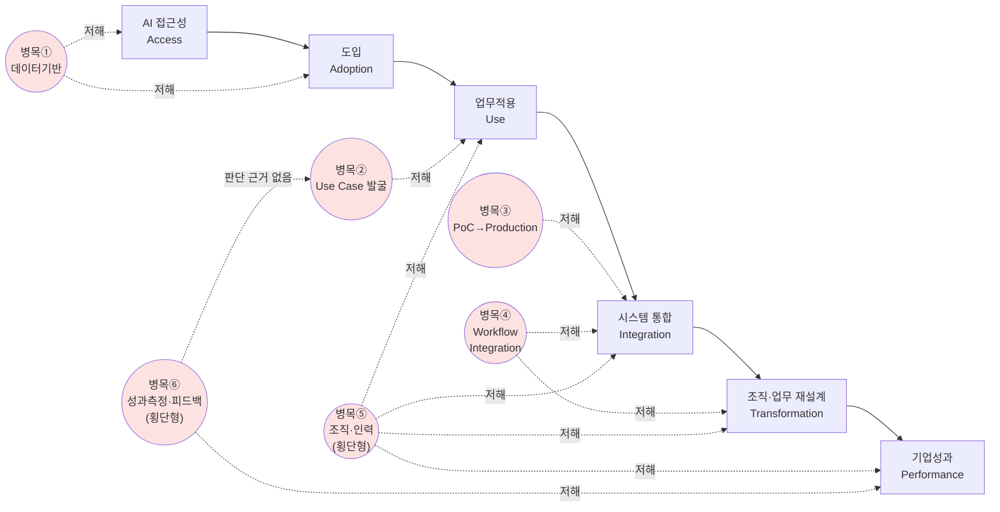

```toc  
minLevel: 2
maxLevel: 2
```

# 중소기업 AI 전환(AX) 성과 병목 분석


>[!note] 자료량이 방대해서 스크롤 압박이 있음
>자료 내용은 개인이 검토한 내용이라 오류가 있을 수 있음
>claude 와 chatGPT 로 검수

## 목차

| 파일                   | 장   | 제목                    | 핵심 내용                                                   |
| -------------------- | --- | --------------------- | ------------------------------------------------------- |
| 00_연구보고서_요약.md       | —   | 연구보고서 요약              | Ⅰ~Ⅻ장·부록 전체를 약 5페이지로 압축, 주요 수치·근거 포함                     |
| 01_연구개요.md           | Ⅰ   | 연구 개요                 | 연구배경, 연구목적·질문(Q1~Q5), 방법론, 통합가설(H1~H5)                  |
| 02_AX개념과이론적배경.md     | Ⅱ   | AX의 개념과 이론적 배경        | DX-AX 재정립, OECD AI 성숙도 분류(Novice~Champion), 생산성 J-커브 이론 |
| 03_국내외AI도입현황.md      | Ⅲ   | 국내외 중소기업 AI 도입 현황     | 글로벌·국내 도입률, 광의-협의 지표 괴리, 서비스업·소상공인 현황                   |
| 04_6대구조적병목.md        | Ⅳ   | 중소기업 AX·DX의 6대 구조적 병목 | 병목①~⑥ 유형화, 병목 연결 다이어그램                                  |
| 05_병목의근본원인분석.md      | Ⅴ   | 병목의 근본원인 분석           | 기술·경제·조직·정책 4대 원인, GPU 조달 사례                            |
| 06_사례분석.md           | Ⅵ   | 중소기업 AI 도입 사례 분석      | KAMP 성공사례, 국내 실패 패턴, 성공-실패 비교                           |
| 07_국내정책현황분석.md       | Ⅶ   | 국내 AX·DX 정책 현황 분석     | 정책 추진체계, AI바우처·AX원스톱바우처 등 심층비교, 병목-정책 매핑                |
| 08_해외정책비교.md         | Ⅷ   | 해외 중소기업 AI 지원정책 비교    | 독일·EU·미국·일본·싱가포르·중국 비교                                  |
| 09_정책패러다임전환.md       | Ⅸ   | 정책 패러다임 전환 방향         | 기술공급 중심 패러다임의 한계, 문제기반 성과연계 패러다임 제안                     |
| 10_단계별지원체계와성과평가체계.md | Ⅹ   | 단계별 지원체계 재설계 및 성과평가체계 | 성숙도 연계형 지원체계, Output-Outcome-Impact 지표                  |
| 11_정책실행로드맵과결론.md     | Ⅺ   | 정책 실행 로드맵 및 결론        | 단기·중기·장기 과제, 5대 핵심 정책제언, 결론                             |
| 12_연구의한계및향후과제.md     | Ⅻ   | 연구의 한계 및 향후 과제        | 방법론적 한계, 확보하지 못한 데이터, 향후 실증연구 설계안                       |
| 13_부록.md             | —   | 부록                    | 국내 지원사업 심층비교표, 정책사다리, 참고문헌 통합(78건)                      |


---

## 중소기업 AI 전환(AX) 성과 병목 분석 요약


핵심 질문: "중소기업의 AI 도입은 왜 생산성·매출·품질 등 실질적 기업성과로 충분히 전환되지 않는가, 현행 정책은 이 전환 과정의 어느 지점을 지원하는가?"

---

### 01. 연구 개요

- OECD 2026년 조사: 글로벌 SME의 61%가 AI를 사용하나 76%는 최저단계(Novice)에 머무름. 도입 기업 중 '변혁적 효과' 체감은 21%뿐.
- 기업규모별 AI 격차는 2023년 23%p→2025년 35%p로 확대.
- 한국 SME AI 도입률 31%(일본 27%, 독일 51%). 국내 50~249인 27.4% vs 250인+ 63.3%.
- 통합가설 5개(H1~H5)는 확정된 결론이 아니라 문헌·통계·사례로 뒷받침되는 **분석적 가설**로 제시: 도입-성과 격차(H1), 업무통합 중요성(H2), 보완투자 필요성(H3), 조직전환 필요성(H4), 정책설계 전환 필요성(H5).
- 표본조사(설문·회귀분석)는 직접 수행하지 않고 문헌·정책매핑·사례연구로 대체(설계안은 12장에 별도 제시).

### 02. AX의 개념과 이론적 배경

- "AI 도입(Adoption)"과 "AI 전환(AX)"을 구분: AI의 추론·예측·생성·자동화 역량을 업무 과정에 결합해 의사결정과 실행 방식을 재설계하는 것이 AX. DX가 AX의 절대적 선행조건은 아님(생성형 AI는 디지털 성숙도 낮은 기업에서도 바로 활용 가능).
- OECD/G7 'AI Adopters 분류체계' 채택: **복잡성×적용범위의 2×2 매트릭스**(Novice/Explorer/Optimiser/Champion) — 선형 사다리가 아니며, Optimiser(15.3%)가 Explorer(5%)보다 많음. Champion 3.6%.
- AI 생산성 역설: "도입 초기 생산성이 반드시 떨어진다"는 법칙이 아니라, 범용기술 확산에 구현·보완투자 시차가 있다는 의미(Brynjolfsson et al.). 2025년 미국 생산성 2.7%(과거10년평균 1.4%)를 이 시차로 해석(Stanford AI Index 2026).
- 유럽 12,000개 기업 연구: AI 도입기업 노동생산성 +4%, 교육훈련 병행 기업일수록 상승폭 추가(관찰연구, 탄력성으로 오독 주의).
- 6단계 전환 경로 설정: Access→Adoption→Use→Integration→Transformation→Performance. **OECD 분류(상태 진단)와 이 6단계(과정 분석)는 성격이 다른 두 축**임을 명시.

### 03. 국내외 중소기업 AI 도입 현황

- **핵심 발견**: "자기응답 기반(31%)"과 "업무·공정 통합 기반(제조 AI 실제 도입 0.1%)" 지표 간 큰 측정 수준 차이(모집단·정의가 달라 직접 비교는 아님). 스마트공장 도입 75.5%가 기초단계.
- 규모별 스마트공장 도입률: 중견기업 85.7%, 소기업 28.5%, 소상공인 8.7%.
- 대한상의(2025.11): 중소기업 AI 활용도 4.2%(대기업 49.2%). AI 투자비용 부담 중소 79.7% vs 대기업 57.1%.
- **대한상의 SGI(2025.06) 실증연구**: AI 도입기업이 매출 +4%, 부가가치 +7.6%(패널데이터, 통계적으로 유의). 단, 노동생산성·TFP는 비유의 — J-커브 효과 또는 데이터 한계로 해석.
- 소상공인(중기중앙회, 2026.06): 자기응답 기반 활용률 80.0%, 업종별 46~98% 편차. 정부 지원사업 참여경험 3.2%, 76.2%가 "몰랐다".
- 건설·숙박업은 절대수준은 낮으나(7~8%) 전년대비 확산속도는 오히려 빠름(59~63%↑).

### 04. 6대 구조적 병목

- 6개 병목은 상호 강화적(병목⑥→②로 되먹임): 순차 해소가 아니라 구조 전체 개입 필요.
- 직무별 생산성 연구: 정형화된 업무(상담+14~15%, 개발+26%, 마케팅+50%, 회계+55%)는 효과 뚜렷, 판단력 요구 업무는 오히려 -19%(METR 연구, Stanford AI Index).

① 데이터·데이터 기반 부족(기반형)
- 데이터가 정비되지 않아 AI가 학습·판단할 자산 자체가 없음

② AI Use Case 발굴 실패(과제정의형, 대기업도 AI 고도화율 9%)
- "AI로 무엇을 풀 것인가"를 정의하는 역량·프로세스 부재. AWS코리아 오순영 수석 아키텍트: "관심을 구체적 사업과제로 연결하는 데 어려움"

③ PoC→Production 단절(확산형/프로젝트 전환관리, 글로벌 PoC의 88%가 대규모 배포 미도달)
- 검증된 과제를 실제 운영으로 넘길 책임·예산·의사결정 체계 부족. "PoC는 스냅샷, 실증은 사계절"

④ Workflow Integration 실패(통합형/기술·업무 통합, OECD: 고립적용 2% vs 전사배포 23% 상관관계)
- AI 산출물이 기존 시스템·업무흐름과 분리된 채 고립적으로만 적용됨

⑤ 조직·인력 병목(횡단형, AI전문인력 부재 80.7%)
- Use~Performance 전 단계에 영향. 기술개발인력(AI엔지니어 등)과 운영·실행인력(PM·현업담당 등) 두 유형으로 구분 필요 — 막히는 병목이 다름

⑥ 성과측정·피드백 실패(피드백형)
- 성과 기준이 없어 투자 타당성 판단과 확산 근거 확보가 불가능. 병목②로 되먹임되지 않으면 판단 근거 자체가 사라짐

### 05. 병목의 근본원인 분석

- 4대 원인(기술·경제·조직·정책)은 6대 병목과 다대다 관계(1:1 대응 아님).
- 기술적: 데이터 인프라 미비, **레거시 시스템(ERP·MES 등) 연동 제약**(병목④의 기술적 근원) + 전세계적 GPU 수급난(임대료 43.6%↑, 전 세계 공통 현상). 단, 한국은 2023년부터 고성능컴퓨팅지원사업을 매년 지속 운영 중이며 별도로 AI파운데이션모델 기업 대상 GPU임차지원(1,576억 원)도 존재 — 문제는 "GPU 지원 부재"가 아니라 정기 공모 사각지대와 재정 형평성 논의.
- 경제적: 초기투자비 부담(중소 79.7%) + 구조적으로 변동하는 연산자원 운영비.
- 조직적: **기술개발인력 vs 운영·실행인력** 구분 필요 — 전자 부족은 병목①, 후자 부족은 병목②④⑤에서 막힘. 경영진 전략 부재는 대기업도 예외 아님(고도화율 9%). 매출규모별 AI 배포단계 격차(McKinsey/Stanford) — 국제적으로 공통된 패턴.
- 정책적: 일부 신청요건이 진입장벽으로 작용할 가능성(예: 컨소시엄 구성 요건, GPU 이용료 사전산정).

### 06. 사례분석

- 성공사례(KAMP): 3개 유형으로 구분 — 기업내부활용(인터로조: 실시간 공정모니터링·파라미터 자동조정), AI사업화(임픽스: SI→AI솔루션기업), 수요-공급협업(위즈코어-정인산업: 압출공정AI). 대조군 없는 관찰 사례임을 전제.
- AX 실행 병목·중단 패턴(통계적 대표성 없는 패턴분석): KOSA 사례집(아주경제 보도 인용, 원문 미확보) — 제조 AI 실제활용 17.9%, 도입애로 41.6%(적용영역 파악 어려움). AX 실패 4유형: R&R불명확·모니터링부재·데이터편차·거버넌스부재.
- HWP 등 비정형 문서의 "입력 데이터 파이프라인" 구축비용 사례(일반화된 데이터준비 비용 문제로 해석). 대기업-중소기업 투자격차(대기업 10~20억 vs 중소 3천만원, 인터뷰 사례이며 통계평균 아님).
- 시사점: 공동 데이터·인프라 제공이 병목 완화 가능성을 보여줌 — "더 효과적"이라는 단정이 아니라 Ⅶ·Ⅷ장에서 검증할 가설로 제시.

### 07. 국내 정책현황 분석

- NIPA 2026 예산 3조 1,223억 원(92개 사업) — **국가 AI생태계 전체 예산**이며 중기업向 예산과는 구분. AI 통합 바우처 4종만 총 625.46억 원(AI바우처 252억·AX원스톱 294억·데이터바우처 72억·클라우드바우처 41억).
- AX원스톱바우처 260억(교부금)/294억(총사업비=교부금+운영비 34억) — 불일치 아니라 집계범위 차이로 완전 해소. 컨소시엄 요건(배점40%)은 전문역량 보완과 접근성 제약의 양면적 요소.
- **「산업맞춤형 혁신바우처」(2026.02 신규, 21.28억원)**: AX역량진단+교육·컨설팅+검증(PoC) 일괄 지원 — 진단기능은 존재하나 전체 사업의 공통 진입경로로 연결되지는 않음.
- **GPU지원**: 고성능컴퓨팅지원사업 2023년부터 매년 지속(115억→122억→198억→174억), 별도 GPU임차지원사업(파운데이션모델기업 대상, 2025년 1,576억). 기존 사업의 정기공모 사각지대 보완이 핵심 과제.
- 인력지원(제조AI 1,600명 목표 등)은 주로 기술개발인력에 초점, 운영·실행인력 지원은 불분명.
- 성과관리 제도(5년 추적조사, 데이터바우처는 6년 누적성과 12,347개사·매출4,436억 집계공개 사례 있음)는 존재 — 신설사업(AX원스톱)은 집계·공개 여부가 아직 불투명.
- 핵심 진단: "정책 부재"가 아니라 **"정책 간 연결성 부족"**(진단→구축→운영→성과검증이 개별사업 단위로 분절).

### 08. 해외 정책비교

- 독일: **Mittelstand-Digital**(연방, 무료상담망+2027년 중앙 안내플랫폼 재편)이 핵심사례. Digitaler Mittelstand KI는 **브레멘주 지역사업**(연방 아님, 지원한도 1.7만유로)이었음이 확인됨. Catena-X(민간 데이터표준 동맹, 세계 상위 100대 부품사 절반 이상 가동).
- EU: Digital Europe·EDIH(원스톱 진단·매칭 거점) + AI Act — 고위험(Annex III) 규제는 **2027.12.2로 연기**(2026.8.2는 일부 규정만). 지원과 사후관리 결합 원리는 참고할 만함.
- 미국: NIST/MEP(제조업 현장지원 네트워크)·CAISI 중심 인프라·표준. SME 전용 AI교육법은 재발의 상태(미제정).
- 일본: 'デジタル化・AI導入補助金2026' — 단일 브랜드, 유형만 세분화.
- 싱가포르: **IMDA CTO-as-a-Service**(자가진단+1:1 중립 컨설팅) + AI도입률 4.3%→23.5% 전수 집계 지표 공개.
- **캐나다**(신규): G7 AI for Growth(3년 1.74억 캐나다달러) + AI Compute Access Fund(3억 캐나다달러) — 단, 한국도 유사한 서비스형 GPU지원을 2023년부터 운영 중이므로 "한국에 없는 대안"이 아니라 규모 비교의 참고점.
- 중국: 시범기업 확산모델의 "1,000곳" 목표는 AI전용이 아니라 신흥산업 전반 목표임(AI+소프트웨어 특별행동과는 별개 계획). 확산효과 정량근거는 미확보.

### 09. 정책 패러다임 전환 방향

- 기존 접근은 "완전한 실패"가 아니라 **공급·사업 중심에서 진단·컨설팅 기능이 일부 도입되며 서서히 이동 중**(산업맞춤형 혁신바우처 등 반영).
- 제안: **'문제기반 성과연계 패러다임'** — Problem(문제정의)→**Solution**(AI·데이터 등 수단 선택, Solution-neutral)→**Transformation**(업무재설계)→Performance(성과검증)→(**Policy Learning**으로 다시 Problem에 환류). 기존 "Problem→AI→Process→Performance"에서 명칭 변경(AI는 목적이 아니라 수단).
- 참고축(해외사례, "정답"이 아닌 비교사례): 진단·중개기능(독일 Mittelstand-Digital·싱가포르 IMDA), 통합지원 진입장벽 완화(trusted intermediary 개념), 공동기반 구축(Catena-X·KAMP), 컴퓨팅 접근 사각지대 보완(캐나다, 단 한국도 유사 운영 중), 지원-사후관리 결합(EU), 접근경로 단순화(일본).

### 10. 단계별 지원체계·성과평가체계

- **기업 성숙도(축A: Novice~Champion)** 와 **개별과제 진행경로(축B: Problem-Solution-Transformation-Performance)** 는 서로 다른 두 축 — "Novice는 반드시 Problem에서 막힌다"는 1:1 대응표를 폐기하고, 성숙도별 "우선 확인할 질문" 표로 교체. OECD 조사대상 AI사용 SME 중 76%가 Novice(국내 대표성 있는 통계는 아님).
- 제안: Novice단계 사전진단 확대(관련기관 연계), Optimiser단계 컨소시엄 매칭지원(공공매칭+공급기업Pool+전문중개기관), Champion단계 KAMP 서비스업 확장.
- 성과평가체계를 **Output-Outcome-Impact-Policy Effect** 4단 지표체계로 확장(Policy Effect=비지원기업 비교 등 준실험 방법으로 측정하는 정책 순효과). 현재 성과공개는 "선별적 우수사례" 방식 — 정책 홍보·학습에는 유용하나 평균적 성과·실패요인 파악에는 한계, 전수집계 병행 제안(신규 의무 아닌 기존 5년 추적자료 활용).

### 11. 정책 실행 로드맵 및 결론

- 단기(1년): 사전진단·컨소시엄매칭 시범, 5년 추적자료 첫 집계, 기존 Compute 지원사업의 사각지대 보완 검토.
- 중기(1~3년): 지표체계 정착, KAMP 서비스업 확장, 소상공인 26개 사업 **통합진입창구** 마련(단일 브랜드보다 탐색비용 절감이 핵심).
- 장기(3~5년+): 지원-사후관리 결합의 원리 참고(EU AI Act는 지원사업 성과관리와는 다른 제도임에 유의), 성과환류 공식절차화, **정책효과 평가체계 제도화**(PSM·DiD 등 준실험).
- 5대 제언은 대규모 신규사업·조직 신설 없이도 가능하나, 단순 예산 확대만으로는 부족하며 경로 설계 보완이 함께 필요.
- 결론: 자기응답(31%)-업무통합(0.1%) 지표의 차이로 요약되는 도입-성과 전환실패는 6대 병목과 4대 원인에서 비롯되며, 일부 정책 신청요건이 진입장벽으로 작용할 가능성이 확인됨. 해법은 기존 요소(AX원스톱·KAMP·5년추적)의 연결.

### 12. 연구의 한계 및 향후 과제

- **연구의 기여**: 6대 병목 구조화, 4대원인 다대다 구조 제시, 정책전환경로(P-S-T-P) 제시.
- 실증조사(설문·SEM) 미수행 — H1~H5는 분석적 가설. 표본 400~600개사, 병목당 3~4문항(총 38~44문항) 설계안 제시. SEM은 측정모형 검증 후 적용 검토, 준실험설계(PSM·DiD)를 Policy Effect 측정 방법으로 추가.
- 확보 못한 데이터: 국내 중소기업 특정 PoC 전환율(가장 뚜렷한 공백), 중국 확산효과 정량근거, KOSA 사례집 원문.
- 향후 과제: PoC전환율 조사, KOSA 원문 확보, 5년 추적자료 연구자 접근성 확대, 설문+행정데이터 연계(법적 절차 전제), 정책효과 준실험 시범적용, 서비스업 특화 병목연구.

---

## Ⅰ. 연구 개요

### 1. 연구 배경 및 필요성

- 2026년 OECD D4SME 조사에서 중소기업의 61%가 AI 애플리케이션을 최소 1개 이상 사용 중인 것으로 나타난다.
    - 그러나 이 중 76%는 단순 범용 도구를 개별 업무에만 쓰는 'AI Novice' 단계에 머무른다. 나머지는 활용 복잡성과 적용범위라는 서로 다른 축을 따라 갈리는데, 
    - 비교적 단순한 도구를 여러 부서로 넓힌 'AI Optimiser'가 15.3%로 많고, 맞춤형 AI를 개발하되 적용 범위는 좁은 'AI Explorer'가 5%, 복잡한 AI를 전사적으로 내재화한 'AI Champion'은 3.6%에 불과하다(Ⅱ장에서 이 네 유형의 관계를 상세히 다룬다).
> 출처 : [Empowering SMEs in the age of AI: The 2026 OECD D4SME Survey(OECD, 2026)](https://www.oecd.org/content/dam/oecd/en/publications/reports/2026/04/empowering-smes-in-the-age-of-ai_7f58652c/bf5a9816-en.pdf)

- AI 도입 기업 중 절반 이상(54%)이 최소한의 성과 개선을 보고하지만, '유의미하거나 변혁적인 효과'(significant or transformational impact)를 체감한 기업은 21%에 그친다.
    - 이는 "AI를 쓴다"는 것과 "AI로 성과를 낸다"는 것 사이에 뚜렷한 간극이 존재함을 보여주는 핵심 수치다.
> 출처 : [Empowering SMEs in the age of AI: The 2026 OECD D4SME Survey(OECD, 2026)](https://www.oecd.org/content/dam/oecd/en/publications/reports/2026/04/empowering-smes-in-the-age-of-ai_7f58652c/bf5a9816-en.pdf)

- 대기업과 중소기업 간 AI 활용 격차는 오히려 확대되는 추세다. 기업규모별 AI 활용 격차는 2023년 23%p에서 2025년 35%p로 벌어졌다.
> 출처 : [Empowering SMEs in the age of AI: The 2026 OECD D4SME Survey(OECD, 2026)](https://www.oecd.org/content/dam/oecd/en/publications/reports/2026/04/empowering-smes-in-the-age-of-ai_7f58652c/bf5a9816-en.pdf)

#### 1) 한국 중소기업의 상황

- 한국의 상황도 유사하다. OECD 조사에서 한국 중소기업의 AI 도입률은 31%로, 일본(27%)보다는 높지만 독일(51%)·아일랜드(45%)·오스트리아(42%)에 비해 낮은 수준이다.
    - 특히 국내 기업 규모별 격차가 뚜렷하다. 50~249인 기업의 AI 도입률은 27.4%인 반면, 250인 이상 기업은 63.3%로 2배 이상 차이가 난다.
> 출처 : [Artificial Intelligence and the Labour Market in Korea(OECD, 2025.10)](https://www.oecd.org/content/dam/oecd/en/publications/reports/2025/10/artificial-intelligence-and-the-labour-market-in-korea_af668423/68ab1a5a-en.pdf)

#### 2) 국내 정책 대응 현황

- 2026년 3월 12일 중기부·과기정통부·산업부 3개 부처는 AI 에이전트·AX 스프린트·산업AI 솔루션 실증·AI 바우처 등 총 11개 사업, 4,230억 원 규모의 2026년도 AX 사업을 통합 공고했다.
> 출처 : [중기부-과기정통부-산업부, AX 사업 통합 공고를 통해 기업의 사업 편의 제고(중소벤처기업부, 대한민국 정책브리핑, 2026.03.12)](https://www.korea.kr/briefing/pressReleaseView.do?newsId=156748625)

- 중소벤처기업부는 별도로 '중소기업 AI 전환 우수사례 공모전'을 2025년에 이어 2026년에도 2회째 시행 중이며, AI 도입을 통해 경영 성과를 낸 기업 사례를 발굴·확산하는 데 목적을 둔다.
> 출처 : [중소벤처기업부, 성과를 창출한 중소기업과 지역 AI 전환 유공자를 찾습니다(중소벤처기업부 보도자료 원문 재게재, 뉴스서울, 2026.09.01)](https://newsseoul.co.kr/news/view/1065622216297609)

- 이러한 배경에서, AI 접근성 확대와 정부 지원 확대라는 '공급 측면'의 변화 속도에 비해, 실제 기업 현장에서 도입이 성과로 전환되는 '수요 측면'의 병목이 무엇인지는 상대적으로 충분히 규명되지 않았다. 본 연구는 이 간극을 구조적으로 분석하는 데 목적을 둔다.

---

### 2. 연구 목적 및 핵심 연구질문

본 연구의 핵심 질문은 다음과 같다.

> "중소기업의 AI 도입은 왜 생산성·매출·품질 등 실질적 기업성과로 충분히 전환되지 않는가, 그리고 현행 정책은 이 전환 과정의 어느 지점을 지원하고 있는가?"

이를 세부적으로 아래 5개 질문으로 분해한다.

| 구분 | 세부 연구질문 | 주 대응 장 |
|---|---|---|
| Q1 | 국내외 중소기업의 AI 도입·활용 수준과 격차는 얼마나 벌어져 있는가 | Ⅲ |
| Q2 | AI 도입이 기업성과로 이어지는 과정에서 어느 단계에 병목이 발생하는가(6대 구조) | Ⅳ |
| Q3 | 이러한 병목은 기술·경제·조직·정책 중 어떤 근본원인에서 비롯되는가 | Ⅴ |
| Q4 | 국내외 실제 기업 사례는 이 병목구조를 어떻게 뒷받침하는가 | Ⅵ |
| Q5 | 현행 국내·해외 정책은 병목을 얼마나 해소하고 있으며, 어떤 정책설계로 전환해야 하는가 | Ⅶ, Ⅷ, Ⅸ, Ⅹ |

---

### 3. 연구방법론

| 방법론 | 적용 범위 |
|---|---|
| 문헌·정책자료 조사 | 전 장에 걸쳐 적용. OECD·중기부·과기정통부·산업부·NIPA 공식자료를 1차 출처로 우선 활용 |
| 병목구조 분석 | Ⅳ장. 문헌·해외사례 기반 6대 병목 유형화 |
| 국내외 정책 매핑 | Ⅶ·Ⅷ장. 병목별 정책 커버리지 대조 |
| 사례연구 | Ⅵ장. 중기부 AX 우수사례 공모전 등 공개자료 기반 심층조사 |

- 본 연구는 실제 표본조사(설문·회귀분석)를 직접 수행하지 않는다. 이는 조사 인프라·일정·예산이 본 연구 범위를 벗어나기 때문이며, 대신 Ⅻ장에서 향후 실증연구를 위한 설계안(표본설계·측정지표·분석모형)을 별도로 제시한다.

---

### 4. 통합 가설 체계

- 아래 5개 가설은 국내외 문헌·통계·사례로 뒷받침되는 지점이 있으나, 본 연구가 직접 수행한 표본조사로 통계적으로 검증한 것은 아니다. 따라서 이는 확정된 결론이 아니라 **후속 실증연구가 필요한 분석적 가설(analytical hypothesis)** 로 제시한다.

| 가설  | 내용                                                                                            | 대응 장 | 본 연구 내 근거 수준           |
| --- | --------------------------------------------------------------------------------------------- | ---- | ---------------------- |
| H1  | AI Adoption–Performance Gap: 중소기업의 AI 도입률 증가는 기업성과 증가와 동일한 비율로 연결되지 않는다                       | Ⅲ, Ⅳ | 국내외 통계로 뒷받침(직접 검증 아님)  |
| H2  | Integration Hypothesis: AI의 기업성과는 단순 사용 여부보다 기존 업무프로세스·정보시스템과의 통합 수준에 더 크게 좌우된다               | Ⅳ, Ⅵ | OECD 실증자료로 뒷받침(상관관계)   |
| H3  | Complementary Investment Hypothesis: AI 투자만으로는 불충분하며 데이터·인프라·인력·업무재설계 등 보완적 투자가 성과전환의 핵심 조건이다 | Ⅳ, Ⅴ | 이론·일부 실증으로 뒷받침         |
| H4  | Organisational Transformation Hypothesis: AI를 도입해도 업무·조직 운영방식이 변화하지 않으면 성과효과가 제한된다            | Ⅴ, Ⅵ | 사례·국제비교로 뒷받침(직접 검증 아님) |
| H5  | Policy Design Hypothesis: 보급 중심 정책보다 업무통합·고도화·성과검증까지 연결하는 단계적 지원정책이 실질적 성과전환에 더 적합하다          | Ⅶ~Ⅹ  | 정책설계 가설(해외비교로 뒷받침)     |

Ⅻ장에서 이 가설들의 근거 수준을 다시 종합하고, 향후 실증연구를 통해 통계적으로 검증하기 위한 설계안을 제시한다.

---

### 출처 및 참고자료 목록

#### Ⅰ-1. 연구 배경 및 필요성
> 출처 : [Empowering SMEs in the age of AI: The 2026 OECD D4SME Survey(OECD, 2026)](https://www.oecd.org/content/dam/oecd/en/publications/reports/2026/04/empowering-smes-in-the-age-of-ai_7f58652c/bf5a9816-en.pdf)
> 출처 : [Artificial Intelligence and the Labour Market in Korea(OECD, 2025.10)](https://www.oecd.org/content/dam/oecd/en/publications/reports/2025/10/artificial-intelligence-and-the-labour-market-in-korea_af668423/68ab1a5a-en.pdf)
> 출처 : [중기부-과기정통부-산업부, AX 사업 통합 공고를 통해 기업의 사업 편의 제고(중소벤처기업부, 대한민국 정책브리핑, 2026.03.12)](https://www.korea.kr/briefing/pressReleaseView.do?newsId=156748625)
> 출처 : [중소벤처기업부, 성과를 창출한 중소기업과 지역 AI 전환 유공자를 찾습니다(중소벤처기업부 보도자료 원문 재게재, 뉴스서울, 2026.09.01)](https://newsseoul.co.kr/news/view/1065622216297609)


## Ⅱ. AX의 개념과 이론적 배경

### 1. DX와 AX의 개념적 재정립

#### 1) AX의 정의

- AX(AI Transformation, 인공지능 전환)는 기존 디지털 전환(DX)을 넘어, AI 기술을 중심에 두고 산업·조직의 구조, 업무 방식, 의사결정 과정을 전면 재구성하는 흐름을 뜻한다. 2025년 12월 과기정통부·국방부·산업부·중기부 4개 부처가 국방 AX 협력을 발표하며 이 용어를 공식적으로 사용했다. 
- 다만 AX는 국제적으로 단일하게 표준화된 개념은 아니므로, 본 연구는 이 흐름을 참고하되 아래와 같은 조작적 정의를 채택한다.
> 출처 : [과기정통부·국방부·산업부·중기부, 최초 맞손…국방 AX 본격 협력(ZDNet Korea, 2025.12.03)](https://zdnet.co.kr/view/?no=20251203173515)

> **본 연구는 AX를 다음과 같이 정의한다:** AX(AI Transformation)는 AI 기술의 단순 도입이나 개별 업무 자동화를 넘어, AI를 활용하여 기업의 업무 프로세스, 의사결정, 조직 역할 및 자원배분 방식을 재설계하고, 그 결과를 지속적인 경영성과로 연결하는 조직·업무 전환을 의미한다.

- DX와 AX는 단절 관계가 아니라 연속 관계로 이해할 수 있다. DX가 축적한 디지털 데이터·클라우드·프로세스 기반은 AX 단계의 LLM·RAG 등 AI 기술이 참조할 원료가 되는 경우가 많다. 
- 다만 이는 고도화된 AX, 특히 기업 내부 데이터·업무시스템을 연결하는 AI 전환에 해당하는 이야기이며, 생성형 AI 기반의 문서작성·번역·마케팅 콘텐츠·고객응대·코드생성 등은 디지털 성숙도가 낮은 기업에서도 곧바로 활용 가능하다는 점에서 DX가 AX의 절대적 선행조건은 아니다. 
- 요약하면 DX는 "업무 수단을 디지털로 바꾸는 전환"이고, AX는 "AI의 추론·예측·생성·자동화 역량을 업무 과정에 결합해 의사결정과 실행 방식을 재설계하는 전환"으로 구분된다.
> 출처 : [AX vs DX — 디지털 전환과 AI 전환, 무엇이 다른가(MSAP.ai, 2026 게재)](https://www.msap.ai/ax/ax-vs-dx/)

#### 2) "AI 도입"과 "AI 전환(AX)"의 구분

- 일부 AX 관련 논의에서는 "AI가 업무의 주체가 되고, 인간은 검증·승인 역할로 축소된다"는 식의 표현이 쓰이기도 하나, 
- 본 연구는 이러한 과도한 표현을 채택하지 않는다. 업계 정의를 검토한 결과에서도 AX의 핵심은 AI가 인간을 대체하는 것이 아니라, **AI가 판단을 보조하거나 1차 실행을 담당하고 인간이 예외처리·전략판단을 맡는 방식으로 업무 흐름 자체가 재설계되는 것** 에 있다. 즉:

    - **AI 도입(Adoption):** 특정 부서가 챗봇·문서요약 등 개별 도구를 도입해 쓰기 시작하는 단계. 도구의 수가 늘어나는 것.
    - **AI 전환(AX):** 업무의 판단 흐름 자체가 AI를 중심으로 재설계되는 것. 예컨대 고객 응대의 1차 분류·응답을 AI가 담당하고 사람이 예외 건만 처리하도록 업무 절차 자체를 재구성하는 경우.

> 출처 : [AX(AI 전환)란 무엇인가 — 정의부터 DX와의 차이, 추진 4단계까지(MSAP.ai, 2026 게재)](https://msap.ai/blog-home/blog/what-is-ax)

- 이 구분은 본 연구 전체를 관통하는 핵심 전제다. Ⅲ장 이하에서 다루는 "AI 도입률"은 이 정의상 **도입(Adoption) 단계의 지표**이며, 본 연구가 규명하고자 하는 "성과 병목"은 도입 이후 전환(AX)으로 이어지지 못하는 지점에서 발생한다.

---

### 2. AI 활용 성숙도 모델

#### 1) 모델 선정 근거

- AI 활용 성숙도 분류에는 여러 접근이 있을 수 있으나, 본 연구는 외부에서 공식적으로 검증된 모델을 우선한다. OECD가 G7 산업·디지털·기술 트랙을 위해 개발하고 2025년 12월 G7 장관성명(SME AI Adoption Blueprint)에서 정책설계 도구로 공식 채택한 **"AI Adopters 분류체계"(Taxonomy of AI Adopters)** 를 채택한다. 
- 이는 디지털 성숙도·AI 활용 복잡성·적용 범위라는 3개 기준으로 SME를 4개 유형으로 분류하는 모델이다.
> 출처 : [AI adoption by small and medium-sized enterprises: OECD discussion paper for the G7(OECD, 2025.12)](https://www.oecd.org/content/dam/oecd/en/publications/reports/2025/12/ai-adoption-by-small-and-medium-sized-enterprises_9c48eae6/426399c1-en.pdf)
> 출처 : [G7 Industry, Digital and Technology Ministerial Statement on the SME AI Adoption Blueprint(G7, 2025.12.09)](https://www.g7.utoronto.ca/ict/2025-sme-ai-adoption-blueprint.html)

#### 2) OECD/G7 AI Adopters 분류체계: 2×2 매트릭스 구조

- 이 분류체계는 "Novice→Explorer→Optimiser→Champion"이 한 방향으로 올라가는 성숙도 사다리가 아니다. 실제로는 **AI 활용 복잡성(가로축: 범용 도구 없음→에이전트형 AI)** 과 **적용 범위(세로축: 고립된 업무→전사적)** 라는 두 개의 독립된 축이 만드는 2×2 매트릭스이며, 네 유형은 이 매트릭스의 네 분면에 해당한다.

| 유형 | 매트릭스 위치 | 정의 |
|---|---|---|
| AI Novices | 낮은 복잡성 × 고립된 범위(좌하단) | 챗GPT·Copilot 등 범용·기성 도구를 개별·주변적 업무에 활용 |
| AI Explorers | 높은 복잡성 × 고립된 범위(우하단) | 데이터 집약적 맥락에서 맞춤형·업종특화 AI를 개발하나 적용 규모는 제한적 |
| AI Optimisers | 낮은 복잡성 × 전사적 범위(좌상단) | Novice 단계를 넘어, 비교적 단순한 기성 도구를 여러 업무 기능(부서)에 걸쳐 폭넓게 활용 |
| AI Champions | 높은 복잡성 × 전사적 범위(우상단) | 통합 인프라·데이터·내부역량을 기반으로 운영·전략 의사결정 전반에 AI를 내재화 |
> 출처 : [The SME AI adoption blueprint(캐나다 정부, 원자료: OECD discussion paper for the G7)](https://ised-isde.canada.ca/site/ised/en/sme-ai-adoption-blueprint)

- 즉 Explorer(고복잡성·좁은 범위)와 Optimiser(저복잡성·넓은 범위)는 서로 다른 두 축을 따라 발전한 서로 다른 유형이지, 한쪽이 다른 쪽보다 더 "성숙"한 것이 아니다. 이 구분은 이후 장에서 성숙도를 인용할 때 지속적으로 유의해야 하는 지점이다.

#### 3) 글로벌 SME의 분포 현황

- 2026년 OECD D4SME 조사에서 AI 사용 SME 중 **76%가 Novice, 15.3%가 Optimiser, 5%가 Explorer, 3.6%가 Champion**으로 분류된다. Optimiser(15.3%)가 Explorer(5%)보다 3배 가까이 많다는 점은, 중소기업이 복잡한 맞춤형 AI를 개발하기보다 단순한 기성 도구를 여러 부서로 넓혀가는 경로를 더 쉽게 택한다는 것을 시사한다.
> 출처 : [Empowering SMEs in the age of AI: The 2026 OECD D4SME Survey(OECD, 2026.04.13)](https://www.oecd.org/content/dam/oecd/en/publications/reports/2026/04/empowering-smes-in-the-age-of-ai_7f58652c/bf5a9816-en.pdf)

> 출처 : [AI adoption by small and medium-sized enterprises: OECD discussion paper for the G7(OECD, 2025.12)](https://www.oecd.org/content/dam/oecd/en/publications/reports/2025/12/ai-adoption-by-small-and-medium-sized-enterprises_9c48eae6/426399c1-en.pdf)

- 2026년 OECD D4SME 조사에서 조사대상 SME의 61%가 AI를 사용 중이며(생성형 AI 21%), Ⅰ장에서 제시한 '21%만 변혁적 효과 체감'이라는 수치와도 정합적으로 연결된다.

---

### 3. AI 도입-성과 전환구조: Adoption-Performance Gap 모형

#### 1) 이론적 근거: 범용기술의 생산성 시차와 보완적 투자

- AI 도입이 곧바로 기업성과로 이어지지 않는 현상은 본 연구만의 관찰이 아니라, **'AI 생산성 역설(AI Productivity Paradox)'** 이라는 이름으로 국제 학계에서 폭넓게 연구되어 온 주제다. 
- 이는 "AI를 도입하면 생산성이 반드시 일시적으로 떨어진다"는 법칙이 아니라, **AI와 같은 범용기술의 기술적 발전이 실제 생산성 통계로 나타나기까지 구현·확산·보완투자의 시차(implementation and diffusion lag)가 발생할 수 있다**는 의미다.

    - Brynjolfsson, Rock & Syverson(2021)은 AI와 같은 범용기술(General Purpose Technology)의 생산성 효과가 기술 자체의 발전 속도보다 늦게 나타나는 경향이 있으며, 이 시차를 조직 재설계·업무 프로세스 재구축·인력 재교육 등 '보완적 혁신(complementary innovations)'의 축적 과정으로 설명했다. 
    - 전기화(electrification)와 같은 과거의 범용기술에서도, 기술 도입 자체보다 조직·공정·사업모델의 재설계에 훨씬 오랜 시간이 걸렸다는 역사적 사례가 보고되어 있다.
> 출처 : [Artificial Intelligence and the Modern Productivity Paradox(Brynjolfsson, Rock & Syverson, NBER Working Paper No.24001)](https://www.nber.org/system/files/working_papers/w24001/w24001.pdf)

- 제조업 현장을 대상으로 한 최근 연구에서도 유사한 패턴이 보고된다. MIT Sloan이 소개한 연구는, AI를 업무기능에 도입한 기업들에서 규모·업력·자본·IT 인프라 등을 통제한 이후에도 생산성 증가가 오히려 낮게 관측되었다고 밝혔다. 다만 이는 관찰연구(observational study) 결과이며, "AI 도입이 생산성을 인과적으로 낮췄다"는 의미로 해석해서는 안 된다. 
- 신규 디지털 도구와 기존 운영 프로세스 간의 정합성 부족이 이러한 관측치와 연관되어 있을 가능성이 지적되며, 데이터 인프라·인력교육·업무흐름 재설계라는 보완투자가 이 격차를 좁히는 데 중요한 역할을 하는 것으로 논의된다.
> 출처 : [The 'productivity paradox' of AI adoption in manufacturing firms(MIT Sloan, 게재일 미상)](https://mitsloan.mit.edu/ideas-made-to-matter/productivity-paradox-ai-adoption-manufacturing-firms)

#### 2) 2026년 최신 실증: 스탠포드 AI Index가 재확인한 생산성 시차와 보완투자 효과

스탠포드대 인간중심AI연구소(HAI)가 2026년 발간한 'AI Index Report 2026'(9회차)은 이 이론적 배경을 최신 데이터로 재확인한다. 다만 아래 수치들도 대부분 관찰연구·설문조사 결과이며, 단순한 인과관계로 해석하지 않도록 유의한다.

- 유럽 12,000개 기업(2019~2024년)을 분석한 연구(Aldasoro et al., 2026)는 AI 도입 기업에서 노동생산성이 4% 높게 나타났으며, 교육훈련 지출이 많은 기업일수록 생산성 상승폭이 더 컸다고(훈련지출 1%당 5.9%p 추가) 보고했다. 이는 관찰연구 결과로, "교육비 지출을 1% 늘리면 생산성이 5.9% 오른다"는 탄력성으로 해석해서는 안 되며, Ⅱ.3.1)에서 다룬 '보완적 투자'(H3) 가설과 방향이 일치하는 국제 근거로 활용한다.
- 2025년 미국 생산성 증가율은 2.7%로, 이전 10년 평균(1.4%)의 거의 2배였다. Brynjolfsson(2026)은 이를 보완적 혁신이 축적되며 생산성 효과가 뒤늦게 통계에 반영되는 국면으로 해석했다. OECD도 향후 10년간 G7 경제권에서 연 0.2~1.3%p의 생산성 향상을 전망한다(Filippucci et al., 2025).
- 그러나 동시에, 4개국 경영진 6,000명을 대상으로 한 별도 설문(Yotzov et al., 2026)은 광범위한 AI 활용 확산에도 불구하고 현재까지 체감되는 생산성 효과는 제한적이라고 보고했으며, 향후 3년간 생산성 +1.4%, 산출 +0.8%, 고용 -0.7%를 전망했다(모두 응답 시점의 경영진 전망치이며 실현된 성과가 아니다). 이는 AI 활용의 확산 속도에 비해 성과가 실현되는 정도와 시점에 상당한 이질성이 존재하며, 조직적 보완투자와 업무 통합 여부가 그 차이를 설명하는 주요 요인으로 제시되고 있음을 보여준다 — 본 연구의 문제의식(H1, Adoption-Performance Gap)과 궤를 같이하는 최신 국제 증거다.
> 출처 : [AI Index Report 2026, Chapter 4: Economy(Stanford HAI, 2026)](https://hai.stanford.edu/assets/files/ai_index_report_2026_chapter_4_economy.pdf)

- 이 국제 학계의 논의는 본 연구의 핵심 문제의식과 방향이 일치한다. 즉 "AI 도입률이 늘어도 성과가 뒤따르지 않는다"는 현상은 일시적 이상 현상이 아니라, **범용기술이 확산되는 과정에서 구조적으로 나타날 수 있는 이행기 현상(transition-period phenomenon)** 이며, 이 이행기를 단축시키는 것이 정책 개입의 역할이 될 수 있다.

#### 3) 분석틀 설정: 6단계 전환 경로

- 위 이론적 배경 위에서, 본 연구는 아래 6단계 전환 경로를 분석틀로 채택한다. 이는 특정 기관의 공식 모델이 아니라 **본 연구가 Ⅳ장 이하의 병목 분석을 위해 설정하는 자체 분석 프레임**임을 명시한다.

```
AI 접근성(Access) → 도입(Adoption) → 업무적용(Use) → 시스템 통합(Integration)
→ 조직·업무 재설계(Transformation) → 기업성과(Performance)
```

- **이 6단계와 앞서 다룬 OECD Novice~Champion 분류는 성격이 다른 두 축이라는 점을 분명히 해 둔다.** OECD 분류는 기업이 현재 어느 정도 복잡성·범위로 AI를 활용하고 있는지를 특정 시점에서 진단하는 **상태 분류(state taxonomy)** 이며, 기업이 반드시 이 네 유형을 순차적으로 거친다고 규정하지 않는다. 
- 반면 본 연구의 6단계는 하나의 AI 과제가 도입에서 성과 실현까지 거치는 **과정(process framework)** 을 나타낸다. 두 체계는 대체 관계가 아니라 상호보완적이다 — OECD 분류로 기업의 현재 활용 양상을 가늠하고, 6단계 경로로 그 기업이 다음 단계로 나아가는 과정에서 어떤 병목을 만나는지 분석한다. 이 관계는 Ⅹ장에서 정책 설계에 다시 사용한다.

| 전환 단계 | 정의 | 실패 시 나타나는 현상 |
|---|---|---|
| Access | AI 기술·서비스·컴퓨팅 자원에 접근할 수 있는 여건(인터넷·클라우드·연산자원) | 애초에 도구를 써볼 기회조차 없음 |
| Adoption | 개별 부서·업무 단위에서 AI 도구를 도입해 사용 시작 | 표면적 '도입률' 통계는 상승 |
| Use | 특정 업무에서 AI를 실제로, 반복적으로 활용 | 시범적으로만 쓰고 중단(1회성 PoC) |
| Integration | AI 산출물이 ERP·MES 등 기존 정보시스템·업무흐름에 연결 | AI 결과가 별도 산출물로 고립, 재입력 필요 |
| Transformation | 업무 절차·조직·역할이 AI 중심으로 재설계 | 기존 업무에 AI가 '추가'될 뿐 구조는 그대로 |
| Performance | 생산성·매출·품질 등 실질 경영성과로 귀결 | 성과 측정 자체가 이뤄지지 않음(Ⅳ장 병목⑥) |

- 핵심 논리는, 각 단계 사이에서 발생하는 이탈·저해 요인이 누적되어 최종적으로 도입률 대비 성과전환율을 낮춘다는 것이다(H1). 특히 Integration과 Transformation 두 단계가 앞서 다룬 보완적 투자가 집중적으로 요구되는 구간이며, 국내외 다수 연구가 이 두 단계에서 병목이 나타난다고 지적한다(H2, H4). Ⅳ장은 이 프레임 위에서 "어느 화살표 구간에서, 왜 병목이 발생하는가"를 6개 병목 유형으로 분해하되, 일부 병목(조직·인력, 성과측정 등)은 특정 단계에 고정되지 않고 여러 단계에 걸쳐 영향을 미치는 횡단적 요인임을 함께 다룬다.

#### 4) 전환의 전제조건(Enablers): 횡단적 조건

- OECD는 SME의 AI 도입을 위한 4대 전제조건으로 **연결성(connectivity), 데이터·알고리즘·컴퓨트(data, algorithms and compute), 역량(skills), 자금(finance)** 을 제시한다. 이 네 가지는 6단계 중 특정 한 단계에만 속하는 것이 아니라, Access부터 Performance까지 전 과정에 걸쳐 영향을 미치는 **횡단적 조건(cross-cutting enablers)** 으로 이해하는 것이 정확하다 — 예컨대 자금(finance)은 초기 도입(Access·Adoption)뿐 아니라 업무 재설계(Transformation) 단계의 컨설팅·인력 투자에도 필요하다.
> 출처 : [AI adoption by small and medium-sized enterprises: OECD discussion paper for the G7(OECD, 2025.12)](https://www.oecd.org/content/dam/oecd/en/publications/reports/2025/12/ai-adoption-by-small-and-medium-sized-enterprises_9c48eae6/426399c1-en.pdf)

이 4대 전제조건은 Ⅳ장의 병목①(디지털·데이터 기반)·Ⅴ장(근본원인 분석)의 기술적·경제적 원인 구조와 직접 연결된다.

---

### 출처 및 참고자료 목록

#### Ⅱ-1. DX와 AX의 개념적 재정립
> 출처 : [과기정통부·국방부·산업부·중기부, 최초 맞손…국방 AX 본격 협력(ZDNet Korea, 2025.12.03)](https://zdnet.co.kr/view/?no=20251203173515)
> 출처 : [AX vs DX — 디지털 전환과 AI 전환, 무엇이 다른가(MSAP.ai, 2026 게재)](https://www.msap.ai/ax/ax-vs-dx/)
> 출처 : [AX(AI 전환)란 무엇인가 — 정의부터 DX와의 차이, 추진 4단계까지(MSAP.ai, 2026 게재)](https://msap.ai/blog-home/blog/what-is-ax)

#### Ⅱ-2. AI 활용 성숙도 모델
> 출처 : [AI adoption by small and medium-sized enterprises: OECD discussion paper for the G7(OECD, 2025.12)](https://www.oecd.org/content/dam/oecd/en/publications/reports/2025/12/ai-adoption-by-small-and-medium-sized-enterprises_9c48eae6/426399c1-en.pdf)
> 출처 : [G7 Industry, Digital and Technology Ministerial Statement on the SME AI Adoption Blueprint(G7, 2025.12.09)](https://www.g7.utoronto.ca/ict/2025-sme-ai-adoption-blueprint.html)
> 출처 : [Empowering SMEs in the age of AI: The 2026 OECD D4SME Survey(OECD, 2026)](https://www.oecd.org/content/dam/oecd/en/publications/reports/2026/04/empowering-smes-in-the-age-of-ai_7f58652c/bf5a9816-en.pdf)

#### Ⅱ-3. AI 도입-성과 전환구조
> 출처 : [Artificial Intelligence and the Modern Productivity Paradox(Brynjolfsson, Rock & Syverson, NBER Working Paper No.24001)](https://www.nber.org/system/files/working_papers/w24001/w24001.pdf)
> 출처 : [The 'productivity paradox' of AI adoption in manufacturing firms(MIT Sloan, 게재일 미상)](https://mitsloan.mit.edu/ideas-made-to-matter/productivity-paradox-ai-adoption-manufacturing-firms)
> 출처 : [AI adoption by small and medium-sized enterprises: OECD discussion paper for the G7(OECD, 2025.12)](https://www.oecd.org/content/dam/oecd/en/publications/reports/2025/12/ai-adoption-by-small-and-medium-sized-enterprises_9c48eae6/426399c1-en.pdf)
> 출처 : [AI Index Report 2026, Chapter 4: Economy(Stanford HAI, 2026)](https://hai.stanford.edu/assets/files/ai_index_report_2026_chapter_4_economy.pdf)


## Ⅲ. 국내외 중소기업 AI 도입 현황

### 1. 글로벌 현황

#### 1) OECD 전체 도입률 추이

- OECD 회원국 전체 기업의 AI 사용률(10인 이상 기업 기준)은 2023년 8.7%에서 2024년 14.2%, 2025년 20.2%로 2년 만에 2배 이상 증가했다.
> 출처 : [AI use by individuals surges across the OECD as adoption by firms continues to expand(OECD, 2026.01)](https://www.oecd.org/en/about/news/announcements/2026/01/ai-use-by-individuals-surges-across-the-oecd-as-adoption-by-firms-continues-to-expand.html)

#### 2) 기업 규모별 격차

| 규모 | 2024년 | 2025년(잠정) |
|---|---|---|
| 대기업(250인 이상) | 40% | 약 52% |
| 중견기업(50~249인) | 20.4% | 약 30% |
| 소기업(10~49인) | 11.9% | 약 17% |

- 규모별 격차는 빠르게 벌어지고 있다. 대기업과 소기업 간 도입률 격차는 2023년 23%p에서 2025년 35%p로 확대되었다.
> 출처 : [AI adoption by small and medium-sized enterprises: OECD discussion paper for the G7(OECD, 2025.12)](https://www.oecd.org/content/dam/oecd/en/publications/reports/2025/12/ai-adoption-by-small-and-medium-sized-enterprises_9c48eae6/426399c1-en.pdf)
> 출처 : [Empowering SMEs in the age of AI: The 2026 OECD D4SME Survey(OECD, 2026)](https://www.oecd.org/content/dam/oecd/en/publications/reports/2026/04/empowering-smes-in-the-age-of-ai_7f58652c/bf5a9816-en.pdf)

#### 3) 산업별 격차

- 2025년 기준 업종별 AI 사용률은 ICT 산업이 57.3%로 가장 높고, 전문·과학·기술서비스업이 36.8%로 뒤를 잇는다. 
- 반면 건설업(7.2%)·숙박음식업(7.8%, 2024년 기준)은 여전히 낮은 수준이다. 다만 이 두 업종의 전년 대비 증가율은 오히려 다른 업종보다 빠르다 — 2025년 숙박음식업의 전년 대비 AI 사용 증가율은 62.5%, 건설업은 59.1%로, 다른 업종의 증가율(25.8~51.7%)을 웃돈다. 즉 절대 수준은 낮지만 확산 속도 자체는 빠른 편이며, 산업 간 격차는 단순한 도입 여부의 차이뿐 아니라 도입 시점과 확산 속도의 차이로도 볼 필요가 있다.
> 출처 : [AI use by individuals surges across the OECD as adoption by firms continues to expand(OECD, 2026.01)](https://www.oecd.org/en/about/news/announcements/2026/01/ai-use-by-individuals-surges-across-the-oecd-as-adoption-by-firms-continues-to-expand.html)

#### 4) 참고: 인구 수준 AI 확산율에서 본 한국의 위치

- 지금까지의 수치는 모두 "기업"을 조사 단위로 한 것이다. 이와 별개로, 스탠포드 AI Index 2026이 인용한 Microsoft AI Economy Institute 자료는 "인구 대비 AI 사용률"이라는 다른 척도로 국가를 비교한다. 
- 이 기준에서 한국은 2025년 하반기 30.7%로 조사대상 30개국 중 18위였으며, 상반기(25.9%) 대비 4.8%p 상승해 조사대상국 중 가장 큰 상승폭을 기록했다(25위→18위). 싱가포르(60.9%)·아랍에미리트(64.0%)가 최상위권이며, 미국은 AI 투자·모델개발을 주도함에도 28.3%로 24위에 그쳤다.
> 출처 : [AI Index Report 2026, Chapter 4: Economy(Stanford HAI, 2026 — 원자료: Microsoft AI Economy Institute, 2025)](https://hai.stanford.edu/assets/files/ai_index_report_2026_chapter_4_economy.pdf)

- 이 수치는 "기업의 AI 도입률"이 아니라 "개인의 AI 사용률"이라는 점에서 본 장의 다른 통계와 직접 비교할 수는 없다. 다만 한국이 기업 단위에서는 격차·병목이 뚜렷한 반면, 개인 단위 확산 속도는 국제적으로 빠른 편에 속한다는 점은, "개인 차원의 AI 친숙도가 기업의 AI 전환으로 자연 전이되지 않는다"는 본 연구의 문제의식(Ⅱ장 AI 도입≠AX)을 다른 각도에서 뒷받침한다.

---

### 2. 국내 현황 및 대·중소 양극화

#### 1) 자기응답 기반 AI 사용률: 국제비교 관점

- OECD 조사에서 한국 중소기업의 AI 도입률은 31%로, 일본(27%)보다는 높지만 독일(51%)에 비해서는 크게 낮다. 국내 기업 규모별로도 50~249인 기업 27.4% 대 250인 이상 기업 63.3%로 격차가 뚜렷하다(Ⅰ장 참조). 이 수치는 기업의 자기응답(self-report)에 기반한 지표로, "AI를 사용하고 있다고 인식하는 수준"을 측정한다.
> 출처 : [Artificial Intelligence and the Labour Market in Korea(OECD, 2025.10)](https://www.oecd.org/content/dam/oecd/en/publications/reports/2025/10/artificial-intelligence-and-the-labour-market-in-korea_af668423/68ab1a5a-en.pdf)

#### 2) 업무·공정 통합 기반 AI 사용률: 국내 1차 통계로 본 실제 그림

- **그러나 위 수치는 챗봇·문서작성 도구 등 범용 AI 사용까지 폭넓게 포함하는 자기응답 기반 지표다.** 생산 현장에 실제로 AI가 업무·공정에 통합된 정도를 보여주는 국내 1차 통계는 전혀 다른 그림을 보여준다.

- 중소벤처기업부·스마트제조혁신추진단이 2025년 4월 28일 발표한 「제1차 스마트제조혁신 실태조사」(정책브리핑 공식 보도자료)에 따르면, 공장을 보유한 중소·중견 제조기업 16만 3,273개사 중 스마트공장 도입률은 19.5%(중소기업 18.6%)다. 
- 그러나 이 중 제조 AI를 실제로 도입한 기업은 전체의 **0.1%** 에 불과하며, 전체 지능형(스마트)공장의 75.5%는 기초단계(센서·바코드로 데이터 수집만 하고 분석·공정최적화에는 미활용)에 머물러 있다. 보도자료 부제 자체가 "스마트공장 활용률은 80%를 상회, 제조AI 도입률은 0.1% 수준"이다.
    - 다섯 곳 중 한 곳이 스마트공장을 갖추었지만, 천 곳 중 한 곳만 AI를 실제로 쓰고 있는 구조다.
> 출처 : [2024년 스마트제조혁신실태조사 결과 발표(중소벤처기업부, 대한민국 정책브리핑, 2025.04.28)](https://www.korea.kr/briefing/pressReleaseView.do?newsId=156686561)

- 같은 실태조사에서 기업규모별 격차도 뚜렷하다. 조사대상 기업 구성은 소상공인 61.8%·소기업 27.2%·중기업 9.7%·중견기업 1.3%였다. 규모별 스마트공장 **도입률**은 중견기업 85.7%, 소기업 28.5%, 소상공인 8.7%로, 기업 규모가 작을수록 도입률이 급격히 낮아진다.
> 출처 : [\[심층리포트\] 스마트공장 도입률 19.5%의 민낯…도입 기업 75%가 '기초 수준'에 머물러(한국데이터경제신문, 2026.09.XX 추정)](https://www.dataeconomy.co.kr/news/articleView.html?idxno=42441)

- 대한상공회의소가 2025년 11월 19일 발표한 「K-성장 시리즈(7) 기업의 AI 전환 실태와 개선방안」보고서(제조기업 504개사 대상)에서도, 응답 기업의 82.3%가 'AI를 경영에 활용하지 않고 있다'(개인 단위 생성형 AI 사용은 제외하고 생산·물류·운영 등 AI 솔루션 도입·활용 여부만 질문)고 답했다. 대기업의 AI 활용률(49.2%)에 비해 중소기업은 **4.2%** 에 그쳤다.
    - 같은 보고서에서 AI 투자비용이 '부담된다'고 답한 기업은 73.6%였고, 규모별로는 대기업(57.1%)보다 중소기업(79.7%)의 부담 호소 비율이 더 높았다.
> 출처 : [K-성장 시리즈(7) 기업의 AI 전환 실태와 개선방안 보고서(대한상공회의소, 2025.11.19)](https://www.korcham.net/nCham/Service/Economy/appl/KcciReportDetail.asp?SEQ_NO_C010=20120943454&CHAM_CD=B001)

#### 3) 두 통계 간 측정 수준의 차이

- "한국 중소기업 AI 도입률 31%"(OECD, 자기응답 기반)와 "제조 AI 실제 도입률 0.1%"(중기부, 업무·공정 통합 기반)라는 두 수치는 **모집단과 측정 정의가 다른 지표이므로, "31%-0.1%=30.9%p의 실제 격차"처럼 직접 비교해서는 안 된다.** 
    - OECD 31%는 한국 SME 전 산업을 대상으로 "AI를 사용하는가"를 자기응답으로 물은 결과이며, 중기부 0.1%는 공장을 보유한 중소·중견 제조기업만을 모집단으로 "AI가 실제 생산공정에 도입되었는가"를 조사한 결과다.

- 다만 두 수치를 나란히 놓고 보면, 이 측정 수준의 차이 자체가 본 연구의 핵심 문제의식을 뒷받침하는 시사점을 준다. 즉 **"AI를 쓴다"는 자기응답과 "AI가 업무·공정에 통합되어 있다"는 것은 서로 다른 차원의 지표**이며, 이는 Ⅱ장에서 정립한 "AI 도입(Adoption)"과 "AI 전환(AX)"의 구분이 통계적으로도 나타나는 지점으로 해석할 수 있다. (아래 Ⅲ.4.3에서 서비스·소상공인 부문에서도 유사한 패턴이 확인됨을 다룬다.) 이후 장부터는 어느 수치를 인용하든 반드시 측정 정의(자기응답 기반 vs 업무·공정 통합 기반)를 함께 명시한다.

---

### 3. 산업·규모별 격차의 배경 요인

- 3.2에서 확인한 극단적인 격차(제조업 실제 AI 도입 0.1%)는 왜 발생하는가. 국내 조사들은 공통적으로 인력·비용·데이터 세 가지 배경 요인을 지목한다. 이는 Ⅳ장의 병목 분석으로 이어지는 예비적 근거다.

| 배경 요인                    | 수치    | 조사 주체·시점                           |
| ------------------------ | ----- | ---------------------------------- |
| AI 전문인력 부재               | 80.7% | 대한상공회의소, 2025.11                   |
| AI 인력 충원 계획 없음           | 82.1% | 대한상공회의소, 2025.11                   |
| 스마트공장 운영 애로: 전문 운영인력 부족  | 43.8% | 중소기업중앙회, 2025.10(스마트공장 참여기업 502개사) |
| 스마트공장 운영 애로: 유지관리 비용 부담  | 25.9% | 중소기업중앙회, 2025.10                   |
| 데이터 관련 애로: 담당자·전문인력 부족   | 50.4% | 중소기업중앙회, 2025.10                   |
| AI 도입 투자예정액 1억 원 이하      | 68.9% | 중소기업중앙회, 2025.10                   |
| AI 도입 최대 장애요인: 초기 투자비 부담 | 44.2% | 중소기업중앙회, 2025.10                   |
> 출처 : [스마트공장 사업 참여기업 운영실태 조사(중소기업중앙회, 2025.10, 스마트공장 참여기업 502개사) — 원문 미확인·재인용: 제조 AI 도입률 0.1%, 소형 AI가 답이 못 되는 이유(한국데이터경제신문, 2026.09.14)](https://www.dataeconomy.co.kr/news/articleView.html?idxno=42577)

- 한편 국내에도 AI 도입 성과를 다룬 실증연구가 있다. 대한상공회의소 SGI(지속성장이니셔티브)가 2025년 6월 9일 발표한 「AI 도입이 기업 성과 및 생산성에 미치는 영향 및 시사점」(김용미, SGI 브리프 제31호)은 통계청 기업활동조사 데이터(2017~2023년)를 활용한 패널데이터 계량모형으로, AI 도입기업과 미도입기업을 도입 전후로 나누어 비교했다. 
    - 그 결과 AI 도입기업은 도입 이전보다 매출이 평균 약 4%, 부가가치는 약 7.6% 증가했으며, 이는 통계적으로 유의미했다. 도입 이후에는 상위 성과 기업·고생산성 기업의 비중도 늘어나는 경향이 확인됐다.
    - 다만 같은 연구에서 **노동생산성·총요소생산성(TFP)은 통계적으로 유의미한 향상으로 보기 어렵다**는 결과도 함께 보고됐다. SGI는 이를 Ⅱ장에서 다룬 'J-커브 효과'(보완투자가 축적되기 전에는 생산성 개선이 지연되어 보일 수 있음)나 정량 데이터의 정교성 한계로 설명될 가능성을 제시했다 — 매출·부가가치는 비교적 빠르게 개선되지만, 생산성 지표는 더 오랜 시차를 두고 나타날 수 있다는 뜻으로 해석된다.
    - 같은 보고서는 국내 기업 전체 AI 도입률이 2018년 2.8%에서 2023년 6.4%로 늘었으나 업종 간 편차가 매우 크다고 밝혔다. 정보통신업은 약 26%로 가장 높은 반면 제조업은 4% 수준에 머물렀다.
> 출처 : [AI 도입이 기업 성과 및 생산성에 미치는 영향 및 시사점(대한상공회의소 SGI, 김용미, SGI 브리프 제31호, 2025.06.09)](https://www.korcham.net/nCham/Service/Economy/appl/KcciReportDetail.asp?SEQ_NO_C010=20120941794&CHAM_CD=B001)

- 이 연구는 2020년 이전 스마트공장(DX) 도입기업의 성과 분석과는 별개로, **AI 도입 자체를 대상으로 한 최신(2025년) 실증 비교**라는 점에서 Ⅳ장 이하의 병목 분석과 더 직접적으로 연결된다. 한편, 스마트공장(DX 단계) 도입의 과거 성과도 참고 자료로 남겨둔다: 산업연구원이 2020년 12월 발표한 분석에 따르면, 2014~2018년 스마트공장을 도입한 7,903개사는 평균 생산성 28.5% 증가, 품질 42.5% 향상, 원가 15.5% 절감을 달성했다(매출 7.4% 증가 등도 함께 보고). **이는 2014~2018년 스마트공장(DX) 도입기업을 대상으로 한 분석으로, 최근 AI 전환(AX) 성과를 측정한 것은 아니다.**
> 출처 : [2022년 수준별 지능형공장(스마트공장) 구축을 위해 총 2,475억원 지원(중소벤처기업부, 기업마당, 원자료: 산업연구원 2020.12)](https://bizinfo.go.kr/web/lay1/bbs/S1T157C158/AU/112/view.do?article_seq=61235)

- 정부도 이 격차를 인지하고 있다. 중소벤처기업부는 2025년 10월 'AI 기반 스마트제조혁신 3.0 전략'을 통해 2030년까지 AI 스마트공장 1만 2천 개를 보급하여 AI 도입률을 약 1%에서 10%로 끌어올리겠다는 목표를 제시했다. 2026년 정부 AI 총예산은 9.9조 원으로 전년(3.3조 원) 대비 3배 증가했다.
> 출처 : ['AI 기반 스마트제조혁신 3.0 전략'(중소벤처기업부, 2025.10) — 원문 미확인·재인용: 제조 AI 도입률 0.1%, 소형 AI가 답이 못 되는 이유(한국데이터경제신문, 2026.09.14)](https://www.dataeconomy.co.kr/news/articleView.html?idxno=42577)

### 4. 서비스업·소상공인 부문 보충조사

#### 1) 소상공인 디지털·AI 활용 현황

- 중소기업중앙회가 2026년 6월 9일 발표한 '소상공인 DX·AX 현황 및 정책 수요 설문조사'(소상공인 500개사 대상)에 따르면, 소상공인의 80.0%가 디지털·AI 기술을 활용 중이라고 응답했다(활용 경험 없음 19.6%, 활용 중단 0.4%). 다만 이 조사의 원문 보고서(PDF)는 중소기업중앙회 누리집에서 직접 확인하지 못했으며, 발표일과 수치는 복수 언론(더퍼블릭·시사저널·이데일리)이 동일하게 보도한 내용을 교차 확인한 것이다.
    - 이 수치에는 키오스크·배달앱·문서작성 프로그램 등 일상적 디지털 도구 활용까지 폭넓게 포함되어 있어, Ⅲ.2에서 확인한 "자기응답 기반 AI 사용률"과 같은 성격의 지표로 해석해야 한다.
> 출처 : ['소상공인 DX·AX 현황 및 정책 수요 설문조사'(중소기업중앙회, 2026.06.09 발표, 소상공인 500개사) — 원문 미확인·재인용: 더퍼블릭](https://www.thepublic.kr/news/articleView.html?idxno=307250)

- 업종별 편차가 크다. 교육·여가업이 98.0%로 가장 높고, 외식업(94.5%)·개인서비스업(94.0%)·숙박업(92.0%)이 뒤를 잇는다. 반면 소매업은 46.0%에 그쳐 업종 간 최대 52%p 차이를 보인다.
> 출처 : ['소상공인 DX·AX 현황 및 정책 수요 설문조사'(중소기업중앙회, 2026.06.09 발표) — 원문 미확인·재인용: 시사저널](https://www.sisajournal.com/news/articleView.html?idxno=375810)

- 활용 중인 업체 중에서도 절반 이상(52.8%)이 '입문 단계'(키오스크·배달앱·SNS 등 보편화된 도구를 무리 없이 사용하는 수준)에 머물러, Ⅱ장에서 정립한 OECD 'AI Novice' 개념과 유사한 양상이 소상공인 부문에서도 확인된다.
> 출처 : ['소상공인 DX·AX 현황 및 정책 수요 설문조사'(중소기업중앙회, 2026.06.09 발표) — 원문 미확인·재인용: 이데일리](https://edaily.co.kr/News/Read?mediaCodeNo=257&newsId=03020886645480080)

#### 2) 활용 분야 및 정책 체감도

- 활용 분야는 경영지원(54.5%, 그중 디지털 POS 68.3%)이 가장 많고, 고객응대(31.8%, AI 통화비서·챗봇 66.9%), 판매·유통(22.3%, 온라인쇼핑몰 운영 51.1%), 마케팅·홍보(21.3%, SNS 채널 운영 52.9%) 순이다. 디지털·AI 활용 기업의 70%는 업무 효율이 개선되었다고 응답했다.
> 출처 : ['소상공인 DX·AX 현황 및 정책 수요 설문조사'(중소기업중앙회, 2026.06.09 발표) — 원문 미확인·재인용: 이데일리](https://edaily.co.kr/News/Read?mediaCodeNo=257&newsId=03020886645480080)

- 그러나 정부 디지털·AI 지원사업 참여 경험은 3.2%에 불과했고, 비참여 사유로는 "지원사업이 있는 줄 몰랐다"는 응답이 76.2%에 달했다. 가장 필요한 정책으로는 운영비 지원, AI 교육·서비스 도입 지원이 꼽혔다.
> 출처 : ['소상공인 DX·AX 현황 및 정책 수요 설문조사'(중소기업중앙회, 2026.06.09 발표) — 원문 미확인·재인용: 시사저널](https://www.sisajournal.com/news/articleView.html?idxno=375810)

- 이는 Ⅶ장(국내 정책현황 분석)에서 다룰 정책 인지도·접근성 문제의 핵심 근거가 된다. "정책이 없어서"가 아니라 "정책을 몰라서" 소상공인의 정책 체감도가 낮다는 점은, 이후 병목 분석(Ⅳ장)에서 정보 비대칭 요인으로 다룰 필요가 있다.

#### 3) 업무·공정 통합 기반 지표: 서비스·소상공인 부문에서도 확인되는 측정 수준의 차이

- 중소기업중앙회 서울지역본부가 실시한 '서울시 소상공인 AI 인식 및 활용 수준 실태조사'는 "실제 사업장에 AI를 도입한 소상공인은 10곳 중 1곳(약 10%)에 그친다"고 밝혔다. 이는 중기중앙회 전국조사의 자기응답 기반 수치(80.0%)와 대비된다.

- 이로써 Ⅲ.2에서 제조업 부문에 대해 확인한 "자기응답 31% vs 업무통합 0.1%" 패턴이, 서비스·소상공인 부문에서도 "자기응답 80.0% vs 업무통합 약 10%"라는 유사한 구조로 나타난다. 다만 이 역시 두 조사의 모집단·정의가 달라 직접 비교는 어려우며, 측정 수준에 따라 통계가 크게 달라질 수 있다는 점을 보여주는 사례로 활용한다.
> 출처 : ['서울시 소상공인 AI 인식 및 활용 수준 실태조사'(중소기업중앙회 서울지역본부, 발표일 미상) — 원문 미확인·재인용: 데일리안, 2026.09.23](https://www.dailian.co.kr/news/view/1693939/%EC%84%9C%EC%9A%B8-%EC%98%81%EB%93%B1%ED%8F%AC%EA%B5%AC-%EC%86%8C%EC%83%81%EA%B3%B5%EC%9D%B8-%EB%8C%80%EC%83%81-AI-%EC%8B%A4-2026)

#### 4) 제조업-서비스업 활용 패턴 비교 (참고자료, 2023년 조사)

- SPRi의 2023년 8월 이슈리포트(2021~2022년 조사 자료 기반)는 제조업과 서비스업의 AI 활용 패턴 차이를 보여준다. 다만 조사 시점이 3년 이상 경과했으므로 추세 확인용 참고자료로만 활용하고, 수치 자체는 최신성이 낮음을 명시한다.

| 구분 | 제조업 | 서비스업 |
|---|---|---|
| AI 도입 1년 미만 기업 비중 | 20.7% | 26.6% |
| 외부 경로(구매·위탁개발)로 AI 도입하는 비중 | 36.3% | 57.4% |
| 주된 AI 활용 분야 | 생산관리(79.6%), 제품/서비스 개발(62.7%) | 고객지원·응대(54.0%) 등 |
> 출처 : [국내 인공지능(AI) 도입기업 현황 분석 및 시사점(SPRi 이슈리포트 IS-164, 2023.08.30)](https://spri.kr/download/23319)

- 이 표는 제조업이 자체 개발·내재화 경향이 강한 반면, 서비스업은 외부 상용 솔루션 구매·위탁 비중이 높다는 방향성을 보여준다. Ⅳ장(병목 분석)에서 병목②(Use Case 발굴)·병목①(데이터 기반) 논의 시 이 업종 간 차이를 고려한다.

---

### 출처 및 참고자료 목록

#### Ⅲ-1. 글로벌 현황
> 출처 : [AI use by individuals surges across the OECD as adoption by firms continues to expand(OECD, 2026.01)](https://www.oecd.org/en/about/news/announcements/2026/01/ai-use-by-individuals-surges-across-the-oecd-as-adoption-by-firms-continues-to-expand.html)
> 출처 : [AI adoption by small and medium-sized enterprises: OECD discussion paper for the G7(OECD, 2025.12)](https://www.oecd.org/content/dam/oecd/en/publications/reports/2025/12/ai-adoption-by-small-and-medium-sized-enterprises_9c48eae6/426399c1-en.pdf)
> 출처 : [Empowering SMEs in the age of AI: The 2026 OECD D4SME Survey(OECD, 2026)](https://www.oecd.org/content/dam/oecd/en/publications/reports/2026/04/empowering-smes-in-the-age-of-ai_7f58652c/bf5a9816-en.pdf)
> 출처 : [AI Index Report 2026, Chapter 4: Economy(Stanford HAI, 2026)](https://hai.stanford.edu/assets/files/ai_index_report_2026_chapter_4_economy.pdf)

#### Ⅲ-2. 국내 현황 및 대·중소 양극화
> 출처 : [Artificial Intelligence and the Labour Market in Korea(OECD, 2025.10)](https://www.oecd.org/content/dam/oecd/en/publications/reports/2025/10/artificial-intelligence-and-the-labour-market-in-korea_af668423/68ab1a5a-en.pdf)
> 출처 : [2024년 스마트제조혁신실태조사 결과 발표(중소벤처기업부, 대한민국 정책브리핑, 2025.04.28)](https://www.korea.kr/briefing/pressReleaseView.do?newsId=156686561)
> 출처 : [\[심층리포트\] 스마트공장 도입률 19.5%의 민낯…도입 기업 75%가 '기초 수준'에 머물러(한국데이터경제신문)](https://www.dataeconomy.co.kr/news/articleView.html?idxno=42441)
> 출처 : [K-성장 시리즈(7) 기업의 AI 전환 실태와 개선방안 보고서(대한상공회의소, 2025.11.19)](https://www.korcham.net/nCham/Service/Economy/appl/KcciReportDetail.asp?SEQ_NO_C010=20120943454&CHAM_CD=B001)
> 출처 : [AI 도입이 기업 성과 및 생산성에 미치는 영향 및 시사점(대한상공회의소 SGI, 2025.06.09)](https://www.korcham.net/nCham/Service/Economy/appl/KcciReportDetail.asp?SEQ_NO_C010=20120941794&CHAM_CD=B001)
> 출처 : [2022년 수준별 지능형공장(스마트공장) 구축을 위해 총 2,475억원 지원(중소벤처기업부, 기업마당, 원자료: 산업연구원 2020.12)](https://bizinfo.go.kr/web/lay1/bbs/S1T157C158/AU/112/view.do?article_seq=61235)

#### Ⅲ-3. 산업·규모별 격차의 배경 요인(제조업)
> 출처 : [스마트공장 사업 참여기업 운영실태 조사(중소기업중앙회, 2025.10, 502개사) — 원문 미확인·재인용: 한국데이터경제신문, 2026.09.14](https://www.dataeconomy.co.kr/news/articleView.html?idxno=42577)
> 출처 : ['AI 기반 스마트제조혁신 3.0 전략'(중소벤처기업부, 2025.10) — 원문 미확인·재인용: 한국데이터경제신문, 2026.09.14](https://www.dataeconomy.co.kr/news/articleView.html?idxno=42577)
> 출처 : [K-성장 시리즈(7) 기업의 AI 전환 실태와 개선방안 보고서(대한상공회의소, 2025.11.19)](https://www.korcham.net/nCham/Service/Economy/appl/KcciReportDetail.asp?SEQ_NO_C010=20120943454&CHAM_CD=B001)
> 출처 : [2024년 스마트제조혁신실태조사 결과 발표(중소벤처기업부, 대한민국 정책브리핑, 2025.04.28)](https://www.korea.kr/briefing/pressReleaseView.do?newsId=156686561)

#### Ⅲ-4. 서비스업·소상공인 부문 보충조사
> 출처 : ['소상공인 DX·AX 현황 및 정책 수요 설문조사'(중소기업중앙회, 2026.06.09 발표, 소상공인 500개사) — 원문 미확인·재인용: 더퍼블릭](https://www.thepublic.kr/news/articleView.html?idxno=307250)
> 출처 : ['소상공인 DX·AX 현황 및 정책 수요 설문조사'(중소기업중앙회, 2026.06.09 발표) — 원문 미확인·재인용: 시사저널](https://www.sisajournal.com/news/articleView.html?idxno=375810)
> 출처 : ['소상공인 DX·AX 현황 및 정책 수요 설문조사'(중소기업중앙회, 2026.06.09 발표) — 원문 미확인·재인용: 이데일리](https://edaily.co.kr/News/Read?mediaCodeNo=257&newsId=03020886645480080)
> 출처 : ['서울시 소상공인 AI 인식 및 활용 수준 실태조사'(중소기업중앙회 서울지역본부, 발표일 미상) — 원문 미확인·재인용: 데일리안, 2026.09.23](https://www.dailian.co.kr/news/view/1693939/%EC%84%9C%EC%9A%B8-%EC%98%81%EB%93%B1%ED%8F%AC%EA%B5%AC-%EC%86%8C%EC%83%81%EA%B3%B5%EC%9D%B8-%EB%8C%80%EC%83%81-AI-%EC%8B%A4-2026)
> 출처 : [국내 인공지능(AI) 도입기업 현황 분석 및 시사점(SPRi 이슈리포트 IS-164, 2023.08.30)](https://spri.kr/download/23319)


## Ⅳ. 중소기업 AX·DX의 6대 구조적 병목

- Ⅱ장에서 설정한 6단계 전환 경로(Access→ Adoption→ Use→ Integration→ Transformation→ Performance) 위에서, 각 단계 전환을 가로막는 병목을 6개 유형으로 분해한다. 
- 병목①~④는 특정 단계(또는 단계 사이의 전환)에서 주로 나타나는 반면, 병목⑤(조직·인력)와 병목⑥(성과측정)은 특정 단계에 고정되지 않고 여러 단계에 걸쳐 영향을 미치는 **횡단적 요인**이다. 이 차이를 아래 표의 "성격" 열로 구분한다.

### 한눈에 보는 6대 병목

| 병목 | 병목명 | 병목 사유 | 주된 발생 지점 | 성격 |
|---|---|---|---|---|
| ① | 디지털·데이터 기반 부족 | 데이터가 정비되지 않아 AI가 학습·판단할 자산 자체가 없음 | Access → Adoption | 기반형 |
| ② | AI Use Case 발굴 실패 | "AI로 무엇을 풀 것인가"를 정의하는 역량·프로세스 부재(대기업도 동일) | Use | 과제정의형 |
| ③ | PoC→Production 단절 | 검증된 과제를 실제 운영으로 넘길 책임·예산·의사결정 체계 부족 | Use → Integration | 확산형(프로젝트 전환관리) |
| ④ | Workflow Integration 실패 | AI 산출물이 기존 시스템·업무흐름과 분리된 채 고립적으로만 적용됨 | Integration | 통합형(기술·업무 통합) |
| ⑤ | 조직·인력 병목 | AI 활용·운영·변화관리를 담당할 인력과 역량 부재 | Use~Performance 전반 | 횡단형 |
| ⑥ | 성과측정·피드백 실패 | 성과 기준이 없어 투자 타당성 판단과 확산 근거 확보가 불가능 | Performance(전 단계로 피드백) | 피드백형 |

- 병목③과 ④는 서로 겹쳐 보일 수 있어 구분을 명확히 해 둔다.
    - **병목③(PoC→Production)** 은 "검증된 AI 과제를 누가, 어떤 기준과 예산으로 실제 운영에 넘길 것인가"라는 **프로젝트 전환관리**의 문제다. 
    - **병목④(Workflow Integration)** 는 그 과제가 실제 운영으로 넘어간 이후 "기존 업무 시스템·프로세스에 어떻게 연결·내재화할 것인가"라는 **기술·업무 통합**의 문제다. 즉 ③이 "넘길 것인가"를 결정하는 의사결정·책임 구조라면, ④는 "넘어간 뒤 어떻게 연결되는가"라는 기술적·운영적 구조에 해당한다.

### 6대 병목의 연결 구조

- 아래 다이어그램은 6단계 전환 경로 위에 6개 병목이 어느 지점을 저해하는지 보여준다. 
- 병목⑤·⑥은 여러 단계에 걸쳐 있는 횡단적 요인이므로 여러 화살표로 표시했으며, 병목⑥(성과측정·피드백)이 병목②(Use Case 발굴)로 되먹임되는 구조도 함께 표시했다 — 성과 정보가 축적되지 않으면 다음에 어떤 Use Case를 우선할지 판단할 근거도 사라지기 때문이다(Ⅳ.7 참조).


```mermaid
flowchart LR
    A["AI 접근성<br/>Access"] --> B["도입<br/>Adoption"]
    B --> C["업무적용<br/>Use"]
    C --> D["시스템 통합<br/>Integration"]
    D --> E["조직·업무 재설계<br/>Transformation"]
    E --> F["기업성과<br/>Performance"]

    B1(("병목①<br/>데이터기반")) -. 저해 .-> A
    B1 -. 저해 .-> B
    B2(("병목②<br/>Use Case 발굴")) -. 저해 .-> C
    B3(("병목③<br/>PoC→Production")) -. 저해 .-> D
    B4(("병목④<br/>Workflow<br/>Integration")) -. 저해 .-> D
    B4 -. 저해 .-> E
    B5(("병목⑤<br/>조직·인력<br/>(횡단형)")) -. 저해 .-> C
    B5 -. 저해 .-> D
    B5 -. 저해 .-> E
    B5 -. 저해 .-> F
    B6(("병목⑥<br/>성과측정·피드백<br/>(횡단형)")) -. 저해 .-> F
    B6 -. 판단 근거 없음 .-> B2

    style B1 fill:#fde2e2
    style B2 fill:#fde2e2
    style B3 fill:#fde2e2
    style B4 fill:#fde2e2
    style B5 fill:#fde2e2
    style B6 fill:#fde2e2
```

- 이 되먹임·횡단 구조 때문에 병목은 순차적으로 하나씩 해소한다고 풀리지 않는다. Ⅴ장에서는 이를 기술·경제·조직·정책이라는 4대 근본원인 축으로 재구성해 정책개입 지점을 좁힌다.

---

### 1. 병목① — 디지털·데이터 기반 부족

#### 1) 현상

- Ⅲ장에서 확인했듯, 국내 스마트공장 도입 기업의 75.5%는 정부 조사에서 "기초단계"로 분류된다(센서·바코드로 데이터를 수집하는 수준이며, 분석·공정최적화 활용까지는 나아가지 못한 상태). 
- AI가 학습·판단할 데이터 자체가 정비되지 않은 상태에서는 그 다음 단계(Use, Integration)로 나아가기 어렵다.
> 출처 : [2024년 스마트제조혁신실태조사 결과 발표(중소벤처기업부, 대한민국 정책브리핑, 2025.04.28)](https://www.korea.kr/briefing/pressReleaseView.do?newsId=156686561)

#### 2) 정부도 인지하는 구조적 한계

- 2026년 9월 7일 과기정통부·중소벤처기업부가 KAIST 피지컬 AI 실증랩에서 공동 발표한 중소 제조기업 지원계획에서도, 중소 제조기업이 신기술을 현장에 적용하지 못하는 이유로 전문인력·기술도입경험·데이터·실증기회 부족 4가지를 꼽았다. 
- 이 중 데이터·실증기회 부족은 외부에서 컨설팅이나 인력을 투입한다고 바로 해소되지 않는, 개별 공장 내부에서만 축적 가능한 종류의 병목이라는 점에서 다른 병목과 성격이 다르다.
> 출처 : [과학기술정보통신부·중소벤처기업부 공동 보도자료(2026.09.07, KAIST 피지컬 AI 실증랩) — 원문 미확인·재인용: 중소 제조 피지컬 AI 도입 — 데이터·실증 병목과 제조AI 24(Pebblous, 2026.09)](https://blog.pebblous.ai/blog/korea-sme-factory-physical-ai-data-custody/ko/)

---

### 2. 병목② — AI Use Case 발굴 실패

#### 1) 현상: 대기업조차 겪는 "관심-과제" 전환 실패

- 2026년 9월 14일 AWS코리아가 발표한 조사에 따르면, 한국 대기업의 AI '고도화율'은 9%에 불과하다. AWS코리아 오순영 수석 솔루션즈 아키텍트는 "기업 경영진과 대화해 보면 AI 도입에 대한 높은 관심을 구체적인 사업 과제로 연결하는 데 어려움을 겪는 경우가 많다"고 설명했다.
    - 이는 중소기업만의 문제가 아니라 한국 기업 전반에서 관찰되는 현상임을 보여준다. 대기업에서도 AI 전략·데이터·인재·성과관리 등의 고도화가 제한적이라는 이 조사 결과는, AI 기술 공급 자체만으로 조직의 AI 활용 수준이 자동으로 높아지는 것은 아님을 시사한다.
> 출처 : [AWS코리아 "한국 대기업 AI 고도화율 9%…경영진 주도 전략·데이터·인재 정비 필요"(CIO Korea, 2026.09.14, 원자료: AWS Korea press event 2026)](https://www.cio.com/article/4221377/aws%EC%BD%94%EB%A6%AC%EC%95%84-%ED%95%9C%EA%B5%AD-%EB%8C%80%EA%B8%B0%EC%97%85-ai-%EA%B3%A0%EB%8F%84%ED%99%94%EC%9C%A8-9%EA%B2%BD%EC%98%81%EC%A7%84-%EC%A3%BC%EB%8F%84-%EC%A0%84.html)

#### 2) 공급자 중심 매칭 구조

- 국내 AI 바우처 사업은 수요기업이 필요를 정의하기보다, 등록된 공급기업의 솔루션 목록에서 선택하는 방식으로 설계되어 있다(일반·의료·AI반도체·소상공인·글로벌 5개 분야, 기업당 최대 2억 원 바우처). 
- 이 구조는 기술 접근성은 낮추지만, "우리 회사의 핵심 문제가 무엇인가"라는 진단 과정 없이 곧바로 솔루션 매칭으로 넘어갈 위험이 있다(Ⅶ장에서 이 문제에 대응하는 신규 진단형 사업을 다룬다).
> 출처 : [425억원 'AI 바우처 사업' 본격화…선정 기업 공통점 살펴보니(디지털데일리, 2025.03.10)](https://www.ddaily.co.kr/page/view/2025031018395853970)

#### 3) Use Case별로 성과가 갈리는 배경: 업무 구조의 영향

- Use Case 발굴의 어려움에는 업무 구조도 영향을 미치는 것으로 보인다. 스탠포드 AI Index 2026이 정리한 직무별 생산성 연구를 보면, AI의 생산성 효과는 업무 구조에 따라 편차가 크다.

| 연구 | 직무 | AI 적용 방식 | 생산성 변화 |
|---|---|---|---|
| Brynjolfsson et al.(2025) | 고객상담원 | 대화형 어시스턴트 | +14~15%(시간당 처리 건수) |
| Cui et al.(2025) | 소프트웨어 개발자 | GitHub Copilot | +26%(PR 완료 건수) |
| Ju & Aral(2025) | 마케팅팀 | 멀티모달 광고 제작 | +50%(인당 산출물) |
| Choi & Xie(2025) | 회계사 | AI 기반 회계 | +55%(주간 처리량) |
| Becker et al.(METR, 2025) | 개발자(오픈소스) | AI 코딩 보조 | **-19%(속도 저하)** — 체감 유용성과 실제 성과 간 괴리 |
> 출처 : [AI Index Report 2026, Chapter 4: Economy(Stanford HAI, 2026)](https://hai.stanford.edu/assets/files/ai_index_report_2026_chapter_4_economy.pdf)

- 공통 패턴은, **정형화되어 있고 결과물의 품질을 쉽게 확인할 수 있는 업무**(상담·코딩·광고제작·회계)에서는 뚜렷한 생산성 향상이 나타나는 반면, METR 연구처럼 판단력·맥락 이해가 깊이 요구되는 업무에서는 오히려 속도가 느려지는 경우도 있다는 것이다. 
- 이는 Use Case 발굴 과정에서 **업무를 AI가 효과적으로 지원할 수 있는 단위로 분해하고, 기대효과와 측정가능성을 함께 평가하는 역량**이 중요함을 시사한다. Ⅲ장에서 확인한 국내 제조업(생산관리·품질검사 중심)·서비스업(고객응대 중심)의 활용 패턴도 이러한 경향과 부합하는 방향을 보인다.

---

### 3. 병목③ — PoC에서 실제 운영(Production)으로 전환되지 못함

#### 1) 현상: PoC 성공과 Production 전환 사이의 간극

- IDC가 레노버와 공동 수행한 연구에 따르면, 관찰된 AI PoC의 88%가 대규모 배포 단계에 도달하지 못한 것으로 나타났다. 기업이 추진하는 AI PoC 33건 중 실제 생산(운영) 단계로 넘어가는 것은 4건에 불과하다. 이는 한국에 국한된 수치가 아니라 글로벌 조사 결과다. "PoC가 실패한다"는 의미가 아니라, **PoC 단계의 성공과 실제 운영 단계로의 확산은 별개의 문제**라는 뜻으로 해석해야 한다.
> 출처 : [AI 파일럿 88%가 실용화에 실패··· 이면의 역학은?(CIO Korea, 2026 게재 — 원자료: IDC·Lenovo 공동연구)](https://www.cio.com/article/3854098/ai-%ED%8C%8C%EC%9D%BC%EB%9F%BF-88%EA%B0%80-%EC%8B%A4%EC%9A%A9%ED%99%94%EC%97%90-%EC%8B%A4%ED%8C%A8%C2%B7%C2%B7%C2%B7-%EC%9D%B4%EB%A9%B4%EC%9D%98-%EC%97%AD%ED%95%99%EC%9D%80.html)

#### 2) 국내 사례: "실패하는 PoC는 없지만 확산에서 무너진다"

- 2026년 개최된 'AI 서밋 서울 2026'에서 KB금융·HD현대·롯데쇼핑 3개사가 공유한 사례는 공통된 문제의식을 보여준다. KB국민은행 이경종 상무는 "사실 실패하는 PoC는 없다. 처음 테스트하면 다 성공적인데 확산 단계에서는 잘 안 되는 경우가 대부분이다. 사용자가 다르기 때문"이라고 밝혔다.
    - 이는 PoC의 통제된 환경(선별된 데이터, 소수의 숙련된 테스트 사용자)과 실제 현장(다수의 비숙련 사용자, 정제되지 않은 데이터)의 간극이 관련되어 있음을 시사한다.
> 출처 : ["실패하는 PoC는 없지만…" 기업 AI, 성패는 '전사 확산'(아이티데일리, 2026 게재, AI 서밋 서울 2026 패널)](https://www.itdaily.kr/news/articleView.html?idxno=241080)

#### 3) 중소기업에서의 함의

- 이 사례들은 모두 대기업 사례라는 한계가 있다. Ⅲ장에서 확인한 중소기업의 자원 제약(전문인력 부재 80.7%, 인력 충원계획 없음 82.1%)을 고려하면, 
    - 대기업도 겪는 "PoC→확산" 전환의 어려움이 중소기업에서는 더 크게 나타날 가능성을 추정해 볼 수 있다. **다만 이는 추정이며, 중소기업에 특정한 PoC 전환율 통계는 직접 확보하지 못했다.** 이는 Ⅻ장(연구의 한계)에 후속 조사 과제로 명시한다.

---

### 4. 병목④ — Workflow Integration 실패

#### 1) 핵심 근거: 통합 범위와 성과의 관계

- 2026년 OECD D4SME 조사는 이 병목을 뒷받침하는 수치를 제시한다. AI를 고립된 단일 업무에만 적용하는 기업 중 '변혁적 효과'를 보고한 비율은 2%인 반면, AI를 전사적으로 배포한 기업에서는 이 비율이 23%로 나타났다.
    - 조사 대상 SME의 56.6%는 여전히 AI를 고립된 업무에만 쓰고 있으며, 복수 기능 또는 전사적으로 AI를 적용하는 기업은 19%에 그친다.
> 출처 : [Empowering SMEs in the age of AI: The 2026 OECD D4SME Survey(OECD, 2026)](https://www.oecd.org/content/dam/oecd/en/publications/reports/2026/04/empowering-smes-in-the-age-of-ai_7f58652c/bf5a9816-en.pdf)

#### 2) 해석

- 이 수치는 본 연구의 가설(H2, Integration Hypothesis)과 방향이 일치하는 국제 통계다. 이는 단순한 AI 도입 여부뿐 아니라, **AI가 조직 내 어느 범위까지 통합되어 활용되는지가 변혁적 성과와 관련될 가능성**을 보여주며, Ⅱ장의 6단계 전환 모형에서 Integration 단계를 핵심 병목 지점으로 다루는 근거가 된다. 
- 다만 이는 관찰된 상관관계이며, "통합 범위를 넓히면 반드시 변혁적 효과가 난다"는 인과관계가 실증된 것은 아니라는 점에 유의한다.

---

### 5. 병목⑤ — 조직·인력 병목 (횡단형)

#### 1) 현상

- Ⅲ장에서 확인한 대한상공회의소 조사(2025.11.19, 제조기업 504개사)에 따르면, AI 전문인력이 없다는 응답은 80.7%, AI 인력을 충원할 계획이 없다는 응답은 82.1%였다. 
- 중소기업중앙회 조사(2025.10, 스마트공장 참여기업 502개사, 원문 미확인)에서도 스마트공장 운영의 가장 큰 어려움으로 전문 운영인력 부족(43.8%)이 꼽혔다.
> 출처 : [K-성장 시리즈(7) 기업의 AI 전환 실태와 개선방안 보고서(대한상공회의소, 2025.11.19)](https://www.korcham.net/nCham/Service/Economy/appl/KcciReportDetail.asp?SEQ_NO_C010=20120943454&CHAM_CD=B001)

#### 2) 왜 횡단형 병목인가

- 조직·인력 부족은 앞서 다룬 다른 병목의 근저에도 깔려 있다. 
- Use Case 발굴(병목②)에는 문제를 정의할 기획 역량이, PoC 확산(병목③)에는 운영을 책임질 인력이, Workflow Integration(병목④)에는 IT·데이터 인력이, 성과측정(병목⑥)에는 분석 역량이 각각 필요하다.
- 즉 조직·인력 병목을 Transformation 단계 하나에만 결부시키면 이런 연쇄적 영향을 놓치게 되므로, 본 연구는 이를 여러 단계에 걸쳐 작동하는 횡단형 병목으로 다룬다.

#### 3) 대기업도 예외가 아니다

- AWS코리아 조사(2026.09.14)는 "AI를 활용하려는 기업은 많지만, 이를 기존 업무에 통합하고 일하는 방식까지 바꿀 기반은 충분하지 않다"고 지적한다. 
- 조직·인력 병목이 중소기업 고유의 문제가 아니라, 한국 기업 전반이 AI 전환 과정에서 공통적으로 겪는 구조적 병목일 가능성을 시사한다.
> 출처 : [AWS코리아 "한국 대기업 AI 고도화율 9%…경영진 주도 전략·데이터·인재 정비 필요"(CIO Korea, 2026.09.14)](https://www.cio.com/article/4221377/aws%EC%BD%94%EB%A6%AC%EC%95%84-%ED%95%9C%EA%B5%AD-%EB%8C%80%EA%B8%B0%EC%97%85-ai-%EA%B3%A0%EB%8F%84%ED%99%94%EC%9C%A8-9%EA%B2%BD%EC%98%81%EC%A7%84-%EC%A3%BC%EB%8F%84-%EC%A0%84.html)

---

### 6. 병목⑥ — 성과측정·피드백 실패 (횡단형)

#### 1) 현상: 성과 기준의 부재가 확산 자체를 막는다

- AWS코리아 조사는 "활용 사례가 늘어나더라도 성과 기준이 정해져 있지 않으면 추가 투자의 타당성을 판단하거나 성공 사례를 조직 전체로 확산하기 어렵다"고 지적한다. 
- 이는 병목⑥이 Performance 단계에만 머무는 문제가 아니라, **성과 정보가 다시 병목②(Use Case 우선순위 결정)로 되먹임되지 않으면 다른 병목의 해소 여부를 판단할 기준 자체가 사라진다**는 점에서, 성과측정을 "측정"이 아니라 "측정 및 피드백 루프"로 이해해야 하는 이유를 보여준다.
> 출처 : [AWS코리아 "한국 대기업 AI 고도화율 9%…경영진 주도 전략·데이터·인재 정비 필요"(CIO Korea, 2026.09.14)](https://www.cio.com/article/4221377/aws%EC%BD%94%EB%A6%AC%EC%95%84-%ED%95%9C%EA%B5%AD-%EB%8C%80%EA%B8%B0%EC%97%85-ai-%EA%B3%A0%EB%8F%84%ED%99%94%EC%9C%A8-9%EA%B2%BD%EC%98%81%EC%A7%84-%EC%A3%BC%EB%8F%84-%EC%A0%84.html)

#### 2) 정책평가 지표의 한계 (Ⅶ장으로 연결)

- Ⅲ장에서 소개한 중소기업중앙회 소상공인 조사가 시사하듯, 정부 지원사업 참여 경험은 3.2%에 불과했다. 정책평가의 지표가 "AI 도입 기업 수"처럼 투입·산출 중심으로만 설계되어 있다면, "정책을 몰라서" 참여하지 못하는 76.2%의 존재나 "PoC는 성공했지만 확산에 실패"하는 구조적 병목을 포착하기 어렵다. 
- 이 논점은 Ⅶ장(국내 정책현황 분석)과 Ⅹ장(성과평가체계 재설계)에서 구체적인 정책 지표 대안으로 이어간다.

---

### 7. 6대 병목 종합

| 병목 | 성격 | 핵심 근거 수치 | 핵심 출처 |
|---|---|---|---|
| ① 디지털·데이터 기반 | 기반형 | 스마트공장 75.5% 기초단계 | 중기부, 2025.04.28 |
| ② Use Case 발굴 실패 | 과제정의형 | 대기업 AI 고도화율 9% | AWS코리아, 2026.09.14 |
| ③ PoC→Production 단절 | 확산형 | PoC의 88% 대규모 배포 미도달(글로벌) | IDC·Lenovo |
| ④ Workflow Integration 실패 | 통합형 | 고립적용 2% vs 전사배포 23% 변혁효과(상관관계) | OECD D4SME, 2026 |
| ⑤ 조직·인력 병목 | 횡단형 | AI 전문인력 부재 80.7% | 대한상의, 2025.11.19 |
| ⑥ 성과측정·피드백 실패 | 피드백형 | 정책 참여경험 3.2%(인지도 문제) | 중기중앙회(원문 미확인) |

- 6개 병목은 순차적이라기보다 상호 강화적이다. 성과측정·피드백(⑥)이 없으면 어떤 Use Case(②)가 우선순위인지 판단할 근거가 없고, 조직·인력(⑤)이 없으면 PoC를 확산(③)시킬 주체가 없으며, 데이터 기반(①)이 없으면 애초에 통합(④)할 대상 자체가 없다. 
- 이 상호연결성은 Ⅴ장(근본원인 분석)에서 기술·경제·조직·정책이라는 4대 원인 축으로 재구성한다.

---

### 출처 및 참고자료 목록

#### Ⅳ-1. 병목① 디지털·데이터 기반
> 출처 : [2024년 스마트제조혁신실태조사 결과 발표(중소벤처기업부, 대한민국 정책브리핑, 2025.04.28)](https://www.korea.kr/briefing/pressReleaseView.do?newsId=156686561)
> 출처 : [과학기술정보통신부·중소벤처기업부 공동 보도자료(2026.09.07) — 원문 미확인·재인용: Pebblous, 2026.09](https://blog.pebblous.ai/blog/korea-sme-factory-physical-ai-data-custody/ko/)

#### Ⅳ-2. 병목② Use Case 발굴 실패
> 출처 : [AWS코리아 "한국 대기업 AI 고도화율 9%…경영진 주도 전략·데이터·인재 정비 필요"(CIO Korea, 2026.09.14)](https://www.cio.com/article/4221377/aws%EC%BD%94%EB%A6%AC%EC%95%84-%ED%95%9C%EA%B5%AD-%EB%8C%80%EA%B8%B0%EC%97%85-ai-%EA%B3%A0%EB%8F%84%ED%99%94%EC%9C%A8-9%EA%B2%BD%EC%98%81%EC%A7%84-%EC%A3%BC%EB%8F%84-%EC%A0%84.html)
> 출처 : [425억원 'AI 바우처 사업' 본격화…선정 기업 공통점 살펴보니(디지털데일리, 2025.03.10)](https://www.ddaily.co.kr/page/view/2025031018395853970)
> 출처 : [AI Index Report 2026, Chapter 4: Economy(Stanford HAI, 2026)](https://hai.stanford.edu/assets/files/ai_index_report_2026_chapter_4_economy.pdf)

#### Ⅳ-3. 병목③ PoC→Production 단절
> 출처 : [AI 파일럿 88%가 실용화에 실패···(CIO Korea — 원자료: IDC·Lenovo)](https://www.cio.com/article/3854098/ai-%ED%8C%8C%EC%9D%BC%EB%9F%BF-88%EA%B0%80-%EC%8B%A4%EC%9A%A9%ED%99%94%EC%97%90-%EC%8B%A4%ED%8C%A8%C2%B7%C2%B7%C2%B7-%EC%9D%B4%EB%A9%B4%EC%9D%98-%EC%97%AD%ED%95%99%EC%9D%80.html)
> 출처 : ["실패하는 PoC는 없지만…" 기업 AI, 성패는 '전사 확산'(아이티데일리, 2026)](https://www.itdaily.kr/news/articleView.html?idxno=241080)

#### Ⅳ-4. 병목④ Workflow Integration 실패
> 출처 : [Empowering SMEs in the age of AI: The 2026 OECD D4SME Survey(OECD, 2026)](https://www.oecd.org/content/dam/oecd/en/publications/reports/2026/04/empowering-smes-in-the-age-of-ai_7f58652c/bf5a9816-en.pdf)

#### Ⅳ-5. 병목⑤ 조직·인력 병목
> 출처 : [K-성장 시리즈(7) 기업의 AI 전환 실태와 개선방안 보고서(대한상공회의소, 2025.11.19)](https://www.korcham.net/nCham/Service/Economy/appl/KcciReportDetail.asp?SEQ_NO_C010=20120943454&CHAM_CD=B001)
> 출처 : [AWS코리아 "한국 대기업 AI 고도화율 9%…경영진 주도 전략·데이터·인재 정비 필요"(CIO Korea, 2026.09.14)](https://www.cio.com/article/4221377/aws%EC%BD%94%EB%A6%AC%EC%95%84-%ED%95%9C%EA%B5%AD-%EB%8C%80%EA%B8%B0%EC%97%85-ai-%EA%B3%A0%EB%8F%84%ED%99%94%EC%9C%A8-9%EA%B2%BD%EC%98%81%EC%A7%84-%EC%A3%BC%EB%8F%84-%EC%A0%84.html)

#### Ⅳ-6. 병목⑥ 성과측정·피드백 실패
> 출처 : [AWS코리아 "한국 대기업 AI 고도화율 9%…경영진 주도 전략·데이터·인재 정비 필요"(CIO Korea, 2026.09.14)](https://www.cio.com/article/4221377/aws%EC%BD%94%EB%A6%AC%EC%95%84-%ED%95%9C%EA%B5%AD-%EB%8C%80%EA%B8%B0%EC%97%85-ai-%EA%B3%A0%EB%8F%84%ED%99%94%EC%9C%A8-9%EA%B2%BD%EC%98%81%EC%A7%84-%EC%A3%BC%EB%8F%84-%EC%A0%84.html)


## Ⅴ. 병목의 근본원인 분석

- Ⅳ장에서 유형화한 6대 병목은 "어디에서" 막히는지를 보여준다. 
- 본 장은 "왜" 막히는지를 기술적·경제적·조직적·정책적 4대 원인 축으로 재구성한다. 하나의 병목이 하나의 원인에서만 비롯되지 않으며, 대부분 복수 원인이 중첩되어 나타난다.

---

### 1. 기술적 원인

#### 1) 데이터 인프라 미비 (병목①과 직결)

- Ⅳ장에서 확인했듯 국내 스마트공장의 75.5%가 데이터 수집만 하고 분석에는 활용하지 못하는 기초단계에 머문다. 
- 이는 레거시 시스템, 데이터 사일로, 표준 부재가 겹친 결과다.

#### 2) 레거시 시스템과의 연동 제약 (병목④와 직결)

- 데이터가 정비되어 있다 해도, 그 데이터가 오래된 ERP·MES·CRM 등 기존 업무시스템 안에 갇혀 있으면 AI가 이를 실시간으로 읽고 쓰기 어렵다. 국내 중소 제조업의 상당수가 자체 개발했거나 노후화된 생산관리시스템을 사용하고 있어, 표준 API·데이터 연동 규격이 없는 경우가 많다.
- 이는 Ⅳ장의 병목④(Workflow Integration 실패)의 기술적 근원에 해당한다. AI 도구 자체의 성능이 아니라, "그 도구가 만들어낸 결과를 기존 시스템에 자동으로 반영할 수 있는가"라는 통합 인터페이스의 부재가 문제라는 점에서, 단순한 AI 솔루션 보급과는 다른 차원의 기술적 투자(레거시 시스템 현대화, API 게이트웨이 구축)가 필요하다.

#### 3) 연산자원(GPU·컴퓨트) 접근성: 일부 기업이 겪는 구조적 격차

- 2026년 9월 21일 서울경제 단독 보도는 연산자원 접근성의 한 단면을 보여준다. 데이터 분야 AI 스타트업 A사는 정부 유관기관의 AX 사업 입찰을 준비하다 GPU를 확보하지 못해 사업 참여 자체를 포기했다. GPUaaS 업체 8곳에 문의했으나 "사용량을 확약하기 어렵거나 이용 규모가 작으면 견적서도 주지 않는다"는 답을 들었다.
    - 시장조사업체 세미애널리시스에 따르면, 전 세계 H100 클라우드 임대료는 2025년 1분기 말 시간당 1.95달러에서 2026년 8월 말 2.80달러로 43.6% 상승했다. 이는 한국에 국한된 현상이 아니라 **전 세계 AI 연산수요가 공급 확대 속도를 웃도는 데서 비롯된 글로벌 문제**다.
    - 클라우드 사업자들은 GPU 가동률이 수익과 직결되어 대규모·장기 계약 고객을 선호하며, 이 때문에 물량과 가격을 미리 확정하기 어려운 중소기업·스타트업은 시장에서 상업적으로 조달할 때 불리해지는 경향이 있다.
> 출처 : ["8곳 문의했는데 견적조차 못 받아"…칩 임대 못해 AX 포기도(서울경제, 2026.09.21)](https://www.sedaily.com/article/20093598)

- **이 사례 하나를 근거로 "한국의 GPU 지원정책에 근본적 결함이 있다"고 단정하는 것은 성급하다.** 
    - Ⅶ장에서 확인하듯, 정부는 2023년부터 매년 고성능컴퓨팅지원사업(2023년 115억 원→2024년 122억 원→2025년 198억 원→2026년 174억 원)을 지속해 왔고, 이와 별도로 AI파운데이션모델 개발기업을 대상으로 한 대규모 GPU 임차 지원사업(2025년 1,576억 원, B200·H100 각 1,000장 규모)도 운영 중이다. 
    - 즉 위 사례는 "정부가 GPU를 지원하지 않는다"는 의미가 아니라, **기존 공공 지원사업의 대상·규모에 들지 못하는 기업이 시장에서 상업적으로 GPU를 조달하려다 겪은 어려움**으로 해석하는 것이 더 정확하다.
- 이 지점에서 실제로 검토가 필요한 정책적 질문은 "GPU 지원을 늘려야 한다"가 아니라, **"공공 GPU 지원사업의 대상·규모에 들지 못하는 기업의 시장 조달을 정부가 어디까지, 어떤 방식으로 보완해야 하는가"** 다. 
    - 공공 컴퓨팅 자원은 대체로 개발·실증 단계를 지원하도록 설계되어 있으며, 기업이 자생적으로 운영해야 할 상용 서비스 단계의 연산비용까지 정부가 계속 보조하는 것이 바람직한지는 별도의 정책적 판단이 필요한 문제다. 본 연구는 이 질문에 대한 답을 제시하기보다, Ⅶ장에서 기존 GPU 지원사업의 대상·규모를 먼저 정확히 짚은 뒤, 그 사각지대가 어디인지를 논의한다.

#### 4) AI 활용 수준별 연산자원 필요도의 차이

- GPU 접근성 문제를 모든 중소기업에 공통되는 병목으로 일반화하는 것은 주의가 필요하다. 실제로 GPU가 얼마나 필요한지는 기업의 AI 활용 수준에 따라 크게 달라진다.

| AI 활용 단계 | 연산자원 필요도 |
|---|---|
| 범용 SaaS·생성형 AI 활용(챗GPT 등 활용) | GPU 직접 확보 필요성 낮음 |
| 기업 데이터 연계·경량 커스텀 AI | 클라우드·추론 비용이 점진적으로 증가 |
| 모델 파인튜닝·산업특화 AI 개발 | GPU 접근성이 중요해짐(공공 지원사업의 주 대상) |
| 대규모 학습·고급 AI 서비스 자체 구축·상용 서비스화 | 고성능 GPU·장기 연산자원 확보가 핵심(시장 조달 비중이 커짐) |

- Ⅱ장에서 확인했듯 OECD 조사대상 AI사용 SME의 76%가 Novice(범용·기성 도구 활용) 단계에 머무른다는 점을 고려하면, GPU 병목은 **모든 중소기업이 아니라 파인튜닝·자체 모델 개발·상용 서비스화를 시도하는 일부 기업**에서 두드러지는 문제로 이해하는 것이 정확하다.
---

### 2. 경제적 원인

#### 1) 초기 투자비 부담

- Ⅳ장에서 확인한 대한상의 조사(2025.11.19)에 따르면 AI 투자비용이 '부담된다'고 답한 기업은 73.6%였고, 중소기업(79.7%)이 대기업(57.1%)보다 부담을 크게 느꼈다.
> 출처 : [K-성장 시리즈(7) 기업의 AI 전환 실태와 개선방안 보고서(대한상공회의소, 2025.11.19)](https://www.korcham.net/nCham/Service/Economy/appl/KcciReportDetail.asp?SEQ_NO_C010=20120943454&CHAM_CD=B001)

#### 2) 구조적으로 상승하는 지속비용

- 위 기술적 원인에서 확인한 GPU 임대료 상승(연 43.6%, 전 세계적 현상)은 일회성 구축비가 아니라 **지속적으로 변동하는 운영비**라는 점에서, 파인튜닝·자체 모델 운영을 시도하는 기업에는 예측하기 어려운 경제적 부담이 될 수 있다. 
- 초기 투자비만 계산하고 클라우드 사용료·데이터 정제·유지보수 등 총소유비용(TCO)을 고려하지 않는 사업 설계는 이 구조적 변동분을 놓치기 쉽다.

#### 3) ROI 불확실성

- Use Case가 명확하지 않은 상태(병목②)에서 투자하면 ROI를 사전에 추정하기 어렵고, 이는 다시 투자 결정을 지연시키는 악순환을 만든다. 
- 즉 경제적 원인은 기술적 원인(병목①, GPU 격차)과 조직적 원인(병목②, Use Case 부재)에 종속적으로 작용하는 측면이 크다.

---

### 3. 조직적 원인

#### 1) 인력 부재: 두 종류의 인력을 구분할 필요

- Ⅲ·Ⅳ장에서 반복 확인된 수치다. 대한상의 조사에서 AI 전문인력이 없다는 응답은 80.7%, 인력을 충원할 계획이 없다는 응답도 82.1%에 달했다. 
- 다만 "AI 전문인력 부재"라는 한 문장으로 뭉뚱그리면 실제 문제의 성격을 놓치기 쉽다. 이 인력 부족은 성격이 다른 두 가지로 나눠 볼 필요가 있다.

| 인력 유형            | 역할                                                                     | 이 인력이 부족할 때 나타나는 현상                                                                       |
| ---------------- | ---------------------------------------------------------------------- | ----------------------------------------------------------------------------------------- |
| 기술개발인력           | AI 모델 개발·파인튜닝·데이터 엔지니어링을 담당(AI 엔지니어, 데이터 사이언티스트 등)                     | 병목①(데이터·연산자원 활용)에서 막힘 — 기술을 만들거나 커스터마이징할 사람 자체가 없음                                        |
| 운영·실행인력(AX 실행인력) | 현업의 문제를 AI 과제로 정의하고, 도입 이후 업무 프로세스를 재설계하며, 변화관리를 담당(기획자, PM, 현업 담당자 등) | 병목②(Use Case 발굴)·병목④(업무 통합)·병목⑤(조직 전환)에서 막힘 — 기술은 도입했지만 "누가 이걸 우리 업무에 맞게 바꿀 것인가"가 공백으로 남음 |

- 국내 통계는 이 둘을 분리해서 조사하지 않는 경우가 많아, "AI 전문인력 부재 80.7%"라는 수치가 정확히 어느 유형을 가리키는지는 확정하기 어렵다. 
- 다만 Ⅵ장에서 확인한 업계 전문가 인터뷰(공성배 메가존클라우드 CAIO: "상당수 중소기업은 한두 명의 담당자가 기존 업무와 AX를 동시에 수행")는, 중소기업의 경우 두 역할을 한 사람이 겸임하는 경우가 많아 이 구분 자체가 무의미해지는 현실적 어려움도 시사한다. 이는 Ⅶ장에서 국내 인력양성 정책(제조AI 인력지원 기본계획 등)이 주로 어느 유형에 초점을 두고 있는지를 짚을 때 다시 사용한다.


#### 2) 경영진 차원의 전략 부재 — 대기업도 예외 아님

- AWS코리아·스트랜드 파트너스 조사(2026.09.14)는 이 조직적 원인이 중소기업에 국한되지 않는다는 점을 보여준다. 한국 대기업의 AI 고도화율은 9%에 그치며, 그 원인은 "AI 도입에 대한 높은 관심을 구체적인 사업 과제로 연결하는" 경영진 차원의 역량과 전략 부재였다. 
- 이는 위 1)의 '운영·실행인력' 부족과 겹치는 문제이기도 하다 — 경영진이 문제를 정의하지 못하면, 설령 실행인력이 있어도 그 인력이 무엇을 해야 할지 알 수 없기 때문이다.
> 출처 : [AWS코리아 "한국 대기업 AI 고도화율 9%…경영진 주도 전략·데이터·인재 정비 필요"(CIO Korea, 2026.09.14)](https://www.cio.com/article/4221377/aws%EC%BD%94%EB%A6%AC%EC%95%84-%ED%95%9C%EA%B5%AD-%EB%8C%80%EA%B8%B0%EC%97%85-ai-%EA%B3%A0%EB%8F%84%ED%99%94%EC%9C%A8-9%EA%B2%BD%EC%98%81%EC%A7%84-%EC%A3%BC%EB%8F%84-%EC%A0%84.html)

- 이는 중소기업의 조직적 병목이 단순히 "규모가 작아서 인력을 못 구한다"는 자원 제약 문제로만 환원될 수 없음을 시사한다. 
- 대기업조차 겪는 것을 보면, 조직 차원에서 AI를 다루는 방법 자체가 아직 한국 기업 일반에 정착되지 않은 것으로 해석하는 것이 더 정확하다.

#### 3) 국제 비교: 규모가 조직적 병목의 정도와 관련된다

- 스탠포드 AI Index 2026(McKinsey 설문조사 인용)은 이 조직적 원인이 한국만의 현상이 아니라는 점을 국제 데이터로 보여준다. 기업의 AI 배포 단계(실험→시범적용→시범운영→확산→전사화)를 매출 규모별로 나눠 보면, 매출 5억 달러 이상 대기업은 "확산(Scaling)" 단계 도달 비율이 매출 1억 달러 미만 기업보다 뚜렷하게 높다. 
- 이는 McKinsey의 설문조사 기반 관찰자료이며 인과관계를 통계적으로 검증한 것은 아니지만, **자원·투자 여력이 조직적 전환의 속도와 관련된다는 것이 한국뿐 아니라 국제적으로도 나타나는 패턴**임을 시사한다.
> 출처 : [AI Index Report 2026, Chapter 4: Economy(Stanford HAI, 2026)](https://hai.stanford.edu/assets/files/ai_index_report_2026_chapter_4_economy.pdf)

- 이 국제 비교는 Ⅵ장에서 확인한 국내 사례(대기업 10~20억 원 vs 중소기업 3천만 원의 투자격차)와 같은 방향을 가리킨다. 조직적 병목의 근본 원인은 '한국 기업 문화'와 같은 국지적 요인이 아니라, 규모에 따라 보완투자 여력이 구조적으로 달라진다는 더 일반적인 경제 원리에 가깝다.

---

### 4. 정책적 원인

#### 1) 공급자 중심 매칭 구조

- Ⅳ장에서 지적했듯, 국내 AI 바우처 사업은 수요기업의 문제 정의보다 등록된 공급기업의 솔루션 목록에서 선택하는 방식에 가깝다. 이는 "기술 확산"에는 유리하지만 "문제 해결"에는 불리한 설계다.

#### 2) 정책 인지도·접근성의 문제

- Ⅲ장에서 확인한 중소기업중앙회 소상공인 조사(2026.06.09 발표, 원문 미확인)에 따르면, 정부 지원사업 참여 경험은 3.2%에 불과했고 비참여 사유의 76.2%가 "지원사업이 있는 줄 몰랐다"는 것이었다. 이는 정책이 없어서가 아니라 정책 설계·홍보 방식 자체의 문제임을 보여준다.

#### 3) 예산 배정 방식이 만드는 진입장벽 가능성

- 위 1절에서 확인한 GPU 조달 사례는 정책적 원인과도 맞물릴 수 있다. 일부 공모형 AX 사업은 정해진 예산 범위 안에서 GPU 이용료·개발비·인건비를 사전에 산정해 제출하도록 요구하는데, GPU 물량·가격을 사전에 확정할 수 없는 중소기업·스타트업은 이 요건 자체를 충족하지 못해 입찰에 나서지 못하는 경우가 발생할 수 있다(Ⅴ.1.3 서울경제 사례). 
- 다만 앞서 밝혔듯 이는 공공 GPU 지원사업 자체의 부재가 아니라, **그 사업의 신청요건이 시장에서 GPU를 조달해야 하는 기업에는 진입장벽으로 작용할 가능성**이 있다는 뜻이며, 이 가능성은 Ⅶ장에서 실제 신청요건을 확인한 뒤 재평가한다.
---

### 5. 4대 원인의 상호작용

| 원인 축 | 핵심 내용                                             | 관련 병목 |
| ---- | ------------------------------------------------- | ----- |
| 기술적  | 데이터 인프라 미비, 레거시 시스템 연동 제약, 일부 기업의 연산자원 접근성 격차     | ①④    |
| 경제적  | 초기투자비 부담(중소 79.7%), 지속비용 변동, ROI 불확실성             | ①⑥    |
| 조직적  | 기술개발인력·운영실행인력 부재(80.7%), 경영진 전략 부재(대기업도 9%)       | ①②④⑤  |
| 정책적  | 공급자 중심 매칭, 정책 인지도 부족(76.2%), 신청요건이 진입장벽으로 작용할 가능성 | ②③⑥   |

- 4대 원인은 독립적이지 않으며, 6대 병목과 일대일로 대응하지도 않는다 — 표에서 하나의 병목에 여러 원인이, 하나의 원인에 여러 병목이 걸쳐 있는 것은 실수가 아니라 이 다대다(多對多) 관계 자체를 보여주기 위함이다. 
- 특히 **정책의 신청요건 설계가 기술적 원인(연산자원 접근성 격차)을 완화하기는커녕 진입장벽으로 작용할 가능성**(Ⅴ.1.3, Ⅴ.4.3)은, 정책 개입이 의도와 달리 병목을 심화시킬 수도 있음을 보여주는 지점이다. 다만 이는 하나의 사례에 기반한 가능성 제기이며, Ⅶ장에서 국내 GPU 지원사업의 실제 대상·규모·신청요건을 확인한 뒤 이 가능성이 얼마나 타당한지 재평가한다.

---

### 출처 및 참고자료 목록

#### Ⅴ-1. 기술적 원인
> 출처 : [2024년 스마트제조혁신실태조사 결과 발표(중소벤처기업부, 대한민국 정책브리핑, 2025.04.28)](https://www.korea.kr/briefing/pressReleaseView.do?newsId=156686561)
> 출처 : ["8곳 문의했는데 견적조차 못 받아"…칩 임대 못해 AX 포기도(서울경제, 2026.09.21)](https://www.sedaily.com/article/20093598)

#### Ⅴ-2. 경제적 원인
> 출처 : [K-성장 시리즈(7) 기업의 AI 전환 실태와 개선방안 보고서(대한상공회의소, 2025.11.19)](https://www.korcham.net/nCham/Service/Economy/appl/KcciReportDetail.asp?SEQ_NO_C010=20120943454&CHAM_CD=B001)
> 출처 : ["8곳 문의했는데 견적조차 못 받아"…칩 임대 못해 AX 포기도(서울경제, 2026.09.21)](https://www.sedaily.com/article/20093598)

#### Ⅴ-3. 조직적 원인
> 출처 : [K-성장 시리즈(7) 기업의 AI 전환 실태와 개선방안 보고서(대한상공회의소, 2025.11.19)](https://www.korcham.net/nCham/Service/Economy/appl/KcciReportDetail.asp?SEQ_NO_C010=20120943454&CHAM_CD=B001)
> 출처 : [AWS코리아 "한국 대기업 AI 고도화율 9%…경영진 주도 전략·데이터·인재 정비 필요"(CIO Korea, 2026.09.14)](https://www.cio.com/article/4221377/aws%EC%BD%94%EB%A6%AC%EC%95%84-%ED%95%9C%EA%B5%AD-%EB%8C%80%EA%B8%B0%EC%97%85-ai-%EA%B3%A0%EB%8F%84%ED%99%94%EC%9C%A8-9%EA%B2%BD%EC%98%81%EC%A7%84-%EC%A3%BC%EB%8F%84-%EC%A0%84.html)
> 출처 : [AI Index Report 2026, Chapter 4: Economy(Stanford HAI, 2026)](https://hai.stanford.edu/assets/files/ai_index_report_2026_chapter_4_economy.pdf)

#### Ⅴ-4. 정책적 원인
> 출처 : ['소상공인 DX·AX 현황 및 정책 수요 설문조사'(중소기업중앙회, 2026.06.09 발표) — 원문 미확인·재인용: 더퍼블릭](https://www.thepublic.kr/news/articleView.html?idxno=307250)
> 출처 : ["8곳 문의했는데 견적조차 못 받아"…칩 임대 못해 AX 포기도(서울경제, 2026.09.21)](https://www.sedaily.com/article/20093598)


## Ⅵ. 중소기업 AI 도입 사례 분석

- 본 장은 Ⅳ·Ⅴ장에서 유형화한 병목·원인이 실제 기업 현장에서 어떻게 나타나는지 사례로 확인한다. 
    - 성공사례는 정부가 운영하는 검증 플랫폼(KAMP)의 공식 사례를 우선 사용했고, 
    - 실패·중단 사례는 기업이 스스로 실패를 공개하는 경우가 드물다는 현실적 제약 때문에 업계 전문가 인터뷰와 산업협회 사례집에 담긴 패턴 분석을 중심으로 구성했다. 

- **두 자료군의 성격이 다르다는 점을 먼저 밝혀 둔다.** KAMP 사례는 정책·플랫폼의 성공·우수사례로 선별된 것이고, 아래 2절의 자료는 산업 현장의 병목·실행 실태를 진단한 것이다. 
- 전자는 성공사례 선택 편향이, 후자는 병목을 강조하는 서술 경향이 있을 수 있다. 또한 KAMP 사례에는 비교할 대조군(KAMP를 쓰지 않은 유사 기업)이 없으므로, "KAMP가 성공을 만들었다"는 인과관계가 아니라 "KAMP 활용 사례에서 특정 병목이 완화된 양상이 관찰된다" 정도로 읽어야 한다.

---

### 1. 성공사례: KAMP(Korea AI Manufacturing Platform) 기반

#### 1) KAMP 개요

- KAMP는 중소벤처기업부가 주관하는 세계 최초의 민관협력 제조특화 AI 플랫폼으로, 2020년 12월 정식 서비스를 시작했다. 중소 제조기업이 자체적으로 확보하기 어려운 데이터 저장·분석 인프라, AI 전문가, 실증 서비스 등을 한곳에 모아 제공해 왔다.
> 출처 : [제조AI 데이터셋 50종 제공하는 'KAMP' 포털(산업일보, 2023.11.28, 원자료: KAIST 제조AI빅데이터센터·중기부 산하 스마트제조혁신추진단)](https://kidd.co.kr/news/234942)

아래 세 사례는 KAMP를 활용한 방식에 따라 ①기업 내부 활용 ②AI 사업화 ③수요-공급기업 협업의 세 유형으로 구분된다.

#### 2) 유형① 기업 내부 활용 — 인터로조: 데이터 기반 공정 최적화

- 콘택트렌즈 제조기업 인터로조는 KAMP의 사출성형 데이터셋과 분석 도구를 활용해 머신러닝 모델을 구축하고, 이후 자사의 실제 생산 데이터를 추가로 학습시켜 설비·공정에 맞게 모델을 정교화했다. 
- 이 모델은 실시간으로 공정 조건을 모니터링하고, 불량 발생 가능성이 높은 상황을 사전에 감지해 공정 파라미터를 자동으로 조정하는 데 활용되고 있다.
> 출처 : [인공지능 제조 플랫폼 KAMP 데이터셋 활용(goodstream.co.kr, 2025 게재)](https://goodstream.co.kr/docs/blog/posts/2025-10-20-using-kamp/)

- 이는 정부가 데이터·분석 인프라의 진입장벽을 낮춰 준 사례로 볼 수 있다. 다만 인터로조가 KAMP의 초기 모델을 가져다 쓰기만 한 것이 아니라 **자사 데이터로 추가 미세조정을 거쳤다**는 점에서, "정부가 데이터를 전부 대신 제공했다"기보다는 "정부가 출발점을 제공하고 기업이 이를 자사 환경에 맞게 정교화했다"는 협업적 구조로 이해하는 것이 정확하다.

#### 3) 유형② AI 사업화 — 임픽스: SI기업에서 AI솔루션 기업으로

- 시스템통합(SI) 사업을 주력으로 하던 임픽스는 KAMP의 데이터셋과 알고리즘을 활용해 'A2LAB'이라는 신규 AI 제조 솔루션을 자체 개발하고, 이를 통해 사업영역을 확장했다. 
- 이는 AI 활용이 기업의 제품·서비스 및 사업모델 변화로 이어질 수 있음을 보여주는 사례다. 다만 이를 Ⅱ장에서 정의한 AX(업무·조직 내부의 재설계)의 전형적 사례로 단정하기보다는, **사업모델 차원에서 AX 가능성을 보여주는 사례**로 해석하는 것이 적절하다 — 내부 업무 프로세스가 어떻게 바뀌었는지까지는 확인되지 않기 때문이다.

#### 4) 유형③ 수요-공급기업 협업 — 위즈코어·정인산업: 압출공정 AI 적용

- 스마트공장 구축기업 위즈코어가 정인산업에 구축한 '압출 공정 데이터 분석 및 AI 적용' 스마트공장은 2021년 KAMP 우수사례로 선정됐다. 
- 이는 공급기업(위즈코어)과 수요기업(정인산업)이 협업해 AI를 구현한 사례로, 앞의 두 사례(기업이 스스로 KAMP를 활용)와는 정책 전달 경로가 다르다는 점에서 별도 유형으로 구분할 가치가 있다.
> 출처 : [KAMP 우수 제조 AI 구축 사례로 선정(위즈코어, 2021.03.11)](https://wizcore.co.kr/news/kamp-%EC%9A%B0%EC%88%98-%EC%A0%9C%EC%A1%B0-ai-%EA%B5%AC%EC%B6%95-%EC%82%AC%EB%A1%80%EB%A1%9C-%EC%84%A0%EC%A0%95/)

#### 5) 세 사례의 공통점

- 세 사례 모두 개별 기업이 데이터·분석 인프라를 처음부터 자체 구축하지 않고, 정부가 미리 마련해 둔 KAMP 데이터셋·도구·전문역량을 출발점으로 활용했다는 공통점이 있다. 
- 이는 Ⅴ장에서 확인한 기술적 원인(데이터 인프라 미비)이 공동 인프라 제공을 통해 완화될 수 있는 가능성을 보여주는 사례들이다. 다만 앞서 밝혔듯 이는 선별된 우수사례이며 대조군이 없으므로, "이 방식이 더 효과적이다"라는 결론이 아니라 "이 방식으로 병목 완화가 가능했다"는 관찰로 읽어야 한다.

**주의할 점:** KAMP 전체 차원의 집계 성과(불량률 62% 감소, 다운타임 41% 절감 등)를 인용하는 2차 자료가 존재하나, 이는 KAMP 공식 통계로 직접 확인하지 못했으므로 본 보고서에는 반영하지 않았다.

---

### 2. AX 실행 병목·중단 패턴

#### 1) 왜 개별 실패사례 대신 패턴을 다루는가

- 기업이 중단·실패한 AI 프로젝트를 스스로 공개하는 경우는 매우 드물다. 이 때문에 본 절에서는 개별 기업의 실패율이나 빈도를 추정하지 않고, 산업협회 사례집과 전문가 인터뷰에서 반복적으로 제시되는 **실행상의 병목·중단 패턴**을 다룬다. 
- 이는 통계적으로 대표성 있는 실패율 조사가 아니라는 방법론적 한계를 전제로 한다.

#### 2) 국내 제조업 AI 활용률과 도입 애로 통계

- 한국인공지능·소프트웨어산업협회(KOSA) 산하 초거대AI추진협의회(공동회장사 LG AI연구원·네이버클라우드)는 2026년 5월 7일 'AX 사례집: AI 도입을 넘어 운영의 재설계로'를 발간했다고 밝혔다. 
- 이를 보도한 기사에 따르면, 제조 현장에서 실제 AI를 활용 중인 기업은 17.9%에 그치며, AI 도입의 어려움으로는 'AI 적용 영역과 공정 파악의 어려움'(41.6%), '데이터 인프라 부족'(39.1%)이 꼽혔다.
> 출처 : ["AI 도입보다 중요한 건 운영 재설계"…KOSA, 기업 AX 실행 전략 제시(이데일리, 2026.05.07)](https://edaily.co.kr/News/Read?mediaCodeNo=257&newsId=04168886645446624)

#### 3) AX 실행이 막히는 4가지 유형

- 아주경제 보도는 KOSA의 'AX 사례집'을 인용해, AX 실패 원인을 4가지로 소개했다: ①책임 소재(R&R) 불명확 ②운영 모니터링 부재 ③현장 데이터 편차 미대응 ④거버넌스 부재로 인한 도입 자체의 가로막힘. 같은 보도는 "PoC는 스냅샷이지만, 실증은 사계절"이라는 표현도 소개했다 — 한 시점의 테스트 성공이 계절·설비·환경이 바뀌는 실제 운영을 보장하지 않는다는 의미다.
- **KOSA 사례집 원문은 본 연구에서 직접 확보하지 못했으며, 위 내용은 이를 보도한 언론 기사에 근거한다.**
> 출처 : [AX에 실패하는 기업들..."도입 넘어 운영 재설계가 필수"(아주경제, 2026.05.11)](https://www.ajunews.com/view/20260511141644195)

#### 4) 한국의 문서환경이 만드는 데이터 처리 비용

- 같은 보도에서 지식·사무 분야 사례를 다룬 엔지니어는 "현장에선 AI가 글을 못 써서 막히는 게 아니었다. AI가 읽을 재료가 HWP로 들어오는 순간, 프로젝트의 절반은 생성이 아니라 입력 처리가 된다"고 지적했다. 이는 HWP 자체가 AX 실패의 근본 원인이라는 의미가 아니라, **비정형 문서를 추출·파싱·구조화해 AI가 읽을 수 있는 형태로 바꾸는 "입력 데이터 파이프라인" 구축에 상당한 비용이 든다**는 점을 보여주는 사례다. 
- 이 문제는 HWP뿐 아니라 PDF·스캔문서·이미지·내부 문서 전반에 해당하는, 더 일반적인 데이터 준비 비용의 한국적 사례로 이해할 수 있다. 이를 초기에 파싱 파이프라인으로 설계하지 않으면 운영 비용이 계속 상승한다.
> 출처 : [AX에 실패하는 기업들..."도입 넘어 운영 재설계가 필수"(아주경제, 2026.05.11)](https://www.ajunews.com/view/20260511141644195)

#### 5) 대·중소기업 간 투자 격차가 만드는 실행 구조

- 2026년 8월 12일 아시아경제 연속기획 인터뷰에서 박민준 뤼튼AX 대표는 "같은 재무 자동화 작업에 제조 대기업은 10억~20억원 정도 투자하지만, 중소기업은 3000만원도 어려워한다"고 지적했다. **이는 통계적 평균이 아니라 인터뷰에서 제시된 사례 규모임을 밝혀 둔다.**
- 이 투자 격차는 AX 수준의 격차로 이어질 수 있어, 중소기업은 애초에 계획했던 인프라나 기능을 축소하거나 맞춤형 서비스를 포기해야 하는 경우가 있는 것으로 보인다.
    - 공성배 메가존클라우드 최고AI책임자(CAIO)는 "AX 실행 조직과 예산을 갖춘 대기업과 달리, 상당수 중소기업은 한두 명의 담당자가 기존 업무와 AX를 동시에 수행한다"고 진단했다. 이는 Ⅴ장의 조직적 원인(전문인력 부재)과 방향이 일치한다.
    - 한선호 베스핀글로벌 CAIO는 "AI를 어떤 업무와 방식, 순서로 적용할지 판단할 내부 역량이 없어 PoC 단계에서 멈추는 경우가 많다"고 지적해, 병목③(PoC→Production 단절)이 기술적 문제보다 로드맵·의사결정 체계 부재와 관련될 가능성을 뒷받침한다.
> 출처 : [\[모두의 AI, 엇갈린 AX\]②전문가들이 말하는 AX 실패의 원인들(아시아경제, 2026.08.12)](https://www.asiae.co.kr/article/2026081000553624511)

---

### 3. 종합: 6대 병목과 현장 증거의 대조

#### 1) 성공사례와 실행 병목 패턴을 6대 병목에 매핑

| 분석 항목 | KAMP 사례(성공) | 실행 병목 패턴 | Ⅳ장 병목 연결 |
|---|---|---|---|
| 데이터 기반 | 공동 데이터·분석 인프라 활용(인터로조 등) | 데이터 인프라 부족 39.1% | 병목① |
| Use Case | 정부 플랫폼의 데이터셋·사례가 출발점 제공 | 적용 영역·공정 파악 어려움 41.6% | 병목② |
| 확산·운영 | (KAMP 사례에서는 별도 확산단계 병목 관찰 안 됨) | R&R 불명확, 운영 모니터링 부재("PoC는 스냅샷") | 병목③ |
| 통합·거버넌스 | (별도 관찰 안 됨) | 현장 데이터 편차 미대응, 거버넌스 부재 | 병목④ |
| 조직·투자 | 정부가 초기 인프라 비용을 분담 | 대기업-중소기업 투자격차(사례), 1~2인이 겸업 | 병목⑤ |
| 운영 지속성·성과 | 우수사례로 공식 등재되어 참조 가능 | 성과 추적·학습 체계 불명확 | 병목⑥ |

- 이 표는 "KAMP가 성공했고 다른 기업은 실패했다"는 대비가 아니라, **KAMP 사례에서는 일부 병목(①②)이 완화된 양상이 관찰되는 반면, 산업 현장 전반에서는 같은 병목들이 반복해서 보고되고 있다**는 대조로 읽어야 한다. 확산·운영(③)이나 통합·거버넌스(④) 단계에서 KAMP 사례가 어떤 양상을 보이는지는 공개된 자료로 확인하지 못했다.

#### 2) 시사점: 공동 기반 제공의 정책적 가능성

- KAMP 사례는 데이터·분석 인프라와 Use Case·전문역량을 공동으로 제공하는 정책 방식이, 개별 중소기업의 초기 진입장벽을 낮추고 실제 제조AI 적용을 가능하게 하는 경로가 될 수 있음을 보여준다. 
- 한편 KOSA 사례집과 전문가 인터뷰에서는 데이터·Use Case·인력·운영 거버넌스 부족으로 AI 프로젝트가 실제 운영 단계로 확산되지 못하는 패턴이 반복적으로 관찰된다. 
- 이를 종합하면, 중소기업 AX 정책은 개별 솔루션의 구매비용을 지원하는 것만으로는 충분하지 않으며, **진단·Use Case 발굴·기술선택·실증·운영·성과측정을 연결하는 실행지원 체계가 필요하다는 가설**을 제시할 수 있다. 이 가설은 Ⅶ·Ⅷ장에서 국내외 정책자료를 통해 검증한다.

---

### 출처 및 참고자료 목록

#### Ⅵ-1. 성공사례
> 출처 : [제조AI 데이터셋 50종 제공하는 'KAMP' 포털(산업일보, 2023.11.28)](https://kidd.co.kr/news/234942)
> 출처 : [인공지능 제조 플랫폼 KAMP 데이터셋 활용(goodstream.co.kr, 2025 게재)](https://goodstream.co.kr/docs/blog/posts/2025-10-20-using-kamp/)
> 출처 : [KAMP 우수 제조 AI 구축 사례로 선정(위즈코어, 2021.03.11)](https://wizcore.co.kr/news/kamp-%EC%9A%B0%EC%88%98-%EC%A0%9C%EC%A1%B0-ai-%EA%B5%AC%EC%B6%95-%EC%82%AC%EB%A1%80%EB%A1%9C-%EC%84%A0%EC%A0%95/)

#### Ⅵ-2. AX 실행 병목·중단 패턴
> 출처 : ["AI 도입보다 중요한 건 운영 재설계"…KOSA, 기업 AX 실행 전략 제시(이데일리, 2026.05.07)](https://edaily.co.kr/News/Read?mediaCodeNo=257&newsId=04168886645446624)
> 출처 : [AX에 실패하는 기업들..."도입 넘어 운영 재설계가 필수"(아주경제, 2026.05.11)](https://www.ajunews.com/view/20260511141644195)
> 출처 : [\[모두의 AI, 엇갈린 AX\]②전문가들이 말하는 AX 실패의 원인들(아시아경제, 2026.08.12)](https://www.asiae.co.kr/article/2026081000553624511)

## Ⅶ. 국내 AX·DX 정책 현황 분석

- Ⅳ장은 AX 전환 과정에서 병목이 발생하는 지점을, Ⅴ장은 이러한 병목을 발생시키는 횡단적 원인을, Ⅵ장은 그 원인이 현장에서 어떻게 나타나는지를 분석했다. 
- 본 장은 이를 기준으로 현행 AX·DX 정책이 각 병목과 원인에 어느 정도 대응하고 있는지를 분석한다. 단순히 사업의 존재 여부를 확인하는 데 그치지 않고, ①접근성 ②문제·Use Case 정의 ③PoC→Production ④업무·시스템 통합 ⑤조직·인력 ⑥성과측정의 각 단계에서 정책 지원이 실제로 연결되는지를 검토한다.

- 아래 평가 프레임을 먼저 제시한다. 이 프레임의 각 항목이 이후 절에서 반복적으로 사용된다.

| 평가축 | 핵심 질문 | 연결 장 |
|---|---|---|
| Coverage | 해당 병목을 대상으로 하는 정책이 존재하는가? | Ⅳ장 |
| Access | 기업이 실제로 접근·신청하기 쉬운가? | Ⅴ장 경제·정책적 원인 |
| Capability | 기업의 문제정의·기획·실행역량을 보완하는가? | Ⅴ장 조직적 원인 |
| Continuity | PoC 이후 운영·고도화까지 지원하는가? | Ⅳ장 병목③ |
| Integration | 기존 데이터·ERP·MES·CRM 등과 통합되는가? | Ⅳ장 병목④ |
| TCO | 초기 도입비뿐 아니라 운영비까지 고려하는가? | Ⅴ장 경제적 원인 |
| Outcome | 실제 생산성·매출·품질 등 성과를 측정하는가? | Ⅳ장 병목⑥, Ⅹ장 |
| Policy Learning | 성과 데이터가 다음 정책 개선에 재사용되는가? | Ⅴ장 정책적 원인, Ⅹ장 |

---

### 1. 정책 추진체계

#### 1) 부처별 역할 분담

- 중소벤처기업부는 중소 제조현장 중심의 보급·확산(스마트공장, 지역 주도형 AI 대전환, AX 스프린트)을 맡는다.
- 과학기술정보통신부·NIPA는 AI 솔루션 공급·실증과 바우처 운영(AI바우처, AX 원스톱 바우처, 클라우드바우처, 데이터바우처, 산업맞춤형 혁신바우처)을 맡는다.
- 산업통상자원부는 산업별 대규모 제조 AI 실증(제조AI 특화 스마트공장, M.AX)을 맡는다.
- 소상공인시장진흥공단은 소상공인·서비스업 현장 보급(스마트상점, 혁신 소상공인 AI 활용지원, 소상공인 AI 도우미)을 맡는다.

#### 2) 2026 통합공고와 전달체계 변화

- 2026년 3월 12일 중기부·과기정통부·산업부 3개 부처가 AI 에이전트·AX 스프린트·산업AI 솔루션 실증·AI 바우처 등 11개 사업, 4,230억 원 규모를 통합 공고했다. 통합공고의 목적 자체가 부처별 AX 사업을 한 번에 비교·확인하게 해 기업의 사업 접근성을 높이는 것이었다.
- 각 부처가 개별 공고를 따로 냈다면 기업이 자신에게 맞는 사업을 스스로 찾아야 했겠지만, 하나의 공고 안에서 필요한 지원을 선택할 수 있는 창구를 마련했다는 점에서 이 통합공고 자체는 정책 전달체계가 "분절"에서 "통합"으로 움직이기 시작한 유의미한 진전으로 평가할 수 있다. 
- 다만 2026년이 이 방식의 시행 초기인 만큼, 공고·신청 창구의 통합과 기업의 실제 진단·매칭·집행 과정의 통합은 구분해서 볼 필요가 있으며, 부처 간 사업의 중복·공백 여부나 기업의 실제 활용도는 향후 운영 과정에서 지속적으로 점검할 필요가 있다.
> 출처 : [중기부-과기정통부-산업부, AX 사업 통합 공고를 통해 기업의 사업 편의 제고(중소벤처기업부, 대한민국 정책브리핑, 2026.03.12)](https://www.korea.kr/briefing/pressReleaseView.do?newsId=156748625)

---

### 2. 주요 지원사업 심층비교

#### 1) 정책환경: NIPA의 2026년 AI·디지털 전체 사업 규모

- NIPA는 2026년 92개 사업에 총 3조 1,223억 원을 투입한다. **다만 이 수치는 NIPA 전체 사업 예산이며, 중소기업 AX 지원 예산만을 의미하지 않는다** — 여기에는 AI 반도체, 국가 AI 컴퓨팅센터, 파운데이션 모델 등 국가 AI 생태계 전체 사업이 포함된다. 이하에서는 중소기업·소상공인에 직접 연결되는 사업을 별도로 구분해 다룬다. 2024년 예산(약 7천억 원) 대비 큰 폭으로 증가했으나, 이 기간 사업구조·예산항목 자체가 상당히 달라졌으므로 단순 "4배 증가"로 해석하는 데는 주의가 필요하다.
> 출처 : [3조 예산 확보한 NIPA "국산 AI모델+반도체 '풀스택' 지원"(머니투데이, 2026.01.21)](https://www.mt.co.kr/tech/2026/01/21/2026012115024568348)

#### 2) AI 통합 바우처 4종의 예산 구조

- 과학기술정보통신부는 2026년 AI 통합 바우처 4종에 총 625억 4,600만 원을 편성해 하나의 사업군으로 묶어 통합 공고했다: **AI바우처**(252억 원, 130개 과제) · **AX 원스톱 바우처**(260억 원 교부금, 20개 과제) · **데이터바우처**(72억 원, 120건) · **클라우드바우처**(41억 원, 60건).
    - AX 원스톱 바우처의 예산은 자료에 따라 260억 원 또는 294억 원으로 다르게 표기되는데, 이는 불일치가 아니라 **집계 범위의 차이**다. 260억 원은 기업에 직접 지급되는 교부금이고, 294억 원은 여기에 운영기관 몫(34억 원)을 더한 총사업비다.
> 출처 : [\[데이터 지원금 맵\] 데이터 바우처 72억 AX원스톱 294억, 중소기업 AI 지원 격차 분석(한국데이터경제신문, 2026.09)](https://www.dataeconomy.co.kr/news/articleView.html?idxno=42610)

#### 3) 개별 바우처 상세

| 사업명 | 2026년 예산 | 지원 내용 | 지원기간 |
|---|---|---|---|
| AI바우처 | 252억 원(130개 과제) | 과제당 최대 2억 원, 일반·AI반도체·소상공인·글로벌 4개 분과 | ~2026.11.30(약 7개월) |
| AX 원스톱 바우처 | 260억 원 교부금(294억 원 총사업비), 20개 과제 | AI+클라우드+데이터 통합 지원, 과제당 약 13억 원, 중소기업 기준 정부지원 최대 75%(자부담 25%↑, 현금 10%↑) | 1년차 기반구축→2년차 고도화, 단계평가로 2차년도 결정(최대 2년) |
| 클라우드바우처 | 41억 원(60건) | 클라우드 컨설팅·이용료, 건당 최대 6,910만 원 | — |
| 데이터바우처 | 72억 원(120건) | 데이터 구매·가공, 건당 최대 4,500만 원(공개활용 7,500만 원) | — |
| 산업맞춤형 혁신바우처 | 21억 2,800만 원(전국 30개+울산 8개 내외) | AX 역량진단+맞춤형 교육·컨설팅+검증 프로젝트(PoC) 일괄 지원, 과제당 최대 5,800만 원 | — |
> 출처 : [2026년 산업맞춤형 혁신바우처 지원사업 신규과제 모집공고(NIPA, 2026.02.27)](https://www.nipa.kr/home/2-2/16512)

- 데이터바우처는 2019년 시범사업 이후 누적 8,500억 원을 투입해 12,347개 기업을 지원했으며, 매출 증대 4,436억 원·고용 창출 11,056명이라는 집계 성과가 보도된 바 있다 — 이는 Ⅹ장에서 다룰 "성과 데이터 집계·공개"가 국내에서도 이미 부분적으로는 이루어지고 있다는 사례로 볼 수 있다.
> 출처 : [\[데이터 지원금 맵\] 데이터 바우처 72억 AX원스톱 294억, 중소기업 AI 지원 격차 분석(한국데이터경제신문, 2026.09)](https://www.dataeconomy.co.kr/news/articleView.html?idxno=42610)

#### 4) 「산업맞춤형 혁신바우처」: Use Case 진단 공백에 대한 대응

- 병목②(Use Case 발굴 실패)와 관련해 중요한 사업이다. 과기정통부·NIPA가 2026년 2월 27일 공고한 이 사업은 "AI 전문인력 부족으로 AX 추진에 어려움을 겪는 기업"을 대상으로, 공급기업(교육·컨설팅·솔루션 보유)과의 협업을 통해 **①AX역량진단 ②맞춤형 교육 및 컨설팅 ③검증 프로젝트(PoC)** 를 바우처 형태로 일괄 지원한다. 즉 AI바우처처럼 이미 Use Case가 정해진 기업만 신청 가능한 구조가 아니라, 문제 진단 자체를 지원 대상으로 삼는다는 점에서 Ⅳ장에서 지적한 공백에 대응하는 사업이다.
- 다만 규모는 전국 30개사 내외·울산 8개사 내외로 크지 않다.
> 출처 : [2026년 산업맞춤형 혁신바우처 지원사업 신규과제 모집공고(NIPA, 2026.02.27)](https://www.nipa.kr/home/2-2/16512)

#### 5) 제조 AX: 스마트공장에서 제조AI로

- 2026년 중기부는 스마트제조혁신 지원사업 12개 사업을 통합공고했으며, AI 기반 지능형 스마트공장 지원을 확대했다. AI 공장 구축, AI 솔루션·장비 개발, R&D 성과확산 트랙 등이 포함된다. 
- Ⅲ·Ⅳ장에서 확인한 "스마트공장 도입 19.5% → 제조AI 도입 0.1%"라는 계단식 병목을 고려하면, 기존 DX 중심 스마트공장 정책에서 AI 활용을 명시적 목표로 하는 정책으로 범위가 넓어지고 있는 국면으로 볼 수 있다.
> 출처 : [2024년 스마트제조혁신실태조사 결과 발표(중소벤처기업부, 대한민국 정책브리핑, 2025.04.28)](https://www.korea.kr/briefing/pressReleaseView.do?newsId=156686561)

#### 6) 소상공인·서비스업 지원 정책

- 소상공인 대상 정책도 예산 규모가 작지 않다. 중소벤처기업부의 '2026년 소상공인 지원사업 통합 공고'(2026.02.16)에 따르면, 2026년 소상공인 지원은 총 7개 분야 26개 사업, 직접지원사업만 1조 3,410억 원(전년 8,170억 원 대비 대폭 확대)이 투입된다. 
- 이는 앞서 다룬 AI 통합 바우처 4종(625억 원)을 모두 합친 것보다 훨씬 큰 규모다.
> 출처 : [올해 소상공인이 알아야 할 '지원사업 10선'…AI·디지털 전환 방점(네이트 뉴스, 2026.02.16)](https://m.news.nate.com/view/20260216n01814)

- 소상공인 대상 AI·디지털 세부 사업으로는 혁신 소상공인 AI 활용지원(143.6억 원, 신규, AI 기반 사업 아이템 발굴~사업화), 소상공인 AI 도우미(50억 원, 신규, 경영·세무·노무 AI 상담), 스마트상점 기술보급(349억 원, 키오스크·테이블오더 등)이 있다.
> 출처 : [2026 소상공인 AI 지원 역대 최대 5.4조 원(비즈인사이트)](https://biz-insight.co.kr/2026-%EC%86%8C%EC%83%81%EA%B3%B5%EC%9D%B8-ai-%EC%A7%80%EC%9B%90-%EC%97%AD%EB%8C%80-%EC%B5%9C%EB%8C%80-5-4%EC%A1%B0-%EC%9B%90-ai-%EB%8F%84%EC%9A%B0%EB%AF%B8%C2%B7%EB%94%94%EC%A7%80%ED%84%B8/)

- '중소기업 스마트서비스 지원사업'은 서비스업 중소기업 전용으로, 신규 150개사(최대 5천만 원)·고도화 25개사(최대 1억 원)를 지원한다. 특히 이 사업은 **수준진단·기술컨설팅·사업계획서 사전컨설팅**을 신규 구축·기존 솔루션 고도화와 함께 제공한다는 점에서, "진단→구축→고도화"로 이어지는 흐름을 갖춘 몇 안 되는 사업이다.
> 출처 : [중소벤처기업부 보도자료(스마트서비스 지원사업)](https://www.mss.go.kr/site/smba/ex/bbs/View.do?bcIdx=1066784&cbIdx=86&parentSeq=1066784)

---

### 3. 정책의 병목 대응력 분석

#### 1) 진단·Use Case 단계: 필터링에서 진단으로 이동 중

- AI바우처 신청 과정은 "AI를 왜 도입해야 하는지, 어떤 문제를 해결할 것인지"를 구체적으로 요구한다. 이는 병목②(Use Case 발굴 실패)를 어느 정도 필터링하는 장치다.
- 다만 AI바우처 하나만 놓고 보면 이미 문제를 정의할 수 있는 기업만 통과시키는 필터에 가깝다. 2026년부터는 산업맞춤형 혁신바우처와 스마트서비스 사전컨설팅처럼 진단·컨설팅 기능을 갖춘 별도 사업이 등장하고 있다. 따라서 정확한 진단은 **"진단 기능이 없다"가 아니라, "진단 기능은 존재하지만 모든 AI 지원사업의 공통 진입경로로 연결되어 있지는 않다"** 는 것이다 — 기업 입장에서는 어느 사업부터 시작해야 할지 스스로 찾아야 하는 탐색비용이 남는다.

#### 2) GPU·컴퓨팅 접근성: 지원사업의 이력과 규모

- **고성능컴퓨팅지원사업은 2026년에 갑자기 생긴 사업이 아니라, 2023년부터 매년 계속 운영되어 온 사업이다.** 예산은 2023년 115억 원(GPU 서버 600개 이상 기업·기관 대상), 2024년 122억 원(700개 내외), 2025년 198억 원(500개 내외 GPU+200개 내외 국산 AI반도체), 2026년 174억 원 규모로 매년 편성되어 왔다. 지원대상은 AI를 연구·개발·서비스하려는 국내 중소·벤처기업, 창업기업, 대학(원), 대학병원 등이며, 대기업은 제외된다.
- 이와 별도로 **AI파운데이션 모델을 개발하는 기업을 대상으로 한 대규모 GPU 임차 지원사업**도 운영 중이다. 2025년(추경) 기준 예산은 1,576억 원으로, AI가속기 B200(1,000장)·H100(1,000장)을 11개월간 지원하는 규모다. 이는 앞서 언급한 고성능컴퓨팅지원사업(SME 대상, 100~200억 원 규모)과는 목적·대상·규모가 다른 별도 사업이며, 두 사업을 혼동하면 국내 GPU 지원 규모를 과소평가하게 된다.
> 출처 : [AI컴퓨팅자원 활용기반 강화(GPU 임차 지원) - 고성능컴퓨팅 지원사업(NIPA 공식 사업안내)](https://www.nipa.kr/home/bsnsAll/0/detail?bsnsDtlsIemNo=821)
> 출처 : [2023년 고성능 컴퓨팅 지원 사업 안내(NIPA·광주정보문화산업진흥원, 2023.01.05)](https://www.gicon.or.kr/board.es?mid=a10201000000&bid=0001&list_no=29256&act=view)

- 다만 이 두 사업 모두 신청 규모(GPU 서버 1식, 이용기간 등)가 사전에 정해져 있고 연 1~2회 정해진 기간에만 공모하는 구조다. Ⅴ장에서 확인한 서울경제 사례(정부 AX 공모사업 입찰 준비 중 GPU를 확보하지 못해 참여를 포기한 스타트업)는, 이러한 **공공 GPU 지원사업의 정기 공모 주기·대상 조건에 들지 못하거나, 그 사업이 아닌 별도의 정부 AX 과제에 참여하기 위해 시장에서 직접 GPU를 조달해야 했던 상황**으로 이해하는 것이 정확하다. 즉 이 사례 하나로 "한국에 GPU 지원정책이 없다"거나 "정책 전환이 필요하다"고 단정하는 것은 근거가 충분하지 않으며, 본 보고서는 이를 단정적 결론이 아니라 향후 확인이 필요한 사례로 다룬다.
- 이 사례가 보여주는 더 정확한 질문은 "GPU 지원을 늘려야 하는가"가 아니라, **"공공 지원사업의 정기 공모·대상 조건에 들지 못하는 기업이 개별 AX 과제에 참여하려 할 때, 시장 조달의 어려움을 정부가 어느 범위까지 보완해야 하는가"** 다(Ⅴ장 참조). 공공 컴퓨팅 지원은 주로 AI 연구·개발 단계를 지원하도록 설계되어 있고, 서울경제 사례 역시 개발단계에 가까운 상황으로 보인다. 기업이 스스로 상업적으로 조달·운영해야 할 영역까지 정부 지원 범위를 넓히는 것이 바람직한지는 재정 형평성 차원에서 신중한 판단이 필요한 사안이며, 본 연구는 이에 대한 결론을 내리기보다 이 질문 자체를 정책 논의 대상으로 제시한다.
- GPU 임대료 상승(연 43.6%, Ⅴ장)은 한국 정책 설계의 문제가 아니라 **전 세계적으로 AI 연산수요가 공급을 웃돌면서 발생하는 글로벌 현상**이라는 점도 함께 고려해야 한다.
> 출처 : ["8곳 문의했는데 견적조차 못 받아"…칩 임대 못해 AX 포기도(서울경제, 2026.09.21)](https://www.sedaily.com/article/20093598)

- Ⅴ장에서 확인했듯 GPU 접근성은 모든 SME의 공통 병목이 아니라, 파인튜닝·자체 모델 개발·상용 서비스화를 시도하는 일부 기업에서 두드러지는 문제다. 따라서 평가기준은 "GPU 지원 여부"가 아니라 **"기업의 AI 활용 수준에 따라 적정한 연산자원에 접근할 수 있는가, 그리고 공공 지원의 사각지대는 어디인가"**가 되어야 한다.
#### 3) 컨소시엄 요건: 전문역량 보완과 접근성 제약의 양면성

- AX 원스톱 바우처는 평가 배점(100점) 중 'AX 컨소시엄 협력체계 우수성'이 40점으로 가장 크다(과제 타당성·추진계획 30점, 사업 효과성 30점). 수요기업이 공급기업(AI·클라우드·데이터)과 사전에 컨소시엄을 구성해 사업계획을 공동 설계해야 하는 구조다.
- 이 요건은 양면적이다. 기업이 혼자 AI·클라우드·데이터 역량을 모두 갖추지 않아도 외부 공급기업과 협력하도록 만드는 **전문역량 보완 장치**이기도 하지만, 동시에 공급기업 탐색·협상·사업기획 역량이 부족한 소규모 기업에는 **추가적인 탐색·조정 비용**으로 작용할 가능성도 있다. 어느 효과가 더 큰지를 확정할 실증 근거는 이번 조사에서 확보하지 못했다.
> 출처 : [2026년도 AX 원스톱 바우처 지원사업(수요기업 AX 전환 과제)(rndcircle, 과제 요약)](https://app.rndcircle.io/gov-grant/041dc659-97ce-4e45-bea0-7c5cdf5f8511)

#### 4) 지원기간: 짧지만은 않다

- AI바우처는 약 7개월의 단기 사업이지만, AX 원스톱 바우처는 1년 차(AI·클라우드·데이터 기반 구축)와 2년 차(서비스 고도화)로 설계된 최대 2년 사업이며, 단계평가를 거쳐 2년 차 지원 여부가 결정된다. 
- 다만 1년 차 평가가 저조하면 2년 차로 이어지지 못할 수 있어, Ⅳ장에서 확인한 병목③("사계절" 검증 주기)의 완전한 해소로 보기는 어렵다.

#### 5) 인력 지원: 두 종류의 인력 구분

- 중기부는 2026년 9월 4일 '제조AI 인력지원 기본계획'을 발표하고, 제조 AI 실무인력을 2027년까지 1,600명으로 확대하겠다는 목표를 제시했다(제조AI 교육센터 연 1만 명, AI특화계약학과 10→30개, 제조AI Fellow 500명). 중기부는 별도로 청년 실무인재 양성을 위한 '스타트업 AI 기술인력 양성사업'(이어드림스쿨) 6기도 모집 중이다.
- 다만 이 인력 지원은 대부분 Ⅴ장에서 구분한 **기술개발인력**(AI 엔지니어·데이터 사이언티스트) 양성에 초점을 두고 있으며, **운영·실행인력**(현업 문제정의, 프로세스 재설계, AI 프로젝트 관리, 변화관리를 담당하는 인력)에 대한 별도 지원은 이번 조사에서 명확히 확인하지 못했다. 
- Ⅴ장에서 확인했듯 이 두 인력 유형이 부족할 때 막히는 병목이 다르므로(기술개발인력 부재→병목①, 운영·실행인력 부재→병목②④⑤), "AI 인재 양성"과 "AX 실행역량 양성"은 서로 다른 과제로 다뤄질 필요가 있다.
> 출처 : ["제조AI 인력 1600명 양성"…중기부, 인력지원 기본계획 발표(이투데이, 2026.09.04 추정)](https://www.etoday.co.kr/news/view/2621646)

- 2026년 2월 국가인공지능전략위원회·과기정통부가 발표한 「대한민국 인공지능행동계획(AI 기본계획 2026~2028)」은 "여러 부처에 걸친 AI 인재양성 사업의 상호 연계 및 효율화 방안 마련"을 실행과제로 제시했다. 
- 이는 여러 부처(과기정통부·교육부·산업부 등)가 각자 인재양성 사업을 운영하고 있어 연계·효율화의 여지가 있다는 것을 전제한 과제다.
> 출처 : [대한민국 인공지능행동계획(인공지능 기본계획 2026~2028), 국가인공지능전략위원회·과학기술정보통신부, 2026.02](https://smartcity.go.kr/wp-content/uploads/2026/03/%EC%95%88%EA%B1%B41%EB%8C%80%ED%95%9C%EB%AF%BC%EA%B5%AD%EC%9D%B8%EA%B3%B5%EC%A7%80%EB%8A%A5%ED%96%89%EB%8F%99%EA%B3%84%ED%9A%8D%EC%9D%B8%EA%B3%B5%EC%A7%80%EB%8A%A5%EA%B8%B0%EB%B3%B8%EA%B3%84%ED%9A%8D20262028.pdf)

#### 6) 성과관리: 제도는 있으나 활용 여부가 불투명

- AX 원스톱 바우처는 사업 종료 연도부터 5년간 성과·만족도 조사에 참여할 의무가 있으며, 미이행 시 참여제한 등 제재를 받을 수 있다. AI바우처도 "(사업·성과관리) 과제별 컨설팅을 통한 사업관리, 우수성과 창출·확산" 기능을 명시하고 있다. 
- 데이터바우처는 앞서 확인했듯 6년 누적 성과(매출·고용)를 집계해 공개한 사례도 있다.
- 다만 신설된 지 얼마 되지 않은 AX 원스톱 바우처의 경우, 5년간의 추적 데이터가 실제로 집계·분석되어 정책 개선에 반영되는지, 그 결과가 대외적으로 공개되는지는 아직 확인할 수 없다. 즉 제도 자체는 존재하나 운용 성과가 투명하게 드러나는지는 사업별로 편차가 있는 것으로 보인다.
> 출처 : [2026년도 AX 원스톱 바우처 지원사업(수요기업 AX 전환 과제)(rndcircle, 과제 요약)](https://app.rndcircle.io/gov-grant/041dc659-97ce-4e45-bea0-7c5cdf5f8511)
> 출처 : [사업소개 - AI바우처 지원(NIPA 공식 사업안내)](https://www.nipa.kr/home/bsnsAll/0/detail?bsnsDtlsIemNo=580)

---

### 4. 병목-정책 매핑과 종합 진단

| 병목                     | 정책 대응 수준 | 주요 정책수단                                                    | 현재 한계                                                     |
| ---------------------- | -------- | ---------------------------------------------------------- | --------------------------------------------------------- |
| ① 데이터·연산 기반            | 중~상      | 데이터바우처, 고성능컴퓨팅지원(2023년부터 매년), GPU임차지원(파운데이션모델 기업), 스마트제조혁신 | 정기 공모의 대상·규모에 들지 못하는 기업의 시장조달 사각지대 존재(전 세계적 GPU 수급난과도 연관) |
| ② Use Case 발굴          | 중~상      | 산업맞춤형 혁신바우처, 스마트서비스 사전컨설팅, AI바우처                           | 진단 기능은 존재하나 진단→구축의 연속적 연결이 제한적                            |
| ③ PoC→Production       | 중        | AX 원스톱(최대 2년), 스마트서비스 고도화                                  | 단계형 지원은 존재하나 후속지원 선정·연속성이 불확실                             |
| ④ Workflow Integration | 중~하      | 일부 스마트공장·AX 사업                                             | ERP/MES/CRM 등 기존 업무시스템 통합을 직접 겨냥한 범용 지원체계 부족              |
| ⑤ 조직·인력                | 중        | 제조AI 인력지원, AI교육·컨설팅                                        | AI 전문인력 중심이며 AX 실행인력(PM·변화관리) 지원은 불분명                     |
| ⑥ 성과측정                 | 중        | 5년 성과조사(AX원스톱), 데이터바우처 집계공개 사례                             | 신설 사업의 추적데이터 활용·공개 여부는 아직 불투명                             |

**"중/상/하"는 정책 성적표가 아니라 대응 범위를 나타내는 질적 분류다.**

- 6개 병목 중 정책수단이 비교적 명확하게 존재하는 영역은 ①②⑤⑥이다. **그러나 정책수단의 존재와 병목 해소 효과는 동일하지 않다.** ①(연산자원)은 정책수단 자체는 여러 해에 걸쳐 마련되어 있으나 정기 공모의 사각지대가 있을 수 있고, ③(컨소시엄 구성)에서는 신청요건 자체가 소규모·영세 기업에는 접근성 제약으로 작용할 가능성이 있다(Ⅴ장, 본 장 3.3 컨소시엄 사례).
- 2026년 정책은 AI바우처 등 단순 보급·바우처 중심에서, 산업맞춤형 혁신바우처(진단·컨설팅)·AX 원스톱(통합·다년도)·제조AI 인력지원·5년 성과조사 등으로 빠르게 확장되고 있다. 따라서 현 단계의 핵심 문제는 **"정책의 부재"라기보다, 이러한 개별 정책수단이 기업의 AX 전환 경로에서 얼마나 연속적으로 연결되고 실제 성과로 이어지는가**에 있다. 이는 Ⅸ장(정책 패러다임 전환)에서 본격적으로 다룬다.

---

### 출처 및 참고자료 목록

#### Ⅶ-1. 정책 추진체계
> 출처 : [중기부-과기정통부-산업부, AX 사업 통합 공고를 통해 기업의 사업 편의 제고(중소벤처기업부, 대한민국 정책브리핑, 2026.03.12)](https://www.korea.kr/briefing/pressReleaseView.do?newsId=156748625)

#### Ⅶ-2. 주요 지원사업 심층비교
> 출처 : [3조 예산 확보한 NIPA "국산 AI모델+반도체 '풀스택' 지원"(머니투데이, 2026.01.21)](https://www.mt.co.kr/tech/2026/01/21/2026012115024568348)
> 출처 : [\[데이터 지원금 맵\] 데이터 바우처 72억 AX원스톱 294억, 중소기업 AI 지원 격차 분석(한국데이터경제신문, 2026.09)](https://www.dataeconomy.co.kr/news/articleView.html?idxno=42610)
> 출처 : [사업소개 - AI바우처 지원(NIPA 공식 사업안내)](https://www.nipa.kr/home/bsnsAll/0/detail?bsnsDtlsIemNo=580)
> 출처 : [2026년 산업맞춤형 혁신바우처 지원사업 신규과제 모집공고(NIPA, 2026.02.27)](https://www.nipa.kr/home/2-2/16512)
> 출처 : [2026년도 AX 원스톱 바우처 지원사업(수요기업 AX 전환 과제)(rndcircle, 과제 요약)](https://app.rndcircle.io/gov-grant/041dc659-97ce-4e45-bea0-7c5cdf5f8511)
> 출처 : [2024년 스마트제조혁신실태조사 결과 발표(중소벤처기업부, 대한민국 정책브리핑, 2025.04.28)](https://www.korea.kr/briefing/pressReleaseView.do?newsId=156686561)
> 출처 : [올해 소상공인이 알아야 할 '지원사업 10선'…AI·디지털 전환 방점(네이트 뉴스, 2026.02.16)](https://m.news.nate.com/view/20260216n01814)
> 출처 : [2026 소상공인 AI 지원 역대 최대 5.4조 원(비즈인사이트)](https://biz-insight.co.kr/2026-%EC%86%8C%EC%83%81%EA%B3%B5%EC%9D%B8-ai-%EC%A7%80%EC%9B%90-%EC%97%AD%EB%8C%80-%EC%B5%9C%EB%8C%80-5-4%EC%A1%B0-%EC%9B%90-ai-%EB%8F%84%EC%9A%B0%EB%AF%B8%C2%B7%EB%94%94%EC%A7%80%ED%84%B8/)
> 출처 : [중소벤처기업부 보도자료(스마트서비스 지원사업)](https://www.mss.go.kr/site/smba/ex/bbs/View.do?bcIdx=1066784&cbIdx=86&parentSeq=1066784)

#### Ⅶ-3. 정책의 병목 대응력 분석
> 출처 : [AI컴퓨팅자원 활용기반 강화(GPU 임차 지원) - 고성능컴퓨팅 지원사업(NIPA 공식 사업안내)](https://www.nipa.kr/home/bsnsAll/0/detail?bsnsDtlsIemNo=821)
> 출처 : [2023년 고성능 컴퓨팅 지원 사업 안내(NIPA·광주정보문화산업진흥원, 2023.01.05)](https://www.gicon.or.kr/board.es?mid=a10201000000&bid=0001&list_no=29256&act=view)
> 출처 : ["8곳 문의했는데 견적조차 못 받아"…칩 임대 못해 AX 포기도(서울경제, 2026.09.21)](https://www.sedaily.com/article/20093598)
> 출처 : ["제조AI 인력 1600명 양성"…중기부, 인력지원 기본계획 발표(이투데이, 2026.09.04 추정)](https://www.etoday.co.kr/news/view/2621646)
> 출처 : [대한민국 인공지능행동계획(인공지능 기본계획 2026~2028), 국가인공지능전략위원회·과학기술정보통신부, 2026.02](https://smartcity.go.kr/wp-content/uploads/2026/03/%EC%95%88%EA%B1%B41%EB%8C%80%ED%95%9C%EB%AF%BC%EA%B5%AD%EC%9D%B8%EA%B3%B5%EC%A7%80%EB%8A%A5%ED%96%89%EB%8F%99%EA%B3%84%ED%9A%8D%EC%9D%B8%EA%B3%B5%EC%A7%80%EB%8A%A5%EA%B8%B0%EB%B3%B8%EA%B3%84%ED%9A%8D20262028.pdf)

---

## Ⅷ. 해외 중소기업 AI 지원정책 비교

- Ⅶ장에서 확인한 국내 정책의 핵심 진단은 "정책 부재"가 아니라 "정책 간 연결성 부족"이었다. 
- 본 장은 해외 정책을 단순 소개하는 대신, 각국이 Ⅳ장의 6대 병목 중 무엇을 어떤 방식으로 다루는지, 그리고 국내 정책과 비교했을 때 어떤 설계 축이 참고할 만한지를 중심으로 살펴본다. 
- 아래 사례들은 "한국 정책 원인의 직접적 반례"가 아니라, 정책 설계의 대안적 접근을 보여주는 비교사례로 다룬다.

---

### 1. OECD·G7 정책 프레임

- Ⅱ장에서 채택한 OECD/G7의 'AI Adopters 분류체계'(2×2 매트릭스)와 Ⅱ장에서 확인한 4대 전제조건(연결성·데이터/알고리즘/컴퓨트·역량·자금)은 OECD가 G7 국가들과의 논의에서 제시한 정책 요소를, 본 연구의 분석 목적에 맞게 재구성한 것이다. G7은 2025년 12월 'SME AI Adoption Blueprint'를 채택하며, "정책은 넓고 유연해야 하며, 기업의 특성·필요·야망에 맞춰 세분화되어야 한다"는 원칙을 제시했다.
- G7 Blueprint 자체가 SME의 핵심 문제로 지적하는 것 — 도입은 하되 핵심 업무에 통합하지 못하고 파일럿 단계에 머무르는 문제, Use Case 정의, ROI 평가, AI-ready 데이터, 조직문화 — 은 본 연구의 6대 병목과 상당 부분 겹친다. 즉 G7의 정책문제 인식 자체가 본 연구가 국내 사례로 도출한 병목구조와 방향을 같이한다.
> 출처 : [G7 Industry, Digital and Technology Ministerial Statement on the SME AI Adoption Blueprint(G7, 2025.12.09)](https://www.g7.utoronto.ca/ict/2025-sme-ai-adoption-blueprint.html)

---

### 2. 독일: 중개·상담 네트워크와 산업 데이터 생태계

#### 1) Mittelstand-Digital: 독일의 연방 차원 핵심 사례

- 독일의 대표적인 SME 디지털·AI 지원은 **Mittelstand-Digital**이다. 연방경제에너지부(BMWE)가 2015년부터 운영해 온 이 사업은, 전국에 분산된 약 30개 자문센터(Mittelstand-Digital Zentren) 네트워크를 통해 SME에 **무료 상담**을 제공한다. 기존 네트워크는 2026년 말까지 단계적으로 종료되고, 2027년부터는 6개 권역별 센터와 업종·주제별 센터로 재편된 새 네트워크가 출범하며 사이버보안 비중도 강화된다.
- 특히 중요한 것은 **중앙 안내 플랫폼(Mittelstand-Digital Plattform)**의 재출범이다. 이 플랫폼은 개별 센터의 정보를 통합해, 기업이 자신에게 맞는 상담·지원을 한 곳에서 찾을 수 있도록 하는 "길잡이(Lotsen)" 기능을 한다.
- 즉 독일 모델의 핵심은 "보조금을 많이 주는 것"이 아니라, **무료 상담이라는 저비용 진입경로와 중앙 안내 플랫폼을 결합한 중개·전달체계**에 있다.
> 출처 : [Mittelstand Digital: 무엇인가(BMWE 공식 사이트)](https://www.mittelstand-digital.de/MD/Navigation/DE/Ueber-uns/was-ist-mittelstand-digital/was-ist-md.html)
> 출처 : [FAQ zur Förderbekanntmachung für ein bundesweites Netzwerk der Mittelstand-Digital Zentren(BMWE, 2025.12)](https://www.mittelstand-digital.de/MD/Navigation/DE/Ueber-uns/foerderung/faq-foerderbekanntmachung/faq-sammlung.html)

#### 2) 지역 프로그램의 사례: 브레멘 "Digitaler Mittelstand KI"

- 연방 차원의 Mittelstand-Digital 외에, 개별 주(州) 정부도 자체 프로그램을 운영한다. 브레멘주의 "Digitaler Mittelstand KI"가 그 예로, 2026년 4월 1일부터 시행 중이며 브레멘주 소재 KMU·1인 사업자에게 AI·자동화·사이버보안 관련 디지털화 프로젝트당 **최대 1만 7천 유로**를 지원한다. 이는 브레멘주 예산 100만 유로로 운영되는 **주(州) 단위 프로그램**이며, 독일 전역을 대상으로 하는 연방 프로그램이 아니다.
> 출처 : [Neues Förderprogramm unterstützt Digitalisierung im Mittelstand(BAB Bremen, 2026.04.01)](https://www.bab-bremen.de/de/page/news/82689)

#### 3) Catena-X: 보조금이 아닌 산업 데이터 표준화

- 독일이 취하는 또 다른 축은 보조금이 아니라 **산업 데이터 표준화**다. Catena-X는 자동차 산업의 공급망 데이터 공유를 위해 2021년 출범한 협회로, 2026년 기준 세계 상위 100대 자동차 부품사의 절반 이상이 실제 가동 중이며, 약 1,000개 기업이 참여 준비 단계에 있고 35개국에서 참여하고 있다. 2026년 7월에는 유럽-중국을 잇는 최초의 국경 간 자동차 데이터 생태계가 발표되었다.
- Catena-X는 "중소기업이 IT 인프라 투자를 거의 하지 않고도 신속하게 참여할 수 있는 개방형 네트워크"를 설계 원칙으로 삼아 왔다. 국내에서도 2026년 9월 한 기업(써큘러솔루션)이 Catena-X 인증을 획득하는 등, 국내 공급망 기업의 대응이 이미 시작되고 있다.
> 출처 : [The data-sharing network syncing up industrial supply chains(AVEVA, 2026.09)](https://www.aveva.com/en/our-industrial-life/type/article/the-data-sharing-network-syncing-up-industrial-supply-chains/)
> 출처 : [써큘러솔루션, 카테나엑스 DPP·Traceability·CCM 인증 획득(머니투데이, 2026.09.10)](https://www.mt.co.kr/future/2026/09/10/2026091013314490287)

- Catena-X의 핵심은 "개별 기업에 AI를 사주는 것"이 아니라 "AI가 작동할 수 있는 산업 데이터 생태계를 만드는 것"에 있다. 이는 Ⅵ장에서 확인한 KAMP(공동 데이터·인프라 제공)와 같은 논리를 산업 전체 단위로 확장한 사례로 볼 수 있다.

---

### 3. EU 차원: 재정지원과 규제의 결합

#### 1) Digital Europe Programme와 EDIH

- 2027년까지 운영되는 Digital Europe Programme은 중소기업 AI 프로젝트에 최대 75%까지 보조하며, AI 분야에만 약 21억 유로가 배정되어 있다.
- 특히 Ⅳ장의 병목②(Use Case 발굴)·병목⑤(조직·인력)와 직접 연결되는 것은 **European Digital Innovation Hubs(EDIH)** 다. EDIH는 지역별 거점으로서 기업 진단, 기술 테스트, 교육, 투자연계를 원스톱으로 제공하며, "AI 경험센터(Experience Centres for AI)"로 재편되어 중소기업의 AI 수요-공급을 잇는 접점 역할을 하도록 설계되어 있다.
> 출처 : [Digital Europe: EU funding for AI in SMEs(nordflux.de)](https://nordflux.de/en/insights/digital-europe-eu-funding-ai-smes)

#### 2) EU AI Act: 재정지원과 짝을 이루는 규제

- 2026년 6월 29일 EU 이사회가 최종 승인한 'Digital Omnibus on AI'는 EU AI Act의 고위험 시스템 규제 시행일을 크게 연기했다. **Annex III(채용·신용평가 등 독립형 고위험 시스템)의 의무는 당초 2026년 8월 2일에서 2027년 12월 2일로, Annex I(제품에 내장된 고위험 AI)은 2027년 8월에서 2028년 8월 2일로 각각 연기**됐다. 2026년 8월 2일에는 워터마킹·투명성 의무(2026년 12월로 재조정) 및 범용AI(GPAI) 모델에 대한 집행 권한 발동 등 일부 조항만 적용되며, 고위험 시스템 규제가 "본격 시행"되는 시점은 아니다.
- 위반 시 제재는 위반 유형별로 상당한 매출액 기준 행정제재가 부과될 수 있도록 설계되어 있으나, 본 보고서는 구체적 벌금 액수보다 **AI 도입→운영→위험관리→문서화→모니터링이라는 생애주기 관리 구조가 제도화되어 있다는 점**에 주목한다.
> 출처 : [EU AI Act Digital Omnibus: The New High-Risk AI Deadlines(Secure Privacy, 2026)](https://secureprivacy.ai/blog/eu-ai-act-digital-omnibus-the-new-high-risk-ai-deadlines-after-council-approval)
> 출처 : [AI Omnibus enters into force(EU 집행위원회 디지털전략, 2026)](https://digital-strategy.ec.europa.eu/en/news/ai-omnibus-enters-force)

- EU는 재정지원(Digital Europe·EDIH)과 규제(AI Act)를 동시에 설계함으로써, "지원만 하고 사후 책임소재는 규정하지 않는" 접근과 다른 길을 간다. 이는 Ⅳ장의 병목⑥(성과측정 실패)과 연결되는데, 고위험 AI에 대한 문서화·감독 의무 자체가 일종의 강제된 사후 관리체계로 기능할 수 있기 때문이다.

---

### 4. 미국: 인프라·표준 중심, 전용 교육법은 입법 계류 중

- 미국은 국가 차원의 단일 SME AI 바우처보다, NIST(국립표준기술연구소)를 축으로 한 인프라·표준·기술지원 방식을 취한다. NIST 산하 'Hollings Manufacturing Extension Partnership(MEP)'는 중소 제조기업에 기술지원을 제공하는 전국 네트워크다.
- 2026년 3월 NIST 내에 신설된 'Center for AI Standards and Innovation(CAISI)'은 미국 경제 전반의 AI 확산·도입 지원을 핵심 목표로 명시하며, 2025년 7월 백악관이 발표한 'America's AI Action Plan'의 실행 조직이다.
> 출처 : [artificial intelligence update vcat march 2026(NIST, 2026.03.27)](https://www.nist.gov/document/artificial-intelligence-update-vcat-march-2026)

- 다만 중소기업에 특화된 AI 교육·훈련 지원법은 아직 입법 단계에 있다. 2026년 2월 17일 캔트웰·모런 상원의원이 '2026 중소기업 AI 훈련법'을 재발의했으나, 2026년 9월 현재 제정 여부는 확인되지 않는다.
> 출처 : [Cantwell, Moran Reintroduce Bill to Help Small Business Leverage AI Tools(미 상원 상무위원회, 2026.02.17)](https://www.commerce.senate.gov/2026/2/cantwell-moran-reintroduce-bill-to-help-small-business-leverage-ai-tools)

---

### 5. 일본: 보조금 명칭 자체를 "AI 도입"으로 통합

- 일본은 기존 'IT導入補助金'을 2025년도 보정예산부터 'デジタル化・AI導入補助金 2026'으로 명칭을 변경해 운영한다. 업무프로세스 1~3개는 5만~150만 엔, 4개 이상은 150만~450만 엔(보조율 1/2~4/5, 소규모사업자 우대)이며, 상점가 등 복수 소규모사업자가 공동 신청하는 유형도 있다.
> 출처 : [中小企業デジタル化・AI導入支援事業(일본 중소기업청, 2026.04)](https://www.chusho.meti.go.jp/koukai/yosan/r8/digital_ai_summary.pdf)

- 이 외에도 'ものづくり補助金'(제조업 특화, 최대 2,500만~3,500만 엔), '省力化投資補助金'(최대 1억 엔)이 병행 운영된다. 2026년도 일본 경제산업성의 AI·반도체 관련 예산은 전년 대비 3.7배 증가한 1조 2,390억 엔이다.
> 출처 : [【AI補助金データベース2026】(ai-japan-index.com)](https://ai-japan-index.com/ai-subsidy-finder/)

- 일본 모델의 핵심 시사점은 "하나의 브랜드로 사업명을 통합하되, 신청 유형만 내부적으로 세분화"한다는 것이다. 
- 이는 Ⅶ장에서 확인한 국내 AI 통합 바우처 4종(AI바우처·AX원스톱·데이터바우처·클라우드바우처)이 이미 "AI 통합 바우처"라는 이름으로 묶여 공고되고 있다는 점과 비교할 만하다 — 다만 일본은 여기에 소상공인·제조업 등 별도 계열 사업까지 포괄적으로 브랜드를 통일하려는 경향이 더 뚜렷하다.

---

### 6. 싱가포르: 진단·매칭 서비스와 명확한 추적지표

- 싱가포르는 2026년 2월 18일 예산안을 통해 SME AI 지원을 강화했다: AI 투자에 대한 세액공제 확대(Enterprise Innovation Scheme, 최대 5만 싱가포르달러 한도), 선도기업 대상 전사적 전환을 지원하는 'Champions of AI'(신규), 사전승인 AI 솔루션에 최대 50%를 지원하는 Productivity Solutions Grant(PSG), 비정형 프로젝트까지 지원하는 Enterprise Development Grant(EDG)가 함께 운영된다.
> 출처 : [Singapore Budget 2026 AI Grants for SMEs(terris.sg)](https://terris.sg/blog/singapore-budget-2026-ai-grants-sme)

- Ⅳ장의 병목②(Use Case 발굴)와 직접 연결되는 것은 정보통신미디어개발청(IMDA)이 운영하는 **CTO-as-a-Service**다. 이 프로그램은 온라인 자가진단과 중립적인 1:1 컨설팅·구현 지원을 결합해, 자체 기술 전문성이 없는 SME도 "무엇을 어떻게 도입할지"부터 상담받을 수 있게 한다. SME Digital Tech Hub와 함께 운영되며, IMDA는 Enterprise Singapore·사이버보안청과 협업해 업종별 맞춤 지원(Industry Digital Plans)과 사전승인 솔루션 카탈로그를 함께 제공하는 다부처 협업 모델을 이룬다.
> 출처 : [Singapore SME digitalisation support programme(OECD, SME Technology Adoption in the UK 보고서 수록)](https://www.oecd.org/en/publications/sme-technology-adoption-in-the-united-kingdom_cecfb794-en/singapore-sme-digitalisation-support-programme_76f7c523-en.html)

- 2026년 5월 'Digital Enterprise Blueprint' 확대 발표에 따르면 싱가포르 기업의 AI 도입률은 2023년 4.3%에서 2025년 23.5%로 상승했다. 이처럼 **정책 성과를 명확한 정량 지표로 추적·공개**하는 관행은, Ⅶ장에서 확인한 "신설 사업의 추적데이터 공개 여부가 아직 불투명하다"는 국내 상황과 대비된다.
> 출처 : [Singapore expands SME AI and cybersecurity support under Digital Enterprise Blueprint(Tech Edition, 2026.05.22)](https://www.techedt.com/singapore-expands-sme-ai-and-cybersecurity-support-under-digital-enterprise-blueprint)

---

### 7. 캐나다: G7 의장국의 SME 컴퓨팅 접근 지원

- 2025년 G7 의장국이었던 캐나다는 'AI for Growth' 프로그램에 3년간 1억 7,400만 캐나다달러를 투입해 SME의 AI 도입 촉진, AI 연구 상용화 가속, 국산 기술 도입 역량 강화를 지원한다.
- 이와 별도로 2025년 6월 개시한 'AI Compute Access Fund'는 SME의 AI 연산자원 접근을 지원하기 위해 최대 3억 캐나다달러를 배정했다. 이는 Ⅴ·Ⅶ장에서 확인했듯 **한국도 2023년부터 고성능컴퓨팅지원사업 등으로 유사한 방식(정책이 서비스 형태로 연산자원 접근을 지원)을 이미 운영해 왔다**는 점에서, 캐나다만의 독자적 설계라기보다 여러 국가가 공통으로 채택하는 접근으로 이해하는 것이 정확하다. 다만 캐나다의 배정 규모(3억 캐나다달러, 약 3,000억 원 상당)는 한국의 연간 고성능컴퓨팅지원사업 예산(100~200억 원대)보다 크며, SME 대상 사업으로 특화되어 있다는 점은 규모 비교 시 참고할 만하다.
> 출처 : [Implementing the G7 AI Adoption Roadmap(캐나다 정부, 2025.12.09)](https://g7.canada.ca/en/news-and-media/news/implementing-the-g7-ai-adoption-roadmap)
> 출처 : [Government of Canada opens applications for the AI Compute Access Fund(캐나다 정부, 2025.06.25)](https://www.canada.ca/en/innovation-science-economic-development/news/2025/06/government-of-canada-opens-applications-for-the-ai-compute-access-fund.html)


---

### 8. 중국: 시범기업·시범단지 중심의 하향식 확산

- 중국은 개별 기업 대상 바우처보다 시범지역·시범기업 지정을 통한 하향식 확산 방식을 취한다. 2026년 9월 공업정보화부는 제15차 5개년 계획(2026~2030년) 추진 상황을 설명하며, "AI 플러스(+) 제조"를 향후 5년간 강화하고 2035년까지 **신흥산업 관련** 시범단지 약 100곳·시범기업 약 1,000곳을 육성하겠다고 밝혔다. 
- 이는 AI 분야만이 아니라 신흥산업 전반을 포괄하는 목표이며, 같은 시기 발표된 'AI+소프트웨어' 특별행동 시행방안(소프트웨어·IT서비스업 지능화, 2028년 목표)과는 별개의 계획이라는 점에 유의해야 한다.
> 출처 : [中, 신흥산업 시범기업 1000곳 육성…로봇·6G 기술 강화(서울경제, 2026.08.27)](https://www.sedaily.com/article/20084255)
> 출처 : [중국 공업정보화부, 'AI+소프트웨어' 특별행동 시행방안 발표(CRI 한국어방송, 2026.09.11)](https://korean.cri.cn/2026/09/11/ARTI1789091580120139)

- 중국의 접근은 국가가 지정한 시범기업·시범단지가 선도적으로 AI를 적용하고 그 성과가 주변 중소기업으로 확산되는 것을 기대하는 모델이다. 이 시범기업 모델이 실제 중소기업 확산으로 이어지는지를 뒷받침하는 정량적 근거는 아직 확인되지 않는다(Ⅻ장 참조).

---

### 9. 국가·지역별 비교와 종합 시사점

| 국가·지역 | 병목①(데이터·컴퓨트) | 병목②(Use Case) | 병목③④(확산·통합) | 병목⑤(인력) | 병목⑥(성과측정) |
|---|---|---|---|---|---|
| 독일 | Catena-X 산업데이터 생태계 | Mittelstand-Digital 무료상담 | (개별 사업 단위) | 상담센터 교육기능 | (확인 안 됨) |
| EU | EDIH 공동인프라 | EDIH 진단·매칭 | Digital Europe 실증지원 | EDIH 교육 | AI Act 문서화·모니터링 의무 |
| 미국 | NIST/MEP 표준·인프라 | MEP 현장지원 | MEP 현장지원 | MEP 교육 | (확인 안 됨) |
| 일본 | 통합보조금 내 컴퓨팅 항목 | 통합補助金 신청유형 세분화 | 통합補助金 고도화 유형 | (별도 확인 안 됨) | (확인 안 됨) |
| 싱가포르 | PSG 사전승인 솔루션 | IMDA CTO-as-a-Service | Champions of AI(전사전환) | Digital Tech Hub | 도입률 4.3%→23.5% 공개추적 |
| 캐나다 | AI Compute Access Fund | AI for Growth | AI for Growth | (별도 확인 안 됨) | (확인 안 됨) |
| 중국 | 국가 AI 인프라 | (시범기업이 대행) | 시범기업·시범단지 확산 | (별도 확인 안 됨) | (확인 안 됨) |

- 이 표에서 "확인 안 됨"으로 표시한 칸은 해당국이 그 병목에 대응하지 않는다는 뜻이 아니라, 이번 조사에서 관련 정책수단을 직접 확인하지 못했다는 뜻이다.
- 독일·일본은 공통적으로 소규모사업자에 우대 보조율을 적용해 규모가 작을수록 자부담을 낮추는 반면, 한국의 AX원스톱바우처는 중소기업 기준 25% 이상 매칭을 요구해(Ⅶ장) 상대적으로 자부담 비중이 높다.
- 특히 독일 Mittelstand-Digital의 "무료 상담+중앙 안내 플랫폼", 싱가포르 IMDA의 "자가진단+1:1 컨설팅"은 Ⅶ장에서 확인한 국내 공백(진단 기능의 사업 간 연결 부족)에 대한 참고할 만한 설계 축이 된다. 캐나다의 Compute Access Fund는, 한국도 이미 유사한 방식의 사업을 운영하고 있다는 점에서 "새로운 대안"이라기보다 **규모 비교의 참고점**(3억 캐나다달러 vs 한국 연간 100~200억 원대)으로 활용한다. 이는 Ⅸ장(정책 패러다임 전환)에서 한국의 기존 정책(산업맞춤형 혁신바우처, AX원스톱바우처, 고성능컴퓨팅지원사업)을 보완할 때 참조한다.

---

### 출처 및 참고자료 목록

#### Ⅷ-1. OECD·G7
> 출처 : [G7 Industry, Digital and Technology Ministerial Statement on the SME AI Adoption Blueprint(G7, 2025.12.09)](https://www.g7.utoronto.ca/ict/2025-sme-ai-adoption-blueprint.html)

#### Ⅷ-2. 독일
> 출처 : [Mittelstand Digital: 무엇인가(BMWE 공식 사이트)](https://www.mittelstand-digital.de/MD/Navigation/DE/Ueber-uns/was-ist-mittelstand-digital/was-ist-md.html)
> 출처 : [FAQ zur Förderbekanntmachung für ein bundesweites Netzwerk der Mittelstand-Digital Zentren(BMWE, 2025.12)](https://www.mittelstand-digital.de/MD/Navigation/DE/Ueber-uns/foerderung/faq-foerderbekanntmachung/faq-sammlung.html)
> 출처 : [Neues Förderprogramm unterstützt Digitalisierung im Mittelstand(BAB Bremen, 2026.04.01)](https://www.bab-bremen.de/de/page/news/82689)
> 출처 : [The data-sharing network syncing up industrial supply chains(AVEVA, 2026.09)](https://www.aveva.com/en/our-industrial-life/type/article/the-data-sharing-network-syncing-up-industrial-supply-chains/)
> 출처 : [써큘러솔루션, 카테나엑스 DPP·Traceability·CCM 인증 획득(머니투데이, 2026.09.10)](https://www.mt.co.kr/future/2026/09/10/2026091013314490287)

#### Ⅷ-3. EU
> 출처 : [Digital Europe: EU funding for AI in SMEs(nordflux.de)](https://nordflux.de/en/insights/digital-europe-eu-funding-ai-smes)
> 출처 : [EU AI Act Digital Omnibus: The New High-Risk AI Deadlines(Secure Privacy, 2026)](https://secureprivacy.ai/blog/eu-ai-act-digital-omnibus-the-new-high-risk-ai-deadlines-after-council-approval)
> 출처 : [AI Omnibus enters into force(EU 집행위원회 디지털전략, 2026)](https://digital-strategy.ec.europa.eu/en/news/ai-omnibus-enters-force)

#### Ⅷ-4. 미국
> 출처 : [artificial intelligence update vcat march 2026(NIST, 2026.03.27)](https://www.nist.gov/document/artificial-intelligence-update-vcat-march-2026)
> 출처 : [Cantwell, Moran Reintroduce Bill to Help Small Business Leverage AI Tools(미 상원 상무위원회, 2026.02.17)](https://www.commerce.senate.gov/2026/2/cantwell-moran-reintroduce-bill-to-help-small-business-leverage-ai-tools)

#### Ⅷ-5. 일본
> 출처 : [中小企業デジタル化・AI導入支援事業(일본 중소기업청, 2026.04)](https://www.chusho.meti.go.jp/koukai/yosan/r8/digital_ai_summary.pdf)
> 출처 : [【AI補助金データベース2026】(ai-japan-index.com)](https://ai-japan-index.com/ai-subsidy-finder/)

#### Ⅷ-6. 싱가포르
> 출처 : [Singapore Budget 2026 AI Grants for SMEs(terris.sg)](https://terris.sg/blog/singapore-budget-2026-ai-grants-sme)
> 출처 : [Singapore SME digitalisation support programme(OECD)](https://www.oecd.org/en/publications/sme-technology-adoption-in-the-united-kingdom_cecfb794-en/singapore-sme-digitalisation-support-programme_76f7c523-en.html)
> 출처 : [Singapore expands SME AI and cybersecurity support under Digital Enterprise Blueprint(Tech Edition, 2026.05.22)](https://www.techedt.com/singapore-expands-sme-ai-and-cybersecurity-support-under-digital-enterprise-blueprint)

#### Ⅷ-7. 캐나다
> 출처 : [Implementing the G7 AI Adoption Roadmap(캐나다 정부, 2025.12.09)](https://g7.canada.ca/en/news-and-media/news/implementing-the-g7-ai-adoption-roadmap)
> 출처 : [Government of Canada opens applications for the AI Compute Access Fund(캐나다 정부, 2025.06.25)](https://www.canada.ca/en/innovation-science-economic-development/news/2025/06/government-of-canada-opens-applications-for-the-ai-compute-access-fund.html)

#### Ⅷ-8. 중국
> 출처 : [中, 신흥산업 시범기업 1000곳 육성…로봇·6G 기술 강화(서울경제, 2026.08.27)](https://www.sedaily.com/article/20084255)
> 출처 : [중국 공업정보화부, 'AI+소프트웨어' 특별행동 시행방안 발표(CRI 한국어방송, 2026.09.11)](https://korean.cri.cn/2026/09/11/ARTI1789091580120139)


## Ⅸ. 정책 패러다임 전환 방향

- Ⅳ~Ⅷ장에서 확인한 병목·원인·사례·국내정책·해외정책을 종합해, 본 장에서는 정책 설계 원리 자체의 전환 방향을 제시한다.

---

### 1. 기존 패러다임의 한계: 공급·사업 중심 접근

#### 1) 기존 접근의 작동 방식

- Ⅶ장에서 분석한 국내 정책(AI바우처·AX원스톱바우처·스마트공장 등)은 상당 부분 다음 순서로 작동해 왔다: 예산 배정 → 공급기업 등록/솔루션 목록화 → 수요기업 모집·매칭 → 도구 도입 → (사업 종료, 이후 성과추적 제도는 있으나 활용 여부 불투명). 이는 "좋은 AI 기술을 더 많이, 더 싸게 보급하면 성과는 따라온다"는 가정에 기반한 **공급·사업 중심 접근**이다.

#### 2) 이 접근이 병목을 완전히 해소하지 못하는 이유

- Ⅳ~Ⅶ장에서 확인한 근거들은 이 가정만으로는 충분하지 않음을 보여준다. 다만 Ⅶ장에서 확인했듯, 현행 정책이 "아무 장치도 없다"고 단정할 수는 없다. 2026년부터는 산업맞춤형 혁신바우처(진단·컨설팅)·스마트서비스 사전컨설팅처럼 문제 정의 자체를 지원하는 사업도 등장했다. 따라서 정확한 진단은 **"현행 정책은 여전히 공급·사업 단위의 지원을 중심으로 설계되어 있으나, 최근에는 진단·컨설팅·통합지원 기능이 일부 사업에 도입되면서 문제기반 접근으로 서서히 이동하고 있다"** 는 것이다.
- **병목②(Use Case 발굴)**: AI바우처는 Use Case 구체화를 신청요건으로 요구하는 방식으로 문제를 사전에 어느 정도 구체화하도록 설계되어 있다. 그러나 산업맞춤형 혁신바우처·스마트서비스 사전컨설팅 같은 진단형 사업이 등장했음에도, 이러한 기능이 모든 AI 지원사업의 공통적인 진입경로로 연결되어 있지는 않다(Ⅶ장). 대기업에서도 AI 전략·데이터·인재·성과관리의 고도화가 제한적이라는 조사 결과(Ⅳ·Ⅴ장, AI 고도화율 9%)는, AI 기술 공급 자체만으로 조직의 AI 활용 수준이 자동으로 높아지는 것은 아님을 보여준다.
- **병목①(연산자원 접근성)**: 고성능컴퓨팅지원사업이 2023년부터 매년 운영되고 있고, AI파운데이션모델 개발기업 대상 대규모 GPU 임차지원(2025년 1,576억 원)도 별도로 존재한다(Ⅴ·Ⅶ장). 다만 이 정기 공모의 대상·규모에 들지 못한 기업이 개별 AX 과제 참여 과정에서 시장 조달의 어려움을 겪은 사례가 있어(Ⅴ장), 기존 지원사업의 사각지대를 점검할 필요가 있다 — 이는 GPU 지원 자체의 부재가 아니라 사각지대 보완의 문제다.
- **병목③(PoC→Production)**: AX 원스톱 바우처는 1~2년차 단계평가 구조를 갖추고 있어, 지원기간 자체가 짧아서 생기는 문제로 보기는 어렵다. 그러나 이 통합형 지원에 접근하려면 'AX 컨소시엄 협력체계'(배점 40%)를 스스로 구성해야 하는데, 이는 외부 공급기업 탐색·협상 역량이 부족한 기업에는 추가적인 탐색·조정 비용으로 작용할 가능성이 있다(Ⅶ장).
- **병목⑥(성과측정)**: AX 원스톱 바우처는 이미 5년간 성과·만족도 조사 의무를 갖고 있고, AI바우처도 '성과관리' 기능을 명시하며, 데이터바우처는 6년 누적 성과(매출·고용)를 집계해 공개한 사례도 있다(Ⅶ장). 다만 신설된 지 얼마 안 된 AX원스톱바우처의 경우, 수집된 자료가 집계·분석되어 정책 개선이나 외부 공개로 이어지는지는 아직 확인되지 않는다.

- **공통된 패턴:** 위 네 가지를 관통하는 것은, 개별 정책수단이 각 병목에 대응하는 기능을 어느 정도씩 갖추고 있음에도, 그 수단들이 **기업의 문제 정의부터 기술·데이터 선택, 업무 재설계, 성과 검증까지 하나의 전환경로로 연결되어 있지는 않다**는 것이다. Ⅳ장의 병목 다이어그램에서 확인한 "병목⑥→병목②로의 되먹임"이 정책 설계 자체에는 아직 제도화되어 있지 않은 셈이다.

---

### 2. 새로운 패러다임 제안: 문제기반 성과연계 패러다임

#### 1) 왜 이 패러다임인가

- 먼저 이 절 전체의 전제를 분명히 한다. 아래에서 제시하는 4단계는 **기업이 AI 과제를 도입할 때 실제로 거치는 단계**이며, 정책 자체가 밟는 절차가 아니다. 기업마다 처한 상황(어떤 문제를 정의했는지, 어떤 자원에 접근 가능한지, 업무를 어디까지 재설계했는지, 성과를 어떻게 확인하는지)은 서로 다르다. 정책의 역할은 이 서로 다른 상황에 맞춰 지원의 종류를 달리 제공하는 것이며, 본 장의 핵심 주장은 **이 맞춤화가 이루어질 때 비로소 기업의 실제 성과가 올라간다**는 것이다.
- 위 1절의 핵심 결함은 "문제 정의"와 "성과 확인"이 하나의 순환 고리로 연결되지 않는다는 것이었다. 이를 보완하려면 정책이 다음 두 가지를 만족해야 한다: 출발점이 "배급할 기술"이 아니라 "기업이 풀려는 문제"여야 하고, 성과 확인 지점이 다음 정책 설계에 다시 연결되어야 한다.
- 이 두 요건을 만족하도록 정책 개입의 순서를 다시 짜면, 문제 정의에서 출발해 성과 확인으로 끝나되 그 성과가 다시 문제 정의로 돌아가는 순환 구조가 된다. 본 연구는 이를 **'문제기반 성과연계 패러다임(Problem-Driven, Performance-Linked Paradigm)'** 이라 부른다. 이는 특정 국제기구의 공식 명칭이 아니라, 지금까지의 증거를 토대로 본 연구가 제안하는 정책설계 원리다.

#### 2) 패러다임의 구조: Problem → Solution → Transformation → Performance

- 이 패러다임은 아래 4단계 프레임으로 구현된다.

```
Problem(문제 정의) → Solution(기술·데이터 선택) → Transformation(업무 재설계) → Performance(성과 검증)
                ↑_____________________________________________________________|
                     (Policy Learning: 성과 검증 결과가 다음 문제 정의에 반영됨)
```

- 앞선 Ⅳ장 이하에서 사용해 온 "AI" 대신 이 단계를 **"Solution"** 으로 명명한 데는 이유가 있다: AI는 문제를 해결하는 여러 수단 중 하나이지 그 자체가 정책의 목적이 아니다. Solution에는 AI뿐 아니라 데이터, 클라우드, 컴퓨팅, SaaS, 기존 소프트웨어의 고도화 등이 폭넓게 포함될 수 있으며, 이를 **Solution-neutral**(특정 기술을 먼저 정하지 않고 문제에 맞는 수단을 고른다는 원칙)이라 부른다.
- 각 단계는 Ⅱ장에서 설정한 6단계 전환 경로(Access→Adoption→Use→Integration→Transformation→Performance)를 정책이 개입 가능한 4개 지점으로 묶은 것이다. Problem은 Use 단계의 실패(병목②)를, Solution은 Access 단계의 실패(병목①)를, Transformation은 Integration·Transformation 단계의 실패(병목③④⑤)를, Performance는 Performance 단계의 실패(병목⑥)를 각각 겨냥한다.

#### 3) 각 단계가 병목을 해소하는 방식: 현재 상태와 보완 방향

| 단계 | 겨냥하는 병목 | 현재 상태 | 보완이 필요한 지점 |
|---|---|---|---|
| Problem | 병목②(Use Case 발굴) | AI바우처가 Use Case 구체화를 신청요건으로 요구, 2026년부터 산업맞춤형 혁신바우처·스마트서비스 사전컨설팅 등장 | 진단 기능이 모든 사업의 공통 진입경로로 연결되어 있지 않음 — 진단→구축 간 연속성 보강 필요 |
| Solution | 병목①(연산자원 접근성 등) | 고성능컴퓨팅지원사업(2023년부터 매년, 100~200억 원대)과 GPU임차지원(파운데이션모델 기업 대상, 1,576억 원)이 별도로 운영 중 | 두 사업 모두 정기 공모 구조 — 그 대상·주기에 들지 못하는 기업의 사각지대를 보완할 방안 검토 필요(어디까지 정부가 지원할지는 재정 형평성 차원의 별도 논의 필요) |
| Transformation | 병목③④⑤(운영전환·통합·조직) | AX원스톱바우처가 통합지원을 시도 중(1~2년차 구조) | 컨소시엄 협력체계(배점40%)가 준비역량이 부족한 기업에 추가비용으로 작용할 가능성 — 공공 매칭 + 공급기업 Pool + 전문 중개기관을 통해 컨소시엄 구성 자체를 지원 |
| Performance | 병목⑥(성과측정) | 5년 성과·만족도 추적 의무 존재(AX원스톱), 데이터바우처는 집계공개 사례 있음 | 신설 사업의 추적 데이터가 분석·공개되어 **다음 연도 Problem 단계 설계에 반영되는 고리(Policy Learning)**가 아직 불분명 |

- Performance 단계의 보완 지점은 좀 더 구체적으로 설명할 필요가 있다. 여기서 말하는 성과 추적은 세 가지와 구분된다. 첫째, 참여기업 수·집행률 같은 홍보용 산출(output) 지표가 아니다. 둘째, 기업에 새로운 보고의무를 부과하자는 것도 아니다 — AX원스톱바우처는 이미 5년간 성과·만족도 조사 의무가 있으므로, 별도 의무를 더하면 오히려 불필요한 행정부담이 될 수 있다. 셋째, **"성과 데이터를 정책 설계에 피드백하는 것"과 "정책이 그 성과를 인과적으로 만들어냈는지 측정하는 것"은 서로 다른 과제**라는 점이다. 전자는 이미 걷는 자료를 분석해 다음 Problem 단계 설계(어떤 유형의 문제 정의를 우선 지원할지)에 반영하는 정책학습(Policy Learning)이며, 후자는 지원기업과 비지원기업을 비교하는 등의 별도 평가설계가 필요한 정책효과 측정이다. 본 장에서 제안하는 것은 전자이며, 후자의 구체적 설계는 Ⅹ장에서 다룬다.

---

### 3. 정책설계 참고 원칙: 해외 사례에서 도출한 시사점

- Ⅷ장에서 비교한 국가·지역 사례는 문제기반 성과연계 패러다임의 요소들을 부분적으로 이미 구현하고 있다. 다만 이들은 "따라야 할 정답"이 아니라, 한국이 기존 정책(특히 AX원스톱바우처)을 보완할 때 참고할 수 있는 설계 축으로 제시한다.

| 참고 축                | 해외 사례                                                                             | 한국 기존 정책과의 관계                                                                                      |
| ------------------- | --------------------------------------------------------------------------------- | -------------------------------------------------------------------------------------------------- |
| 진단·중개 기능            | 독일 Mittelstand-Digital(무료 상담망+중앙 안내 플랫폼), 싱가포르 IMDA CTO-as-a-Service(자가진단+1:1컨설팅) | 산업맞춤형 혁신바우처(2026년 신설)의 기능과 유사 — 규모를 키우고 다른 바우처의 공통 진입경로로 연결할 필요                                    |
| 통합지원의 진입장벽 완화       | 싱가포르 Champions of AI, G7 Blueprint의 'trusted intermediary' 개념                     | AX원스톱바우처의 컨소시엄 요건이 만드는 접근성 제약 가능성(Ⅶ장)을 낮출 필요 — 예: 컨소시엄 구성 자체를 지원하는 중개 서비스                          |
| 공동 데이터·인프라 기반 우선 구축 | 독일 Catena-X, 한국 KAMP(이미 존재)                                                       | KAMP의 제조업 성공모델(Ⅵ장)을 서비스업·소상공인 영역으로 확장                                                              |
| 컴퓨팅 접근 사각지대 보완      | 캐나다 AI Compute Access Fund(SME 특화, 약 3,000억 원 상당)                                 | 한국도 2023년부터 유사한 서비스형 지원을 운영 중(Ⅴ·Ⅶ장) — 캐나다 사례는 대안이라기보다 규모·SME 특화 정도를 견주는 참고점, 기존 공모의 사각지대 보완이 핵심 과제 |
| 지원과 사후관리를 함께 설계     | EU AI Act + Digital Europe Programme                                              | 한국도 이미 사후관리 의무(5년 추적)가 있으므로, 새 의무 신설보다 **기존 제도의 이행·활용도 자체를 점검**                                    |
| 사업 접근 경로 단순화        | 일본 デジタル化・AI導入補助金(단일 브랜드, 유형만 세분화)                                                 | 브랜드 통합 자체보다 "기업의 탐색비용을 줄이는 것"이 핵심 — Ⅶ장에서 확인한 소상공인 26개 사업의 접근성 문제(정책 인지도 3.2%)를 완화하는 데 참고           |
| 정책 성과의 정량 지표 공개     | 싱가포르(AI 도입률 4.3%→23.5% 공개)                                                        | "기업이 도입했다"가 아니라 "기업의 생산성·매출이 실제로 개선되었는가"를 공개 지표로 관리하는 관행 참고                                        |

- 이 표에서 강조할 점은, 한국이 "0에서 시작"하는 것이 아니라는 것이다. AX원스톱바우처(통합지원 시도), KAMP(공동 인프라), 산업맞춤형 혁신바우처(진단 기능), 5년 성과추적 의무(사후관리)는 이미 해외 사례가 강조하는 요소들의 초기 형태를 갖추고 있다. 과제는 이 요소들이 실제로 의도대로 작동하도록 세부 설계(진입장벽, 데이터 활용, 사업 간 연결)를 다듬는 것이다.

---

### 4. 요약: 무엇이 바뀌어야 하는가

- Ⅶ장에서 확인했듯, 현행 정책은 예산 규모(NIPA 3조 원 중 AI통합바우처만 625억 원, 소상공인 1조 3,410억 원 등)나 제도 설계(AX원스톱바우처의 통합 시도, 산업맞춤형 혁신바우처의 진단 기능, 5년 성과추적 의무)가 전무한 것이 아니다. 문제는 ① 진단 기능이 사업 간 공통 진입경로로 연결되어 있지 않고, ② 통합형 지원의 진입 요건이 조직 역량이 약한 기업에 접근성 제약으로 작용할 가능성이 있으며, ③ 이미 걷고 있는 성과 데이터가 다음 정책설계로 피드백되는 고리가 아직 불분명하다는 데 있다.
- Ⅳ~Ⅷ장의 근거를 종합하면, 정책 패러다임은 다음 세 방향으로 다듬어질 필요가 있다: **①지원의 출발점**에 문제 진단 기능을 산업맞춤형 혁신바우처 수준을 넘어 공통 진입경로로 확대하고, **②통합지원의 진입장벽**을 공공 매칭·전문 중개기관으로 완화하며, **③이미 수집되는 성과 데이터**를 분석해 다음 연도 정책설계(Problem 단계)에 피드백하는 Policy Learning 순환 고리를 만든다.
- 이 세 방향은 Ⅹ장(단계별 지원체계 재설계 및 성과평가체계)에서 구체적인 지원 단계와 지표 체계로 설계된다.

---

## Ⅹ. 단계별 지원체계 재설계 및 성과평가체계

- Ⅸ장에서 제시한 세 방향(문제 진단 보강, 통합지원 진입장벽 완화, 기존 성과데이터의 정책 환류)을 구체적인 지원 단계와 지표 체계로 설계한다.

---

### 1. 지원체계 재설계: 기업 진단과 과제 진행경로의 결합

#### 1) 두 축의 관계

- 본 절의 핵심 주장을 먼저 요약하면 다음과 같다. **기업마다 AI 전환 과정에서 처한 상황이 다르며, 정책 지원이 이 차이에 맞춰 달라질 때 기업의 실제 성과가 올라간다.** 이를 위해 "기업이 처한 상황"을 서로 다른 두 축으로 나눠 파악한다.
- **축 A. 기업의 AI 활용 성숙도(Ⅱ장)**: Novice·Explorer·Optimiser·Champion. 이는 기업이 현재 어느 정도 복잡성·범위로 AI를 활용하는지를 진단하는 **분석적 진단축**이다. OECD 조사 자체도 이를 기업이 반드시 순차적으로 거치는 공식 성장단계로 규정하지 않는다.
- **축 B. 개별 AI 과제의 진행경로(Ⅸ장)**: Problem→Solution→Transformation→Performance. 이는 하나의 AI 과제가 도입에서 성과검증까지 거치는 주기(cycle)다.
- 이 두 축은 서로 다른 성격의 개념이며, "Novice 기업은 반드시 Problem 단계에서 막힌다"는 식의 1:1 대응관계는 실증적으로 검증된 것이 아니다. 대신 아래처럼 **기업 진단(축A)을 통해 우선 확인해야 할 질문을 정하고, 그 질문에 따라 개별 과제(축B)의 어느 단계부터 지원할지를 정하는 교차 진단** 구조로 이해하는 것이 정확하다.

```
                 개별 AI 과제의 진행경로(축B)
       Problem → Solution → Transformation → Performance
          │          │             │              │
          └──────────┴─────────────┴──────────────┘
                         ↑
                    기업 진단(축A)
                         │
       Novice / Explorer / Optimiser / Champion
```

#### 2) 성숙도별 우선 확인 질문과 지원 방향

| 기업 진단 상태 | 주요 특징 | 우선 확인해야 할 질문 | 정책 지원 방향 |
|---|---|---|---|
| Novice | AI 활용 경험과 내부 역량이 제한적 | "어떤 경영문제를 해결해야 하는가?" | AX 사전진단, 문제정의 지원, AI 활용교육 |
| Explorer | 맞춤형 AI를 개발하나 적용 범위는 제한적 | "이 기술을 더 넓은 업무로 확장하려면 무엇이 필요한가?" | 데이터·컴퓨팅 접근성 지원(Solution 단계) |
| Optimiser | 비교적 단순한 도구를 여러 업무로 확대 활용 | "기존 업무시스템과 어떻게 통합할 것인가?" | ERP/MES/CRM 연계 컨설팅, 컨소시엄 매칭 지원 |
| Champion | 복잡한 AI를 전사적으로 내재화 | "새로운 업무·사업영역으로 어떻게 확장할 것인가?" | 성과 확산, 신규 Use Case 발굴 지원 |

- 위 표는 "이 단계 기업은 반드시 이 병목에 막힌다"는 인과관계 주장이 아니라, **그 단계의 기업에서 먼저 물어볼 만한 질문과 그에 맞는 지원 방향**을 정리한 것이다. 
- Ⅲ장에서 확인했듯 OECD 조사대상 AI사용 SME의 76%가 Novice로 분류된다(이는 OECD 조사 표본에서의 비율이며, 국내 SME 전체를 대표하는 통계는 아니다). 국내 정책의 신청 요건(Use Case 구체화, 컨소시엄 구성)이 Explorer~Optimiser 단계 기업에 상대적으로 더 맞춰져 있다는 점을 고려하면, Novice 단계에 대한 지원(사전진단)을 강화할 필요가 있다.

#### 3) Novice 단계 지원: 신청 전 진단 서비스

- 대기업조차 AI 전략·데이터·인재·성과관리의 고도화가 제한적이라는 조사 결과(Ⅳ·Ⅴ장)를 고려하면, 바우처 신청 자격을 얻기 전 단계에서 문제를 함께 정의해 주는 서비스가 필요하다. 
    - Ⅶ장에서 확인한 산업맞춤형 혁신바우처가 이 기능의 초기 형태를 이미 갖추고 있으나 규모가 크지 않다(전국 30개사 내외). 소진공을 중심으로 NIA 등 AI·데이터 전문기관과 연계해, 기존 상담창구(예: 소상공인365)를 확장하는 방식으로 "AI로 풀 수 있는 문제인지"를 진단하는 표준화된 절차(가칭 'AX 사전진단')를 검토할 수 있다.
- Ⅲ장에서 확인한 소상공인의 정책 인지도 문제(3.2% 참여, 76.2% 미인지)를 고려하면, 이 진단 창구 자체가 정책 인지도를 높이는 접점 역할도 할 수 있다.

---

### 2. Transformation 단계 보완: 컨소시엄 진입장벽 완화

- Ⅶ장에서 확인한 핵심 논점은, AX원스톱바우처의 배점 40%를 차지하는 'AX 컨소시엄 협력체계' 요건이 외부 공급기업 탐색·협상 역량이 부족한 기업에는 추가적인 탐색·조정 비용으로 작용할 가능성이 있다는 것이었다. 
- 다만 이 요건은 동시에 기업이 혼자 AI·클라우드·데이터 역량을 모두 갖추지 않아도 되게 하는 전문역량 보완 장치이기도 하다(Ⅶ장). 따라서 "요건 폐지"보다는 그 요건을 충족하는 과정 자체를 지원하는 방향이 더 적절하다.

#### 1) 공공 매칭 + 공급기업 Pool + 전문 중개기관

- 기업이 스스로 AI·클라우드·데이터 공급기업을 찾아 컨소시엄을 구성하는 대신, NIPA가 사전에 검증한 공급기업 Pool에서 매칭을 대행하는 서비스를 Transformation 단계 진입 조건으로 제공한다. 
- 이는 한국의 기존 통합지원 구조(AX원스톱)는 유지하되, 그 진입 과정만 정부가 대행하는 절충안이다. Ⅷ장에서 확인한 싱가포르 IMDA CTO-as-a-Service(자가진단+1:1 중립적 컨설팅)와 유사한 중개 기능을 국내 맥락에 적용하는 방식으로 볼 수 있다.

#### 2) KAMP 모델의 서비스업 확장

- Ⅵ장에서 확인했듯 KAMP는 정부가 데이터·분석 인프라와 전문역량의 진입장벽을 낮춰 준 사례다. 이 모델은 현재 제조업에 한정되어 있다. Ⅲ장에서 확인한 서비스업·소상공인의 활용 패턴(고객응대·매출데이터 중심)에 맞춘 KAMP 유사 플랫폼(가칭 '서비스업 AI 공동활용 플랫폼')을, 소진공·NIA 등 관련 기관이 연계해 시범 운영하는 방향을 검토할 수 있다. 
- 이는 Ⅶ장에서 확인한 스마트상점 사업(공급기업의 데이터 분석·가공 서비스 제공 의무화)이 이미 부분적으로 시도하고 있는 방향이기도 하다.

#### 3) Solution 단계: Compute Access 연계

- Ⅴ·Ⅶ장에서 확인했듯, 일부 공모형 AX 사업의 GPU 이용료 사전산정 요건이 중소기업·스타트업에 진입장벽으로 작용할 수 있다. NIPA의 고성능컴퓨팅지원(174억 원)은 SME를 포함한 약 1,000개 기업·기관을 대상으로 하지만, AI연구용컴퓨팅지원(153억 원)은 학연 연구자 대상 별도 사업이므로 두 예산을 합쳐 "SME용 GPU 풀"로 표현하는 것은 부정확하다. 
- 기업이 GPU를 직접 확보하는 방식에서, 고성능컴퓨팅지원 등 기존 공공 Compute 자원을 AI·AX 지원사업과 연계하는 방안을 검토할 수 있다. "우선배정"은 아직 정책적으로 결정된 사실이 아니라 본 연구의 제안이므로, "연계·우선접근 방식 검토"로 표현하는 것이 정확하다.

---

### 3. 성과평가체계: Output–Outcome–Impact–Policy Effect

#### 1) 네 층위의 구분

- Ⅶ장에서 확인했듯, 문제는 성과관리 제도의 부재가 아니라 기존 제도(AX원스톱바우처의 5년 추적 의무, AI바우처의 성과관리 기능, 데이터바우처의 집계공개 사례)가 산출하는 데이터가 정책 학습으로 이어지는 경로가 아직 불분명하다는 것이었다. 이를 보완하려면 지표를 네 층위로 구분해 설계할 필요가 있다.

| 층위 | 핵심 질문 | 현재 상태 | 구체적 지표(제안) |
|---|---|---|---|
| Output | 무엇을 지원했는가 | 이미 관리됨(참여기업 수, 집행률) | 바우처 집행률, 참여기업 수, 컨소시엄 구성 건수 |
| Outcome | 기업의 AI 활용이 어떻게 변했는가 | 공개된 별도 지표는 확인되지 않음 | 성숙도 단계 이동 여부, 업무 적용 범위(고립적용 vs 다기능 vs 전사배포) |
| Impact | 기업의 경영성과가 어떻게 변했는가 | 5년 추적조사 항목으로 수집(Ⅶ장) | 생산성·매출·품질 지표의 지원 전후 변화 |
| Policy Effect | 그 변화가 정책지원 때문인가 | 확인되지 않음 | 지원기업과 유사한 비지원기업 비교, 가능한 경우 준실험적 방법(Ⅻ장 참조) |

- Output은 정책이 "무엇을 했는가"를, Outcome은 기업이 "어떻게 달라졌는가"를, Impact는 그 변화가 "실제 성과로 이어졌는가"를 답한다. 다만 지원 전후 변화(Impact)만으로는 "정부 지원 덕분에 성과가 늘었다"고 단정할 수 없다 — 경기 회복, 신규 거래처 확보, 다른 정부사업 등 다른 요인이 함께 작용했을 수 있기 때문이다.
- **Policy Effect**는 이 지원의 순효과만을 분리해 보려는 층위로, 지원기업과 유사한 특성의 비지원기업을 비교하는 등의 추가 설계가 필요하다. 세 층위(또는 네 층위)를 구분하지 않으면 Output(집행률 100%)만으로 정책이 성공했다고 오판할 위험이 있다.

#### 2) 기존 선례: 사례집에서 전수 집계로

- 본 보고서가 주로 다뤄 온 AI바우처·AX원스톱바우처 자체도 이미 성과 공유 관행을 갖고 있다.
- 과기정통부·NIPA는 2024년 12월 18일 'AI바우처 성과발표회 및 2025년 추진방향 설명회'를 열어 "AI바우처 우수성과 사례"를 발표했다. 단, 몇 개 과제가, 어떤 기준으로 선정되어 발표되었는지는 공개 자료에서 확인하지 못했다.
> 출처 : [AI바우처 성과발표회 및 2025년 추진방향 설명회(NIPA 공지사항, 2024.12.18)](https://www.nipa.kr/home/2-1/15744)
- 중소벤처기업부·중소벤처기업진흥공단은 2026년 '중소기업 AI 전환 우수사례 공모전'에서 응모 기업 중 혁신성·확장 가능성·지속가능성을 평가해 총 10개사만 선정해 포상하고 '우수 사례집'에 수록한다고 밝혔다.
> 출처 : [AI로 매출 늘린 中企 찾는다"...중기부, '우수사례 공모전' 후보 모집(뉴스핌, 2026.08.31)](https://www.newspim.com/news/view/20260831001010)
- NIA는 2025년 12월 19일 '2025 빅데이터 플랫폼 기반 분석서비스 지원 사업 성과공유회'를 열고, 그해 수행된 총 40개 지원 과제 중 8개 사례를 선별해 발표했다.
> 출처 : [NIA, 데이터 분석·컨설팅 지원 성과공유회(네이트 뉴스, 2025.12.22)](https://m.news.nate.com/view/20251222n30006)

- 세 사례 모두 대외적으로 확인 가능한 것은 "우수한 소수를 뽑아 보여주는" 방식이다. 이 방식 자체가 문제라는 뜻은 아니다 — 우수사례 선별·확산은 정책 홍보와 성공사례 학습에는 유용하다. 
- 다만 **정책의 평균적인 성과나 실패·중단 요인을 파악하려는 목적에는 이 방식만으로 한계가 있다.** 우수사례에 들지 못한 다수 기업이 어느 병목(Ⅳ장의 6개 유형 중 어디)에서 막혔는지는 선별되지 않은 다수의 데이터에 담겨 있기 때문이다.
- 각 사업의 5년 추적조사 의무(Ⅶ장)를 고려하면, 전수 데이터를 집계할 수 있는 **제도적 기반은 이미 존재한다**(전수 데이터가 실제로 얼마나 쌓이고 있는지, 어떻게 활용되는지는 이번 조사에서 직접 확인하지 못했다). Ⅷ장에서 확인한 싱가포르 사례(AI 도입률 4.3%→23.5% 등 전수 집계 지표 공개)를 참고하면, 참여기업 전수를 집계한 지표를 Output·Outcome·Impact 세 층위로 관리하는 방식이 정책 학습 측면에서는 더 효과적일 수 있다.
- AX원스톱바우처의 5년 추적조사가 이미 전수 조사 형태로 설계되어 있으므로(Ⅶ장), 새로운 조사를 만들 필요 없이 기존 조사 결과를 이러한 방식으로 집계하는 것만으로도 실행 가능하다.

#### 3) 환류 구조: Policy Learning Loop

- Ⅸ장에서 제시한 문제기반 성과연계 패러다임의 핵심은 성과 검증이 다음 정책 설계에 반영되는 순환 구조, 즉 **Policy Learning Loop**였다. 
    - 구체적으로는, 매년 집계되는 Outcome·Impact 지표에서 "어떤 유형의 Problem 정의(Use Case)가 Outcome·Impact로 잘 이어졌는가"를 분석해, 다음 연도 AI바우처·AX원스톱바우처의 신청 가이드(우수 Use Case 예시, 우선 지원 분야)에 반영하는 것이다.
    - 이는 Ⅳ장의 병목 다이어그램에서 확인한 "병목⑥→병목②" 되먹임 구조를 정책 설계 프로세스 안에 제도화하는 것에 해당한다.
- 다만 이 환류는 "성과 데이터를 다음 설계에 참고한다"는 정책학습이며, 위 3.1에서 다룬 Policy Effect(정책의 인과적 순효과 측정)와는 구분된다. 정책학습에는 지원 전후 비교로 충분하지만, 정책효과를 엄밀히 측정하려면 비지원기업과의 비교 등 별도의 평가설계가 필요하다(Ⅻ장에서 후속 연구과제로 제시한다).

---

### 4. 종합: 재설계된 지원체계 흐름도

```
                 [기업 상태 진단]
        Novice / Explorer / Optimiser / Champion
                         │
                         ▼
                  ┌─────────────┐
                  │   Problem   │  ← AX 사전진단(산업맞춤형 혁신바우처 확대)
                  └──────┬──────┘
                         ▼
                  ┌─────────────┐
                  │  Solution   │  ← AI·데이터·클라우드·Compute Access 연계
                  └──────┬──────┘
                         ▼
                  ┌──────────────┐
                  │Transformation│  ← 컨소시엄 매칭 지원 + AX원스톱바우처(기존)
                  └──────┬───────┘
                         ▼
                  ┌─────────────┐
                  │ Performance │  ← Output·Outcome·Impact·Policy Effect
                  └──────┬──────┘
                         ▼
                  Policy Learning
                         │
                         └──────────→ 다음 연도 Problem 단계 신청가이드에 반영
```

- 기업의 성숙도는 고정된 단계가 아니라 기업의 AI 활용 범위와 역량을 진단하기 위한 상태 변수이며, 개별 AI 과제는 Problem부터 Performance까지 반복적으로 순환한다. 
- Champion 기업도 새로운 업무 영역에 AI를 처음 적용할 때는 그 업무에 한해 다시 Problem 단계부터 시작한다(위 1.1절).
- 이 흐름도에서 신설이 필요한 항목(AX 사전진단 확대, 컨소시엄 매칭 지원, Policy Effect 측정)은 예산을 대폭 늘리는 신규 사업이 아니라, 기존 제도(AX원스톱바우처의 진입경로, 5년 추적조사의 활용 방식)를 보완하는 절차 설계에 가깝다. 
- Ⅶ장에서 확인했듯 한국의 AI 통합 바우처 예산은 이미 625억 원 규모이므로, Ⅸ~Ⅹ장에서 제시한 방향은 단순한 예산 확대만으로 해결하기 어려우며, 기존 자원이 문제 정의부터 성과검증까지 연결되도록 지원 경로를 재설계하는 데 있다.

---

### 출처 및 참고자료 목록

#### Ⅹ-3. 성과평가체계
> 출처 : [AI바우처 성과발표회 및 2025년 추진방향 설명회(NIPA 공지사항, 2024.12.18)](https://www.nipa.kr/home/2-1/15744)
> 출처 : [AI로 매출 늘린 中企 찾는다"...중기부, '우수사례 공모전' 후보 모집(뉴스핌, 2026.08.31)](https://www.newspim.com/news/view/20260831001010)
> 출처 : [NIA, 데이터 분석·컨설팅 지원 성과공유회(네이트 뉴스, 2025.12.22)](https://m.news.nate.com/view/20251222n30006)

---

## Ⅺ. 정책 실행 로드맵 및 결론

- Ⅸ·Ⅹ장에서 제시한 방향을 실행 가능한 시간 순서로 정리하고, 본 연구 전체의 결론을 제시한다.

---

### 1. 단기 과제 (1년 이내): 기존 제도의 틈새 보완

- 대규모 신규사업이나 별도 조직 신설 없이, 기존 사업의 운영 방식을 조정하는 것만으로 착수 가능한 과제다(다만 AX 사전진단·컨소시엄 매칭 지원은 운영 인력·예산이 일부 소요된다).

| 과제                        | 내용                                                                                                              | 근거     |
| ------------------------- | --------------------------------------------------------------------------------------------------------------- | ------ |
| AX 사전진단 서비스               | 바우처 신청 이전 단계에서 "AI로 풀 수 있는 문제인지"를 함께 정의해주는 무료 상담 창구를 기존 상담 인프라(소상공인365 등) 위에 개설                                 | Ⅹ장 1.2 |
| 컨소시엄 매칭 지원 시범             | AX원스톱바우처 신청기업 중 컨소시엄 구성에 어려움을 겪는 기업에 한해, NIPA 검증 공급기업 풀에서 매칭을 대행하는 시범 서비스                                       | Ⅹ장 2.1 |
| 5년 추적자료 첫 집계 시도           | 이미 수집 중인 AX원스톱바우처 성과·만족도 자료를 연 단위로 집계해 내부 정책보고서 형태로 시범 작성(공개는 중기 과제)                                            | Ⅹ장 3.2 |
| Compute Access 사각지대 보완 검토 | 고성능컴퓨팅지원사업·GPU임차지원사업 등 기존 공공 Compute 지원의 정기 공모·대상 조건에 들지 못하는 기업의 시장조달 어려움을 보완하는 방안 검토(재정 형평성 차원의 지원범위 논의 병행 필요) | Ⅴ장, Ⅶ장 |

---

### 2. 중기 과제 (1~3년): 구조적 보완

기존 제도의 설계 변경이나 대상 확장이 필요한 과제다.

| 과제                            | 내용                                                                                                                                        | 근거         |
| ----------------------------- | ----------------------------------------------------------------------------------------------------------------------------------------- | ---------- |
| Output-Outcome-Impact 지표체계 정착 | Ⅹ장에서 설계한 3층위 지표를 AX원스톱바우처·AI바우처 공식 평가체계에 반영하고, 매년 정기 공개                                                                                   | Ⅹ장 3       |
| KAMP의 서비스업 확장                 | 제조업 중심 KAMP 모델을 참고해 서비스업·소상공인 대상 공동 데이터허브를 소진공·NIA 공동 운영으로 시범 구축                                                                          | Ⅵ장, Ⅹ장 2.2 |
| 소상공인 지원사업 통합진입창구 마련           | 26개로 분산된 소상공인 지원사업 자체를 단일 브랜드로 통합하기보다, 기업이 자신에게 맞는 사업을 한 곳에서 찾을 수 있는 통합 진입창구(탐색비용 절감이 핵심)를 마련 — 일본의 단일 브랜드 방식(Ⅷ장)은 참고 사례 중 하나             | Ⅶ장, Ⅷ장     |
| AI 인재양성 부처간 연계 실행             | 「AI 기본계획 2026~2028」이 제시한 "부처간 AI 인재양성 사업 상호연계·효율화 방안"(2026년 2분기 목표)의 실행 여부 점검, 나아가 교육-현장적용-성과 연계를 확인할 수 있는 지표(예: 교육 이수자의 실제 AX 과제 투입률) 마련 | Ⅴ장, Ⅶ장     |

---

### 3. 장기 과제 (3~5년 이상): 패러다임 정착

Ⅸ장에서 제시한 문제기반 성과연계 패러다임이 개별 사업 차원을 넘어 정책 설계 문화로 자리잡기 위한 과제다.

| 과제                      | 내용                                                                                                                                                                                       | 근거       |
| ----------------------- | ---------------------------------------------------------------------------------------------------------------------------------------------------------------------------------------- | -------- |
| 지원-사후관리 결합의 원리 참고       | EU AI Act는 고위험 AI 시스템의 시장출시 후 모니터링을 규제 차원에서 의무화한 것으로, 정부 지원사업의 성과관리와는 성격이 다르다. 다만 "지원(재정)과 사후 책임소재를 함께 설계한다"는 원리 자체는 참고할 만하며, 일정 규모 이상의 AI 지원사업에 한해 성과 추적·공개 수준을 지침으로 명문화하는 방안을 검토할 수 있다 | Ⅷ장 EU 사례 |
| 성과 데이터의 정책설계 환류 제도화     | 매년 집계되는 Outcome·Impact 지표가 다음 연도 예산·신청요건 설계에 반영되는 절차를 공식 지침으로 명문화                                                                                                                        | Ⅸ장, Ⅹ장   |
| 정책효과 평가체계 제도화           | 단순 전후 비교를 넘어, 지원기업과 비지원기업을 비교하는 등의 준실험적 방법(성향점수매칭, 이중차분법 등)을 활용해 정책의 순효과(Policy Effect)를 측정하는 체계를 제도화                                                                                    | Ⅹ장, Ⅻ장   |
| 중소기업 AI 도입률 목표와의 정합성 점검 | 중기부가 이미 제시한 "2030년까지 AI 스마트공장 1만 2천 개, 도입률 1%→10%" 목표(Ⅲ장)가 단순 도입률 상승이 아니라 본 연구의 6대 병목 해소·업무통합 수준 향상과 함께 달성되는지 중간점검                                                                       | Ⅲ장       |

---

### 4. 핵심 정책제언 종합

- 앞선 세 단계의 과제들을 관통하는 핵심 제언은 다음 다섯 가지로 압축된다.

1. **문제 진단을 지원의 출발점으로 삼는다.** 바우처 신청 요건으로 Use Case를 요구하는 데 그치지 말고, 그 이전 단계에서 문제 정의를 돕는다(Ⅸ장, Ⅹ장 1).
2. **통합지원의 진입장벽을 낮춘다.** AX원스톱바우처의 컨소시엄 요건이 정작 지원이 필요한 기업을 배제하지 않도록 매칭 지원을 결합한다(Ⅹ장 2).
3. **공동 기반을 정부가 먼저 구축한다.** 개별 기업에 예산을 나눠주기보다, KAMP·Catena-X처럼 데이터·인프라를 공유 자산으로 만든다(Ⅵ장, Ⅷ장).
4. **이미 걷는 성과 데이터를 정책 설계에 환류한다.** 새 보고의무를 만들지 말고, 기존 5년 추적자료를 분석·공개해 다음 정책설계에 반영한다(Ⅸ장, Ⅹ장 3).
5. **사업 접근 경로를 단순화한다.** 예산과 사업 수를 늘리는 것보다, 기업이 자신에게 맞는 지원을 쉽게 찾도록 창구를 통합한다(Ⅶ장, Ⅷ장).

- 이 다섯 제언 중 어느 것도 대규모 신규 예산 확대만을 전제로 하지 않는다. Ⅶ장에서 확인했듯 한국의 AX·DX 지원 예산은 이미 상당한 규모(NIPA 3조 원, 소상공인 1조 3,410억 원)이며, 
    - 본 연구가 강조하는 것은 단순 예산 확대보다 그 예산이 흐르는 경로의 설계를 함께 보완할 필요가 있다는 점이다.

---

### 5. 결론

- 본 연구는 "중소기업의 AI 도입은 왜 생산성·매출·품질 등 실질적 기업성과로 충분히 전환되지 않는가"라는 질문에서 출발했다(Ⅰ장). 그 답을 다음과 같이 요약할 수 있다.

- 한국 중소기업의 AI 활용은 자기응답 기반 지표(31%)와 업무·공정 통합 기반 지표(제조 AI 실제 도입 0.1%) 사이에 큰 차이를 보이며(Ⅲ장), 이는 "AI를 쓴다"는 것과 "AI로 업무가 재설계된다"는 것이 다른 차원임을 보여준다(Ⅱ장). 이 차이는 6개의 구조적 병목(데이터 기반, Use Case 발굴, PoC-Production 전환, 업무통합, 조직·인력, 성과측정)으로 나타나며(Ⅳ장), 그 근본 원인은 기술·경제·조직·정책 네 층위에 걸쳐 있다(Ⅴ장). 특히 정책의 신청요건(컨소시엄 구성 등)이 의도치 않게 병목의 진입장벽으로 작용할 가능성이 확인된 점은(Ⅴ장, Ⅶ장), 예산 확대만으로는 문제가 해결되지 않을 수 있음을 시사한다.

- 실제 사례(Ⅵ장)는 정부가 데이터·인프라라는 공동 기반을 먼저 구축했을 때(KAMP) 성공 확률이 높아지고, 그 기반을 기업이 홀로 감당해야 할 때(다수의 실패 패턴) 좌절한다는 것을 보여주었다. 해외 정책(Ⅷ장)은 독일·일본·EU·싱가포르가 이미 이 교훈을 각자의 방식으로 제도화하고 있음을 확인해 주었다. 한국의 과제는 이 요소들을 처음부터 새로 만드는 것이 아니라, 이미 갖춘 요소들(AX원스톱바우처, KAMP, 5년 추적조사)을 서로 연결하는 것이다(Ⅸ장, Ⅹ장).

- 이러한 결론에는 한계도 있다. 실증적 표본조사를 직접 수행하지 않았고, 일부 통계는 원문을 확인하지 못한 2차 자료에 의존했으며, 국내 중소기업에 특화된 PoC 전환율 등 일부 데이터는 끝내 확보하지 못했다. 이러한 한계와 향후 연구과제는 Ⅻ장에서 별도로 정리한다.

---

## Ⅻ. 연구의 한계 및 향후 과제

- 본 장은 먼저 본 연구가 기여한 지점을 정리하고, 이어 연구방법론상의 한계와 각 장에서 발견된 자료상의 공백을 종합한 뒤, 향후 실증연구를 위한 설계안을 제시한다.

### 1. 연구의 기여

- **6대 병목의 구조화**: 선행 자료들이 개별적으로 언급해 온 문제들(데이터 부족, 인력 부족, 예산 부족 등)을, Ⅱ장에서 설정한 6단계 전환 경로(Access→Adoption→Use→Integration→Transformation→Performance) 위에 배치해 "어느 단계에서, 어떤 성격(기반형·과제정의형·확산형·통합형·횡단형·피드백형)의 병목이 발생하는가"를 하나의 틀로 정리했다(Ⅳ장).
- **4대 근본원인의 다대다 구조 제시**: 병목을 기술·경제·조직·정책 4대 원인으로 분해하되, 하나의 원인이 여러 병목에, 하나의 병목이 여러 원인에 걸쳐 있는 다대다 관계임을 명시적으로 정리했다(Ⅴ장). 특히 정책의 신청요건 설계가 의도치 않게 다른 병목을 심화시킬 가능성을 사례로 확인했다.
- **정책전환 경로(Problem-Solution-Transformation-Performance)의 제시**: 국내외 정책 현황(Ⅶ·Ⅷ장) 분석을 토대로, 공급·사업 중심 접근에서 문제기반 성과연계 접근으로 전환하는 구체적 경로와 성과평가체계(Output-Outcome-Impact-Policy Effect)를 제시했다(Ⅸ·Ⅹ장).

이 기여들은 모두 문헌·통계·사례에 기반한 분석적 결과이며, 아래에서 밝히는 방법론적 한계 안에서 이해할 필요가 있다.

---

### 2. 연구방법론의 한계

#### 1) 실증조사(설문·통계분석)를 직접 수행하지 않음

- Ⅰ장에서 밝혔듯, 본 연구는 표본조사·회귀분석·구조방정식모형(SEM) 등 실증적 통계분석을 직접 수행하지 않았다. 이는 조사 인프라·일정·예산이 본 연구의 범위를 벗어나기 때문이며, 대신 문헌조사·정책매핑·사례연구라는 방법으로 병목구조를 규명했다. 
- 그 결과 본 연구가 제시한 H1~H5는 Ⅰ장에서 이미 밝혔듯 확정된 결론이 아니라 국내외 문헌·통계·사례로 다각도로 뒷받침되는 **분석적 가설**이며, 한국 중소기업을 대표하는 표본에서 직접 검증된 것은 아니다. 각 가설의 근거 수준은 Ⅰ장의 통합가설 표를 참조한다.

#### 2) 사례분석의 방법론적 제약

- Ⅵ장에서 밝혔듯, 성공사례는 정부 검증 플랫폼(KAMP)의 실명 사례로 확보했으나, 실패·중단 사례는 기업이 스스로 실패를 공개하지 않는다는 현실적 제약 때문에 개별 기업명이 아닌 산업협회·전문가 인터뷰 기반의 패턴 분석으로 대체했다. 
- 이는 실행상의 '전형적 병목 패턴'은 보여주지만, 특정 기업의 실패가 어떤 재무적·조직적 결과로 이어졌는지까지는 다루지 못한다.

#### 3) 2차 자료 의존과 원문 미확인 사례

- 본 연구는 정부 공식 보도자료(korea.kr, 각 부처·NIPA 홈페이지)를 1차 출처로 우선 활용했으나, 일부 통계는 원문을 직접 확인하지 못하고 언론 보도에 의존했다.

| 항목 | 상태 |
|---|---|
| 중소기업중앙회 '소상공인 DX·AX 현황' 조사(80.0% 활용률) | 원문 미확인, 3개 언론 독립보도로 교차검증(Ⅲ장) |
| 중소기업중앙회 스마트공장 참여기업 운영실태(502개사) | 원문 미확인, 언론 재인용에 의존(Ⅳ·Ⅴ장) |
| KOSA 'AX 사례집'의 4대 실패유형 | 원문 미확인, 아주경제 보도 인용에 의존(Ⅵ장) |

---

### 3. 확보하지 못한 데이터

#### 1) 국내 중소기업 특정 PoC→Production 전환율

- Ⅳ장에서 병목③(PoC에서 실제 운영으로의 전환 실패)을 다루며 인용한 "PoC의 88%가 대규모 배포에 부적합하다"는 통계는 IDC·Lenovo의 글로벌 조사이며, 한국 중소기업만을 대상으로 한 PoC 전환율 통계는 확보하지 못했다. 
- "대기업도 어려워하니 중소기업은 더 어려울 것"이라는 서술은 본 연구가 제시한 추정이며, 직접적인 근거는 아니다. 이는 본 연구가 발견한 가장 뚜렷한 데이터 공백이다.

#### 2) 해외 정책의 실제 집행 효과

- Ⅷ장에서 다룬 중국의 '시범기업·시범단지' 모델이 실제로 주변 중소기업의 AI 확산으로 이어지는지를 뒷받침하는 정량적 근거는 확보하지 못했다. 싱가포르 PSG·EDG의 실제 집행 통계(신청 건수, 승인율, 지원액 소진율)도 확인하지 못했다. 
- 두 사례 모두 Ⅷ장에서는 "정책 설계의 한 유형"으로만 소개했고, "효과가 검증된 모델"이라고 서술하지 않았다.

#### 3) 정책 성과의 사후 집계 자료

- Ⅹ장에서 확인했듯, AI바우처·AX원스톱바우처는 이미 5년간의 성과·만족도 추적 의무를 갖고 있으나, 이 자료가 실제로 어떻게 집계·분석되고 있는지는 확인하지 않았다

---

### 4. 향후 실증연구 설계안

Ⅰ장에서 밝힌 대로, 본 연구는 실증조사를 대신해 이 설계안을 제시한다. 이는 결과가 아니라 향후 수행 가능한 조사의 틀이다.

#### 1) 조사 목적

- H1~H5로 제시한 분석적 가설을 한국 중소기업 표본에서 통계적으로 검증하고, Ⅳ장에서 제시한 6대 병목 중 어느 것이 실제로 성과 격차를 가장 크게 설명하는지 정량적으로 식별한다.

#### 2) 표본 설계

| 항목 | 제안 내용 |
|---|---|
| 모집단 | AI바우처·AX원스톱바우처·스마트공장 등 정부 AX·DX 지원사업 참여 경험이 있는 중소기업 |
| 표본 규모 | 400~600개사(층화표본, 제조업·서비스업·소상공인 3개 층 각 100개사 이상 확보) |
| 층화 기준 | Ⅱ장의 OECD 성숙도 분류(Novice·Explorer·Optimiser·Champion)를 사전 선별 문항으로 적용해 층화 |
| 비교집단 | 지원사업 미참여 기업 100개사 이상을 별도 확보해 참여-비참여 간 비교 가능하도록 설계 |

#### 3) 측정 문항(안)

- Ⅳ장의 6대 병목과 Ⅱ장의 성숙도 분류를 설문 문항으로 조작적 정의한다. 병목①~⑥의 체감도는 각 병목의 하위 요소(예: 병목①은 데이터 정비 수준·연산자원 접근성 등)를 반영해 문항당 3~4개로 확대하는 것이 측정의 신뢰도·타당도 확보에 더 적합하다.

| 측정 영역 | 문항 수(안) | 근거 |
|---|---|---|
| 기업 일반현황(업종·규모·업력) | 5문항 | — |
| AI 성숙도 자가진단(Novice~Champion) | 4문항 | Ⅱ장 OECD 분류체계 |
| 병목①~⑥ 체감도 | 병목당 3~4문항(총 18~24문항) | Ⅳ장 6대 병목 |
| 인력유형별 보유현황(기술개발인력/운영·실행인력) | 4문항 | Ⅴ장 인력 구분 |
| 지원사업 참여 경험 및 만족도 | 3문항 | Ⅲ·Ⅶ장 정책 인지도 논의 |
| 경영성과 변화(생산성·매출·품질, 지원 전후 비교) | 4문항 | Ⅹ장 Impact 지표 |
| 계 | 약 38~44문항 | — |

#### 4) 분석 방법

- 기술통계 및 집단 간 비교(제조업 vs 서비스업, 참여 vs 비참여)
- 병목①~⑥ 체감도를 독립변수, 경영성과 변화를 종속변수로 하는 다중회귀분석
- 성숙도 단계 이동 여부(Novice→Explorer 등)를 매개변수로 설정한 매개효과 분석. 구조방정식모형(SEM)은 곧바로 적용하기보다, 확인적 요인분석 등으로 측정모형의 신뢰도·타당도를 먼저 검증한 뒤 적용을 검토한다.
- Ⅹ장에서 제시한 Policy Effect(정책의 순효과) 측정을 위해, 지원기업과 유사한 특성의 비지원기업을 비교하는 성향점수매칭(PSM)이나, 지원 전후 시점을 함께 비교하는 이중차분법(DiD) 등 준실험적 방법을 향후 연구 방법으로 추가한다.

#### 5) 행정데이터 연계 방향

- 자기보고식 설문(체감도)만으로는 Ⅲ장에서 확인한 "자기응답 기반 지표와 업무·공정 통합 기반 지표 간의 측정 수준 차이"가 조사 설계에도 나타날 수 있다. 이를 보완하는 핵심 방향으로, 설문 응답과 기업의 실제 행정·재무자료(사업자등록번호 등을 통한 연계, 국세청·통계청 기업활동조사 등)를 결합하는 방안을 향후 연구의 우선 과제로 제시한다. 이러한 연계는 개인정보·기업정보 보호 관련 법적 절차(동의 취득, 비식별화, 승인된 연계기관을 통한 처리 등)를 전제로 한다.

---

### 5. 향후 연구·정책 과제 요약

| 과제 | 담당 주체(제안) | 관련 장 |
|---|---|---|
| 국내 중소기업 PoC 전환율 조사 | 학계·연구기관 | Ⅳ장 |
| KOSA 'AX 사례집' 등 2차 인용 자료의 원문 확보 | 정책 연구자 | Ⅵ장 |
| 5년 추적조사 자료의 연구자 접근성 확대 | 소관 부처(NIPA 등) | Ⅹ장 |
| 본 장의 실증연구 설계안에 기반한 표본조사 수행(행정데이터 연계 포함) | 학계·정책연구기관 | 본 장 |
| 서비스업·소상공인 특화 병목 연구(제조업 대비 상대적으로 조사가 적음) | 학계·연구기관 | Ⅲ·Ⅳ장 |
| 정책효과(Policy Effect) 준실험 평가체계 시범 적용 | 소관 부처·연구기관 | Ⅹ장, 본 장 |

---

## 부록

---

### 부록 1. 국내 AX·DX 지원사업 심층 비교표

본문(Ⅰ·Ⅲ·Ⅳ·Ⅴ·Ⅵ·Ⅶ장)에 흩어져 있던 국내 지원사업 정보를 한 표로 통합했다.

| 사업명 | 주관기관 | 대상 | 2026년 예산 | 지원 내용 | 지원기간 | 본문 근거 |
|---|---|---|---|---|---|---|
| AI바우처 | 과기정통부·NIPA | 중소·중견기업(일반·AI반도체·소상공인·글로벌 4개 분과) | 252억 원(130개 과제) | 과제당 최대 2억 원, AI 솔루션 도입 | 약 7개월 | Ⅶ장 |
| AX 원스톱 바우처 | 과기정통부·NIPA | 중소·중견·대기업(컨소시엄 구성) | 260억 원(20개 과제, 교부금 260억+운영비 34억=총사업비 294억) | AI 개발+클라우드(GPU·SaaS)+데이터를 통합 지원, 과제당 약 13억 원 | 1~2년(단계평가) | Ⅶ장, Ⅸ장, Ⅹ장 |
| 클라우드바우처 | 과기정통부·NIPA | 중소기업 | 41억 원(60건) | 클라우드 컨설팅·이용료, 최대 6,910만 원 | — | Ⅶ장 |
| 데이터바우처 | 과기정통부·한국데이터산업진흥원 | 중소기업·소상공인 | 72억 원(120건) | 데이터 구매·가공, 최대 4,500만 원(영세 소상공인 민간부담금 면제) | — | Ⅶ장 |
| 산업맞춤형 혁신바우처 | 과기정통부·NIPA | AI 전문인력 부족 기업(전국 30개+울산 8개 내외) | 21억 2,800만 원 | AX역량진단+맞춤형 교육·컨설팅+검증 프로젝트(PoC) 일괄 지원, 과제당 최대 5,800만 원 | — | Ⅶ장 |
| 고성능컴퓨팅 지원(공급사) | NIPA | CSP 클라우드 기업 | 174억 원(2026년 기준. 2023년부터 매년 지속) | GPU 서버 지원(SME·창업기업·대학 등 대상) | — | Ⅴ장, Ⅶ장 |
| AI연구용컴퓨팅지원 | NIPA | 학계·연구계 | 153억 원 | 학연 연구자 대상 컴퓨팅 자원 | — | Ⅶ장 |
| AI컴퓨팅 자원 활용기반 강화(GPU 임차 지원) | 과기정통부·NIPA | AI파운데이션모델 개발기업 | 1,576억 원(2025년 기준) | B200·H100 각 1,000장, 11개월 지원 | — | Ⅴ장, Ⅶ장 |
| 스마트공장(AI 트랙 포함) | 중소벤처기업부 | 중소 제조기업 | (Ⅲ장 참조, 개별 집계) | 스마트공장 구축, 평균 도입비용 11억 3천만 원 | — | Ⅲ장 |
| 혁신 소상공인 AI 활용지원 | 중소벤처기업부·소진공 | 소상공인 | 143억 6천만 원(신규) | AI 기반 사업 아이템 발굴~사업화, 약 2,000명 | — | Ⅶ장 |
| 소상공인 AI 도우미 | 소진공 | 소상공인 | 50억 원(신규) | 경영·세무·노무 AI 상담('소상공인365') | — | Ⅶ장 |
| 스마트상점 기술보급 | 소진공 | 소상공인 | 349억 원 | 키오스크·테이블오더 등, 최대 700만 원 | — | Ⅶ장 |
| 중소기업 스마트서비스 지원사업 | 중소벤처기업부 | 서비스업 중소기업 | (개별 과제 단위) | AI·빅데이터 서비스 자동화, 최대 5천만 원(총사업비 50% 이내) | — | Ⅶ장 |
| 중소기업유망기술개발(도메인특화AI) | 중소벤처기업부 | 물류 등 특정분야 중소기업 | 과제당 최대 25억 원 | 자원배분 최적화 등 도메인특화 AI 개발 | 최대 2년 | Ⅶ장 |
| 제조AI 인력지원 기본계획 | 중소벤처기업부 | 중소 제조기업 재직자 | (별도 예산, 본 조사에서 총액 미확보) | 제조AI 교육센터(연 1만 명), AI특화계약학과(10→30개), 제조AI Fellow(500명) | 2027년까지 단계적 | Ⅶ장 |
| 스타트업 AI 기술인력 양성(이어드림스쿨) | 중소벤처기업부 | 미취업 청년 | (6기 기준, 총액 미확보) | AI 실무인력 양성, 취업·창업 연계 | — | Ⅶ장 |
| KAMP(제조AI 데이터플랫폼) | 중소벤처기업부·스마트제조혁신추진단 | 제조 중소기업 | (플랫폼 운영, 개별사업 아님) | 제조AI 데이터셋·분석도구 무료 제공 | 2020.12~ | Ⅵ장 |

---

### 부록 2. 정책 사다리: 기업 성숙도별 지원 대응표

Ⅹ장에서 제시한 성숙도(Novice→Champion) 진단과 실제 사업명을 연결한 표다. 이 표의 "우선 확인 질문"은 해당 단계 기업이 "반드시 이 병목에 막힌다"는 인과관계가 아니라, Ⅹ장에서 제시한 "우선 확인해야 할 질문"을 사업명과 연결한 것이다.

| 성숙도 단계 | 우선 확인 질문 | 이 단계에 실제로 열려 있는 사업 | 본문에서 확인된 공백 |
|---|---|---|---|
| Novice | "어떤 경영문제를 해결해야 하는가?" | 산업맞춤형 혁신바우처(진단+컨설팅, 규모 작음) | Ⅹ장: 공통 진입경로로의 확대 필요 |
| Explorer | "이 기술을 더 넓은 업무로 확장하려면?" | AI바우처, 데이터바우처, 클라우드바우처(개별) | Ⅴ·Ⅹ장: Compute Access 연계 미비 |
| Optimiser | "기존 업무시스템과 어떻게 통합할 것인가?" | AX 원스톱 바우처(통합형) | Ⅶ장: 컨소시엄 요건(배점 40%)이 접근성 제약 가능성 |
| Champion | "새로운 업무·사업영역으로 어떻게 확장할 것인가?" | KAMP(제조업 한정), 우수사례 공모전(연 10개사만 포상) | Ⅹ장: 서비스업 확장판 부재, 성과 전수공개 부재 |

이 표는 국내 지원체계가 Explorer~Optimiser 단계에는 사업을 갖추고 있으나, Novice 단계(OECD 조사대상 AI사용 SME 중 76%가 이 단계로 분류됨, Ⅲ장 — 국내 SME 전체를 대표하는 통계는 아님)와 Champion 단계(성과 확산) 양 끝에는 상대적으로 공백이 크다는 것을 보여준다.

---

### 부록 3. 참고문헌 통합 목록

Ⅰ~Ⅻ장 전체에서 인용된 출처를 유형별로 통합했다(중복 제거, 총 71건).

#### 3-1. 국제기구·해외정부 공식자료 (16건)

- AI Omnibus enters into force(EU 집행위원회 디지털전략, 2026) — https://digital-strategy.ec.europa.eu/en/news/ai-omnibus-enters-force
- AI adoption by small and medium-sized enterprises: OECD discussion paper for the G7(OECD, 2025.12) — https://www.oecd.org/content/dam/oecd/en/publications/reports/2025/12/ai-adoption-by-small-and-medium-sized-enterprises_9c48eae6/426399c1-en.pdf
- AI use by individuals surges across the OECD as adoption by firms continues to expand(OECD, 2026.01) — https://www.oecd.org/en/about/news/announcements/2026/01/ai-use-by-individuals-surges-across-the-oecd-as-adoption-by-firms-continues-to-expand.html
- Artificial Intelligence and the Labour Market in Korea(OECD, 2025.10) — https://www.oecd.org/content/dam/oecd/en/publications/reports/2025/10/artificial-intelligence-and-the-labour-market-in-korea_af668423/68ab1a5a-en.pdf
- Cantwell, Moran Reintroduce Bill to Help Small Business Leverage AI Tools(미 상원 상무위원회, 2026.02.17) — https://www.commerce.senate.gov/2026/2/cantwell-moran-reintroduce-bill-to-help-small-business-leverage-ai-tools
- Empowering SMEs in the age of AI: The 2026 OECD D4SME Survey(OECD, 2026.04.13) — https://www.oecd.org/content/dam/oecd/en/publications/reports/2026/04/empowering-smes-in-the-age-of-ai_7f58652c/bf5a9816-en.pdf
- FAQ zur Förderbekanntmachung für ein bundesweites Netzwerk der Mittelstand-Digital Zentren(BMWE, 2025.12) — https://www.mittelstand-digital.de/MD/Navigation/DE/Ueber-uns/foerderung/faq-foerderbekanntmachung/faq-sammlung.html
- G7 Industry, Digital and Technology Ministerial Statement on the SME AI Adoption Blueprint(G7, 2025.12.09) — https://www.g7.utoronto.ca/ict/2025-sme-ai-adoption-blueprint.html
- Government of Canada opens applications for the AI Compute Access Fund(캐나다 정부, 2025.06.25) — https://www.canada.ca/en/innovation-science-economic-development/news/2025/06/government-of-canada-opens-applications-for-the-ai-compute-access-fund.html
- Implementing the G7 AI Adoption Roadmap(캐나다 정부, 2025.12.09) — https://g7.canada.ca/en/news-and-media/news/implementing-the-g7-ai-adoption-roadmap
- Mittelstand Digital: 무엇인가(BMWE 공식 사이트) — https://www.mittelstand-digital.de/MD/Navigation/DE/Ueber-uns/was-ist-mittelstand-digital/was-ist-md.html
- Neues Förderprogramm unterstützt Digitalisierung im Mittelstand(BAB Bremen, 2026.04.01) — https://www.bab-bremen.de/de/page/news/82689
- Singapore SME digitalisation support programme(OECD, SME Technology Adoption in the UK 보고서 수록) — https://www.oecd.org/en/publications/sme-technology-adoption-in-the-united-kingdom_cecfb794-en/singapore-sme-digitalisation-support-programme_76f7c523-en.html
- The SME AI adoption blueprint(캐나다 정부, 원자료: OECD discussion paper for the G7) — https://ised-isde.canada.ca/site/ised/en/sme-ai-adoption-blueprint
- artificial intelligence update vcat march 2026(NIST, 2026.03.27) — https://www.nist.gov/document/artificial-intelligence-update-vcat-march-2026
- 中小企業デジタル化・AI導入支援事業(일본 중소기업청, 2026.04) — https://www.chusho.meti.go.jp/koukai/yosan/r8/digital_ai_summary.pdf

#### 3-2. 국내 정부·공공기관 공식자료 (11건)

- 2022년 수준별 지능형공장(스마트공장) 구축을 위해 총 2,475억원 지원(중소벤처기업부, 기업마당, 원자료: 산업연구원 2020.12) — https://bizinfo.go.kr/web/lay1/bbs/S1T157C158/AU/112/view.do?article_seq=61235
- 2023년 고성능 컴퓨팅 지원 사업 안내(NIPA·광주정보문화산업진흥원, 2023.01.05) — https://www.gicon.or.kr/board.es?mid=a10201000000&bid=0001&list_no=29256&act=view
- 2024년 스마트제조혁신실태조사 결과 발표(중소벤처기업부, 대한민국 정책브리핑, 2025.04.28) — https://www.korea.kr/briefing/pressReleaseView.do?newsId=156686561
- 2026년 산업맞춤형 혁신바우처 지원사업 신규과제 모집공고(NIPA, 2026.02.27) — https://www.nipa.kr/home/2-2/16512
- AI바우처 성과발표회 및 2025년 추진방향 설명회(NIPA 공지사항, 2024.12.18) — https://www.nipa.kr/home/2-1/15744
- AI컴퓨팅자원 활용기반 강화(GPU 임차 지원) - 고성능컴퓨팅 지원사업(NIPA 공식 사업안내) — https://www.nipa.kr/home/bsnsAll/0/detail?bsnsDtlsIemNo=821
- 대한민국 인공지능행동계획(인공지능 기본계획 2026~2028), 국가인공지능전략위원회·과학기술정보통신부, 2026.02 — https://smartcity.go.kr/wp-content/uploads/2026/03/%EC%95%88%EA%B1%B41%EB%8C%80%ED%95%9C%EB%AF%BC%EA%B5%AD%EC%9D%B8%EA%B3%B5%EC%A7%80%EB%8A%A5%ED%96%89%EB%8F%99%EA%B3%84%ED%9A%8D%EC%9D%B8%EA%B3%B5%EC%A7%80%EB%8A%A5%EA%B8%B0%EB%B3%B8%EA%B3%84%ED%9A%8D20262028.pdf
- 사업소개 - AI바우처 지원(NIPA 공식 사업안내) — https://www.nipa.kr/home/bsnsAll/0/detail?bsnsDtlsIemNo=580
- 중기부-과기정통부-산업부, AX 사업 통합 공고를 통해 기업의 사업 편의 제고(중소벤처기업부, 대한민국 정책브리핑, 2026.03.12) — https://www.korea.kr/briefing/pressReleaseView.do?newsId=156748625
- 중소벤처기업부 보도자료(스마트서비스 지원사업) — https://www.mss.go.kr/site/smba/ex/bbs/View.do?bcIdx=1066784&cbIdx=86&parentSeq=1066784

#### 3-3. 학술자료 (3건)

- AI Index Report 2026, Chapter 4: Economy(Stanford HAI, 2026 — 원자료: Microsoft AI Economy Institute, 2025) — https://hai.stanford.edu/assets/files/ai_index_report_2026_chapter_4_economy.pdf
- Artificial Intelligence and the Modern Productivity Paradox(Brynjolfsson, Rock & Syverson, NBER Working Paper No.24001) — https://www.nber.org/system/files/working_papers/w24001/w24001.pdf
- 국내 인공지능(AI) 도입기업 현황 분석 및 시사점(SPRi 이슈리포트 IS-164, 2023.08.30) — https://spri.kr/download/23319

#### 3-4. 국내 언론보도 (28건)

- "8곳 문의했는데 견적조차 못 받아"…칩 임대 못해 AX 포기도(서울경제, 2026.09.21) — https://www.sedaily.com/article/20093598
- "AI 도입보다 중요한 건 운영 재설계"…KOSA, 기업 AX 실행 전략 제시(이데일리, 2026.05.07) — https://edaily.co.kr/News/Read?mediaCodeNo=257&newsId=04168886645446624
- "실패하는 PoC는 없지만…" 기업 AI, 성패는 '전사 확산'(아이티데일리, 2026, AI 서밋 서울 2026 패널) — https://www.itdaily.kr/news/articleView.html?idxno=241080
- "제조AI 인력 1600명 양성"…중기부, 인력지원 기본계획 발표(이투데이, 2026.09.04 추정) — https://www.etoday.co.kr/news/view/2621646
- '서울시 소상공인 AI 인식 및 활용 수준 실태조사'(중소기업중앙회 서울지역본부) — 원문 미확인·재인용: 데일리안, 2026.09.23 — https://www.dailian.co.kr/news/view/1693939/%EC%84%9C%EC%9A%B8-%EC%98%81%EB%93%B1%ED%8F%AC%EA%B5%AC-%EC%86%8C%EC%83%81%EA%B3%B5%EC%9D%B8-%EB%8C%80%EC%83%81-AI-%EC%8B%A4-2026
- '소상공인 DX·AX 현황 및 정책 수요 설문조사'(중소기업중앙회, 2026.06.09) — 원문 미확인·재인용: 시사저널 — https://www.sisajournal.com/news/articleView.html?idxno=375810
- '소상공인 DX·AX 현황 및 정책 수요 설문조사'(중소기업중앙회, 2026.06.09) — 원문 미확인·재인용: 이데일리 — https://edaily.co.kr/News/Read?mediaCodeNo=257&newsId=03020886645480080
- '소상공인 DX·AX 현황 및 정책 수요 설문조사'(중소기업중앙회, 2026.06.09, 소상공인 500개사) — 원문 미확인·재인용: 더퍼블릭 — https://www.thepublic.kr/news/articleView.html?idxno=307250
- 2026 소상공인 AI 지원 역대 최대 5.4조 원(비즈인사이트) — https://biz-insight.co.kr/2026-%EC%86%8C%EC%83%81%EA%B3%B5%EC%9D%B8-ai-%EC%A7%80%EC%9B%90-%EC%97%AD%EB%8C%80-%EC%B5%9C%EB%8C%80-5-4%EC%A1%B0-%EC%9B%90-ai-%EB%8F%84%EC%9A%B0%EB%AF%B8%C2%B7%EB%94%94%EC%A7%80%ED%84%B8/
- 3조 예산 확보한 NIPA "국산 AI모델+반도체 '풀스택' 지원"(머니투데이, 2026.01.21) — https://www.mt.co.kr/tech/2026/01/21/2026012115024568348
- 425억원 'AI 바우처 사업' 본격화…선정 기업 공통점 살펴보니(디지털데일리, 2025.03.10) — https://www.ddaily.co.kr/page/view/2025031018395853970
- AI 도입이 기업 성과 및 생산성에 미치는 영향 및 시사점(대한상공회의소 SGI, 2025.06.09) — https://www.korcham.net/nCham/Service/Economy/appl/KcciReportDetail.asp?SEQ_NO_C010=20120941794&CHAM_CD=B001
- AI로 매출 늘린 中企 찾는다"...중기부, '우수사례 공모전' 후보 모집(뉴스핌, 2026.08.31) — https://www.newspim.com/news/view/20260831001010
- AX에 실패하는 기업들..."도입 넘어 운영 재설계가 필수"(아주경제, 2026.05.11) — https://www.ajunews.com/view/20260511141644195
- K-성장 시리즈(7) 기업의 AI 전환 실태와 개선방안 보고서(대한상공회의소, 2025.11.19) — https://www.korcham.net/nCham/Service/Economy/appl/KcciReportDetail.asp?SEQ_NO_C010=20120943454&CHAM_CD=B001
- KAMP 우수 제조 AI 구축 사례로 선정(위즈코어, 2021.03.11) — https://wizcore.co.kr/news/kamp-%EC%9A%B0%EC%88%98-%EC%A0%9C%EC%A1%B0-ai-%EA%B5%AC%EC%B6%95-%EC%82%AC%EB%A1%80%EB%A1%9C-%EC%84%A0%EC%A0%95/
- NIA, 데이터 분석·컨설팅 지원 성과공유회(네이트 뉴스, 2025.12.22) — https://m.news.nate.com/view/20251222n30006
- [데이터 지원금 맵] 데이터 바우처 72억 AX원스톱 294억, 중소기업 AI 지원 격차 분석(한국데이터경제신문, 2026.09) — https://www.dataeconomy.co.kr/news/articleView.html?idxno=42610
- [모두의 AI, 엇갈린 AX]②전문가들이 말하는 AX 실패의 원인들(아시아경제, 2026.08.12) — https://www.asiae.co.kr/article/2026081000553624511
- [심층리포트] 스마트공장 도입률 19.5%의 민낯…도입 기업 75%가 '기초 수준'에 머물러(한국데이터경제신문) — https://www.dataeconomy.co.kr/news/articleView.html?idxno=42441
- 中, 신흥산업 시범기업 1000곳 육성…로봇·6G 기술 강화(서울경제, 2026.08.27) — https://www.sedaily.com/article/20084255
- 과기정통부·국방부·산업부·중기부, 최초 맞손…국방 AX 본격 협력(ZDNet Korea, 2025.12.03) — https://zdnet.co.kr/view/?no=20251203173515
- 스마트공장 사업 참여기업 운영실태 조사(중소기업중앙회, 2025.10, 502개사) — 원문 미확인·재인용: 한국데이터경제신문, 2026.09.14 — https://www.dataeconomy.co.kr/news/articleView.html?idxno=42577
- 써큘러솔루션, 카테나엑스 DPP·Traceability·CCM 인증 획득(머니투데이, 2026.09.10) — https://www.mt.co.kr/future/2026/09/10/2026091013314490287
- 올해 소상공인이 알아야 할 '지원사업 10선'(네이트 뉴스, 2026.02.16) — https://m.news.nate.com/view/20260216n01814
- 제조AI 데이터셋 50종 제공하는 'KAMP' 포털(산업일보, 2023.11.28) — https://kidd.co.kr/news/234942
- 중국 공업정보화부, 'AI+소프트웨어' 특별행동 시행방안 발표(CRI 한국어방송, 2026.09.11) — https://korean.cri.cn/2026/09/11/ARTI1789091580120139
- 중소벤처기업부, 성과를 창출한 중소기업과 지역 AI 전환 유공자를 찾습니다(뉴스서울, 2026.09.01) — https://newsseoul.co.kr/news/view/1065622216297609

#### 3-5. 해외 언론·업계자료 (9건)

- AI 파일럿 88%가 실용화에 실패··· 이면의 역학은?(CIO Korea — 원자료: IDC·Lenovo 공동연구) — https://www.cio.com/article/3854098/ai-%ED%8C%8C%EC%9D%BC%EB%9F%BF-88%EA%B0%80-%EC%8B%A4%EC%9A%A9%ED%99%94%EC%97%90-%EC%8B%A4%ED%8C%A8%C2%B7%C2%B7%C2%B7-%EC%9D%B4%EB%A9%B4%EC%9D%98-%EC%97%AD%ED%95%99%EC%9D%80.html
- AWS코리아 "한국 대기업 AI 고도화율 9%"(CIO Korea, 2026.09.14) — https://www.cio.com/article/4221377/aws%EC%BD%94%EB%A6%AC%EC%95%84-%ED%95%9C%EA%B5%AD-%EB%8C%80%EA%B8%B0%EC%97%85-ai-%EA%B3%A0%EB%8F%84%ED%99%94%EC%9C%A8-9%EA%B2%BD%EC%98%81%EC%A7%84-%EC%A3%BC%EB%8F%84-%EC%A0%84.html
- Digital Europe: EU funding for AI in SMEs(nordflux.de) — https://nordflux.de/en/insights/digital-europe-eu-funding-ai-smes
- EU AI Act Digital Omnibus: The New High-Risk AI Deadlines(Secure Privacy, 2026) — https://secureprivacy.ai/blog/eu-ai-act-digital-omnibus-the-new-high-risk-ai-deadlines-after-council-approval
- Singapore Budget 2026 AI Grants for SMEs(terris.sg) — https://terris.sg/blog/singapore-budget-2026-ai-grants-sme
- Singapore expands SME AI and cybersecurity support under Digital Enterprise Blueprint(Tech Edition, 2026.05.22) — https://www.techedt.com/singapore-expands-sme-ai-and-cybersecurity-support-under-digital-enterprise-blueprint
- The 'productivity paradox' of AI adoption in manufacturing firms(MIT Sloan) — https://mitsloan.mit.edu/ideas-made-to-matter/productivity-paradox-ai-adoption-manufacturing-firms
- The data-sharing network syncing up industrial supply chains(AVEVA, 2026.09) — https://www.aveva.com/en/our-industrial-life/type/article/the-data-sharing-network-syncing-up-industrial-supply-chains/
- 【AI補助金データベース2026】(ai-japan-index.com) — https://ai-japan-index.com/ai-subsidy-finder/

#### 3-6. 기업 홈페이지·기타 (5건)

- 2026년도 AX 원스톱 바우처 지원사업(rndcircle, 과제 요약) — https://app.rndcircle.io/gov-grant/041dc659-97ce-4e45-bea0-7c5cdf5f8511
- AX vs DX(MSAP.ai) — https://www.msap.ai/ax/ax-vs-dx/
- AX(AI 전환)란 무엇인가(MSAP.ai) — https://msap.ai/blog-home/blog/what-is-ax
- 과기정통부·중기부 공동 보도자료 재인용(Pebblous, 2026.09) — https://blog.pebblous.ai/blog/korea-sme-factory-physical-ai-data-custody/ko/
- 인공지능 제조 플랫폼 KAMP 데이터셋 활용(goodstream.co.kr, 2025 게재) — https://goodstream.co.kr/docs/blog/posts/2025-10-20-using-kamp/

### 부록 4. 원문 미확인 상태로 남은 자료 (재확인 권고)

| 자료 | 원문 미확인 사유 | 관련 장 |
|---|---|---|
| 중소기업중앙회 '소상공인 DX·AX 현황' 조사(80.0%) | kbiz.or.kr에서 원문 검색 실패, 언론 3건 교차검증으로 대체 | Ⅲ장 |
| 중소기업중앙회 스마트공장 운영실태(502개사) | 원 보도자료 미발견 | Ⅳ·Ⅴ장 |
| KOSA 'AX 사례집'(4대 실패유형) | 초거대AI추진협의회 발간 사실은 확인했으나 원문 PDF는 미확보, 언론 인용에 의존 | Ⅵ장 |
| 제조AI 인력지원 기본계획·이어드림스쿨 세부 예산 총액 | 프로그램 존재는 확인했으나 총 예산액은 미확보 | Ⅶ장, 부록1 |