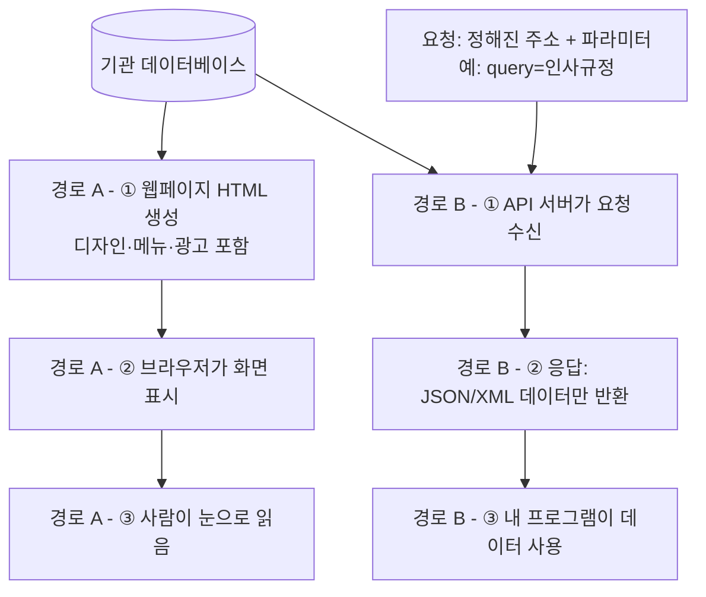
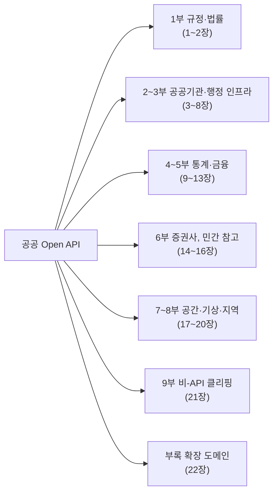

# 개요 — 공공 Open API 활용가이드

## API란 무엇인가

API(Application Programming Interface)는 서로 다른 프로그램이 데이터를 주고받기 위해 정해놓은 약속입니다. 사람이 웹사이트 화면을 열어 눈으로 정보를 읽는 대신, 프로그램이 정해진 주소로 요청을 보내면 정해진 형식(JSON, XML 등)으로 데이터만 돌려받는 방식입니다. 화면 디자인이 바뀌어도 이 약속(요청 주소, 파라미터, 응답 형식)만 유지되면 프로그램은 계속 정상적으로 데이터를 받을 수 있습니다 — 이게 화면을 그대로 긁어오는 크롤링과 API가 근본적으로 다른 지점입니다.

같은 데이터를 두 가지 경로로 꺼내는 상황을 그림으로 비교하면 이렇습니다.

위쪽(경로 A)은 사람이 브라우저로 보는 흐름이고, 아래쪽(경로 B)은 프로그램이 API로 데이터를 받는 흐름입니다. 둘 다 같은 데이터베이스에서 출발합니다.

경로 A는 화면이 바뀌면(메뉴 위치, 디자인 개편 등) 크롤러가 데이터를 찾던 자리를 잃고 깨집니다. 경로 B는 화면과 무관하게 "이 주소로 이 파라미터를 보내면 이 형식으로 돌려준다"는 약속만 지켜지면 계속 동작합니다. 이 책에서 다루는 모든 장은 경로 B — 즉 각 기관이 공식적으로 공개한 요청 주소·파라미터·응답 형식을 정리한 것입니다.

## 공공 Open API란 무엇인가

공공 Open API는 정부 부처·지방자치단체·공공기관이 자신들이 보유한 데이터(법령, 통계, 지도, 주소, 기상 등)를 위와 같은 방식으로 외부에 공개한 것입니다. 대부분 무료이고, 회원가입 후 인증키를 발급받으면 별도 계약 없이 바로 쓸 수 있다는 점이 민간 유료 API와 다릅니다. 이 책은 이런 공공 Open API(및 일부 참고용 민간 API)를 실제로 사용할 수 있는 수준까지 정리한 실무서입니다.

## 왜 이 책이 필요한가

공공데이터가 필요한 프로젝트를 시작하면 흔히 다음 순서를 밟습니다 — 먼저 화면을 크롤링하려다가 구조가 바뀔 때마다 깨지는 걸 겪고, 그다음 "API가 있겠지"라며 찾아보지만 기관마다 문서 형식·인증 방식·파라미터 이름이 제각각이라 매번 처음부터 해맵니다. 이 책은 그 시행착오를 줄이기 위해, 실제로 하나씩 공식 문서를 열어보고 호출해보면서 얻은 결과만 정리한 것입니다.

## 이 책을 이런 순서로 구성한 이유

무작위로 나열하지 않고, 실제로 프로젝트를 진행하는 순서에 가깝게 배치했습니다.

1. **1부(규정·법률)를 가장 먼저, 가장 깊게 다룹니다.** 법제처 API가 이 책에서 다루는 모든 API 중 가장 오래됐고(1부 1장에서 다루는 연혁만 30년 가까이 됩니다) 가장 체계적으로 문서화돼 있어서, 뒤에 나오는 다른 기관 API를 읽을 때 "아, 이건 1장에서 본 패턴이구나"라고 알아볼 수 있는 기준점 역할을 합니다.
2. **2~3부(공공기관·행정 인프라)는 특정 주제가 아니라 여러 프로젝트에 공통으로 필요한 것들입니다.** 어떤 프로젝트를 만들든 주소를 정규화하고(3부), 데이터를 찾고(2부), 사업자를 검증할 일이 생깁니다. 그래서 특정 도메인보다 먼저 배치했습니다.
3. **4~5부(통계·금융)는 분석이 목적인 프로젝트의 축입니다.** 국가 통계에서 시작해서(4부) 점점 좁은 범위인 개별 기업·시장 데이터로(5부) 내려갑니다.
4. **6부(증권사 API)는 공공데이터가 아니라는 걸 분명히 하기 위해 별도 부로 분리했습니다.** 5부까지 읽다가 "증권사도 비슷하겠지"라고 섞어버리면 계좌·약관이 걸린 실제 거래 기능을 공공 API처럼 가볍게 다루는 실수로 이어질 수 있습니다.
5. **7~8부(공간·기상·지역)는 지도 위에 무언가를 표시해야 하는 프로젝트의 축입니다.**
6. **9부와 부록은 이 책의 나머지 부분과 성격이 다릅니다.** 9부는 정식 API가 아니라 비공식 구조를 다루고, 부록은 아직 깊이 조사하지 않은 확장 후보 영역입니다. 그래서 맨 뒤에 뒀습니다.

## 이 책이 다루는 전체 범위

| 부 | 분야 | 제공기관/사이트 | 인증 방식 | 위치 |
|---|---|---|---|---|
| 1부 | 법령·행정규칙·공공기관규정 | 법제처 — open.law.go.kr | 개별 OC 키 | 1장 |
| 1부 | 자치법규(검색 UI) | 행정안전부 ELIS — www.elis.go.kr | 해당 없음 | 2장 |
| 2부 | 공공데이터 메타검색 | 행정안전부 공공데이터포털 — www.data.go.kr | serviceKey | 3장 |
| 2부 | 공공기관 기관/사업/시설/채용정보 | 기획재정부 ALIO 오픈API — opendata.alio.go.kr | 개별 신청 | 4장 |
| 2부 | 지방재정 지표 | 행정안전부 지방재정365 — www.lofin365.go.kr | 개별 신청 | 5장 |
| 3부 | 도로명주소 | 행정안전부 도로명주소 안내시스템 — www.juso.go.kr | 승인키 | 6장 |
| 3부 | 사업자등록 진위·상태 | 국세청(신청: data.go.kr, 호출: api.odcloud.kr) | serviceKey(POST) | 7장 |
| 3부 | 공공서비스(보조금24) | 행정안전부 정부24(신청: data.go.kr, 서비스: www.gov.kr) | serviceKey | 8장 |
| 4부 | 국가통계 | 통계청 KOSIS — kosis.kr/openapi | apiKey | 9장 |
| 4부 | 거시경제·금융통계 | 한국은행 ECOS — ecos.bok.or.kr/api | 인증키(경로형) | 10장 |
| 5부 | 금융회사·상품 정보 | 금융위원회(data.go.kr 경유), 금융감독원 — finlife.fss.or.kr | serviceKey | 11장 |
| 5부 | 기업 공시·재무 | 금융감독원 OpenDART — opendart.fss.or.kr | crtfc_key | 12장 |
| 5부 | 시장 시세(무료) / 데이터상품(유료, 직접결제) | 한국거래소(2015년~ 민간기업) — openapi.krx.co.kr | 인증키 / 구매 | 13장 |
| 6부 | 증권 계좌·주문·시세(민간) | 한국투자증권 — apiportal.koreainvestment.com | OAuth(APP KEY) | 14장 |
| 6부 | 증권 계좌·주문·시세(민간) | NH투자증권 NHPLUG — www.nhplug.com | OAuth(APP KEY) | 15장 |
| 6부 | 증권 계좌·주문·시세(민간) | 키움증권(Open API+) / LS증권 — openapi.ls-sec.co.kr | OCX / XingAPI | 16장 |
| 7부 | 지도·공간정보 | 국토교통부 VWorld — www.vworld.kr | key+domain | 17장 |
| 7부 | 통계+공간 결합 | 통계청 SGIS — sgis.kostat.go.kr | consumer_key/secret | 18장 |
| 7부 | 기상 예보·관측 | 기상청(data.kma.go.kr, 호출: apis.data.go.kr) | serviceKey | 19장 |
| 8부 | 서울시 전 분야 | 서울특별시 — data.seoul.go.kr(호출: openAPI.seoul.go.kr:8088) | 인증키(경로형) | 20장 |
| 9부 | 공공기관 경영공시·내부규정(비공식) | ALIO — alio.go.kr | 없음(비공식) | 21장 |
| 부록 | 관세·조달·교통·환경·해양·농림·산림·재난안전·문화관광·특허·고용·보건의료·식품 등 | 각 소관 부처(개별 사이트는 22장 참고) | 대부분 개별 발급키 | 22장 |

## 각 API로 할 수 있는 일

"이 사이트에서 뭘 가져올 수 있고, 그걸로 뭘 만들 수 있는가"를 챕터를 열지 않고도 한눈에 보기 위한 표입니다.

| 장    | 사이트명                  | 제공 정보                                | 활용 용도                                  |
| ---- | --------------------- | ------------------------------------ | -------------------------------------- |
| 1    | 국가법령정보센터(법제처)         | 법령·행정규칙·자치법규·공공기관규정 조문 원문, 개정 이력     | 상위법령 인용 자동 표시, 규정 준수(컴플라이언스) 점검, 법률 챗봇 |
| 2    | ELIS                  | 자치법규 웹 검색(API 없음)                    | 조례 명칭·현황을 사람이 확인(프로그램 연동은 1장으로)        |
| 3    | 공공데이터포털               | 전국 공공 API·데이터셋의 메타정보                 | 필요한 API를 프로그램으로 탐색, API 카탈로그 자동 구축     |
| 4    | ALIO 정식 Open API      | 공공기관 기관정보·사업정보·시설정보·채용정보             | 공공기관 마스터데이터 구축, 채용공고 자동 수집             |
| 5    | 지방재정365               | 지자체·지방공기업 재정지표(예산·결산·재정자립도 등)        | 지방정부·지방공기업 재정 비교, 건전성 분석               |
| 6    | 도로명주소 API             | 주소 검색·정규화, 행정구역코드, 좌표 매핑             | 회원가입 주소 입력 지원, 배송지 표준화, 지도 연동          |
| 7    | 국세청 사업자등록정보 API       | 사업자번호 상태·휴폐업 여부·진위 확인                | 거래처 자동 검증, 세금계산서 발행요건 판별               |
| 8    | 정부24 공공서비스 API(혜택알리미) | 정부 수혜서비스(보조금 등) 목록·상세·지원조건           | 생애주기별 맞춤 정책 추천 서비스                     |
| 9    | KOSIS                 | 인구·고용·물가 등 국가 통계 전반                  | 정책·산업·지역 리포트 자동화                       |
| 10   | 한국은행 ECOS             | 기준금리·환율·GDP·물가 등 거시경제 통계             | 투자 분석, 경제 동향 리포트                       |
| 11   | 금융공공데이터               | 금융회사 기본정보, 금융상품 정보                   | 금융기관 실체 검증, 금융상품 비교 서비스                |
| 12   | OpenDART              | 상장·비상장기업 공시·재무제표                     | 기업 재무분석, 투자 스크리닝                       |
| 13   | KRX Open API          | 국내 증시 시세·지수(무료) / 시장데이터 상품(유료)       | 백테스트, 시장 모니터링                          |
| 14   | 한국투자증권 KIS Developers | 계좌 조회·시세·주문(실계좌 연동, 민간)              | 자동매매, 개인 투자 대시보드                       |
| 15   | 나무증권 NHPLUG           | 계좌 조회·시세·주문(NH투자증권, 민간)              | 자동매매, AI 연계 투자전략                       |
| 16   | 키움증권·LS증권             | 계좌 조회·시세·주문(Windows OCX/XingAPI, 민간) | 기존 Windows 자동매매 자산 활용                  |
| 17   | VWorld                | 지도 타일, 공간(GIS) 데이터, 지오코딩(주소↔좌표)      | 지도 서비스 제작, 부동산·지역 시각화                  |
| 18   | SGIS                  | 인구·가구·주택 통계 + 행정구역 경계(GeoJSON)       | 인구 지도(코로플레스) 시각화, 지역분석                 |
| 19   | 기상자료개방포털              | 초단기실황·초단기예보·단기(동네)예보                 | 날씨 기반 추천(여행·행사), 실시간 알림                |
| 20   | 서울 열린데이터광장            | 서울시 전 분야(교통·복지·환경·행정 등) 데이터          | 서울 지역 정책·상권·교통 분석                      |
| 21   | ALIO 사이트(비공식 클리핑)     | 공공기관 내부규정 원문(정관·인사규정 등, PDF/HWP)     | 기관 간 규정 비교, 컴플라이언스 리서치                 |
| 22-a | 관세청 UNI-PASS          | 화물통관·HS부호·관세율                        | 수출입·통관 프로세스 자동화                        |
| 22-b | 조달청                   | 입찰공고·낙찰·계약 정보                        | 공공조달 시장 분석, 입찰 모니터링                    |
| 22-c | ITS·TAGO·국토교통부        | 도로 소통정보, 대중교통, 부동산 실거래가              | 교통 서비스, 부동산 시세 분석                      |
| 22-d | 에어코리아(환경공단)           | 대기오염(미세먼지 등) 실시간 정보                  | 대기질 알림 서비스                             |
| 22-e | 해양수산부·국립수산과학원·MTIS    | 해양관측·예측, 여객선 운항, 해양사고 통계             | 해양 레저·안전 서비스(단, 해양수산부 API는 전환 중)       |
| 22-f | 농림축산식품부·산림청           | 농업기술정보, 산림자원통계                       | 농림 정책·산업 분석                            |
| 22-g | 재난안전데이터공유플랫폼          | 재난문자, 교통 돌발정보, 소방 긴급구조정보             | 재난·안전 알림 서비스                           |
| 22-h | 한국관광공사 TourAPI        | 관광지·숙박·음식점·축제 정보                     | 여행 추천·일정 자동화                           |
| 22-i | 특허청 KIPRIS Plus       | 특허·상표·디자인 출원·등록 정보                   | 기술·산업 특허 분석                            |
| 22-j | 고용노동부 워크넷             | 채용정보                                 | 구직 매칭 서비스                              |
| 22-k | HIRA(보건의료빅데이터개방시스템)   | 의료기관·진료·의약품 통계                       | 보건정책 분석                                |
| 22-l | 국민건강보험공단(NHIS)        | 검진기관, 장기요양기관 정보(data.go.kr 경유)       | 의료·요양기관 검색 서비스                         |
| 22-m | 식품의약품안전처(식품안전나라)      | 식품 인허가·안전정보                          | 식품 안전 검증 서비스                           |
| 22-n | 소방청·경찰청               | 화재 현황, 교통사고 통계                       | 안전·치안 지역분석                             |
| 22-o | NEIS(교육정보개방포털)        | 학교 정보                                | 교육 정책·서비스                              |

> **NOTE**: 22로 시작하는 행은 전부 22장(확장 도메인 서베이) 안에 있으며, 1~21장과 달리 파라미터 단위 깊이가 아니라 "무엇이 있는지" 수준의 기본조사입니다.

## 이 책의 정보는 어떻게 만들어졌는가

이 책의 모든 장은 해당 기관의 공식 문서를 직접 열어보거나, 여러 독립된 개발자 문서·오픈소스 라이브러리가 같은 파라미터를 쓰는지 대조하는 과정을 거쳐 썼습니다. 22장(확장 도메인)만 예외적으로, 존재와 기본 구조까지만 확인하고 파라미터 단위 세부사항은 다루지 않았습니다.

다만 아래 두 가지는 독자가 실제로 코드에 반영하기 전에 스스로 한 번 더 확인해야 합니다.

- **구체적인 수치**(트래픽 한도, 통계 건수, 비용 등)는 기관이 발표한 시점의 스냅샷입니다. 시간이 지나면 바뀝니다. 예를 들어 11장(금융공공데이터)의 API 개수는 2020년 개방 이후 매년 늘어나서, 조사 시점에 따라 "102개"와 "110개"처럼 다른 숫자가 나옵니다 — 둘 다 틀린 게 아니라 서로 다른 시점의 정확한 수치입니다.
- 본문에 **"추정"**이라고 표시된 부분(주로 응답 데이터의 세부 필드명)은 같은 시스템의 다른 확인된 패턴에 근거한 합리적 추론이며, 실제 호출 결과로 최종 확인해야 합니다.

## 공통 인증 패턴

한국 공공 Open API는 거의 예외 없이 아래 세 유형 중 하나로 인증합니다.

| 유형 | 방식 | 예 |
|---|---|---|
| 개별 발급키(자동승인) | 회원가입 → 신청서 작성(활용목적 필수) → 즉시/당일 발급 | 법제처(OC), KOSIS |
| 공공데이터포털 통합키 | data.go.kr에서 발급받은 서비스키를 여러 기관 API에 공용으로 사용 | 국세청 사업자정보 등 |
| 민간 서비스 전용 절차 | 계좌 개설·본인인증 등 선행 조건 후 앱키·시크릿키 발급 | 증권사 API(6부) |

요청 주소를 만드는 방식에도 두 계열이 있습니다. 대부분(3장 이후 소개하는 data.go.kr 계열)은 `?파라미터=값` 형태의 **쿼리스트링**을 쓰지만, 한국은행 ECOS(10장)·서울시(20장)·식품안전나라(22장)처럼 **주소 경로에 값을 순서대로 이어붙이는** 오래된 방식을 쓰는 곳도 있습니다. 대체로 후자가 더 오래전부터 운영돼온 시스템입니다.