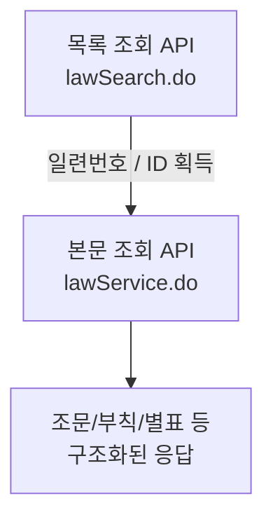

# 1장. 국가법령정보 공동활용 Open API (법제처)

> 공공 Open API 가이드북 — 1부. 규정·법률
> 확인 상태: 목록/본문 조회 공식 문서 직접 확인(law/admrul), 목록 API 공식 확인(school/public/pi), 본문 API 일부 추정 표시, 연혁·법적 근거는 국가법령정보센터 공식 연혁 페이지 및 위키백과 교차 확인

| 항목 | 내용 |
|---|---|
| 제공기관 | 법제처 (국가법령정보센터) |
| 포털 주소 | https://open.law.go.kr |
| 인증 방식 | 개별 발급 OC 키 (자동승인, 무료) |
| 비용 | 무료 (단, 과도한 연속 호출 시 이용 제한) |
| 활용 우선순위 | 법령·행정규칙·자치법규·공공기관 규정을 다루는 모든 프로젝트에 공통 적용 |

---

### 0) 연결 고리 (Bridge)

규정·법령을 다루는 시스템(내부규정 관리, 컴플라이언스 점검, 정책 리서치, 법률 챗봇 등)은 대부분 "우리 문서가 인용하는 상위 법령/타 기관 규정을 어떻게 보여줄 것인가"라는 동일한 문제를 만납니다. 이 장은 그 문제를 크롤링 없이 API로 해결하는 방법과, 이 가이드북 전체에서 반복되는 "목록→본문 2단계" 패턴의 원형을 정리합니다. 다른 어떤 장보다 먼저 깊게 다루는 이유는, 뒤에 나올 여러 장(ELIS, 행정 인프라, 확장 도메인)이 결국 이 장의 URL 패턴·인증 철학을 변형해서 쓰기 때문입니다.

---

## 1) 개념 정의 및 필요성

### 1.1 국가법령정보센터란 무엇이고, 왜 이런 규모로 존재하는가

**핵심 정의**: 국가법령정보 공동활용 Open API는 법제처가 국가법령정보센터(law.go.kr)에 등재된 법령·행정규칙·자치법규·학칙/공단/공공기관 규정 등을 실시간 조회할 수 있도록 제공하는 REST 기반 API 묶음입니다.

이걸 "그냥 정부 API 하나"로 보면 왜 이렇게 설계가 복잡한지 이해하기 어렵습니다. 실제로는 30년 가까운 데이터 축적의 결과물입니다. 공식 연혁을 확인해보면:

- **1954년** 대한민국법령집이 종이책(상·중·하 3권)으로 처음 편찬됐습니다. 이게 이 시스템의 출발점입니다.
- **1998년** 현행법령이 처음 인터넷으로 서비스되기 시작했고, **1999~2000년**에는 정부 수립 이후 모든 법령의 **연혁**(개정 이력)이 DB로 구축됐습니다.
- **2004~2006년**에는 대한제국·조선총독부·미군정 시기의 **근대법령**까지 소급해서 DB로 편입됐고, 같은 시기 모든 별표·서식이 한글(HWP) 문서로 디지털화됐습니다.
- **2008년**에 법령·행정규칙·자치법규를 통합 구축·연계하는 "국가법령정보시스템"이 개발됐고, **2009~2010년**에 지금의 "국가법령정보센터"(law.go.kr)라는 이름과 형태로 서비스가 시작됐습니다.
- **2010~2011년**에 중앙부처·헌법기관의 행정규칙(훈령/예규/고시)이 전면 통합 구축됐습니다.

즉 지금 우리가 API로 호출하는 데이터는 **원래 사람이 읽는 웹사이트로 30년 가까이 누적된 것을, 나중에 API 레이어로 감싼 것**입니다. 이 사실이 실무에 주는 함의가 있습니다 — 오래된 레거시 데이터일수록 스키마가 일관되지 않거나(예: 학칙·공단·공공기관 API가 "행정규칙명"이라는 필드명을 그대로 재사용하는 것, 2-B절 참고), 카테고리 경계가 역사적 이유로 애매한 경우가 있습니다. 법제처 자체 앱 소개자료 기준으로 전체 법령정보 규모가 **약 470만 건**에 달하는 것으로 확인되며(공식 앱스토어 소개, 시점 스냅샷), 이 중 "공공기관규정"(대학 학칙·규정, 공사·공단 규정)이 별도 카테고리 4번으로 명시되어 있는 것도 확인됩니다 — 즉 2-B절의 `target=pi/school/public`이 다루는 영역이 법제처 자체 분류 체계에서도 독립된 카테고리라는 뜻입니다.

### 1.2 법적 근거

이 API는 임의로 만들어진 게 아니라 「공공데이터의 제공 및 이용 활성화에 관한 법률」에 따른 공공데이터 개방 의무의 연장선에 있습니다. 국가법령정보센터 자체 소개에서도 "법령정보를 공공 데이터로 공개·개방하여 데이터와 신기술을 융합한 비즈니스를 창출할 수 있도록 공동활용 서비스(Open API)를 제공"한다고 명시합니다. 이건 실무적으로 중요한 함의가 있습니다 — **이 API의 이용허락범위는 원칙적으로 제한이 없다**는 게 여러 데이터셋 페이지에서 "이용허락범위 제한 없음"으로 확인되며, 상업적 활용도 별도 저작권 협의 없이 가능합니다(단, 법제처 저작권 표시 등 일반적인 공공데이터 이용조건은 준수해야 함).

### 1.3 왜 필요한가 — 대안이 없다면 벌어지는 일

규정이나 계약, 정책 문서를 다루는 시스템은 자기 데이터베이스만으로 완결되지 않습니다. 문서 안에는 항상 상위 법령이나 타 기관 규정에 대한 인용이 섞여 있습니다. 이 API가 없다면 개발팀은 다음 중 하나를 선택해야 합니다.

1. **수작업 복사·붙여넣기** — law.go.kr 웹사이트에서 조문을 직접 긁어와 자체 DB에 저장. 법령이 개정될 때마다 사람이 다시 확인해야 하고, 개정을 놓치면 오래된 조문을 인용하는 사고가 발생합니다.
2. **화면 크롤링(스크래핑)** — HTML 구조에 의존하므로 법제처가 UI를 바꿀 때마다 깨지고, 대량 요청 시 접근이 차단될 위험이 있습니다.
3. **API 호출** — 이 장에서 다루는 방식. 법제처가 실시간으로 관리하는 원천 데이터를 그대로 가져오므로, 개정 추적·정합성 관리 부담이 구조적으로 사라집니다.

이 세 갈래 중 API가 유일하게 "유지보수 비용이 시간이 지나도 늘지 않는" 방식입니다. 이게 이 장을 가이드북의 맨 앞에, 그리고 가장 깊게 배치한 이유입니다.

> **NOTE**: 이 API가 다루는 범위는 법령/행정규칙/자치법규/학칙·공단·공공기관 외에도 판례, 법령해석례, 별표·서식, 조약, 각종 위원회(개인정보보호위원회·공정거래위원회·국민권익위원회 등) 결정문, 특별행정심판례까지 총 191건의 세부 API로 확장되어 있는 것이 공식 가이드 목록에서 확인됩니다. 이 장은 그중 규정·법령 프로젝트에 핵심적인 `law`/`admrul`/`ordin`/`school·public·pi` 네 갈래를 집중적으로 다룹니다.

---

## 2) 핵심 원리 및 구조

### 2.1 공통 URL 패턴 — 왜 "목록→본문" 2단계인가

법령/행정규칙/자치법규/학칙·공단·공공기관 API는 예외 없이 아래 2단계 구조를 따릅니다.



| 구분 | 엔드포인트 | 역할 |
|---|---|---|
| 목록 조회 | `http://www.law.go.kr/DRF/lawSearch.do` | 키워드/조건으로 검색 → 결과 목록과 각 항목의 식별자 반환 |
| 본문 조회 | `http://www.law.go.kr/DRF/lawService.do` | 식별자로 특정 1건의 전체 조문 반환 |

이 2단계 분리는 우연이 아니라 데이터 규모 때문입니다. 470만 건 규모의 데이터베이스에서 "조문 전체"를 매번 통째로 내려받게 하면 네트워크 비용과 서버 부하가 감당되지 않습니다. 그래서 ①가벼운 메타데이터(제목·발령일·식별자)만 먼저 목록으로 주고, ②사용자가 실제로 필요한 1건만 본문으로 요청하게 하는 구조입니다. 이 가이드북의 다른 여러 장(KOSIS, ECOS, 서울 열린데이터광장 등)에서도 같은 철학의 변형이 반복해서 나타납니다 — **대량 공공데이터 API의 사실상 표준 설계 패턴**이라고 봐도 됩니다.

### 2.2 target 값 총정리 — 본문조회 공통 패턴표

`target`은 "어떤 데이터군을 조회할 것인가"를 지정하는 필수 파라미터입니다. 아래는 본문조회 시 식별자 파라미터가 target마다 어떻게 달라지는지 한눈에 보는 표입니다 — **이 가이드북에서 가장 자주 참조하게 될 표**입니다.

| target 값 | 대상 | 본문조회 식별자 | 확인 상태 |
|---|---|---|---|
| `law` | 법률·시행령·시행규칙 | `ID`(법령ID) 또는 `MST`(법령일련번호) 중 하나 | 확인됨 |
| `admrul` | 행정규칙(훈령/예규/고시/공고/지침/기타) | `ID`(일련번호) / `LID`(행정규칙ID) / `LM`(명칭) | 확인됨 |
| `ordin` | 자치법규(지자체 조례·규칙) | `ID` 또는 `MST` 중 하나 | 확인됨(샘플 데이터로 MST 사용 사례 확인) |
| `school` | 대학 학칙·규정 | `ID`/`LID`/`LM` 추정(admrul과 동일 패턴) | 목록 API만 확인, 본문 API는 추정 |
| `public` | 지방공사·공단 규정 | 〃 | 〃 |
| `pi` | **공공기관 규정** | 〃 | 〃 |

> **WARNING**: `school`/`public`/`pi`는 별개의 API가 아니라 **같은 API의 target 값 차이**입니다. 요청 URL 형태 자체는 `lawSearch.do?target=school(or public or pi)`로 공식 문서에 표기되어 있습니다.

> **TIP**: target마다 식별자 파라미터 이름(`ID`/`LID`/`MST`)이 미묘하게 다른 이유는 앞서 1.1절에서 설명한 "구축 시기가 다른 여러 시스템이 나중에 통합됐다"는 역사와 무관하지 않아 보입니다(관찰). 법령(`law`)과 행정규칙(`admrul`)은 각각 별도 시기에 별도 팀이 구축했을 가능성이 높고, 그 흔적이 파라미터 명명 방식의 차이로 남아있는 것으로 추정됩니다. 새로운 target을 다룰 때는 항상 이 표에 한 줄을 추가하는 방식으로 관리하면, 나중에 파라미터를 헷갈리는 실수를 줄일 수 있습니다.

### 2.3 공통 요청 파라미터 (모든 target에서 반복 등장)

| 파라미터 | 값 | 설명 |
|---|---|---|
| OC | string(필수) | 발급받은 인증키 |
| type | char(필수) | HTML / XML / JSON |
| query | string | 검색어 |
| search | int | 1=명칭검색(기본), 2=본문검색 |
| display | int | 결과 개수 (기본 20, 최대 100) |
| page | int | 페이지 (기본 1) |
| nw | int | 1=현행(기본), 2=연혁 |

`nw` 파라미터는 특히 중요합니다. 1.1절에서 본 것처럼 이 시스템은 **연혁(개정 이력) DB를 2000년부터 별도로 구축**해왔기 때문에, 단순히 "지금 시행 중인 조문"만이 아니라 "과거 특정 시점에 시행 중이던 조문"까지 조회할 수 있습니다. 이는 "그때 우리 규정이 인용한 법령이 지금과 어떻게 달라졌는가"를 추적해야 하는 컴플라이언스 감사 시나리오에서 결정적인 기능입니다.

---

## 3) 실습 — API 키 발급 따라하기

> 이 절은 실제로 따라 하면서 진행할 수 있도록 신청 화면 항목을 그대로 기록합니다.

**주소**: https://open.law.go.kr → 우측 상단 로그인/회원가입 → **OPEN API 신청**

1. **신청자정보**
   - 기업명 (개인이면 "개인" 선택)
   - 신청자명, 전화번호
2. **OPEN API 신청정보**
   - **API인증키(OC)**: 사용자가 직접 원하는 문자열을 지정합니다(예: `openlawgo`). 이메일 아이디 형식(`g4c@korea.kr`면 `OC=g4c`)이 안내 예시지만, 실제로는 임의 문자열 지정이 허용됩니다.
   - 이후 API 호출 시 `OC` 요청변수 값으로 그대로 사용합니다. 발급 확인은 로그인 후 **마이페이지 > API인증키관리**에서 가능합니다.
3. **시스템정보**
   - 도메인주소(url): 서비스용 도메인이 없으면 "도메인 없음" 선택 가능
   - 서버 IP주소: 여러 개 등록 가능(추가/삭제)
4. **국가법령정보 활용목적**
   - **활용 목적, 적용 분야, 사업 모델을 구체적으로 기재해야 합니다.** 공란이거나 "ㅇㅇㅇ", "가나다" 같은 무의미한 문구면 승인이 취소될 수 있습니다(공식 안내).
5. **공동활용 법령종류 선택**
   - 법령/행정규칙/학칙공단/자치법규/판례/헌재결정례/법령해석례/행정심판례/조약/법령용어/별표서식/영문법령/각 위원회 결정문/각 부처 법령해석/특별행정심판례/사전컨설팅 의견서 등 **전체선택** 또는 개별 선택 가능. 각 항목마다 목록/본문을 HTML/XML/JSON 중 원하는 형식으로 개별 신청.
6. **주의사항 동의**
   - 짧은 시간 내 과도한 호출 시 이용 제한될 수 있음에 동의
   - 활용목적 부실 기재 시 승인 취소될 수 있음에 동의
7. **신청 완료** — 공식 안내상 **자동승인**되며, 활용가이드에 따라 바로 호출 가능합니다.

> **NOTE**: 신청 시 문의처는 국가법령정보센터 유지보수(02-2109-6457), 사용신청 관련 문의는 02-2109-6446입니다.

---

## 4) target=admrul (행정규칙) — 전체 파라미터 확인 완료

행정규칙은 훈령·예규·고시·공고·지침·기타 6종으로 나뉩니다. 이 구분은 법제처가 임의로 만든 게 아니라 「행정 효율과 협업 촉진에 관한 규정」등 행정규칙 자체의 법적 정의를 따릅니다 — 훈령은 상급기관이 하급기관에 장기간 시달하는 명령, 예규는 반복적 업무 처리기준, 고시는 일반에 대외적으로 알리는 사항입니다. 이 차이가 `knd` 파라미터로 그대로 API에 반영되어 있습니다.

### 목록 조회 (`lawSearch.do?target=admrul`)

| 요청변수 | 값 | 설명 |
|---|---|---|
| org | string | 소관부처별 검색(코드 별도) |
| knd | string | 1=훈령/2=예규/3=고시/4=공고/5=지침/6=기타 |
| gana | string | 사전식 검색(ga,na,da…) |
| sort | string | lasc(기본, 명칭 오름차순)/ldes/dasc/ddes/nasc/ndes/efasc/efdes |
| date | int | 발령일자 |
| prmlYd | string | 발령일자 범위(`20090101~20090130`) |
| modYd | string | 수정일자 범위 |
| nb | int | 발령번호(예: 제2023-8호 → `nb=20238`) |
| popYn | string | 팝업창 여부(Y일 때만) |

**응답 필드**: target, 키워드, section, totalCnt, page, admrul id, **행정규칙 일련번호**, 행정규칙명, 행정규칙종류, 발령일자, 발령번호, 소관부처명, 현행연혁구분, 제개정구분코드, 제개정구분명, **행정규칙ID**, 행정규칙상세링크, 시행일자, 생성일자

> **TIP**: 응답에 `행정규칙 일련번호`와 `행정규칙ID`가 **둘 다** 들어있습니다. 본문 조회 시 어느 쪽을 쓸지는 아래 표를 참고하세요.

### 본문 조회 (`lawService.do?target=admrul`)

| 요청변수 | 값 | 설명 |
|---|---|---|
| OC | string(필수) | 인증키 |
| target | admrul(필수) | 서비스 대상 |
| type | char(필수) | HTML/XML/JSON |
| **ID** | char | **행정규칙 일련번호** ← 목록의 "행정규칙 일련번호" 필드 값 |
| **LID** | char | **행정규칙 ID** ← 목록의 "행정규칙ID" 필드 값 |
| LM | string | 행정규칙명(정확한 명칭 직접 입력) |

```
✔ 목록 응답의 "행정규칙 일련번호" 값 → 본문조회 시 ID 파라미터
✔ 목록 응답의 "행정규칙ID" 값       → 본문조회 시 LID 파라미터
```

**샘플 URL (공식 문서 확인)**
```
http://www.law.go.kr/DRF/lawService.do?OC=test&target=admrul&ID=62505&type=HTML
http://www.law.go.kr/DRF/lawService.do?OC=test&target=admrul&ID=10000005747&type=XML
http://www.law.go.kr/DRF/lawService.do?OC=test&target=admrul&ID=2000000091702&type=JSON
```

**응답 필드(전체)**: 행정규칙 일련번호, 행정규칙명, 행정규칙종류(코드 포함), 발령일자/번호, 제개정구분(코드/명), 조문형식여부, 행정규칙ID, 소관부처명/코드, 상위부처명, 담당부서기관코드/명, 담당자명, 전화번호, 현행여부, 시행일자, 생성일자, **조문내용**, 부칙(공포일자/번호/내용), 별표(번호/가지번호/구분/제목/서식파일링크/PDF링크/내용), 첨부파일(명/링크)

이 응답 필드 중 실무에서 가장 자주 놓치는 게 **`조문형식여부`**입니다. 모든 행정규칙이 "제1조, 제2조..." 식의 조문 형태로 작성되는 게 아니라, 서식 나열이나 자유 서술 형태인 경우도 있습니다. 이 필드가 "아니오"인 문서를 조문 파서(장/절/조/항/호/목 구조 인식기)에 그대로 넣으면 파싱이 실패하거나 이상하게 쪼개집니다. 9장(21장, ALIO 클리핑)의 HWPX 파서를 이 API 응답에도 재사용하려는 계획이 있다면, 이 필드로 먼저 분기해야 합니다.

---

## 5) target=pi / school / public (학칙·공단·공공기관) — 목록 API 확인 완료, 본문 API 일부 추정

### 목록 조회 (`lawSearch.do?target=pi(또는 school, public)`)

| 요청변수 | 값 | 설명 |
|---|---|---|
| target | 필수 | **school**=대학 / **public**=지방공사공단 / **pi**=공공기관 |
| knd | string | **1=학칙 / 2=학교규정 / 3=학교지침 / 4=학교시행세칙 / 5=공단규정·공공기관규정** |
| rrClsCd | string | 200401=제정 / 200402=전부개정 / 200403=일부개정 / 200404=폐지 / 200405=일괄개정 / 200406=일괄폐지 / 200407=폐지제정 / 200408=정정 / 200409=타법개정 / 200410=타법폐지 |
| date | int | 발령일자 |
| prmlYd | string | 발령일자 범위검색 |
| nb | int | 발령번호 |
| gana | string | 사전식 검색 |
| sort | string | lasc(기본)/ldes/dasc 등 |

> **TIP**: 특정 공공기관 규정을 찾을 때는 `target=pi&knd=5`로 좁히는 게 정확합니다.

**응답 필드(확인된 것)**: 학칙공단 일련번호, 행정규칙명(=규정명), 행정규칙종류(=규정종류), 발령일자, 발령번호, 소관부처명, 현행연혁구분, 제개정구분코드/명, 법령분류코드/명 등

> **NOTE**: 응답 필드명이 "행정규칙명", "행정규칙종류"인 것은 법제처 시스템이 학칙·공단·공공기관 데이터도 내부적으로 행정규칙과 같은 스키마를 재사용하고 있어서로 보입니다(관찰). 1.1절에서 확인한 "공공기관규정"이 법제처 자체 분류상 독립 카테고리(4번)라는 걸 감안하면, **분류상으로는 독립적이지만 데이터베이스 스키마는 행정규칙 테이블을 물려받아 재사용하는 구조**로 설계됐을 가능성이 높습니다. 실제 의미는 "규정명", "규정종류"로 읽으면 됩니다.

### 본문 조회 — ⚠ 공식 페이지 직접 확인 실패 (추정 포함)

법제처 사이트에 "학칙·공단·공공기관 본문 조회 API"가 목록과 별도로 **존재하는 것은 확인**했지만, 상세 파라미터 페이지는 조사 시점 캐시 문제로 원문을 직접 받아오지 못했습니다. 같은 플랫폼의 다른 모든 본문조회 API가 예외 없이 `ID`/`LID`/`LM` 3종 파라미터 패턴을 쓰는 것으로 볼 때, **학칙·공단·공공기관 본문조회도 같은 패턴일 가능성이 높습니다** — 확인된 사실이 아니라 추정이므로, 실제 호출 전에 목록 API 결과의 "학칙공단 상세링크" 필드를 직접 열어 검증하시길 권합니다.

```
추정 요청 형태(검증 필요):
http://www.law.go.kr/DRF/lawService.do?OC={발급키}&target=pi&ID={학칙공단 일련번호}&type=JSON
```

---

## 6) target=law / ordin — 상위법령·자치법규

| target | 용도 | 본문조회 방식 |
|---|---|---|
| `law` | 법률·시행령·시행규칙 | `ID`(법령ID) 또는 `MST`(법령일련번호=법령테이블 lsi_seq 값) 중 하나. `search`(1=법령명/2=본문검색) 지원 |
| `ordin` | 지자체 조례·규칙 | 동일 구조. 공식 데이터 샘플에서 `target=ordin&MST={번호}` 형태 확인 |

`target=law`가 다루는 데이터의 시간 범위는 공식 데이터셋 메타정보에서 **2004년 12월 ~ 2024년 2월**로 명시된 사례가 확인됩니다(다만 이건 개별 부가서비스 API 하나의 메타데이터이며, 법령 본문 자체는 1.1절에서 본 것처럼 연혁 DB까지 포함하면 정부 수립 이후 전체를 커버합니다 — 부가서비스별로 커버 범위가 다를 수 있다는 점에 유의).

이 외에도 법제처는 자치법규 관련 세부 API를 여러 개 따로 제공합니다(공식 목록 확인): **자치법규 연계 정보**(자치법규-상위법령 조문 매핑, 지자체명·자치법규ID·법령ID·연계조문번호·연계유형을 제공), **자치법규 별표·서식 목록**, **모바일 자치법규 목록/본문**. 2장(ELIS)에서 다루는 자치법규 데이터의 실제 API 창구가 바로 이 `target=ordin` 계열입니다.

**자치법규 연계 정보**가 특히 실무적으로 중요합니다. 이 API는 "이 조례가 어느 상위 법률의 몇 조를 근거로 하는가"를 이미 법제처가 매핑해둔 데이터를 그대로 제공합니다 — 즉 규정관리 시스템이 직접 자연어 처리로 상위법령 인용을 파싱하려는 시도를 아예 건너뛸 수 있다는 뜻입니다. 다만 이건 자치법규(지자체 조례)에 한정된 기능이고, 행정규칙이나 학칙·공단·공공기관 규정에도 같은 연계 기능이 있는지는 이번 조사에서 확인하지 못했습니다.

> 상위법령 인용 표시(law)나 지자체 조례 비교(ordin)에 활용합니다. 전체 파라미터는 실제 구현 시점에 재조사를 권장합니다.

---

## 7) 코드 예제 및 실행 환경

### 7.1 최소 탐색용 클라이언트

```python
# law_api_client.py — 탐색/검증용 최소 클라이언트
# v1.0, Python 3.11+, requests 2.x
"""
NOTE: 이 코드는 응답 구조 확인용입니다.
      실제 프로젝트 통합 시에는 timeout/retry/도메인 예외/pydantic DTO를
      적용한 정식 API 래퍼로 재작성이 필요합니다 — 7.2절 참고.
"""
import time
import requests

BASE_SEARCH = "http://www.law.go.kr/DRF/lawSearch.do"
BASE_SERVICE = "http://www.law.go.kr/DRF/lawService.do"
OC = "여기에_발급받은_OC값"  # 운영 시 .env 또는 config.yaml에서 로드


def search_admrul(query: str, knd: str | None = None) -> dict:
    """행정규칙 목록 조회. 응답에 '행정규칙 일련번호'와 '행정규칙ID'가 함께 포함됨."""
    params = {"OC": OC, "target": "admrul", "type": "JSON", "query": query}
    if knd:
        params["knd"] = knd
    resp = requests.get(BASE_SEARCH, params=params, timeout=10)
    resp.raise_for_status()
    return resp.json()


def get_admrul_detail(seq_no: str) -> dict:
    """행정규칙 본문 조회. seq_no = 목록 응답의 '행정규칙 일련번호' 값 (ID 파라미터)."""
    params = {"OC": OC, "target": "admrul", "type": "JSON", "ID": seq_no}
    resp = requests.get(BASE_SERVICE, params=params, timeout=10)
    resp.raise_for_status()
    return resp.json()


def search_pi(query: str, knd: str = "5") -> dict:
    """공공기관 규정 목록 조회. knd=5 → 공단규정·공공기관규정으로 범위 한정."""
    params = {"OC": OC, "target": "pi", "type": "JSON", "query": query, "knd": knd}
    resp = requests.get(BASE_SEARCH, params=params, timeout=10)
    resp.raise_for_status()
    return resp.json()


if __name__ == "__main__":
    admrul_hits = search_admrul("도로")
    print("[행정규칙]", admrul_hits)
    time.sleep(1)  # 과도한 연속호출 방지

    pi_hits = search_pi("공사")
    print("[공공기관규정]", pi_hits)
```

### 7.2 운영용 래퍼 — DTO 검증·재시도·도메인 예외를 갖춘 구조

탐색용 스크립트를 그대로 운영에 쓰면 안 되는 이유는, 법제처 서버가 일시적으로 응답하지 않거나(네트워크 요인), 검색 결과가 0건이거나, 필드가 예상과 다른 경우를 모두 "그냥 예외 터짐"으로 처리하게 되기 때문입니다. 아래는 이 가이드북의 코딩 규칙(timeout/retry, HTTP status → 도메인 예외 매핑, pydantic DTO 검증, raw response 반환 금지)을 적용한 예시입니다.

```python
# law_api/exceptions.py
class LawApiError(Exception):
    """법제처 API 관련 모든 예외의 기반 클래스."""


class LawApiConnectionError(LawApiError):
    """네트워크 연결/타임아웃 오류."""


class LawApiNotFoundError(LawApiError):
    """조회 결과가 0건인 경우."""


class LawApiSchemaError(LawApiError):
    """응답 스키마가 DTO 검증에 실패한 경우(예상치 못한 필드 구조)."""
```

```python
# law_api/models.py
from pydantic import BaseModel, Field


class AdmrulSummary(BaseModel):
    """행정규칙 목록조회 응답 1건의 DTO."""

    seq_no: str = Field(alias="행정규칙 일련번호")
    admrul_id: str = Field(alias="행정규칙ID")
    name: str = Field(alias="행정규칙명")
    kind: str = Field(alias="행정규칙종류")
    ministry: str = Field(alias="소관부처명")
    is_current: str = Field(alias="현행연혁구분")

    model_config = {"populate_by_name": True}


class AdmrulDetail(BaseModel):
    """행정규칙 본문조회 응답의 DTO(핵심 필드만 발췌)."""

    seq_no: str = Field(alias="행정규칙 일련번호")
    name: str = Field(alias="행정규칙명")
    is_article_format: str = Field(alias="조문형식여부")
    content: str = Field(alias="조문내용", default="")

    model_config = {"populate_by_name": True}
```

```python
# law_api/client.py
import time
from typing import Any

import requests
from pydantic import ValidationError

from .exceptions import LawApiConnectionError, LawApiNotFoundError, LawApiSchemaError
from .models import AdmrulDetail, AdmrulSummary

BASE_SEARCH = "http://www.law.go.kr/DRF/lawSearch.do"
BASE_SERVICE = "http://www.law.go.kr/DRF/lawService.do"


class LawApiClient:
    """법제처 국가법령정보 공동활용 API 운영용 클라이언트.

    - 모든 외부 I/O는 이 클래스 내부에서만 수행(외부 I/O 경계에서만 try/except 원칙).
    - HTTP 상태 코드/타임아웃은 도메인 예외로 변환해 재전파.
    - 응답은 raw dict가 아니라 검증된 DTO로만 상위 레이어에 반환.
    """

    def __init__(self, oc: str, timeout: int = 10, max_retries: int = 3) -> None:
        self._oc = oc
        self._timeout = timeout
        self._max_retries = max_retries

    def _get(self, url: str, params: dict[str, Any]) -> dict:
        last_error: Exception | None = None
        for attempt in range(1, self._max_retries + 1):
            try:
                resp = requests.get(url, params=params, timeout=self._timeout)
                resp.raise_for_status()
                return resp.json()
            except requests.exceptions.Timeout as exc:
                last_error = exc
                time.sleep(0.5 * attempt)  # 선형 백오프
            except requests.exceptions.HTTPError as exc:
                raise LawApiConnectionError(f"HTTP 오류: {exc}") from exc
        raise LawApiConnectionError(f"{self._max_retries}회 재시도 후 실패: {last_error}")

    def search_admrul(self, query: str, knd: str | None = None) -> list[AdmrulSummary]:
        params = {"OC": self._oc, "target": "admrul", "type": "JSON", "query": query}
        if knd:
            params["knd"] = knd
        raw = self._get(BASE_SEARCH, params)

        items = raw.get("AdmRulSearch", {}).get("admrul", [])  # 실제 키 구조는 응답 확인 후 조정 필요
        if not items:
            raise LawApiNotFoundError(f"'{query}' 검색 결과 없음")

        try:
            return [AdmrulSummary.model_validate(item) for item in items]
        except ValidationError as exc:
            raise LawApiSchemaError(f"응답 스키마 불일치: {exc}") from exc

    def get_admrul_detail(self, seq_no: str) -> AdmrulDetail:
        params = {"OC": self._oc, "target": "admrul", "type": "JSON", "ID": seq_no}
        raw = self._get(BASE_SERVICE, params)

        try:
            return AdmrulDetail.model_validate(raw.get("AdmRulService", raw))
        except ValidationError as exc:
            raise LawApiSchemaError(f"응답 스키마 불일치: {exc}") from exc
```

```python
# main.py — 진입점(예외 처리는 여기서만 except Exception 허용)
import logging
import sys

from law_api.client import LawApiClient
from law_api.exceptions import LawApiError

logging.basicConfig(level=logging.INFO)
logger = logging.getLogger(__name__)


def main() -> int:
    client = LawApiClient(oc="여기에_발급받은_OC값")
    try:
        hits = client.search_admrul("정보통신")
        for hit in hits[:5]:
            detail = client.get_admrul_detail(hit.seq_no)
            logger.info("%s (%s) — 조문형식여부=%s", detail.name, hit.ministry, detail.is_article_format)
        return 0
    except LawApiError as exc:
        logger.error("법제처 API 처리 실패: %s", exc)
        return 1
    except Exception:  # noqa: BLE001 — 진입점에서만 허용되는 포괄 예외 처리
        logger.exception("예상치 못한 오류")
        return 2


if __name__ == "__main__":
    sys.exit(main())
```

> **WARNING**: 위 코드의 `raw.get("AdmRulSearch", {}).get("admrul", [])` 부분은 실제 JSON 응답의 정확한 키 이름을 이번 조사에서 완전히 확인하지 못해 **추정 구조**입니다. 실제 응답을 한 번 받아본 뒤(`type=JSON`으로 호출), 최상위 키 이름을 확인해서 이 부분을 교정하십시오. XML 응답과 JSON 응답의 최상위 래핑 키가 다를 수 있다는 점도 참고하십시오.

**실행**
```powershell
python -m venv .venv
.venv\Scripts\activate
pip install requests pydantic
python main.py
```

---

## 8) 실무 시나리오 (Best Practice)

### 8.1 상위법령 인용 표시 — 캐싱 전략까지

규정·계약·정책 문서 본문의 법령 인용을 `target=law`로 실시간 조회해 표시하는 기능을 만든다고 가정합시다. 순진하게 구현하면 사용자가 문서를 열 때마다 법제처 API를 호출하게 되는데, 이건 두 가지 문제가 있습니다 — 응답 속도가 느려지고, 법제처 서버에 불필요한 부하를 줍니다. 권장 패턴은:

```
문서 열람 → 캐시 확인(법령ID + 조회일자 키) → 캐시 없으면 API 호출 → 결과를 짧은 TTL(예: 24시간)로 캐싱
```

법령은 매일 바뀌는 게 아니라 공포일에 맞춰 바뀌므로, TTL을 너무 짧게 잡을 필요는 없습니다. 다만 `nw=2`(연혁) 조회 결과는 과거 데이터라 사실상 불변이므로 훨씬 긴 TTL(혹은 영구 캐시)을 줘도 안전합니다 — 현행(`nw=1`)과 연혁(`nw=2`)의 캐시 정책을 분리하는 게 합리적입니다.

### 8.2 자체 규정의 이원 관리 축소

`target=admrul` 또는 `target=pi`에 이미 등재된 규정은, 원본 파일 대신 이 API 응답을 원천 소스로 삼아 개정이력 관리를 법제처 쪽에 위임할 수 있습니다. 다만 8.1절과 마찬가지로 캐싱 전략이 필요하고, "법제처 등재 버전"과 "우리 조직 내부 최신 버전" 사이에 시차가 생길 수 있다는 점(등재에는 행정 처리 시간이 걸림)을 감안해 설계해야 합니다.

### 8.3 타 기관 규정 비교

`target=pi&knd=5`로 비교 대상 기관들을 순회 검색 → 커버리지가 충분하면 이 API를 1차 소스로, 안 잡히는 규정만 21장(ALIO 클리핑)에서 보완합니다. 이 조합 전략은 21장에서 이미 상세히 다룬 4단계 아키텍처(수집/원문보관/구조화/비교)와 그대로 맞물립니다 — 이 장의 API가 "1차 소스", 21장의 클리핑이 "부족분 보완"이라는 역할 분담입니다.

### 8.4 정책·이슈 리서치 자동화

특정 키워드가 포함된 최근 개정 행정규칙을 `prmlYd`(발령일자 범위) 파라미터로 주기적으로 모니터링하는 배치 작업을 만들 수 있습니다. 예를 들어 매주 월요일 아침, 지난주(`prmlYd`)에 발령된 행정규칙 중 특정 소관부처(`org`)·키워드(`query`)에 해당하는 것만 뽑아 요약하는 파이프라인은 정책 동향 모니터링에 바로 쓸 수 있습니다.

> **WARNING(안티패턴)**: `target=pi` 하나만으로 "모든 공공기관의 모든 규정"을 얻을 수 있다고 가정하지 말 것. 커버리지는 기관·규정마다 다르므로, 실제 구현 전 비교 대상 기관들을 대상으로 O/X 커버리지 표를 먼저 만들어야 합니다.

---

## 9) 트러블슈팅 & 주의사항

| 증상 | 원인 | 조치 |
|---|---|---|
| 본문조회가 빈 결과 반환 | `ID`와 `LID`를 바꿔 넣음 | 목록 응답의 "일련번호" 필드 값은 `ID`로, "…ID" 필드 값은 `LID`로 매핑 |
| `target=pi` 검색 결과가 학칙까지 섞여 나옴 | `knd` 파라미터 누락 | `knd=5`(공단규정·공공기관규정)로 명시 |
| 짧은 시간 다량 호출 후 차단 | Rate limit | 배치 수집 시 요청 간 딜레이 필수 |
| 활용목적 공란/무의미 문구로 승인 취소 | 신청 시 목적 미기재 | 신청서 "활용목적" 필드를 구체적으로 기재 |
| 조문 파서가 엉뚱하게 쪼갬 | `조문형식여부`가 "아니오"인 문서를 조문 파서에 그대로 투입 | 4절 참고 — 파싱 전에 이 필드로 먼저 분기 |
| 과거 시점 조문을 최신인 줄 알고 인용 | `nw` 파라미터 기본값(현행)을 그대로 사용 | 소급 적용이 필요한 컴플라이언스 감사에서는 `nw=2` + 시점 지정을 명시적으로 사용 |
| DTO 검증이 계속 실패함 | 7.2절 코드의 최상위 JSON 키 추정이 실제 응답과 다름 | `type=JSON` 응답을 원문 그대로 한 번 출력해서 실제 키 구조 확인 후 DTO 필드의 `alias` 교정 |

---

## 10) 한 줄 요약

> 💡 **Key Takeaway**: `target`은 API 종류가 아니라 "무엇을 조회할지"를 고르는 값이며, 본문조회는 언제나 목록 응답이 준 식별자를 target별 규칙(law/ordin=ID·MST, admrul/school/public/pi=ID·LID·LM)에 맞춰 넣어야 동작합니다. 이 API가 30년 가까운 데이터 축적의 산물이라는 걸 기억하면, 왜 target마다 파라미터 이름이 조금씩 다르고 스키마가 재사용되는지도 납득이 됩니다.

---

## 부록 — 용어 사전

| 용어 | 정의 |
|---|---|
| target | 조회 대상 데이터군을 지정하는 필수 파라미터(law/admrul/ordin/school/public/pi 등) |
| 일련번호(ID) | 특정 버전의 규정/법령을 가리키는 내부 번호 |
| 고유ID(LID) | 규정 자체를 가리키는 ID(행정규칙·학칙공단 계열) |
| MST | 법령/자치법규 마스터 번호(테이블의 lsi_seq 값) |
| knd | 세부 종류 필터(행정규칙: 훈령/예규/고시 등, 학칙공단: 학칙/공단규정 등) |
| nw | 현행(1)/연혁(2) 구분 |
| OC | API 인증키. 신청 시 사용자가 직접 지정한 문자열 |
| 훈령 | 상급기관이 하급기관에 장기간 시달하는 명령(행정규칙의 한 종류) |
| 예규 | 반복적 행정업무의 처리기준(행정규칙의 한 종류) |
| 고시 | 일반 국민에게 대외적으로 알리는 사항(행정규칙의 한 종류) |
| 조문형식여부 | 해당 문서가 "제1조, 제2조..." 식 조문 구조인지 여부 — 파서 분기에 필수 |