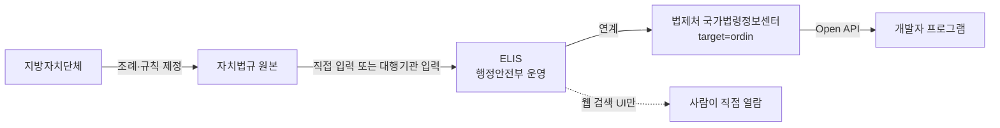

# 2장. 자치법규정보시스템 (ELIS)

> 공공 Open API 가이드북 — 1부. 규정·법률
> 확인 상태: 포털 연혁·핵심 기능 공식 페이지 직접 확인, 별도 Open API는 이번 조사에서 확인되지 않음(아래 2절에서 근거 제시)

| 항목 | 내용 |
|---|---|
| 제공기관 | 행정안전부 |
| 포털 주소 | https://www.elis.go.kr |
| 데이터 입력 주체 | 각 지방자치단체(일부는 한국법령정보원 등 외부 대행기관을 통해 입력) |
| 인증 방식 | 해당 없음(별도 Open API 미확인) |
| 활용 우선순위 | 낮음 — 프로그램 연동은 1장(법제처 `target=ordin`)으로 대체 |

---

### 0) 연결 고리 (Bridge)

1장에서 `target=ordin`이 자치법규(조례·규칙) 데이터를 제공한다는 걸 확인했습니다. 그런데 지자체 조례를 다루는 실무자라면 "자치법규"라는 말을 들었을 때 law.go.kr보다 먼저 **ELIS(elis.go.kr)**를 떠올리는 경우가 많습니다. 이 장은 그 이유(ELIS가 왜 지자체 실무의 표준 창구인지)와, 그럼에도 왜 **프로그램 연동은 ELIS가 아니라 1장의 API로 해야 하는지**를 함께 정리합니다.

---

## 1) 개념 정의 및 필요성

### 1.1 ELIS는 왜 별도로 존재하는가

**핵심 정의**: ELIS(자치법규정보시스템)는 전국 지방자치단체의 조례·규칙·훈령·예규 등 자치법규를 검색할 수 있는 행정안전부 운영 웹 포털입니다.

법제처의 `target=ordin`이 이미 자치법규 데이터를 API로 제공하는데, 왜 행정안전부가 ELIS라는 별도 시스템을 또 운영할까요? 답은 **관할 주체의 차이**에 있습니다. 법제처는 국가 법령 체계 전체(법률→시행령→시행규칙→행정규칙)를 관장하는 기관이고, 지방자치단체의 자치입법(조례·규칙)은 헌법과 지방자치법에 근거해 각 지자체가 스스로 제정하는 것으로, 행정안전부가 지방자치 행정을 총괄하는 부처로서 이 데이터를 별도로 관리합니다. 즉 **국가 법령과 자치법규는 원래 법적 체계와 관할 부처가 다른 두 갈래**이고, ELIS와 법제처 국가법령정보센터는 각자의 소관 부처가 운영하는 별개 시스템인데, 내용상 자치법규 부분만 법제처 쪽에도 연계되어 있는 구조로 이해하는 게 정확합니다.

### 1.2 연혁 — ELIS가 얼마나 오래됐는가

공식 안내에 따르면 ELIS의 데이터 구축은 **1997년**부터 시작됐습니다. "지방행정의 효율성을 높이고, 국민의 알권리 충족 등을 위한 행정서비스 수준을 향상시키고자" 지방자치단체의 행정 정책을 데이터베이스로 구축하기 시작해, 지금은 전국 지방자치단체가 공동으로 서비스하는 형태로 운영됩니다. 1장에서 확인한 국가법령정보센터(1998년 현행법령 인터넷 서비스 시작)와 거의 같은 시기에 출발한 셈입니다 — 1990년대 후반이 한국 행정 정보화의 한 전환점이었다는 걸 짐작할 수 있습니다.

### 1.3 데이터는 누가 입력하는가 — 실무에서 중요한 함의

ELIS의 자치법규 데이터는 각 지자체가 직접 입력하기도 하지만, **한국법령정보원(KLIS) 같은 외부 전문기관이 지자체를 대신해 자치법규를 입력·유지보수하는 대행 구조**가 실제로 운영되고 있는 것이 확인됩니다. 이런 대행 사업의 목적 중 하나가 "지역주민들이 알기 쉽게 이해할 수 있도록 자치법규를 정비"하는 것으로 명시되어 있습니다.

이 사실이 실무에 주는 함의는 분명합니다 — **자치법규 데이터의 등재 시점·정비 수준이 지자체마다 다를 수 있습니다.** 어떤 지자체는 즉시 입력하고 어떤 지자체는 대행기관의 작업 일정에 따라 지연될 수 있다는 뜻입니다. 여러 지자체의 조례를 한꺼번에 비교하는 프로젝트를 설계한다면, "왜 이 지자체 조례만 최신화가 안 됐지?"라는 의문이 들 때 이 구조를 먼저 떠올려야 합니다.

### 1.4 핵심 기능 — 무엇을 제공하는가

ELIS는 전국 시·도 및 시·군·구의 모든 자치법규를 한 곳에서 검색할 수 있는 통합 검색 서비스를 핵심 기능으로 제공합니다. 조례·규칙·훈령·예규의 구분을 명확히 표시하며, 각각 제정 주체와 적용 범위가 다르다는 점(예: 조례는 지방의회 의결이 필요하지만 규칙은 단체장이 제정)을 시민이 구분할 수 있게 돕는 것도 서비스 목적에 포함됩니다. 또한 자치입법의 법적 근거, 조례 제·개정범위, 조례 입법 및 지원 절차, **주민 조례 제정·개폐 청구제도** 안내까지 다루는 것으로 확인됩니다 — 이건 단순 검색 포털을 넘어, 주민이 직접 조례 제정을 청구할 수 있는 제도적 절차까지 안내하는 시민 참여 창구 역할도 겸하고 있다는 뜻입니다.

> **NOTE**: 앞서 확인한 대로 전국 자치법규는 약 17만 7천 건 수준으로 등재되어 있습니다(공식 페이지 기준, 시점 스냅샷). 1장에서 본 법제처 전체 규모(약 470만 건)의 상당 부분이 이 자치법규 데이터에서 나온다는 걸 짐작할 수 있습니다.

---

## 2) 핵심 원리 및 구조 — ELIS에 별도 Open API가 없다는 근거

이번 조사에서 ELIS 사이트에 개발자센터·Open API 메뉴가 있는지 직접 확인했으나 찾지 못했습니다. 대신 확인된 것은:

- ELIS의 핵심 기능은 **통합 검색(웹 UI)**으로 명시되어 있고, API·개발자·인증키 관련 메뉴는 공식 안내 어디에도 언급되지 않습니다.
- 반대로 법제처 Open API 목록에는 **자치법규 목록/본문 조회, 자치법규 연계 정보(상위법령 매핑), 자치법규 별표·서식, 모바일 자치법규**까지 세분화된 API가 이미 공식적으로 존재합니다(1장 6절에서 확인).

두 사실을 종합하면, **자치법규라는 "데이터"는 지자체와 행정안전부(ELIS)가 만들고 관리하지만, 그 데이터를 프로그램이 가져다 쓸 수 있는 "공식 API 창구"는 법제처가 별도로 구축해뒀다**는 그림이 됩니다. 이건 앞서 1장에서 본 "통합 구축 단계(2008년)"의 연장선으로 이해할 수 있습니다 — 법제처가 법령·행정규칙뿐 아니라 자치법규까지 통합 연계 서비스를 만들면서, 자치법규 데이터의 API 접근권까지 함께 가져간 것으로 추정됩니다.



> **WARNING**: 이 판단은 ELIS의 Open API 메뉴를 직접 찾지 못한 데 근거한 **관찰**이지, ELIS 운영기관이 "API를 제공하지 않는다"고 명시적으로 선언한 것을 확인한 건 아닙니다. 향후 ELIS 사이트에 개발자센터가 신설됐는지는 실제 구현 착수 시점에 한 번 더 확인하는 걸 권장합니다.

---

## 3) 코드 예제 및 실행 환경 — 1장 클라이언트를 자치법규 전용으로 확장

ELIS 자체에는 호출할 API가 없으므로, 이 절은 1장의 `LawApiClient`를 상속해 자치법규(`target=ordin`) 조회에 특화된 기능을 추가하는 형태로 구성합니다. 여러 지자체의 조례를 비교하는 실무 시나리오(4절)를 염두에 두고, 단일 조회가 아니라 **다건 비교 조회**까지 지원하도록 설계합니다.

```python
# ordin_client.py — 자치법규(target=ordin) 전용 클라이언트
# v1.0, Python 3.11+, requests 2.x
# NOTE: LawApiClient는 1장의 law_api/client.py를 그대로 사용(상속)
from law_api.client import LawApiClient
from law_api.exceptions import LawApiNotFoundError


class OrdinClient(LawApiClient):
    """자치법규(target=ordin) 조회에 특화된 클라이언트.

    1장의 공통 _get() 메서드를 그대로 재사용하고,
    target=ordin에 맞는 검색/본문조회 메서드만 추가한다.
    """

    def search_ordinances(self, query: str, region: str | None = None) -> list[dict]:
        """자치법규 목록 조회. region은 지자체명으로 결과를 후처리 필터링(서버 파라미터 미확인).

        WARNING: target=ordin 목록조회의 지자체별 필터 파라미터는
                 이번 조사에서 공식 확인하지 못했습니다. 서버가 별도
                 필터를 지원하지 않는다면, 응답을 받은 뒤 지자체명으로
                 클라이언트 측 필터링하는 이 방식이 대안이 됩니다.
        """
        params = {"OC": self._oc, "target": "ordin", "type": "JSON", "query": query}
        raw = self._get(self.BASE_SEARCH, params)
        items = raw.get("OrdinSearch", {}).get("law", [])  # 실제 키 구조는 응답 확인 후 조정 필요
        if not items:
            raise LawApiNotFoundError(f"'{query}' 자치법규 검색 결과 없음")
        if region:
            items = [item for item in items if region in item.get("지자체명", "")]
        return items

    def compare_across_regions(self, ordinance_name: str, regions: list[str]) -> dict[str, list[dict]]:
        """같은 이름의 조례를 여러 지자체에서 각각 검색해 딕셔너리로 반환.

        예) "주차장 설치 및 관리 조례"를 서울/부산/대구 각각에서 조회해
            2장 1.3절에서 설명한 "지자체별 등재 시점 차이"를 눈으로 확인할 때 사용.
        """
        results: dict[str, list[dict]] = {}
        for region in regions:
            try:
                results[region] = self.search_ordinances(ordinance_name, region=region)
            except LawApiNotFoundError:
                results[region] = []  # 미등재 지자체는 빈 목록으로 표시(1.3절의 등재 시차 확인용)
        return results
```

```python
# main.py 사용 예
if __name__ == "__main__":
    client = OrdinClient(oc="여기에_발급받은_OC값")
    comparison = client.compare_across_regions(
        "주차장 설치 및 관리 조례", regions=["서울특별시", "부산광역시", "대구광역시"]
    )
    for region, hits in comparison.items():
        status = f"{len(hits)}건" if hits else "미등재 또는 검색 결과 없음"
        print(f"{region}: {status}")
```

이 `compare_across_regions` 메서드는 단순 조회 예제가 아니라, **1.3절에서 설명한 "지자체별 등재 시차"를 실제로 관찰하는 도구**로 설계했습니다. 특정 지자체만 유독 검색 결과가 없다면, 그건 API 오류가 아니라 해당 지자체의 자치법규 정비·등재가 아직 진행 중일 가능성을 먼저 의심해야 합니다.

---

## 4) 실무 시나리오

- **지자체 조례를 다루는 프로젝트의 착수 순서**: ELIS 웹 검색으로 먼저 감을 잡고(어떤 조례명이 통용되는지, 지자체별로 명칭이 어떻게 다른지 확인) → 실제 수집·자동화는 1장의 `target=ordin` API로 진행.
- **여러 지자체 조례 비교 시 등재 시차를 먼저 점검**: 3절의 `compare_across_regions`처럼 비교 대상 지자체 전체를 한 번씩 훑어, 유독 결과가 없는 지자체가 있는지부터 확인합니다. 이걸 API 장애로 오인하면 안 됩니다.
- **주민 조례 청구제도와 연계한 서비스**: ELIS가 안내하는 "주민 조례 제정·개폐 청구제도" 정보를 참고해, 시민 대상 조례 발의 지원 서비스를 만들 때 ELIS의 웹 안내 콘텐츠(제도 설명)와 API의 실제 조례 데이터(1장)를 함께 활용할 수 있습니다.
- **ELIS 자체를 다시 조사해야 하는 시점**: 이번 조사에서 개발자센터를 못 찾았다고 해서 영구히 없다고 단정하지 말고, ELIS 관련 프로젝트를 시작할 때마다 한 번씩 재확인하는 걸 권장합니다(2절 WARNING 참고).

---

## 5) 트러블슈팅 & 주의사항

| 증상 | 원인 | 조치 |
|---|---|---|
| ELIS에서 검색되는 조례가 `target=ordin` API 응답에 없음 | 등재 시차(1.3절) 또는 커버리지 차이 가능성 | 실제 비교 검증 필요 — 확정된 사실 아님. 3절의 비교 도구로 여러 지자체·여러 시점에 재조회 |
| ELIS와 법제처에서 같은 조례의 조문 번호가 다르게 보임 | 제·개정 이력 반영 시점 차이 가능성 | 양쪽의 "최종 개정일"을 먼저 비교 |
| ELIS에 개발자센터가 안 보임 | 애초에 웹 검색 UI 중심으로 설계된 시스템 | 프로그램 연동은 처음부터 1장 API를 기본 경로로 설계 |

---

## 6) 한 줄 요약

> 💡 **Key Takeaway**: ELIS와 법제처는 "같은 데이터, 다른 창구"입니다 — 자치법규는 ELIS(행정안전부, 사람이 검색)와 법제처(`target=ordin`, 프로그램이 조회)라는 두 갈래로 서비스되며, 실무에서는 데이터를 지자체가 직접 입력하거나 대행기관을 통해 입력한다는 사실이 "왜 어떤 지자체 조례만 안 보이지?"라는 흔한 의문의 답이 됩니다.