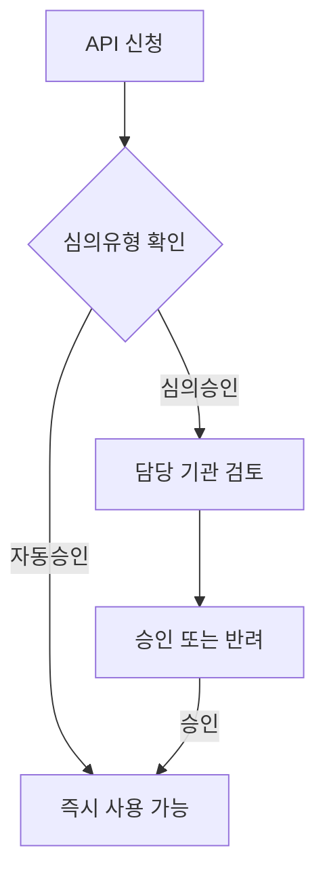

# 3장. 공공데이터포털 (data.go.kr)

> 공공 Open API 가이드북 — 2부. 공공기관·통합 정보 허브
> 확인 상태: 검색 API 공식 페이지 직접 확인, 게이트웨이 공통 에러코드 확인, 연혁·법적 근거는 위키백과·공식 위원회 소개 페이지 교차 확인, 개별 API 공통 파라미터 패턴은 다수 사례 교차 확인

| 항목 | 내용 |
|---|---|
| 제공기관 | 행정안전부(정책), 한국지능정보사회진흥원(NIA, 운영 지원) |
| 포털 주소 | https://www.data.go.kr |
| 법적 근거 | 「공공데이터의 제공 및 이용 활성화에 관한 법률」(약칭 공공데이터법) 제21조 |
| 인증 방식 | 회원가입 후 서비스키(`serviceKey`) 신청, 자동/심의 승인 혼재 |
| 비용 | 무료 (개발계정 기본 트래픽은 API마다 다름, 대부분 10,000/일) |
| 활용 우선순위 | 모든 프로젝트의 1차 탐색 창구 |

---

### 0) 연결 고리 (Bridge)

1장에서 법제처가 30년 가까운 데이터 축적의 산물이라는 걸 봤다면, 이 장은 그와 다른 종류의 역사를 가진 시스템입니다 — 법제처처럼 한 기관이 오랫동안 쌓아온 게 아니라, **2010년대 초 정부 전체의 정책 전환(정부 3.0, 공공데이터 개방)으로 한꺼번에 만들어진 "허브"**입니다. 이 차이가 왜 중요한지는 1.1절에서 다룹니다.

---

## 1) 개념 정의 및 필요성

### 1.1 공공데이터포털은 왜, 어떤 배경에서 만들어졌는가

**핵심 정의**: 공공데이터포털(data.go.kr)은 중앙부처·지자체·공공기관이 개방한 공공데이터와 Open API를 한곳에 모아 제공하는 행정안전부의 통합 플랫폼입니다.

이 포털의 연혁을 보면 성격이 명확해집니다.

- **2010년 6월** 당시 한국정보화진흥원(현 NIA)에 공공데이터활용지원센터가 설치됩니다 — 아직 법적 근거(공공데이터법)가 없던 시점에, 정책적으로 먼저 시작된 겁니다.
- **2011년 6월** data.go.kr이 구축되어 서비스를 시작합니다.
- **2013년 7월** 「공공데이터의 제공 및 이용 활성화에 관한 법률」(공공데이터법)이 제정되고 그해 10월 시행됩니다. 이때부터 공공데이터 개방이 정부의 재량이 아니라 **법적 의무**가 됩니다.
- **2013년 11월** 법에 근거해 공공데이터활용지원센터가 다시 설치되고, **12월**에는 민간위원을 50% 포함하는 공공데이터전략위원회가 발족해 범정부 컨트롤타워 역할을 맡습니다.

즉 1장의 법제처가 "한 기관이 자기 데이터를 꾸준히 쌓아온 결과물"이라면, 이 포털은 **"정부 전체가 한꺼번에 데이터를 내놓게 만든 법적·제도적 장치"**입니다. 그 결과 이 포털의 데이터 품질과 API 설계 방식은 기관마다 제각각일 수밖에 없습니다 — 법제처처럼 한 조직이 일관되게 설계한 게 아니라, 수백 개 기관이 각자 자기 데이터를 이 허브에 등록한 것이기 때문입니다. 이게 2.2절에서 설명할 "공통 패턴이 있지만 예외도 많다"는 현상의 근본 원인입니다.

### 1.2 왜 이 정책을 추진했는가

공식 위원회 소개에 따르면 목적은 "국민의 공공데이터 이용권을 보장하고, 혁신성장을 통한 일자리 창출 및 사회발전에 기여"하는 것으로 명시됩니다. 실제 성과도 국제적으로 확인됩니다 — 한국은 2019년 OECD 공공데이터 개방지수 1위, 2020년 UN 전자정부발전지수 2위, 그리고 OECD 디지털정부 평가에서도 1위를 기록한 것으로 관련 보도에서 확인됩니다. 이 가이드북에서 다루는 수많은 기관별 API(4부·5부·7부·8부 전체)가 사실상 전부 이 법과 정책의 산물이라고 봐도 됩니다 — **공공데이터법이 없었다면 이 책의 절반 이상이 존재하지 않았을 것**이라는 뜻입니다.

### 1.3 왜 필요한가 — 실무적 이유

"이런 데이터를 제공하는 공공 API가 있을까?"를 매번 구글링하는 대신, data.go.kr 자체의 **검색 API**를 호출하면 프로그램적으로 후보 API 목록을 얻을 수 있습니다. 이 가이드북의 다른 장들(4부 이후 대부분)도 실제로는 이 포털에 등재된 것들이 많습니다.

> **NOTE**: data.go.kr에는 "Open API"(실시간 REST 호출)와 "파일데이터"(다운로드 방식) 두 종류가 섞여 있습니다. 이 장은 Open API만 다룹니다.

---

## 2) 핵심 원리 및 구조

### 2.1 검색 API — 메타 검색 창구

| 항목 | 내용 |
|---|---|
| OpenAPI명 | 공공데이터활용지원센터_공공데이터포털 검색 서비스 |
| API 유형 | REST |
| 데이터 포맷 | JSON |
| 비용 | 무료 |
| 심의유형 | 개발단계 자동승인 / 운영단계 자동승인 |
| 신청 가능 트래픽 | 개발계정 10,000 |
| 설명(공식) | 공공데이터 포털에서 검색하는 키워드에 대한 메타데이터, 집계 수치를 제공 |

> **TIP**: 새 프로젝트를 시작할 때 이 API를 가장 먼저 호출해서 "이미 등재된 데이터가 있는지"부터 확인하는 습관을 들이면, 이후 장들에서 하는 개별 조사의 상당 부분을 줄일 수 있습니다. 실제로 이 가이드북을 쓰면서도, 새 기관을 조사하기 전에 먼저 이 포털에 등재 여부를 확인하는 순서를 거쳤습니다.

### 2.2 data.go.kr 공통 REST 패턴 — 왜 "대체로 비슷하지만 완전히 같지는 않은가"

1.1절에서 본 것처럼 이 포털은 수백 개 기관이 각자 자기 API를 등록한 곳입니다. 그런데도 상당수 API가 비슷한 파라미터 이름을 쓰는 이유는, 행정안전부가 **공공데이터 제공 표준**(API 응답 구조, 에러코드 등)을 가이드라인으로 제시하고, 대부분의 기관이 이 표준을 따르는 게이트웨이(`apis.data.go.kr`)를 거쳐 서비스하기 때문입니다. 다수 사례를 비교한 결과, 아래 파라미터/필드 이름이 기관을 가리지 않고 반복해서 등장합니다.

| 구분 | 이름 | 설명 |
|---|---|---|
| 요청 | `serviceKey` | 발급받은 인증키(URL Encode 필요) |
| 요청 | `pageNo` | 페이지 번호 (기본 1) |
| 요청 | `numOfRows` | 한 페이지 결과 수 |
| 응답 | `resultCode` | 결과코드 (정상은 보통 `00` 또는 `0`) |
| 응답 | `resultMsg` | 결과메시지 |
| 응답 | `totalCount` | 전체 결과 수 |

> **WARNING**: 이 패턴이 **모든** data.go.kr API에 100% 동일하게 적용되는 건 아닙니다(일부는 `numOfRows` 대신 `perPage`, `resultCode`가 `000`처럼 자릿수가 다른 경우 등 변형이 존재). "표준 가이드라인"이지 "강제 규격"이 아니기 때문에, 등록 시점이 오래된 API이거나 담당자가 표준을 엄격히 따르지 않은 경우 변형이 생깁니다. 새 API를 쓸 때는 항상 해당 API 상세페이지의 "요청변수(Request Parameter)"·"출력결과(Response Element)" 표를 개별 확인하십시오. 이 표는 "대체로 이런 모양이다"라는 출발점이지 고정 스펙이 아닙니다.

> **WARNING(URL 구조 함정)**: data.go.kr에 등재된 많은 API는 URL이 "서비스URL"과 "오퍼레이션 경로" 두 부분으로 나뉩니다. 예를 들어 11장(금융공공데이터)의 금융회사기본정보는 서비스URL이 `.../GetFnCoBasiInfoService`이지만, 실제로 호출 가능한 주소는 그 뒤에 `/getFnCoOutl` 같은 **구체적 기능명을 붙인 것**입니다. 오픈API 상세페이지에서 "서비스URL"만 보고 그대로 호출하면 404가 나는 흔한 실수이니, 반드시 "요청주소(Request URL)" 항목까지 함께 확인하십시오.

### 2.3 공통 에러코드 (게이트웨이 레벨, 공식 확인)

data.go.kr 게이트웨이(GW)를 통하는 API는 아래 에러코드를 공유합니다. 이건 2.2절과 달리 게이트웨이 자체가 처리하는 공통 인프라 레벨이라 예외 없이 적용됩니다.

| 코드 | 에러메시지 | 설명 |
|---|---|---|
| 01 | APPLICATION_ERROR | GW 내부 처리 오류 |
| 04 | HTTP_ERROR | 허용되지 않은 HTTP 요청 |
| 05 | SERVICETIMEOUT_ERROR | 응답 대기시간 초과 |
| 10 | INVALID_REQUEST_PARAMETER_ERROR | 파라미터 값/형식 오류 |
| 12 | NO_OPENAPI_SERVICE_ERROR | 존재하지 않거나 폐기된 서비스 |
| 20 | SERVICE_KEY_IS_NULL / PERMISSION_DENIED | 인증키 누락 또는 권한 거부 |
| 22 | LIMITED_NUMBER_OF_SERVICE_REQUESTS_EXCEEDS_ERROR | 일일 호출 허용량 초과 |
| 23 | LIMITED_NUMBER_OF_SERVICE_REQUESTS_PER_SECOND_EXCEEDS_ERROR | 초당 호출 허용량 초과 |
| 29 | BLACKLIST_IP_ACCESS_ERROR | 차단된 IP |
| 30 | SERVICE_KEY_IS_NOT_REGISTERED_ERROR | 미등록 인증키 |
| 31 | DEADLINE_HAS_EXPIRED_ERROR | 인증키 유효기간 만료 |

### 2.4 심의유형 — 왜 어떤 API는 바로 쓸 수 있고 어떤 건 못 쓰는가

data.go.kr의 API는 신청 즉시 쓸 수 있는 것(자동승인)과 담당자 검토를 거쳐야 하는 것(심의승인)으로 나뉩니다. 이건 데이터 성격에 따른 차이입니다 — 예를 들어 개인정보가 포함될 가능성이 있거나, 공공기관이 트래픽 관리가 필요하다고 판단한 데이터는 심의승인으로 분류됩니다. 3장 이후 이 책에서 다루는 대부분의 API는 자동승인이지만, 이 구분 자체를 모르고 있으면 "왜 이 API만 신청하고 며칠째 기다려야 하지"라는 상황에서 당황하게 됩니다.



---

## 3) 코드 예제 및 실행 환경

### 3.1 최소 탐색용 클라이언트

```python
# data_go_kr_client.py — 공공데이터포털 검색 API + 공통 패턴 헬퍼
# v1.0, Python 3.11+, requests 2.x
import time
import requests

SEARCH_URL = "https://api.odcloud.kr/api/uddi/v1/uddi:search"  # 실제 엔드포인트는 신청 후 마이페이지 명세서에서 재확인
SERVICE_KEY = "여기에_발급받은_serviceKey"  # .env 등에서 로드


def search_datasets(keyword: str, per_page: int = 20) -> dict:
    """공공데이터포털 등재 데이터셋/API를 키워드로 검색."""
    params = {"serviceKey": SERVICE_KEY, "keyword": keyword, "perPage": per_page}
    resp = requests.get(SEARCH_URL, params=params, timeout=10)
    resp.raise_for_status()
    return resp.json()


def call_generic_api(base_url: str, extra_params: dict, timeout: int = 10) -> dict:
    """data.go.kr 공통 패턴(serviceKey/pageNo/numOfRows)을 따르는 개별 API 호출 템플릿."""
    params = {"serviceKey": SERVICE_KEY, "pageNo": 1, "numOfRows": 10, **extra_params}
    resp = requests.get(base_url, params=params, timeout=timeout)
    resp.raise_for_status()
    return resp.json()
```

> **WARNING**: 위 `SEARCH_URL`은 data.go.kr 검색 API의 정확한 엔드포인트 URL을 이번 조사에서 직접 확인하지 못해 **추정치**입니다. 실제 사용 전 data.go.kr에서 해당 API(OpenAPI ID 15112888)를 신청한 뒤 마이페이지의 "Open API 명세 확인 가이드(Swagger)"에서 정확한 URL과 파라미터를 확인하십시오.

### 3.2 운영용 래퍼 — 에러코드를 도메인 예외로 매핑

2.3절의 공통 에러코드는 알아두는 것만으로는 부족하고, 실제 코드에서 각 코드에 맞는 대응(재시도할지, 즉시 실패시킬지)을 하도록 매핑해야 실무에서 쓸모가 있습니다.

```python
# datagokr/exceptions.py
class DataGoKrError(Exception):
    """공공데이터포털 게이트웨이 공통 예외."""


class DataGoKrRetryableError(DataGoKrError):
    """일시적 오류 — 재시도로 해결될 가능성이 있음(타임아웃, 초당 한도 초과 등)."""


class DataGoKrFatalError(DataGoKrError):
    """재시도해도 해결 안 되는 오류(잘못된 키, 폐기된 서비스, 일일 한도 초과 등)."""


# 게이트웨이 에러코드 → 예외 클래스 매핑 (2.3절 표 기반)
ERROR_CODE_MAP: dict[str, type[DataGoKrError]] = {
    "01": DataGoKrRetryableError,   # APPLICATION_ERROR
    "04": DataGoKrFatalError,       # HTTP_ERROR
    "05": DataGoKrRetryableError,   # SERVICETIMEOUT_ERROR
    "10": DataGoKrFatalError,       # INVALID_REQUEST_PARAMETER_ERROR
    "12": DataGoKrFatalError,       # NO_OPENAPI_SERVICE_ERROR
    "20": DataGoKrFatalError,       # SERVICE_KEY_IS_NULL / PERMISSION_DENIED
    "22": DataGoKrFatalError,       # 일일 한도 초과 — 오늘 재시도해도 소용없음
    "23": DataGoKrRetryableError,   # 초당 한도 초과 — 잠시 뒤 재시도하면 성공 가능
    "29": DataGoKrFatalError,       # BLACKLIST_IP_ACCESS_ERROR
    "30": DataGoKrFatalError,       # SERVICE_KEY_IS_NOT_REGISTERED_ERROR
    "31": DataGoKrFatalError,       # DEADLINE_HAS_EXPIRED_ERROR
}
```

```python
# datagokr/client.py
import time
import requests

from .exceptions import ERROR_CODE_MAP, DataGoKrError, DataGoKrRetryableError


class DataGoKrClient:
    """공공데이터포털 게이트웨이 공통 클라이언트.

    이 클래스 하나로 4부 이후 여러 장(KOSIS 외 다수)의 개별 API를
    거의 그대로 호출할 수 있다 — 2.2절 공통 패턴이 통하는 경우에 한해서다.
    """

    def __init__(self, service_key: str, timeout: int = 10, max_retries: int = 3) -> None:
        self._key = service_key
        self._timeout = timeout
        self._max_retries = max_retries

    def call(self, base_url: str, operation: str, extra_params: dict) -> dict:
        params = {
            "serviceKey": self._key,
            "pageNo": 1,
            "numOfRows": 10,
            "resultType": "json",
            **extra_params,
        }
        url = f"{base_url}/{operation}"

        for attempt in range(1, self._max_retries + 1):
            try:
                resp = requests.get(url, params=params, timeout=self._timeout)
                resp.raise_for_status()
                data = resp.json()
            except requests.exceptions.Timeout:
                if attempt == self._max_retries:
                    raise DataGoKrRetryableError(f"{self._max_retries}회 재시도 후에도 타임아웃")
                time.sleep(0.5 * attempt)
                continue

            result_code = self._extract_result_code(data)
            if result_code and result_code != "00":
                exc_cls = ERROR_CODE_MAP.get(result_code, DataGoKrError)
                if issubclass(exc_cls, DataGoKrRetryableError) and attempt < self._max_retries:
                    time.sleep(0.5 * attempt)
                    continue
                raise exc_cls(f"게이트웨이 오류 코드 {result_code}: {data}")

            return data

        raise DataGoKrError("재시도 한도 초과")

    @staticmethod
    def _extract_result_code(data: dict) -> str | None:
        """응답 구조가 API마다 달라 여러 경로를 시도한다(2.2절 WARNING 참고)."""
        # 흔한 두 가지 응답 구조를 순서대로 탐색
        header = data.get("response", {}).get("header", {})
        if "resultCode" in header:
            return header["resultCode"]
        return data.get("resultCode")
```

> **NOTE**: `_extract_result_code`가 두 가지 구조를 순서대로 탐색하는 이유가 바로 2.2절에서 설명한 "표준이지만 강제 규격은 아니다"라는 사실의 코드상 결과입니다. API마다 이 구조가 다를 수 있으므로, 실제 사용하는 API의 응답을 먼저 한 번 출력해보고 이 메서드를 조정해야 합니다.

**실행**
```powershell
python -m venv .venv
.venv\Scripts\activate
pip install requests
python data_go_kr_client.py
```

---

## 4) 실무 시나리오 (Best Practice)

### 4.1 새 프로젝트 착수 시 1순위 호출

"이 데이터, 공공데이터포털에 이미 있나?"를 항상 먼저 물어봅니다. 이 가이드북의 4부 이후 여러 장(KOSIS를 빼면 대부분)이 실제로 이 질문에서 출발해 찾아낸 것들입니다.

### 4.2 API 카탈로그 자동 구축

0장에서 언급한 전체 현황판을 사람이 손으로 채우지 않고, 이 검색 API 결과를 주기적으로 수집해 채우는 배치 작업으로 만들 수 있습니다. 다만 1.1절에서 확인했듯 수백 개 기관이 각자 등록한 데이터라 품질 편차가 크므로, 자동 수집한 카탈로그를 그대로 신뢰하지 말고 "심의유형", "최종 수정일" 같은 필드로 신뢰도를 걸러내는 로직을 추가하는 게 좋습니다.

### 4.3 공통 클라이언트 재사용

3.2절의 `DataGoKrClient`처럼 공통 패턴에 맞는 클라이언트 하나를 만들어두면, 이후 장(4부 이후)의 개별 API 상당수를 파라미터만 바꿔 재사용할 수 있습니다. 다만 2.2절의 WARNING처럼 이 패턴에서 벗어나는 API(경로 기반 URL을 쓰는 ECOS·서울시 등)는 애초에 이 클라이언트로 커버할 수 없다는 것도 함께 인지하고 있어야 합니다.

> **WARNING(안티패턴)**: 검색 API 결과에 나온 API가 전부 지금 당장 호출 가능하다고 가정하지 말 것. 2.4절에서 본 것처럼 심의유형이 "심의승인"인 API는 자동승인이 아니라 담당자 검토를 거치므로, 급한 일정이 걸린 프로젝트라면 이 승인 유형을 먼저 확인해야 합니다.

---

## 5) 트러블슈팅 & 주의사항

| 증상 | 원인 | 조치 |
|---|---|---|
| 에러코드 30(SERVICE_KEY_IS_NOT_REGISTERED) | 해당 API에 개별 활용신청을 안 함 | data.go.kr의 인증키는 계정당 발급되지만, API마다 **개별 활용신청**이 필요한 경우가 많음 |
| 에러코드 22/23 | 트래픽/초당 호출 한도 초과 | 22는 재시도해도 소용없음(당일 한도 소진, 다음 날 또는 증설 신청), 23은 잠시 뒤 재시도로 해결 가능 — 3.2절 코드처럼 둘을 구분해서 처리 |
| 파라미터 이름이 이 장의 공통표와 다름 | 2.2절은 "대체로"이지 고정 스펙이 아님 | 해당 API 개별 상세페이지 확인 |
| 신청했는데 며칠째 승인이 안 남 | 심의승인 유형 API를 자동승인으로 착각 | 신청 전 심의유형을 먼저 확인, 일정이 급하면 자동승인 API로 대안 검토 |
| `resultCode` 필드를 코드에서 못 찾음 | 응답 구조가 API마다 다름(`response.header.resultCode` vs 최상위 `resultCode`) | 실제 응답을 한 번 출력해서 구조 확인 후 파싱 로직 조정 |

---

## 6) 한 줄 요약

> 💡 **Key Takeaway**: 공공데이터포털은 데이터 하나하나를 뒤지는 곳이 아니라, **다른 API를 찾아주는 API**입니다. `serviceKey`/`pageNo`/`numOfRows`와 공통 에러코드는 "법이 만든 표준"이지 "기술이 강제한 규격"이 아니라는 걸 기억하면, 왜 예외가 그렇게 많은지도 납득이 됩니다.

---

## 부록 — 용어 사전

| 용어 | 정의 |
|---|---|
| 공공데이터법 | 「공공데이터의 제공 및 이용 활성화에 관한 법률」(2013년 10월 시행) — 이 포털의 법적 근거 |
| 공공데이터전략위원회 | 공공데이터 정책을 심의·조정하는 범정부 컨트롤타워(민간위원 50% 포함) |
| 게이트웨이(GW) | 여러 기관의 API를 표준화된 방식으로 중계하는 data.go.kr의 공통 인프라(`apis.data.go.kr`) |
| 심의승인 | 담당 기관의 검토를 거쳐야 승인되는 API 유형(자동승인과 대비) |
| serviceKey | data.go.kr에서 발급하는 공통 인증키 |