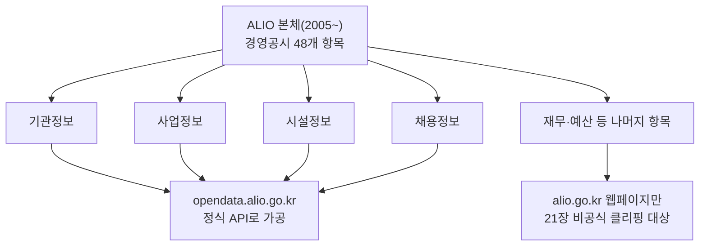

# 4장. ALIO 정식 Open API (기관·사업·시설·채용정보)

> 공공 Open API 가이드북 — 2부. 공공기관·통합 정보 허브
> 확인 상태: 포털 구조·카테고리·검색 필터 직접 확인, ALIO 본체의 연혁·법적 근거는 공식 소개 페이지 및 다수 독립 소스 교차 확인, 오픈API 세부 요청/응답 파라미터는 미확인(신청 후 재확인 필요)

| 항목 | 내용 |
|---|---|
| 제공기관 | 기획재정부 |
| 포털 주소 | https://opendata.alio.go.kr |
| 모기관 시스템 | ALIO 공공기관 경영정보 공개시스템(alio.go.kr) — 21장에서 별도로 다룸 |
| 인증 방식 | 회원가입 + 개별 API 활용신청 |
| 비용 | 무료 |
| 성격 | 4개 카테고리(기관/사업/시설/채용정보) — **경영공시·내부규정은 포함되지 않음** |

---

### 0) 연결 고리 (Bridge)

3장에서 "ALIO"라는 이름을 언급했는데, 실제로 조사해보니 이건 하나의 시스템이 아니라 **20년에 걸쳐 갈라진 두 개의 서로 다른 시스템**이었습니다. 원조는 2005년 만들어진 경영정보 공시 웹사이트(alio.go.kr, 21장에서 다룸)이고, 이 장에서 다루는 opendata.alio.go.kr은 그보다 훨씬 나중에, 개발자가 데이터를 API로 가져다 쓸 수 있게 별도로 만든 포털입니다. 이 역사를 알아야 "왜 도메인이 다른가", "왜 API가 경영공시 데이터를 다 못 가져오는가"가 납득됩니다.

---

## 1) 개념 정의 및 필요성

### 1.1 ALIO 본체의 역사 — 왜 이렇게 오래됐는가

이 장이 다루는 API를 이해하려면, 먼저 그 데이터의 원천인 ALIO 본체가 어떻게 만들어졌는지 알아야 합니다.

- **2005년 12월**: "공공기관 경영정보공개시스템(Pubmis)"이라는 이름으로 처음 개통됐습니다. 314개 공공기관의 재무·인사 등 20개 경영정보를 공개하는 게 목적이었습니다.
- **2006년 12월**: 시스템이 확대 개편되면서 지금의 "ALIO(All Public Information In-One)"라는 이름으로 바뀌었습니다. 직원 평균 보수, 기관장 업무추진비, 출자·출연 현황 등 국민 관심이 높은 7개 항목이 이때 추가됐습니다.
- **2007년**: 「공공기관의 운영에 관한 법률」(공운법)이 시행되면서, ALIO의 정보 공시가 **선택이 아니라 법적 의무**가 됩니다. 공운법 제12조가 공공기관에 최근 5년간의 주요 경영정보를 공시하도록 명시하고 있습니다 — 이게 지금까지 이어지는 ALIO의 법적 근거입니다.
- 이후 공시 항목은 꾸준히 늘어 2009년 33개, 2016년 39개, 2019년 42개를 거쳐 최근에는 48개 항목까지 세분화된 것으로 확인됩니다.
- **2015년**: 흥미롭게도 전자공시시스템(DART)식으로 전면 개편됐다는 기록이 있습니다 — 12장에서 다룰 금융감독원 OpenDART와 유사한 "정기공시/수시공시" 체계를 이때 ALIO도 받아들인 것으로 보입니다.
- **2024년 11월 기준**: 20년 가까이 운영되며 노후화된 시스템의 차세대 개편이 추진 중인 것으로 확인됩니다.

이 연혁에서 중요한 건, **ALIO가 처음부터 "API로 데이터를 내주는" 것을 목표로 설계되지 않았다는 점**입니다. 2005~2006년은 "국민이 웹페이지에서 눈으로 볼 수 있게" 하는 게 목표였던 시대입니다(1장 1.1절에서 본 법제처의 1998년 서비스 시작과 비슷한 시기의 발상입니다). 개발자가 프로그램으로 가져다 쓸 수 있는 API 계층은 훨씬 나중에, 아마도 3장에서 본 2010년대 공공데이터 개방 정책의 흐름을 타고 별도로 구축된 것으로 추정됩니다 — 그 결과물이 이 장에서 다루는 opendata.alio.go.kr입니다.

### 1.2 왜 도메인과 이름이 이렇게 다른가

**핵심 정의**: ALIO 오픈API(opendata.alio.go.kr)는 기획재정부가 공공기관의 **기관정보·사업정보·시설정보·채용정보** 4개 영역을 Open API로 제공하는 포털입니다. 공식 소개 문구상 "청년 일자리 지원 서비스"라는 이름으로 소개되고 있습니다.

1.1절의 연혁을 알면 이 이름이 왜 이런지 짐작할 수 있습니다 — 공공기관 채용정보에 대한 국민(특히 청년층)의 관심이 정책적으로 부각되던 시기에, ALIO 본체의 방대한 경영공시 데이터 중 **채용·기관·사업·시설 정보만 따로 떼어 개발자용 API로 가공**하면서 그 시기의 정책 의제(청년 일자리)를 이름에 반영한 것으로 보입니다(관찰, 명확한 명명 근거 문서는 확인하지 못함). 결과적으로 "ALIO"라는 이름의 인지도와 "opendata.alio.go.kr"이라는 실제 API 성격 사이에 괴리가 생겼고, 이게 이번 조사 초반에 ALIO를 하나의 시스템으로 오해했던 원인이었습니다.

**왜 필요한가**: 공공기관을 다루는 프로젝트(비교분석, 채용정보 수집, 기관 기초정보 매핑 등)에서 기관 목록·분류(기관유형·기관분류)를 매번 수작업으로 만들 필요 없이, 이 API로 표준화된 기관 마스터 데이터를 가져올 수 있습니다.

> **NOTE**: 실제 화면에서 "정보통신산업진흥원"을 포함한 공공기관 목록이 기관유형(공기업/준정부기관/기타공공기관 등)·기관분류(SOC/금융/산업진흥정보화 등) 기준으로 필터링 가능한 것을 직접 확인했습니다. 이 분류 체계(기관유형)는 1.1절에서 본 공운법의 공공기관 분류 체계와 동일한 것으로, 법률상 분류가 API 필터에도 그대로 반영된 겁니다.

---

## 2) 핵심 원리 및 구조

### 2.1 4개 카테고리 — 확인된 메뉴 구조

| 카테고리 | 목록 조회 페이지(웹) |
|---|---|
| 채용정보 | `/new/odaApiMng/recrutInquiryList.do` |
| 시설정보 | `/new/odaApiMng/fcltInquiryList.do` |
| 사업정보 | `/new/odaApiMng/bizInquiryList.do` |
| 기관정보 | `/new/odaApiMng/instInquiryList.do` |

메뉴는 `오픈API 찾기`(위 4개 조회) → `오픈API 신청`(`/new/odaApiUserInqDataMng/openApiRecrutDetail.do`) 순서로 구성되어 있습니다. 이 4개 카테고리가 1.1절에서 본 48개 경영공시 항목 전체가 아니라는 걸 기억해야 합니다 — **경영공시 48개 항목 중, 개발자 API로 가공된 건 이 4갈래뿐**입니다. 재무정보·예산정보 같은 나머지 항목은 API가 아니라 웹페이지(21장에서 다루는 비공식 클리핑 대상)로만 접근 가능합니다.



> **NOTE — 기관 내부규정을 확인해야 한다면 이 장이 아니라 21장입니다.** 이 장의 4개 카테고리(기관/사업/시설/채용정보)에는 정관·인사규정·복무규정 같은 **내부규정이 포함되지 않습니다.** 공공기관의 내부규정 원문(HWP/PDF)은 ALIO 본체(alio.go.kr)의 경영공시 화면에만 게시되며, 이 장에서 다루는 정식 API로는 접근할 수 없습니다. 이미 21장에서 이 규정 데이터를 확인하기 위해 별도로 조사한 내용이 있습니다 — `alio.go.kr/download/rulefiledown.json?fileNo=` 엔드포인트가 실제로 규정 조문 텍스트를 반환하는 것까지 확인했고, 수집·원문보관·구조화·비교 4단계로 나눈 수집 아키텍처까지 설계해뒀습니다. 공공기관 규정이 목적이라면 이 장을 더 파고들 게 아니라 **바로 21장으로 이동**하는 게 맞습니다.

### 2.2 사업정보 검색 필터 (실제 화면에서 확인)

| 필터 | 값 예시 |
|---|---|
| 기관유형 | 공기업(시장형) / 공기업(준시장형) / 기타공공기관 / 준정부기관(기금관리형) / 준정부기관(위탁집행형) |
| 기관분류 | SOC / 고용보건복지 / 금융 / 기타 / 농림수산환경 / 문화예술외교법무 / 산업진흥정보화 / 에너지 / 연구교육 |
| 기관 | 개별 기관명 전체 목록 (정보통신산업진흥원 포함 확인) |
| 사업분야(대/중/소) | 건강/공공안전/교육연구/국가인프라/기타/문화생활/사회복지/산업진흥/생활환경/취업·직업/해외남북교류 |
| 생애주기 | 아동청소년/어르신/영유아/중장년/청년/해당없음 |
| 서비스 분류 | 교육상담/사업지원/생활정보/시설지원/정책뉴스/평가발급 |

> **WARNING**: 이건 **웹 화면의 검색 필터**이지, 이 필터 이름이 그대로 실제 Open API의 요청 파라미터명과 같다는 보장은 없습니다. 실제 파라미터명은 "오픈API 신청" 후 발급되는 명세서에서 확인해야 합니다(이번 조사에서 미확인).

### 2.3 인증 절차 (확인된 흐름)


### 2.4 채용정보는 data.go.kr에도 별도 등재됨 (실제 근거 확보)

이번 재조사에서 중요한 사실을 확인했습니다 — 채용정보 API는 opendata.alio.go.kr 전용이 아니라, **공공데이터포털(data.go.kr)에도 별도로 등재**되어 있습니다.

| 항목 | 내용 |
|---|---|
| OpenAPI명 | 재정경제부_공공기관 채용정보 조회서비스(제공기관명이 기획재정부의 구 명칭으로 등록되어 있음에 유의) |
| API 유형 | REST |
| 데이터 포맷 | JSON+XML |
| 개발계정 트래픽 | 1,000 |
| 심의유형 | 개발단계 자동승인 / 운영단계 심의승인 |
| 설명(공식) | 기획재정부가 운영하는 공공기관 경영정보 공개시스템을 기반으로 전국 공공기관의 채용현황을 실시간 수집 — 채용공고 제목·접수기간·채용직무·인원·전형단계·접수방법 등 제공 |

공식 보도자료에서도 "민간에서는 올인원 서비스(opendata.alio.go.kr, **www.data.go.kr**)를 통해 실시간 업데이트되는 채용정보 데이터를 신청 즉시 제공받을 수 있다"고 명시합니다 — 즉 **두 경로가 병행 운영**됩니다.

> **TIP**: 이 발견이 실무적으로 중요한 이유는, data.go.kr에 등재된 API는 **3장에서 확인한 공통 패턴(`ServiceKey`/`pageNo`/`numOfRows`, `resultCode`/`resultMsg`)을 따를 가능성이 매우 높다**는 데 있습니다. opendata.alio.go.kr 자체 포털에서 파라미터를 알아내려 애쓰는 대신, **data.go.kr에서 "공공기관 채용정보"로 검색해 이 API를 먼저 신청하는 경로가 더 빠르고 확실할 수 있습니다.** 기관정보·사업정보·시설정보도 이 사례처럼 data.go.kr에 별도 등재되어 있는지 같은 방식으로 검색해보는 걸 권장합니다.


## 3) 코드 예제 및 실행 환경

### 3.1 채용정보 — data.go.kr 경로 (확인된 공통 패턴 적용, 권장)

2.4절에서 확인한 대로, 채용정보는 data.go.kr에 등재된 API로 접근하는 게 더 확실합니다. 3장의 공통 패턴을 그대로 적용합니다.

```python
# alio_recruit_datagokr_client.py — 채용정보(data.go.kr 경로)
# v1.0, Python 3.11+, requests 2.x
import requests

BASE_URL = "http://apis.data.go.kr/1051000/recruitment"  # 실제 서비스 경로는 신청 후 명세서에서 확인
SERVICE_KEY = "여기에_발급받은_serviceKey"


def search_recruitments(page_no: int = 1, num_of_rows: int = 10) -> dict:
    """공공기관 채용정보 조회 (3장 공통 패턴: ServiceKey/pageNo/numOfRows)."""
    params = {
        "ServiceKey": SERVICE_KEY,
        "pageNo": page_no,
        "numOfRows": num_of_rows,
        "resultType": "json",
    }
    resp = requests.get(BASE_URL, params=params, timeout=10)
    resp.raise_for_status()
    return resp.json()


if __name__ == "__main__":
    print(search_recruitments())
```

> **WARNING**: `BASE_URL`의 정확한 경로는 이번 조사에서 확정하지 못했습니다. data.go.kr에서 "공공기관 채용정보 조회서비스"를 신청한 뒤 마이페이지 명세서에서 정확한 엔드포인트로 교체하십시오. 다만 요청 파라미터 이름(`ServiceKey`/`pageNo`/`numOfRows`)은 3장의 공통 패턴 확인 사례가 많아 신뢰도가 상대적으로 높습니다.

### 3.2 나머지 카테고리(기관·사업·시설정보) — opendata.alio.go.kr 자체 경로 뼈대

기관·사업·시설정보도 채용정보처럼 data.go.kr에 별도 등재되어 있는지는 이번 조사에서 개별 확인하지 못했습니다. 우선 opendata.alio.go.kr 자체 신청 경로를 가정한 뼈대를 제공하되, **실제 착수 시 가장 먼저 할 일은 3장 검색 API로 "기관정보"·"사업정보"·"시설정보"가 data.go.kr에도 등재되어 있는지 확인하는 것**입니다(2.4절과 같은 패턴을 기대할 수 있음).

세부 요청 파라미터가 미확인 상태이므로, 이 절은 신청 후 채워야 할 골격만 제공합니다. 다만 설계 원칙은 구체적으로 잡아둡니다 — 2.1절에서 본 4개 카테고리를 각각 독립된 메서드로 분리해, 나중에 실제 파라미터를 알게 됐을 때 한 메서드씩 채워 넣을 수 있게 합니다.

```python
# alio_open_api_client.py — 카테고리별로 분리된 뼈대
# v0.1, Python 3.11+
"""
NOTE: opendata.alio.go.kr의 실제 REST 엔드포인트 URL과 요청 파라미터명은
      이번 조사에서 확인하지 못했습니다. "오픈API 신청" 완료 후 발급되는
      명세서를 기준으로 각 메서드의 BASE_URL과 params를 채우십시오.
"""
import requests


class AlioOpenApiClient:
    """opendata.alio.go.kr 클라이언트 — 카테고리별 메서드로 분리.

    4개 카테고리(기관/사업/시설/채용)는 서로 다른 신청·인증키를 요구할
    가능성이 있으므로(2.3절 인증 절차가 카테고리별로 개별 진행됨),
    카테고리마다 별도 API 키를 주입받는 구조로 설계한다.
    """

    def __init__(self, api_keys: dict[str, str], timeout: int = 10) -> None:
        # 예: {"institution": "키A", "business": "키B", "facility": "키C", "recruit": "키D"}
        self._api_keys = api_keys
        self._timeout = timeout

    def search_institutions(
        self, inst_type: str | None = None, inst_category: str | None = None
    ) -> dict:
        """기관정보 조회. 2.2절 필터(기관유형·기관분류) 대응."""
        url = "https://opendata.alio.go.kr/api/..."  # 신청 후 정확한 값으로 교체
        params = {"apiKey": self._api_keys.get("institution")}
        if inst_type:
            params["instType"] = inst_type
        if inst_category:
            params["instCategory"] = inst_category
        resp = requests.get(url, params=params, timeout=self._timeout)
        resp.raise_for_status()
        return resp.json()

    def search_business(self, field: str | None = None, life_cycle: str | None = None) -> dict:
        """사업정보 조회. field=사업분야, life_cycle=생애주기(2.2절 필터 대응)."""
        url = "https://opendata.alio.go.kr/api/..."  # 신청 후 정확한 값으로 교체
        params = {"apiKey": self._api_keys.get("business")}
        if field:
            params["bizField"] = field
        if life_cycle:
            params["lifeCycle"] = life_cycle
        resp = requests.get(url, params=params, timeout=self._timeout)
        resp.raise_for_status()
        return resp.json()

    def search_recruitment(self, inst_name: str | None = None) -> dict:
        """채용정보 조회 — 1.2절에서 본 이 포털의 원래 정책 취지에 가장 가까운 기능."""
        url = "https://opendata.alio.go.kr/api/..."  # 신청 후 정확한 값으로 교체
        params = {"apiKey": self._api_keys.get("recruit")}
        if inst_name:
            params["instNm"] = inst_name
        resp = requests.get(url, params=params, timeout=self._timeout)
        resp.raise_for_status()
        return resp.json()
```

> **WARNING**: 위 코드의 URL·파라미터명은 전부 추정 골격입니다. 실제 신청 후 반드시 명세서 기준으로 교체하십시오. 다만 "카테고리별 API 키를 분리해서 관리한다"는 **구조 자체**는 2.3절에서 확인한 인증 절차(카테고리마다 신청)에 근거한 것이라 미리 이렇게 설계해두는 게 안전합니다.

---

## 4) 실무 시나리오

- **기관 마스터 데이터 확보**: 공공기관 비교 프로젝트의 기관 목록·분류 체계를 이 API의 기관정보로 표준화. 1.2절에서 확인했듯 이 분류는 공운법의 법정 분류와 일치하므로, 다른 법령 기반 데이터(예: 1장의 법제처 `target=pi`)와 연동할 때도 분류 기준이 어긋나지 않습니다.
- **채용정보 모니터링**: 특정 분야 공공기관 채용공고를 주기적으로 수집하는 파이프라인의 원천으로 활용 — 이 포털이 원래 "청년 일자리 지원"이라는 목적으로 만들어졌다는 걸 생각하면 가장 자연스러운 용도입니다.
- **4장과 21장의 역할 분리**: 이 장(4장)은 기관·사업·시설·채용정보용, 21장은 경영공시·내부규정용 — 하나의 "ALIO 클라이언트"로 묶기보다 목적이 다른 별도 모듈로 관리하는 걸 권장합니다. 2.1절의 다이어그램처럼, 같은 뿌리(ALIO 본체)에서 나온 서로 다른 두 갈래라는 걸 코드 구조에도 반영하는 게 좋습니다.

---

## 5) 트러블슈팅 & 주의사항

| 증상 | 원인 | 조치 |
|---|---|---|
| "ALIO API로 내부규정·재무정보도 가져올 수 있겠지"라는 가정 | 4장과 21장 혼동, 또는 48개 공시항목 중 4개만 API화됐다는 사실을 모름(2.1절) | 4장은 기관/사업/시설/채용만 제공. 나머지 항목은 21장 참고 |
| 실제 엔드포인트를 몰라서 코드가 작동 안 함 | 이번 조사에서 미확인 | 2.1절의 4개 목록 페이지에서 원하는 항목을 찾아 "오픈API 신청" 진행 후 명세서 확인 |
| 카테고리 하나만 신청했는데 다른 카테고리 호출이 안 됨 | 인증키가 카테고리별로 분리돼 있을 가능성(2.3절) | 필요한 카테고리마다 개별 신청 여부 확인 |

---

## 6) 한 줄 요약

> 💡 **Key Takeaway**: "ALIO"라는 하나의 이름 아래, 2005년부터 이어진 경영공시 웹사이트(alio.go.kr, 21장)와 그중 4개 항목만 개발자용으로 가공한 API 포털(opendata.alio.go.kr, 이 장)이라는 **서로 다른 두 세대의 시스템**이 공존합니다. "청년 일자리 지원 서비스"라는 이름은 후자가 만들어질 당시의 정책 의제를 반영한 것으로 보입니다.