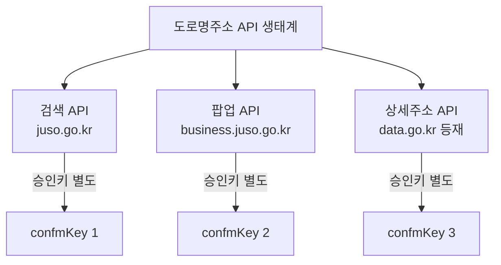

# 6장. 도로명주소 API

> 공공 Open API 가이드북 — 3부. 행정 공통 인프라
> 확인 상태: 검색 API 요청/응답 파라미터 공식 페이지 직접 확인, 주소체계 연혁은 다수 독립 소스(위키백과·나무위키·언론보도) 교차 확인

| 항목 | 내용 |
|---|---|
| 제공기관 | 행정안전부 (주소생활공간과) |
| 포털 주소 | https://www.juso.go.kr (개발자센터), https://business.juso.go.kr (팝업/연계 API) |
| 법적 근거 | 도로명주소법 |
| 인증 방식 | 회원가입 → 승인키(`confmKey`) 신청 |
| 비용 | 무료 |
| 활용 우선순위 | 주소 정규화가 필요한 모든 프로젝트에 공통 |

---

### 0) 연결 고리 (Bridge)

3부는 "특정 분야가 아니라 여러 프로젝트에 공통으로 필요한 행정 인프라"를 모아둔 부입니다. 그 첫 번째가 주소입니다 — 사람이 입력한 주소를 표준 도로명주소로 정규화하는 건 공공기관 규정 프로젝트든 여행 프로젝트든 반복해서 마주치는 문제입니다. 그런데 이 API 뒤에는 이 가이드북의 다른 어떤 시스템보다 오래되고 논쟁적인 역사가 있습니다.

---

## 1) 개념 정의 및 필요성

### 1.1 거의 30년이 걸린 주소체계 전환

**핵심 정의**: 도로명주소 안내시스템(juso.go.kr)은 행정안전부가 운영하는 도로명주소 표준 데이터베이스이며, 별도 DB 구축 없이 실시간으로 주소를 검색·정규화할 수 있는 Open API를 제공합니다.

이 API가 다루는 "도로명주소"라는 체계 자체가, 한국의 다른 어떤 공공데이터보다 긴 준비 기간을 거쳐 만들어졌습니다.

- **원래 지번주소의 기원**: 지금까지 쓰이던 지번(땅 번호) 기반 주소체계는 일제강점기 토지조사사업의 산물입니다. 원래 조선에서 쓰이던 통·호 중심의 집 주소체계 대신, 토지 소유·과세 목적의 지번을 주소로 강제한 것이 그 시작입니다.
- **1948년, 1969년**: 광복 이후 일제식 주소 잔재를 없애려는 시도가 있었지만, 전국적 개편 비용 부담 때문에 실패했습니다.
- **1995~1996년**: 도로명주소 시범사업이 시작됩니다. 1996년 국가경쟁력강화위원회가 "OECD를 포함한 세계 대부분 국가(심지어 북한도)가 도로명주소를 쓰고 있다"는 이유로 국제 표준에 맞는 도로명주소 도입을 결정합니다.
- **1997년~2010년 10월**: 무려 13년에 걸쳐 전국에 도로명판·건물번호판 같은 주소 시설물을 설치합니다.
- **2006년**: 「도로명주소 등 표기에 관한 법률」이 제정됩니다(현재의 도로명주소법). 이때부터 법적 근거가 생깁니다.
- **2009년**: 초기 시행에서 여러 문제(도로명 부여를 둘러싼 지역·역사성 논란 등)가 드러나자 법이 전면 개정되고, 행정자치부가 통일된 기준으로 전국 단위 2차 사업에 들어갑니다.
- **2011년 7월 29일**: 도로명주소가 지번주소와 함께 쓸 수 있는 **법정 주소**로 공식 인정됩니다.
- **2014년 1월 1일**: 우여곡절 끝에(원래 2012년 시행 예정이었으나 준비 부족으로 2년 연기) 도로명주소가 전면 시행됩니다. 이때부터 토지대장을 제외한 모든 공적 문서에서 도로명주소만 사용하도록 못박습니다.

즉 1995년 시범사업부터 2014년 전면시행까지 **정확히 19년**이 걸린 사업입니다. 총 사업비는 약 4천억 원으로 보도된 바 있고, 정부는 연간 3조 4천억 원의 사회경제적 효과를 기대한다고 밝힌 바 있습니다(둘 다 특정 시점 보도 기준 수치로, 최신 평가와 다를 수 있습니다).

### 1.2 왜 이 역사가 실무에 중요한가

이 긴 전환 과정은 지금도 실무에 흔적을 남기고 있습니다.

- **지번주소가 완전히 사라진 게 아닙니다.** 부동산 거래 등 토지 관련 문서는 지금도 지번주소를 씁니다. 그래서 6절의 코드를 짤 때 "도로명주소만 받으면 된다"고 가정하면 안 되고, 여전히 지번주소 입력을 함께 처리해야 하는 경우가 많습니다.
- **2011~2013년 병행 사용 기간에 만들어진 데이터**는 시스템에 따라 지번·도로명이 혼재되어 있을 수 있습니다. 오래된 데이터베이스를 다루는 프로젝트라면 이 시기 데이터의 정합성을 의심해봐야 합니다.
- **도로명 부여 자체가 정치적으로 민감했던 지역이 있습니다**(역사성 훼손 논란 등). 이런 지역은 도로명이 이후에도 바뀔 가능성이 있으므로, 캐싱 전략을 짤 때 도로명주소를 "영구 불변값"으로 가정하지 않는 게 안전합니다.

> **NOTE**: `api.juso.go.kr`(구 버전)은 현재 서비스 종료 상태이며, `www.juso.go.kr`(도로명주소 안내시스템)로 통합됐음을 확인했습니다. 오래된 블로그 글을 참고할 때는 이 구버전 URL을 쓰지 않도록 주의가 필요합니다 — 이것도 1.1절에서 본 것처럼 이 시스템이 오랜 세월 여러 차례 개편을 거쳤다는 증거입니다.

### 1.3 왜 필요한가

지번주소/도로명주소가 혼재된 입력값을 표준화하거나, 주소로부터 행정구역코드·우편번호 등 구조화된 정보를 얻어야 하는 모든 프로젝트에 공통으로 필요합니다.

---

## 2) 핵심 원리 및 구조

### 2.1 검색 API — 전체 파라미터 확인 완료

| 요청변수 | 타입 | 필수 | 기본값 | 설명 |
|---|---|---|---|---|
| confmKey | String | Y | - | 신청 시 발급받은 승인키 |
| currentPage | Integer | Y | 1 | 현재 페이지 번호 |
| countPerPage | Integer | Y | 10 | 페이지당 결과 수 |
| keyword | String | Y | - | 주소 검색어 |
| resultType | String | N | xml | 결과형식(xml, json) |
| hstryYn | String | N | N | 변동된 주소정보 포함 여부 |
| firstSort | String | N | none | 정렬(none=정확도순, road=도로명 우선, location=지번 우선) |
| addInfoYn | String | N | N | 확장 출력항목(hstryYn, relJibun, hemdNm) 제공 여부 |

**응답 필드**: `common`(totalCount, currentPage, countPerPage, errorCode, errorMessage) + `juso`(roadAddr, roadAddrPart1, roadAddrPart2, jibunAddr, engAddr, zipNo, admCd, rnMgtSn 등)

> **TIP**: `hstryYn=Y`가 1.2절에서 설명한 "지번-도로명 혼재 데이터" 문제를 실제로 해결해주는 파라미터입니다. 오래된 주소 데이터를 다루는 프로젝트라면 처음부터 이 옵션을 켜두는 걸 권장합니다.

> **TIP**: 호출방식은 JSONP를 포함한 xml/json을 지원합니다. Java 구버전이나 TLS1.2 미지원 환경에서는 http:// 사용이 안내되어 있으니, 운영 환경에서는 HTTPS 지원 여부를 먼저 점검하십시오.

### 2.2 팝업 API — 화면 내장형

| 항목 | 내용 |
|---|---|
| 주소 | https://business.juso.go.kr/addrlink/openApi/popupApi.do |
| 방식 | 검색창을 팝업으로 띄워 사용자가 직접 주소를 선택 |
| 출력변수(발췌) | roadFullAddr, roadAddrPart1/2, jibunAddr, engAddr, zipNo, siNm, sggNm, emdNm, liNm, rn, udrtYn, buldMnnm, buldSlno |

> **WARNING**: 팝업 API 전용 승인키가 별도로 필요합니다. 검색 API 승인키(`confmKey`)를 팝업 API에 그대로 쓰면 "승인되지 않은 KEY 입니다" 오류가 발생하는 것으로 공식 안내에 명시되어 있습니다.

### 2.3 상세주소(동/층/호) API — data.go.kr 등재 확인

행정안전부가 data.go.kr에 별도로 "실시간 상세주소정보 조회(검색API)"를 등재해뒀습니다. 입력: 승인키, 행정구역코드, 도로명코드, 지하여부(0=지상/1=지하), 건물본번, 건물부번, 동층호 검색유형(dong/floorho), 결과형식(xml/json).



---

## 3) 코드 예제 및 실행 환경

```python
# juso_client.py — 도로명주소 검색 API 클라이언트
# v1.0, Python 3.11+, requests 2.x
import requests

SEARCH_URL = "https://www.juso.go.kr/addrlink/addrLinkApi.do"  # 실제 호출 URL은 신청 후 가이드에서 재확인 권장
CONFM_KEY = "여기에_발급받은_승인키"


def search_address(
    keyword: str, current_page: int = 1, count_per_page: int = 10, include_history: bool = True
) -> dict:
    """주소 검색. keyword에 지번/도로명/건물명 등 자유 입력 가능.

    1.2절에서 설명한 지번-도로명 혼재 문제 때문에, 기본값으로
    include_history=True(hstryYn=Y)를 사용해 변동 이력까지 포함해 검색한다.
    """
    params = {
        "confmKey": CONFM_KEY,
        "currentPage": current_page,
        "countPerPage": count_per_page,
        "keyword": keyword,
        "resultType": "json",
        "hstryYn": "Y" if include_history else "N",
    }
    resp = requests.get(SEARCH_URL, params=params, timeout=10)
    resp.raise_for_status()
    return resp.json()


if __name__ == "__main__":
    result = search_address("세종특별자치시 도움5로 20")
    print(result)
```

> **NOTE**: `SEARCH_URL`은 개발자센터 문서 기준으로 옮긴 값이며, 실제 신청 완료 후 발급 화면에 표시되는 정확한 엔드포인트로 교체해 사용하십시오.

**실행**
```powershell
python -m venv .venv
.venv\Scripts\activate
pip install requests
python juso_client.py
```

---

## 4) 실무 시나리오

- **내부규정/공공기관 데이터의 소재지 정규화**: 1부·2부에서 다룬 기관 데이터의 주소 필드를 이 API로 표준화해 지도 표시(7부 VWorld)와 연동.
- **회원가입·배송지 입력 폼**: 팝업 API로 사용자 입력 부담을 줄이고 표준 주소를 확보.
- **행정구역코드 기반 통계 결합**: 검색 결과의 `admCd`(행정구역코드)를 4부 KOSIS·SGIS의 지역코드와 매칭해 지역 통계와 결합.
- **오래된 레거시 DB 정비**: 2011~2013년 병행 사용 시기에 저장된 주소 데이터를 정비하는 프로젝트라면, `hstryYn=Y`로 변동 이력을 조회해 과거 지번주소를 현재 도로명주소로 일괄 매핑하는 배치 작업을 설계할 수 있습니다.

---

## 5) 트러블슈팅 & 주의사항

| 증상 | 원인 | 조치 |
|---|---|---|
| "승인되지 않은 KEY 입니다" | 검색 API 승인키를 팝업 API에 사용 | API별로 별도 승인키 발급 필요(2.3절 다이어그램 참고) |
| 구버전 `api.juso.go.kr` 예제 코드가 작동 안 함 | 서비스 종료 | `www.juso.go.kr`/`business.juso.go.kr` 기준 최신 문서로 재작성 |
| 결과에 원하는 건물이 없음 | 최신 주소 반영 지연, 또는 지번-도로명 변동 이력 미포함 | `hstryYn=Y`로 변동 이력 포함 검색 시도 |
| 오래된 데이터의 주소가 이상하게 매칭됨 | 1.2절에서 설명한 2011~2013년 병행기 데이터 혼재 가능성 | 해당 시기 데이터는 지번·도로명 모두로 재검색해 교차검증 |
| 도로명이 갑자기 바뀐 걸 발견함 | 1.2절에서 설명한 도로명 변경 이력(역사성 논란 지역 등) | 도로명주소를 영구 불변값으로 캐싱하지 말고, 주기적 재검증 로직 포함 |

---

## 6) 한 줄 요약

> 💡 **Key Takeaway**: 도로명주소 API는 검색(주소 정규화)과 팝업(UI 내장)이 **승인키를 공유하지 않는 별도 서비스**입니다. 그리고 이 API가 다루는 주소체계 자체가 19년에 걸쳐 만들어진 만큼, "주소는 한 번 정하면 안 변한다"는 가정을 코드에 심지 않는 게 안전합니다.