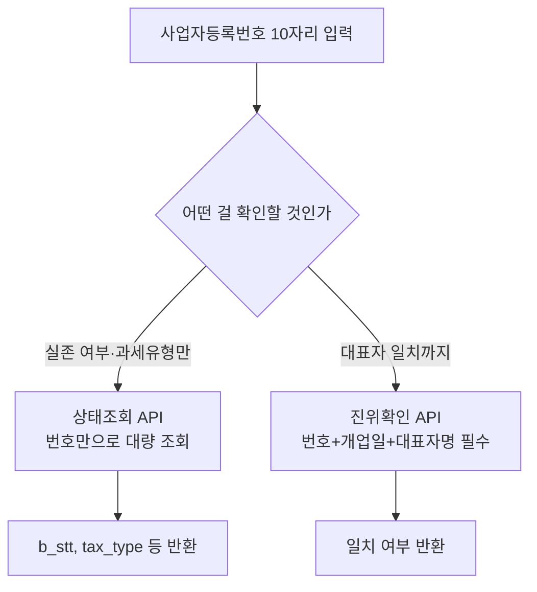

# 7장. 국세청 사업자등록정보 진위확인·상태조회 API

> 공공 Open API 가이드북 — 3부. 행정 공통 인프라
> 확인 상태: 공식 data.go.kr 페이지 확인 + 다수의 독립적인 개발자 문서·언론보도에서 요청/응답 스키마 및 도입 배경 교차 확인

| 항목 | 내용 |
|---|---|
| 제공기관 | 국세청 (부가가치세과) |
| 신청 경로 | 공공데이터포털(data.go.kr), OpenAPI ID 15081808 |
| 실제 호출 엔드포인트 | `api.odcloud.kr` (공공데이터포털 게이트웨이) |
| 법적 근거 | 부가가치세법 제8조(사업자등록), 시행령 제12조(등록번호 부여) |
| 서비스 개통일 | 2020년 7월 29일 |
| 인증 방식 | data.go.kr serviceKey |
| 비용 | 무료 — 1회 100건, 1일 100만건 제한 |
| 활용 우선순위 | 거래처·공급업체 검증이 필요한 모든 프로젝트 |

---

### 0) 연결 고리 (Bridge)

6장의 주소 정규화에 이어, 이 장은 "사업자등록번호가 실제로 유효한가"를 검증하는 공통 인프라입니다. 그런데 이 API는 이 가이드북에서 다루는 것 중 흥미로운 타이틀을 하나 갖고 있습니다 — **국세청이 자기 공공데이터를 오픈API로 내놓은 최초의 서비스**입니다. 국세청처럼 보수적인 데이터를 다루는 기관이 왜, 어떤 계기로 이걸 만들었는지가 1절의 핵심입니다.

---

## 1) 개념 정의 및 필요성

### 1.1 사업자등록번호란 무엇인가 — 법적 근거부터

이 API를 이해하려면 먼저 "사업자등록번호"라는 것 자체가 뭔지 알아야 합니다. 부가가치세법 **제8조**에 따라, 사업자는 사업장마다 **사업 개시일로부터 20일 이내**에 관할 세무서장에게 등록해야 합니다. 등록번호는 시행령 제12조에 근거해 사업장마다 부여되며(사업자 단위 과세를 신청한 경우는 예외), **10자리(×××-××-×××××)** 구조를 갖습니다 — 앞 3자리가 세무서 코드, 가운데 2자리가 개인/법인 구분, 마지막 5자리가 일련번호와 검증코드입니다. 즉 사업자등록번호는 단순한 식별자가 아니라, **번호 자체에 발급 세무서와 사업자 유형 정보가 인코딩되어 있는 구조화된 코드**입니다.

### 1.2 이 API는 왜, 언제, 어떤 계기로 만들어졌는가

사업자등록번호 제도 자체는 오래됐지만, 이걸 실시간으로 검증할 수 있는 API는 비교적 최근인 **2020년 7월 29일**에 개통됐습니다. 당시 언론 보도를 보면 도입 배경이 상당히 구체적입니다.

- **직접 계기**: 온라인 중고거래 사기와 허위 매물, 온라인 플랫폼에서 공급사업자 정보를 확인하기 어렵다는 점을 악용한 사례가 많았습니다. 마침 코로나19로 온라인 거래가 급증하던 시기와 맞물려 필요성이 커졌습니다.
- **정책적 계기**: "디지털 뉴딜"의 일환으로 행정안전부와 국세청이 협업해 "적극행정"으로 추진한 사업으로 소개됩니다.
- **법 개정과의 연계**: 개통 시점 보도에서 "다음 달부터 시행되는 개정 부가가치세법에 따라 일부 간이과세자에 세금계산서 발행 의무가 생긴다"는 점이 언급됩니다 — 즉 이 API는 우연히 나온 게 아니라, **간이과세자 세금계산서 발행 의무화라는 실제 법 개정 시행과 시점을 맞춰 준비된 인프라**였습니다.
- **의미**: 당시 보도는 이걸 "국세청이 공공데이터를 오픈API로 제공하는 최초의 서비스"라고 명시합니다. 국세 정보는 성격상 민감도가 높아 공개에 보수적이었던 기관이라는 걸 감안하면, 이 API의 등장 자체가 하나의 정책적 전환점이었다고 볼 수 있습니다.

### 1.3 두 기능으로 나뉜 이유

서비스가 "진위확인"과 "상태조회" 둘로 나뉜 것도 우연이 아닙니다. 도입 당시 국세청 담당자 설명에 따르면:

- **상태조회**는 사업자등록번호만 입력하면 대량으로 한꺼번에 조회할 수 있게 설계됐습니다. 그전까지 홈택스에서는 **건별 조회만 가능**했는데, 이게 이 API의 실질적 개선점입니다.
- **진위확인**은 반대로 더 엄격합니다. 사업자등록번호·대표자성명·개업일자 3가지가 필수이고, 상호·주업태·주종목 등 5가지 선택 항목까지 입력할 수 있습니다. "이 사업자가 실존하는가"를 확인하는 상태조회보다, "이 사람이 이 사업자의 대표자가 맞는가"까지 확인하는 게 목적이라 더 많은 정보를 요구합니다.

> **NOTE**: 데이터는 국세청 등록정보와 **30분 주기로 업데이트**되며, 신규 개업자는 반영까지 1~2일 소요될 수 있음이 공식 안내에 명시되어 있습니다. 1.2절에서 본 "대량 실시간 조회"라는 목적을 생각하면, 완전한 실시간이 아니라 30분 지연이 있다는 걸 배치 작업 설계 시 감안해야 합니다.

---

## 2) 핵심 원리 및 구조

### 2.1 엔드포인트 (다수 독립 출처 교차 확인)

| 기능 | 메서드 | URL |
|---|---|---|
| 상태조회 | POST | `https://api.odcloud.kr/api/nts-businessman/v1/status?serviceKey=...` |
| 진위확인 | POST | `https://api.odcloud.kr/api/nts-businessman/v1/validate?serviceKey=...` |

> **WARNING**: 대부분의 공공데이터포털 API가 GET 방식인 것과 달리, 이 API는 **POST + JSON body** 방식입니다. `serviceKey`는 URL 쿼리스트링에, 실제 조회 대상은 body에 담습니다 — 이 비대칭 구조를 혼동하지 않도록 주의하십시오.

### 2.2 요청 본문(Body)

**상태조회** — 1.3절에서 본 "대량 조회" 목적에 맞게 배열로 여러 건을 한 번에 요청합니다.
```json
{"b_no": ["1234567890", "0987654321"]}
```
- `b_no`: 사업자등록번호 10자리(하이픈 제거), 최대 100개까지 배열로 한 번에 조회

**진위확인** — 1.3절에서 본 "대표자 일치 여부" 목적에 맞게 필수 3항목을 요구합니다.
```json
{
  "businesses": [
    {"b_no": "1234567890", "start_dt": "20200101", "p_nm": "홍길동"}
  ]
}
```
- 필수: `b_no`, `start_dt`(YYYYMMDD, 개업일자), `p_nm`(대표자명)
- 선택: 대표자명2(외국인 한글명), 상호명, 법인등록번호 등

### 2.3 응답 구조 (상태조회, 실제 응답 확인)

```json
{
  "request_cnt": 1,
  "match_cnt": 1,
  "status_code": "OK",
  "data": [
    {
      "b_no": "1234567890",
      "b_stt": "계속사업자",
      "b_stt_cd": "01",
      "tax_type": "부가가치세 일반과세자",
      "tax_type_cd": "01",
      "end_dt": "",
      "utcc_yn": "N",
      "tax_type_change_dt": "",
      "invoice_apply_dt": "",
      "rbf_tax_type": "해당없음",
      "rbf_tax_type_cd": "99"
    }
  ]
}
```

> **NOTE**: 형식은 유효하지만 국세청에 등록되지 않은 번호를 조회해도 **오류가 아니라 정상 응답**으로 옵니다(`tax_type`에 "국세청에 등록되지 않은 사업자등록번호입니다" 같은 메시지가 담김). 이 케이스를 예외로 처리하지 말고 정상 분기로 다뤄야 합니다.

> **TIP**: 응답의 `tax_type`(과세유형)이 1.2절에서 본 "간이과세자 세금계산서 발행 의무화"와 직결되는 필드입니다. 거래 상대방이 간이과세자인지 일반과세자인지에 따라 세금계산서 발행 의무가 달라지므로, B2B 거래 검증 로직에서는 이 필드를 반드시 분기 조건으로 써야 합니다.



---

## 3) 코드 예제 및 실행 환경

```python
# nts_business_client.py — 국세청 사업자등록정보 API 클라이언트
# v1.0, Python 3.11+, requests 2.x
"""
timeout/retry는 예시를 위해 최소화했습니다. 운영 전환 시 재시도·예외매핑을 추가하십시오.
"""
import requests

BASE_URL = "https://api.odcloud.kr/api/nts-businessman/v1"
SERVICE_KEY = "여기에_발급받은_serviceKey"  # URL Encode된 키를 그대로 사용


def check_status(business_numbers: list[str], timeout: int = 10) -> dict:
    """사업자등록 상태조회 (최대 100건). 1.3절에서 본 '대량 조회' 목적에 맞춘 배치용 함수."""
    url = f"{BASE_URL}/status"
    resp = requests.post(
        url,
        params={"serviceKey": SERVICE_KEY},
        json={"b_no": business_numbers},
        headers={"Content-Type": "application/json"},
        timeout=timeout,
    )
    resp.raise_for_status()
    return resp.json()


def validate_business(
    b_no: str, start_dt: str, p_nm: str, timeout: int = 10
) -> dict:
    """사업자등록정보 진위확인 (번호+개업일자+대표자명 일치 여부)."""
    url = f"{BASE_URL}/validate"
    payload = {"businesses": [{"b_no": b_no, "start_dt": start_dt, "p_nm": p_nm}]}
    resp = requests.post(
        url,
        params={"serviceKey": SERVICE_KEY},
        json=payload,
        headers={"Content-Type": "application/json"},
        timeout=timeout,
    )
    resp.raise_for_status()
    return resp.json()


def is_simplified_taxpayer(status_result: dict) -> bool:
    """2.3절 TIP — 간이과세자 여부를 판별해 세금계산서 발행 의무 분기에 활용."""
    for item in status_result.get("data", []):
        if "간이과세자" in item.get("tax_type", ""):
            return True
    return False


if __name__ == "__main__":
    result = check_status(["1234567890"])
    print(result)
    print("간이과세자 여부:", is_simplified_taxpayer(result))
```

**실행**
```powershell
python -m venv .venv
.venv\Scripts\activate
pip install requests
python nts_business_client.py
```

---

## 4) 실무 시나리오

- **거래처 등록 자동검증**: 신규 거래처 등록 시 사업자번호를 이 API로 먼저 검증한 뒤 저장 — 1.2절에서 본 도입 취지(온라인 거래 사기 방지) 그대로의 활용입니다.
- **일괄 정리**: 보유 중인 사업자번호 목록을 100건 단위로 배치 조회해 휴폐업 여부를 주기적으로 갱신. 다만 30분 업데이트 주기(1.3절 NOTE)를 감안해 너무 잦은 배치는 의미가 없습니다.
- **세금계산서 발행 의무 자동 판별**: `tax_type`으로 간이과세자 여부를 판별해, 1.2절에서 본 법 개정(간이과세자 세금계산서 발행 의무화)에 맞춰 거래 시스템의 발행 로직을 자동 분기.
- **5부(금융·기업) 연계**: OpenDART·금융공공데이터에서 기업을 식별할 때, 이 API로 사업자 상태를 먼저 필터링해 폐업 기업을 걸러낼 수 있음.

---

## 5) 트러블슈팅 & 주의사항

| 증상 | 원인 | 조치 |
|---|---|---|
| GET으로 호출했는데 오류남 | 이 API는 POST 전용 | body에 JSON을 담아 POST로 호출 |
| 존재하지 않는 사업자번호인데 200 응답이 옴 | 정상 동작(오류 아님) | `tax_type`/`status_code` 값으로 판별 |
| 1일 한도 초과 | 100만건/일 제한 초과 | 배치 스케줄 분산, 트래픽 증설 신청 |
| 방금 개업한 사업자가 조회 안 됨 | 국세청 등록 후 API 반영까지 1~2일 소요(1.3절) | 신규 사업자는 며칠 뒤 재조회 안내 |
| 간이과세자 판별 로직이 특정 시점부터 틀림 | 법 개정으로 과세유형 체계가 바뀌었을 가능성 | `tax_type_cd`(코드값) 기준으로 판별 로직을 만들고, 코드 체계 변경 공지를 주기적으로 확인 |

---

## 6) 한 줄 요약

> 💡 **Key Takeaway**: 이 API는 data.go.kr의 다른 대부분 API와 달리 **POST + JSON body** 방식이며, 미등록 번호도 오류가 아니라 정상 응답으로 옵니다. 그리고 이 API가 2020년 온라인 거래 사기 방지와 간이과세자 세금계산서 의무화라는 구체적 정책 계기로 태어났다는 걸 알면, `tax_type` 필드 하나가 왜 이렇게 중요하게 다뤄지는지도 이해됩니다.