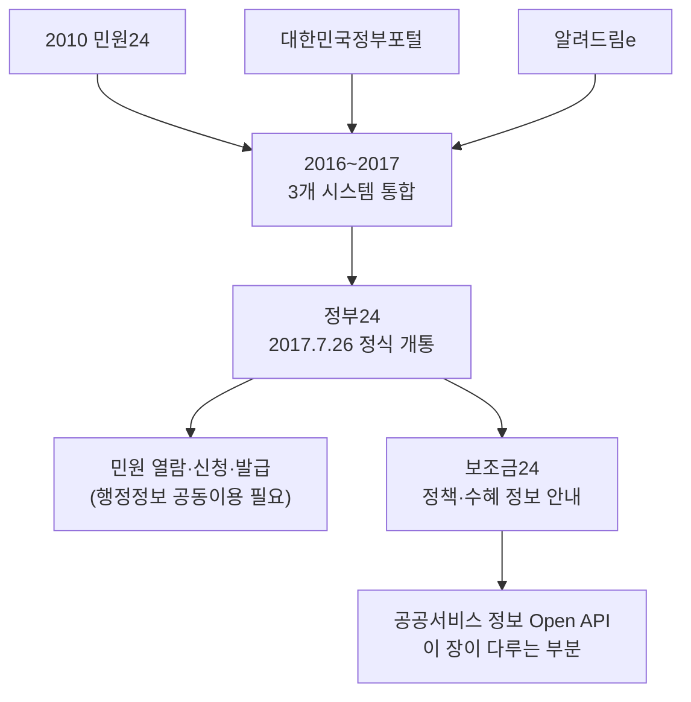

# 8장. 정부24 공공서비스 Open API (보조금24)

> 공공 Open API 가이드북 — 3부. 행정 공통 인프라
> 확인 상태: 정부24 연혁 다수 독립 소스(위키백과·나무위키·언론보도·공식 앱스토어 설명) 교차 확인, 공공서비스 정보 API는 공식 공지사항 직접 확인, **v3 이후 추가 개편 여부를 2026년 9월 기준으로 재확인 — 새 공지 없음, 단 "혜택알리미"로 명칭 변경 정황 발견(1.2절)**

| 항목 | 내용 |
|---|---|
| 제공기관 | 행정안전부 |
| 신청 경로 | 공공데이터포털(data.go.kr), 검색어 "대한민국 공공서비스" |
| 실제 호출 엔드포인트 | `api.odcloud.kr/api/gov24/v3/*` (2025.6.13 공지 기준, v1에서 이동 확인) |
| 정부24 서비스 개통일 | 2017년 7월 26일(시범: 3월 27일) |
| 인증 방식 | data.go.kr serviceKey |
| 비용 | 무료 |
| 활용 우선순위 | 정책·복지 서비스 정보를 다루는 프로젝트 |

---

### 0) 연결 고리 (Bridge)

지난 조사표에서 "정부24 API, 보조금24 약 7,500개 서비스"라는 수치를 미확인으로 남겨뒀는데, 이번에 직접 확인해보니 **실제로 존재하는 정식 개발자용 API**였습니다. 이 장에서는 정부24가 왜 이렇게 여러 시스템을 합쳐 만들어졌는지부터 짚고, 그 안에서 이 API가 정확히 어느 부분을 담당하는지 좁혀 들어갑니다.

---

## 1) 개념 정의 및 필요성

### 1.1 정부24는 몇 개의 시스템이 합쳐진 것인가

**핵심 정의**: 정부24는 대한민국 정부가 운영하는 인터넷 정부 서비스 통합 포털이며, 중앙부처·지자체·공공기관의 행정서비스를 한곳에서 제공합니다.

이름과 달리 정부24는 처음부터 하나의 시스템이 아니었습니다. 연혁을 보면:

- **2010년부터**: "민원24"(minwon.go.kr)라는 정부민원포털이 별도로 운영되고 있었습니다.
- **2016년**: 행정자치부가 민원24, 대한민국정부포털, 알려드림e(e-알리미) — 흩어져 있던 **3개 시스템을 통합**하는 1단계 사업을 시작합니다. 목적은 명확합니다 — "각 기관이 개별적으로 정부 서비스를 제공함에 따른 국민 불편"을 없애는 것.
- **2017년 3월 27일**: "정부24"라는 새 이름으로 시범운영이 시작됩니다.
- **2017년 7월 26일**: 서울역 대합실에서 개통식을 열고 정식 서비스를 시작합니다.
- **2020년**: 공공기관 온라인 서비스 1,594개 중 이용률이 높은 282개를 정부24에서 바로 이용할 수 있게 확대할 계획이 발표됩니다.
- **2020년 11월 5일**: 10년간 병행 운영되던 "민원24"가 완전히 서비스를 종료하고 정부24로 일원화됩니다. 기존 민원24 회원은 약관 동의만으로 자동 전환됐습니다.

즉 정부24는 "새로 만든 서비스"가 아니라 **여러 낡은 시스템을 하나로 합치고, 옛 이름(민원24)을 10년에 걸쳐 서서히 퇴장시킨 통합 프로젝트**입니다. 지금도 앱스토어 설명을 보면 "정부24(구 민원24)"라는 표기가 남아있을 정도로, 이 통합의 흔적이 완전히 사라지지는 않았습니다.

### 1.2 그 안에서 "보조금24"는 어떤 위치인가 — 그리고 "혜택알리미"로 이름이 바뀌는 중

"행정안전부_대한민국 공공서비스 정보"는 정부24가 제공하는 중앙부처·지자체·공공기관·교육청의 국민 수혜 서비스(보조금24) 정보를 Open API로 공개한 것입니다. 정부24 공식 소개에 따르면 보조금24는 "여러 행정기관의 웹사이트나 창구를 방문할 필요 없이 정부에서 제공하는 각종 수혜서비스(현금·현물 등)를 개인맞춤형으로 안내하는 서비스"입니다.

> **NOTE(진행 중인 명칭 변경)**: 재조사 중 이 서비스의 이름이 **"보조금24"에서 "혜택알리미"로 바뀌고 있는 정황**을 확인했습니다. 정부24 최신 공식 페이지들은 이제 "정부혜택(혜택알리미)"라는 명칭을 쓰고, data.go.kr에 등록된 데이터셋 제목도 "대한민국 공공서비스 정보 (혜택알리미)"로 되어 있습니다(옛 이름 "보조금24"는 부제로만 남아있음). 다만 API 자체의 엔드포인트 경로(`/gov24/...`)나 오퍼레이션명은 이 명칭 변경과 무관하게 유지되는 것으로 보입니다 — **브랜드명만 바뀌고 기술 스펙은 그대로**인 사례로 보이니, 검색할 때는 "보조금24"와 "혜택알리미" 두 키워드를 모두 시도하는 게 안전합니다.

1.1절의 통합 역사를 생각하면, 보조금24는 정부24라는 큰 통합 포털 **안에서도 한 번 더 특화된 하위 서비스**입니다 — 정부24 전체가 "정부 서비스 전반"을 다룬다면, 보조금24는 그중 "국민이 받을 수 있는 금전·현물 혜택"만 따로 떼어 개인 맞춤형으로 안내하는 영역입니다. **2022년 3월 11일부터 지자체 서비스가 추가**되며 총 7,500여 개 서비스가 공공데이터포털을 통해 제공된다고 행정안전부가 공식 공지한 바 있습니다(시점 스냅샷, 현재 수치는 재확인 권장).

---

## 2) 핵심 원리 및 구조

### 2.1 정부24의 두 가지 서로 다른 체계 — 반드시 구분

| 구분 | 성격 | 대상 | 접근 방식 |
|---|---|---|---|
| **공공서비스 정보 Open API(보조금24)** | 진짜 공개 API | 누구나 | data.go.kr 회원가입 → serviceKey 발급 → 즉시 호출 |
| **행정정보 공동이용** | 기관 간 데이터 연계 | 승인된 공공·금융기관 등 | 별도 협약·심사 필요, 일반 개발자 셀프서비스 아님 |

> **WARNING**: "정부24 API"라는 말만 듣고 주민등록등본·가족관계증명 같은 개인 행정정보까지 자유롭게 가져올 수 있다고 오해하면 안 됩니다. 그건 행정정보 공동이용 영역이며, 이 장이 다루는 건 **공공서비스(정책/혜택) 정보**입니다. 1.1절에서 본 것처럼 정부24 자체가 "민원 열람·신청·발급"과 "정책·서비스 안내"라는 서로 다른 기능이 통합된 포털이라는 걸 생각하면, 이 두 갈래가 왜 접근 방식부터 다른지도 납득됩니다 — 전자는 개인정보가 결부된 민원 처리이고, 후자는 누구나 알아도 되는 제도 정보이기 때문입니다.



### 2.2 API 오퍼레이션 — 개편 이력 확인 (v1 → v3까지 진행 중)

공식 공지에 따르면 이 API는 **여러 차례** 개편을 거쳤습니다. 처음 알려진 것보다 더 최근에 또 한 번 바뀐 것을 이번 재조사에서 확인했습니다.

| 시기 | 오퍼레이션 |
|---|---|
| 개편 전(~2021.09.15 이전) | 공공서비스 목록/상세/분류, 기관 분류코드, 기관코드 (5종, `/gov24/v1/list` 등) |
| 2021.09.15 이후(v1) | `serviceList`(목록), `serviceDetail`(상세정보), `supportConditions`(지원조건) — 3종 |
| **2025.6.13 이후(v3)** | 동일 3개 오퍼레이션이 **v3 경로**로 이동, `serviceDetail`에 [공무원확인 구비서류]·[본인확인필요 구비서류] 항목 추가 |

```
v1(구): https://api.odcloud.kr/api/gov24/v1/serviceList
v3(현재 확인된 최신): https://api.odcloud.kr/api/gov24/v3/serviceDetail  (공지에서 명시적으로 확인)
```

> **WARNING**: 이 책의 이전 버전과 여러 개발 블로그가 `/gov24/v1/...` 경로를 쓰고 있지만, **최소한 serviceDetail은 2025년 6월 13일 이후 v3 경로로 이동**한 것이 공식 공지로 확인됩니다. v1 → v2 → v3 중 정확히 언제 v2가 있었는지, 그리고 serviceList·supportConditions도 함께 v3로 이동했는지는 이번 조사에서 완전히 확정하지 못했습니다 — **실제 사용 전 data.go.kr의 최신 공지사항(NOTICE)을 반드시 확인**하고, v1이 동작하지 않으면 v3로 먼저 시도해보십시오.

### 2.3 serviceDetail 응답의 실제 필드명 (공식 확인)

공공서비스 상세정보 API가 실제로 반환하는 필드명 일부가 확인됩니다: `정책소개`(Policy introduction), `정책목적`(Policy Purpose), `유의사항`(Precautions), `첨부파일`, `지원대상`(Support target), `지원대상자제외기준`, `대상특성`, `대상특성코드` 등 — 필드명이 영문 매핑과 함께 제공되며, 대부분 최대 4000자 가변문자형(VARCHAR)입니다. 2025년 6월 개편으로 `공무원확인 구비서류`·`본인확인필요 구비서류` 필드가 추가됐습니다.

### 2.4 제공 범위 확대 이력

2021년 9월 중앙행정기관 서비스로 시작 → 2021년 말 지방자치단체 서비스 추가 → 2022년 3월 11일 공식 발표된 지자체 확대 → 2022년 말 공공기관/민간단체 서비스까지 순차 확대된 것으로 공식 확인됩니다. 1.1절에서 본 "정부24 자체도 2016~2020년에 걸쳐 서서히 통합됐다"는 패턴이, 그 하위 서비스인 보조금24 API에서도 "중앙부처→지자체→공공기관" 순으로 똑같이 반복되고 있다는 게 흥미롭습니다.

---

## 3) 코드 예제 및 실행 환경

```python
# gov24_client.py — 정부24 공공서비스(보조금24) Open API 클라이언트
# v1.0, Python 3.11+, requests 2.x
import requests

BASE_URL = "https://api.odcloud.kr/api/gov24/v3"  # 2025.6.13 공지 기준. 동작 안 하면 v1로 폴백 시도
SERVICE_KEY = "여기에_발급받은_serviceKey"


def list_services(page: int = 1, per_page: int = 10) -> dict:
    """공공서비스 목록 조회."""
    resp = requests.get(
        f"{BASE_URL}/serviceList",
        params={"serviceKey": SERVICE_KEY, "page": page, "perPage": per_page},
        timeout=10,
    )
    resp.raise_for_status()
    return resp.json()


def get_service_detail(service_id: str) -> dict:
    """공공서비스 상세정보 조회. service_id는 목록 응답에서 획득."""
    resp = requests.get(
        f"{BASE_URL}/serviceDetail",
        params={"serviceKey": SERVICE_KEY, "servId": service_id},
        timeout=10,
    )
    resp.raise_for_status()
    return resp.json()


if __name__ == "__main__":
    print(list_services())
```

> **WARNING**: 위 파라미터명(`page`/`perPage`/`servId`)은 data.go.kr의 일반적인 관례를 따라 추정한 것이며, 이번 조사에서 `serviceDetail`/`supportConditions`의 정확한 요청 파라미터 명세까지는 직접 확인하지 못했습니다. 신청 후 Swagger 명세로 재확인하십시오.

---

## 4) 실무 시나리오

- **정책 추천 서비스**: 생애주기·상황별 정부 혜택을 자동 매칭하는 서비스의 원천 데이터.
- **정책 리서치 자동화**: 0장에서 언급한 "정책·이슈 리서치 자동화" 파이프라인에 이 API를 결합해 신규/변경된 공공서비스를 모니터링.
- **행정정보 공동이용이 필요한 경우**: 이 장의 API로는 안 되므로, 해당 업무를 담당하는 기관(예: 행정안전부 행정정보공동이용센터)에 별도 협의 필요 — 이 가이드북의 범위 밖입니다.

---

## 5) 트러블슈팅 & 주의사항

| 증상 | 원인 | 조치 |
|---|---|---|
| "정부24 API로 개인 행정정보를 가져오려 했는데 안 됨" | 행정정보 공동이용과 혼동 | 이 장의 API는 정책/서비스 정보용. 개인정보 연계는 별도 체계(2.1절) |
| 예제 코드의 `/list`, `/details` 경로가 작동 안 함 | 2021.09.15 폐기된 구버전 오퍼레이션 | `serviceList`/`serviceDetail`/`supportConditions`로 교체 |
| v1 경로(`/gov24/v1/...`)로 호출했는데 실패하거나 필드가 다름 | 2025.6.13 이후 v3로 이동(2.2절) | `/gov24/v3/...`로 우선 시도, 안 되면 data.go.kr 최신 공지 확인 |
| 지자체 서비스가 안 보임 | 구버전 API 사용 중, 또는 2022년 3월 이전 데이터 기준 | 2022년 3월 이후 개편판 API 사용 확인 |
| "민원24"라는 이름으로 검색해서 자료를 못 찾음 | 2020년 11월 서비스 종료(1.1절) | 정부24(gov.kr) 기준으로 최신 자료 검색 |

---

## 6) 한 줄 요약

> 💡 **Key Takeaway**: "정부24 API"는 하나가 아니라 **공개된 공공서비스(보조금24) 정보 API**와 **제한된 행정정보 공동이용**, 두 가지를 가리킬 수 있는 말입니다. 이 가이드북이 다루는 건 전자뿐이며, 이건 2016~2020년에 걸쳐 여러 시스템을 통합해온 정부24 전체 역사의 가장 최근 갈래에 해당합니다.