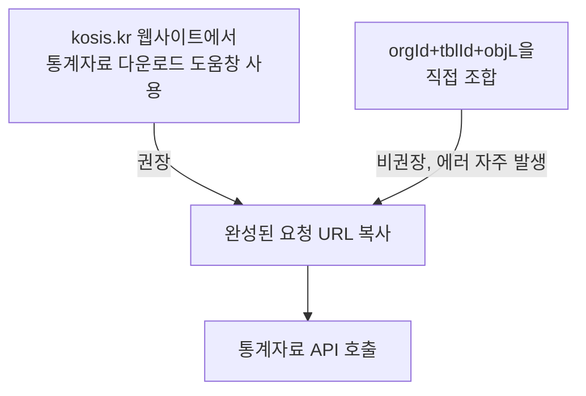

# 9장. KOSIS 국가통계포털

> 공공 Open API 가이드북 — 4부. 통계·거시경제
> 확인 상태: 공식 개발가이드·연혁 페이지 직접 확인 + 다수의 독립 라이브러리(R, Python)에서 파라미터 교차 확인

| 항목 | 내용 |
|---|---|
| 제공기관 | 국가데이터처(옛 통계청) / 한국통계정보원 |
| 포털 주소 | https://kosis.kr/openapi |
| 서비스 시작일 | 2007년 7월 2일(웹 서비스 기준) |
| 인증 방식 | 회원가입 후 인증키 1개 발급(모든 서비스 공용), 자동승인 |
| 비용 | 무료 |
| 활용 우선순위 | 정책·산업·지역 분석의 통계 backbone |

---

### 0) 연결 고리 (Bridge)

3부까지가 "행정 공통 인프라"였다면, 4부는 "분석의 원재료가 되는 숫자"를 다룹니다. KOSIS는 그중 가장 포괄적인 통계 원천이자, 이 가이드북에서 다루는 시스템 중 **가장 오래된 뿌리**를 가진 곳입니다.

---

## 1) 개념 정의 및 필요성

### 1.1 30년 넘게 이어진 통계 시스템의 역사

**핵심 정의**: KOSIS 공유서비스는 국가통계통합DB(KOSIS)에 접근하기 위한 REST API로, 통계목록·통계자료·대용량통계자료·통계설명자료·통계표설명·KOSIS통합검색·통계주요지표 7개 서비스군을 제공합니다(공식 확인).

이 시스템의 연혁은 이 가이드북에서 다룬 어떤 시스템보다 이릅니다.

- **1976년**: 계층형 통계데이터베이스 설계·개발이 시작됩니다. 1장의 법제처(1954년 종이 법령집)보다는 늦지만, 컴퓨터 기반 시스템으로는 상당히 이른 시점입니다.
- **1980년**: 내부 직원용 통계DB 서비스가 시작됩니다 — 아직 일반 국민 대상이 아닙니다.
- **1991년**: 국가행정기관을 대상으로 국가통계DB 서비스가 시작되고, 이때 **"KOSIS(KOrean Statistical Information System)"**라는 이름이 처음 붙습니다.
- **1993년**: 관계형 통계데이터베이스로 기술이 전환됩니다.
- **1998년**: PC통신 기반으로 **일반 이용자**가 처음 KOSIS를 쓸 수 있게 됩니다. 영문 서비스도 이때 함께 시작됩니다.
- **1999년**: 여러 기관의 통계를 통합 검색하는 "STAT-KOREA" 서비스가 시작됩니다.
- **2007년 7월 2일**: 지금 우리가 아는 kosis.kr 웹사이트 형태의 서비스가 공식 시작됩니다.

즉 KOSIS는 "인터넷 시대에 맞춰 새로 만든 서비스"가 아니라, **1970년대 계층형 DB에서 출발해 관계형 DB(1993)를 거쳐, 원래 공무원·행정기관 전용이던 시스템을 점진적으로 국민에게 개방(1998)한 결과물**입니다. 이게 왜 KOSIS의 API 설계가 "웹 시대 태생" API들과 다르게 다소 예스러운 파라미터 체계(2.2절에서 다룸)를 가졌는지에 대한 배경이 됩니다.

> **NOTE**: 최근 확인된 자료에 따르면 KOSIS의 운영 주체가 기존 "통계청"에서 **"국가데이터처"**로 표기가 바뀌고 있습니다(한국통계정보원과 공동 운영). 이건 정부조직 개편의 결과로 보이며, 이 책을 읽는 시점에 따라 담당 기관 표기가 다시 바뀌어 있을 수 있습니다 — 공식 페이지에서 현재 소관 기관을 재확인하는 습관을 들이는 게 좋습니다.

### 1.2 왜 필요한가

인구·고용·산업·물가 등 국가 통계를 정책분석·지역분석·AI정책 리포트 등에 활용할 때, 통계표를 수작업으로 다운로드하지 않고 코드에서 바로 가져올 수 있습니다.

> **NOTE**: 통계표(통계자료) 규모는 2023.06.08 기준 스냅샷으로 **290,140건**이 공식 페이지에 표시된 바 있습니다(현재 값은 변동됨, 재확인 권장). 참고로 2016년 말 기준으로는 370개 기관 1,011종 승인통계, 약 14만 개 통계표였던 것으로 확인되는데, 7년 사이 통계표 수가 두 배 넘게 늘어난 셈입니다 — 그만큼 빠르게 계속 성장하는 시스템입니다.

---

## 2) 핵심 원리 및 구조

### 2.1 두 가지 호출 방식 — 그리고 KOSIS가 권장하는 쪽

| 방식 | 특징 |
|---|---|
| 통계표선택(URL 생성) | `orgId`+`tblId`+분류코드를 파라미터로 매번 조합해 호출. 유연하지만 분류코드를 알아야 함 |
| 자료등록(자료등록 URL 생성) | KOSIS 사이트에서 미리 자료를 등록해두고, 고정된 `userStatsId`로 호출. URL 변경 불가하지만 간편 |

여러 독립 오픈소스 라이브러리(R 등)의 문서를 확인한 결과, **`orgId`+`tblId`를 직접 조합해 호출하는 방식은 "비교적 쉽지만 KOSIS가 권장하는 방식은 아니며, 에러 처리를 직접 해야 한다"**고 명시하고 있습니다. KOSIS가 실제로 권장하는 흐름은 **웹사이트의 "통계자료 다운로드" 도움창에서 원하는 통계를 클릭으로 선택해, 완성된 요청 URL을 그대로 복사해 쓰는 것**입니다. 이 URL 안에 `objL1~objL8`, `itmId` 같은 값이 이미 올바른 조합으로 채워져 있기 때문에, 개발자가 직접 분류 코드를 추측할 필요가 없습니다.

> **TIP**: 2.2절의 파라미터 표를 보고 직접 조합하려다 막히면, 그건 여러분의 실수가 아니라 애초에 KOSIS가 "수작업 조합"보다 "웹 UI로 URL을 만들어 복사"하는 방식을 권장하기 때문일 수 있습니다. 막히면 먼저 kosis.kr에서 원하는 통계표를 찾아 다운로드 도움창을 열어보십시오.

### 2.2 통계자료 조회 — 핵심 파라미터 (공식 개발가이드 + 다수 라이브러리 교차 확인)

| 파라미터 | 필수 | 설명 |
|---|---|---|
| apiKey | Y | 발급된 인증키 |
| orgId | Y | 기관 ID (예: 101=통계청) |
| tblId | Y | 통계표 ID (예: DT_1DA7104S) |
| objL1~objL8 | objL1만 필수 | 분류1~8 코드(ALL=전체 가능) |
| itmId | Y | 항목ID(ALL=전체) |
| prdSe | Y | 수록주기: Y(연)/H(반기)/Q(분기)/M(월)/D(일)/IR(비정기) |
| startPrdDe / endPrdDe | 택1(newEstPrdCnt와) | 조회 시작/종료 시점 |
| newEstPrdCnt | 택1 | 최신자료 기준 최근 N개 시점 |
| prdInterval | N | 수록시점 간격 |
| format | N | json / xml(SDMX) |
| jsonVD | N | json 응답 시 Y로 설정 |

**요청 URL 형태(파라미터 방식, 다수 라이브러리에서 공통 확인)**
```
https://kosis.kr/openapi/Param/statisticsParameterData.do?method=getList
  &apiKey={키}&orgId=101&tblId=DT_1DA7104S
  &objL1=00&objL2=0&itmId=ALL&prdSe=M&newEstPrdCnt=3&format=json&jsonVD=Y
```

**응답 필드(발췌)**: ORG_ID, TBL_ID, TBL_NM, OBJ_ID, ITM_ID, ITM_NM, PRD_DE(시점), DT(값), UNIT_NM(단위)

> **WARNING**: 호출 1회당 **최대 40,000셀** 제한이 있습니다(공식 확인). 넓은 범위를 한 번에 조회하려다 이 한도에 걸리면, 분류나 기간을 나눠 여러 번 호출해야 합니다.

> **WARNING(수치 상충 사례)**: 호출 빈도 제한이 문서에 따라 "분당 1000번 이내"와 "분당 200번 이내"로 다르게 표기된 걸 확인했습니다. 어느 쪽이 최신인지 이번 조사로는 확정하지 못했으므로, 대량 호출 설계 시 **보수적으로 분당 200회 이하**로 가정하고 시작하는 걸 권장합니다.

### 2.3 나머지 서비스군

| 서비스 | 용도 | 비고 |
|---|---|---|
| 통계목록 | 통계표 목록을 레벨(트리) 형태로 조회 | 처음 tblId를 찾을 때 사용 |
| 통계설명자료 | 조사목적·법적근거·주기 등 메타정보 | `orgId`+`tblId`로 조회 |
| 통계표설명 | 통계표의 분류/항목/단위 구조 | `objL`, `itmId` 값을 알아낼 때 유용 |
| KOSIS통합검색 | KOSIS 사이트 통합검색 결과 | 키워드로 tblId 후보 탐색 |
| 통계주요지표 | 100대 주요지표 | 모바일 KOSIS 데이터 |



---

## 3) 코드 예제 및 실행 환경

```python
# kosis_client.py — KOSIS 통계자료 조회 클라이언트
# v1.0, Python 3.11+, requests 2.x
import requests

BASE_URL = "https://kosis.kr/openapi/Param/statisticsParameterData.do"
API_KEY = "여기에_발급받은_apiKey"


def get_stat_data(
    org_id: str,
    tbl_id: str,
    obj_l1: str = "ALL",
    itm_id: str = "ALL",
    prd_se: str = "Y",
    new_est_prd_cnt: int = 3,
) -> dict:
    """통계자료 조회 (파라미터 방식).

    NOTE: 2.1절에서 확인했듯 이 방식(orgId+tblId 직접 조합)은
          KOSIS가 권장하는 방식이 아닙니다. 가능하면 kosis.kr에서
          완성된 URL을 복사해 이 함수의 매개변수를 채우십시오.
    """
    params = {
        "method": "getList",
        "apiKey": API_KEY,
        "orgId": org_id,
        "tblId": tbl_id,
        "objL1": obj_l1,
        "itmId": itm_id,
        "prdSe": prd_se,
        "newEstPrdCnt": new_est_prd_cnt,
        "format": "json",
        "jsonVD": "Y",
    }
    resp = requests.get(BASE_URL, params=params, timeout=10)
    resp.raise_for_status()
    return resp.json()


def get_stat_data_from_url(full_url: str, timeout: int = 10) -> dict:
    """kosis.kr에서 복사한 완성된 요청 URL을 그대로 호출(권장 방식)."""
    resp = requests.get(full_url, timeout=timeout)
    resp.raise_for_status()
    return resp.json()


if __name__ == "__main__":
    # 예: 전국 실업률 최근 3개월(orgId/tblId는 통계목록/통합검색으로 사전 확인 필요)
    data = get_stat_data(org_id="101", tbl_id="DT_1DA7104S", obj_l1="00", prd_se="M")
    print(data)
```

**실행**
```powershell
python -m venv .venv
.venv\Scripts\activate
pip install requests
python kosis_client.py
```

---

## 4) 실무 시나리오

- **정책·지역 분석**: `orgId`/`tblId`를 7부(공간·기상) SGIS의 지역코드와 결합해 지역별 통계 분석.
- **AI 정책 리포트 자동화**: 특정 주제 통계를 주기적으로 가져와 보고서에 최신 수치를 자동 반영.
- **tblId 탐색 흐름**: 처음 쓰는 통계는 통계목록/통합검색으로 tblId를 먼저 찾고 → 통계표설명으로 objL/itmId 값을 확인한 뒤 → 통계자료를 호출하는 순서를 지키는 게 시행착오를 줄입니다. 2.1절에서 확인했듯, 이 과정이 번거롭다면 웹 UI로 URL을 만들어 복사하는 쪽이 더 빠를 수 있습니다.

---

## 5) 트러블슈팅 & 주의사항

| 증상 | 원인 | 조치 |
|---|---|---|
| 응답이 비어있음 | objL2 이하 분류값 누락 | 통계표설명으로 필요한 objL 단계 확인, 또는 2.1절 권장 방식(URL 복사)으로 전환 |
| 40,000셀 초과 오류 | 조회 범위가 너무 넓음 | 기간/분류를 나눠 여러 번 호출 |
| 국제통계 일부가 안 보임 | 라이선스 제약으로 서비스 제외 | 공식 안내된 제약사항, 우회 불가 |
| 제공기관 표기가 "통계청"에서 "국가데이터처"로 바뀜 | 정부조직 개편(1.1절 NOTE) | 오류 아님, 최신 공식 페이지 기준으로 소관 기관 재확인 |

---

## 6) 한 줄 요약

> 💡 **Key Takeaway**: KOSIS는 1976년 계층형 DB에서 출발해 반세기 가까이 이어진 시스템입니다. 인증키 하나로 7개 서비스군을 전부 쓸 수 있지만, `tblId`를 직접 조합하는 것보다 **웹사이트에서 완성된 URL을 복사하는 방식이 KOSIS 자체가 권장하는 방법**이라는 걸 기억하면 시행착오가 줄어듭니다.