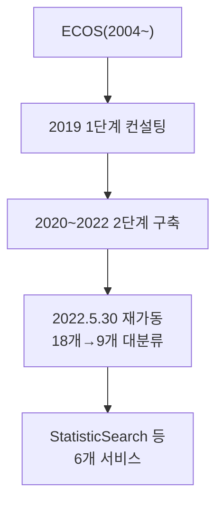

# 10장. 한국은행 ECOS (경제통계시스템)

> 공공 Open API 가이드북 — 4부. 통계·거시경제
> 확인 상태: 연혁·2022년 재구축 내역 공식 보도자료 직접 확인, 요청 URL 패턴은 다수의 독립적인 언어별 클라이언트 라이브러리(R, Python, Go, TypeScript)에서 교차 확인

| 항목 | 내용 |
|---|---|
| 제공기관 | 한국은행 |
| 포털 주소 | https://ecos.bok.or.kr/api/ |
| 한국은행 창립 | 1950년 6월 |
| ECOS 서비스 시작 | 2004년 1월(2022년 5월 30일 전면 재구축) |
| 인증 방식 | 회원가입 후 인증키 신청, 자동승인(즉시~1일) |
| 비용 | 무료 |
| 활용 우선순위 | 금리·환율·GDP·통화 등 거시경제 지표가 필요한 모든 분석 프로젝트 |

---

### 0) 연결 고리 (Bridge)

9장이 국가통계 전반(KOSIS)을 다뤘다면, 이 장은 그중에서도 **금융·거시경제에 특화된 한국은행 자체 통계**를 다룹니다. 5부(금융·기업)의 여러 장과 함께 투자·경제분석 프로젝트의 핵심 축이 됩니다. 그리고 9장의 KOSIS와 마찬가지로, 이 시스템도 최근 한 차례 큰 구조 변화를 겪었습니다.

---

## 1) 개념 정의 및 필요성

### 1.1 한국은행 창립부터 이어진 통계 작성, 그리고 16년 만의 재구축

**핵심 정의**: ECOS(Economic Statistics System)는 한국은행이 운영하는 경제통계 Open API로, 기준금리·환율·통화량·GDP·물가·국제수지 등 거시경제 시계열 데이터를 제공합니다.

한국은행은 **1950년 6월** 창립 이래로 통화·금리, 국민소득, 물가, 국제수지, 자금순환, 경기, 기업경영분석, 산업연관분석 등 국가기본경제통계를 작성해왔습니다. 이 데이터를 정책입안자와 일반인에게 신속하고 편리하게 제공하기 위한 전용 창구로, **2004년 1월** ECOS 홈페이지가 개설됩니다.

이후 18년 가까이 운영되며 시스템 구조가 복잡해지고 기반 기술이 노후화되자, 한국은행은 전면 재구축을 결정합니다.

- **~2019년**: 업무 프로세스 진단 및 기초설계를 위한 1단계 컨설팅 완료.
- **2020~2022년**: 2단계 시스템 구축 사업(약 2년).
- **2022년 5월 30일**: 재구축된 ECOS가 정식 가동됩니다.

이 재구축에서 실무적으로 중요한 변화가 있었습니다 — **기존 18개였던 대분류를 경제·금융 부문 및 통계 간 상호연관성을 고려해 9개로 절반 축소**했고, 분류·하위계층 수를 최소화해 탐색 과정을 단축했습니다. 통화금융통계·생산자물가 등 기존 통계는 재개발되고, 국제수지·자금순환·금융기관 가중평균금리 통계는 이때 새로 시스템화됐습니다.

> **WARNING**: 2022년 5월 이전에 작성된 블로그 글이나 튜토리얼은 **18개 대분류 체계** 기준일 수 있습니다. 지금 접속하면 9개 대분류로 재편된 구조를 보게 되므로, 오래된 자료의 분류 경로(대분류→중분류)가 그대로 안 맞을 수 있다는 걸 감안하십시오.

### 1.2 왜 필요한가

투자 분석이나 경제정책 리포트에서 "지금 기준금리가 얼마인가", "최근 CPI 추이는?" 같은 질문에 뉴스 기사를 검색하는 대신, 한국은행 서버에서 직접 숫자를 받아올 수 있습니다. 1.1절에서 본 것처럼 **"우리나라에서 경제 관련 통계를 인용할 때 대부분 한국은행 ECOS 데이터를 기반으로 한다"**는 평가가 있을 만큼, 이 데이터는 한국 경제 정책의 근간이 되는 원천입니다.

---

## 2) 핵심 원리 및 구조

### 2.1 URL 구조 — 경로 기반 파라미터(특이 구조)

ECOS는 이 가이드북의 다른 API 대부분과 달리 **쿼리스트링이 아니라 URL 경로에 파라미터를 순서대로 나열**하는 독특한 구조입니다(다수 독립 소스에서 동일하게 확인). 이건 3장에서 확인한 "data.go.kr 게이트웨이를 거치는 API들의 표준 쿼리스트링 패턴"과 뚜렷하게 대비됩니다 — ECOS는 2004년부터 독자적으로 운영돼온 시스템이라, 애초에 그 표준화 흐름 바깥에 있었기 때문으로 보입니다.

```
http://ecos.bok.or.kr/api/[서비스명]/[인증키]/[요청파일타입]/[언어]/[요청시작건수]/[요청종료건수]/[통계코드]/[주기]/[검색시작일자]/[검색종료일자]/(항목코드1)/(항목코드2)/(항목코드3)
```

| 위치 | 값 | 설명 |
|---|---|---|
| 서비스명 | `StatisticSearch` 등 | 아래 2.2 참고 |
| 인증키 | 발급받은 키 | — |
| 요청파일타입 | `json` / `xml` | — |
| 언어 | `kr` / `en` | — |
| 요청시작/종료건수 | 정수 | 페이징 |
| 통계코드 | 예: `200Y001` | ECOS 사이트 통계검색에서 확인 |
| 주기 | `A`(연)/`S`(반기)/`Q`(분기)/`M`(월)/`SM`(반월)/`D`(일) | — |
| 검색시작/종료일자 | 주기에 맞는 포맷 | 예: 월별이면 `YYYYMM` |
| 항목코드1~3 | 선택 | 통계표마다 그룹코드가 다름 |

> **WARNING**: 항목코드는 필수형식이 아니지만, 통계코드마다 **주기별로 코드가 다를 수 있습니다.** 같은 지표라도 월간 코드와 분기 코드가 다른 경우가 있으니, ECOS 사이트의 통계코드 검색으로 정확한 코드를 확인한 뒤 사용하십시오. 9장 KOSIS와 마찬가지로, 통계코드를 직접 추측하기보다 ECOS 사이트의 검색 도구에서 확인하는 게 안전합니다.

> **TIP**: 독립 라이브러리(R의 `ecos` 패키지 등)는 통계코드·항목코드를 모를 때 대화형으로 물어보는 `statSearch()` 같은 헬퍼를 제공합니다. 이건 9장에서 본 KOSIS의 "URL 복사 권장" 패턴과 본질적으로 같은 문제(코드 체계를 외우지 말고 검색하라)에 대한 또 다른 해법입니다.

### 2.2 서비스명 6종 (다수 클라이언트 라이브러리에서 커버리지 확인)

| 서비스명 | 용도 |
|---|---|
| StatisticSearch | 통계 데이터(시계열) 조회 — 가장 많이 씀 |
| StatisticTableList | 통계표 목록 조회 |
| StatisticItemList | 통계 세부항목(그룹코드/항목코드) 목록 |
| StatisticWord | 통계 용어사전 검색 |
| KeyStatisticList | 100대 주요지표 |
| StatisticMeta | 통계메타DB(작성기관, 공표주기 등) |



---

## 3) 코드 예제 및 실행 환경

```python
# ecos_client.py — ECOS 경로 기반 URL 클라이언트
# v1.0, Python 3.11+, requests 2.x
import requests

BASE_URL = "https://ecos.bok.or.kr/api"
API_KEY = "여기에_발급받은_인증키"


def statistic_search(
    stat_code: str,
    cycle: str,
    start_de: str,
    end_de: str,
    item_code1: str = "",
    start_count: int = 1,
    end_count: int = 100,
    lang: str = "kr",
    file_type: str = "json",
) -> dict:
    """ECOS 시계열 데이터 조회 (StatisticSearch)."""
    path_parts = [
        "StatisticSearch", API_KEY, file_type, lang,
        str(start_count), str(end_count),
        stat_code, cycle, start_de, end_de,
    ]
    if item_code1:
        path_parts.append(item_code1)
    url = "/".join([BASE_URL] + path_parts)
    resp = requests.get(url, timeout=10)
    resp.raise_for_status()
    return resp.json()


if __name__ == "__main__":
    # 예: 기준금리(통계코드는 ECOS 사이트에서 확인 필요, 아래는 예시 패턴)
    data = statistic_search(
        stat_code="722Y001", cycle="M", start_de="202301", end_de="202312"
    )
    print(data)
```

**실행**
```powershell
python -m venv .venv
.venv\Scripts\activate
pip install requests
python ecos_client.py
```

---

## 4) 실무 시나리오

- **투자 분석 backbone**: 5부(OpenDART·금융공공데이터·KRX)와 결합해 "이 기업의 재무 + 시장금리/환율 환경"을 함께 분석.
- **정책 리포트 자동화**: 기준금리·물가 추이를 주기적으로 가져와 리포트에 최신 수치 자동 반영(9장 KOSIS와 같은 패턴).
- **통계코드 탐색 흐름**: `StatisticTableList` → `StatisticItemList`로 원하는 지표의 정확한 코드를 먼저 확인한 뒤 `StatisticSearch` 호출.
- **2022년 이전 자료를 참고하는 경우**: 1.1절에서 본 재구축을 감안해, 통계코드 자체는 대체로 유지되지만 분류 경로(대분류/중분류)가 달라졌을 수 있으니 코드보다 최신 사이트의 검색 기능을 우선 신뢰.

---

## 5) 트러블슈팅 & 주의사항

| 증상 | 원인 | 조치 |
|---|---|---|
| URL을 쿼리스트링으로 만들어 호출했는데 실패 | ECOS는 경로 기반 구조(2.1절) | 표의 순서대로 `/`로 이어붙여 호출 |
| 같은 지표인데 다른 프로젝트 코드와 통계코드가 다름 | 주기별로 통계코드가 다를 수 있음 | 사용하려는 주기(연/분기/월)에 맞는 코드를 별도 확인 |
| 2022년 이전 예제 코드가 이상하게 동작 | 2022.05.30 재구축(1.1절) — 18→9 대분류 개편 | 최신 문서 기준으로 분류 경로·cycle 값 재확인 |
| 신규 통계(국제수지, 자금순환 등)가 예전 자료에 안 보임 | 2022년 재구축 때 신규 시스템화된 항목 | 최신 StatisticTableList로 신규 항목 존재 여부 확인 |

---

## 6) 한 줄 요약

> 💡 **Key Takeaway**: ECOS는 쿼리스트링이 아니라 **URL 경로에 파라미터를 순서대로 나열**하는 특이한 구조입니다. 그리고 2022년 5월 전면 재구축으로 분류 체계가 18개에서 9개로 절반 줄었다는 걸 알아두면, 오래된 자료와 지금 사이트가 왜 다르게 보이는지 헷갈리지 않습니다.