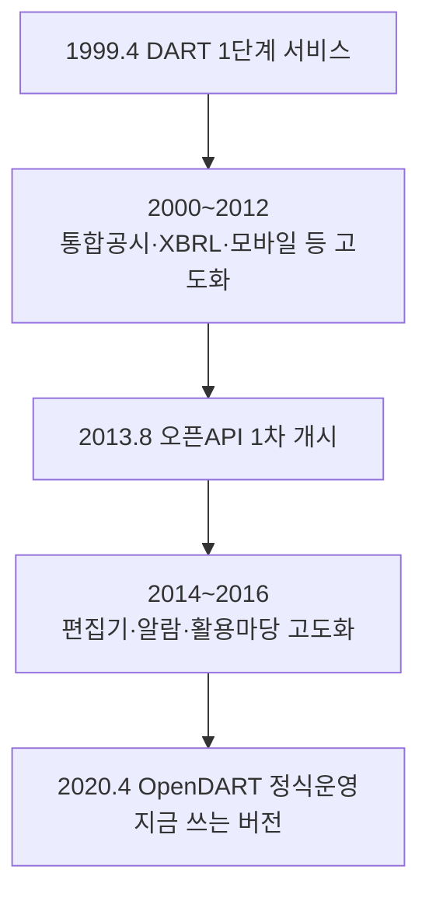

# 12장. OpenDART (전자공시시스템)

> 공공 Open API 가이드북 — 5부. 금융·기업(공공)
> 확인 상태: DART 공식 연혁 페이지 직접 확인(1997~2020), 공식 개발가이드 + 다수 독립 오픈소스 클라이언트(Python 3종 이상)에서 파라미터·엔드포인트 완전 일치 확인

| 항목 | 내용 |
|---|---|
| 제공기관 | 금융감독원 |
| 포털 주소 | https://opendart.fss.or.kr |
| DART 시스템 명칭 유래 | Data Analysis, Retrieval and Transfer System |
| DART 1단계 서비스 시작 | 1999년 4월 |
| 오픈API(1차) | 2013년 8월 |
| OpenDART(현재, 2차) | 2020년 4월 정식운영 |
| 인증 방식 | 회원가입(개인/기업용 구분) 후 인증키(40자리) 신청 |
| 비용 | 무료 |
| 활용 우선순위 | 상장사·기업분석 프로젝트의 필수 원천 |

---

### 0) 연결 고리 (Bridge)

11장이 금융회사·금융상품 데이터였다면, 이 장은 **기업 자체의 공시·재무 데이터**입니다. 투자 분석에서 가장 많이 재사용될 장입니다. 그런데 DART 자체의 역사를 조사해보니, 지금 우리가 쓰는 OpenDART가 이 시스템의 **첫 번째 API가 아니라는** 흥미로운 사실이 나왔습니다.

---

## 1) 개념 정의 및 필요성

### 1.1 23년에 걸친 DART의 역사, 그리고 두 번 있었던 API 출시

**핵심 정의**: OpenDART는 금융감독원 전자공시시스템(DART)의 공시서류 원문과 정기보고서 내 재무·경영 정보를 API로 제공합니다.

DART라는 이름은 "Data Analysis, Retrieval and Transfer System"의 약자입니다. 공식 연혁 페이지를 보면 이 시스템은 놀랍도록 이른 시기에 계획됐습니다.

- **1997년 11월**: 전자공시제도 추진 기본방향이 수립됩니다.
- **1998년**: "국민의 정부 100대 국정과제"로 선정(2월)되고, 종합계획(4월)을 거쳐 시스템 개발이 착수(8월)됩니다.
- **1999년 4월**: 1단계 전자공시시스템이 인터넷 서비스를 시작합니다(상장법인의 사업·반기·감사종료보고서 대상, 서면제출과 병행).
- **2000년 3월**: 2단계 서비스로 확장되어 모든 공시서류를 대상으로 하게 됩니다(2000년 1월부터는 서면제출이 아예 면제됨).
- **2002년**: 유가증권시장·코스닥시장에서 별도 접수되던 조회공시·공정공시까지 DART로 통합됩니다(7월), 주요정보통신기반시설로 지정됩니다(11월).
- **2009년 2월**: 자본시장법 시행에 맞춰 시스템이 정비됩니다.
- **2010년 10월**: K-IFRS 기반 XBRL(재무제표를 기계가 읽을 수 있는 표준 형식으로 태깅하는 방식) 공시시스템이 구축됩니다.

여기서 흥미로운 지점이 나옵니다. 공식 연혁에 **API 관련 이벤트가 두 번** 등장합니다.

- **2013년 8월**: "오픈API" 서비스가 처음 개시됩니다.
- **2020년 4월**: "Open DART 서비스 정식운영"이 다시 안내됩니다(4월 20일자 공지사항으로 별도 확인).

즉 2013년의 오픈API와 지금 우리가 쓰는 2020년의 OpenDART는 **같은 것의 연속이 아니라, 7년 간격을 둔 두 번의 별도 출시**로 보입니다(관찰 — 공식 페이지는 두 사건을 나란히 연혁에 적어뒀을 뿐, 왜 재출시했는지 이유는 명시하지 않습니다). 다만 이 사이에 XBRL 시스템 구축(2010), 통합검색(2011), 모바일 전자공시(2012), 새 DART 편집기(2014), 알람 서비스(2015), 공시정보활용마당(2016) 같은 굵직한 개편이 계속 있었던 걸 보면, **2013년의 초기 API가 이후 여러 개편을 거치며 누적된 기술부채를 안고 있다가, 2020년에 전면 재정비되어 지금의 형태로 재출시된 것**으로 추정할 수 있습니다.

> **NOTE**: 이 패턴 — "초기 API 출시 → 수년간 시스템 고도화 → API 전면 재구축" — 은 10장(ECOS, 2004년 개설 → 2022년 재구축)에서도 똑같이 나타났습니다. 장기간 운영되는 정부 시스템에서 API가 한 번에 완성되지 않고 단계적으로 재정비된다는 게, 이 가이드북 전체에서 반복 확인되는 패턴입니다.

### 1.2 왜 필요한가

사업보고서를 사람이 PDF로 열어보는 대신, 재무제표·배당·임원현황·최대주주 변동 등을 구조화된 JSON/XML로 바로 가져와 분석 파이프라인에 넣을 수 있습니다.

> **NOTE**: 인증키 발급 소요시간은 **개인회원은 신청 즉시**, 기업회원은 검토 절차가 있는 것으로 확인됩니다(공식 안내).

---

## 2) 핵심 원리 및 구조

### 2.1 기업 식별 — corp_code 확보가 첫 단계

DART의 모든 API는 종목코드가 아니라 **고유번호(corp_code, 8자리)**로 기업을 식별합니다. 이 매핑은 별도 벌크 다운로드 API로 얻습니다.

```
GET https://opendart.fss.or.kr/api/corpCode.xml?crtfc_key={key}
```
→ 전체 상장·비상장 기업의 corp_code/종목명/종목코드 매핑이 담긴 ZIP(XML)을 반환합니다. 매번 API로 개별 검색하지 않고, 이 파일을 한 번 받아 로컬에서 이름→코드를 조회하는 방식이 일반적입니다.

> **TIP**: 왜 종목코드가 아니라 별도의 corp_code를 쓰는지는 1.1절의 연혁으로 짐작할 수 있습니다 — DART는 상장법인뿐 아니라 **비상장 외부감사대상법인**(2012년 6월 공지에서 확인: 주주수 500인 이상 비상장 법인도 공시 의무 대상)까지 다루기 때문에, 증권시장 종목코드가 없는 기업도 식별할 수 있는 자체 코드 체계가 필요했던 것으로 보입니다.

### 2.2 공통 요청 파라미터

| 파라미터 | 타입 | 필수 | 설명 |
|---|---|---|---|
| crtfc_key | STRING(40) | Y | 발급받은 인증키 |
| corp_code | STRING(8) | Y(기업 단위 조회 시) | 고유번호 |
| bsns_year | STRING(4) | Y(정기보고서 계열) | 사업연도 |
| reprt_code | STRING(5) | Y(정기보고서 계열) | 11013=1분기, 11012=반기, 11014=3분기, 11011=사업보고서 |
| fs_div | STRING(3) | 재무제표 API만 | OFS=개별재무제표, CFS=연결재무제표 |
| bgn_de / end_de | STRING(8) | 공시검색 계열 | 조회기간(YYYYMMDD) |

### 2.3 대표 엔드포인트 (다수 독립 소스 교차 확인)

| 기능 | 엔드포인트 |
|---|---|
| 공시검색 | `GET /api/list.json` (corp_code 없이 전체 시장 검색 시 기간 3개월 이내 제약 확인) |
| 단일회사 주요계정 | `GET /api/fnlttSinglAcnt.json` |
| 단일회사 전체 재무제표 | `GET /api/fnlttSinglAcntAll.json` (fs_div 필수) |
| 배당에 관한 사항 | `GET /api/alotMatter.json` |
| 증자(감자) 현황 | `GET /api/irdsSttus.json` |
| 자기주식 취득/처분 현황 | `GET /api/tesstkAcqsDspsSttus.json` |
| 직원 현황 | `GET /api/empSttus.json` |
| 회계감사인 명칭 및 감사의견 | `GET /api/accnutAdtorNmNdAdtOpinion.json` |



---

## 3) 코드 예제 및 실행 환경

```python
# opendart_client.py — OpenDART 클라이언트
# v1.0, Python 3.11+, requests 2.x
import requests

BASE_URL = "https://opendart.fss.or.kr/api"
CRTFC_KEY = "여기에_발급받은_40자리_인증키"


def search_disclosures(corp_code: str, bgn_de: str, end_de: str) -> dict:
    """공시검색: 특정 기업의 기간 내 공시 목록."""
    params = {
        "crtfc_key": CRTFC_KEY,
        "corp_code": corp_code,
        "bgn_de": bgn_de,
        "end_de": end_de,
    }
    resp = requests.get(f"{BASE_URL}/list.json", params=params, timeout=10)
    resp.raise_for_status()
    return resp.json()


def get_financial_statements(
    corp_code: str, bsns_year: str, reprt_code: str = "11011", fs_div: str = "CFS"
) -> dict:
    """단일회사 전체 재무제표 조회."""
    params = {
        "crtfc_key": CRTFC_KEY,
        "corp_code": corp_code,
        "bsns_year": bsns_year,
        "reprt_code": reprt_code,
        "fs_div": fs_div,
    }
    resp = requests.get(f"{BASE_URL}/fnlttSinglAcntAll.json", params=params, timeout=10)
    resp.raise_for_status()
    return resp.json()


if __name__ == "__main__":
    # corp_code는 사전에 corpCode.xml에서 확보해뒀다고 가정 (예: 삼성전자 = 00126380)
    print(get_financial_statements("00126380", bsns_year="2025", reprt_code="11011"))
```

**실행**
```powershell
python -m venv .venv
.venv\Scripts\activate
pip install requests
python opendart_client.py
```

---

## 4) 실무 시나리오

- **재무 스크리닝 파이프라인**: `fnlttSinglAcntAll`로 여러 기업의 재무제표를 일괄 수집해 비교분석.
- **거버넌스 모니터링**: 최대주주 변동, 자기주식 취득/처분, 임원 현황을 주기적으로 조회해 이벤트를 감지.
- **비상장 기업 포함 분석**: 2.1절 TIP에서 본 것처럼 DART는 비상장 외부감사대상법인도 다루므로, 증권시장 종목코드가 없는 기업을 분석할 때도 이 API가 유효한 원천이 될 수 있습니다.
- **7장(국세청)과 결합**: 사업자번호 상태를 먼저 확인한 뒤, corp_code로 매핑해 재무 데이터까지 연결.

---

## 5) 트러블슈팅 & 주의사항

| 증상 | 원인 | 조치 |
|---|---|---|
| 재무제표 API가 빈 값 반환 | `fs_div` 누락 | 재무제표 계열 API는 `fs_div`(OFS/CFS) 필수 |
| corp_code 없이 전체 검색했더니 오류/제한 | 기간이 3개월을 초과 | corp_code 없는 전체 검색은 기간 제약이 있는 것으로 확인 — 기간을 좁히거나 corp_code 지정 |
| 이름으로 기업을 못 찾음 | corp_code 매핑을 안 받음 | `corpCode.xml`을 먼저 받아 로컬 매핑 테이블 구축 |
| 2013년 무렵 자료를 참고했는데 지금과 다름 | 1.1절에서 본 2013년 1차 오픈API와 2020년 현재 OpenDART의 차이 가능성 | 2020년 이후 공식 개발가이드 기준으로 재확인 |

---

## 6) 한 줄 요약

> 💡 **Key Takeaway**: OpenDART는 종목코드가 아니라 `corp_code`로 동작합니다. 그리고 이 API는 사실 2013년에 한 번, 2020년에 다시 한 번, **두 차례에 걸쳐 출시**됐다는 걸 알아두면, 오래된 참고자료와 지금 API가 미묘하게 다를 수 있다는 걸 이해하는 데 도움이 됩니다.