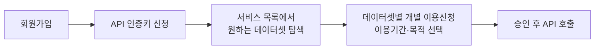

# 13장. 한국거래소(KRX) Open API

> 공공 Open API 가이드북 — 5부. 금융·기업(공공)
> 확인 상태: 연혁·기업 성격(공공기관 해제) 다수 독립 소스 교차 확인, 이용약관·이용방법 공식 확인. **무료(Open API)와 유료(데이터상품) 두 트랙이 완전히 분리되어 있음을 확인 — 이 장에서 반드시 구분**

| 항목 | 내용 |
|---|---|
| 제공기관 | 한국거래소(KRX) — **2015년 1월부터 공공기관 지정 해제, 현재 민간기업** |
| 무료 트랙 | KRX Data Marketplace Open API — https://openapi.krx.co.kr |
| 유료 트랙 | 데이터 구입(직접 결제, 학생·교직원 50% 할인 등) |
| 증권시장 개장 | 1956년 3월(대한증권거래소) |
| 인증 방식(무료) | 회원가입 → API 인증키 신청 → **서비스(데이터셋)별 개별 이용신청** |
| 비용(무료 트랙) | 무료, 단 1키당 1일 10,000회 제한 |
| 활용 우선순위 | 국내 증시 데이터가 필요한 투자 플랫폼의 핵심 |

---

### 0) 연결 고리 (Bridge)

지난 조사에서 "KRX는 무료 API와 별도로 유료 데이터 상품을 판다"는 점을 이미 짚었었는데, 이번에 그 경계가 왜 이렇게 뚜렷한지 훨씬 근본적인 이유를 찾았습니다 — **KRX는 2015년부터 법적으로 공공기관이 아니라 민간기업**입니다. 이 장이 5부("금융·기업(공공)")에 있지만 사실상 이 부에서 유일하게 "완전한 공공기관"이 아닌 제공기관이라는 걸 먼저 짚고 시작합니다.

---

## 1) 개념 정의 및 필요성

### 1.1 거래소의 뿌리, 그리고 2015년의 전환점

**핵심 정의**: KRX Data Marketplace는 한국거래소가 지수·주식·증권상품·채권·파생상품·일반상품 등의 시세 정보를 API로 제공하는 플랫폼입니다.

이 기관의 역사를 보면 지금의 "무료 API + 유료 데이터상품" 구조가 왜 이렇게 됐는지 이해할 수 있습니다.

- **1956년 3월**: 대한증권거래소가 개장하며 한국 증권시장 역사가 시작됩니다. 이게 지금 KRX의 뿌리입니다.
- **2005년 1월 27일**: 한국증권거래소(KSE)·한국선물거래소(KOFEX)·코스닥증권시장·코스닥위원회 **4개 단체가 통합**되어 "한국증권선물거래소"로 출범합니다.
- **2009년 2월 4일**: 지금의 이름인 "한국거래소(KRX)"로 사명이 바뀝니다.
- **2015년 1월**: **공공기관 지정에서 해제**되어 민간기업이 됩니다.

이 마지막 사실이 결정적입니다. 이 가이드북의 다른 대부분 장(1~12장)이 다루는 기관은 지금도 공공기관·정부부처이지만, **KRX는 이 책을 쓰는 지금 시점에는 법적으로 민간기업**입니다. 그런데도 KRX는 대한민국 유일의 증권거래소로서 시장 데이터 공개에 대한 정책적 기대를 여전히 받고 있고, 그 결과 "일부는 무료 공개(Open API), 일부는 유료 판매(데이터상품)"라는 **민간기업이면서도 공공적 성격을 일부 유지하는 절충 구조**가 만들어진 것으로 이해할 수 있습니다.

> **NOTE**: KRX Open API 자체 약관(제1장 총칙)은 "API"를 "정보 소유자가 정보 이용자에게 정보를 제공하기 위하여 정의한 규약"으로 정의합니다. "정보 소유자"라는 표현이 눈에 띕니다 — 정부기관이 공공데이터법에 따라 개방 "의무"를 지는 것과 달리(3장 참고), KRX는 스스로를 데이터의 "소유자"로 규정하고 그 데이터를 어디까지 무료로, 어디부터 유료로 내줄지 스스로 정할 수 있는 민간기업의 입장에서 이 서비스를 설계했다는 뉘앙스로 읽힙니다.

### 1.2 왜 필요한가

KOSPI/KOSDAQ 시세·지수 데이터를 화면 크롤링 없이 정식 API로 가져와 투자 분석·백테스트에 활용할 수 있습니다.

> **WARNING**: KRX는 **회원제로 전환**되었습니다(공식 공지 확인). 과거 인증키 없이 호출 가능했던 방식(크롤링성 접근)은 더 이상 안정적으로 동작하지 않는 것으로 확인됩니다 — 반드시 정식 인증키 기반으로 설계해야 합니다.

---

## 2) 핵심 원리 및 구조

### 2.1 무료(Open API) vs 유료(데이터상품) — 필수 구분표

| 구분 | 무료 (Open API) | 유료 (데이터상품) |
|---|---|---|
| 주체 | 한국거래소 직접 운영 | 한국거래소 직접 판매(직접 결제 방식으로 확인 — 앞선 조사의 "코스콤 계약"이라는 추정은 이번에 재확인 못함, 실제로는 KRX 자체 데이터 구입 페이지에서 결제) |
| 가입 절차 | 웹 회원가입(개인 본인인증/소셜로그인, 법인은 사업자정보 등록) | KRX Data Marketplace 내 데이터상품 선택 → 결제 → 심사 |
| 승인 소요 | 통상 1일 이내(근무시간 기준 2~3시간 사례도 확인) | 결제 후 심사 절차 |
| 호출 한도 | **1키당 1일 10,000회**, 초과 시 서비스 중지 가능 | 계약(구매) 조건에 따름 |
| 키 유효기간 | **12개월 미사용 시 사전공지 없이 삭제** | 구매 데이터 건별 |
| 할인 | 없음(원래 무료) | **학생·교직원·학교법인은 상품가격 50% 할인** |
| 활용 신청 | **서비스(데이터셋)별로 개별 이용신청 필수**(기간·목적 선택) | 상품별 개별 결제 |

> **WARNING**: "무료"와 "유료"는 완전히 분리된 별도 절차입니다. 무료 Open API에 가입했다고 유료 데이터상품에 자동으로 접근 권한이 생기지 않고, 반대로 유료 상품을 구매했다고 무료 API 인증키가 자동 발급되지도 않습니다. 지난 조사에서 유료 트랙의 계약 주체를 "코스콤"으로 추정했었는데, 이번 확인으로는 **KRX Data Marketplace 자체에서 직접 결제하는 방식**이 공식 안내에 명시되어 있어 앞선 추정을 정정합니다.

### 2.2 무료 Open API 이용 절차 (공식 확인)



> **NOTE**: 인증키 발급과 데이터셋 이용신청은 **별개의 두 단계**입니다. 인증키만 받고 특정 데이터셋(예: "KOSPI 시리즈 일별시세정보")에 이용신청을 안 하면 호출이 거부됩니다. 이 두 단계를 하나로 착각해서 "키는 받았는데 왜 안 되지"라는 문제를 겪는 경우가 흔한 것으로 확인됩니다.

### 2.3 제공 분야와 데이터 시작 시점 (공식 확인)

지수 / 주식 / 증권상품 / 채권 / 파생상품 / 일반상품(공식 소개 기준). 예를 들어 유가증권시장 주식 매매정보는 **2010년 1월 4일 데이터부터** 제공되는 것으로 확인됩니다 — 즉 "2010년 이후"라는 시작점이 서비스 전체가 아니라 **개별 데이터셋마다 별도로** 명시되어 있으므로, 필요한 데이터셋의 커버리지 시작일을 개별로 확인해야 합니다.

> **WARNING(당일 데이터 불가)**: 다수 독립 클라이언트 라이브러리에서 공통으로 확인되는 제약이 하나 있습니다 — KRX Open API는 **조회일 기준 전일(T-1)까지의 데이터만 제공**하며, 당일 데이터는 조회할 수 없습니다. 실시간 시세가 필요한 서비스를 설계하고 있다면 이 API로는 불가능하다는 걸 미리 인지해야 합니다(실시간이 꼭 필요하면 6부의 증권사 API 쪽이 대안입니다).

### 2.4 실제 API 도메인 — 신청 포털과 호출 도메인이 다름 (중요)

`openapi.krx.co.kr`은 **회원가입·인증키 신청·이용신청을 하는 포털**이고, 실제 데이터 호출은 별도 도메인으로 나가는 것이 여러 독립 커뮤니티 클라이언트(Rust, Kotlin/Java 등)에서 공통으로 확인됩니다.

```
실제 API 호출 도메인(다수 독립 클라이언트에서 확인): http://data-dbg.krx.co.kr/svc/apis
```

> **NOTE**: "dbg"라는 이름이 붙어있어 디버그/테스트용처럼 보이지만, 여러 실사용 라이브러리(Rust `krx-rs`, Kotlin `krx-reader` 등)가 실제 운영 코드에서 이 도메인을 그대로 쓰고 있는 것으로 확인됩니다. 포털(`openapi.krx.co.kr`)에서 신청한 인증키를 이 도메인으로 호출할 때 그대로 사용합니다.

### 2.5 개별 이용신청이 필요한 대표 서비스 목록 (실제 예시)

2.1절에서 "데이터셋별로 개별 이용신청이 필요하다"고 설명했는데, 실제로 여러 클라이언트 문서에서 공통으로 언급되는 신청 대상 서비스 목록입니다.

```
KRX 시리즈 일별시세정보 / KOSPI 시리즈 일별시세정보 / KOSDAQ 시리즈 일별시세정보
유가증권 일별매매정보 / 코스닥 일별매매정보 / 코넥스 일별매매정보
유가증권 종목기본정보 / 코스닥 종목기본정보 / 코넥스 종목기본정보
```

인증키를 발급받아도 이 목록에서 필요한 서비스를 **개별로 신청하지 않으면 어떤 데이터도 받을 수 없다**는 것이 여러 독립 소스에서 일관되게 확인됩니다.

---

## 3) 코드 예제 및 실행 환경

```python
# krx_open_api_client.py — KRX Open API 클라이언트 (무료 트랙 전용)
# v1.0, Python 3.11+, requests 2.x
"""
NOTE: 실제 엔드포인트 URL과 파라미터는 서비스(데이터셋)마다 다르며,
      이용신청 완료 후 해당 데이터셋 상세페이지의 API 명세에서 확인해야 합니다.
      아래는 인증키를 헤더/쿼리에 싣는 공통 골격입니다.
"""
import time
import requests

AUTH_KEY = "여기에_발급받은_API_인증키"
BASE_URL = "http://data-dbg.krx.co.kr/svc/apis"  # 2.4절에서 확인된 실제 호출 도메인(신청 포털과 다름)


def call_krx_api(service_path: str, params: dict, timeout: int = 10) -> dict:
    """KRX Open API 공통 호출 헬퍼. service_path는 신청한 서비스별 하위 경로."""
    headers = {"AUTH_KEY": AUTH_KEY}
    resp = requests.get(f"{BASE_URL}/{service_path}", params=params, headers=headers, timeout=timeout)
    resp.raise_for_status()
    return resp.json()


def get_kospi_daily_trade(base_date: str) -> dict:
    """유가증권(KOSPI) 일별매매정보 조회. base_date는 YYYYMMDD, 전일(T-1)까지만 조회 가능(2.3절).

    WARNING: 하위 경로("sto/stk_bydd_trd")와 파라미터명("basDd")은 이번 조사에서
             확정하지 못한 추정치입니다. 2.5절 서비스를 실제 이용신청한 뒤
             발급되는 명세서로 반드시 교체하십시오.
    """
    return call_krx_api("sto/stk_bydd_trd", {"basDd": base_date})


def polite_delay(seconds: float = 0.5) -> None:
    """1일 10,000회 한도를 고려한 배치 호출 간 딜레이."""
    time.sleep(seconds)
```

> **WARNING**: 인증키 전달 방식(헤더 vs 쿼리 파라미터)은 이번 조사에서 데이터셋별 명세까지 확인하지 못해 **추정**입니다. 실제 이용신청 후 제공되는 개별 API 명세서를 기준으로 재작성하십시오.

---

## 4) 실무 시나리오

- **국내 주식 시세 backbone**: 6부(증권사 API)의 개별 계좌·주문 기능과 달리, KRX Open API는 **시장 전체 시세·지수 데이터**에 강점 — 백테스트·스크리닝용 원천으로 적합.
- **10장(ECOS)·12장(OpenDART)과 결합**: 거시경제 지표 + 기업 재무 + 시장 시세를 하나의 분석 파이프라인으로 통합.
- **학술 연구 프로젝트**: 대량의 과거 데이터가 필요한 연구라면, 무료 API의 1일 10,000회 한도보다 유료 데이터상품이 적합할 수 있고, 이 경우 1.1절에서 본 **학생·교직원 50% 할인**을 활용할 수 있습니다.
- **유료 전환 판단**: 실시간성·데이터 깊이가 무료 API로 부족하면, 이 시점에 KRX Data Marketplace의 데이터상품 구매 페이지에서 유료 전환을 검토 — 처음부터 유료를 가정하고 설계하지 않기.

---

## 5) 트러블슈팅 & 주의사항

| 증상 | 원인 | 조치 |
|---|---|---|
| 인증키는 있는데 호출이 거부됨 | 해당 데이터셋에 개별 이용신청을 안 함 | 서비스 목록에서 필요한 데이터셋을 찾아 별도 이용신청 |
| 몇 달 뒤 갑자기 인증키가 안 먹힘 | 12개월 미사용으로 삭제됨 | 정기적으로 호출하거나 재발급 |
| 오래된 크롤링 방식 예제가 작동 안 함 | KRX가 회원제로 전환됨 | 정식 Open API 인증키 기반으로 재작성 |
| 대량 데이터가 필요한데 하루 10,000회로 부족 | 무료 트랙의 구조적 한도 | KRX Data Marketplace의 유료 데이터상품 구매 검토(학생·교직원 할인 확인) |
| "KRX도 공공기관이니 완전 무료겠지"라는 가정 | 2015년 공공기관 지정 해제 사실을 모름(1.1절) | KRX는 민간기업이며, 데이터 공개 범위를 스스로 정할 수 있다는 전제로 설계 |
| 오늘 날짜로 조회했는데 데이터가 없음 | T-1(전일)까지만 제공(2.3절) | 당일 데이터가 필요하면 이 API가 아니라 6부 증권사 API(실시간) 검토 |
| 포털에서 발급받은 키로 호출했는데 연결 자체가 안 됨 | 신청 포털(`openapi.krx.co.kr`)과 호출 도메인(`data-dbg.krx.co.kr`)을 혼동(2.4절) | 실제 데이터 요청은 호출 전용 도메인으로 보내기 |

---

## 6) 한 줄 요약

> 💡 **Key Takeaway**: KRX는 이 가이드북에서 다루는 다른 기관과 달리 **2015년부터 민간기업**입니다. "무료 Open API"와 "유료 데이터상품"이 뚜렷이 나뉘는 것도, 법적 개방 의무가 아니라 민간기업이 스스로 정한 정책이기 때문이라고 이해하면 이 구조가 왜 이렇게 엄격한지 납득됩니다.