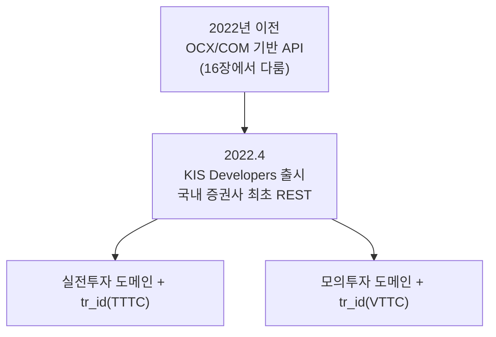

# 14장. 한국투자증권 KIS Developers

> 공공 Open API 가이드북 — 6부. 증권사 API (민간·참고)
> 확인 상태: 공식 API Reference + 다수 언론보도(출시 배경) + 실사용 오픈소스 래퍼(실측 rate limit 포함)에서 도메인·tr_id·필드명 패턴 교차 확인
> **이 부(6부) 전체는 공공데이터가 아닙니다.** 민간 증권사가 자사 고객에게 제공하는 서비스이며, 계좌 개설·약관 동의가 전제조건입니다.

| 항목 | 내용 |
|---|---|
| 제공기관 | 한국투자증권(민간) |
| 개발자센터 | https://apiportal.koreainvestment.com |
| 출시 시점 | 2022년 4월 — **국내 증권사 최초의 서버사이드(OCX 없는) REST API** |
| 전제조건 | 한국투자증권 계좌 개설 + ID 등록 (모의투자는 모의계좌 신청) |
| 인증 방식 | APP KEY / APP SECRET → OAuth 접근토큰(access_token) |
| 비용 | 무료(거래 자체는 증권사 수수료 정책 적용) |
| 방식 | REST + WebSocket |

---

### 0) 연결 고리 (Bridge)

5부까지는 전부 공공 API였습니다. 6부는 성격이 다릅니다 — 국내 증권사가 자사 고객에게 제공하는 트레이딩 API로, **계좌·본인인증이 전제**입니다. 13장(KRX)이 시장 전체 시세라면, 이 장부터는 "내 계좌로 실제 주문을 넣는" 영역입니다. 그리고 이 장이 다루는 KIS Developers는, 16장에서 다룰 구세대 증권사 API들과 대비되는 **하나의 전환점**이었습니다.

---

## 1) 개념 정의 및 필요성

### 1.1 "국내 증권사 최초"라는 타이틀의 의미

**핵심 정의**: KIS Developers는 한국투자증권이 제공하는 트레이딩 Open API로, 국내·해외 주식/선물옵션 시세 조회부터 주문·잔고 조회까지 REST와 WebSocket 두 방식으로 지원합니다.

**2022년 4월** 출시 당시 여러 언론 보도가 공통적으로 강조한 게 하나 있습니다 — **"국내 증권사 최초로 홈트레이딩시스템(HTS) 접속이나 별도 프로그램 설치 없이도 주식매매 인터페이스를 사용할 수 있게 했다"**는 점입니다. 16장에서 다루겠지만, 그전까지 키움증권·이베스트증권·대신증권을 포함해 한국투자증권 자신도 Windows COM/OCX/DLL 기반의 구세대 API를 제공해왔습니다. 즉 KIS Developers는 단순히 "한투가 API를 만들었다"가 아니라, **한국 증권업계 전체에서 "OCX 객체 생성 없는" REST 방식 API의 첫 사례**였다는 의미가 있습니다. 한국투자증권은 이를 "혁신금융 생태계 조성"의 일환으로 소개했습니다.

이 역사적 배경을 알면 왜 14장(이 장)과 16장(키움·LS증권)의 아키텍처가 이렇게 다른지 납득이 됩니다 — 단순히 "회사마다 다르게 만들었다"가 아니라, **2022년을 기점으로 증권사 API 생태계 자체가 세대교체를 겪는 중**이라고 보는 게 더 정확합니다.

### 1.2 왜 필요한가

자동매매, 개인 투자 대시보드, 퀀트 전략 백테스트+실매매 연동에 사용됩니다. 13장(KRX)이 "시장 전체를 본다"면, 이 장은 "내 계좌로 실행한다"입니다.

---

## 2) 핵심 원리 및 구조

### 2.1 실전투자 vs 모의투자 — 도메인이 다름 (공식 확인)

| 환경 | REST 도메인 | WebSocket | 계좌번호 특징 |
|---|---|---|---|
| 실전투자 | `https://openapi.koreainvestment.com:9443` | `ws://ops.koreainvestment.com:21000` | 본인 실제 계좌 |
| 모의투자 | `https://openapivts.koreainvestment.com:29443` | (별도 확인 필요) | `4444xxxxxxxx`/`50xxxxxxxx` 형태로 확인된 사례 존재 |

> **WARNING**: 실전투자 앱키로 모의투자 도메인을 호출하거나 그 반대로 하면 `"실전투자 도메인은 모의투자 앱키로 호출하실 수 없습니다"`(에러코드 EGW02004) 오류가 발생하는 게 실제 사례로 확인됩니다. **환경별로 앱키·시크릿·도메인 3종을 세트로 관리**해야 합니다.

### 2.2 인증 흐름

1. APP KEY, APP SECRET 발급(서비스 신청 완료 후)
2. `POST {도메인}/oauth2/tokenP` — body에 `grant_type=client_credentials`, `appkey`, `appsecret` → `access_token` 발급
3. 이후 모든 요청에 `Authorization: Bearer {access_token}` 헤더 필요
4. 주문 계열 API는 `POST {도메인}/uapi/hashkey`로 body를 해시 처리해야 하는 경우가 있음(공식 확인)

### 2.3 tr_id — 실전/모의가 다른 값을 씀 (실무 함정)

| 기능 | 실전투자 tr_id | 모의투자 tr_id |
|---|---|---|
| 현금 매수 | TTTC0802U | VTTC0802U |
| 현금 매도 | TTTC0801U | VTTC0801U |
| 현재가 조회(공통 예시) | FHKST01010100 | (동일 계열, 시세 조회는 실전/모의 구분 없는 tr_id도 존재) |

> **WARNING**: 도메인만 모의투자로 바꾸고 tr_id를 실전투자 값 그대로 쓰면 오류가 나거나(최악의 경우 의도와 다른 동작) 납니다. **도메인 + tr_id를 항상 짝으로 맞춰야** 합니다.

### 2.4 응답 필드명이 암호 같은 이유

실제 사용해보면 `stck_prpr`(주식현재가), `hts_kor_isnm`(HTS한글종목명) 같은, 한글 단어를 로마자로 축약한 필드명을 만나게 됩니다. 이건 버그가 아니라 **증권업계에서 오랫동안 써온 HTS/전산시스템의 필드 명명 관행이 REST API에도 그대로 이어진 것**으로 보입니다(관찰) — 1.1절에서 본 것처럼 이 API가 기존 증권사 전산 인프라 위에 REST 계층을 얹은 형태이기 때문일 가능성이 높습니다. 실사용 커뮤니티 도구들이 `stck_prpr → currentPrice`처럼 필드명을 영문으로 재매핑해 제공하는 것도 이런 이유입니다.

> **TIP**: 처음 응답을 받아보고 필드명이 낯설어도 당황할 필요 없습니다. 필드명 사전(공식 API 문서의 Output 항목표)을 옆에 두고 매핑 테이블을 직접 만들어두는 걸 권장합니다.

### 2.5 제휴사 전용 OAuth (플랫폼을 만드는 경우)

한국투자증권 계좌를 직접 보유하지 않은 제3자가 "사용자의 한국투자 계좌를 연동하는 서비스"를 만들 경우, 별도의 **제휴사 전용 API**(인가코드요청 → 접근토큰발급, OAuth2 Authorization Code 흐름)가 있는 것으로 확인됩니다. 인가코드 유효시간은 5분입니다.



---

## 3) 코드 예제 및 실행 환경

```python
# kis_client.py — KIS Developers 최소 클라이언트
# v1.0, Python 3.11+, requests 2.x
import json
import requests

BASE_URL = "https://openapivts.koreainvestment.com:29443"  # 모의투자. 실전은 :9443 도메인으로 교체
APP_KEY = "여기에_발급받은_APP_KEY"
APP_SECRET = "여기에_발급받은_APP_SECRET"


def get_access_token() -> str:
    """OAuth 접근토큰 발급."""
    resp = requests.post(
        f"{BASE_URL}/oauth2/tokenP",
        headers={"content-type": "application/json"},
        data=json.dumps(
            {"grant_type": "client_credentials", "appkey": APP_KEY, "appsecret": APP_SECRET}
        ),
        timeout=10,
    )
    resp.raise_for_status()
    return resp.json()["access_token"]


def get_current_price(access_token: str, stock_code: str, is_mock: bool = True) -> int:
    """국내주식 현재가 조회. 응답 필드는 2.4절에서 본 축약형(stck_prpr 등)으로 옵니다."""
    tr_id = "FHKST01010100"  # 시세 조회는 실전/모의 공통인 경우가 많음(개별 API별 확인 필요)
    headers = {
        "Content-Type": "application/json",
        "authorization": f"Bearer {access_token}",
        "appKey": APP_KEY,
        "appSecret": APP_SECRET,
        "tr_id": tr_id,
    }
    params = {"fid_cond_mrkt_div_code": "J", "fid_input_iscd": stock_code}
    resp = requests.get(
        f"{BASE_URL}/uapi/domestic-stock/v1/quotations/inquire-price",
        headers=headers, params=params, timeout=10,
    )
    resp.raise_for_status()
    return int(resp.json()["output"]["stck_prpr"])


if __name__ == "__main__":
    token = get_access_token()
    print(get_current_price(token, "005930"))  # 삼성전자
```

> **WARNING**: 주문(매수/매도) 코드는 이 가이드북에 싣지 않습니다. 실제 자산이 움직이는 기능이므로, 반드시 모의투자 환경에서 충분히 검증한 뒤 실전 전환을 별도로 설계하십시오.

> **NOTE**: 실사용 커뮤니티 래퍼에서 실측 기준 호출 한도를 **초당 약 18회, 분당 약 900회**로 확인한 사례가 있습니다(공식 문서가 아니라 실사용 관찰치이므로 참고용). 배치 작업을 설계할 때 이 수준을 넘지 않도록 딜레이를 두는 게 안전합니다.

---

## 4) 실무 시나리오

- **자동매매/퀀트 전략**: 13장(KRX) 시세로 종목을 스크리닝하고, 이 장의 API로 실제 주문 실행.
- **개인 투자 대시보드**: 잔고·손익 조회 API로 포트폴리오 현황판 구성.
- **제휴 서비스**: 여러 사용자의 계좌를 연동하는 서비스를 만든다면 2.5절의 제휴사 전용 OAuth 흐름을 사용.
- **필드명 매핑 계층 만들기**: 2.4절에서 본 것처럼 응답 필드명이 축약형이므로, DTO 레벨에서 `stck_prpr → current_price`식으로 번역하는 매핑 계층을 처음부터 만들어두면 이후 코드 가독성이 크게 좋아집니다.

---

## 5) 트러블슈팅 & 주의사항

| 증상 | 원인 | 조치 |
|---|---|---|
| EGW02004 오류 | 도메인과 앱키 환경(실전/모의) 불일치 | 도메인·앱키·시크릿 3종을 환경별로 세트 관리 |
| 주문은 되는데 조회가 이상함 | tr_id를 환경에 안 맞게 씀 | 2.3표 기준으로 실전(TTTC)/모의(VTTC) tr_id 구분 |
| 토큰이 자꾸 만료됨 | 매 요청마다 재발급 | 토큰을 캐싱해 만료 시에만 재발급(다수 라이브러리가 `keep_token` 옵션으로 지원) |
| 응답 필드명이 무슨 뜻인지 모르겠음 | 증권업계 전산 관행의 축약 필드명(2.4절) | 공식 문서의 Output 항목표로 매핑 테이블 구축 |
| 배치 작업이 자꾸 실패함 | 초당/분당 호출 한도 초과 가능성 | 실측 기준(초당 18회, 분당 900회 수준) 이하로 딜레이 조절 |

---

## 6) 한 줄 요약

> 💡 **Key Takeaway**: KIS Developers는 2022년 4월 **국내 증권사 최초의 OCX 없는 REST API**로 출시됐습니다. "도메인 + 앱키 + tr_id"가 실전/모의 환경별로 세트로 묶여 있다는 것과, 응답 필드명이 증권업계 전산 관행을 따른 축약형이라는 것 — 이 두 가지만 알면 나머지는 수월합니다.