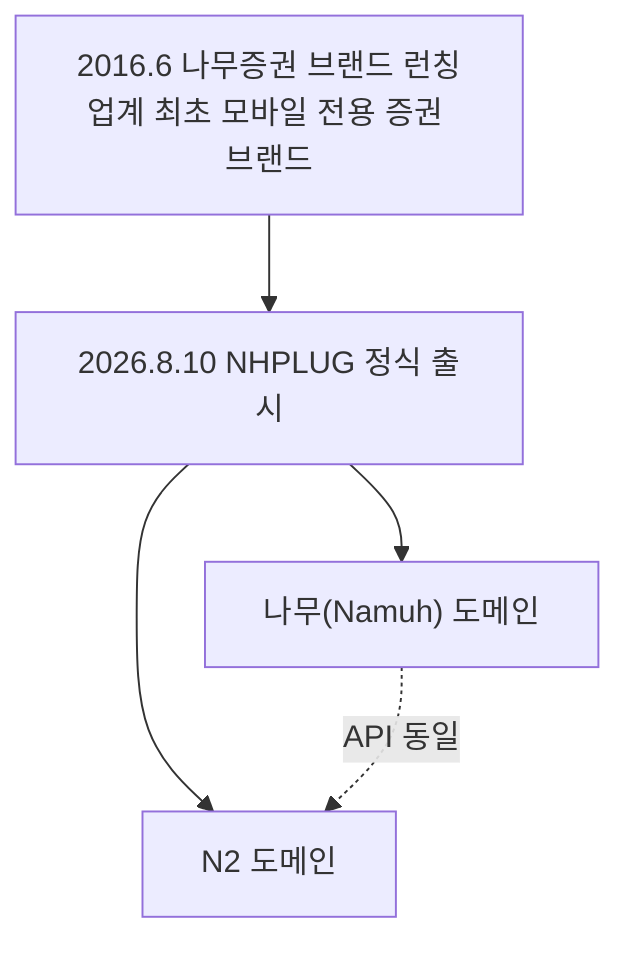

# 15장. 나무증권 (NH투자증권 NHPLUG)

> 공공 Open API 가이드북 — 6부. 증권사 API (민간·참고)
> 확인 상태: 나무증권 브랜드 연혁(나무위키) + PLUG 출시 보도자료 다수 독립 언론사 교차 확인(2026.8.10), 공식 개발자 지원 저장소(PLUG-OpenAPI) 및 다수 실사용 프로젝트에서 도메인·엔드포인트 교차 확인
> **공공데이터 아님** — NH투자증권 계좌 보유자 대상 민간 서비스

| 항목 | 내용 |
|---|---|
| 제공기관 | NH투자증권(민간) |
| 나무증권 브랜드 출범 | 2016년 6월 — 증권업계 최초의 모바일 전용 증권 브랜드 |
| 정식 명칭 | NHPLUG — 2026년 8월 10일 정식 출시된 REST Open API |
| 브랜드(도메인) 2종 | 나무(Namuh) — nhplug.com / N2 — n2plug.com (API는 동일, 도메인만 다름) |
| 전제조건 | NH투자증권 계좌 |
| 인증 방식 | APP_KEY / APP_SECRET → 접근토큰 |
| 거래 수수료 | 국내주식 0.01%, 해외주식 0.09%(업계 최저 표방) |

---

### 0) 연결 고리 (Bridge)

"나무증권"은 별도 회사가 아니라 NH투자증권의 트레이딩 앱/브랜드명입니다. 그런데 이 브랜드 자체가 **한국 증권업계에서 최초의 모바일 전용 증권 브랜드**였다는 걸 이번에 확인했고, 마침 이 책을 쓰는 시점(2026년 9월) 바로 한 달 전인 2026년 8월 10일에 정식 Open API인 NHPLUG가 출시됐습니다. 14장(한국투자증권)이 "2022년의 세대교체"였다면, 이 장은 **아직 잉크도 안 마른 가장 최신 사례**입니다.

---

## 1) 개념 정의 및 필요성

### 1.1 나무증권 브랜드의 기원 — 왜 "나무"인가

나무증권은 NH투자증권의 인터넷 전문 브랜드로, **2016년 6월** 런칭됐습니다. 흥미롭게도 이 런칭 시점이 우연이 아닙니다 — 당시 인터넷전문은행인 케이뱅크의 지분을 NH투자증권이 취득하던 시기와 맞물려 있고, 1금융권 은행들 사이에서 유행하던 "인터넷 전문 브랜드" 트렌드에 증권업계 최초로 동참한 사례로 평가됩니다. 나무위키는 이를 "은행권에서 모바일 뱅크를 내놓은 사례는 있었지만, 증권사에서 모바일 전용 증권 브랜드를 내놓은 것은 업계 최초"라고 기록합니다. 2026년 4월 기준 MAU(월간활성이용자) **249만 명**을 기록할 만큼 성장한 브랜드입니다.

### 1.2 NHPLUG — 정확히 한 달 전에 출시된 신생 API

**핵심 정의**: NHPLUG는 NH투자증권이 국내외 주식·파생·채권·금현물의 시세·계좌·주문 기능을 REST API로 제공하는 서비스입니다. "나무 플러그(Namuh PLUG)"와 "엔투 플러그(N2 PLUG)" 두 브랜드로 **2026년 8월 10일** 동시 정식 출시됐습니다(다수 언론사 동일 날짜 보도로 확인).

출시 보도에서 확인되는 특징들:

- **계좌 통합 연동 강화**: 미성년 계좌, 주문대리인 계좌, 일임계좌 등을 한 번에 연결해 관리할 수 있도록 설계됐습니다.
- **업계 최저 수수료 표방**: API 거래 수수료를 국내주식 0.01%, 해외주식 0.09%로 책정했습니다.
- **생성형 AI 연계**: "복잡한 코딩 지식이 없는 일반 이용자도 생성형 AI를 활용해 자신만의 투자전략을 쉽고 편리하게 구현할 수 있는 환경"을 표방합니다 — 2026년 현재 AI 에이전트 트렌드에 맞춘 포지셔닝으로 보입니다.
- **이름의 유래**: "어디서든 플러그를 꽂듯 누구나 쉽게 연결해 자신만의 투자 전략을 구현하는 새로운 투자 도구"라는 의미를 담았다고 회사 측이 설명합니다.

> **NOTE**: 이 서비스는 이 가이드북에서 다루는 것 중 **가장 최근에 생긴 API**입니다(출시일 기준 이 책 작성 시점보다 한 달 남짓 앞섬). 재조사 결과 공식 SDK(`nhplug` 파이썬 패키지)가 **2026년 7월 31일 v0.1.0으로 정식 기능이 포함된 버전을 출시**한 것을 확인했습니다(인증·토큰캐시·rsp_cd 판정·실시간 WebSocket·종목마스터 파서 포함) — 이전에 확인했던 v0.0.1(기능 없는 사전 공개판)에서 실제로 업그레이드됐습니다. `pip install nhplug`로 바로 설치해 쓸 수 있습니다.

> **WARNING(안전, 매우 중요)**: 공식 저장소(GitHub `PLUG-OpenAPI/nhplug-sdk`)에 "기본 접속 환경은 **운영(api)**이며 주문이 실제로 체결됩니다. 개발·검증은 **모의투자(`moapi.nhplug.com:8443`)**로 전환해서 진행하세요"라고 명시되어 있습니다. 즉 **아무 설정도 안 하면 기본값이 실거래 환경**입니다 — 14장(KIS)이나 다른 증권사 API처럼 "모의투자가 기본이고 실전은 별도 전환"이라고 착각하면 안 됩니다. 테스트 코드를 짤 때 반드시 도메인을 `moapi.nhplug.com`으로 명시적으로 지정하십시오.

### 1.3 왜 14장과 나란히 두는가

14장(한국투자증권)이 2022년에 "업계 최초 OCX 없는 REST API"라는 타이틀을 가져갔다면, NHPLUG는 2026년에 "생성형 AI 연계"라는 새로운 차별점을 들고 나온 후발주자입니다. 두 회사 모두 "일반인도 쉽게 쓸 수 있는 API"를 표방한다는 공통점이 있지만, 4년의 시차 동안 업계의 마케팅 포인트가 "OCX로부터의 해방"에서 "AI 연계"로 옮겨갔다는 게 흥미롭습니다.

---

## 2) 핵심 원리 및 구조

### 2.1 브랜드별 접속 도메인 (공식 확인) — 혼동 주의

| 브랜드 | 운영(Live) | 모의투자(Mock) | 포털 |
|---|---|---|---|
| 나무(Namuh) | `api.nhplug.com:8443` | `moapi.nhplug.com:8443` | www.nhplug.com |
| N2 | `api.n2plug.com:8443` | `moapi.n2plug.com:8443` | www.n2plug.com |

API·필드·엔드포인트는 두 브랜드가 완전히 동일하고, **접속 도메인만 다릅니다.** N2가 별도 브랜드로 함께 출시된 이유는 이번 조사에서 명확히 확인하지 못했지만(관찰), NH투자증권이 나무증권 외에 또 다른 채널·고객층을 위해 병행 운영하는 것으로 보입니다.

> **WARNING**: N2 고객이 설정을 바꿀 때 Base URL, Auth URL, 종목마스터 URL 세 곳을 **전부** n2plug로 바꿔야 합니다. 하나라도 빠뜨리면 그 기능만 조용히 나무(Namuh) 도메인으로 요청이 나가는 것으로 확인됩니다 — 에러도 안 나고 그냥 다른 브랜드로 잘못 붙는 조용한 실패라 특히 위험합니다.

### 2.2 인증 흐름

- 포털(`www.nhplug.com/intro` 또는 `www.n2plug.com/intro`)에서 APP_KEY/APP_SECRET 발급 — NH투자증권 계좌 필요
- 토큰 발급: `POST /oauth2/token` (모의투자에서는 미제공 — **토큰 발급은 운영 도메인 전용**인 것으로 확인)
- 이후 요청은 `POST` 방식이 많고, body에 `{"Input_0": {...}}` 형태로 파라미터를 감싸는 독자적인 요청 구조를 쓰는 것으로 확인됩니다(14장 KIS와 다른 스타일).

> **TIP(실제 확인된 Input_0 필드명 예시)**: 공식 MCP 서버 문서에서 실제 사용 예시가 확인됩니다 — 종목 시세 조회는 `{iem_cd: '005930', market_cd: 'KRX'}` 또는 `{shrn_iscd: '005930'}` 형태로 씁니다. `shrn_iscd`(단축종목코드)처럼 14장에서 본 것과 같은 증권업계 축약형 필드명 관행이 여기도 그대로 나타납니다.

> **WARNING(호출 식별자 두 가지, 혼용 금지)**: 공식 저장소가 명시적으로 경고하는 부분입니다 — **SDK는 URI 경로**(예: `/krstock/quote/v1/currentPrice`)로 API를 지정하고, **MCP(대화형 AI 연동)는 operationId**(예: `krstockQuoteCurrentPrice`, 카멜케이스)로 지정합니다. 이 두 식별자는 이름 변환 규칙이 있을 뿐 서로 그대로 바꿔 쓸 수 없습니다 — MCP에서 쓰던 이름을 SDK 코드에 그대로 넣으면 동작하지 않습니다.

### 2.3 대표 엔드포인트 (실사용 프로젝트에서 확인)

| 기능 | 엔드포인트 |
|---|---|
| 접근토큰발급 | `/oauth2/token`(운영 전용) |
| 국내주식 현재가 | `/krstock/quote/v1/currentPrice` |
| ETF 현재가(+NAV, 괴리율) | `/krstock/quote/v1/etfCurrent` |
| 계좌 목록 | `/n2/acctinfo` |
| 주식 잔고(연속조회 커서 `cts` 사용) | `/krstock/inquiry/v1/balance` |

> **NOTE**: 해외 주식은 매수/매도 가능수량이 `buyableAmount`라는 **하나의 API로 통합**되어 있다는 점이 공식 개발자 문서에서 확인됩니다 — 국내주식과 API 구조가 다를 수 있으니 종목 시장별로 문서를 따로 확인하십시오.



---

## 3) 코드 예제 및 실행 환경

```python
# nhplug_client.py — NHPLUG 최소 클라이언트 (나무 브랜드 기준)
# v1.0, Python 3.11+, requests 2.x
"""
NOTE: 공식 파이썬 SDK(nhplug 패키지, v0.1.0부터 기능 포함)가 이제 존재하므로,
      실제 프로젝트에서는 이 수제 클라이언트 대신 `pip install nhplug`를
      우선 검토하십시오. 아래는 SDK 내부 동작 이해를 위한 최소 골격입니다.
"""
import requests

BASE_URL = "https://moapi.nhplug.com:8443"  # 모의투자. 운영은 api.nhplug.com:8443
AUTH_URL = "https://api.nhplug.com:8443"    # 토큰 발급은 운영 도메인 전용(확인됨)
APP_KEY = "여기에_발급받은_APP_KEY"
APP_SECRET = "여기에_발급받은_APP_SECRET"


def get_access_token() -> str:
    """접근토큰 발급 (운영 도메인에서만 가능)."""
    resp = requests.post(
        f"{AUTH_URL}/oauth2/token",
        json={"appkey": APP_KEY, "appsecret": APP_SECRET},  # 정확한 필드명은 포털 명세 확인 필요
        timeout=10,
    )
    resp.raise_for_status()
    return resp.json()["access_token"]


def get_current_price(access_token: str, stock_code: str) -> dict:
    """국내주식 현재가 조회."""
    resp = requests.post(
        f"{BASE_URL}/krstock/quote/v1/currentPrice",
        headers={"Authorization": f"Bearer {access_token}"},
        json={"Input_0": {"shrn_iscd": stock_code}},  # 실제 확인된 필드명(단축종목코드), 2.2절 TIP 참고
        timeout=10,
    )
    resp.raise_for_status()
    return resp.json()
```

> **WARNING**: `Input_0` 내부 필드명과 토큰 발급 요청 필드명은 포털 문서(www.nhplug.com)의 정식 명세를 기준으로 재확인하십시오 — 이번 조사에서는 존재와 대략적인 구조까지만 확인했습니다. 출시된 지 한 달 남짓이라(1.2절) 명세가 계속 바뀔 가능성도 염두에 두십시오.

---

## 4) 실무 시나리오

- **14장과의 비교 검토**: 두 증권사 API 성격이 유사하므로, 수수료·제공 상품·API 안정성을 비교해 선택하거나 이중화(한쪽 장애 시 대체). NHPLUG는 수수료가 더 낮게 책정된 것으로 확인되므로, 거래 비용에 민감한 전략이라면 비교 대상으로 검토할 가치가 있습니다.
- **연금·ETF 리밸런싱**: 실사용 사례로 연금저축/IRP ETF 포트폴리오 리밸런싱 웹앱이 이 API로 구현된 것이 확인됩니다.
- **생성형 AI 연계 서비스**: 1.2절에서 본 회사의 포지셔닝(코딩 지식 없이 AI로 투자전략 구현)을 그대로 활용해, LLM이 전략을 생성하고 이 API로 실행하는 파이프라인을 설계할 수 있습니다.
- **복잡한 계좌 구조를 다루는 경우**: 미성년 계좌·주문대리인 계좌·일임계좌까지 통합 연동을 지원한다는 점(1.2절)이, 가족 단위 자산관리 서비스 등에서 유용할 수 있습니다.

---

## 5) 트러블슈팅 & 주의사항

| 증상 | 원인 | 조치 |
|---|---|---|
| N2로 전환했는데 일부 기능이 계속 나무로 붙음 | 세 URL 설정 중 일부만 변경 | Base/Auth/종목마스터 URL을 모두 확인 |
| 모의투자 도메인에서 토큰 발급이 안 됨 | 토큰 발급은 운영 전용 | 토큰은 항상 운영 도메인(`api.nhplug.com`)에서 발급받고, 조회/주문만 모의 도메인으로 전환 |
| SDK를 pip install했는데 기능이 없음 | v0.0.1(사전 공개판) 설치했을 가능성 | `pip install --upgrade nhplug`로 v0.1.0 이상 재설치, 또는 GitHub `nhplug-sdk` 저장소의 스니펫 참고 |
| 테스트 중 실제 계좌에서 주문이 체결됨 | 기본 접속 환경이 운영(실거래)임을 모름 | 반드시 `moapi.nhplug.com`으로 명시 전환 후 테스트 |
| SDK 코드에 MCP 도구 이름을 그대로 넣었는데 동작 안 함 | operationId와 URI 경로를 혼용 | SDK는 URI 경로, MCP는 operationId — 문서에서 맞는 식별자로 재확인 |
| 문서와 실제 응답이 다름 | 2026년 8월 출시 직후라 명세가 유동적일 가능성 | 항상 최신 포털 문서 기준으로 재확인, 변경 이력 주기적 모니터링 |

---

## 6) 한 줄 요약

> 💡 **Key Takeaway**: 나무증권은 2016년 업계 최초의 모바일 전용 증권 브랜드였고, NHPLUG는 그 연장선에서 2026년 8월 갓 나온 신생 API입니다. "나무"와 "N2" 두 브랜드가 API는 같고 도메인만 다르다는 것, 그리고 **토큰 발급만은 모의투자 도메인에서 안 되고 항상 운영 도메인**이라는 게 이 API의 특이점입니다.