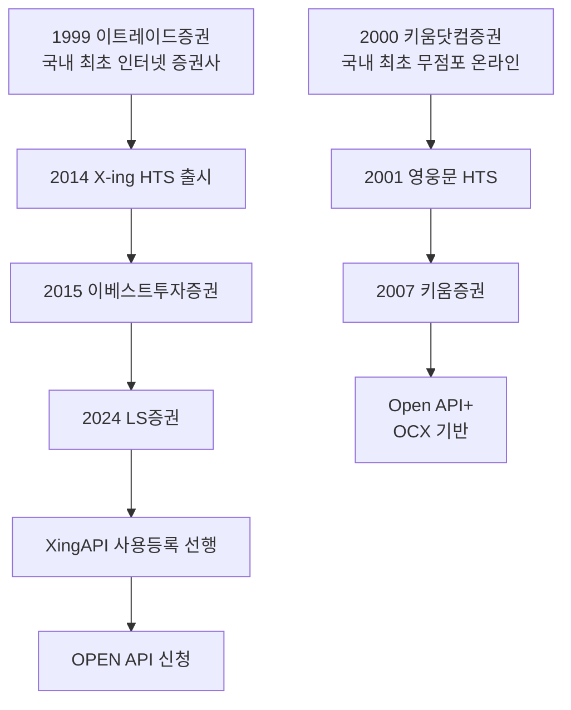

# 16장. 기타 증권사 API 개관 (키움, LS증권)

> 공공 Open API 가이드북 — 6부. 증권사 API (민간·참고)
> 확인 상태: 양사 연혁 공식 홈페이지·위키백과·나무위키 교차 확인, API 아키텍처(OCX/XingAPI) 다수 개발자 문서 확인

| 항목 | 내용 |
|---|---|
| 다루는 증권사 | 키움증권(2000년~), LS증권(1999년~, 구 이트레이드증권→이베스트투자증권) |
| 성격 | 14·15장과 같은 민간 증권사 API — 공공데이터 아님 |
| 공통 전제 | 계좌 개설 필수 |
| 공통점 | 둘 다 각자의 시대에 "국내 최초" 타이틀을 가진 온라인 증권 선구자 |

---

### 0) 연결 고리 (Bridge)

14·15장이 REST 기반의 비교적 현대적인 API(2022년, 2026년 출시)였다면, 이 장에서 다루는 두 곳은 **그보다 훨씬 이전, 온라인 증권거래 자체가 막 시작되던 1999~2000년대 초반에 기술 기반을 다진 회사들**입니다. 이 장은 그 역사가 지금의 API 아키텍처(Windows OCX/COM 기반)에 왜 그대로 남아있는지를 다룹니다.

---

## 1) 개념 정의 및 필요성

### 1.1 두 회사가 각자 쥐고 있는 "국내 최초" 타이틀

**핵심 정의**: 키움증권과 LS증권도 각각 자체 Open API를 제공하지만, 두 곳 모두 **Windows 전용 OCX/COM 컴포넌트 기반의 구세대 API**를 오랫동안 운영해온 이력이 있습니다.

두 회사의 역사를 나란히 보면 흥미로운 대조가 나타납니다.

**LS증권(현재 사명)의 역사**
- **1999년 2월**: 미국 이트레이드증권(E*TRADE), 한국 LG투자증권, 일본 소프트뱅크의 **3개국 합자회사**로 "이트레이드증권"이 설립됩니다 — 공식 기록상 **국내 최초의 인터넷 증권사**입니다.
- 2008년: 이트레이드 재팬이 지분을 매각하며 외국계 색채가 옅어집니다.
- **2014년 9월**: 차세대 HTS **'X-ing'**이 출시됩니다 — 지금 이 장에서 다룰 XingAPI의 이름이 여기서 나왔습니다.
- 2015년 4월: "이베스트투자증권"으로 사명이 바뀝니다.
- 2024년 6월: 대주주가 LS네트웍스로 바뀌며 "LS증권"으로 다시 사명이 바뀝니다.

**키움증권의 역사**
- **2000년 1월 31일**: 다우기술(김익래 회장)이 세운 "키움닷컴증권"으로 설립됩니다 — **국내 최초 100% 온라인(무점포) 증권사**를 표방합니다. 지점 없이 컴퓨터만으로 승부한다는 전략이 당시엔 무모해 보였다는 평가가 있습니다.
- 2000년 7월: 업계 최저 수수료율(0.025%)을 내세워 시장에 충격을 줍니다.
- **2001년 4월**: 신 HTS **'영웅문'**이 출시됩니다 — 이름은 김용의 무협소설 「영웅문」에서 따왔다고 회사 관계자가 밝힌 바 있습니다.
- 2007년 5월: "키움증권"으로 사명이 바뀝니다.
- 이후 주식 매매 브로커리지 점유율에서 **21년 연속 1위**를 지키는 것으로 확인됩니다(2026년 기준).

즉 **LS증권(전신 이트레이드증권)이 "인터넷 증권사"라는 개념 자체를 국내 최초로 들여온 1999년의 선구자**였고, **키움증권은 그 1년 뒤인 2000년에 "지점을 아예 없앤" 더 급진적인 모델로 등장**했습니다. 두 회사 모두 지금 우리가 쓰는 API(XingAPI, Open API+)의 기술적 뿌리가 **2001~2014년, 즉 OCX/COM이 표준이던 시대**에 만들어졌다는 공통점이 있습니다 — 이게 왜 두 회사의 API가 지금까지도 Windows 종속적인 구조를 벗어나지 못했는지에 대한 답이 됩니다.

> **NOTE**: 14장에서 인용한 자료에 따르면 "한국투자증권이 2022년 REST API를 내놓기 전까지, 키움증권·이베스트증권(현 LS증권)·대신증권·한국투자증권 등 다양한 국내 증권사들이 윈도우 COM, OCX, DLL 기반의 API를 제공해왔다"고 명시됩니다 — 즉 이 장에서 다루는 두 회사의 구조는 예외가 아니라, 2022년 이전 업계의 **표준**이었습니다.

### 1.2 왜 이 역사가 실무에 중요한가

두 회사 모두 최근 들어 모바일·AI 등 신기술을 활발히 도입하고 있습니다(LS증권은 MTS에 ChatGPT 기반 AI 투자정보 서비스를 넣었고, "국내 증권사 최초 LME 온라인 거래"·"국내 최초 SPAN 마진 시스템" 같은 새 타이틀도 계속 따내고 있습니다). 하지만 **개발자용 Open API 자체의 아키텍처는 여전히 2000년대~2014년의 유산을 안고 있다**는 게 이 장의 핵심입니다. 회사의 최신 서비스 이미지와 API의 실제 기술 스택 사이에 시차가 있다는 걸 인지하고 있어야, "이렇게 앱은 최신인데 왜 API는 Windows 전용이지?"라는 의문에 당황하지 않습니다.

---

## 2) 핵심 원리 및 구조

### 2.1 키움증권 Open API+

| 항목 | 내용 |
|---|---|
| 아키텍처 | OCX(ActiveX) 기반 — Windows 전용, 32비트 프로세스 필요 |
| Python 접근 | 직접 호출 불가 — PyQt5/PySide2의 `QAxWidget`으로 OCX를 구동해야 함(공식 방식 아닌 커뮤니티 라이브러리 `koapy` 등이 이를 감싸 제공) |
| 브랜드 뿌리 | 2001년 출시된 HTS '영웅문'(1.1절) — 지금도 '영웅문S#' 등으로 브랜드가 이어짐 |
| 특징 | REST API가 아니므로 이 가이드북의 다른 장과 접근 방식이 근본적으로 다름 |

> **WARNING**: 키움 Open API+는 **Linux/macOS에서 직접 쓸 수 없습니다.** 서버에서 자동매매 파이프라인을 돌리려면 Windows 가상머신/서버가 필요하거나, 별도의 REST 중계 서비스를 구성해야 합니다. 이 제약을 모르고 설계를 시작하면 나중에 인프라를 통째로 바꿔야 할 수 있습니다.

### 2.2 LS증권(구 이베스트투자증권) OPEN API

| 항목 | 내용 |
|---|---|
| 포털 | https://openapi.ls-sec.co.kr |
| 전제조건 | LS증권 계좌 개설(법인계좌는 별도 문의) |
| 인증 절차 | 홈페이지 **공동인증서 로그인** → 고객센터에서 xingAPI 사용등록 → OPEN API 신청 → 앱키/시크릿키 발급(보안메일로도 확인 가능) |
| API 이름의 유래 | 2014년 출시된 HTS 'X-ing'(1.1절) — 이름이 그대로 API명(XingAPI)으로 이어짐 |
| 두 갈래 | 일반 OPEN API(App Key/Secret Key 발급) + 모의투자 OPEN API(별도 키 발급 필요) |
| 실시간 시세 | 웹소켓은 별도 포트로 연결 — API 가이드에 표시된 도메인 확인 필요 |

> **NOTE**: LS증권은 XingAPI(구세대, Windows 전용 COM 기반)와 OPEN API(신세대)를 **함께** 운영하는 구조로 확인됩니다. "XingAPI 사용등록"이 OPEN API 신청의 **선행 조건**이라는 점이 실무에서 놓치기 쉬운 부분입니다 — OPEN API만 바로 신청하려 하면 막힐 수 있습니다. 이건 1.1절에서 본 것처럼 2014년 'X-ing' HTS가 먼저 있었고, 그 인증 체계 위에 나중에 OPEN API가 얹힌 역사적 순서 때문으로 보입니다(관찰).



### 2.3 이 장에서 다루지 않은 것

미래에셋증권, 삼성증권, 대신증권(14장에서 언급된 또 다른 구세대 API 보유사) 등 다른 증권사는 이번 조사에서 개별 확인하지 않았습니다. 필요해지면 14·15장과 같은 깊이로 별도 챕터를 추가하는 걸 권장합니다.

---

## 3) 코드 예제 및 실행 환경

이 장은 아키텍처가 서로 달라 공통 코드 예제를 제공하기 어렵습니다. 대신 판단 기준을 코드로 정리합니다.

```python
# broker_api_decision.py — 증권사 API 선택 판단 도우미(의사코드 수준)
"""
서버 환경이 Windows인가?
  Yes → 키움 Open API+ (OCX) 또는 LS증권 XingAPI/OPEN API 모두 후보
        (1.1절: 둘 다 2001~2014년 기술 기반이므로 Windows 종속 전제)
  No(Linux/macOS/컨테이너) → 14장(KIS) 또는 15장(NHPLUG) 같은
                              2022년 이후 순수 REST API만 후보로 고려
"""
```

---

## 4) 실무 시나리오

- **서버 인프라 결정 전에 먼저 확인**: 클라우드 리눅스 컨테이너에 자동매매를 올릴 계획이라면, 키움 OCX 기반 API는 처음부터 배제하고 14·15장(REST)을 우선 검토.
- **기존 Windows 자동화 자산이 있는 경우**: 이미 키움 OCX 기반 매크로/스크립트가 있다면 굳이 REST로 전면 교체하지 않고 유지하는 것도 합리적 선택.
- **LS증권 특유의 저수수료 활용**: XingAPI가 "타 증권사 API에 비해 거래 수수료가 저렴하다"는 평가로 국내 알고리즘 트레이더들에게 인기가 있다는 점이 확인되므로, Windows 환경 제약을 감수할 수 있다면 비용 효율적인 선택지가 될 수 있습니다.
- **회사의 최신 이미지와 API 세대차를 구분**: 두 회사 모두 최근 AI·모바일 기능을 활발히 내놓고 있지만(1.2절), 그게 개발자 API의 아키텍처 개선을 의미하지는 않는다는 걸 프로젝트 착수 전에 확인.

---

## 5) 트러블슈팅 & 주의사항

| 증상 | 원인 | 조치 |
|---|---|---|
| 리눅스 서버에서 키움 API 호출이 아예 안 됨 | OCX는 Windows COM 전용(2.1절) | Windows 환경 구성 또는 REST 기반 증권사(14·15장)로 전환 |
| LS증권 OPEN API 신청이 안 보임 | XingAPI 사용등록을 먼저 안 함(2.2절) | 고객센터 > 매매시스템 > API에서 XingAPI 사용등록을 선행 |
| "이 증권사 앱은 최신인데 API가 왜 이렇게 오래됐지" | 서비스 이미지와 API 아키텍처의 세대차(1.2절) | 회사 홍보자료가 아니라 개발자 문서 기준으로 판단 |

---

## 6) 한 줄 요약

> 💡 **Key Takeaway**: 키움증권(2000년, 무점포 온라인 최초)과 LS증권(1999년, 인터넷 증권사 최초)은 각자의 시대에 선구자였지만, 그 선구자적 지위를 만든 기술 기반(2001년 영웅문, 2014년 X-ing)이 지금까지 API 아키텍처에 그대로 남아있습니다. 증권사 API를 고를 때는 수수료나 기능표보다 **"이 API의 기술적 뿌리가 언제 만들어졌는가"**를 먼저 확인하십시오 — 그게 곧 "OS 제약이 있는가"의 답이 됩니다.