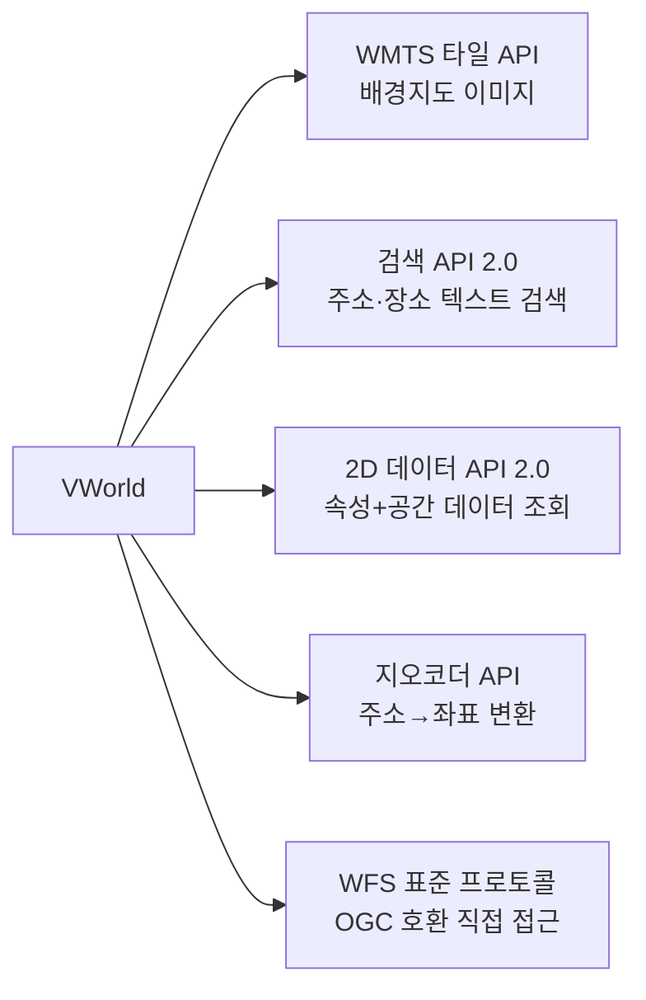

# 17장. VWorld (공간정보 오픈플랫폼)

> 공공 Open API 가이드북 — 7부. 공간·기상
> 확인 상태: 공식 API 레퍼런스(검색·데이터·WMTS·지오코더) 직접 확인 + 다수 실사용 코드(Folium, OpenLayers, QGIS 연동)로 URL 패턴 교차 확인 — **2023~2026년 고도화가 진행 중인 시스템, UI·일부 세부사항은 최신 공지 재확인 권장**

| 항목 | 내용 |
|---|---|
| 소유/운영 | 국토교통부 / 공간정보산업진흥원 |
| 포털 주소 | https://www.vworld.kr |
| 서비스 개시 | 2012년(API는 2013~2014년 확대 제공) |
| 인증 방식 | 회원가입 → 인증키 발급(신청 시 원하는 API 종류를 체크) |
| 개발키 정책 | **최초 발급은 3개월 유효, 최대 3회 연장(총 1년)** — 이후 정식키 전환 절차 별도 |
| 비용 | 무료 |

---

### 0) 연결 고리 (Bridge)

7부는 지도·좌표를 다루는 프로젝트의 backbone입니다. VWorld는 지도 타일, 검색, 공간 데이터, 좌표 변환까지 서로 다른 4~5개의 하위 API로 구성된 플랫폼이라, 각각의 프로토콜과 파라미터 체계를 구분해서 이해해야 실제로 써먹을 수 있습니다. 이 장은 그 기술적 구조를 중심으로 다룹니다.

---

## 1) 개념 정의 및 필요성

**핵심 정의**: VWorld는 국토교통부가 운영하는 공간정보 오픈플랫폼으로, 2D/3D 지도 타일, 공간 데이터(GIS), 주소·장소 검색, 지오코딩(주소↔좌표 변환)을 API로 제공합니다. 2012년 서비스가 개시됐고, 2023~2026년에 걸쳐 4단계 고도화가 진행 중입니다(디지털 트윈국토 플랫폼으로의 전환).

**왜 필요한가**: 여행 지도, 부동산 분석, 지역 통계 시각화 등 "지도 위에 뭔가를 표시"하는 모든 프로젝트의 기반입니다. 민간 지도 API가 유료인 경우가 많은 것과 달리 무료로 제공됩니다.

> **WARNING**: 이 책 집필 시점(2026년 9월)이 VWorld 4단계 고도화 완료 예정 시기와 겹칩니다. 인증키 발급 화면의 UI나 일부 옵션명은 최신 공지로 재확인하는 게 안전합니다.

---

## 2) 핵심 원리 및 구조 — 5개 하위 API의 서로 다른 프로토콜

VWorld는 하나의 통일된 API가 아니라, **각기 다른 프로토콜을 쓰는 5개 하위 시스템의 묶음**입니다. 이 구조를 먼저 이해해야 어떤 상황에 어떤 API를 써야 할지 헷갈리지 않습니다.



### 2.1 좌표계(CRS) — 반드시 먼저 정해야 하는 값

VWorld 대부분의 API는 좌표계를 명시적으로 지정해야 합니다. 확인된 지원 좌표계:

| 코드                              | 이름           | 용도                                   |
| ------------------------------- | ------------ | ------------------------------------ |
| `EPSG:4326`                     | WGS84(위경도)   | 기본값. 대부분의 API에서 생략 시 이 값 사용          |
| `EPSG:900913` (`EPSG:3857`과 동일) | Web Mercator | 웹 지도 타일 표준 좌표계(Google Maps 등과 동일 체계) |

> **WARNING**: 좌표계를 안 맞추면 지도 위 마커 위치가 엉뚱한 곳에 찍힙니다. WMTS 타일(2.3절)과 결합해서 쓸 때는 타일과 마커 좌표계를 반드시 통일하십시오(보통 `EPSG:900913`/`3857`).

### 2.2 인증키 신청 시 API 종류를 체크해야 함 (실무 함정)

인증키를 신청할 때 [브이월드 활용API] 항목에서 원하는 API 종류를 선택하게 되어 있고, **[WMTS/TMS API]가 체크되어 있어야** 타일 지도를 쓸 수 있는 것으로 확인됩니다. 검색 API만 체크하고 지도 타일을 쓰려 하면 인증 실패가 날 수 있습니다.

### 2.3 WMTS 타일 API — 배경지도의 실체

지도를 화면에 표시할 때 실제로 호출되는 건 검색 API가 아니라 **타일 이미지를 주는 WMTS(Web Map Tile Service)** 엔드포인트입니다.

```
https://api.vworld.kr/req/wmts/1.0.0/{인증키}/{배경지도종류}/{z}/{y}/{x}.png
```

| 위치 | 값 | 설명 |
|---|---|---|
| 배경지도종류 | `Base`(기본지도) / `white`(백지도) / `midnight`(야간지도) / `Satellite`(위성지도) / `Hybrid`(하이브리드) | 하이브리드는 도로·지명만 있어 단독 사용 어려움, 다른 배경지도 위에 겹쳐 씀 |
| z / y / x | 정수 | 줌레벨/타일좌표 — Leaflet·OpenLayers 등 대부분의 지도 라이브러리가 이 스킴을 표준으로 지원 |

Capabilities 확인(QGIS 등 GIS 툴 연동용):
```
http://api.vworld.kr/req/wmts/1.0.0/{인증키}/WMTSCapabilities.xml
```

> **TIP**: 이 URL 패턴은 Leaflet의 `L.tileLayer()`, Folium의 `TileLayer()`, OpenLayers의 `XYZ` 소스에 그대로 넣을 수 있는 표준 XYZ 타일 스킴입니다. VWorld 전용 SDK 없이도 기존에 쓰던 지도 라이브러리에 배경지도만 바꿔 끼우는 방식으로 통합할 수 있습니다.

### 2.4 검색 API 2.0 — 전체 파라미터

**요청 URL**: `http://api.vworld.kr/req/search?key=인증키&[파라미터]`

| 파라미터 | 필수 | 설명 |
|---|---|---|
| service | 선택 | search(기본값) |
| version | 선택 | 2.0(기본값) |
| request | 필수 | search |
| key | 필수 | 인증키 |
| query | 필수 | 검색 키워드 |
| type | 선택 | `place`(장소명) / `address`(주소) / `district`(행정구역) |
| category | 선택 | address 검색 시 `road`(도로명) / `parcel`(지번) 구분 |
| bbox | 선택 | 검색 범위를 좌표 경계상자로 제한(성능 최적화에 유용) |
| crs | 선택 | 좌표계(2.1절), 기본 EPSG:4326 |
| format | 선택 | json(기본값) / xml |
| size / page | 선택 | 페이지당 건수(최대 1000) / 페이지 번호 |

**실제 확인된 예제**
```
http://api.vworld.kr/req/search?service=search&request=search&version=2.0
  &crs=EPSG:900913&bbox=14140071.146,4494339.652,14160071.146,4496339.652
  &size=10&page=1&query=공간정보산업진흥원&type=place&format=json&key=[KEY]
```

### 2.5 2D 데이터 API 2.0 — 두 가지 오퍼레이션

| 파라미터 | 필수 | 설명 |
|---|---|---|
| service | 선택 | data(기본값) |
| request | 필수 | **GetFeature**(실제 데이터 조회) 또는 **GetFeatureType**(데이터셋의 스키마·속성 구조 조회) |
| key | 필수 | 인증키 |
| data | 필수 | 조회할 데이터셋의 서비스ID(예: `LP_PA_CBND_BUBUN`=연속지적도, `LT_C_ADSIDO_INFO`=시도 행정경계) |
| attrFilter | 선택 | 속성 필터. 형식: `필드명:연산자:값` (예: `pnu:=:1111010100100010000`) |
| geometry | 선택 | 공간정보(도형) 포함 여부 |
| format / errorFormat | 선택 | json(기본값) / xml — 에러 응답 포맷은 별도 지정 가능 |
| size / page | 선택 | 최대 1000 / 기본 1 |

> **TIP**: 처음 쓰는 데이터셋이면 `GetFeature`로 바로 조회하기 전에 `GetFeatureType`으로 그 데이터셋에 어떤 속성 필드가 있는지 먼저 확인하는 걸 권장합니다 — 그래야 `attrFilter`에 어떤 필드명을 쓸 수 있는지 알 수 있습니다.

### 2.6 지오코더 API — 주소 ↔ 좌표 변환

```
https://api.vworld.kr/req/address?service=address&request=getcoord
  &crs=epsg:4326&address={주소}&type=PARCEL&key={key}
```

| 파라미터 | 설명 |
|---|---|
| request | `getcoord`(주소→좌표) / `getAddress`(좌표→주소, 역지오코딩) |
| type | `PARCEL`(지번주소 기준) / `ROAD`(도로명주소 기준) — 6장에서 다룬 두 주소체계가 여기서도 구분됩니다 |
| address | 변환할 주소 문자열 |

> **NOTE**: `type` 파라미터가 6장(도로명주소)에서 본 지번·도로명 이중 체계를 그대로 반영합니다. 도로명주소로 질의했는데 결과가 없으면 `type=PARCEL`로 지번주소를 시도해보는 게 안전합니다(또는 6장의 도로명주소 API로 먼저 정규화한 뒤 이 API에 넘기는 조합).

### 2.7 WFS 표준 프로토콜 — OGC 방식 직접 접근

2D 데이터 API 2.0과 별개로, VWorld는 **OGC(Open Geospatial Consortium) 표준 WFS 프로토콜**로도 데이터를 제공합니다. QGIS 같은 표준 GIS 툴은 이 방식으로 바로 연결할 수 있습니다.

```
파라미터: SERVICE=WFS, version=1.1.0, request=GetFeature,
          TYPENAME={레이어명}, OUTPUT=text/javascript, SRSNAME=EPSG:4326, key={인증키}
```

> **NOTE**: 2D 데이터 API 2.0(2.5절)과 WFS(이 절)는 **같은 데이터를 서로 다른 프로토콜로 제공하는 것**입니다. 자체 코드를 짤 때는 REST 방식이 익숙한 2.5절 쪽이 편하고, 기존 GIS 툴(QGIS 등)과 연동할 때는 표준 프로토콜인 이 절 쪽이 유리합니다.

---

## 3) 코드 예제 및 실행 환경

### 3.1 배경지도 타일 + 마커 (Folium)

```python
# vworld_map.py — WMTS 타일 배경지도에 지오코딩 결과를 마커로 표시
# v1.0, Python 3.11+, folium, requests
import folium
import requests

API_KEY = "여기에_발급받은_인증키"


def add_vworld_base_layer(map_obj: folium.Map, layer: str = "Base") -> None:
    """2.3절 WMTS 타일 URL 패턴을 그대로 folium TileLayer에 연결."""
    folium.TileLayer(
        tiles=f"https://api.vworld.kr/req/wmts/1.0.0/{API_KEY}/{layer}/{{z}}/{{y}}/{{x}}.png",
        attr="공간정보 오픈플랫폼(브이월드)",
        name="VWorld 배경지도",
    ).add_to(map_obj)


def geocode_address(address: str, addr_type: str = "ROAD") -> tuple[float, float]:
    """2.6절 지오코더 API — 주소를 (위도, 경도)로 변환."""
    resp = requests.get(
        "https://api.vworld.kr/req/address",
        params={
            "service": "address", "request": "getcoord", "crs": "epsg:4326",
            "address": address, "type": addr_type, "format": "json", "key": API_KEY,
        },
        timeout=10,
    )
    resp.raise_for_status()
    point = resp.json()["response"]["result"]["point"]
    return float(point["y"]), float(point["x"])  # folium은 (위도, 경도) 순서


if __name__ == "__main__":
    m = folium.Map(location=[37.5665, 126.9780], zoom_start=12)
    add_vworld_base_layer(m)
    lat, lng = geocode_address("세종특별자치시 도움5로 20")
    folium.Marker([lat, lng], popup="검색 결과").add_to(m)
    m.save("vworld_map.html")
```

### 3.2 공간 데이터 조회 — GetFeatureType으로 스키마 먼저 확인

```python
# vworld_data_client.py — 2.5절 데이터 API 클라이언트
# v1.0, Python 3.11+, requests
import requests

BASE_URL = "http://api.vworld.kr/req/data"
API_KEY = "여기에_발급받은_인증키"
DOMAIN = "여기에_등록한_서비스_URL"  # 데이터API에만 필요


def get_feature_type(dataset_id: str) -> dict:
    """데이터셋의 속성 스키마 확인(첫 사용 전 필수 확인 절차, 2.5절 TIP)."""
    params = {
        "service": "data", "request": "GetFeatureType", "data": dataset_id,
        "key": API_KEY, "domain": DOMAIN, "format": "json",
    }
    resp = requests.get(BASE_URL, params=params, timeout=10)
    resp.raise_for_status()
    return resp.json()


def get_feature(dataset_id: str, attr_filter: str | None = None, size: int = 100) -> dict:
    """실제 공간 데이터 조회."""
    params = {
        "service": "data", "request": "GetFeature", "data": dataset_id,
        "key": API_KEY, "domain": DOMAIN, "format": "json", "size": size,
    }
    if attr_filter:
        params["attrFilter"] = attr_filter
    resp = requests.get(BASE_URL, params=params, timeout=10)
    resp.raise_for_status()
    return resp.json()


if __name__ == "__main__":
    # 연속지적도 예시: 먼저 스키마 확인 후 pnu 필드로 필터링
    schema = get_feature_type("LP_PA_CBND_BUBUN")
    print(schema)
    parcel = get_feature("LP_PA_CBND_BUBUN", attr_filter="pnu:=:1111010100100010000")
    print(parcel)
```

---

## 4) 실무 시나리오

- **여행 지도 프로젝트**: 검색API(2.4절)로 장소를 찾고, WMTS 타일(2.3절)로 배경지도를 그린 뒤, 지오코더(2.6절)로 좌표를 마커에 매핑.
- **부동산·지역 분석**: 2D 데이터API(2.5절)로 연속지적도·행정구역 경계를 가져와, 9장(KOSIS)·18장(SGIS) 통계와 지도 위에 결합. `GetFeatureType`으로 필드 구조를 먼저 확인하는 습관이 시행착오를 줄입니다.
- **6장(도로명주소)과의 역할 분담**: 도로명주소 API는 "주소 자체의 정규화"가 강점이고, VWorld 지오코더는 "지도 좌표 변환·시각화"가 강점입니다. 6장에서 먼저 주소를 정규화한 뒤, 이 장의 지오코더로 좌표를 얻는 조합이 정확도가 높습니다.
- **기존 GIS 인프라와 통합**: QGIS 등 표준 GIS 툴을 이미 쓰고 있다면, REST API(2.5절)보다 WFS 표준 프로토콜(2.7절)로 바로 연결하는 게 별도 코드 작성 없이 빠릅니다.

---

## 5) 트러블슈팅 & 주의사항

| 증상 | 원인 | 조치 |
|---|---|---|
| 지도 타일이 안 뜸 | 인증키 신청 시 [WMTS/TMS API] 미체크(2.2절) | 인증키 관리 화면에서 API 종류 재확인, 필요 시 재신청 |
| 마커 위치가 엉뚱한 곳에 찍힘 | 좌표계 불일치(2.1절) | 타일과 마커 좌표계를 EPSG:900913/3857 또는 4326으로 통일 |
| 데이터API 호출이 계속 실패 | `domain` 파라미터 누락 또는 등록 URL 불일치 | 인증키 신청 시 등록한 서비스 URL과 동일한 값을 `domain`에 전달 |
| 몇 달 뒤 갑자기 인증키가 안 먹힘 | 개발키는 3개월 유효, 최대 3회 연장(2.2절 표) | 만료 전 연장 신청, 장기 운영은 정식키 전환 절차 확인 |
| 도로명주소로 지오코딩했는데 결과 없음 | `type=ROAD`인데 해당 주소가 지번 체계로만 등재됨 | `type=PARCEL`로 재시도(2.6절 NOTE) |
| attrFilter를 썼는데 무시됨 | 존재하지 않는 필드명 사용 | `GetFeatureType`으로 먼저 실제 필드명 확인 |

---

## 6) 한 줄 요약

> 💡 **Key Takeaway**: VWorld는 하나의 API가 아니라 **WMTS(타일)·검색·데이터·지오코더·WFS라는 서로 다른 프로토콜의 묶음**입니다. 지도를 그릴 때는 WMTS 타일 URL을, 좌표를 바꿀 때는 지오코더를, 속성 데이터를 가져올 때는 데이터API(REST) 또는 WFS(표준)를 쓴다는 역할 분담만 정확히 알면 나머지는 수월합니다.