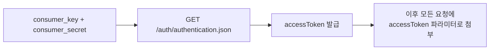
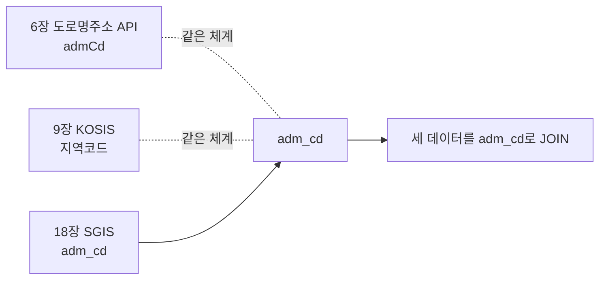

# 18장. SGIS (통계지리정보서비스)

> 공공 Open API 가이드북 — 7부. 공간·기상
> 확인 상태: 인증 흐름·요청 URL·실제 응답 구조(errCd/errMsg 포함) 공식 개발가이드 직접 확인, 데이터API 세부 오퍼레이션 다수 확인. **2026년 9월 기준 재확인 — "통계청" 표기가 "국가데이터처"로 이행 중(9장 KOSIS와 동일 현상)**

| 항목 | 내용 |
|---|---|
| 제공기관 | 국가데이터처(옛 통계청) |
| 포털 주소 | https://sgis.kostat.go.kr/developer |
| API 호출 도메인 | https://sgisapi.kostat.go.kr/OpenAPI3 |
| 인증 방식 | consumer_key + consumer_secret → accessToken 교환(2단계) |
| 비용 | 무료, 일 50,000회 이하 제한 |
| data.go.kr 등재 유형 | LINK(자체 API 인프라로 연결, 3장 공통 패턴과 다름) |

---

### 0) 연결 고리 (Bridge)

17장(VWorld)이 "지도 자체"였다면, 이 장은 "지도 위에 얹을 통계"입니다. 9장(KOSIS)의 통계 데이터를 지역 경계(행정구역 GeoJSON)와 결합하려면 이 장이 필요합니다. 그리고 재확인 과정에서 9장과 똑같은 현상(제공기관 표기의 국가데이터처 이행)이 여기서도 나타나는 걸 확인했습니다.

---

## 1) 개념 정의 및 필요성

**핵심 정의**: SGIS(통계지리정보서비스)는 인구·가구·주택·사업체 등의 통계를 지도 API·데이터 API·모바일 SDK 3갈래로 제공하는 서비스입니다.

**왜 필요한가**: "지역별 인구 변화를 지도로 보여줘" 같은 요구는 KOSIS(통계 수치)만으로는 안 되고, 행정구역 경계 데이터가 있어야 합니다. SGIS가 그 경계 데이터와 통계를 함께 제공합니다.

> **NOTE**: data.go.kr에 "통계청_SGIS(통계지리정보)"와 "국가데이터처_SGIS(통계지리정보)" **두 개의 유사한 등재**가 확인됩니다 — 9장에서 본 정부조직 개편(통계청→국가데이터처)이 진행되며 생긴 과도기적 중복으로 보입니다. 둘 다 같은 서비스를 가리키므로 어느 쪽으로 검색해도 도달 가능합니다.

---

## 2) 핵심 원리 및 구조

### 2.1 인증 흐름 — 2단계 (공식 확인)



**인증 요청**
```
https://sgisapi.kostat.go.kr/OpenAPI3/auth/authentication.json?consumer_key={서비스ID}&consumer_secret={보안Key}
```
응답의 `result.accessToken` 값을 이후 요청에 사용합니다.

> **NOTE**: SGIS의 `consumer_key`/`consumer_secret`은 개발지원센터(마이페이지)에서 발급받으며, KOSIS처럼 인증키 하나가 아니라 **키 쌍(2개)**을 관리해야 한다는 점이 다릅니다.

### 2.2 실제 응답 구조 — 공통 성공/실패 판별 필드 (공식 확인)

SGIS의 모든 API는 아래 공통 봉투(envelope) 구조로 응답합니다.

```json
{
  "id": "API_0307",
  "result": [ /* 실제 데이터 */ ],
  "errMsg": "Success",
  "errCd": 0,
  "trId": "*oQi_API_0307_1419239511295"
}
```

| 필드 | 설명 |
|---|---|
| `errCd` | **0이면 성공**, 0이 아니면 오류 코드 |
| `errMsg` | 오류/성공 메시지("Success" 등) |
| `result` | 실제 데이터(API마다 배열 또는 객체) |
| `id` / `trId` | API 식별자 / 거래추적ID(로그 대조용) |

> **TIP**: 응답이 HTTP 200으로 와도 `errCd`가 0이 아니면 실패입니다. HTTP 상태코드만으로 성공 여부를 판단하는 코드를 짜면 이 봉투 구조 때문에 실패를 성공으로 오판할 수 있습니다 — 반드시 `errCd`를 먼저 확인하십시오.

### 2.3 API 3갈래와 실제 엔드포인트 예시

| 구분 | 용도 | 요청 URL 예시(공식 확인) |
|---|---|---|
| 지도 API | 행정구역 경계 등 지도 표시 | `.../boundary/hadmarea.geojson?accessToken={토큰}&year=2010&adm_cd=11` |
| 데이터 API — 통계 | 인구·가구 통계 | `.../stats/household.json` (가구 통계, 응답 필드: `adm_cd`, `adm_nm`, `population`, `farm_cnt` 등) |
| 데이터 API — 통계주제도 | 미리 가공된 주제별 지도 데이터 | `.../themamap/CTGR_001/data.json` (인구·가구 카테고리, 연도별 시계열 포함) |
| 모바일 SDK | Android/iOS Native 지도 서비스 | 별도 SDK 다운로드 |

> **NOTE**: `themamap`(통계주제도) API는 단순 원자료가 아니라 **이미 통계청이 가공한 지표**(예: "15세 미만 유소년 인구 변화", "주택당 평균 가구원 현황")를 시계열(`yearInfo`)과 함께 제공합니다. 원자료를 직접 계산할 필요 없이, 이미 만들어진 주제도가 필요에 맞으면 이쪽이 훨씬 빠릅니다.

### 2.4 행정구역코드(adm_cd) — SGIS 생태계의 공통 키

이 장의 모든 API 응답에서 `adm_cd`(행정구역코드)가 반복해서 등장합니다. 이 코드는 9장(KOSIS)의 지역별 통계, 6장(도로명주소)의 행정구역코드(`admCd`)와 **같은 체계**를 공유하는 것으로 보입니다(관찰) — 즉 이 코드 하나로 KOSIS 통계·도로명주소·SGIS 경계 데이터를 서로 연결(join)할 수 있다는 뜻입니다.



---

## 3) 코드 예제 및 실행 환경

```python
# sgis_client.py — SGIS 클라이언트
# v1.0, Python 3.11+, requests 2.x
import requests

AUTH_URL = "https://sgisapi.kostat.go.kr/OpenAPI3/auth/authentication.json"
HOUSEHOLD_URL = "https://sgisapi.kostat.go.kr/OpenAPI3/stats/household.json"
BOUNDARY_URL = "https://sgisapi.kostat.go.kr/OpenAPI3/boundary/hadmarea.geojson"
CONSUMER_KEY = "여기에_발급받은_서비스ID"
CONSUMER_SECRET = "여기에_발급받은_보안Key"


def get_access_token() -> str:
    """2단계 인증: consumer_key/secret으로 accessToken 교환."""
    resp = requests.get(
        AUTH_URL,
        params={"consumer_key": CONSUMER_KEY, "consumer_secret": CONSUMER_SECRET},
        timeout=10,
    )
    resp.raise_for_status()
    return resp.json()["result"]["accessToken"]


def _check_success(payload: dict) -> dict:
    """2.2절 공통 봉투 구조 — errCd로 성공 여부 판별(HTTP 200이어도 실패 가능)."""
    if payload.get("errCd") != 0:
        raise RuntimeError(f"SGIS API 오류(errCd={payload.get('errCd')}): {payload.get('errMsg')}")
    return payload["result"]


def get_household_stats(access_token: str, adm_cd: str) -> list:
    """가구 통계 조회."""
    resp = requests.get(
        HOUSEHOLD_URL,
        params={"accessToken": access_token, "adm_cd": adm_cd},
        timeout=10,
    )
    resp.raise_for_status()
    return _check_success(resp.json())


def get_hadmarea_boundary(access_token: str, year: str, adm_cd: str) -> dict:
    """행정구역 경계(GeoJSON) 조회."""
    resp = requests.get(
        BOUNDARY_URL,
        params={"accessToken": access_token, "year": year, "adm_cd": adm_cd},
        timeout=10,
    )
    resp.raise_for_status()
    return resp.json()  # 경계 API는 GeoJSON 자체를 반환(2.2절 봉투 구조와 다를 수 있음)


if __name__ == "__main__":
    token = get_access_token()
    print(get_household_stats(token, adm_cd="11030"))  # 용산구
    print(get_hadmarea_boundary(token, year="2010", adm_cd="11"))  # 서울
```

---

## 4) 실무 시나리오

- **인구·지역 분석 지도**: 9장(KOSIS) 지역별 통계 + 이 장의 행정구역 경계 GeoJSON을 `adm_cd`로 결합해 코로플레스(choropleth) 지도 제작.
- **17장(VWorld)과 결합**: 배경지도는 VWorld, 통계 오버레이는 SGIS 데이터로 역할 분담.
- **빠른 프로토타이핑**: 원자료를 직접 계산하기보다, 2.3절의 `themamap`(통계주제도) API로 이미 가공된 지표를 먼저 확인 — 필요한 지표가 이미 있으면 개발 시간을 크게 줄일 수 있습니다.
- **6·9·18장 데이터 조인**: `adm_cd`를 공통 키로 삼아 도로명주소·KOSIS 통계·SGIS 경계 데이터를 하나의 분석 테이블로 결합.

---

## 5) 트러블슈팅 & 주의사항

| 증상 | 원인 | 조치 |
|---|---|---|
| 요청마다 401/인증 오류 | accessToken 없이 바로 데이터 API 호출 | 반드시 먼저 인증 API로 accessToken을 받아온 뒤 사용 |
| HTTP 200인데 데이터가 이상함 | `errCd`를 확인하지 않음(2.2절) | 응답 봉투의 `errCd`가 0인지 항상 먼저 확인 |
| accessToken이 만료됨 | 토큰 유효시간 경과(정확한 시간은 공식 문서 재확인 필요) | 만료 시 재인증하여 새 토큰 발급 |
| 일 50,000회 제한 초과 | 대량 배치 호출 | 배치 스케줄 분산 또는 트래픽 증설 문의 |
| "통계청"과 "국가데이터처" 등재가 둘 다 있어 헷갈림 | 정부조직 개편 과도기(1절 NOTE) | 같은 서비스이므로 아무 쪽이나 신청해도 무방 |

---

## 6) 한 줄 요약

> 💡 **Key Takeaway**: SGIS는 인증키가 하나가 아니라 **consumer_key/secret → accessToken** 2단계이고, 응답도 HTTP 상태코드가 아니라 **`errCd` 필드로 성공 여부를 판별**해야 합니다. `adm_cd`라는 공통 키로 6장·9장 데이터와 조인할 수 있다는 것도 기억해두면 활용도가 크게 늘어납니다.