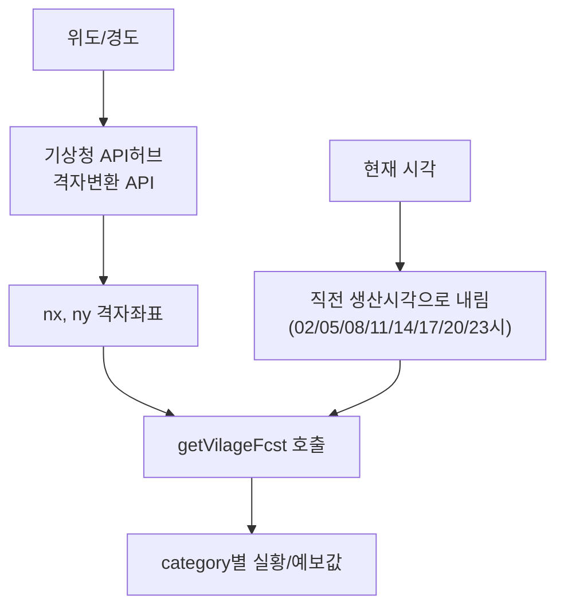

# 19장. 기상자료개방포털

> 공공 Open API 가이드북 — 7부. 공간·기상
> 확인 상태: 단기예보 API 요청/응답 공식 페이지 직접 확인(수정일 2025-11-19 최신판 기준), 다수 독립 구현체 교차 확인. **2026년 9월 재확인 — 기상청 API허브(apihub.kma.go.kr)라는 신규 병행 포털 발견, 위경도→격자 변환 공식 API 확인**

| 항목 | 내용 |
|---|---|
| 제공기관 | 기상청(국가기후데이터센터) |
| 기존 경로 | 공공데이터포털 게이트웨이 — `apis.data.go.kr/1360000/VilageFcstInfoService_2.0` |
| **신규 경로(재조사로 확인)** | **기상청 API허브 — `apihub.kma.go.kr`, `authKey` 파라미터 방식** |
| 인증 방식 | data.go.kr serviceKey(기존) 또는 API허브 authKey(신규) — 둘 다 현재 병행 운영 확인 |
| 비용 | 무료 |
| 격자 규모 | 5km×5km, 동서 149 × 남북 253 = **총 37,697개 격자** |
| 데이터 보유기간 | 2008년 10월 30일 17:00(KST)부터 현재까지 |

---

### 0) 연결 고리 (Bridge)

7부의 마지막 장입니다. 17장(VWorld, 공간)·18장(SGIS, 통계+공간)에 이어, 이 장은 "시간에 따라 바뀌는 공간 데이터"인 날씨를 다룹니다. 그런데 재조사 중 이 시스템에 **아직 이 책의 다른 어떤 판에도 반영되지 않은 새 경로**가 생긴 걸 발견했습니다.

---

## 1) 개념 정의 및 필요성

**핵심 정의**: 기상청은 초단기실황·초단기예보·단기(동네)예보 등을 REST API로 제공합니다. 동네예보는 전국을 **5km×5km 격자**(동서 149칸×남북 253칸, 총 37,697개)로 나눠, 하루 8회(02·05·08·11·14·17·20·23시) 읍·면·동 단위로 상세 날씨를 발표하는 체계입니다.

> **NOTE(경로 이원화, 신규 확인)**: 현재 두 개의 접근 경로가 **병행 운영** 중인 것으로 확인됩니다.
> 1. **기존**: 공공데이터포털 게이트웨이(`apis.data.go.kr/1360000/VilageFcstInfoService_2.0`) — data.go.kr에서 `serviceKey` 발급, 3장 공통 패턴 그대로 적용. 이 등재는 2025년 11월 19일에도 계속 수정되고 있어 활발히 유지보수되는 것으로 보입니다.
> 2. **신규**: **기상청 API허브**(`apihub.kma.go.kr`) — 기상청이 직접 운영하는 별도 포털로, 인증 파라미터명이 `authKey`로 다릅니다(`.../getVilageFcst?...&authKey={인증키}`). data.go.kr에도 "기상청_단기예보 조회서비스(**기상청API허브 연계**)"라는 이름으로 별도 등재되어 있습니다.
>
> 두 경로 중 어느 쪽이 장기적으로 표준이 될지는 이번 조사로 확정할 수 없었습니다. 신규 프로젝트라면 기상청이 직접 운영하는 API허브 쪽을 우선 검토하는 게 안전할 수 있습니다(1.2절에서 이 포털의 강점을 더 다룹니다).

---

## 2) 핵심 원리 및 구조

### 2.1 단기예보 조회서비스 — 전체 파라미터 확인(기존 경로 기준)

**서비스 URL**: `http://apis.data.go.kr/1360000/VilageFcstInfoService_2.0`

| 오퍼레이션 | 설명 |
|---|---|
| getUltraSrtNcst | 초단기실황(현재 관측값) |
| getUltraSrtFcst | 초단기예보(6시간 이내) |
| getVilageFcst | 단기(동네)예보(3일치) |
| getFcstVersion | 예보버전 정보 |

| 요청변수 | 필수 | 설명 |
|---|---|---|
| ServiceKey | Y | data.go.kr 인증키 |
| pageNo | Y | 페이지 번호 |
| numOfRows | Y | 결과 수 |
| dataType | Y | XML(기본)/JSON |
| base_date | Y | 발표일자(YYYYMMDD) |
| base_time | Y | 발표시각(정시 단위, 예: 0600) |
| nx | Y | 예보지점 X 좌표(격자) |
| ny | Y | 예보지점 Y 좌표(격자) |

**응답 필드(공식 확인)**: resultCode, resultMsg, numOfRows, pageNo, totalCount, baseDate, baseTime, nx, ny, **category**(자료구분코드 — 예: RN1=1시간강수량, T1H=기온, UUU/VVV=풍속성분, WSD=풍속), **obsrValue**(실황 값, 실수)

### 2.2 위경도 ↔ 격자좌표 — 이제 직접 계산 안 해도 됨 (핵심 업데이트)

이전에는 `nx`/`ny`가 위경도가 아니라 기상청 자체 격자좌표라서 **개발자가 직접 변환 공식을 구현**해야 한다고 설명했습니다. 재조사 결과, **기상청 API허브에 이 변환을 대신 해주는 공식 API가 있는 것**이 확인됩니다.

```
기능: 임의 위·경도 → 인근 동네예보 격자 번호 변환
변수: lon(경도), lat(위도)
포털: apihub.kma.go.kr
```

> **TIP**: 커뮤니티에 떠도는 격자 변환 수식(Lambert Conformal Conic 좌표 변환)을 직접 구현하거나 검증할 필요 없이, 이 공식 API에 위경도를 넘기면 바로 `nx`/`ny`를 받을 수 있습니다. 다만 이 API 자체도 호출이 필요하므로, 좌표가 자주 바뀌지 않는 서비스라면 변환 결과를 캐싱해두는 게 효율적입니다.

> **WARNING**: 여전히 `nx`/`ny`를 위경도 그대로 넣는 실수가 가장 흔합니다(다수 개발자 문서에서 반복 지적). 변환 API를 거치지 않은 좌표를 그대로 쓰면 엉뚱한 지역 데이터가 나옵니다.

### 2.3 발표 주기와 base_time — 생산 스케줄에 맞춰야 함

동네예보(단기예보)는 **1일 8회**(02, 05, 08, 11, 14, 17, 20, 23시)만 생산됩니다. 임의의 현재 시각을 `base_time`에 그대로 넣으면 안 되고, 직전 생산 시각으로 내림 처리해야 합니다.



### 2.4 API허브의 추가 이점 — TEXT 포맷과 전용 인증

data.go.kr에 등재된 "기상청_단기예보 조회서비스(기상청API허브 연계)" 항목은 **API 유형이 TEXT**로 별도 표기되어 있어, 기존 REST(JSON/XML) 경로와 응답 형식 자체가 다를 수 있습니다. API허브 쪽 활용신청 URL 예시도 확인됩니다.

```
https://apihub.kma.go.kr/api/typ02/openApi/VilageFcstInfoService_2.0/getVilageFcst
  ?pageNo=1&numOfRows=1000&dataType=JSON&base_date=...&base_time=...&nx=...&ny=...&authKey={인증키}
```

---

## 3) 코드 예제 및 실행 환경

```python
# kma_client.py — 기상청 단기예보 클라이언트 (기존 경로 + 격자변환 API 결합)
# v1.1, Python 3.11+, requests 2.x
import requests

DATAGOKR_BASE = "http://apis.data.go.kr/1360000/VilageFcstInfoService_2.0"
APIHUB_GRID_CONVERT_URL = "https://apihub.kma.go.kr/api/typ01/url/latlon2grid.php"  # 실제 경로는 포털 최신 명세로 재확인 필요
SERVICE_KEY = "여기에_발급받은_serviceKey"


def latlon_to_grid(lat: float, lon: float) -> tuple[int, int]:
    """2.2절 — 기상청 API허브의 위경도→격자변환 API 호출(직접 수식 구현 불필요)."""
    resp = requests.get(
        APIHUB_GRID_CONVERT_URL, params={"lon": lon, "lat": lat}, timeout=10
    )
    resp.raise_for_status()
    # WARNING: 응답 파싱 형식은 이번 조사에서 확정하지 못했습니다. 실제 호출 후 구조 확인 필요.
    data = resp.json()
    return data["nx"], data["ny"]


def get_village_forecast(base_date: str, base_time: str, nx: int, ny: int) -> dict:
    """단기(동네)예보 조회. 2.3절 — base_time은 반드시 생산시각(02/05/08/.../23시)에 맞출 것."""
    params = {
        "ServiceKey": SERVICE_KEY,
        "pageNo": 1,
        "numOfRows": 1000,
        "dataType": "JSON",
        "base_date": base_date,
        "base_time": base_time,
        "nx": nx,
        "ny": ny,
    }
    resp = requests.get(f"{DATAGOKR_BASE}/getVilageFcst", params=params, timeout=10)
    resp.raise_for_status()
    return resp.json()


if __name__ == "__main__":
    nx, ny = latlon_to_grid(lat=37.5665, lon=126.9780)  # 서울시청
    print(get_village_forecast(base_date="20261001", base_time="0500", nx=nx, ny=ny))
```

**실행**
```powershell
python -m venv .venv
.venv\Scripts\activate
pip install requests
python kma_client.py
```

---

## 4) 실무 시나리오

- **여행 일정 추천**: 17장(VWorld) 지도 위 관광지 좌표를 2.2절의 변환 API로 격자좌표로 바꿔 일자별 날씨를 붙여 추천 로직에 반영.
- **뉴스/이슈 자동 요약**: 지역 이상기후·특보 발생 시 자동 알림 파이프라인.
- **행사·야외활동 안내**: 초단기실황(`getUltraSrtNcst`)으로 "지금 비가 오는지"를 실시간 반영.
- **신규 프로젝트는 API허브 우선 검토**: 1.1절에서 본 대로 두 경로가 병행 중이지만, 기상청이 직접 운영하는 API허브 쪽이 격자변환 등 부가 기능을 함께 제공하므로 새로 시작하는 프로젝트는 이쪽을 먼저 검토하는 게 유리할 수 있습니다.

---

## 5) 트러블슈팅 & 주의사항

| 증상 | 원인 | 조치 |
|---|---|---|
| 엉뚱한 지역 데이터가 나옴 | 위경도를 nx/ny에 그대로 사용 | 2.2절의 격자변환 API를 거치거나, 공식 활용가이드의 격자 대조표 사용 |
| 특정 시각에 데이터가 없음 | 정시 발표 전 base_time 사용, 또는 생산 주기(1일 8회)에 안 맞는 시각 | 2.3절 기준 직전 생산시각으로 보정 |
| 구버전 `newsky2.kma.go.kr` 예제가 안 됨 | 구도메인 | `apis.data.go.kr/1360000/...` 또는 신규 `apihub.kma.go.kr`로 교체 |
| data.go.kr과 API허브 응답 구조가 다름 | 두 경로가 별도 시스템(1.1절) | 프로젝트 내에서 한쪽 경로로 통일, 혼용 금지 |
| category 코드값의 의미를 모르겠음 | 코드-의미 매핑을 안 외워둠 | RN1=강수량, T1H=기온, UUU/VVV=풍속성분, WSD=풍속 등 활용가이드의 코드표 참고 |

---

## 6) 한 줄 요약

> 💡 **Key Takeaway**: 기상청 API는 현재 **data.go.kr 경로와 API허브(apihub.kma.go.kr) 경로가 병행 운영** 중이며, 후자는 위경도→격자변환을 대신 해주는 공식 API까지 제공합니다. `nx`/`ny`를 위경도로 착각하는 실수는 여전히 가장 흔하지만, 이제는 직접 수식을 구현하지 않고 공식 API로 해결할 수 있습니다.