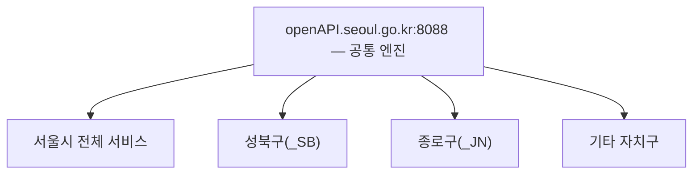

# 20장. 서울 열린데이터광장 + 지자체 공통 패턴

> 공공 Open API 가이드북 — 8부. 지역 데이터
> 확인 상태: 요청 URL 구조·공통 응답 필드 공식 페이지 직접 확인, 3개 자치구(성북·종로 등)의 동일 엔진 재사용 실제 확인, 메타 API(입출력 인자 조회) 존재 확인

| 항목 | 내용 |
|---|---|
| 제공기관 | 서울특별시 |
| 포털 주소 | https://data.seoul.go.kr |
| 요청주소 | http://openAPI.seoul.go.kr:8088 |
| 인증 방식 | 회원가입 → Open API 인증키 신청 |
| 비용 | 무료(호출 제한 있음, 2.3절 참고) |
| 활용 우선순위 | 지자체 단위 지역·교통·정책 분석 프로젝트 |

---

### 0) 연결 고리 (Bridge)

이 가이드북의 마지막 확정 장입니다. 지금까지는 전국 단위 API였다면, 이 장은 "특정 지자체" 단위 데이터를 다룹니다. 그리고 조사 중 예상 밖의 구조를 하나 더 확인했습니다 — 서울시뿐 아니라 여러 자치구가 완전히 같은 API 엔진을 공유하며, 심지어 **자기 API 전체의 파라미터를 스스로 조회해주는 메타 API**까지 있다는 겁니다.

---

## 1) 개념 정의 및 필요성

**핵심 정의**: 서울 열린데이터광장은 서울시가 보유한 교통·복지·환경·행정·문화·관광 등 전 분야 데이터를 Open API로 제공하는 플랫폼입니다.

**왜 필요한가**: 서울 지역을 대상으로 한 정책·교통·상권 분석 프로젝트의 표준 데이터 원천입니다.

---

## 2) 핵심 원리 및 구조

### 2.1 요청 URL 구조 — 경로 기반(ECOS·서울시 공통 스타일)

```
http://openAPI.seoul.go.kr:8088/{KEY}/{TYPE}/{SERVICE}/{START_INDEX}/{END_INDEX}/
```

| 변수 | 필수 | 설명 |
|---|---|---|
| KEY | Y | 발급받은 인증키 |
| TYPE | Y | xml / xmlf(xml파일) / xls(엑셀파일) / json |
| SERVICE | Y | 서비스명(예: `LOCALDATA_031302_SD`) |
| START_INDEX | Y | 요청 시작위치(정수) |
| END_INDEX | Y | 요청 종료위치(정수) |

> **NOTE**: 10장(ECOS)과 마찬가지로 **쿼리스트링이 아니라 URL 경로에 값을 순서대로 나열**하는 구조입니다.

### 2.2 모든 API가 공유하는 공통 응답 필드 (공식 확인)

여러 서울시 API(공공자전거 대여이력, 소통 돌발정보, 돌발 유형 코드 등)의 공식 설명을 대조한 결과, **개별 데이터 필드 앞에 항상 세 가지 공통 필드**가 먼저 옵니다.

| 공통 필드 | 설명 |
|---|---|
| 총 데이터 건수 | **정상 조회 시에만 출력**됨(오류 시 없음 — 이걸로 성공 여부 판별 가능) |
| 요청결과 코드 | — |
| 요청결과 메시지 | — |

그 뒤에 API별 고유 필드(예: 공공자전거는 대여소·거치율, 돌발정보는 도로 축 코드·링크 ID 등)가 이어집니다.

> **TIP**: "총 데이터 건수" 필드의 유무로 성공/실패를 먼저 판별하고, 그다음 개별 필드를 파싱하는 2단계 처리 구조를 코드에 반영하면 여러 서울시 API에 공통으로 재사용할 수 있습니다.

### 2.3 호출 제한 — API마다 다른 세부 제약 (실제 사례로 확인)

기본 원칙(1회 최대 1,000건, 실시간 지하철만 1일 1,000회 별도)에 더해, **API마다 개별적인 추가 제약**이 있다는 걸 실제 사례로 확인했습니다.

| API 예 | 추가 제약(공식 확인) |
|---|---|
| 공공자전거 대여 이력 | 최근 **7일 이내**만 조회 가능, 대여시간이 '시간' 단위로만 표시(분 단위 없음) |
| 소통 돌발 도로별 링크 정보 | 원본이 서울시 교통정보시스템(TOPIS) 연계 — 별도 도로 축 코드 필요 |

> **WARNING**: "1회 1,000건"이라는 공통 규칙만 기억하고 API별 추가 제약(조회 가능 기간 등)을 확인하지 않으면, 예상보다 훨씬 적은 데이터만 받고도 원인을 못 찾는 경우가 생깁니다. API 신청 전 해당 데이터의 설명(원본 시스템, 제약사항)을 반드시 읽으십시오.

### 2.4 메타 API — API 자체의 파라미터를 조회하는 API (신규 확인)

서울 열린데이터광장은 "서울특별시_열린데이터광장 Open API 입출력 인자 조회"라는, **다른 모든 API의 요청/응답 파라미터 명세를 그 자체로 조회할 수 있는 메타 API**를 제공합니다.

```
요청인자: 인증키, 요청파일타입, 서비스명, 요청시작위치, 요청종료위치, 서비스ID
출력값: 총 데이터 건수, 요청결과 코드/메시지, 서비스 ID/명, 인자 구분, 영문변수, 한글변수, 요청변수타입, 설명
```

> **TIP**: 이건 3장(공공데이터포털)의 검색 API와 비슷한 발상이지만 범위가 다릅니다 — 3장 검색 API가 "어떤 데이터셋이 있는지" 찾아주는 거라면, 이 메타 API는 **이미 알고 있는 특정 서비스ID의 정확한 파라미터 스펙을 코드로 조회**할 수 있게 해줍니다. 수십 개의 서울시 API를 다루는 프로젝트라면, 이 메타 API로 파라미터 매핑 테이블을 자동 생성하는 스크립트를 만들어둘 가치가 있습니다.

### 2.5 지자체 공통 패턴 — 3개 자치구에서 실제 확인

강남구·종로구·성동구뿐 아니라 이번 재조사에서 **성북구·종로구를 포함한 여러 자치구 열린데이터광장**을 직접 대조한 결과, 전부 동일한 요청주소(`openAPI.seoul.go.kr:8088`)와 동일한 샘플 URL 패턴을 그대로 쓰는 것이 재확인됩니다.

```
성북구: http://openapi.seoul.go.kr:8088/sample/xml/LOCALDATA_010110_SB/1/5/
종로구: http://openapi.seoul.go.kr:8088/sample/xml/LOCALDATA_093008_JN/1/5/
```

서비스명 끝의 2글자 접미사(`_SB`, `_JN`, `_SD` 등)가 자치구를 구분하는 코드로 보입니다(관찰).



> **TIP**: 자치구별로 API 구조를 새로 배울 필요 없이, 인증키와 서비스명(SERVICE 코드)만 그 자치구 사이트에서 확인하면 2.1~2.2절의 구조를 그대로 재사용할 수 있습니다.

---

## 3) 코드 예제 및 실행 환경

```python
# seoul_open_data_client.py — 서울 열린데이터광장 클라이언트
# v1.1, Python 3.11+, requests 2.x
import requests
import xml.etree.ElementTree as ET

BASE_URL = "http://openAPI.seoul.go.kr:8088"
API_KEY = "여기에_발급받은_인증키"


def call_seoul_api(service: str, start_index: int = 1, end_index: int = 5, data_type: str = "json") -> dict:
    """서울시(또는 이 엔진을 공유하는 자치구) Open API 공통 호출 헬퍼."""
    url = f"{BASE_URL}/{API_KEY}/{data_type}/{service}/{start_index}/{end_index}/"
    resp = requests.get(url, timeout=10)
    resp.raise_for_status()
    return resp.json()


def get_api_spec(service_id: str) -> dict:
    """2.4절 — 메타 API로 특정 서비스ID의 파라미터 명세를 코드로 조회.

    WARNING: 메타 API 자체의 정확한 서비스명(예시의 "OA-11021"은 추정치)은
             이번 조사에서 확정하지 못했습니다. data.seoul.go.kr에서
             "Open API 입출력 인자 조회"를 검색해 실제 서비스명으로 교체하십시오.
    """
    return call_seoul_api("OA-11021", start_index=1, end_index=100, data_type="json")


def is_success(response: dict, root_key: str) -> bool:
    """2.2절 — '총 데이터 건수' 필드 유무로 성공 여부 1차 판별.

    WARNING: 실제 JSON 응답의 최상위 키 이름과 '총 데이터 건수' 필드의
             영문 키(예: list_total_count)는 API마다 다를 수 있어 이번
             조사에서 통일된 값을 확정하지 못했습니다. 실제 응답을 한 번
             출력해 정확한 키 이름을 확인한 뒤 이 함수를 조정하십시오.
    """
    body = response.get(root_key, {})
    return "list_total_count" in body or "총건수" in str(body)


if __name__ == "__main__":
    bike_data = call_seoul_api("bikeList", start_index=1, end_index=5)  # 예시 서비스명, 실제 명은 신청 화면에서 확인
    print(bike_data)
```

---

## 4) 실무 시나리오

- **서울 상권·교통 분석**: 5부(금융)·9장(KOSIS)의 전국 통계와 서울시 세부 데이터를 결합해 지역 단위 분석 해상도를 높임.
- **자치구 단위 서비스 확장**: 서울시 대상 서비스를 만든 뒤, 2.5절의 공통 엔진 구조를 활용해 특정 자치구 전용 데이터로 손쉽게 확장.
- **다수 API를 다루는 프로젝트의 파라미터 자동화**: 2.4절의 메타 API로 사용할 서비스ID들의 파라미터 명세를 미리 긁어와 코드 생성기를 만들면, 수동으로 문서를 하나씩 찾아보는 수고를 줄일 수 있습니다.
- **다른 지역 데이터포털과의 관계**: 경기데이터드림·부산데이터웨이브 등 타 시도 데이터포털은 이번 조사에서 서울시와 같은 엔진을 공유하는지 확인하지 못했습니다 — 개별 확인 필요.

---

## 5) 트러블슈팅 & 주의사항

| 증상 | 원인 | 조치 |
|---|---|---|
| 1,000건 넘는 데이터가 한 번에 안 옴 | 1회 호출 최대 1,000건 제한 | START_INDEX/END_INDEX를 나눠 반복 호출 |
| 지하철 API가 하루만에 막힘 | 1일 1,000회 별도 제한 | 활용사례 등록 후 승인받아 제한 해제 신청 |
| 특정 API에서 예상보다 적은 기간만 조회됨 | API별 개별 제약(예: 7일 이내만, 2.3절) | 해당 데이터 설명 페이지에서 조회 가능 기간 확인 |
| 응답에 "총 데이터 건수"가 없음 | 요청 실패(정상 조회 시에만 출력, 2.2절) | 요청결과 코드/메시지로 오류 원인 확인 |
| 자치구 사이트마다 새로 API 구조를 배우려 함 | 불필요한 중복 작업 | 2.5절 확인 — 대부분 서울시와 동일한 엔진/파라미터 구조 |

---

## 6) 한 줄 요약

> 💡 **Key Takeaway**: 서울시와 여러 자치구가 같은 엔진(`openAPI.seoul.go.kr:8088`)을 공유하고, "총 데이터 건수" 필드 유무로 모든 API의 성공 여부를 공통 판별할 수 있습니다. 게다가 **API 자체의 파라미터를 조회하는 메타 API**까지 있어서, 여러 서비스를 다루는 프로젝트라면 이걸로 자동화 여지가 큽니다.