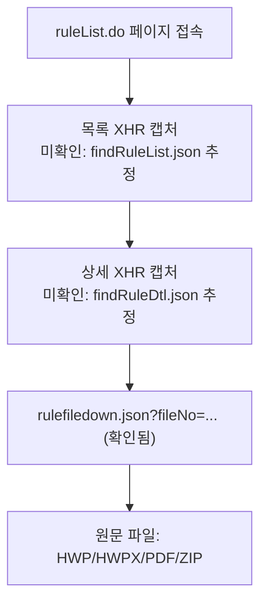

# 21장. ALIO 사이트 — 경영공시·내부규정 클리핑

> 공공 Open API 가이드북 — 9부. 비-API 공공정보 사이트 (클리핑 대상) — 맨 뒤 배치
> 확인 상태: 파일 다운로드 엔드포인트 1종 직접 확인(`rulefiledown.json`), 목록/상세 엔드포인트는 2차 소스 인용(미검증), 통계·GitHub 저장소 인용은 검증 실패

| 항목 | 내용 |
|---|---|
| 대상 사이트 | ALIO — 공공기관 경영정보 공개시스템 (alio.go.kr) |
| 성격 | **정식 Open API 아님** — 4장(ALIO 공식 API: 기관/사업/시설/채용)과 별개 |
| 인증 방식 | 없음(공개 웹페이지, 단 이용약관 검토 필요) |
| 활용 우선순위 | 1장(법제처 target=admrul/pi)으로 커버 안 되는 규정을 보완할 때만 |

---

### 0) 연결 고리 (Bridge)

1장·4장에서 확인했듯, 법제처 API(`target=pi`)는 공공기관 규정의 **일부만** 커버합니다. 나머지는 각 공공기관이 ALIO 경영공시에 올린 정관·내규 PDF/HWP 원문을 직접 확보해야 합니다. 이 장은 그 방법 — 화면 크롤링이 아니라 ALIO가 내부적으로 쓰는 JSON 엔드포인트를 통한 수집 — 을 다룹니다. 9부 맨 뒤에 배치한 이유는, 이 장이 "API 문서를 읽고 호출"이 아니라 "비공식 구조를 역추적"하는 성격이라 이 가이드북의 나머지 장과 접근 방식 자체가 다르기 때문입니다.

---

## 1) 개념 정의 및 필요성

**핵심 정의**: ALIO(alio.go.kr)는 공공기관 경영공시 시스템으로, 각 기관이 정관·인사규정·복무규정 등 내부규정 원문을 첨부파일 형태로 게시합니다. 이 페이지는 JavaScript로 데이터를 불러오는 구조라, 화면을 그대로 HTML 파싱하는 방식은 비효율적이고 잘 깨집니다.

**왜 필요한가**: 여러 공공기관의 유사 규정(인사규정, 복무규정 등)을 비교하려면 원문을 일괄 확보해야 하는데, 기관 수가 많아질수록 수작업 다운로드는 현실적이지 않습니다. ALIO가 화면에 데이터를 그릴 때 실제로 호출하는 JSON 엔드포인트를 직접 호출하면, 브라우저 렌더링 없이 원문 파일에 바로 접근할 수 있습니다.

> **WARNING**: 이 장에서 다루는 방식은 **ALIO가 공식 문서로 제공하는 API가 아닙니다.** 웹페이지가 내부적으로 쓰는 엔드포인트를 관찰해서 재사용하는 것이므로, 사전 고지 없이 바뀌거나 막힐 수 있습니다. 4장(ALIO 정식 Open API)과는 완전히 다른 성격임을 항상 구분해서 다루십시오.

---

## 2) 핵심 원리 및 구조

### 2.1 확인된 것 / 확인 안 된 것 — 반드시 먼저 구분

| 항목 | 상태 | 근거 |
|---|---|---|
| `alio.go.kr/download/rulefiledown.json?fileNo={번호}` | **확인됨** | 실제로 두 개의 서로 다른 fileNo 값에서 규정 조문 텍스트가 반환되는 것을 직접 검색 결과로 확인 (예: 업무처리기준, 취업규칙 조문 내용이 실제로 응답에 포함) |
| `alio.go.kr/occasional/ruleList.do` (내부규정 목록 화면) | 존재 확인 | 여러 출처에서 반복 인용되는 URL이며 ALIO의 실제 메뉴 구조와 일치 |
| `findRuleList.json` (규정 목록 조회용 XHR) | **미확인** | 2차 자료(다른 AI의 조사)에서만 언급됨. 이번 조사에서 직접 응답을 확인하지 못함 |
| `findRuleDtl.json` (규정 상세 조회용 XHR) | **미확인** | 〃 |
| "전체 약 42,187건" 규정 수 | **미확인(시점 스냅샷 주장)** | 검증 안 된 수치이며, 설령 사실이었더라도 조회 시점마다 달라짐 |
| GitHub `towoto44-netizen/alio-rule-downloader` 저장소 | **검증 실패** | 직접 검색했으나 해당 저장소를 찾지 못함 — 존재하지 않거나 비공개일 수 있음. 이 저장소를 전제로 한 설계는 신뢰하지 말 것 |

> **NOTE**: 미확인 항목들은 틀렸다는 뜻이 아니라, **이 세션에서 독립적으로 검증하지 못했다**는 뜻입니다. 실제 개발 착수 전 브라우저 개발자도구(F12) → Network 탭에서 ALIO 내부규정 페이지를 열어 실제 요청을 직접 캡처하는 게 유일하게 확실한 방법입니다.

### 2.1-A 실제 대규모 구현 사례로 접근 방식 재검증 (신규 확인)

재조사 중 이 문제를 실제로, 상당한 규모로 이미 풀어낸 오픈소스 프로젝트를 발견했습니다.

| 항목 | 확인된 내용 |
|---|---|
| 프로젝트명 | `korean-law-alio-mcp`(npm 공개 패키지) |
| 처리 규모 | **344개 공공기관, 약 35,000건 내부규정** 수집·검색·비교 |
| ALIO 수집 방식 | **실시간 API 호출이 아니라 주기적 벌크 다운로드** — `fetch-data` 명령으로 약 300MB를 1~2분에 받아 로컬(`~/.korean-law-alio-mcp/data/alio/`)에 저장 |
| 부가 기능 | 법제처 API(87개 도구)와 ALIO(23개 도구)를 연계해, 규정 본문에서 인용된 상위 법령을 자동 추출하고 법제처에서 역조회하는 기능까지 구현 |

이 사례가 이 장의 설계 방향에 두 가지를 확인해줍니다.

1. **"실시간 API 호출"보다 "주기적 벌크 다운로드 후 로컬 검색"이 실제로 검증된 접근**이라는 점 — 2.1절에서 추정만 했던 findRuleList.json 계열 엔드포인트를 실시간으로 매번 호출하는 대신, 한 번에 큰 스냅샷을 받아두는 이 프로젝트의 방식이 3절(증분 수집 원장)에서 권장한 설계와 일치합니다.
2. **1장에서 다룬 "상위법령 인용 자동 연계"가 실제로 구현 가능한 기능**이라는 걸 이 프로젝트가 증명합니다 — 이 가이드북 여러 장(1장 8.1절 등)에서 제안했던 시나리오가 이론이 아니라는 근거입니다.

> **NOTE**: 이 프로젝트의 정확한 내부 스크래핑 로직(정확히 어떤 엔드포인트를 호출하는지)까지는 공개된 설명만으로 확인하지 못했습니다. 다만 "300MB, 1~2분"이라는 규모감은, 독자가 직접 수집기를 만들 때 "이 정도 볼륨이면 실시간 API보다 배치 다운로드가 합리적"이라는 판단 기준으로 참고할 수 있습니다.

### 2.1-B data.go.kr에도 ALIO 내부규정 파일데이터가 별도 등재됨 (신규 확인)

4장에서 확인한 "채용정보가 data.go.kr에도 등재되어 있다"는 패턴이 내부규정에도 적용됩니다. "재정경제부_공공기관_내부규정 정보"라는 **파일데이터**가 data.go.kr에 등재되어 있고, **2025년 8월 25일에도 수정**된 것으로 확인됩니다(다운로드 817건, PDF 형식, 원본 URL은 `alio.go.kr/occasional/ruleList.do`로 이 장에서 다루는 페이지와 동일).

> **WARNING**: 이건 **파일데이터**이지 실시간 API가 아닙니다("기관자체에서 다운로드" 방식). 즉 data.go.kr을 거쳐도 결국 alio.go.kr 원본으로 안내되는 구조라, 이 장에서 다루는 클리핑 작업 자체를 대체해주지는 않습니다. 다만 이 등재가 2025년 8월까지 계속 갱신되고 있다는 건 ALIO 내부규정 데이터가 살아있는 관리 대상이라는 방증이라, 클리핑 파이프라인을 주기적으로 재검증할 가치가 있다는 신호로 참고할 만합니다.

### 2.2 추정 수집 흐름



### 2.3 문서 형식이 섞여 있다는 점

ALIO 규정 첨부파일은 기관·규정마다 HWP, HWPX, PDF, ZIP이 혼재하는 것으로 확인됩니다(경영공시 자료 상세 페이지 구조상 여러 개정본이 첨부되는 형태). 처음부터 HWPX 파서 하나만 전제로 설계하면 안 되고, **입력 형식 판별 → 형식별 추출기**로 계층을 분리해야 합니다.

---

## 2.5) 합법성·이용약관 검토 (필수)

- ALIO는 공공기관 경영공시 자료를 **공개** 게시하지만, 그게 곧 "대량 자동 수집을 허용한다"는 뜻은 아닙니다. 실제 수집 착수 전에 ALIO 웹사이트 하단의 이용약관·저작권 안내, `robots.txt`를 직접 확인하는 절차를 프로젝트 체크리스트에 넣으십시오.
- 공공저작물이라도 배포·재가공 조건이 걸려 있을 수 있습니다(공공누리 라이선스 유형 확인).
- 이 장은 "가능한 기술적 방법"을 설명하는 것이지, "법적으로 문제없다"를 보증하는 것이 아닙니다.

## 2.6) 비공식 엔드포인트 변경 리스크 및 대응 (필수)

| 리스크 | 대응 |
|---|---|
| 엔드포인트 URL/파라미터가 사전 고지 없이 바뀜 | 수집기(Collector)와 파서(Parser)를 분리해, 수집기만 교체해도 되게 설계(2.7 참고) |
| 응답 스키마가 바뀜 | 원문 파일(raw)을 반드시 별도 보관 — 파싱 로직이 깨져도 원본은 재다운로드 불필요 |
| 접근 자체가 차단됨(rate limit, User-Agent 차단 등) | 요청 간 딜레이, 재시도(backoff) 필수. 과도한 병렬 요청 금지 |

---

## 3) 코드 예제 및 실행 환경 — 규정 수집 아키텍처

### 3.1 설계 원칙 — 4단계를 절대 섞지 않음

```text
① 수집(Collector) → ② 원문 보관(raw) → ③ 구조화(Parser) → ④ 비교(Comparator)
```

HWPX 파서가 오류를 내더라도 원본은 이미 `raw/`에 있으므로 ALIO에서 다시 받을 필요가 없다는 것이 핵심입니다. 기존에 만들고 있는 HWPX 규정 parser(장/절/조/항/호/목 구조, style+regex, MATCH/RESCUED/ORPHAN 판정)를 **③ 구조화 단계에 그대로 연결**하는 방향이 가장 효율적입니다 — 이 프로젝트를 위해 파서를 새로 만들 필요가 없습니다.

### 3.2 디렉터리 구조 (원문 추적성 확보)

```text
alio_rules/
├─ sources/한국관광공사/인사규정/2026-03-20_인사규정.hwp      # 원문 보관
├─ extracted/한국관광공사/인사규정/2026-03-20_인사규정.txt   # 텍스트 추출 결과
└─ normalized/한국관광공사/인사규정/2026-03-20_인사규정.json # 구조화 결과
```

이렇게 원문 경로를 유지해야 "이 JSON의 제25조는 실제 원문 어디서 나온 값인가"를 나중에 추적할 수 있습니다.

### 3.3 표준 JSON 스키마 — 평문 텍스트 배열 금지

```json
{
  "institution": "한국관광공사",
  "rule_name": "인사규정",
  "category": "인사·복무·징계",
  "revision_date": "2026-03-20",
  "source": {"site": "ALIO", "url": "...", "file_name": "인사규정.hwp"},
  "current": {"revision_date": "2026-03-20", "file": "인사규정(2026.03.20).hwp"},
  "history": [
    {"revision_date": "2025-01-20", "file": "인사규정(2025.01.20).hwp"}
  ],
  "chapters": [
    {
      "chapter_no": 1,
      "title": "총칙",
      "articles": [
        {
          "article_no": "1",
          "title": "목적",
          "paragraphs": [{"paragraph_no": 1, "text": "이 규정은 ..."}]
        }
      ]
    }
  ]
}
```

`{"title": "...", "text": "전체본문"}` 식의 평문 저장은 기관 간 비교가 사실상 불가능해지므로 지양합니다. `current`/`history` 구분을 넣어야 "A기관의 2024→2026년 규정 변화" 같은 시계열 분석이 가능해집니다.

### 3.4 프로젝트 구조 및 설정 분리

```text
alio-rule-collector/
├─ config/
│  ├─ config.yaml
│  └─ institutions.yaml      # 기관을 코드에 박지 않고 설정으로 관리
├─ src/alio_rules/
│  ├─ collector/   # session.py, rule_list.py, rule_detail.py, downloader.py
│  ├─ document/    # detector.py, hwp.py, hwpx.py, pdf.py, zip.py
│  ├─ parser/      # article.py, paragraph.py, item.py, normalizer.py (기존 HWPX parser 연결 지점)
│  ├─ compare/     # structural.py, text_diff.py, semantic.py
│  └─ models/      # rule.py, article.py, institution.py
├─ data/{raw,extracted,normalized,comparison}/
└─ scripts/{collect.py, parse.py, compare.py}
```

```yaml
# institutions.yaml
institutions:
  - name: 한국관광공사
    enabled: true
    rules: [인사규정, 보수규정, 직제규정]
  - name: 국민연금공단
    enabled: true
    rules: [인사규정, 보수규정]
```

### 3.5 증분 수집 — 매번 전체를 다시 받지 않음

수집 원장(ledger)을 CSV/DB로 두고 파일별 SHA256을 기록합니다. 두 번째 실행부터는 수정일자·해시가 바뀐 파일만 다운로드합니다.

```csv
institution,rule_name,revision_date,file_no,file_name,sha256,collected_at
한국관광공사,인사규정,2026-03-05,12345,인사규정.hwp,<sha256>,2026-09-17
```

```python
# collector/downloader.py — 최소 골격 (실제 엔드포인트는 2.1의 확인/미확인 표를 참고해 직접 캡처 후 채울 것)
# v0.1, Python 3.11+, requests 2.x
"""
NOTE: findRuleList.json / findRuleDtl.json은 미확인 상태입니다.
      실제 파라미터는 브라우저 Network 탭 캡처로 먼저 확인하십시오.
      rulefiledown.json은 fileNo 파라미터로 응답이 오는 것까지는 확인되었습니다.
"""
import hashlib
import time
from pathlib import Path

import requests

BASE = "https://alio.go.kr"
SESSION = requests.Session()
SESSION.headers.update({"User-Agent": "alio-rule-collector/0.1 (research use)"})


def download_rule_file(file_no: str, dest: Path, timeout: int = 15) -> str:
    """확인된 엔드포인트로 규정 원문을 받아 저장하고 SHA256을 반환."""
    url = f"{BASE}/download/rulefiledown.json"
    resp = SESSION.get(url, params={"fileNo": file_no}, timeout=timeout)
    resp.raise_for_status()
    dest.write_bytes(resp.content)
    return hashlib.sha256(resp.content).hexdigest()


def polite_delay(seconds: float = 1.0) -> None:
    """과도한 연속 요청 방지."""
    time.sleep(seconds)
```

---

## 4) 실무 시나리오 (Best Practice)

- **Phase 1(탐색)**: 기관 2개 + 규정 2~3개만으로 목록→상세→파일 흐름을 실제로 캡처해 확인.
- **Phase 2(원본 수집기)**: raw 저장까지만 완성, 파서는 아직 건드리지 않음.
- **Phase 3(문서 판별)**: HWP/HWPX/PDF/ZIP 자동 판별기 작성.
- **Phase 4(파서 연결)**: 기존 HWPX parser를 구조화 단계에 연결. HWP는 별도 추출기 필요.
- **Phase 5(표준화)**: 3.3 스키마로 통일.
- **Phase 6(구조 비교)**: 조문 존재 여부·개수 비교부터 시작(AI 없이).
- **Phase 7(의미 비교)**: 조 번호가 달라도(예: A기관 제30조 휴직 ↔ B기관 제35조 휴직) 의미 기준으로 매칭 — `article_id: "HR-LEAVE-001"` 같은 정규화 ID로 연결. 이 단계는 AI 판단 결과와 원문 근거를 반드시 함께 저장.

> **TIP**: 1장(법제처)에서 이미 등재가 확인된 규정은 이 장의 수집 대상에서 제외하십시오. 두 소스를 이중으로 관리할 이유가 없습니다.

---

## 5) 트러블슈팅 & 주의사항

| 증상 | 원인 | 조치 |
|---|---|---|
| `findRuleList.json` 호출 시 404/구조 불일치 | 엔드포인트명이 확인된 사실이 아니었음 | 브라우저 Network 탭에서 실제 요청 URL을 직접 캡처 |
| HWP 파일 텍스트 추출 실패 | HWPX 파서로 HWP를 처리 시도 | 문서 판별기(3.4 `document/detector.py`)로 형식부터 분기 |
| 기관 간 비교 결과가 부정확 | 조 번호를 그대로 비교 기준으로 사용 | Level 1(구조)→Level 2(텍스트 diff)→Level 3(의미) 순으로 단계적 비교 |
| 수집이 매번 오래 걸림 | 증분 수집 미적용 | SHA256 원장으로 변경분만 재다운로드 |

---

## 6) 한 줄 요약

> 💡 **Key Takeaway**: 이 장의 핵심은 특정 엔드포인트 이름이 아니라 **"수집·원문보관·구조화·비교를 분리하는 아키텍처"**입니다. 엔드포인트는 비공식이라 바뀔 수 있지만, 이 4단 분리 원칙을 지키면 엔드포인트가 바뀌어도 수집기 모듈만 교체하면 됩니다.