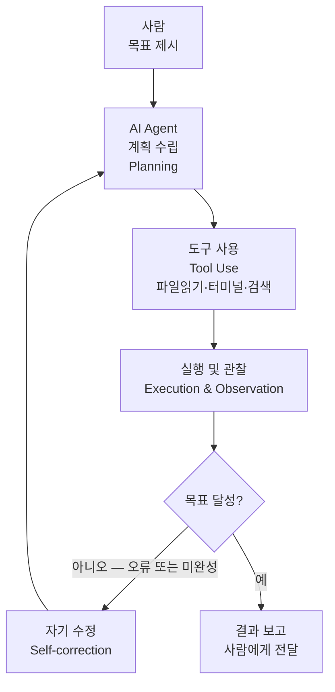
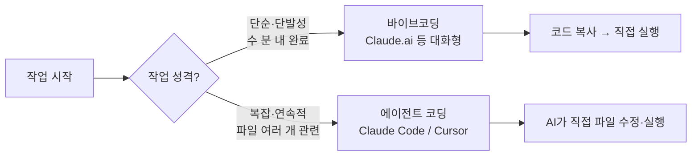

```toc
minLevel: 1
maxLevel: 1
```
# 제2장. 에이전트 코딩이란?

> *"목표를 주면 AI가 계획을 세우고, 스스로 실행하고, 스스로 고친다."*

---

### 0) 연결 고리 (Bridge)

1장에서 바이브코딩은 **"사람이 요청하면 AI가 코드를 돌려주는 대화형 방식"**임을 배웠습니다. 그런데 현실의 업무는 한 번의 대화로 끝나지 않습니다. 파일을 읽고, 코드를 실행하고, 오류를 잡고, 결과를 저장하는 일련의 과정이 필요합니다. 2장에서는 이 연속적인 작업을 AI가 **스스로** 처리하는 단계인 **에이전트 코딩(Agentic Coding)**을 다룹니다.

---

### 1) 개념 정의 및 필요성

#### 핵심 정의

**에이전트 코딩(Agentic Coding)**이란, AI가 주어진 목표를 달성하기 위해 **계획 수립 → 도구 사용 → 실행 → 결과 검증 → 자기 수정**의 루프를 자율적으로 반복하는 개발 방식입니다.

사람은 목표와 방향을 제시하고, AI가 그 목표에 도달하는 경로를 스스로 찾습니다.

#### 왜 필요한가 — 바이브코딩의 한계

바이브코딩은 강력하지만, 작업 규모가 커질수록 한계가 드러납니다.

| 상황 | 바이브코딩의 한계 |
|------|-----------------|
| 파일이 수십 개인 프로젝트 | 매번 관련 코드를 직접 복사해서 붙여넣어야 함 |
| 오류가 발생했을 때 | 오류 메시지를 사람이 복사해서 다시 요청해야 함 |
| 여러 단계가 연결된 작업 | 각 단계마다 사람이 개입해서 다음 요청을 해야 함 |
| 대규모 코드 수정 | 파일별로 나눠서 수동으로 요청해야 함 |

에이전트 코딩은 이 모든 중간 단계를 AI가 직접 처리합니다.

---

### 2) 핵심 원리 및 구조

#### 에이전트 코딩의 핵심 루프



이 루프에서 핵심은 **사람의 개입 없이 F → B 구간이 자동으로 반복**된다는 점입니다. 오류가 나면 AI가 오류 메시지를 읽고, 원인을 분석하고, 코드를 수정하고, 다시 실행합니다.

#### 에이전트의 4가지 핵심 능력

**① 계획 수립 (Planning)**  
목표를 작은 단계로 분해하는 능력입니다.  
예시: "PDF 파일에서 표를 추출해서 DB에 저장해줘"  
→ AI가 자동으로 분해: 파일 목록 확인 → PDF 파싱 → 표 구조 분석 → DB 스키마 설계 → 데이터 삽입 → 검증

**② 도구 사용 (Tool Use)**  
파일 읽기/쓰기, 터미널 명령 실행, 웹 검색, API 호출 등 실제 컴퓨터 도구를 직접 사용하는 능력입니다. 이 능력이 있어야 "코드를 만드는 것"에서 "코드를 실행하는 것"으로 넘어갑니다.

**③ 자기 수정 (Self-correction)**  
오류 메시지나 예상과 다른 결과를 스스로 분석하고 코드를 수정하는 능력입니다. 사람이 오류를 복사해서 다시 붙여넣는 과정이 사라집니다.

**④ 컨텍스트 관리 (Context Management)**  
긴 작업에서 앞서 수행한 작업의 결과를 기억하고, 일관성 있게 다음 단계를 처리하는 능력입니다.

---

### 3) 레벨 1~5 스펙트럼 — 어디까지 왔나

바이브코딩과 에이전트 코딩은 별개가 아니라 **연속적인 스펙트럼**입니다.

| 레벨 | 방식 | 사람의 역할 | 대표 도구 |
|------|------|-----------|----------|
| **레벨 1** | 코드 자동완성 | 제안을 수락/거절 | GitHub Copilot 인라인 |
| **레벨 2** | 대화형 생성 (바이브코딩) | 요청 → 붙여넣기 → 실행 | Claude.ai, ChatGPT |
| **레벨 3** | 파일 단위 에이전트 | 수정 요청, 승인 | Cursor, Windsurf |
| **레벨 4** | 프로젝트 단위 에이전트 | 목표 제시, 결과 검토 | Claude Code, Codex CLI |
| **레벨 5** | 완전 자율 에이전트 | 목표만 제시 | Devin, SWE-agent |

> **NOTE:** 2026년 현재 실무에서 가장 많이 사용되는 구간은 레벨 3~4입니다. 레벨 5(완전 자율)는 기술적으로 가능하지만, 중요한 프로젝트에서는 사람의 검수 포인트를 유지하는 레벨 4 방식이 더 안전하고 효율적입니다.

---

### 4) 바이브코딩 vs 에이전트 코딩 — 언제 무엇을 쓰나



**바이브코딩이 적합한 경우:**
- 빠른 아이디어 검증
- 단일 파일, 단일 기능 구현
- 코드보다 문서·보고서 작업

**에이전트 코딩이 적합한 경우:**
- 여러 파일을 동시에 수정해야 할 때
- 오류 → 수정 → 재실행의 반복이 예상될 때
- 자동화 파이프라인 전체를 구축할 때

---

### 5) 실무 시나리오 (Best Practice)

#### 에이전트 코딩 실전 — 실제 작업 지시 예시

아래는 에이전트 코딩 도구(Claude Code)에게 복잡한 작업을 위임하는 예시입니다.

```bash
# 터미널에서 프로젝트 폴더로 이동 후 Claude Code 실행
cd /my-project
claude

# 자연어로 목표 제시
> 현재 폴더의 budget_parser.py를 읽어봐.
  PDF에서 표를 파싱하는 코드인데,
  merged cell(병합 셀)이 있는 표에서 오류가 발생해.
  오류를 재현하고, 원인을 분석한 다음 수정해줘.
  수정 후 test_budget.pdf로 테스트도 해줘.
```

이 한 번의 지시로 AI는 다음을 자동 수행합니다:
1. `budget_parser.py` 파일 전체 읽기
2. 병합 셀 처리 로직 분석
3. 테스트 실행 → 오류 재현
4. 원인 파악 → 코드 수정
5. 재실행 → 결과 검증
6. 결과 보고

#### 안티 패턴 (Anti-Pattern)

**① 목표 없이 작업 나열**  
"이것도 해줘, 저것도 해줘" 방식으로 나열하면 AI가 전체 맥락을 잃습니다. 하나의 목표를 명확히 제시하고, 완료 후 다음 목표를 주는 방식이 효율적입니다.

**② 중간 검수 없이 전체 위임**  
레벨 5 방식으로 전체를 맡겼다가 엉뚱한 방향으로 많은 파일이 수정될 수 있습니다. 중요한 작업은 단계별로 "여기까지 맞아?"를 확인하는 **체크포인트(Checkpoint)**를 설정해야 합니다.

**③ 버전 관리 없이 에이전트 실행**  
AI가 파일을 직접 수정하므로, 실행 전 반드시 Git으로 현재 상태를 커밋해 두어야 합니다. 잘못된 수정도 즉시 되돌릴 수 있습니다.

---

### 6) 트러블슈팅 & 주의사항

**Q. AI가 작업 중간에 멈추거나 엉뚱한 방향으로 갑니다.**  
→ 작업 목표를 다시 명확히 제시하세요. "지금까지 한 작업을 요약하고, 다음에 해야 할 일을 알려줘"라고 요청하면 AI가 현재 상태를 재정비합니다.

**Q. AI가 파일을 수정했는데 오히려 더 망가졌습니다.**  
→ Git을 사용했다면 `git checkout .`으로 즉시 원복 가능합니다. Git 사용이 에이전트 코딩의 **안전망**입니다. 11장(GitHub 연계)에서 자세히 다룹니다.

**Q. 어느 레벨의 도구를 써야 할지 모르겠습니다.**  
→ 처음에는 레벨 2(Claude.ai 대화형)로 시작하고, "이걸 매번 붙여넣기 하기 귀찮다"는 느낌이 들면 레벨 3~4로 넘어가는 것이 자연스러운 경로입니다.

> **WARNING:** 에이전트가 터미널 명령을 직접 실행할 수 있는 환경(레벨 4 이상)에서는, 작업 전 반드시 중요한 데이터의 백업 또는 Git 커밋을 확인하세요. AI의 자기 수정 루프 중 예상치 못한 파일 삭제나 덮어쓰기가 발생할 수 있습니다.

---

### 6) 한 줄 요약

> 💡 **Key Takeaway:** 에이전트 코딩은 AI에게 **"코드 한 줄"이 아닌 "목표 하나"를 주는 방식**으로, 계획·실행·수정의 전 과정을 AI가 자율적으로 처리합니다.

---

*다음 장: 3장. 에이전트 작동 원리 — MCP / Sub-agent / Hook / Memory*

[ch01-vibe-coding](/techbook/vibecoding/ch01-vibe-coding)

[ch03-agent-principles](/techbook/vibecoding/ch03-agent-principles)