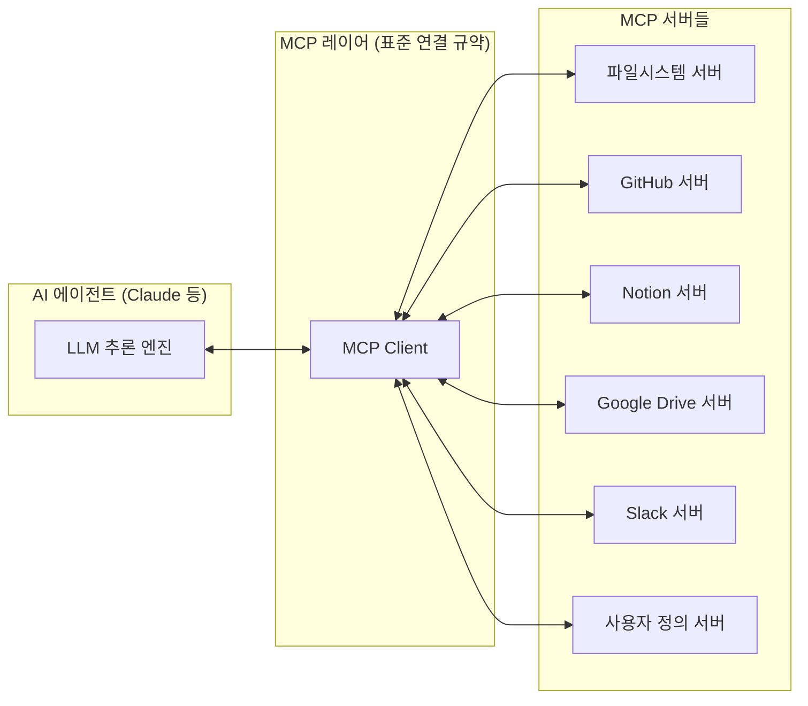
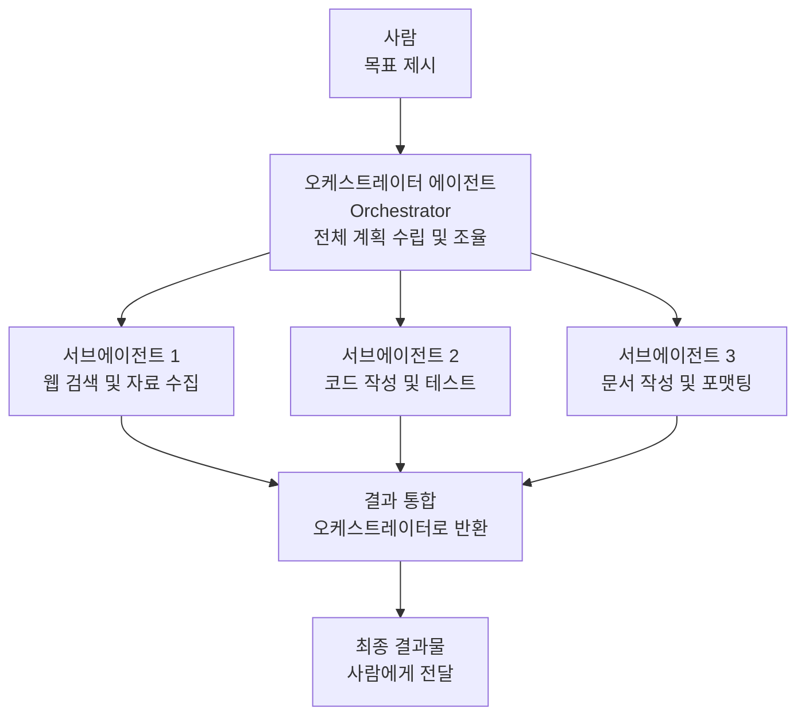
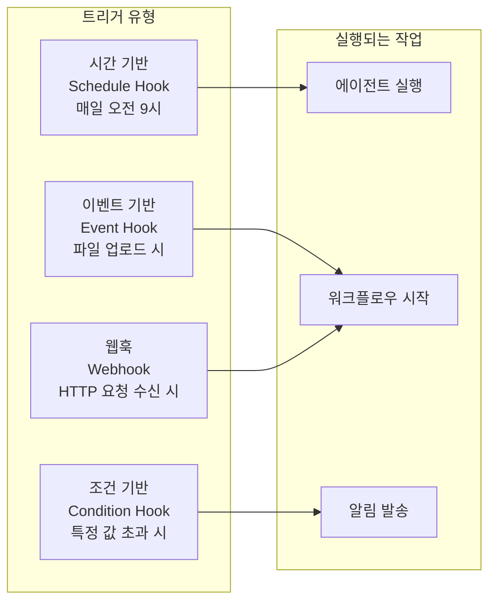
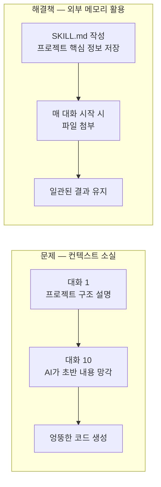
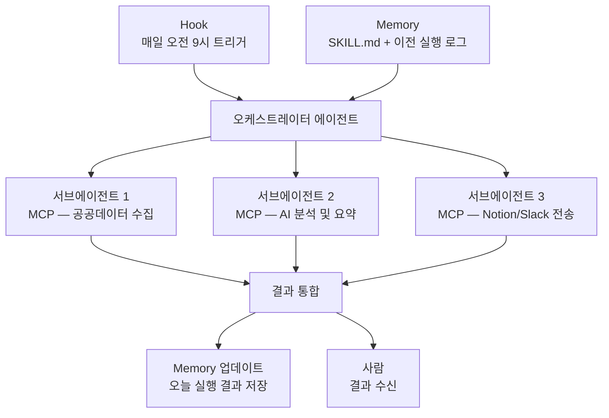

```toc
minLevel: 1
maxLevel: 1
```
# 제3장. 에이전트 작동 원리 — MCP / Sub-agent / Hook / Memory

> *"AI가 도구를 쓰고, 팀을 이루고, 신호를 받고, 기억한다."*

---

### 0) 연결 고리 (Bridge)

2장에서 에이전트 코딩의 핵심은 **"AI가 계획·실행·수정을 자율적으로 반복하는 것"**임을 배웠습니다. 그런데 이 루프가 실제로 어떻게 작동하는 걸까요? AI가 파일을 읽고, 터미널을 실행하고, 다른 AI와 협력하는 내부 원리를 이해하면 에이전트를 훨씬 효과적으로 활용할 수 있습니다. 3장에서는 현대 에이전트 시스템을 구성하는 4가지 핵심 원리인 **MCP, Sub-agent, Hook, Memory**를 해부합니다.

---

### 1) 개념 정의 및 필요성

현대의 AI 에이전트는 단순히 텍스트를 생성하는 것을 넘어, **실제 세계의 도구와 시스템에 연결**되어야 합니다. 이를 가능하게 하는 네 가지 핵심 원리는 다음과 같습니다.

| 원리 | 한 줄 정의 | 비유 |
|------|-----------|------|
| **MCP** | AI가 외부 도구를 표준 방식으로 호출하는 규약 | 모든 가전제품을 연결하는 표준 콘센트 |
| **Sub-agent** | 큰 작업을 여러 AI가 분담해서 처리하는 구조 | 팀장이 팀원들에게 업무를 배분하는 것 |
| **Hook** | 특정 사건이 발생했을 때 에이전트를 자동 실행하는 트리거 | 초인종이 울리면 자동으로 현관 카메라가 켜지는 것 |
| **Memory** | 에이전트가 이전 작업 내용을 기억하고 활용하는 능력 | 업무 인수인계 문서 |

---

### 2) MCP (Model Context Protocol)

#### 개념 정의

**MCP(모델 컨텍스트 프로토콜, Model Context Protocol)**는 Anthropic이 2024년 말 발표한 오픈 표준으로, AI 모델이 외부 도구·데이터·서비스를 **일관된 방식으로 연결하고 호출**할 수 있게 하는 규약입니다.

MCP 이전에는 AI가 새로운 도구를 사용하려면 매번 별도의 통합 코드를 작성해야 했습니다. MCP는 이 문제를 **표준 인터페이스**로 해결합니다.

#### MCP의 구조



> **비유:** MCP는 USB 표준과 같습니다. USB 규격이 생기기 전에는 키보드·마우스·프린터마다 전용 포트가 필요했습니다. USB 표준이 생긴 후에는 어떤 기기든 하나의 방식으로 연결됩니다. MCP는 AI 도구 연결의 USB 표준입니다.

#### 실제 활용 예시

Claude.ai에서 Google Drive MCP 서버가 연결되어 있다면, 다음과 같이 자연어로 파일을 직접 조작할 수 있습니다.

```
[사람]
지난 달에 작성한 예산 보고서 파일을 찾아서 요약해줘.

[Claude — MCP를 통해 Google Drive 검색 실행]
Google Drive에서 "예산 보고서" 키워드로 검색 중...
→ "2026년 3월 예산 보고서.docx" 발견
→ 파일 내용 읽기 중...

요약 결과:
총 예산 15억 원 중 집행률은 72%이며,
미집행 예산의 주요 원인은 3개 사업의 입찰 지연입니다.
```

> **NOTE:** Claude.ai의 MCP 연결 도구(Google Drive, Gmail, Notion 등)는 설정 메뉴에서 활성화할 수 있습니다. 연결 후에는 AI가 해당 서비스의 데이터를 직접 읽고 쓸 수 있습니다.

---

### 3) Sub-agent (서브에이전트)

#### 개념 정의

**서브에이전트(Sub-agent)**란 하나의 주(主) 에이전트가 복잡한 작업을 처리할 때, 세부 작업을 여러 개의 하위 에이전트에게 위임하여 **병렬 또는 순차적으로 처리**하는 구조입니다.

#### 오케스트레이션 구조



#### 실제 활용 예시

"AI 산업 동향 보고서를 작성해줘"라는 하나의 요청이 내부적으로 어떻게 분배되는지 보여줍니다.

```
오케스트레이터: 작업을 3개로 분해합니다.

서브에이전트 1 (리서치 담당):
  → 최근 3개월 AI 산업 뉴스 검색
  → 주요 기업 발표 자료 수집
  → 정책 문서 확인

서브에이전트 2 (분석 담당):
  → 수집된 자료 분류 및 핵심 내용 추출
  → 시장 규모·성장률 수치 정리
  → 경쟁 구도 분석

서브에이전트 3 (작성 담당):
  → 오케스트레이터의 구조 지시에 따라 보고서 작성
  → 표·그래프 삽입 위치 지정
  → 출처 목록 정리

오케스트레이터: 세 결과를 통합하여 최종 보고서 완성
```

> **TIP:** 현재 Claude Code에서 서브에이전트 기능은 `claude --dangerously-skip-permissions` 옵션과 함께 활용할 수 있으며, 복잡한 멀티스텝 작업에서 효과가 큽니다. 단, 이 옵션은 AI가 사람의 확인 없이 파일을 수정하므로 반드시 Git 백업 후 사용해야 합니다.

---

### 4) Hook (훅)

#### 개념 정의

**훅(Hook)**이란 특정 **이벤트(Event)**가 발생했을 때 에이전트를 자동으로 실행하는 트리거(Trigger) 메커니즘입니다. 사람이 직접 실행 버튼을 누르는 대신, **"무언가가 일어나면 자동으로 시작"** 되는 구조를 만듭니다.

#### Hook의 유형



#### 실제 활용 예시

**시나리오:** 매일 오전 8시, 정부 공공데이터 포털에서 새로운 공고가 올라오면 자동으로 요약해서 Slack으로 전송

```
Hook 설정:
  트리거: 매일 08:00 (Schedule Hook)
  조건:   공공데이터 포털 신규 공고 존재 여부 확인
  실행:   공고 내용 수집 → AI 요약 → Slack 채널 전송

결과:
  담당자는 매일 아침 Slack에서
  "오늘 신규 공고 3건: ① ... ② ... ③ ..."
  형태의 메시지를 자동으로 받습니다.
```

**웹훅(Webhook) 예시:**  
GitHub에 새 코드가 푸시(push)되면 자동으로 테스트를 실행하고, 실패 시 담당자에게 알림을 보내는 구조도 훅으로 구현합니다. 이 패턴은 10장(n8n/자동화 플랫폼)에서 실습합니다.

---

### 5) Memory (메모리)

#### 개념 정의

**메모리(Memory)**란 에이전트가 이전 작업·대화·결과를 저장하고 이후 작업에 활용하는 능력입니다. 메모리가 없으면 에이전트는 매 작업마다 처음부터 시작해야 합니다.

#### 메모리의 4가지 유형

| 유형 | 설명 | 예시 | 지속성 |
|------|------|------|--------|
| **인컨텍스트 메모리** | 현재 대화창 안의 내용 | 이번 대화에서 나눈 내용 | 대화 종료 시 소멸 |
| **외부 메모리** | 파일·DB에 저장된 내용 | SKILL.md, JSON 파일 | 영구 보존 |
| **벡터 메모리** | 의미 기반으로 검색 가능한 저장소 | RAG 시스템의 지식 베이스 | 영구 보존 |
| **캐시 메모리** | 자주 쓰는 컨텍스트 재사용 | 시스템 프롬프트 캐싱 | 세션 단위 |

#### 컨텍스트 소실 문제와 해결책

대화가 길어지면 AI가 앞부분 내용을 잊는 **컨텍스트 소실(Context Loss)** 현상이 발생합니다. 이는 LLM이 처리할 수 있는 텍스트 양(컨텍스트 윈도우)에 한계가 있기 때문입니다.



#### 실용적 메모리 관리 방법

**방법 1: SKILL.md 파일 활용 (가장 권장)**  
프로젝트의 구조, 용어, 규칙을 하나의 파일에 정리해두고 매번 AI에게 첨부합니다. 이 방법은 4장과 15장에서 자세히 다룹니다.

```markdown
# 프로젝트 컨텍스트 (SKILL.md 예시)

## 프로젝트 개요
- 이름: KAIB2026 예산 파싱 파이프라인
- 목적: 과기부 PDF 예산문서를 DB에 자동 저장
- 언어: Python 3.11

## 폴더 구조
/src/budget_parser.py   ← PDF 파싱 담당
/src/json_structurer.py ← 구조화 담당
/data/                  ← 원본 PDF 저장

## 용어 정의
- 기준연도: base_year, 현재 2026
- 세입: revenue / 세출: expenditure
```

**방법 2: 요약 요청 후 재시작**  
대화가 길어지면 "지금까지 작업한 내용과 현재 상태를 요약해줘"라고 요청한 뒤, 새 대화창에서 그 요약을 붙여넣고 시작합니다.

> **WARNING:** 에이전트에게 중요한 작업을 위임하기 전, 반드시 현재 프로젝트 상태를 SKILL.md나 README에 정리해두세요. 메모리 없이 긴 작업을 맡기면 AI가 중간에 방향을 잃고 전혀 다른 구조의 코드를 작성하는 경우가 발생합니다.

---

### 6) 4가지 원리의 통합 — 실전 에이전트 시스템

실제 업무 자동화 시스템은 이 4가지 원리가 함께 작동합니다.



---

### 7) 트러블슈팅 & 주의사항

**Q. MCP 연결이 안 됩니다.**  
→ Claude.ai 설정에서 해당 서비스의 MCP 서버가 활성화되어 있는지 확인하세요. 일부 MCP 서버는 OAuth 인증이 필요합니다.

**Q. 서브에이전트가 서로 충돌하는 결과를 냅니다.**  
→ 오케스트레이터에게 각 서브에이전트의 역할 경계를 명확히 지정해야 합니다. "서브에이전트 1은 수집만, 서브에이전트 2는 분석만 담당"처럼 역할을 분리하세요.

**Q. 훅이 실행됐는데 에이전트가 동작하지 않습니다.**  
→ 훅과 에이전트 사이의 연결(웹훅 URL, API 키)이 유효한지 확인하세요. 만료된 인증 토큰이 가장 흔한 원인입니다.

**Q. 대화를 재시작할 때마다 AI가 이전 작업을 모릅니다.**  
→ 정상적인 현상입니다. 인컨텍스트 메모리는 대화 종료 시 소멸합니다. SKILL.md를 만들어 핵심 컨텍스트를 외부 메모리로 관리하세요. 15장에서 실전 작성법을 다룹니다.

> **TIP:** 처음 에이전트 시스템을 구성할 때는 MCP 하나 + Hook 하나의 단순한 구조로 시작하세요. "파일이 업로드되면 자동으로 요약해줘" 같은 단순한 조합부터 익힌 뒤 복잡도를 높여가는 것이 실패 없이 시스템을 구축하는 방법입니다.

---

### 8) 한 줄 요약

> 💡 **Key Takeaway:** 현대 에이전트는 **MCP로 도구를 쓰고, Sub-agent로 팀을 이루고, Hook으로 자동 실행되며, Memory로 맥락을 유지합니다** — 이 4가지가 결합될 때 진정한 자동화가 완성됩니다.

---

*다음 장: 4장. 첫 대화 — 프롬프트 설계, 컨텍스트 주입, SKILL.md 활용*