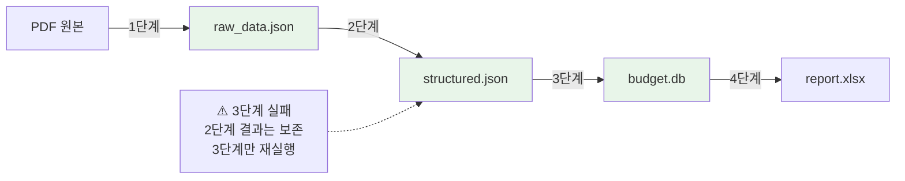
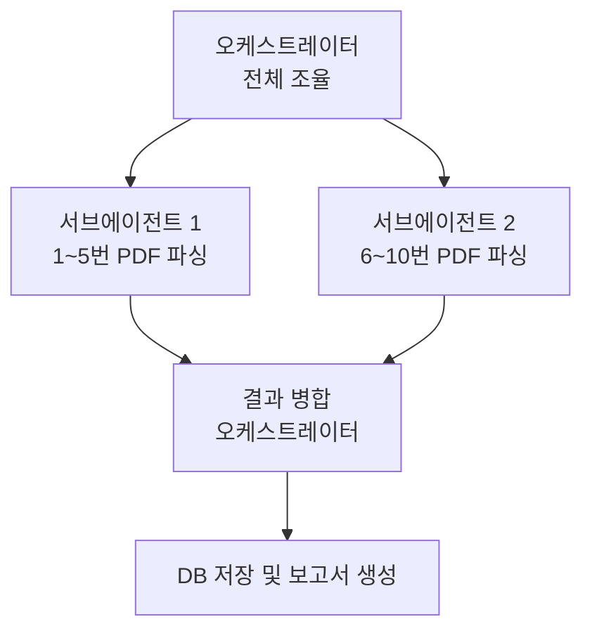
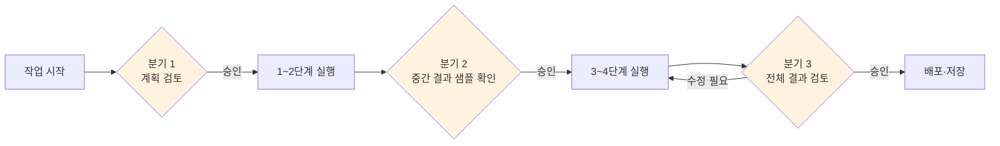

```toc
minLevel: 1
maxLevel: 1
```
# 제5장. 에이전트에게 복잡한 작업 위임하기

> *"AI에게 '해줘'가 아니라 '맡길게'라고 말할 수 있을 때, 진짜 자동화가 시작된다."*

---

### 0) 연결 고리 (Bridge)

4장에서 AI와의 첫 대화를 잘 설계하는 방법을 배웠습니다. 단순한 한 번의 요청은 이제 자신 있게 할 수 있습니다. 그런데 현실의 업무는 훨씬 복잡합니다. "PDF 10개를 파싱해서 DB에 저장하고, 요약 보고서까지 만들어줘"처럼 여러 단계가 연결된 작업을 AI에게 어떻게 위임할까요? 5장에서는 복잡한 작업을 쪼개고, 검수하고, 안전하게 완성하는 전략을 다룹니다.

---

### 1) 개념 정의 및 필요성

#### 왜 복잡한 작업은 다르게 접근해야 하나

단순 작업과 복잡 작업의 차이는 **단계의 수**와 **단계 간 의존성**입니다.

| 구분 | 단순 작업 | 복잡 작업 |
|------|----------|----------|
| 단계 수 | 1~2단계 | 5단계 이상 |
| 단계 간 관계 | 독립적 | 앞 단계 결과가 다음 단계 입력 |
| 오류 영향 | 해당 단계만 | 이후 모든 단계에 전파 |
| 사람 개입 | 시작과 끝 | 주요 분기점마다 필요 |
| 실패 비용 | 낮음 | 높음 (앞 작업이 모두 낭비될 수 있음) |

복잡한 작업을 단순 작업처럼 한 번에 던지면, AI가 중간에 방향을 잃거나 잘못된 가정으로 잘못된 구조를 만들어냅니다.

---

### 2) 핵심 원리: 작업 분해 (Task Decomposition)

#### 작업 분해란?

**작업 분해(Task Decomposition)**란 복잡한 목표를 AI가 한 번에 처리할 수 있는 크기의 독립적인 단계로 나누는 것입니다.

#### 분해의 3가지 기준

**기준 1 — 입출력 경계**  
각 단계는 명확한 입력과 출력을 가져야 합니다. 출력이 모호하면 다음 단계의 입력도 모호해집니다.

```
[나쁜 분해]
1단계: PDF 처리
2단계: 데이터 저장
3단계: 보고서 작성

[좋은 분해]
1단계: PDF → raw_data.json (페이지별 텍스트 추출)
2단계: raw_data.json → structured.json (표 구조 정규화)
3단계: structured.json → budget.db (SQLite 저장)
4단계: budget.db → report.xlsx (부서별 요약 보고서)
```

**기준 2 — 검증 가능성**  
각 단계가 끝났을 때 결과가 맞는지 사람이 확인할 수 있어야 합니다.

```
1단계 완료 후 확인:
  → raw_data.json을 열어서 텍스트가 제대로 추출됐는지 확인
  → 페이지 수가 원본 PDF와 일치하는지 확인

2단계 완료 후 확인:
  → structured.json에서 금액 필드가 숫자 타입인지 확인
  → 병합 셀이 올바르게 처리됐는지 샘플 5개 확인
```

**기준 3 — 복구 가능성**  
단계가 실패했을 때 이전 단계로 돌아갈 수 있어야 합니다. 이를 위해 각 단계의 중간 결과물을 파일로 저장합니다.



> **TIP:** 각 단계의 중간 결과를 파일로 저장하는 것을 **체크포인트(Checkpoint)**라고 합니다. 체크포인트가 있으면 실패 시 전체를 다시 실행하지 않아도 됩니다.

---

### 3) 위임 방법 — 단계별 지시 패턴

#### 패턴 1: 순차 위임 (Sequential Delegation)

가장 기본적인 방식입니다. 한 단계가 완료되고 검수한 뒤 다음 단계를 지시합니다.

```
[1단계 지시]
budget_2026.pdf에서 텍스트를 추출해서 raw_data.json으로 저장해줘.
pdfplumber 사용. 완료되면 추출된 페이지 수와 샘플 3개를 보여줘.

→ 사람이 결과 검토 후 OK

[2단계 지시]
raw_data.json을 읽어서 표 구조를 정규화해줘.
금액은 숫자 타입으로, 병합 셀은 상위 값으로 채워줘.
결과를 structured.json으로 저장. 완료 후 샘플 5개 보여줘.

→ 사람이 결과 검토 후 OK

[3단계 지시]
...
```

#### 패턴 2: 계획 먼저 확인 (Plan-First)

AI에게 먼저 전체 계획을 세우게 하고, 계획을 승인한 뒤 실행시킵니다. 복잡하고 중요한 작업에 적합합니다.

```
[계획 요청]
다음 작업의 전체 실행 계획을 세워줘.
실제로 실행하지 말고 계획만 보여줘.

작업: PDF 10개를 파싱해서 SQLite DB에 저장하고
      부서별 예산 요약 보고서(Excel)를 만들기

계획에 포함할 것:
- 단계별 입력/출력 파일
- 사용할 라이브러리
- 예상 소요 시간
- 주요 리스크

→ 사람이 계획 검토 및 수정 후 "계획대로 진행해줘"
```

#### 패턴 3: 병렬 위임 (Parallel Delegation)

독립적인 작업을 동시에 진행합니다. Claude Code의 서브에이전트 기능이나 n8n의 병렬 노드를 활용합니다.



---

### 4) 중간 검수 포인트 설정

#### 검수가 필요한 5가지 시점



| 검수 시점 | 확인 내용 | 이유 |
|----------|----------|------|
| 계획 수립 후 | 방향이 맞는지, 빠진 단계는 없는지 | 잘못된 방향으로 실행되는 것을 조기 차단 |
| 1단계 완료 후 | 입력 데이터가 올바르게 읽혔는지 | 초기 오류가 이후 전체에 전파되는 것 방지 |
| 핵심 변환 후 | 데이터 타입·구조가 명세와 일치하는지 | 잘못된 데이터가 DB에 저장되는 것 방지 |
| 전체 완료 후 | 결과물이 요구사항을 충족하는지 | 최종 품질 확인 |
| 배포 전 | 운영 환경에서 동작하는지 | 개발 환경과 운영 환경의 차이 확인 |

#### 검수 요청 프롬프트 예시

```
1단계가 완료됐어. 진행 전에 다음을 확인해줘:
1. 추출된 총 레코드 수
2. 금액 필드의 최솟값·최댓값·null 개수
3. 예상과 다른 데이터 패턴이 있으면 알려줘

확인 후 내가 "계속"이라고 하면 2단계 진행해줘.
```

---

### 5) Hook으로 자동 트리거 설계

복잡한 작업을 매번 수동으로 시작하는 대신, **특정 조건이 충족되면 자동으로 시작**되게 만들 수 있습니다.

#### 실용적인 Hook 설계 패턴

**패턴 A — 파일 감지 훅**  
특정 폴더에 파일이 생기면 자동으로 파이프라인 실행

```python
# watchdog 라이브러리를 이용한 파일 감지 훅
import time
from watchdog.observers import Observer
from watchdog.events import FileSystemEventHandler

class PDFHandler(FileSystemEventHandler):
    def on_created(self, event):
        if event.src_path.endswith('.pdf'):
            print(f"새 PDF 감지: {event.src_path}")
            run_pipeline(event.src_path)  # 파이프라인 자동 실행

observer = Observer()
observer.schedule(PDFHandler(), path='/data/incoming', recursive=False)
observer.start()
print("PDF 감시 시작. 파일을 /data/incoming 에 넣으면 자동 처리됩니다.")
```

**패턴 B — 웹훅(Webhook) 수신**  
외부 서비스에서 HTTP 요청이 오면 에이전트 실행

```
시나리오:
Google Form 제출 → Webhook 발송 → n8n 수신
→ 에이전트 실행 → 결과를 Slack으로 전송

활용 예:
- 신청서 제출 → 자동 검토 및 담당자 배정
- 설문 완료 → 자동 집계 및 보고서 생성
- 공공데이터 업데이트 → 자동 파싱 및 DB 갱신
```

**패턴 C — 스케줄 훅**

```python
# schedule 라이브러리를 이용한 정기 실행
import schedule
import time

def daily_report():
    """매일 오전 8시 보고서 자동 생성"""
    run_report_pipeline()
    send_to_slack()

schedule.every().day.at("08:00").do(daily_report)

while True:
    schedule.run_pending()
    time.sleep(60)
```

> **NOTE:** 훅 기반 자동화는 10장(n8n/자동화 플랫폼)에서 노코드(No-code) 방식으로 구현하는 방법을 자세히 다룹니다. 코드를 작성하지 않아도 동일한 패턴을 구현할 수 있습니다.

---

### 6) 실무 시나리오 — 전체 위임 흐름

**상황:** 10개의 PDF 예산문서를 파싱해서 DB에 저장하고 보고서까지 만들어야 하는 상황

```
[Step 1 — 계획 요청]
"10개 PDF → DB → 보고서" 작업의 전체 계획을 세워줘.
실행하지 말고 계획만.

[AI 응답 — 계획 제시]
단계 1: PDF 유효성 검사 (10개 파일 존재 여부, 손상 여부)
단계 2: 병렬 파싱 (5개씩 2그룹으로 분할)
단계 3: 구조 정규화 및 병합
단계 4: DB 저장 (중복 방지 로직 포함)
단계 5: 보고서 생성 (부서별 요약)
예상 시간: 약 8분
주요 리스크: 스캔 PDF의 경우 OCR 필요

[Step 2 — 계획 승인]
"단계 2에서 그룹을 5개씩 말고 PDF별로 독립 처리해줘.
 그 외엔 계획대로 진행해줘."

[Step 3 — 단계별 실행 + 검수]
1단계 완료 후: "유효성 검사 결과 보여줘"
→ 확인 후 "2단계 진행해줘"
→ (반복)

[Step 4 — 최종 결과 확인]
"보고서 샘플 3개 페이지 보여줘.
 수치가 원본 PDF와 일치하는지 확인할게."
```

---

### 7) 안티 패턴 (Anti-Pattern)

**① "알아서 다 해줘" 방식**  
방향과 경계 없이 전체를 위임하면 AI가 예상과 전혀 다른 구조를 만들 수 있습니다. 계획을 먼저 확인하는 습관이 필수입니다.

**② 검수 없이 다음 단계 진행**  
1단계 결과가 잘못됐는데 모르고 2단계를 진행하면, 2단계가 끝나도 결과가 쓸모없게 됩니다. "완료 후 샘플 보여줘"를 항상 요청하세요.

**③ 중간 결과물 저장 안 함**  
메모리에서만 처리하고 파일로 저장하지 않으면, 3단계에서 실패했을 때 1~2단계를 다시 실행해야 합니다. 반드시 단계별 파일 저장을 요청하세요.

**④ 너무 잘게 쪼개기**  
반대로 너무 많은 단계로 나누면 오히려 AI의 흐름이 끊기고 관리 비용이 높아집니다. 한 단계는 "10~30분 안에 검수할 수 있는 양"이 적당합니다.

---

### 8) 트러블슈팅 & 주의사항

**Q. AI가 계획을 잘 세웠는데 실행 중 계획을 벗어납니다.**  
→ 계획 문서를 SKILL.md에 포함시키고, 각 단계 시작 시 "계획의 N단계를 실행해줘"처럼 명시적으로 참조하세요.

**Q. 병렬 처리 중 서브에이전트들이 같은 파일을 동시에 수정합니다.**  
→ 작업 영역을 명확히 분리하세요. 서브에이전트 1은 `/output/group1/`, 서브에이전트 2는 `/output/group2/`처럼 별도 폴더를 사용하게 지정합니다.

**Q. 훅이 너무 자주 실행돼서 API 비용이 걱정됩니다.**  
→ 훅에 조건을 추가하세요. "파일이 생성됐을 때"가 아니라 "PDF 파일이 5개 이상 쌓였을 때" 또는 "파일 크기가 1MB 이상일 때"처럼 임계값을 설정합니다.

> **WARNING:** 에이전트가 DB에 직접 쓰는 작업을 위임할 때는 반드시 **트랜잭션(Transaction)**과 **롤백(Rollback)** 처리를 포함하도록 명시하세요. 중간에 실패하면 DB가 절반만 저장된 불완전한 상태가 됩니다.
>
> 프롬프트 예시: "DB 저장 시 트랜잭션 처리 포함해줘. 오류 발생 시 전체 롤백."

---

### 9) 한 줄 요약

> 💡 **Key Takeaway:** 복잡한 작업은 **입출력이 명확한 단계로 분해**하고, **각 단계마다 검수**하고, **중간 결과를 파일로 보존**하는 세 원칙을 지키면 AI 위임의 실패율을 크게 낮출 수 있습니다.

---

*다음 장: 6장. 대화형 도구 — Claude / ChatGPT / Gemini 비교와 활용*