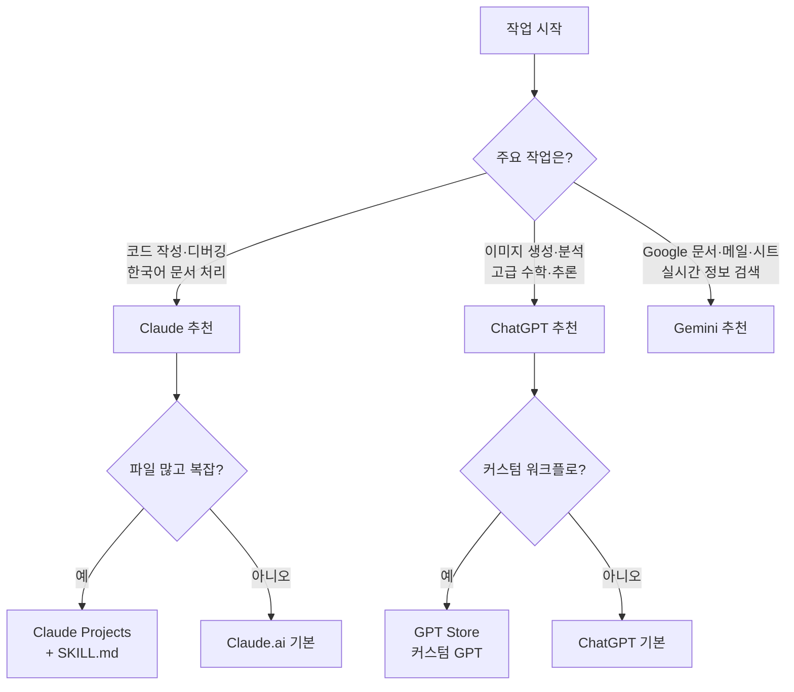

```toc
minLevel: 1
maxLevel: 1
```
# 제6장. 대화형 도구 — Claude / ChatGPT / Gemini

> *"어떤 AI를 쓰느냐보다, 어떤 상황에 어떤 AI를 쓰느냐가 더 중요하다."*

---

### 0) 연결 고리 (Bridge)

5장까지 바이브코딩과 에이전트 코딩의 원리와 전략을 배웠습니다. 이제 실제 도구를 살펴볼 차례입니다. 6장에서는 가장 진입 장벽이 낮은 **대화형 AI 도구** 세 가지를 비교합니다. 코딩 환경을 설치하거나 터미널을 열 필요 없이 브라우저에서 바로 사용할 수 있는 도구들입니다.

---

### 1) 개념 정의 및 필요성

#### 대화형 AI 도구란?

**대화형 AI 도구**란 채팅 인터페이스에서 자연어로 요청하면 텍스트·코드·분석 결과를 즉시 반환하는 AI 서비스입니다. 레벨 2(바이브코딩) 단계에 해당하며, 설치 없이 브라우저만으로 사용 가능합니다.

2026년 현재 실무에서 가장 많이 쓰이는 3대 대화형 AI는 **Claude(Anthropic)**, **ChatGPT(OpenAI)**, **Gemini(Google)**입니다.

---

### 2) Claude (Anthropic)

#### 핵심 특징

**Claude**는 Anthropic이 개발한 AI로, 긴 문서 이해·정확한 추론·한국어 처리에서 강점을 보입니다. 특히 코드와 문서를 **동시에** 다루는 작업에서 일관성이 높습니다.

**웹:** claude.ai  
**앱:** iOS / Android 지원  
**현재 모델:** Claude Sonnet 4.6 (일반), Claude Opus 4.6 (고성능)

#### 플랜별 주요 기능

| 기능 | Free | Pro |
|------|------|-----|
| 기본 대화 | ✅ | ✅ |
| 파일 첨부 (PDF, 이미지, 코드) | ✅ | ✅ |
| 웹 검색 | ✅ | ✅ |
| MCP 연동 (Google Drive, Notion 등) | ✅ | ✅ |
| 대용량 컨텍스트 처리 | 제한 | ✅ |
| Claude Code 연동 | — | ✅ |
| Projects (프로젝트별 컨텍스트 유지) | ✅ | ✅ |

#### Claude가 강한 상황

**① 긴 문서 분석**  
100페이지 PDF, 수천 줄 코드베이스를 한 번에 읽고 분석합니다.

```
(정부 정책 보고서 PDF 첨부)
"이 문서에서 AI 관련 예산 항목만 추출해서
 항목명 / 금액 / 사업 목적 형식의 표로 정리해줘."
```

**② 코드 + 문서 동시 작업**  
코드를 작성하면서 README, 주석, API 명세를 함께 만드는 작업에서 일관성이 높습니다.

```
"budget_parser.py 코드를 읽고:
 1. 코드 내 한국어 주석 추가
 2. 함수별 docstring 작성
 3. README.md 초안 작성
 위 세 가지를 순서대로 처리해줘."
```

**③ 한국어 도메인 문서**  
정부 공문서, 한국어 보고서, 법령 등 한국어 특화 문서 처리에서 정확도가 높습니다.

**④ Projects 기능 활용**  
Claude의 **Projects** 기능을 사용하면 프로젝트별로 컨텍스트를 영구 저장할 수 있습니다. SKILL.md를 Projects에 등록해두면 매번 첨부하지 않아도 됩니다.

```
Projects 설정 방법:
1. claude.ai → 왼쪽 사이드바 → "+ New Project"
2. Project Instructions에 SKILL.md 내용 붙여넣기
3. 이후 해당 프로젝트에서 대화하면 항상 컨텍스트 유지
```

---

### 3) ChatGPT (OpenAI)

#### 핵심 특징

**ChatGPT**는 OpenAI가 개발한 AI로, 가장 널리 알려진 대화형 AI입니다. GPT-4o 기반의 멀티모달 처리(텍스트·이미지·음성)와 풍부한 플러그인·GPT Store 생태계가 강점입니다.

**웹:** chatgpt.com  
**앱:** iOS / Android 지원  
**현재 모델:** GPT-4o, o3 (추론 특화)

#### ChatGPT가 강한 상황

**① 이미지 생성·분석 통합**  
DALL-E 연동으로 이미지 생성과 분석을 같은 대화에서 처리합니다.

```
"이 데이터 분석 결과를 바탕으로
 인포그래픽 이미지를 만들어줘.
 정부 보고서 스타일로, 파란색 계열."
```

**② 고급 추론 — o3 모델**  
수학 문제, 논리 퍼즐, 복잡한 추론이 필요한 작업에서 o3 모델이 특히 강합니다.

**③ GPT Store 커스텀 GPT**  
특정 업무에 최적화된 커스텀 GPT를 만들거나 다른 사람이 만든 것을 사용할 수 있습니다.

```
활용 예:
- 계약서 검토 전용 GPT
- 코드 리뷰 전용 GPT
- 특정 회사 스타일 가이드가 적용된 문서 작성 GPT
```

**④ 음성 대화 (Advanced Voice Mode)**  
실시간 음성으로 AI와 대화하며 코딩·분석 작업을 수행합니다. 이동 중 아이디어를 구체화하거나 회의 내용을 정리하는 데 유용합니다.

---

### 4) Gemini (Google)

#### 핵심 특징

**Gemini**는 Google이 개발한 AI로, Google Workspace(Gmail, Docs, Sheets, Drive)와의 네이티브 통합이 최대 강점입니다. Google 생태계를 이미 사용하는 조직에서 가장 빠르게 도입할 수 있습니다.

**웹:** gemini.google.com  
**앱:** iOS / Android 지원  
**현재 모델:** Gemini 2.0 Flash, Gemini 2.5 Pro

#### Gemini가 강한 상황

**① Google Workspace 직접 연동**

```
Gmail에서 Gemini 사용 예:
"지난 한 달간 받은 예산 관련 이메일을 요약해줘.
 발신자, 주요 요청사항, 처리 여부로 표 정리."

Google Sheets에서 사용 예:
"이 시트의 데이터로 월별 추이 차트를 만들고
 이상값이 있는 행을 빨간색으로 표시해줘."
```

**② Google 검색 연동 실시간 정보**  
Google 검색과 직접 연동되어 최신 정보를 실시간으로 반영합니다.

**③ 대용량 멀티모달**  
긴 동영상, 대용량 PDF 등 대용량 파일 처리에서 높은 성능을 보입니다. Gemini 2.5 Pro는 100만 토큰 이상의 컨텍스트를 처리합니다.

**④ NotebookLM 연계**  
Google의 **NotebookLM**과 연계하면 여러 문서를 업로드하고 AI가 문서 간 연결을 분석해 요약·질의응답을 제공합니다. 연구·정책 분석에 유용합니다.

---

### 5) 3대 도구 비교표

| 비교 항목 | Claude | ChatGPT | Gemini |
|----------|--------|---------|--------|
| **한국어 처리** | ⭐⭐⭐⭐⭐ | ⭐⭐⭐⭐ | ⭐⭐⭐⭐ |
| **코드 생성** | ⭐⭐⭐⭐⭐ | ⭐⭐⭐⭐⭐ | ⭐⭐⭐⭐ |
| **긴 문서 분석** | ⭐⭐⭐⭐⭐ | ⭐⭐⭐⭐ | ⭐⭐⭐⭐⭐ |
| **이미지 생성** | ❌ | ⭐⭐⭐⭐⭐ | ⭐⭐⭐⭐ |
| **실시간 웹 검색** | ⭐⭐⭐⭐ | ⭐⭐⭐⭐ | ⭐⭐⭐⭐⭐ |
| **Google 연동** | MCP 경유 | MCP 경유 | ⭐⭐⭐⭐⭐ 네이티브 |
| **외부 도구 연동** | ⭐⭐⭐⭐⭐ MCP | ⭐⭐⭐⭐ GPT Store | ⭐⭐⭐ |
| **추론 능력** | ⭐⭐⭐⭐⭐ | ⭐⭐⭐⭐⭐ o3 | ⭐⭐⭐⭐ |
| **컨텍스트 유지** | ⭐⭐⭐⭐⭐ Projects | ⭐⭐⭐⭐ Memory | ⭐⭐⭐⭐ |
| **무료 플랜 품질** | ⭐⭐⭐⭐ | ⭐⭐⭐ | ⭐⭐⭐⭐ |
| **API 접근성** | ⭐⭐⭐⭐⭐ | ⭐⭐⭐⭐⭐ | ⭐⭐⭐⭐ |

---

### 6) 상황별 도구 선택 가이드



#### 실무 조합 추천

**한국 공공기관·정부 업무:**
→ Claude (정책 문서 분석, 보고서 작성) + Gemini (공문서 이메일 정리)

**스타트업·개발팀:**
→ Claude (코드 작성, 문서화) + ChatGPT (프로토타입 이미지, o3 아키텍처 설계)

**연구·분석 업무:**
→ Gemini NotebookLM (다중 문서 분석) + Claude (최종 보고서 작성)

---

### 7) 실무 시나리오 (Best Practice)

#### 시나리오: 신규 정책 보고서 작성 워크플로

```
1단계 [Gemini]:
   "Google Drive의 최근 AI 정책 관련 문서 5개를 찾아서
    핵심 내용을 요약해줘."

2단계 [Claude]:
   (1단계 요약 붙여넣기 + 추가 PDF 첨부)
   "이 자료들을 바탕으로 정책 보고서 초안을 작성해줘.
    대상: 비전문가 관리자
    형식: 요약 1페이지 + 상세 내용 3페이지
    언어: 공문서 스타일 한국어"

3단계 [ChatGPT]:
   "이 보고서에 들어갈 AI 생태계 구조 인포그래픽을
    만들어줘. 정부 보고서 스타일, 파란색 계열."
```

---

### 8) 안티 패턴 (Anti-Pattern)

**① 하나의 도구에만 의존**  
각 도구마다 강점이 다릅니다. 하나만 고집하면 해당 도구의 약점이 그대로 결과에 반영됩니다.

**② 무료 플랜으로 중요한 업무 처리**  
무료 플랜은 컨텍스트 길이, 파일 첨부 용량, 응답 품질에 제한이 있습니다. 중요한 업무 자동화에는 유료 플랜을 권장합니다.

**③ 민감한 정보 입력**  
대화형 AI에 개인정보, 기밀 사업 계획, 미공개 정책 내용을 입력하면 데이터 처리 정책에 따라 학습에 사용될 수 있습니다. 반드시 각 서비스의 데이터 정책을 확인하고, 민감 정보는 익명화 처리 후 입력하세요.

---

### 9) 트러블슈팅 & 주의사항

**Q. 같은 질문인데 Claude와 ChatGPT의 답이 다릅니다. 어떤 게 맞나요?**  
→ 두 AI 모두 확률 기반이라 정답이 하나가 아닌 경우가 많습니다. 중요한 판단은 반드시 원본 자료를 직접 확인하세요. AI 출력은 초안이지 최종 결과물이 아닙니다.

**Q. Gemini가 Google Drive 파일을 못 찾습니다.**  
→ Gemini의 Google Workspace 연동은 계정 설정에서 명시적으로 허용해야 합니다. 또한 공유 드라이브보다 개인 드라이브 파일에 접근이 더 안정적입니다.

**Q. Claude Projects에 SKILL.md를 넣었는데 AI가 무시합니다.**  
→ Project Instructions는 너무 길면 일부가 무시될 수 있습니다. 500자 이내의 핵심 규칙만 남기고, 나머지는 파일로 첨부하는 방식을 권장합니다.

> **WARNING:** 대화형 AI의 출력은 저작권·사실 확인이 필요합니다. 특히 법률·의료·재무 관련 내용은 전문가 검토 없이 그대로 사용하면 안 됩니다. AI는 강력한 초안 작성 도구이지, 최종 의사결정자가 아닙니다.

---

### 10) 한 줄 요약

> 💡 **Key Takeaway:** Claude는 한국어·코드·문서, ChatGPT는 이미지·추론·생태계, Gemini는 Google 연동·실시간 검색에서 각각 강점을 가집니다. **상황에 맞게 조합해서 사용하는 것이 가장 효율적입니다.**

---

*다음 장: 7장. 터미널 에이전트 — Claude Code / Codex CLI*