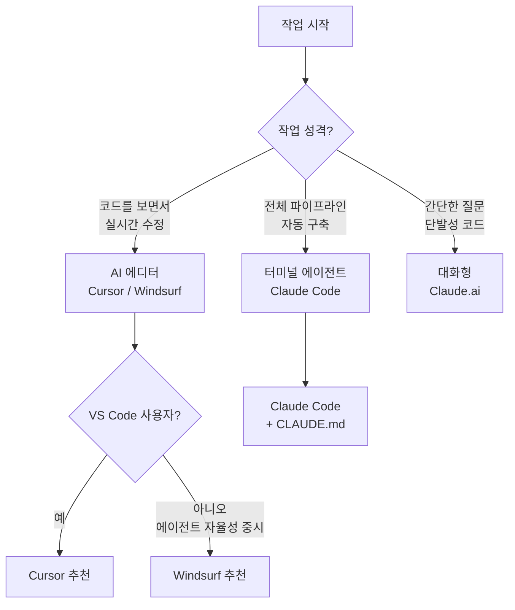

```toc
minLevel: 1
maxLevel: 1
```
# 제8장. AI 에디터 — Cursor / Windsurf

> *"코드 에디터 자체가 AI가 됐다. 이제 도구를 전환할 필요조차 없다."*

---

### 0) 연결 고리 (Bridge)

7장에서 터미널 에이전트(Claude Code, Codex CLI)를 배웠습니다. 터미널 에이전트는 강력하지만 코드를 눈으로 보면서 실시간으로 수정하는 **시각적 편집 경험**은 제공하지 않습니다. 8장에서 다루는 **AI 에디터**는 이 틈을 메웁니다. 기존에 익숙한 코드 에디터 환경에서 벗어나지 않고, 에디터 안에서 직접 AI와 대화하며 코드를 작성·수정·리팩터링합니다.

---

### 1) 개념 정의 및 필요성

#### AI 에디터란?

**AI 에디터(AI-powered Code Editor)**란 LLM이 에디터 핵심 기능으로 통합된 코드 편집 환경입니다. 별도 창을 열지 않아도 에디터 안에서 AI와 대화하고, 작성 중인 코드를 AI가 실시간으로 이해하며 제안·수정·설명합니다.

기존 방식과 비교하면 차이가 명확합니다.

| 작업 | 기존 방식 | AI 에디터 |
|------|----------|----------|
| 코드 오류 수정 | Stack Overflow 검색 → 코드 적용 | 에디터 안에서 AI에게 바로 질문 |
| 함수 리팩터링 | 직접 수정 | 드래그 후 "리팩터링해줘" |
| 새 기능 추가 | 직접 작성 또는 AI 창 전환 | 인라인으로 바로 요청 |
| 코드 설명 | 주석 확인 또는 검색 | 드래그 후 "설명해줘" |
| 테스트 작성 | 별도 작성 | 함수 선택 후 "테스트 만들어줘" |

---

### 2) Cursor

#### 개념 및 설치

**Cursor**는 VS Code를 기반으로 만든 AI 내장 코드 에디터입니다. VS Code의 모든 기능(확장 프로그램, 단축키, 테마)을 그대로 사용하면서 AI 기능이 핵심 레이어로 통합되어 있습니다. 기존 VS Code 사용자라면 설정 파일을 그대로 가져올 수 있어 전환 비용이 거의 없습니다.

**웹:** cursor.com  
**설치:** 웹사이트에서 설치 파일 다운로드 (Windows / macOS / Linux)  
**기반 모델:** Claude 4, GPT-4o, Gemini 2.5 Pro (선택 가능)

```bash
# VS Code 설정 가져오기 (최초 설치 시)
# Cursor 실행 → Command Palette (Ctrl+Shift+P)
# "Cursor: Import VS Code Settings" 선택
```

#### Cursor의 3가지 핵심 모드

**모드 1 — Tab 자동완성**  
다음에 올 코드를 예측해서 회색으로 미리 보여줍니다. `Tab`을 누르면 수락, `Esc`로 거절합니다.

```python
def calculate_budget_total(items):
    # 다음 줄 입력 시작하면 AI가 자동 예측
    total = sum(item['amount'] for item in items)  # ← AI 예측, Tab으로 수락
    return total
```

**모드 2 — Inline Edit (Ctrl+K)**  
코드를 선택하거나 빈 줄에서 `Ctrl+K`를 누르면 인라인 편집 창이 열립니다. 선택한 코드를 맥락으로 AI에게 수정을 요청합니다.

```
[코드 선택 후 Ctrl+K]
> 이 함수에 None 체크와 타입 힌트를 추가해줘

[결과 — 에디터에서 바로 diff 표시]
- def calculate_budget_total(items):
+ def calculate_budget_total(items: list[dict]) -> int:
+     if not items:
+         return 0
      total = sum(item['amount'] for item in items)
      return total
```

**모드 3 — AI Chat (Ctrl+L)**  
우측에 채팅 창이 열립니다. 현재 열린 파일 전체가 자동으로 컨텍스트에 포함됩니다. `@` 기호로 특정 파일·폴더·심볼을 명시적으로 참조할 수 있습니다.

```
[Ctrl+L 채팅 창에서]
> @budget_parser.py @json_structurer.py
  두 파일 사이의 데이터 흐름을 설명하고,
  연결 부분에서 발생할 수 있는 버그를 찾아줘.
```

#### Cursor의 @ 참조 시스템

```
@파일명          → 특정 파일을 컨텍스트에 추가
@폴더명          → 폴더 전체를 컨텍스트에 추가
@함수명          → 특정 함수만 참조
@Codebase        → 전체 프로젝트 검색
@Web             → 웹 검색 결과를 컨텍스트에 추가
@Docs            → 연결된 공식 문서 참조
```

**실제 활용 예시:**

```
> @Codebase에서 금액 계산 관련 함수를 모두 찾고,
  일관성 없는 처리 방식이 있으면 통일해줘.

> @Web Python pdfplumber merged cell 처리 방법을 찾아서
  @budget_parser.py의 현재 코드에 적용해줘.
```

#### Cursor Rules — 프로젝트 규칙 설정

Cursor의 `.cursorrules` 파일(또는 최신 버전의 Cursor Rules 설정)은 Claude Code의 CLAUDE.md와 유사합니다. 프로젝트 전체에 적용될 AI 행동 규칙을 정의합니다.

```markdown
# .cursorrules (프로젝트 루트)

## 코드 스타일
- Python 3.11 사용
- 모든 함수에 타입 힌트 필수
- docstring은 한국어로 작성
- 변수명은 snake_case

## 금지 사항
- requests 라이브러리 사용 금지 (httpx 사용)
- print() 디버깅 금지 (logging 모듈 사용)

## 이 프로젝트 특이사항
- 금액 필드는 항상 정수 타입 (float 금지)
- 날짜 형식은 YYYY-MM-DD 고정
```

---

### 3) Windsurf

#### 개념 및 설치

**Windsurf**는 Codeium이 개발한 AI 에디터로, **Cascade(캐스케이드)**라는 독자적인 AI 에이전트 시스템이 핵심입니다. Cursor가 VS Code 기반이라면, Windsurf는 처음부터 에이전트 중심으로 설계된 에디터입니다.

**웹:** codeium.com/windsurf  
**설치:** 웹사이트에서 다운로드  
**특징:** Cascade 에이전트, 멀티파일 자율 수정, 실시간 동기화

```
Windsurf의 Cascade 에이전트 특징:
- 에디터 안에서 파일을 직접 생성·수정·삭제
- 터미널 명령 자동 실행
- 브라우저 미리보기 통합
- 변경사항 자동 추적 및 롤백
```

#### Cursor vs Windsurf 비교

| 항목 | Cursor | Windsurf |
|------|--------|---------|
| **기반** | VS Code 포크 | 독자 에디터 |
| **AI 모델** | Claude / GPT-4o / Gemini 선택 | Cascade (자체 + 외부 모델) |
| **자율 에이전트** | Agent 모드 (Ctrl+I) | Cascade — 더 자율적 |
| **VS Code 호환** | ⭐⭐⭐⭐⭐ 완전 호환 | ⭐⭐⭐ 부분 호환 |
| **멀티파일 편집** | ⭐⭐⭐⭐ | ⭐⭐⭐⭐⭐ |
| **터미널 통합** | ⭐⭐⭐⭐ | ⭐⭐⭐⭐⭐ |
| **무료 플랜** | 제한적 | 더 관대함 |
| **한국어 지원** | ⭐⭐⭐⭐⭐ (Claude 선택 시) | ⭐⭐⭐⭐ |
| **추천 대상** | VS Code 사용자, Claude 선호 | 에이전트 자율성 중시 |

---

### 4) AI 에디터 vs 터미널 에이전트 — 언제 무엇을?



**AI 에디터가 적합한 상황:**
- 기존 코드를 보면서 부분 수정할 때
- 코드 리뷰, 리팩터링 작업
- 새 기능을 추가하되 기존 구조를 유지해야 할 때
- 설명을 보면서 학습하며 코딩할 때

**터미널 에이전트가 적합한 상황:**
- 새 프로젝트를 처음부터 구축할 때
- 수십 개 파일의 일괄 처리
- 반복 실행 파이프라인 구축
- 에디터보다 자동화 흐름이 중요할 때

---

### 5) 실무 시나리오 — Cursor로 레거시 코드 개선

**상황:** v15까지 간 budget_parser.py를 Cursor로 정리하는 작업

```
[Cursor에서 budget_parser.py 열기]

Step 1 — 전체 분석 (Ctrl+L)
> @budget_parser.py
  이 파일의 전체 구조를 분석하고,
  ① 중복 코드
  ② 타입 힌트 없는 함수
  ③ 에러 처리가 없는 구간
  을 목록으로 정리해줘.

Step 2 — 함수별 개선 (Ctrl+K)
[parse_merged_cells 함수 선택]
> 이 함수에 타입 힌트, docstring, 에러 처리를 추가해줘.
  기존 로직은 변경하지 말고.

Step 3 — 테스트 생성 (Ctrl+L)
> @budget_parser.py
  수정된 parse_merged_cells 함수의
  단위 테스트를 pytest 형식으로 작성해줘.
  정상 케이스 3개, 엣지 케이스 2개 포함.

Step 4 — 전체 리팩터링 (Agent 모드, Ctrl+I)
> budget_parser.py 전체를 리팩터링해줘.
  중복 제거, 함수 분리, 일관된 에러 처리.
  변경 전후 diff를 보여줘.
```

---

### 6) 안티 패턴 (Anti-Pattern)

**① Tab 완성을 무조건 수락**  
AI의 자동완성이 문맥상 맞아 보여도 잘못된 로직을 포함할 수 있습니다. 특히 비즈니스 로직이 담긴 코드는 수락 전 반드시 읽어보세요.

**② .cursorrules 없이 팀 협업**  
팀원마다 AI에게 다른 스타일을 요청하면 코드 일관성이 무너집니다. `.cursorrules`를 Git에 포함시켜 팀 전체가 동일한 규칙을 공유하세요.

**③ 에디터와 터미널 에이전트 동시 실행**  
Cursor가 파일을 수정하는 동시에 Claude Code도 같은 파일을 수정하면 충돌이 발생합니다. 한 번에 하나의 에이전트만 실행하세요.

---

### 7) 트러블슈팅 & 주의사항

**Q. Cursor가 VS Code보다 느립니다.**  
→ AI 인덱싱이 백그라운드에서 실행 중일 수 있습니다. 대규모 프로젝트는 초기 인덱싱에 수 분이 걸립니다. 완료 후 정상 속도로 돌아옵니다. 불필요한 폴더(`node_modules`, `.git`, 가상환경)는 `.cursorignore`에 추가하세요.

```
# .cursorignore
node_modules/
.git/
venv/
__pycache__/
*.pyc
```

**Q. Windsurf Cascade가 예상과 다른 파일을 수정했습니다.**  
→ Cascade의 변경 내역은 에디터 우측 타임라인 패널에서 확인하고 롤백할 수 있습니다. 중요한 작업 전 Git 커밋을 권장합니다.

**Q. @Codebase 검색이 오래된 코드를 참조합니다.**  
→ Cursor 설정에서 인덱스를 수동으로 재빌드하세요. `Command Palette → "Cursor: Rebuild Index"`

> **TIP:** Cursor를 처음 사용한다면 기존 프로젝트에 바로 적용하기보다 **Tab 완성 → Inline Edit → Chat 순서**로 기능을 하나씩 익히세요. Tab 완성만 잘 활용해도 코딩 속도가 눈에 띄게 빨라집니다.

---

### 8) 한 줄 요약

> 💡 **Key Takeaway:** AI 에디터는 **기존 코드 편집 환경에서 벗어나지 않고** AI와 실시간으로 협업하는 도구로, Cursor는 VS Code 호환성과 모델 선택 자유도, Windsurf는 에이전트 자율성이 강점입니다.

---

*다음 장: 9장. 앱 빌더 — Lovable / Bolt / v0*