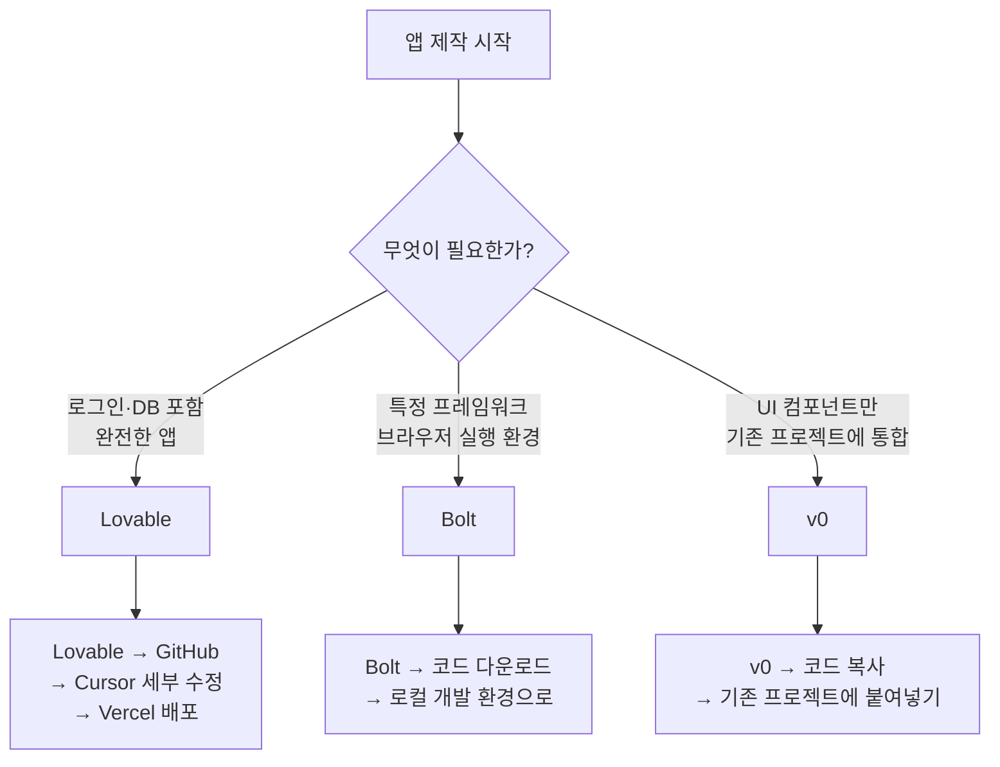

```toc
minLevel: 1
maxLevel: 1
```
# 제9장. 앱 빌더 — Lovable / Bolt / v0

> *"디자인도, 코드도, 배포도 — 자연어 한 줄로 시작한다."*

---

### 0) 연결 고리 (Bridge)

8장까지 코드 에디터 기반의 AI 도구를 살펴봤습니다. 그런데 이 도구들은 여전히 "코드를 다루는 환경"을 전제로 합니다. 9장에서 다루는 **앱 빌더**는 전혀 다른 접근법입니다. 코드 에디터도, 터미널도 필요 없습니다. 브라우저에서 원하는 앱을 설명하면 **디자인·코드·DB·배포까지 자동으로 완성**됩니다. 비개발자가 실제로 동작하는 웹 애플리케이션을 수십 분 안에 만들 수 있는 도구들입니다.

---

### 1) 개념 정의 및 필요성

#### 앱 빌더란?

**앱 빌더(AI App Builder)**란 자연어 설명만으로 프론트엔드 UI, 백엔드 로직, 데이터베이스 구조를 자동으로 생성하고 즉시 배포 가능한 상태로 만들어주는 AI 플랫폼입니다.

기존 웹앱 개발과 비교하면 차이가 극명합니다.

| 구분 | 전통 개발 | 앱 빌더 |
|------|----------|---------|
| **소요 시간** | 수 주 ~ 수 개월 | 수십 분 ~ 수 시간 |
| **필요 기술** | HTML/CSS/JS + 백엔드 + DB | 자연어 설명 능력 |
| **첫 결과물** | 환경 설정에만 수 시간 | 즉시 동작하는 화면 |
| **수정 방법** | 코드 직접 편집 | 채팅으로 요청 |
| **배포** | 서버 설정 필요 | 자동 배포 URL 제공 |
| **적합 상황** | 복잡한 커스텀 시스템 | 프로토타입, 내부 도구, MVP |

> **NOTE:** 앱 빌더는 복잡한 엔터프라이즈 시스템을 대체하지 않습니다. 빠른 프로토타입 제작, 내부 업무 도구, MVP(최소 기능 제품) 검증에 최적화된 도구입니다.

---

### 2) Lovable

#### 개념 및 특징

**Lovable**은 "GPT for apps"를 표방하는 앱 빌더로, 자연어로 설명하면 React 기반 풀스택 웹앱을 생성합니다. Supabase와 네이티브 통합으로 DB 설계와 API가 자동으로 구성됩니다.

**웹:** lovable.dev  
**생성 결과물:** React + TypeScript + Tailwind CSS + Supabase  
**배포:** 자동 (lovable.app 서브도메인 즉시 제공)  
**GitHub 연동:** 생성된 코드를 GitHub에 자동 푸시

#### Lovable 사용 흐름

```
1단계 — 앱 설명
"직원들이 연차 신청을 하고 관리자가 승인/거절할 수 있는
 웹 애플리케이션을 만들어줘.
 - 직원: 연차 신청, 내역 조회
 - 관리자: 신청 목록 확인, 승인/거절, 통계 대시보드
 - 로그인 기능 포함"

      ↓ (수 분 내)

2단계 — 결과물 자동 생성
 ✅ React 컴포넌트 (신청 폼, 목록, 대시보드)
 ✅ Supabase DB 스키마 (users, leave_requests 테이블)
 ✅ 인증 로직 (Supabase Auth)
 ✅ 배포 URL 즉시 제공

3단계 — 채팅으로 수정
"승인 시 신청자에게 이메일 알림을 보내줘."
"대시보드에 월별 차트를 추가해줘."
"모바일에서도 잘 보이게 해줘."
```

#### Lovable의 강점

**① GitHub 연동 — 코드 완전 소유**

```
Lovable → GitHub 연동 설정
→ 생성된 코드가 내 GitHub 레포에 자동 푸시
→ Cursor나 Claude Code로 세부 수정 가능
→ Vercel/Netlify로 추가 배포 가능

활용 패턴:
Lovable (초안 생성) → GitHub → Cursor (세부 수정)
→ Vercel (최종 배포)
```

**② Supabase 자동 통합**

```
Lovable이 자동으로 생성하는 것:
- Supabase 프로젝트 연결
- DB 테이블 스키마 생성
- Row Level Security (RLS) 정책 설정
- API 엔드포인트 자동 구성
- 실시간 구독 (Realtime) 설정
```

**③ 비주얼 편집 + 채팅 병행**

Lovable은 채팅으로만 수정하는 것이 아니라, 생성된 UI를 클릭해서 특정 요소를 선택하고 그 요소에 대해 바로 수정을 요청할 수 있습니다.

---

### 3) Bolt (StackBlitz)

#### 개념 및 특징

**Bolt**는 StackBlitz가 만든 브라우저 기반 풀스택 앱 빌더입니다. 브라우저 안에 완전한 Node.js 실행 환경을 구현한 **WebContainers** 기술을 기반으로, 서버 없이 브라우저만으로 실제 코드를 실행합니다.

**웹:** bolt.new  
**특징:** 브라우저 내 완전한 개발 환경, npm 패키지 즉시 설치 가능  
**생성 결과물:** React, Vue, Svelte, Next.js 등 다양한 프레임워크 지원

#### Bolt의 차별점

```
Bolt의 핵심 — WebContainers:

일반 앱 빌더:
  AI 생성 코드 → 외부 서버에서 실행 → 결과 표시

Bolt:
  AI 생성 코드 → 브라우저 안 Node.js 환경에서 실행
  → npm install도 브라우저에서 → 즉시 미리보기

장점:
  - 서버 왕복 없이 즉각적인 실행
  - npm 생태계 전체 활용 가능
  - 코드 편집기 + 미리보기 + 터미널이 한 화면에
```

#### Bolt 사용 예시

```
[bolt.new 접속 후]

"Node.js + Express로 간단한 REST API 서버를 만들어줘.
 엔드포인트:
 GET /api/budgets → 예산 목록 반환 (mock 데이터)
 POST /api/budgets → 새 예산 항목 추가
 JSON 응답 형식"

→ 브라우저에서 즉시 서버 실행 + API 테스트 가능
→ npm 패키지 추가도 채팅으로 요청 가능:
   "express-validator를 추가하고 입력 검증을 넣어줘"
```

---

### 4) v0 (Vercel)

#### 개념 및 특징

**v0**는 Vercel이 만든 UI 컴포넌트 생성 특화 앱 빌더입니다. 완전한 앱보다는 **재사용 가능한 React 컴포넌트** 생성에 특화되어 있으며, shadcn/ui와 Tailwind CSS 기반의 고품질 UI를 즉시 생성합니다.

**웹:** v0.dev  
**특징:** 컴포넌트 단위 생성, shadcn/ui 기반, Vercel 배포 원클릭  
**생성 결과물:** React + shadcn/ui + Tailwind CSS

#### v0의 강점 — 컴포넌트 단위 생성

```
[v0.dev에서]

"예산 항목 목록을 보여주는 테이블 컴포넌트를 만들어줘.
 컬럼: 항목명 / 예산액 / 집행액 / 집행률(%)
 집행률 90% 이상이면 빨간색 경고 표시
 정렬 기능 포함
 다크모드 지원"

→ 즉시 동작하는 React 컴포넌트 생성
→ "Copy Code" 버튼으로 복사 → 기존 프로젝트에 붙여넣기
→ 또는 Vercel로 바로 배포
```

**v0 활용 패턴:**

```
v0 (UI 컴포넌트 생성) → 코드 복사
→ Cursor/VS Code에서 기존 프로젝트에 통합
→ Vercel로 배포

또는:
Lovable (앱 전체 생성) → 특정 컴포넌트만 v0로 교체
→ 더 정교한 UI 적용
```

---

### 5) 3대 앱 빌더 비교표

| 항목 | Lovable | Bolt | v0 |
|------|---------|------|-----|
| **생성 단위** | 풀스택 앱 | 풀스택 앱 | UI 컴포넌트 |
| **DB 통합** | ⭐⭐⭐⭐⭐ Supabase 네이티브 | 직접 설정 필요 | ❌ |
| **인증 기능** | ⭐⭐⭐⭐⭐ 자동 | 직접 구현 | ❌ |
| **실행 환경** | 클라우드 | 브라우저 (WebContainers) | 클라우드 미리보기 |
| **npm 패키지** | 제한적 | ⭐⭐⭐⭐⭐ 전체 가능 | 제한적 |
| **코드 소유** | GitHub 연동 | 다운로드/GitHub | 코드 복사 |
| **Vercel 배포** | 가능 | 가능 | ⭐⭐⭐⭐⭐ 원클릭 |
| **무료 플랜** | 제한적 | 제한적 | 넉넉함 |
| **추천 상황** | 풀스택 앱 프로토타입 | 다양한 프레임워크 실험 | UI 컴포넌트 단위 생성 |

---

### 6) 상황별 선택 가이드



---

### 7) 실무 시나리오 — 내부 업무 도구 30분 만들기

**상황:** 팀의 주간 업무 보고를 수집하고 관리자가 한 눈에 볼 수 있는 내부 도구가 필요

```
[Lovable에서]

Step 1 — 앱 생성 요청:
"주간 업무 보고 수집 웹 앱을 만들어줘.

 기능:
 - 팀원: 매주 월요일 전 주 업무 보고 제출
   (이번 주 완료 / 다음 주 계획 / 이슈 사항)
 - 관리자: 전체 팀원 보고 목록 조회, 엑셀 다운로드

 기타:
 - 이메일/비밀번호 로그인
 - 팀원/관리자 권한 구분
 - 모바일 반응형"

      ↓ (약 5~10분)

Step 2 — 결과 확인 후 수정:
"보고서 목록에 팀별 필터를 추가해줘."
"관리자 대시보드에 제출률 통계 차트를 넣어줘."

Step 3 — GitHub 연동:
"코드를 내 GitHub에 푸시해줘."

Step 4 — Cursor로 세부 수정:
(GitHub 클론 후 Cursor에서 열기)
> "이메일 알림 기능을 추가해줘.
   매주 금요일 오후 5시, 미제출 팀원에게 리마인더 발송."

Step 5 — Vercel 배포:
GitHub 연결 → 자동 배포 → 팀에 URL 공유
```

---

### 8) 안티 패턴 (Anti-Pattern)

**① 복잡한 비즈니스 로직을 앱 빌더로 구현**  
앱 빌더는 표준적인 CRUD(생성·조회·수정·삭제) 기반 앱에 강합니다. 복잡한 계산 로직, 외부 API 연동, 대용량 데이터 처리는 Claude Code나 전문 개발자가 필요합니다.

**② 생성된 코드를 이해하지 않고 운영**  
"동작하니까 됐다"고 생각하고 내부 코드를 전혀 이해하지 않으면, 수정이 필요할 때 앱 빌더가 예상 밖의 변경을 할 수 있습니다. GitHub에 코드를 연동해두고 주기적으로 구조를 파악해두세요.

**③ 실 사용자 데이터를 프로토타입에 바로 적용**  
앱 빌더로 만든 앱은 보안 검토 없이 실제 민감한 데이터를 저장하면 안 됩니다. 내부 도구라도 개인정보가 포함된다면 보안 설정을 별도로 확인하세요.

---

### 9) 트러블슈팅 & 주의사항

**Q. Lovable이 생성한 앱에서 DB 오류가 납니다.**  
→ Supabase 대시보드에서 RLS(Row Level Security) 정책을 확인하세요. Lovable이 자동 생성한 RLS가 너무 엄격하거나 누락된 경우가 있습니다. Lovable 채팅에서 "Supabase RLS 오류를 수정해줘"라고 요청하면 자동으로 수정합니다.

**Q. Bolt에서 npm install이 느립니다.**  
→ WebContainers의 특성상 패키지 설치 속도는 네트워크 환경에 따라 다릅니다. 무거운 패키지(예: TensorFlow.js)는 브라우저 환경에서 느릴 수 있습니다. 이 경우 Bolt에서 프로토타입 후 로컬 환경으로 옮기는 것을 권장합니다.

**Q. v0가 생성한 컴포넌트가 기존 프로젝트와 스타일이 충돌합니다.**  
→ v0는 기본적으로 shadcn/ui + Tailwind CSS를 사용합니다. 기존 프로젝트에 shadcn/ui가 없다면 "shadcn/ui 없이 순수 Tailwind CSS만 사용해줘"라고 요청하거나, 컴포넌트의 className을 기존 스타일 시스템에 맞게 수정하세요.

> **TIP:** 앱 빌더로 만든 결과물은 **프로토타입의 출발점**으로 생각하세요. "이 정도면 됐다"가 아니라 "이걸 기반으로 Cursor에서 다듬자"는 마인드가 앱 빌더를 가장 효과적으로 활용하는 방법입니다.

---

### 10) 한 줄 요약

> 💡 **Key Takeaway:** Lovable은 DB·인증 포함 풀스택 앱, Bolt는 브라우저 실행 환경, v0는 고품질 UI 컴포넌트 — 세 도구를 **조합하면 비개발자도 실제 동작하는 웹 서비스를 수십 분 안에 만들 수 있습니다.**

---

*다음 장: 10장. 자동화 플랫폼 — n8n / Make / Zapier / Antigravity*