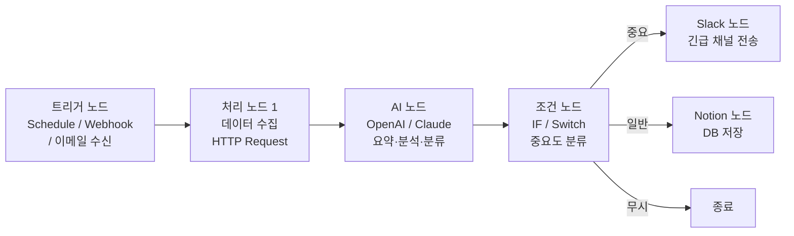
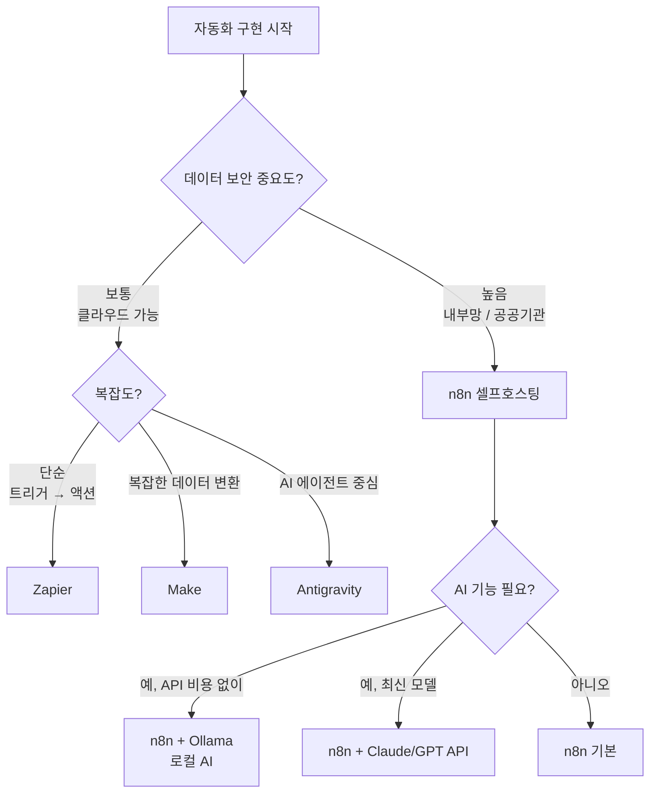

```toc
minLevel: 1
maxLevel: 1
```
# 제10장. 자동화 플랫폼 — n8n / Make / Zapier / Antigravity

> *"반복되는 업무는 한 번만 설계하고, 이후는 기계에게 맡긴다."*

---

### 0) 연결 고리 (Bridge)

9장에서 앱 빌더로 웹 애플리케이션을 빠르게 만드는 방법을 배웠습니다. 그런데 앱을 만드는 것과 별개로, 이미 사용하는 서비스들(이메일, 메신저, 문서 도구, DB) 사이에서 **데이터를 자동으로 이동시키고 처리**해야 하는 상황이 매일 발생합니다. 10장에서는 코딩 없이 이 자동화 흐름을 설계하는 **자동화 플랫폼**을 다룹니다.

---

### 1) 개념 정의 및 필요성

#### 자동화 플랫폼이란?

**자동화 플랫폼(Workflow Automation Platform)**이란 여러 앱·서비스 사이의 데이터 흐름을 **노드(Node)** 또는 **블록**으로 시각적으로 설계하고 자동 실행하는 도구입니다. 코드 없이 "A가 발생하면 B를 해서 C에 전달한다"는 흐름을 만들 수 있습니다.

**자동화 플랫폼이 해결하는 문제:**

```
[수동 반복 업무의 예]
매일 아침:
  1. 이메일 확인 → 공공데이터 공고 수집
  2. 내용 요약 정리
  3. 팀 Slack 채널에 공유
  4. 중요 공고는 Notion에 저장

→ 매일 30분 소요, 실수 가능, 담당자 부재 시 누락

[자동화 플랫폼 적용 후]
→ 매일 오전 8시 자동 실행, 0분 소요, 누락 없음
```

---

### 2) n8n

#### 개념 및 특징

**n8n(node eight n)**은 오픈소스 기반 워크플로우 자동화 플랫폼으로, **셀프 호스팅(Self-hosting)**이 가능한 것이 가장 큰 차별점입니다. 클라우드 서비스에 데이터를 맡기지 않고 자체 서버에서 실행할 수 있어, 보안이 중요한 기관·기업에 적합합니다.

**웹:** n8n.io  
**설치 방법:** 클라우드(n8n.cloud) 또는 셀프 호스팅(Docker)  
**라이선스:** 오픈소스 (Fair Code)  
**AI 통합:** LangChain 기반 AI 노드 내장

#### n8n 설치 — 셀프 호스팅 (Docker)

```bash
# Docker로 n8n 실행 (로컬 PC 또는 서버)
docker run -d \
  --name n8n \
  -p 5678:5678 \
  -v n8n_data:/home/node/.n8n \
  n8nio/n8n

# 실행 후 브라우저에서 접속
# http://localhost:5678
```

> **TIP:** N100 미니PC(약 10만 원대)에 n8n을 설치하면 24시간 자동화 서버를 저전력으로 운영할 수 있습니다. 월 전기세 수천 원으로 클라우드 서비스를 대체할 수 있습니다.

#### n8n 워크플로우 구조



#### n8n AI 노드 활용

n8n은 LangChain 기반 AI 에이전트를 노드로 내장하고 있습니다.

```
[n8n AI Agent 노드 설정 예시]

트리거: 매일 08:00 Schedule

노드 1 — HTTP Request:
  URL: 공공데이터포털 API
  → 신규 공고 JSON 수집

노드 2 — AI Agent (Claude/OpenAI):
  시스템 프롬프트:
    "너는 정부 ICT 정책 전문가야.
     아래 공고를 분석해서 다음 형식으로 요약해:
     - 공고명
     - 핵심 내용 (2줄)
     - 중요도: 상/중/하
     - 이유"

노드 3 — IF:
  조건: 중요도 == "상"

노드 4a — Slack:
  채널: #긴급-공지
  메시지: 요약 내용

노드 4b — Notion:
  데이터베이스: 공고 아카이브
  새 페이지 생성
```

#### n8n과 Ollama — 완전 로컬 AI 자동화

인터넷 연결 없이, API 비용 없이 AI 자동화를 구현하려면 **Ollama**와 n8n을 조합합니다.

```bash
# Ollama 설치 (로컬 AI 실행 엔진)
curl -fsSL https://ollama.ai/install.sh | sh

# 한국어 지원 모델 다운로드
ollama pull gemma3:12b     # Google Gemma3 12B
ollama pull qwen2.5:14b    # Alibaba Qwen2.5 14B (한국어 우수)

# n8n에서 Ollama 노드 연결
# Base URL: http://localhost:11434
```

```
로컬 AI 자동화 스택:
N100 미니PC
  ├── n8n (워크플로우 엔진)
  ├── Ollama (로컬 LLM 실행)
  └── Portainer (Docker 컨테이너 관리)

장점:
  ✅ API 비용 없음
  ✅ 인터넷 없이 동작
  ✅ 민감 데이터 외부 전송 없음
  ✅ 24시간 자동 실행
```

---

### 3) Make (구 Integromat)

#### 개념 및 특징

**Make**는 시각적 워크플로우 자동화 플랫폼으로, **시나리오(Scenario)**라 불리는 자동화 흐름을 드래그앤드롭으로 설계합니다. 1,500개 이상의 앱 연동을 지원하며, 복잡한 데이터 변환 기능이 강점입니다.

**웹:** make.com  
**특징:** 시각적 설계 UI, 강력한 데이터 매핑, 클라우드 전용  
**무료 플랜:** 월 1,000 작업 실행

#### Make가 강한 상황

```
복잡한 데이터 변환이 필요한 자동화:

예시:
Google Form 응답 수신
  → 응답 데이터 파싱 (Make의 데이터 매핑 기능)
  → 조건에 따라 분기 처리
  → Airtable / Google Sheets 저장
  → 조건별 다른 이메일 자동 발송
  → Slack 담당자 알림
```

---

### 4) Zapier

#### 개념 및 특징

**Zapier**는 가장 널리 쓰이는 클라우드 자동화 플랫폼으로, **Zap**이라 불리는 2단계(트리거 → 액션) 자동화를 가장 간단하게 만들 수 있습니다. 7,000개 이상의 앱을 지원하는 최대 생태계가 강점입니다.

**웹:** zapier.com  
**특징:** 가장 쉬운 설정, 최다 앱 연동, 클라우드 전용  
**무료 플랜:** 월 100 작업 실행 (제한적)

#### 플랫폼별 3자 비교

| 항목 | n8n | Make | Zapier |
|------|-----|------|--------|
| **호스팅** | 셀프 / 클라우드 | 클라우드 전용 | 클라우드 전용 |
| **오픈소스** | ✅ | ❌ | ❌ |
| **무료 플랜** | 셀프호스팅 무제한 | 월 1,000 작업 | 월 100 작업 |
| **앱 연동 수** | 400+ | 1,500+ | 7,000+ |
| **AI 노드** | ⭐⭐⭐⭐⭐ 내장 | ⭐⭐⭐ | ⭐⭐⭐ |
| **데이터 보안** | ⭐⭐⭐⭐⭐ 셀프호스팅 | ⭐⭐⭐ | ⭐⭐⭐ |
| **설정 난이도** | 중간 | 쉬움 | 매우 쉬움 |
| **복잡한 로직** | ⭐⭐⭐⭐⭐ | ⭐⭐⭐⭐⭐ | ⭐⭐⭐ |
| **추천 대상** | 보안 중시, AI 자동화 | 복잡한 데이터 처리 | 빠른 단순 연동 |

---

### 5) Antigravity

#### 개념 및 특징

**Antigravity**는 AI 에이전트 기반의 차세대 자동화 플랫폼으로, 기존 자동화 플랫폼이 "노드를 연결하는" 방식이라면 Antigravity는 **"목표를 말하면 AI가 워크플로우를 설계하고 실행"**하는 방식입니다.

**특징:**
- 자연어로 자동화 목표 설명 → AI가 워크플로우 자동 생성
- 기존 n8n/Make 워크플로우를 AI가 분석·최적화
- 에이전트가 스스로 오류를 감지하고 워크플로우 수정
- 인간 승인(Human-in-the-loop) 체크포인트 내장

```
[Antigravity 사용 예시]

사람:
"매일 아침 공공데이터 포털에서 ICT 관련 공고를 수집해서
 중요도를 분류하고, 상위 3개를 Slack으로 보내줘.
 이미 처리한 공고는 중복으로 보내지 말고."

Antigravity:
→ 워크플로우 자동 설계:
  Schedule → HTTP 수집 → AI 분류 → 중복 체크(DB) →
  상위 3개 필터 → Slack 전송 → DB 업데이트
→ 자동 실행 및 모니터링
→ 오류 발생 시 자동 수정 또는 사람에게 알림
```

> **NOTE:** Antigravity는 2025~2026년 기준 빠르게 성장 중인 플랫폼입니다. 기능과 가격 정책이 변경될 수 있으므로 공식 웹사이트에서 최신 정보를 확인하세요.

---

### 6) 실무 시나리오 — n8n 로컬 자동화 서버 구축

**상황:** 정부 ICT 사업 공고를 매일 자동 수집·분류·공유하는 시스템

```
[전체 아키텍처]
N100 미니PC
  ├── n8n: 워크플로우 엔진
  ├── Ollama + Qwen2.5: 로컬 AI (요약·분류)
  ├── SQLite: 공고 이력 DB
  └── Portainer: 컨테이너 관리 UI

[워크플로우 설계]

1. 트리거: 매일 07:50 Schedule

2. 수집 노드 (HTTP Request × 3):
   - 정보통신산업진흥원(NIPA) 공고 API
   - 한국지능정보사회진흥원(NIA) 공고 API
   - 과학기술정보통신부 공고 페이지

3. 병합 노드 (Merge):
   - 3개 소스 데이터 통합

4. 중복 제거 노드 (Code):
   - SQLite에서 기존 공고 ID 조회
   - 신규 공고만 필터링

5. AI 분류 노드 (Ollama):
   시스템 프롬프트:
   "각 공고를 분석해서 JSON으로 반환:
    {
      'title': '공고명',
      'summary': '핵심 내용 2줄',
      'importance': '상/중/하',
      'deadline': '마감일',
      'reason': '중요도 판단 이유'
    }"

6. 필터 노드 (IF):
   - 중요도 '상'인 공고만 통과

7. 포맷 노드 (Code):
   Slack 메시지 형식으로 변환

8. Slack 노드:
   채널: #공고-알림
   메시지 전송

9. Notion 노드:
   전체 신규 공고를 DB에 저장

10. SQLite 노드:
    처리 완료 공고 ID 기록
```

---

### 7) 자동화 플랫폼 선택 가이드



---

### 8) 안티 패턴 (Anti-Pattern)

**① 모든 것을 자동화하려는 욕심**  
월 1회 실행하는 작업은 자동화 설계 비용이 실행 시간 절약보다 클 수 있습니다. 매일·매주 반복되는 작업부터 자동화하세요.

**② 오류 알림 없는 자동화**  
워크플로우가 실패해도 모르고 지나치는 경우가 많습니다. 모든 워크플로우에 오류 시 Slack/이메일 알림 노드를 반드시 추가하세요.

```
n8n 오류 알림 설정:
워크플로우 설정 → Error Workflow 지정
→ 오류 발생 시 별도 워크플로우 실행
→ Slack으로 오류 내용과 실패한 노드 이름 전송
```

**③ API 키를 워크플로우에 하드코딩**  
n8n, Make, Zapier 모두 **Credentials(자격증명)** 기능을 제공합니다. API 키는 반드시 Credentials에 저장하고, 워크플로우에서는 참조하는 방식을 사용하세요.

**④ 테스트 없이 실 데이터에 바로 적용**  
자동화 워크플로우는 반드시 테스트 데이터로 먼저 실행하세요. 특히 데이터 삭제·수정이 포함된 워크플로우는 복구가 어렵습니다.

---

### 9) 트러블슈팅 & 주의사항

**Q. n8n 워크플로우가 갑자기 중단됩니다.**  
→ 실행 로그(Executions 탭)에서 실패한 노드와 오류 메시지를 확인하세요. 가장 흔한 원인은 API 응답 형식 변경, Rate Limit 초과, 인증 토큰 만료입니다.

**Q. Zapier 무료 플랜이 금방 소진됩니다.**  
→ Zapier 무료는 월 100 작업으로 매우 제한적입니다. 자주 실행되는 자동화는 n8n 셀프호스팅(무제한)으로 이전하는 것을 권장합니다.

**Q. n8n Docker 컨테이너가 재시작 후 워크플로우가 사라집니다.**  
→ 볼륨 마운트 설정을 확인하세요. `-v n8n_data:/home/node/.n8n` 옵션이 없으면 컨테이너 재시작 시 데이터가 초기화됩니다.

```bash
# 데이터 보존 확인
docker inspect n8n | grep Mounts
# Mounts 항목에 n8n_data 볼륨이 있어야 함
```

> **TIP:** 처음 자동화 플랫폼을 시작한다면 **Zapier의 무료 플랜으로 개념을 익히고**, 이후 더 복잡한 자동화나 보안이 필요한 경우 **n8n 셀프호스팅으로 이전**하는 경로가 가장 자연스럽습니다.

---

### 10) 한 줄 요약

> 💡 **Key Takeaway:** 자동화 플랫폼은 반복 업무를 **한 번 설계하고 영원히 실행**하는 도구로, 보안이 중요하면 n8n 셀프호스팅, 빠른 단순 연동은 Zapier, 복잡한 데이터 처리는 Make, AI 에이전트 자동화는 Antigravity를 선택하세요.

---

*다음 장: 11장. GitHub — 버전 관리와 AI 협업*