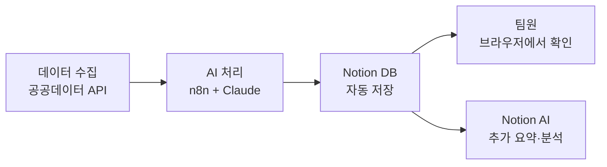
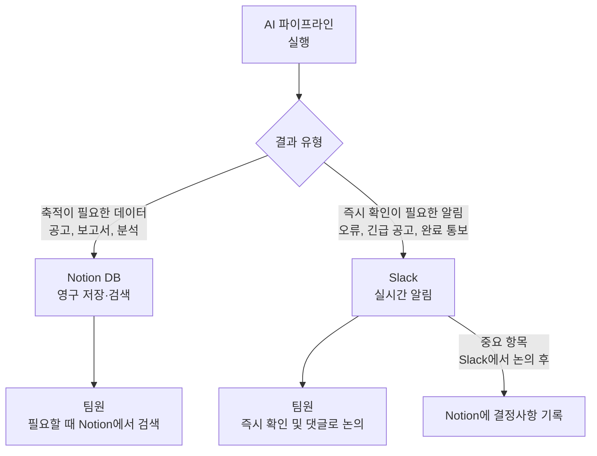

```toc
minLevel: 1
maxLevel: 1
```
# 제13장. 협업·알림 — Notion / Slack

> *"AI가 만든 결과물은 팀과 공유될 때 비로소 가치가 완성된다."*

---

### 0) 연결 고리 (Bridge)

12장에서 Obsidian으로 개인 AI 작업 자산을 관리하는 방법을 배웠습니다. 그런데 AI 자동화의 결과물은 결국 팀과 공유되어야 합니다. 자동으로 생성된 보고서, 수집된 공고 요약, 파이프라인 실행 결과를 어떻게 팀에 전달할까요? 13장에서는 조직 내 협업의 중심 도구인 **Notion**과 **Slack**을 AI 자동화와 연결하는 방법을 다룹니다.

---

### 1) Notion — AI 결과물의 협업 허브

#### 개념 및 특징

**Notion**은 문서·데이터베이스·위키·프로젝트 관리를 하나의 플랫폼에서 처리하는 협업 도구입니다. AI 자동화 관점에서 Notion은 **파이프라인의 최종 목적지**이자 **팀이 AI 결과물을 확인하는 창구** 역할을 합니다.

**웹:** notion.so  
**API:** 공식 API 제공 (n8n, Make, Zapier 모두 지원)  
**AI 기능:** Notion AI 내장 (요약, 번역, 작성 지원)

#### Notion을 AI 파이프라인 종착점으로 활용



#### Notion Database 자동 저장 — n8n 연동

```javascript
// n8n의 Notion 노드 설정 예시
// 공고 정보를 Notion 데이터베이스에 자동 저장

{
  "database_id": "your-database-id",
  "properties": {
    "공고명": {
      "title": [{"text": {"content": "{{$json.title}}"}}]
    },
    "기관": {
      "rich_text": [{"text": {"content": "{{$json.organization}"}}]
    },
    "마감일": {
      "date": {"start": "{{$json.deadline}}"}
    },
    "중요도": {
      "select": {"name": "{{$json.importance}}"}
    },
    "AI 요약": {
      "rich_text": [{"text": {"content": "{{$json.ai_summary}}"}}]
    },
    "원문 링크": {
      "url": "{{$json.url}}"
    },
    "처리 상태": {
      "status": {"name": "검토 필요"}
    }
  }
}
```

#### Notion AI와 자동화 데이터 결합

Notion에 데이터가 쌓이면 **Notion AI**로 추가 분석을 할 수 있습니다.

```
[Notion 페이지에서 Notion AI 활용]

축적된 공고 100건을 바탕으로:
→ "/AI 요약 작성" → 이번 달 주요 공고 트렌드 요약
→ "/AI 번역" → 영문 공고 한국어 번역
→ "/AI 표 만들기" → 공고 유형별 분류표 자동 생성
```

#### Notion MCP — Claude와 직접 연동

Claude.ai에 Notion MCP가 연결되어 있다면, 자연어로 Notion을 직접 조작할 수 있습니다.

```
[Claude.ai에서 Notion MCP 활용]

"지난 주 Notion 공고 DB에서
 마감일이 이번 주인 항목을 찾아서
 중요도 순으로 정렬해줘."

"오늘 회의 내용을 Notion 팀 위키에
 회의록 형식으로 저장해줘."

"Notion의 프로젝트 현황 DB를 읽고
 이번 주 마감 임박 작업을 요약해줘."
```

---

### 2) Slack — AI 자동화 알림의 실시간 채널

#### 개념 및 특징

**Slack**은 채널 기반 팀 메신저로, AI 자동화 결과의 **실시간 알림 수신 창구**로 가장 많이 활용됩니다. n8n, Make, Zapier 등 모든 자동화 플랫폼이 Slack 연동을 지원합니다.

**웹:** slack.com  
**Webhook:** Incoming Webhook으로 외부에서 메시지 전송 가능  
**봇:** Slack Bot API로 양방향 인터랙션 구현 가능

#### Incoming Webhook 설정

```
Slack Incoming Webhook 설정 방법:
1. Slack 워크스페이스 → Apps → Incoming Webhooks
2. "Add to Slack" → 채널 선택
3. Webhook URL 복사 (https://hooks.slack.com/services/...)
4. n8n/Make/코드에서 이 URL로 POST 요청
```

```python
# Python으로 Slack 메시지 전송
import httpx

def send_slack_alert(message: str, channel: str = "#공고-알림"):
    webhook_url = "https://hooks.slack.com/services/YOUR/WEBHOOK/URL"

    payload = {
        "channel": channel,
        "text": message,
        "username": "AI 공고봇",
        "icon_emoji": ":robot_face:"
    }

    response = httpx.post(webhook_url, json=payload)
    return response.status_code == 200
```

#### Slack Block Kit — 구조화된 메시지

단순 텍스트가 아닌 카드 형식의 메시지를 보내면 가독성이 크게 향상됩니다.

```python
# Block Kit을 이용한 구조화 메시지
payload = {
    "blocks": [
        {
            "type": "header",
            "text": {"type": "plain_text", "text": "📢 오늘의 ICT 공고 요약"}
        },
        {
            "type": "section",
            "fields": [
                {"type": "mrkdwn", "text": f"*신규 공고:* {count}건"},
                {"type": "mrkdwn", "text": f"*중요도 '상':* {high_count}건"}
            ]
        },
        {"type": "divider"},
        {
            "type": "section",
            "text": {
                "type": "mrkdwn",
                "text": f"*【중요】{top_notice['title']}*\n{top_notice['summary']}\n마감: {top_notice['deadline']}"
            },
            "accessory": {
                "type": "button",
                "text": {"type": "plain_text", "text": "원문 보기"},
                "url": top_notice['url']
            }
        }
    ]
}
```

#### Slack 봇 — 양방향 AI 인터랙션

Slack 봇을 만들면 팀원이 Slack에서 직접 AI에게 질문하거나 명령을 내릴 수 있습니다.

```
[Slack 봇 활용 시나리오]

팀원이 Slack에서:
@AI봇 이번 달 예산 집행률 알려줘
  → 봇이 DB 조회 후 답변

@AI봇 오늘 공고 요약해줘
  → 봇이 당일 수집된 공고 요약 전송

@AI봇 보고서 초안 작성해줘 "3월 ICT 사업 현황"
  → Claude API 호출 → 보고서 초안 생성 → 스레드에 전송
```

---

### 3) Notion + Slack 통합 패턴

실무에서 가장 효과적인 패턴은 **Notion(저장·검색)과 Slack(알림·논의)을 역할 분리**하는 것입니다.



#### 통합 워크플로우 예시

```
[n8n 워크플로우]

1. 트리거: 매일 08:00

2. 공고 수집 및 AI 분류

3. 결과 분기:
   ├── 전체 공고 → Notion DB 저장
   ├── 중요도 '상' 공고 → Slack #긴급-공지 전송
   └── 오류 발생 → Slack #개발-알림 전송

4. 주간 금요일:
   → Notion에 쌓인 주간 공고를 AI로 요약
   → Slack #주간-리포트에 요약 전송
```

---

### 4) AI 자동화와 Notion/Slack 연동 도구 비교

| 연동 방법 | 난이도 | 기능 | 추천 상황 |
|----------|--------|------|----------|
| **Zapier** | ⭐ 쉬움 | 기본 | 단순 연동, 빠른 시작 |
| **Make** | ⭐⭐ | 중간 | 복잡한 데이터 변환 |
| **n8n** | ⭐⭐⭐ | 풍부 | 보안 중시, 로컬 실행 |
| **직접 API** | ⭐⭐⭐⭐ | 완전 제어 | 커스텀 봇, 세밀한 제어 |
| **MCP (Claude)** | ⭐⭐ | 자연어 | Claude.ai에서 직접 조작 |

---

### 5) 실무 시나리오 — 자동화 보고 시스템

**상황:** ICT 사업 담당 팀의 주간 공고 관리 자동화

```
[월~금 매일 08:00]
n8n 자동 실행
  → 공공데이터 수집
  → Claude로 분류·요약
  → Notion "공고 아카이브" DB에 저장
  → 중요도 '상' → Slack #공고-알림 즉시 전송

[매주 금요일 17:00]
n8n 주간 리포트
  → Notion DB에서 이번 주 공고 데이터 조회
  → Claude로 주간 트렌드 요약 생성
  → Notion "주간 리포트" 페이지 자동 생성
  → Slack #팀-전체 채널에 링크 공유

[팀원 액션]
  → Slack 알림으로 중요 공고 즉시 인지
  → 필요 시 Notion에서 전체 이력 검색
  → Notion에서 담당자 배정, 처리 상태 업데이트
```

---

### 6) 안티 패턴 (Anti-Pattern)

**① Slack 알림이 너무 많아 알림 피로 유발**
모든 자동화 결과를 Slack으로 보내면 팀원들이 알림을 무시하기 시작합니다. Slack은 즉시 확인이 필요한 것만, 나머지는 Notion에 쌓아두는 규칙을 정하세요.

**② Notion DB 구조 없이 페이지만 쌓기**
AI가 생성한 내용을 페이지로만 저장하면 나중에 검색·필터링이 불가능합니다. 반드시 데이터베이스(Database) 형식으로 구조화해서 저장하세요.

**③ Webhook URL을 코드에 하드코딩**
Slack Webhook URL이 GitHub에 노출되면 스팸 메시지 발송에 악용될 수 있습니다. 반드시 환경 변수나 n8n Credentials에 저장하세요.

---

### 7) 트러블슈팅 & 주의사항

**Q. Notion API로 저장한 내용이 DB에 안 보입니다.**
→ Notion Integration의 페이지 접근 권한을 확인하세요. DB 페이지에서 "Connect to" → Integration 이름을 선택해야 API 접근이 허용됩니다.

**Q. Slack 메시지가 전송되지 않습니다.**
→ Webhook URL이 유효한지 확인하세요. Slack 앱 설정에서 Webhook이 비활성화됐거나 채널이 삭제된 경우 URL이 만료됩니다.

**Q. Notion 무료 플랜에서 API 호출이 막힙니다.**
→ Notion API는 무료 플랜도 지원하지만, 분당 3회 요청 제한이 있습니다. 대량 데이터 저장 시 n8n에서 요청 사이에 1~2초 지연을 추가하세요.

> **TIP:** Notion과 Slack 연동을 처음 시작한다면, **Make의 무료 플랜**으로 "Google Form 제출 → Notion 저장 → Slack 알림"의 단순한 3단계 자동화부터 만들어보세요. 30분 안에 완성할 수 있고, 자동화 플랫폼의 작동 원리를 직관적으로 익힐 수 있습니다.

---

### 8) 한 줄 요약

> 💡 **Key Takeaway:** Notion은 AI 결과물의 **영구 저장·검색 허브**, Slack은 **실시간 알림·논의 채널** — 두 도구의 역할을 명확히 분리하면 팀 전체가 AI 자동화의 혜택을 자연스럽게 누릴 수 있습니다.

---

*다음 장: 14장. 배포 — Vercel*