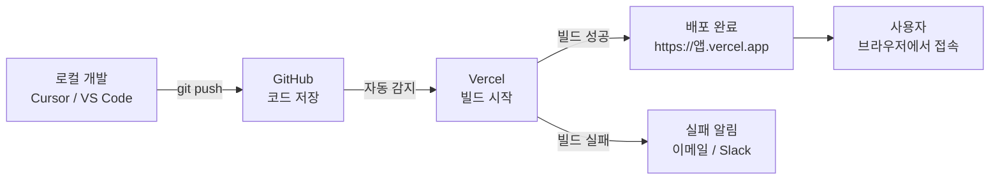
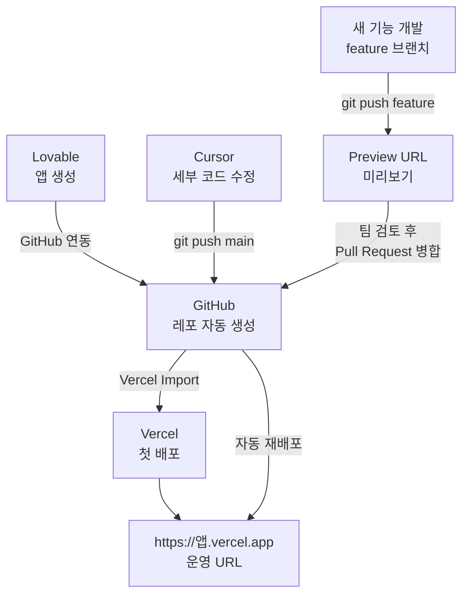

```toc
minLevel: 1
maxLevel: 1
```
# 제14장. 배포 — Vercel

> *"코드를 만드는 것보다 세상에 내보내는 것이 더 어렵던 시절이 있었다. Vercel이 그 벽을 없앴다."*

---

### 0) 연결 고리 (Bridge)

9장에서 Lovable로 앱을 만들고, 11장에서 GitHub에 코드를 저장하는 방법을 배웠습니다. 이제 남은 것은 만든 앱을 실제 인터넷에서 접근 가능한 URL로 **배포(Deploy)**하는 일입니다. 14장에서 다루는 **Vercel**은 GitHub와 연결하면 코드 푸시만으로 자동 배포가 완성되는 플랫폼입니다. 서버 설정, 도메인 연결, HTTPS 설정 — 이 모든 것을 Vercel이 대신 처리합니다.

---

### 1) 개념 정의 및 필요성

#### 배포란? 왜 필요한가?

**배포(Deploy)**란 로컬 PC에서만 실행되던 코드를 인터넷에서 누구나 접근 가능한 서버에 올리는 과정입니다.

```
배포 전:
  내 PC에서만 http://localhost:3000 으로 접속 가능
  → 내가 PC를 끄면 서비스도 중단
  → 다른 사람은 접근 불가

배포 후:
  https://my-app.vercel.app 으로 전 세계 어디서나 접속
  → 24시간 서비스 가동
  → 팀원, 외부 사용자 모두 접근 가능
```

#### Vercel이란?

**Vercel**은 프론트엔드 웹 애플리케이션 특화 클라우드 배포 플랫폼입니다. GitHub 레포지터리를 연결하면 코드가 푸시될 때마다 자동으로 빌드·배포합니다. Next.js의 개발사이기도 해서 Next.js 프로젝트에 최적화되어 있지만, React, Vue, Svelte 등 모든 프론트엔드 프레임워크를 지원합니다.

**웹:** vercel.com  
**무료 플랜:** 개인 프로젝트 무제한 배포  
**자동 배포:** GitHub/GitLab 연동 시 푸시할 때마다 자동 배포  
**도메인:** .vercel.app 서브도메인 즉시 제공, 커스텀 도메인 연결 가능

---

### 2) Vercel 핵심 개념

#### 자동 배포 파이프라인



#### Preview 배포 — 브랜치별 미리보기

Vercel의 가장 강력한 기능 중 하나입니다. main 브랜치가 아닌 다른 브랜치에 푸시하면 **별도의 Preview URL**이 자동 생성됩니다.

```
main 브랜치 → https://my-app.vercel.app (운영 버전)
feature/new-ui 브랜치 → https://my-app-git-feature-new-ui.vercel.app (미리보기)

활용:
→ 새 기능을 개발하면서 팀원에게 Preview URL 공유
→ 검토 완료 후 main에 병합 → 운영 배포
→ main 코드는 항상 안정 상태 유지
```

---

### 3) Vercel 시작하기 — 단계별 설정

#### Step 1 — 가입 및 GitHub 연동

```
1. vercel.com → "Sign Up" → "Continue with GitHub"
2. GitHub 계정으로 로그인
3. Vercel이 GitHub 레포지터리 접근 권한 요청 → 승인
```

#### Step 2 — 프로젝트 Import

```
1. Vercel 대시보드 → "Add New..." → "Project"
2. GitHub 레포지터리 목록에서 배포할 레포 선택 → "Import"
3. 프레임워크 자동 감지 (React, Next.js 등)
4. 환경 변수 설정 (있는 경우)
5. "Deploy" 클릭
```

#### Step 3 — 환경 변수 설정

로컬의 `.env` 파일 내용은 Vercel 대시보드에서 별도로 입력해야 합니다.

```
Vercel 대시보드 → 프로젝트 선택 → Settings → Environment Variables

추가 예시:
NEXT_PUBLIC_SUPABASE_URL = https://xxx.supabase.co
NEXT_PUBLIC_SUPABASE_ANON_KEY = eyJhbGc...
OPENAI_API_KEY = sk-...

주의: NEXT_PUBLIC_ 접두사가 있는 변수는 브라우저에 노출됨
      API 키는 NEXT_PUBLIC_ 없이 서버 전용으로 설정할 것
```

---

### 4) Lovable / Bolt → GitHub → Vercel 전체 흐름

9장의 앱 빌더와 연결한 완전한 배포 파이프라인입니다.



#### 실전 커맨드

```bash
# 로컬에서 코드 수정 후 배포까지

# 1. 변경사항 확인
git status
git diff

# 2. 커밋
git add .
git commit -m "feat: 대시보드 차트 추가"

# 3. GitHub에 푸시 (Vercel 자동 배포 트리거)
git push origin main

# → 약 30초~2분 후 자동 배포 완료
# → Vercel 대시보드에서 빌드 로그 확인 가능
```

---

### 5) Vercel Functions — 서버리스 백엔드

Vercel은 프론트엔드 배포뿐 아니라 **서버리스 함수(Serverless Functions)**도 지원합니다. 별도 서버 없이 백엔드 API를 Vercel에서 실행할 수 있습니다.

```javascript
// /api/summarize.js (Vercel Serverless Function)
// POST /api/summarize 로 호출하면 Claude API로 요약 반환

export default async function handler(req, res) {
    if (req.method !== 'POST') {
        return res.status(405).json({ error: 'Method not allowed' });
    }

    const { text } = req.body;

    const response = await fetch('https://api.anthropic.com/v1/messages', {
        method: 'POST',
        headers: {
            'Content-Type': 'application/json',
            'x-api-key': process.env.ANTHROPIC_API_KEY,
            'anthropic-version': '2023-06-01'
        },
        body: JSON.stringify({
            model: 'claude-sonnet-4-20250514',
            max_tokens: 500,
            messages: [{ role: 'user', content: `다음 내용을 3줄로 요약해줘:\n\n${text}` }]
        })
    });

    const data = await response.json();
    const summary = data.content[0].text;

    res.status(200).json({ summary });
}
```

```
활용 패턴:
프론트엔드 (Vercel) → /api/summarize 호출
Vercel Function → Claude API 호출 (서버 측, API 키 안전)
→ 요약 결과를 프론트엔드에 반환

장점:
- ANTHROPIC_API_KEY가 브라우저에 노출되지 않음
- 별도 백엔드 서버 불필요
- Vercel이 자동으로 스케일링
```

---

### 6) 커스텀 도메인 연결

기본 제공되는 `.vercel.app` 도메인 대신 직접 구입한 도메인을 연결할 수 있습니다.

```
1. Vercel 대시보드 → 프로젝트 → Settings → Domains
2. "Add Domain" → 도메인 입력 (예: myapp.co.kr)
3. DNS 설정 안내에 따라 도메인 등록업체에서 CNAME 레코드 추가
4. 약 수 분~24시간 내 HTTPS 자동 적용 완료

도메인 구입처: 가비아, 후이즈 (한국), Cloudflare Registrar (해외, 저렴)
```

---

### 7) Vercel + Cloudflare 조합

**Cloudflare**를 Vercel 앞단에 두면 보안과 성능을 동시에 향상할 수 있습니다.

```
[Cloudflare + Vercel 구성]

사용자 브라우저
    ↓
Cloudflare (DNS + CDN + WAF)
  - DDoS 방어
  - 전 세계 캐싱
  - 봇 차단
    ↓
Vercel (앱 서버)
  - 실제 앱 실행
  - Serverless Functions

설정 방법:
1. Cloudflare에서 도메인 DNS 관리
2. DNS 레코드를 Vercel IP로 지정
3. Cloudflare Proxy(오렌지 구름) 활성화
```

17장(Cloudflare Tunnel)에서 로컬 서버 외부 공개 방법과 함께 더 자세히 다룹니다.

---

### 8) 실무 시나리오 — AI 내부 도구 배포

**상황:** Lovable로 만든 연차 신청 앱을 팀에 배포

```
[전체 배포 과정 — 약 20분]

1. Lovable에서 앱 완성 (9장 참조)

2. GitHub 연동:
   Lovable → "Connect to GitHub"
   → 레포: my-org/leave-management 자동 생성

3. Vercel 배포:
   vercel.com → "Import" → leave-management 선택
   → 환경 변수 입력 (Supabase URL, 키)
   → "Deploy"

4. 약 1분 후:
   https://leave-management.vercel.app 접속 가능

5. 팀 공유:
   Slack #공지 채널:
   "연차 신청 시스템 오픈했습니다.
    https://leave-management.vercel.app"

6. 이후 유지보수:
   Cursor에서 코드 수정 → git push
   → 자동 재배포 (팀원은 변경사항 인지 불필요)
```

---

### 9) 안티 패턴 (Anti-Pattern)

**① 환경 변수를 코드에 직접 입력**
```javascript
// 절대 하면 안 됨
const apiKey = "sk-ant-api03-실제키값";

// 올바른 방법
const apiKey = process.env.ANTHROPIC_API_KEY;
```

API 키가 GitHub에 공개되면 수 분 내 악용될 수 있습니다.

**② 빌드 오류를 확인하지 않고 배포 완료로 간주**
`git push` 후 반드시 Vercel 대시보드에서 빌드 성공 여부를 확인하세요. 빌드 실패 시 이전 버전이 그대로 유지되어 "배포된 것 같은데 변경이 없다"는 혼란이 생길 수 있습니다.

**③ main 브랜치에서 직접 실험적 코드 작업**
main 푸시는 바로 운영 배포로 이어집니다. 실험적 변경은 feature 브랜치에서 작업하고 Preview로 검증 후 병합하세요.

---

### 10) 트러블슈팅 & 주의사항

**Q. 로컬에서는 되는데 Vercel 배포 후 오류가 납니다.**
→ Vercel 대시보드 → Deployments → 해당 배포 → "View Function Logs"에서 서버 오류를 확인하세요. 가장 흔한 원인은 환경 변수 누락입니다.

**Q. 배포는 됐는데 API 호출이 안 됩니다.**
→ Vercel Function은 기본 타임아웃이 10초입니다. AI API 호출처럼 응답이 긴 작업은 Pro 플랜의 60초 타임아웃이 필요하거나, 스트리밍 방식으로 변경해야 합니다.

**Q. 커스텀 도메인 HTTPS가 적용되지 않습니다.**
→ DNS 전파에 최대 48시간이 걸릴 수 있습니다. `dig myapp.co.kr`로 DNS 설정이 올바른지 먼저 확인하세요.

> **TIP:** 처음 Vercel을 시작한다면 v0.dev에서 만든 컴포넌트를 Next.js 프로젝트에 넣고 Vercel로 배포하는 연습을 해보세요. v0 → GitHub → Vercel 흐름이 5분 안에 완성되어 배포의 전체 과정을 가장 빠르게 체험할 수 있습니다.

---

### 11) 한 줄 요약

> 💡 **Key Takeaway:** Vercel은 GitHub 연동만으로 **코드 푸시 → 자동 배포**가 완성되는 플랫폼으로, AI로 만든 앱을 실제 서비스로 전환하는 가장 빠른 경로입니다.

---

*다음 장: 15장. DB·백엔드 — Supabase*