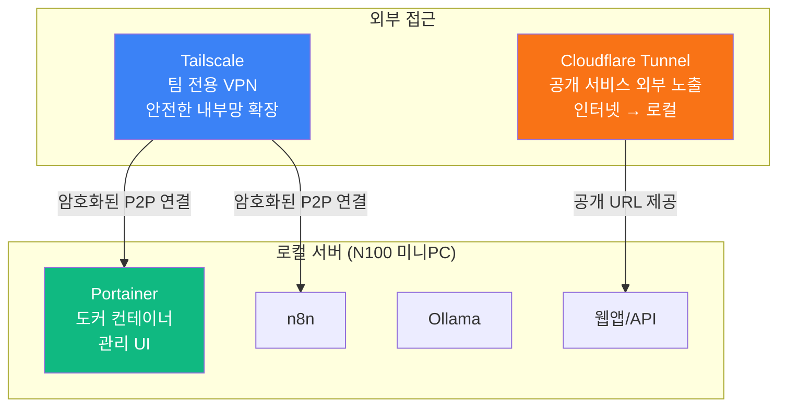

```toc
minLevel: 1
maxLevel: 1
```
# 제16장. 네트워크·접근 — Cloudflare Tunnel / Tailscale / Portainer

> *"좋은 자동화 서버는 어디서나 안전하게 접근할 수 있어야 한다."*

---

### 0) 연결 고리 (Bridge)

10장에서 N100 미니PC에 n8n을 설치해 로컬 자동화 서버를 구축했습니다. 그런데 로컬 서버에는 큰 문제가 있습니다. 집이나 사무실 내부 네트워크에서만 접근 가능하다는 것입니다. 외부에서 접근하려면 포트 포워딩 설정, 고정 IP, 보안 설정 등 복잡한 네트워크 지식이 필요합니다. 16장에서는 이 문제를 깔끔하게 해결하는 세 가지 도구 — **Cloudflare Tunnel**, **Tailscale**, **Portainer** — 를 다룹니다.

---

### 1) 세 도구의 역할 분담



| 도구 | 역할 | 접근 대상 |
|------|------|----------|
| **Cloudflare Tunnel** | 로컬 서비스를 공개 인터넷에 안전하게 노출 | 외부 사용자, Webhook 수신 |
| **Tailscale** | 팀원들만 접근하는 사설 VPN 구성 | 팀 내부용 서비스 |
| **Portainer** | Docker 컨테이너를 웹 UI로 관리 | 서버 운영자 |

---

### 2) Cloudflare Tunnel

#### 개념 및 필요성

**Cloudflare Tunnel**은 로컬 서버를 공개 인터넷에 노출할 때 포트 포워딩이나 고정 IP 없이, Cloudflare의 글로벌 네트워크를 통해 안전하게 연결하는 서비스입니다.

```
기존 방식 (포트 포워딩):
  공유기 설정 → 포트 80/443 개방 → 외부 IP 확인
  → IP가 바뀌면 재설정 → 방화벽 직접 관리
  → 보안 위협에 직접 노출

Cloudflare Tunnel:
  cloudflared 데몬 설치 → Cloudflare에 연결
  → 자동으로 안전한 터널 생성
  → 공유기 설정 불필요, 포트 개방 불필요
  → Cloudflare가 DDoS, 봇 차단 자동 처리
```

#### 설치 및 설정

```bash
# cloudflared 설치 (Ubuntu/Debian)
curl -L https://pkg.cloudflare.com/cloudflare-main.gpg | \
  sudo gpg --dearmor -o /usr/share/keyrings/cloudflare-archive-keyring.gpg

echo 'deb [signed-by=/usr/share/keyrings/cloudflare-archive-keyring.gpg] \
  https://pkg.cloudflare.com/cloudflared focal main' | \
  sudo tee /etc/apt/sources.list.d/cloudflared.list

sudo apt update && sudo apt install cloudflared

# Cloudflare 계정 인증
cloudflared tunnel login

# 터널 생성
cloudflared tunnel create my-n8n-tunnel

# 설정 파일 생성
cat > ~/.cloudflared/config.yml << 'EOF'
tunnel: [터널-UUID]
credentials-file: /root/.cloudflared/[터널-UUID].json

ingress:
  - hostname: n8n.mydomain.com
    service: http://localhost:5678
  - hostname: app.mydomain.com
    service: http://localhost:3000
  - service: http_status:404
EOF

# DNS 레코드 자동 생성
cloudflared tunnel route dns my-n8n-tunnel n8n.mydomain.com

# 터널 실행
cloudflared tunnel run my-n8n-tunnel

# 시스템 서비스 등록 (재부팅 후 자동 시작)
sudo cloudflared service install
```

#### 실전 활용 시나리오

```
[n8n Webhook 수신 공개 URL]

로컬 n8n (localhost:5678)
  ↑ Cloudflare Tunnel
https://n8n.mydomain.com (공개 URL)
  ↑ 외부 서비스 Webhook 전송
GitHub Actions, Slack, 공공데이터 API

→ 외부 서비스가 n8n에 Webhook을 보낼 수 있음
→ 포트 포워딩 없이 안전하게 수신

[추가 보안 설정 — Cloudflare Access]
Cloudflare Zero Trust → Access →
특정 이메일만 n8n.mydomain.com 접근 허용
→ 로그인 없이는 403 차단
```

---

### 3) Tailscale

#### 개념 및 특징

**Tailscale**은 WireGuard 기반의 메시 VPN(Mesh VPN) 서비스입니다. 설치한 모든 기기가 **하나의 사설 네트워크**에 연결된 것처럼 동작합니다. 포트 포워딩이나 VPN 서버 설정 없이 5분 안에 구성됩니다.

**웹:** tailscale.com  
**무료 플랜:** 기기 3대, 사용자 1명 (개인용)  
**팀 플랜:** 기기 무제한  
**지원 플랫폼:** Windows, macOS, Linux, iOS, Android

#### 설치 및 설정

```bash
# Ubuntu/Debian 설치
curl -fsSL https://tailscale.com/install.sh | sh

# Tailscale 시작 및 인증
sudo tailscale up

# 브라우저에서 인증 완료 후 기기 등록 확인
tailscale status
# → 100.x.x.x 형식의 Tailscale IP 할당됨
```

#### Tailscale 활용 패턴

```
[시나리오 1 — 팀 내부 서비스 접근]

설정:
  서버 (N100 미니PC) → Tailscale 설치 → IP: 100.64.0.1
  내 노트북 → Tailscale 설치
  팀원 노트북 → Tailscale 설치

결과:
  어디서든 100.64.0.1:5678 으로 n8n 접근
  → 외부 인터넷에는 노출되지 않음
  → VPN 서버 없이 암호화된 P2P 연결

[시나리오 2 — 로컬 개발 서버 팀 공유]
  내 PC에서 개발 중인 앱 (localhost:3000)
  → Tailscale Funnel로 팀원에게 임시 공개
  tailscale funnel 3000
  → https://내기기이름.tail1234.ts.net 공유
```

#### Cloudflare Tunnel vs Tailscale

| 항목 | Cloudflare Tunnel | Tailscale |
|------|------------------|-----------|
| **접근 대상** | 불특정 외부 사용자 | 등록된 팀원만 |
| **인증 방식** | Cloudflare Access (옵션) | 기기 등록 필수 |
| **속도** | Cloudflare CDN 경유 | P2P 직접 연결 (빠름) |
| **파일 전송** | HTTP 기반 | TCP/UDP 모두 |
| **무료 플랜** | 충분 | 기기 3대 제한 |
| **추천 용도** | Webhook, 외부 공개 서비스 | 팀 내부 도구, DB 직접 접근 |

---

### 4) Portainer — Docker 컨테이너 관리

#### 개념 및 특징

**Portainer**는 Docker 컨테이너를 웹 브라우저에서 관리하는 UI 도구입니다. 터미널로만 관리하던 Docker 컨테이너를 시각적으로 모니터링하고 제어할 수 있습니다.

```
Portainer가 해결하는 문제:

터미널로만 관리할 때:
  docker ps, docker logs, docker restart...
  → 원격 서버에 SSH로 접속해야 함
  → 컨테이너 상태를 한눈에 보기 어려움

Portainer 사용 후:
  브라우저에서 시각적으로 컨테이너 상태 확인
  → 클릭 한 번으로 재시작, 로그 확인
  → Tailscale로 외부에서 안전하게 접근
```

#### 설치

```bash
# Portainer 설치 (Docker)
docker volume create portainer_data

docker run -d \
  --name portainer \
  --restart always \
  -p 9000:9000 \
  -v /var/run/docker.sock:/var/run/docker.sock \
  -v portainer_data:/data \
  portainer/portainer-ce:latest

# http://localhost:9000 에서 접속
# 최초 접속 시 관리자 계정 생성
```

#### Portainer에서 관리하는 것들

```
[Portainer 대시보드에서 한눈에 확인]

컨테이너 목록:
  ✅ n8n          (실행 중) [재시작] [로그] [중지]
  ✅ Ollama       (실행 중) [재시작] [로그] [중지]
  ✅ Portainer    (실행 중)
  ⚠️ Redis        (중지됨) [시작]

볼륨 관리:
  n8n_data     → n8n 워크플로우 데이터
  ollama_data  → 다운로드된 AI 모델

네트워크 관리:
  automation   → n8n, Redis 내부 통신용 네트워크
```

---

### 5) 전체 로컬 서버 아키텍처

세 도구를 통합한 N100 미니PC 기반 완전한 자동화 서버 구성입니다.

```
[하드웨어]
N100 미니PC
  CPU: Intel N100 (4코어)
  RAM: 16GB
  SSD: 512GB
  전력: ~10W (24시간 운영 시 월 전기세 ~3,000원)

[소프트웨어 스택 — Docker Compose]

version: '3.8'
services:
  n8n:
    image: n8nio/n8n
    ports: ["5678:5678"]
    volumes: [n8n_data:/home/node/.n8n]
    environment:
      - N8N_BASIC_AUTH_ACTIVE=true
      - N8N_BASIC_AUTH_USER=admin
      - N8N_BASIC_AUTH_PASSWORD=${N8N_PASSWORD}

  ollama:
    image: ollama/ollama
    ports: ["11434:11434"]
    volumes: [ollama_data:/root/.ollama]

  portainer:
    image: portainer/portainer-ce
    ports: ["9000:9000"]
    volumes:
      - /var/run/docker.sock:/var/run/docker.sock
      - portainer_data:/data

volumes:
  n8n_data:
  ollama_data:
  portainer_data:

[외부 접근 레이어]
  Cloudflare Tunnel → n8n Webhook 수신 (공개)
  Tailscale        → Portainer, n8n 관리 (팀 내부)

[결과]
  외부 어디서나 Tailscale로 서버 관리
  GitHub, Slack에서 Cloudflare Tunnel로 n8n Webhook 전송
  Portainer로 컨테이너 상태 모니터링
```

---

### 6) 보안 설정 체크리스트

```
로컬 자동화 서버 운영 전 보안 확인 사항:

□ Cloudflare Tunnel 사용 (포트 포워딩 X)
□ n8n 기본 인증 활성화 (N8N_BASIC_AUTH_ACTIVE=true)
□ Portainer에 강력한 관리자 비밀번호 설정
□ Tailscale로만 Portainer 접근 (Cloudflare로 공개 X)
□ .env 파일로 모든 비밀번호·키 관리
□ Docker 볼륨으로 데이터 영구 저장 확인
□ 정기 백업 스크립트 설정 (n8n 워크플로우 내보내기)
□ Cloudflare Access로 Tunnel 엔드포인트 인증 추가
```

---

### 7) 안티 패턴 (Anti-Pattern)

**① 공유기 포트 포워딩으로 서비스 노출**
포트 80/443을 공개하면 자동화 봇의 스캔 대상이 됩니다. Cloudflare Tunnel을 사용하면 실제 서버 IP가 숨겨지고 Cloudflare가 보안 레이어 역할을 합니다.

**② Portainer를 인터넷에 직접 공개**
Portainer는 서버 전체를 제어할 수 있는 강력한 도구입니다. 절대로 Cloudflare Tunnel로 공개하지 말고, Tailscale을 통해서만 접근하세요.

**③ 단일 비밀번호로 모든 서비스 관리**
n8n, Portainer, Supabase 등 각 서비스마다 다른 강력한 비밀번호를 사용하세요. 패스워드 관리자(Bitwarden 등)를 활용하면 편리합니다.

---

### 8) 트러블슈팅 & 주의사항

**Q. Cloudflare Tunnel 연결이 자주 끊깁니다.**
→ `sudo systemctl status cloudflared`로 서비스 상태를 확인하세요. 시스템 서비스(`cloudflared service install`)로 등록하면 재부팅 후에도 자동 시작되고 연결이 안정적으로 유지됩니다.

**Q. Tailscale 연결은 됐는데 서비스에 접근이 안 됩니다.**
→ 서버의 방화벽(ufw)이 Tailscale IP 대역(100.x.x.x)의 접근을 허용하는지 확인하세요.
```bash
sudo ufw allow in on tailscale0
sudo ufw reload
```

**Q. Portainer에서 컨테이너 로그를 볼 수 없습니다.**
→ `/var/run/docker.sock` 볼륨이 올바르게 마운트됐는지 확인하세요. Portainer 컨테이너 실행 시 이 옵션이 누락되면 Docker 소켓에 접근할 수 없습니다.

> **TIP:** N100 미니PC가 없어도 시작할 수 있습니다. 기존 PC나 노트북에 Ubuntu를 설치하거나, Raspberry Pi 5를 활용해도 됩니다. 중요한 것은 24시간 켜두는 것이 가능한 저전력 기기입니다.

---

### 9) 한 줄 요약

> 💡 **Key Takeaway:** Cloudflare Tunnel로 외부 Webhook을 안전하게 수신하고, Tailscale로 팀 내부 서비스에 어디서나 접근하며, Portainer로 컨테이너를 시각적으로 관리하면 — 로컬 자동화 서버가 **클라우드 수준의 접근성과 보안**을 갖추게 됩니다.

---

*다음 장: 17장. SKILL.md 실전 — 재사용 가능한 AI 지시서 만들기*