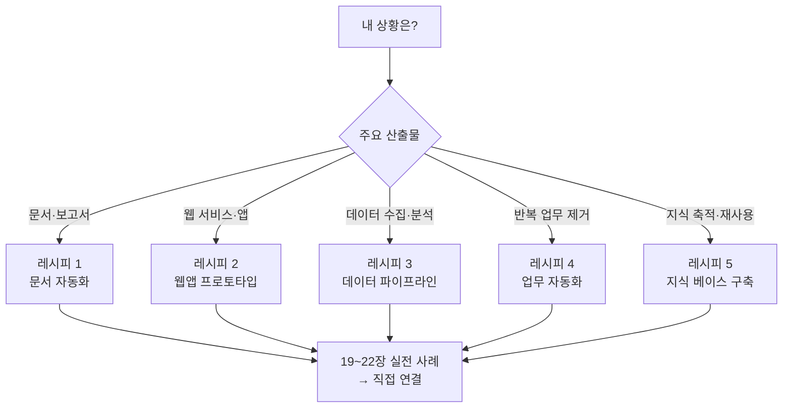
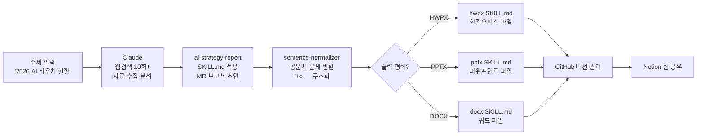
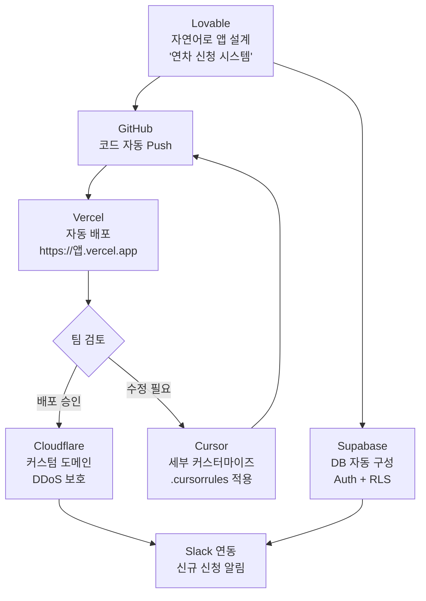
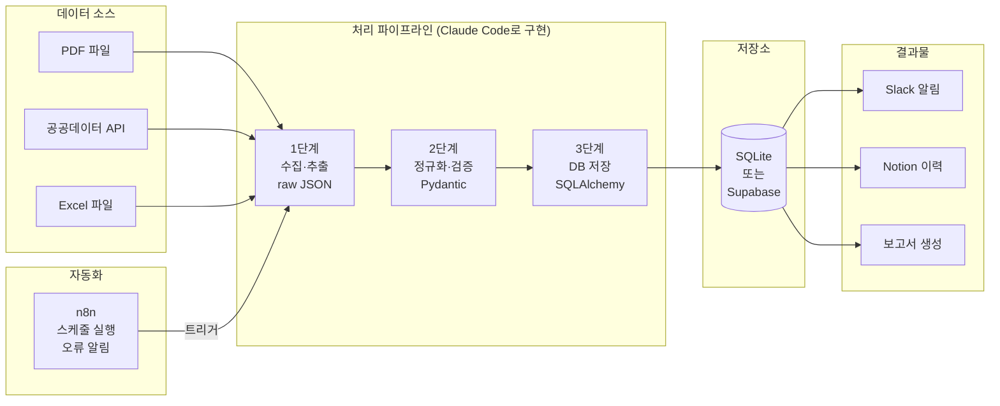
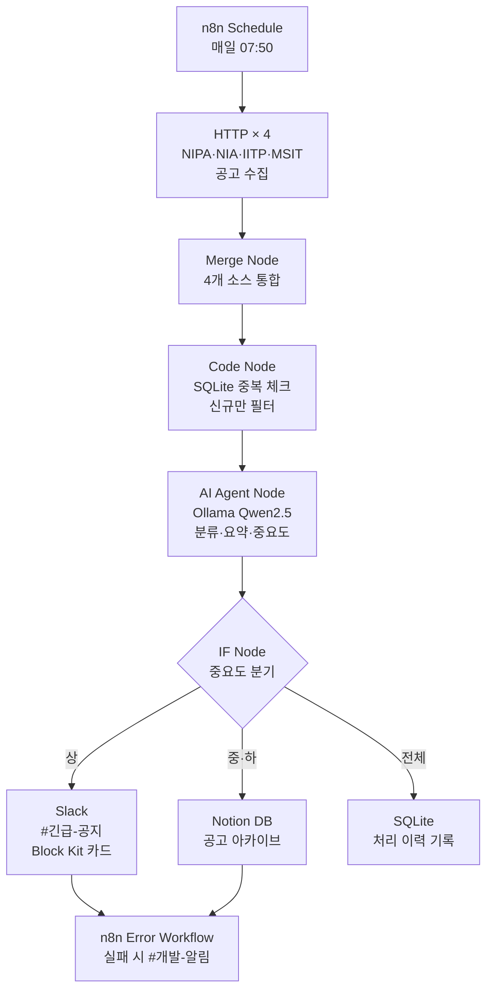
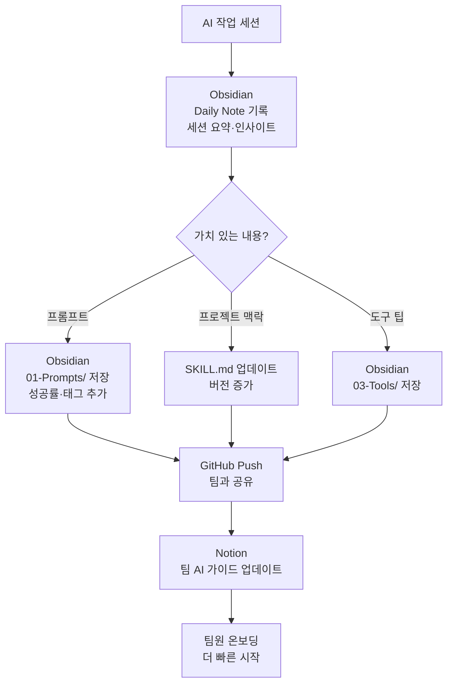
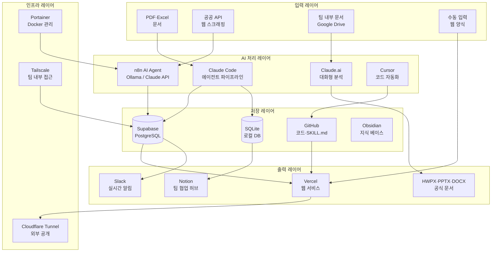

```toc
minLevel: 1
maxLevel: 1
```
# 제18장. 도구 조합 패턴 — 상황별 레시피 5가지

> *"도구 하나의 힘은 제한적이다. 도구들이 연결될 때 시스템이 된다."*

---

### 0) 연결 고리 (Bridge)

1~4부에서 바이브코딩과 에이전트 코딩의 원리부터 시작해, 대화형 AI 도구(Claude·ChatGPT·Gemini), 터미널 에이전트(Claude Code·Codex CLI), AI 에디터(Cursor·Windsurf), 앱 빌더(Lovable·Bolt·v0), 자동화 플랫폼(n8n·Make·Zapier·Antigravity), 그리고 연계 도구(GitHub·Obsidian·Notion·Slack·Vercel·Supabase·Cloudflare·Tailscale·Portainer·SKILL.md)까지 총 20개 이상의 도구를 익혔습니다.

이제 질문은 하나입니다. **"내 상황에서 어떤 도구를 어떻게 조합해야 하는가?"**

18장은 그 질문에 대한 답입니다. 5개의 대표 시나리오별로 도구 조합을 구체적인 파이프라인 수준에서 설계합니다. 각 레시피는 5부의 실전 사례(19~25장)로 직접 이어집니다.

---

### 1) 레시피 선택 가이드



---

## 레시피 1 — 문서 자동화

**핵심 질문:** "매번 같은 형식의 보고서를 손으로 만들고 있는가?"

### 어떤 상황에 적합한가?

- 월간·분기별 정기 보고서가 반복되는 조직
- 정부 공문서, 정책 보고서, 제안서를 자주 작성하는 업무
- 데이터는 있는데 문서로 만드는 데 시간이 많이 걸리는 경우
- PPTX, HWPX, DOCX 중 정해진 양식이 있는 경우

### 도구 구성

```
[수집 레이어]
Claude.ai / Gemini
  → 웹 검색 + 내부 자료 분석

[생성 레이어]
Claude + ai-strategy-report SKILL.md
  → 구조화된 MD 콘텐츠 생성

[변환 레이어]
sentence-normalizer SKILL.md
  → 공문서 문체·구조 정규화

[출력 레이어]
hwpx SKILL.md / pptx SKILL.md / docx SKILL.md
  → 최종 파일 자동 생성

[저장·공유 레이어]
GitHub (버전 관리) + Notion (팀 공유) + Obsidian (프롬프트 아카이브)
```

### 구체적 파이프라인



### 실전 명령 시퀀스

```
Step 1 — 주제 선언 + 자료 수집:
"[ai-strategy-report SKILL.md 첨부]
 2026년 국내 AI 반도체(NPU) 산업 현황 보고서를 작성해줘.
 Phase 1: 조사 단계
 - 국내외 주요 기업 동향 (삼성, SK하이닉스, 리벨리온, 퓨리오사AI)
 - 정부 정책 (반도체 특별법, AI 투자 계획)
 - 시장 규모 및 전망 데이터
 각 섹션별 Tier 1~3 출처 포함해서 정리해줘."

Step 2 — 구조 확인 후 Phase 2:
[Phase 1 결과 검토]
"구조 좋아. Phase 2: 보고서 작성.
 대상: 비전문가 정책 담당자
 분량: A4 5페이지 수준
 형식: □ ○ ― 계층 구조"

Step 3 — 문체 변환:
"[sentence-normalizer SKILL.md 첨부]
 위 보고서를 공문서 스타일로 변환해줘.
 - 명사형 종결
 - □ ○ ― 기호 구조 적용
 - 문장당 40자 이내"

Step 4 — 파일 생성:
"[hwpx SKILL.md 첨부]
 [보고서 템플릿 파일 첨부]
 변환된 내용으로 HWPX 파일을 생성해줘."
```

### 비용·시간 효과

```
수동 작업 시:
  자료 수집: 4시간
  초안 작성: 3시간
  문체 교정: 1시간
  파일 제작: 1시간
  합계: 약 9시간

자동화 후:
  Step 1~2: 10분 (AI 처리)
  검토 및 수정: 30분
  Step 3~4: 5분
  합계: 약 45분 (약 12배 단축)
```

---

## 레시피 2 — 웹앱 프로토타입

**핵심 질문:** "아이디어를 실제로 동작하는 앱으로 빠르게 검증해야 하는가?"

### 어떤 상황에 적합한가?

- 새로운 내부 업무 도구가 필요하지만 개발 예산·인력이 없는 경우
- 사용자 반응을 보고 싶은 MVP(최소 기능 제품)
- 정기적으로 데이터를 입력하고 조회하는 간단한 관리 시스템
- 외부 개발사에 발주하기 전 프로토타입으로 방향을 확인하는 경우

### 도구 구성

```
[생성 레이어]
Lovable (풀스택 앱 초안)
또는 v0 (UI 컴포넌트) + Cursor (로직 구현)

[백엔드 레이어]
Supabase (DB + Auth + Storage + Realtime)

[코드 개선 레이어]
Cursor or Claude Code (세부 커스터마이즈)

[배포 레이어]
GitHub (코드 저장) → Vercel (자동 배포)

[접근 레이어]
Cloudflare (커스텀 도메인 + 보안)
또는 Tailscale (내부망 전용)

[알림 레이어]
Slack (신규 데이터 입력 알림)
```

### 구체적 파이프라인



### 실전 명령 시퀀스

```
Step 1 — Lovable에서 앱 초안 생성:
"다음 기능을 가진 웹 앱을 만들어줘:

 [기능 명세]
 1. 직원 연차 신청
    - 신청서: 시작일, 종료일, 사유 (선택), 대리자
    - 신청 후 이메일 알림 (신청자 + 관리자)
 2. 관리자 승인 화면
    - 팀별 신청 목록
    - 승인/거절 + 코멘트
    - 부서별 연차 현황 차트
 3. 직원 대시보드
    - 잔여 연차 현황
    - 신청 이력

 [기술 요건]
 - 이메일/비밀번호 로그인
 - 직원/관리자 권한 분리
 - 모바일 반응형
 - Supabase 백엔드 자동 연결"

Step 2 — GitHub 연동 + Vercel 배포:
"코드를 GitHub에 푸시해줘."
→ Vercel에서 레포 Import → 자동 배포

Step 3 — 팀 검토 후 Cursor로 개선:
git clone → Cursor로 열기
> "승인 시 Slack Webhook으로 알림 보내는 기능 추가해줘."
> "대시보드 차트를 부서별 월간 추이로 변경해줘."

Step 4 — 운영 배포:
git push → Vercel 자동 재배포
Cloudflare에서 leave.mycompany.com 연결
```

### 체크포인트

```
Lovable 단계 검토 포인트:
  □ DB 스키마가 요구사항에 맞는가?
  □ RLS 정책이 올바른가? (직원은 자신 데이터만)
  □ 인증 흐름이 정상 동작하는가?
  □ 모바일에서 UI가 깨지지 않는가?

Cursor 단계 검토 포인트:
  □ Slack 알림이 올바른 채널로 가는가?
  □ 이메일 템플릿이 자연스러운가?
  □ 엣지 케이스 (같은 날 중복 신청 등) 처리되는가?

배포 전 최종 체크:
  □ 환경 변수 모두 Vercel에 설정됐는가?
  □ Supabase service_role 키가 노출되지 않는가?
  □ 실제 팀원 계정으로 테스트 완료됐는가?
```

---

## 레시피 3 — 데이터 파이프라인

**핵심 질문:** "분산된 데이터를 자동으로 수집·정제·저장해야 하는가?"

### 어떤 상황에 적합한가?

- PDF, Excel, API, 웹 스크래핑 등 여러 소스의 데이터를 통합해야 하는 경우
- 수동으로 하던 데이터 수집·변환 작업을 자동화하려는 경우
- 분석·보고서 작성을 위한 데이터 기반(DB)을 구축해야 하는 경우
- 정기적으로 새 데이터가 유입되고 이력을 누적해야 하는 경우

### 도구 구성

```
[수집 레이어]
Python (requests/httpx/pdfplumber/openpyxl)
+ Claude Code로 파서 자동 생성

[정제·변환 레이어]
Python (pandas/Pydantic)
+ Claude Code로 변환 로직 구현

[저장 레이어]
SQLite (로컬·소규모) 또는 Supabase (팀 공유·대규모)

[자동화 레이어]
n8n (스케줄 실행·오류 알림)
또는 GitHub Actions (코드 변경 시 트리거)

[모니터링 레이어]
Slack (오류 알림·완료 보고)
Notion (실행 이력 누적)
Portainer (컨테이너 상태 확인)
```

### 구체적 파이프라인



### 실전 명령 시퀀스

```
Step 1 — 프로젝트 구조 설계:
[Claude Code 실행]
"[SKILL.md 첨부]
 다음 파이프라인의 프로젝트 구조를 설계해줘.
 실제 파일은 만들지 말고 구조와 각 모듈의 역할만.

 입력:
   - 과기부 PDF 예산문서 (다운로드 경로: /data/pdfs/)
   - NIPA 공고 API (REST)
   - 담당자 제공 Excel 파일 (수동 업로드)

 출력:
   - SQLite DB (budget.db)
   - 처리 완료 → Slack 알림
   - 오류 발생 → Slack 긴급 알림 + Notion 로그

 스택: Python 3.11, pdfplumber, pandas, pydantic, sqlalchemy"

Step 2 — 단계별 모듈 구현:
"계획대로 1단계 모듈(collectors/)을 구현해줘.
 각 수집기는 독립적으로 실행 가능해야 함.
 구현 완료 후 각 수집기의 샘플 출력 3개 보여줘."

[결과 검토 후]
"2단계 모듈(processors/)을 구현해줘.
 Pydantic 모델로 데이터 검증.
 실패한 레코드는 /output/errors/ 에 저장."

[결과 검토 후]
"3단계 모듈(storage/)을 구현해줘.
 SQLAlchemy ORM 사용.
 중복 체크: URL 또는 파일명 기준.
 트랜잭션 + 롤백 포함."

Step 3 — n8n 스케줄 연동:
[n8n 대시보드]
트리거: 매일 06:00 (PDF는 수동 업로드 감지)
실행: python /pipeline/main.py --source all
성공: Slack #데이터-알림 "오늘 처리: N건"
실패: Slack #긴급 "파이프라인 오류: [오류 내용]"
       Notion 오류 로그 페이지 업데이트

Step 4 — GitHub Actions 자동 테스트:
[.github/workflows/test.yml]
main 브랜치 푸시 시:
  pytest tests/ -v
  실패 시 Slack 알림
```

### 파이프라인 품질 기준

```
각 단계의 완료 기준:

1단계 수집:
  □ 원본 데이터 무결성 유지 (원본 파일 수정 없음)
  □ 실패한 파일은 오류 로그에 기록
  □ 수집 건수 = 예상 건수 ± 5% 이내

2단계 정규화:
  □ Pydantic 검증 통과율 95% 이상
  □ 금액 필드 전체 정수 타입
  □ 날짜 필드 전체 YYYY-MM-DD 형식

3단계 저장:
  □ 중복 데이터 없음 (unique constraint 확인)
  □ 트랜잭션 완결성 (partial insert 없음)
  □ 인덱스 성능 확인 (쿼리 100ms 이내)
```

---

## 레시피 4 — 업무 자동화

**핵심 질문:** "매일·매주 반복하는 수작업이 있는가?"

### 어떤 상황에 적합한가?

- 여러 채널(이메일·웹·API)에서 정보를 수집해서 취합하는 업무
- 수집한 정보를 분류·요약해서 팀에 공유하는 업무
- 특정 조건이 충족될 때 담당자에게 알려야 하는 업무
- 정기 보고서, 현황 집계, 출석·현황 체크 등 정형화된 반복 업무

### 도구 구성

```
[트리거 레이어]
n8n Schedule (시간 기반)
n8n Webhook (이벤트 기반)
Cloudflare Tunnel (외부 Webhook 수신)

[수집 레이어]
n8n HTTP Request (API)
n8n RSS Reader (뉴스·공고)
Gmail/Google Drive MCP (내부 문서)

[처리 레이어]
n8n AI Agent (Ollama 로컬 or Claude API)
조건 분기: n8n IF / Switch

[저장 레이어]
Notion Database (구조화 저장)
Supabase (대용량·쿼리 필요 시)
Google Sheets (팀이 익숙한 경우)

[알림 레이어]
Slack Incoming Webhook (Block Kit 메시지)
이메일 (중요 알림)
```

### 구체적 파이프라인 — ICT 공고 자동 모니터링



### 실전 n8n 워크플로우 설계

```
[워크플로우 1 — 공고 수집 (매일 07:50)]

노드 1: Schedule Trigger
  - 매일 07:50

노드 2~5: HTTP Request × 4 (병렬)
  - NIPA: GET https://api.nipa.kr/notices?category=ai
  - NIA:  GET https://www.nia.or.kr/api/notices
  - IITP: GET https://www.iitp.kr/kr/1/notice/list.it
  - MSIT: RSS https://www.msit.go.kr/bbs/rss.do?bbsSeqNo=74

노드 6: Merge (모든 입력 대기)
  - Merge by Position

노드 7: Code (중복 제거)
  const db = new Database('/data/notices.db');
  const existing = db.prepare('SELECT url FROM processed').all();
  const existingUrls = new Set(existing.map(r => r.url));
  return items.filter(item => !existingUrls.has(item.json.url));

노드 8: AI Agent
  Model: Ollama (qwen2.5:14b)
  System Prompt:
    "ICT 정책 전문가로서 각 공고를 분석해 JSON 반환:
     {title, org, summary(2줄), importance(상/중/하),
      deadline, reason, tags[]}"
  → JSON 파싱 후 다음 노드로

노드 9: IF (중요도 = 상)
  true → Slack 긴급 전송
  false → Notion 저장

노드 10a: Slack
  Channel: #공고-알림
  Block Kit:
    Header: "📢 {{$json.title}}"
    Fields: 기관 / 마감일 / 중요도
    Text: {{$json.summary}}
    Button: "원문 보기" → {{$json.url}}

노드 10b: Notion
  DB: "공고 아카이브"
  Properties:
    공고명(title): {{$json.title}}
    기관(text): {{$json.org}}
    요약(text): {{$json.summary}}
    중요도(select): {{$json.importance}}
    마감일(date): {{$json.deadline}}
    태그(multi-select): {{$json.tags}}
    원문(url): {{$json.url}}
    처리일(date): TODAY

노드 11: SQLite (이력 기록)
  INSERT INTO processed (url, processed_at) VALUES (?, NOW())

노드 12: Error Trigger (별도 워크플로우)
  위 워크플로우 실패 시 자동 실행
  → Slack #개발-알림 에 오류 내용 + 실패 노드명 전송
```

```
[워크플로우 2 — 주간 요약 (매주 금요일 17:00)]

노드 1: Schedule Trigger (금요일 17:00)

노드 2: Notion (이번 주 공고 조회)
  DB: 공고 아카이브
  Filter: 처리일 = 이번 주

노드 3: Claude API (주간 트렌드 분석)
  "이번 주 수집된 {{$json.count}}건의 ICT 공고를 분석해서
   주간 트렌드 요약 보고서를 작성해줘.
   - 주요 키워드 TOP 5
   - 분야별 공고 분포
   - 이번 주 주목할 공고 3건
   - 다음 주 예상 동향"

노드 4: Notion (주간 리포트 페이지 생성)
  Parent: 주간 리포트 섹션
  Title: 2026년 18주차 ICT 공고 트렌드

노드 5: Slack (#팀-전체)
  "📊 이번 주 ICT 공고 트렌드 리포트가 작성됐습니다.
   총 N건 수집 | 중요도 '상' M건
   [Notion에서 보기] {{$json.notionUrl}}"
```

---

## 레시피 5 — 지식 베이스 구축

**핵심 질문:** "AI와 작업할수록 노하우가 쌓이고 있는가, 아니면 휘발되고 있는가?"

### 어떤 상황에 적합한가?

- AI와 함께 여러 프로젝트를 진행하면서 경험이 쌓이는 경우
- 팀 내 AI 활용 수준을 높이고 싶은 경우
- 같은 실수를 반복하거나 이전 프로젝트의 교훈을 잊는 경우
- AI 도구를 체계적으로 학습하고 문서화하고 싶은 경우

### 도구 구성

```
[캡처 레이어]
Obsidian Daily Notes (일별 작업 로그)
Claude.ai Projects (프로젝트별 대화)
Obsidian Prompts/ (검증된 프롬프트)

[구조화 레이어]
SKILL.md 체계 (프로젝트별 AI 지시서)
Obsidian 양방향 링크 (개념 간 연결)
태그 시스템 (검색 최적화)

[공유 레이어]
GitHub (SKILL.md 버전 관리)
Notion (팀 위키·온보딩 자료)
Obsidian Sync / GitHub (팀 볼트 공유)

[자동화 레이어]
n8n (작업 로그 자동 생성)
Claude API (Obsidian 노트 자동 요약)
```

### 구체적 파이프라인



### 실전 운영 루틴

```
[매일 — 5분]

작업 시작 시:
  Obsidian Daily Note 열기 (Ctrl+Shift+D)
  어제 "다음 세션 시작점" 확인
  관련 SKILL.md 열어두기

작업 중:
  잘 작동한 프롬프트 → 바로 Obsidian에 메모
  발견한 패턴이나 주의사항 → Tools/ 메모

작업 종료 시 (5분):
  "다음 세션 시작점" 작성
  (다음에 AI에게 붙여넣을 한 문단)

[매주 금요일 — 30분]

  이번 주 Daily Notes 검토
  → 가치 있는 프롬프트 → 01-Prompts/ 정식 저장
  → SKILL.md 업데이트 사항 반영
  → GitHub Push
  → Notion 팀 위키 업데이트

[매월 첫째 주 월요일 — 1시간]

  이달 SKILL.md 경량화 (해결된 이슈 제거)
  이달 최고 프롬프트 선정 → 팀에 공유
  다음 달 주요 프로젝트의 SKILL.md 초안 작성
```

### 지식 베이스 성숙 지표

```
3개월 후 지식 베이스 성숙도 체크:

□ Obsidian 프롬프트 아카이브: 50개 이상
□ 프로젝트별 SKILL.md: 모든 진행 프로젝트 보유
□ GitHub 커밋 이력: SKILL.md 버전 변경 추적 가능
□ Notion 팀 온보딩: 새 팀원이 하루 안에 AI 작업 시작 가능
□ 재사용률: 새 프로젝트의 40% 이상이 기존 프롬프트 활용

이 5가지가 갖춰졌다면,
팀의 AI 협업 역량이 개인 숙련에서 조직 자산으로 전환된 것입니다.
```

---

### 2) 레시피 조합 매트릭스

실제 업무는 하나의 레시피로만 구성되지 않습니다. 아래는 실무에서 자주 나타나는 복합 조합입니다.

| 업무 유형 | 주 레시피 | 보조 레시피 | 핵심 도구 체인 |
|----------|---------|-----------|-------------|
| 정부 R&D 사업 관리 | 데이터 파이프라인 | 문서 자동화 + 업무 자동화 | n8n → Supabase → Claude → HWPX |
| 스타트업 MVP 개발 | 웹앱 프로토타입 | 지식 베이스 | Lovable → GitHub → Vercel → Supabase |
| 정책 분석 팀 | 문서 자동화 | 업무 자동화 + 지식 베이스 | Claude → SKILL.md → Notion → Slack |
| 내부 IT 부서 | 업무 자동화 | 데이터 파이프라인 | n8n → Cloudflare → Slack → Notion |
| AI 연구·교육 | 지식 베이스 | 문서 자동화 | Obsidian → GitHub → Claude → Notion |

---

### 3) 도구 전체 연결도



---

### 4) 시작 전 체크리스트

어떤 레시피를 선택하든, 시작 전 다음 5가지를 갖추면 절반은 성공입니다.

```
□ 1. SKILL.md 초안 작성
     (프로젝트 목적, 스택, 핵심 규칙 50줄이라도)

□ 2. GitHub 레포 생성 + .gitignore 설정
     (.env 포함 여부 반드시 확인)

□ 3. 첫 커밋 완료
     ("프로젝트 초기화" 커밋 — AI 작업 전 안전망)

□ 4. Obsidian Daily Note 생성
     (오늘 목표, 작업 계획)

□ 5. 완료 기준(Definition of Done) 정의
     ("어떤 상태가 되면 이 작업이 끝난 것인가?"를
      AI에게도 명확히 전달)
```

---

### 5) 레시피에서 실전 사례로

5부(19~25장)에서는 이 레시피들이 실제 현장에서 어떻게 구현됐는지 파이프라인 수준에서 구체적으로 다룹니다.

| 장 | 사례 | 연결 레시피 |
|----|------|-----------|
| 19장 | 정부 예산 PDF → DB 파이프라인 | 레시피 3 (데이터 파이프라인) |
| 20장 | PPTX/HWPX 보고서 자동 생성 | 레시피 1 (문서 자동화) |
| 21장 | HR 인사이동 자동화 | 레시피 3 + 레시피 4 |
| 22장 | n8n 로컬 자동화 서버 | 레시피 4 (업무 자동화) |
| 23장 | 개인금융 데이터 파이프라인 | 레시피 3 (데이터 파이프라인) |
| 24장 | AI 전략 보고서 자동화 | 레시피 1 + 레시피 5 |

각 사례는 "어떤 문제가 있었고, 어떤 도구를 어떤 순서로 조합했으며, 어떤 교훈이 있었는가"를 실제 코드와 설정값 수준으로 다룹니다.

---

### 6) 한 줄 요약

> 💡 **Key Takeaway:** 도구의 힘은 단독 사용보다 **조합**에서 나옵니다. 내 상황에 맞는 레시피를 선택하고, 5개의 레이어(입력→AI처리→저장→출력→인프라)를 순서대로 연결하면 — 반복 업무는 시스템이 되고, 지식은 자산이 됩니다.

---

*다음 장: 19장(6부 첫 장). 사례 1 — 정부 예산 PDF → DB 파이프라인*