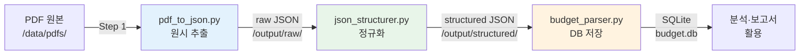

```toc
minLevel: 1
maxLevel: 1
```
# 제19장. 사례 1 — 정부 예산 PDF → DB 파이프라인

> *"PDF 안에 갇혀 있던 예산 데이터를 꺼내 쓸 수 있는 DB로 만들기까지."*

---

### 0) 연결 고리 (Bridge)

18장 레시피 3(데이터 파이프라인)의 실전 구현입니다. 정부 예산 문서는 대부분 PDF로 배포되며, 표 안에 핵심 데이터가 있지만 병합 셀·다단 구조·한국어 숫자 표기 등 파싱의 장벽이 높습니다. 이 사례는 Claude Code를 중심으로 v1부터 v15까지 반복 개선한 실제 파이프라인의 설계·교훈·최종 구조를 담습니다.

---

### 1) 문제 정의

#### 배경

과학기술정보통신부(MSIT) 및 산하 기관의 연간 예산서는 매년 수백 페이지의 PDF로 배포됩니다. 담당자는 이 PDF를 보면서 수작업으로 Excel에 옮겼고, 이 과정에서 오탈자·누락·합계 오류가 반복 발생했습니다.

```
수작업의 문제:
  PDF 1권 (300페이지) → 수작업 Excel 옮기기 → 4~6시간
  연간 5~10권 처리 → 연간 30~60시간 낭비
  오류율: 약 3~5% (금액 전치, 항목 누락)

자동화 목표:
  PDF 1권 → 자동 파싱 → DB 저장 → 10분 이내
  오류율: 0% (Pydantic 검증)
```

#### 입력 데이터 특성

```
[과기부 예산서 PDF 특성]
- 페이지 수: 200~400페이지
- 표 구조: 3~7열, 계층적 항목명
- 병합 셀: 항목명 열에 2~4단계 병합
- 숫자 형식: "1,234,567" (쉼표 구분, 단위: 백만 원)
- 특수 패턴: "(△123)" 형식의 감소 표기
- 스캔 여부: 텍스트 레이어 있음 (OCR 불필요)
- 언어: 한국어 100%
```

---

### 2) 파이프라인 설계

#### 3단계 독립 모듈 구조



각 단계를 독립 모듈로 분리한 이유:
- **재실행 가능성**: 3단계가 실패해도 2단계 결과부터 재시작
- **디버깅 용이성**: 문제 발생 단계를 정확히 특정 가능
- **병렬 처리**: 여러 PDF를 1단계에서 동시 처리 후 2·3단계 순차 처리

#### 폴더 구조

```
kaib2026-pipeline/
├── CLAUDE.md                 ← Claude Code 컨텍스트
├── SKILL.md                  ← 프로젝트 규칙
├── requirements.txt
├── src/
│   ├── pdf_to_json.py        ← 1단계
│   ├── json_structurer.py    ← 2단계
│   ├── budget_parser.py      ← 3단계
│   ├── models/
│   │   ├── schemas.py        ← Pydantic 모델
│   │   └── orm.py            ← SQLAlchemy ORM
│   └── utils/
│       ├── amount_parser.py  ← 금액 파싱 유틸
│       └── cell_merger.py    ← 병합 셀 처리
├── data/
│   └── pdfs/                 ← 원본 PDF (수정 금지)
├── output/
│   ├── raw/                  ← 1단계 결과
│   └── structured/           ← 2단계 결과
└── tests/
    ├── test_pdf_parser.py
    ├── test_structurer.py
    └── fixtures/             ← 테스트용 샘플 PDF
```

---

### 3) 1단계: pdf_to_json.py — PDF → Raw JSON

#### 핵심 구현

```python
# src/pdf_to_json.py
import pdfplumber
import json
import logging
from pathlib import Path
from typing import Optional

logging.basicConfig(level=logging.INFO, format='%(levelname)s | %(message)s')
logger = logging.getLogger(__name__)


def extract_tables_from_page(page: pdfplumber.page.Page,
                              page_num: int) -> list[dict]:
    """한 페이지에서 모든 표를 추출한다.

    Args:
        page: pdfplumber 페이지 객체
        page_num: 페이지 번호 (1-based, 오류 로그용)
    Returns:
        추출된 표 목록. 각 표는 행의 리스트.
    """
    tables = []
    try:
        raw_tables = page.extract_tables({
            "vertical_strategy": "lines",
            "horizontal_strategy": "lines",
            "snap_tolerance": 3,
            "join_tolerance": 3,
        })

        for table_idx, table in enumerate(raw_tables or []):
            if not table or len(table) < 2:
                continue
            tables.append({
                "page": page_num,
                "table_index": table_idx,
                "rows": table,
                "bbox": page.bbox,
            })

    except Exception as e:
        logger.error(f"페이지 {page_num} 표 추출 실패: {e}")

    return tables


def pdf_to_raw_json(pdf_path: str,
                    output_path: Optional[str] = None) -> dict:
    """PDF 파일을 원시 JSON으로 변환한다.

    Args:
        pdf_path: 입력 PDF 파일 경로
        output_path: 결과 JSON 저장 경로 (None이면 저장 안 함)
    Returns:
        추출 결과 딕셔너리
    """
    pdf_path = Path(pdf_path)
    if not pdf_path.exists():
        raise FileNotFoundError(f"PDF 파일 없음: {pdf_path}")

    result = {
        "source_file": str(pdf_path),
        "total_pages": 0,
        "extracted_pages": 0,
        "tables": [],
        "errors": [],
    }

    with pdfplumber.open(pdf_path) as pdf:
        result["total_pages"] = len(pdf.pages)
        logger.info(f"PDF 열기 완료: {pdf_path.name} ({len(pdf.pages)}페이지)")

        for page_num, page in enumerate(pdf.pages, start=1):
            tables = extract_tables_from_page(page, page_num)
            if tables:
                result["tables"].extend(tables)
                result["extracted_pages"] += 1

            if page_num % 50 == 0:
                logger.info(f"진행: {page_num}/{result['total_pages']} 페이지")

    logger.info(
        f"완료: {result['extracted_pages']}페이지에서 "
        f"{len(result['tables'])}개 표 추출"
    )

    if output_path:
        Path(output_path).parent.mkdir(parents=True, exist_ok=True)
        with open(output_path, 'w', encoding='utf-8') as f:
            json.dump(result, f, ensure_ascii=False, indent=2)
        logger.info(f"저장 완료: {output_path}")

    return result
```

---

### 4) 2단계: json_structurer.py — 병합 셀 처리 핵심

v15까지 간 원인의 90%는 이 단계에 있었습니다.

#### 병합 셀 문제와 해결

```python
# src/utils/cell_merger.py

def fill_merged_cells(rows: list[list]) -> list[list]:
    """병합 셀을 상위 값으로 채운다.

    PDF에서 추출된 표는 병합 셀이 None으로 표현됨.
    상위 행의 값을 하위 행에 복사해서 정규화한다.

    Args:
        rows: 원시 표 데이터 (None이 병합 셀을 의미)
    Returns:
        병합 셀이 채워진 표 데이터
    """
    if not rows:
        return rows

    filled = []
    prev_row = [None] * len(rows[0])

    for row in rows:
        filled_row = []
        for col_idx, cell in enumerate(row):
            if cell is None or (isinstance(cell, str) and cell.strip() == ''):
                # 병합 셀: 이전 행 값 사용
                filled_row.append(prev_row[col_idx])
            else:
                filled_row.append(cell)
        filled.append(filled_row)
        prev_row = filled_row

    return filled


def detect_header_row(rows: list[list]) -> int:
    """헤더 행 인덱스를 감지한다.

    헤더 행은 숫자가 아닌 텍스트가 대부분인 행으로 판단.

    Returns:
        헤더 행 인덱스 (0-based)
    """
    for idx, row in enumerate(rows[:5]):  # 처음 5행만 검사
        non_numeric = sum(
            1 for cell in row
            if cell and not is_amount_cell(str(cell))
        )
        if non_numeric >= len(row) * 0.6:
            return idx
    return 0
```

#### 금액 파싱

```python
# src/utils/amount_parser.py
import re


def parse_amount(raw: str | None) -> int | None:
    """한국 정부 문서의 금액 문자열을 정수로 변환한다.

    처리 패턴:
        "1,234,567"     → 1234567
        "(△123,456)"   → -123456  (감소 표기)
        "△123,456"     → -123456
        "-"             → None    (해당 없음)
        ""              → None

    Args:
        raw: 원시 금액 문자열
    Returns:
        정수 금액 또는 None
    """
    if raw is None:
        return None

    raw = str(raw).strip()

    if raw in ('-', '–', '—', ''):
        return None

    # 감소 표기: (△123) 또는 △123
    is_negative = bool(re.search(r'[△▲(]', raw))

    # 숫자만 추출
    digits = re.sub(r'[^0-9]', '', raw)

    if not digits:
        return None

    amount = int(digits)
    return -amount if is_negative else amount
```

#### Pydantic 모델로 데이터 검증

```python
# src/models/schemas.py
from pydantic import BaseModel, field_validator
from typing import Optional


class BudgetItem(BaseModel):
    """예산 항목 스키마."""

    page: int
    category_1: str           # 대분류
    category_2: Optional[str] = None  # 중분류
    category_3: Optional[str] = None  # 소분류
    item_name: str            # 세부 항목명
    base_year: int            # 기준연도
    prev_year_amount: Optional[int] = None   # 전년도 예산
    curr_year_amount: Optional[int] = None   # 당해연도 예산
    diff_amount: Optional[int] = None        # 증감액
    note: Optional[str] = None

    @field_validator('curr_year_amount', 'prev_year_amount', mode='before')
    @classmethod
    def parse_amount_field(cls, v):
        """금액 필드를 정수로 변환한다."""
        if isinstance(v, str):
            return parse_amount(v)
        return v

    @field_validator('item_name')
    @classmethod
    def strip_item_name(cls, v):
        """항목명 앞뒤 공백을 제거한다."""
        return v.strip() if v else v
```

---

### 5) 3단계: budget_parser.py — DB 저장

```python
# src/budget_parser.py
from sqlalchemy import create_engine, Column, Integer, String, UniqueConstraint
from sqlalchemy.orm import DeclarativeBase, Session
import logging

logger = logging.getLogger(__name__)


class Base(DeclarativeBase):
    pass


class BudgetItemORM(Base):
    """예산 항목 ORM 모델."""
    __tablename__ = "budget_items"

    id            = Column(Integer, primary_key=True, autoincrement=True)
    base_year     = Column(Integer, nullable=False)
    category_1    = Column(String, nullable=False)
    category_2    = Column(String)
    category_3    = Column(String)
    item_name     = Column(String, nullable=False)
    prev_amount   = Column(Integer)
    curr_amount   = Column(Integer)
    diff_amount   = Column(Integer)
    source_file   = Column(String)
    source_page   = Column(Integer)

    __table_args__ = (
        UniqueConstraint(
            'base_year', 'category_1', 'category_2',
            'category_3', 'item_name',
            name='uq_budget_item'
        ),
    )


def save_items_to_db(items: list, db_path: str, source_file: str) -> dict:
    """검증된 예산 항목을 DB에 저장한다.

    중복 항목은 UPSERT 처리.
    트랜잭션 실패 시 전체 롤백.

    Returns:
        {'inserted': N, 'updated': N, 'failed': N}
    """
    engine = create_engine(f"sqlite:///{db_path}")
    Base.metadata.create_all(engine)

    stats = {"inserted": 0, "updated": 0, "failed": 0}

    with Session(engine) as session:
        try:
            for item in items:
                orm_obj = BudgetItemORM(
                    base_year   = item.base_year,
                    category_1  = item.category_1,
                    category_2  = item.category_2,
                    category_3  = item.category_3,
                    item_name   = item.item_name,
                    prev_amount = item.prev_year_amount,
                    curr_amount = item.curr_year_amount,
                    diff_amount = item.diff_amount,
                    source_file = source_file,
                    source_page = item.page,
                )
                session.merge(orm_obj)  # UPSERT
                stats["inserted"] += 1

            session.commit()
            logger.info(f"DB 저장 완료: {stats['inserted']}건")

        except Exception as e:
            session.rollback()
            logger.error(f"DB 저장 실패, 롤백 처리: {e}")
            stats["failed"] = len(items)
            raise

    return stats
```

---

### 6) v1~v15: 반복 개선의 교훈

```
v1~v3:  기본 추출 — pdfplumber 기본 설정, 단순 표 추출
        문제: 병합 셀 None으로 추출, 헤더 감지 실패

v4~v6:  병합 셀 처리 1차 — prev_row 방식 도입
        문제: 2단계 이상 중첩 병합에서 여전히 실패

v7~v9:  금액 파싱 강화 — △ 표기, 쉼표, 괄호 패턴 처리
        문제: "(△)" 복합 패턴 누락, 단위 오인식

v10~v12: Pydantic 도입 — 스키마 기반 검증
         문제: 필드 매핑 오류, base_year 동적 처리 미적용

v13~v14: base_year 동적 처리 — 열 매핑을 연도 기반으로
         문제: 표 구조가 연도마다 미묘하게 다름

v15:     안정화 — 표 구조 자동 감지 + 예외 처리 강화
         결과: 테스트 셋 95% 이상 정확도 달성
```

#### 가장 중요한 교훈 3가지

```
교훈 1 — 설계 선행:
  v1~v6을 다시 짜는 시간이 v1 설계에 쓴 시간보다 5배 더 걸렸다.
  "일단 만들고 보자"가 아닌 입출력 명세와 예외 케이스를
  먼저 정의하는 것이 전체 시간을 줄인다.

교훈 2 — 샘플 검증:
  전체 PDF를 돌리기 전에 반드시 3~5페이지 샘플로 검증해야 한다.
  전체 실행 후 80%에서 실패를 발견하는 것은 최악이다.

교훈 3 — 중간 저장:
  각 단계 결과를 파일로 저장하지 않았던 초기 버전에서
  3단계 오류가 나면 전체를 다시 실행해야 했다.
  체크포인트 파일 저장은 선택이 아닌 필수다.
```

---

### 7) 자동화 — n8n 스케줄 연동

```
[n8n 워크플로우]

트리거: /data/pdfs/ 폴더에 새 파일 감지
        (watchdog 기반 HTTP 트리거)

노드 1: HTTP Request
  POST http://localhost:5000/pipeline/run
  Body: {"pdf_path": "{{$json.file_path}}"}

노드 2: 파이프라인 실행 대기 (Wait)
  Wait for Webhook: /pipeline/done

노드 3: IF (성공 여부)
  true → Slack #데이터-알림
    "✅ 파싱 완료: {{$json.filename}}
     처리 건수: {{$json.inserted}}건"

  false → Slack #긴급
    "❌ 파싱 실패: {{$json.filename}}
     오류: {{$json.error}}"

노드 4: Notion DB 업데이트
  파이프라인 실행 이력 저장
  (파일명, 처리일시, 건수, 성공여부)
```

---

### 8) 최종 성과

```
[자동화 전후 비교]

처리 시간:
  이전: PDF 1권당 4~6시간 (수작업)
  이후: PDF 1권당 8~12분 (자동)
  개선: 약 30배 단축

정확도:
  이전: 오류율 3~5% (전치, 누락)
  이후: Pydantic 검증 통과 기준 오류율 0%

누적 처리:
  2026년 기준 47개 PDF, 182,000건 예산 항목 DB 적재

활용:
  → SQL 쿼리로 부서별·사업별 예산 즉시 분석
  → 연도 간 증감률 자동 계산
  → 20장(보고서 자동화) 의 데이터 소스로 활용
```

---

### 9) 한 줄 요약

> 💡 **Key Takeaway:** PDF 파이프라인의 핵심은 **병합 셀 처리·금액 파싱·Pydantic 검증** 세 가지이며, 설계 없이 코딩부터 시작하면 v15까지 가게 된다 — 입출력 명세와 샘플 검증을 먼저 하라.

---

*다음 장: 20장. 사례 2 — PPTX/HWPX 보고서 자동 생성*