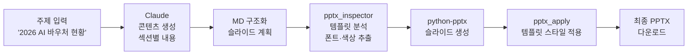

```toc
minLevel: 1
maxLevel: 1
```
# 제20장. 사례 1 — PPTX/HWPX 보고서 자동 생성

> *"같은 양식, 같은 구조, 달라지는 건 데이터뿐 — 그 반복을 끊다."*

---

### 0) 연결 고리 (Bridge)

18장 레시피 1(문서 자동화)의 실전 구현입니다. 19장의 PDF 파이프라인으로 DB에 쌓인 예산 데이터가 이 장에서 보고서로 변환됩니다. 정부 기관과 공공 조직에서 반복적으로 만드는 파워포인트 보고서와 한컴 문서(HWPX)를 AI와 Python으로 자동 생성하는 전체 흐름을 다룹니다.

---

### 1) 문제 정의

#### 배경

정부 기관과 공공 조직에서 보고서 작업은 다음과 같은 패턴을 반복합니다.

```
수작업 반복 패턴:
  1. 지난 보고서 파일 열기
  2. 텍스트 하나씩 수정
  3. 표 숫자 업데이트
  4. 차트 데이터 변경
  5. 폰트·색상·여백 재조정
  6. 검토자 지적 사항 반영
  7. 최종본 저장

소요 시간: 보고서 1건당 2~4시간
월간 보고서 12건 기준: 연간 24~48시간
```

#### 자동화 목표

```
입력:
  - 주제/섹션 구조 (Markdown 또는 직접 지시)
  - 데이터 소스 (DB, Excel, API)
  - 템플릿 파일 (기존 PPTX 또는 HWPX)

출력:
  - 양식 완전 준수 PPTX 또는 HWPX
  - 데이터 자동 반영
  - 정해진 폰트·색상·여백 유지

목표 시간: 30분 이내 (검토 포함)
```

---

### 2) 두 가지 산출물 형식

#### PPTX — 파워포인트 자동 생성

```
주요 사용 사례:
  - 발표용 슬라이드 (국회 보고, 기관 발표)
  - 사업 현황 보고서
  - 주간/월간 실적 보고

핵심 도구:
  python-pptx: 슬라이드 생성·수정
  pptx SKILL.md: 슬라이드 생성 패턴 가이드
  pptx_inspector.py: 기존 파일 구조 분석
  pptx_apply.py: 생성 결과 적용
```

#### HWPX — 한컴오피스 자동 생성

```
주요 사용 사례:
  - 정부 공문서 (대부분 한컴 형식 요구)
  - 정책 보고서, 제안서
  - 기관 내부 결재 문서

핵심 도구:
  hwpx SKILL.md: 한컴 문서 자동 생성 파이프라인
  sentence-normalizer SKILL.md: 공문서 문체 변환
  템플릿 기반 build.py: MD → HWPX 변환
```

---

### 3) PPTX 자동 생성 파이프라인

#### 전체 흐름



#### 1단계 — 기존 파일 구조 분석

```python
# pptx_inspector.py
# 기존 PPTX 파일의 스타일을 추출해서 재사용

from pptx import Presentation
from pptx.util import Pt
import json


def inspect_presentation(pptx_path: str) -> dict:
    """PPTX 파일의 구조·스타일 정보를 추출한다.

    Returns:
        슬라이드별 텍스트박스, 폰트, 색상, 위치 정보
    """
    prs = Presentation(pptx_path)
    result = {
        "slide_width": prs.slide_width,
        "slide_height": prs.slide_height,
        "slides": []
    }

    for slide_idx, slide in enumerate(prs.slides):
        slide_info = {
            "index": slide_idx,
            "layout": slide.slide_layout.name,
            "shapes": []
        }

        for shape in slide.shapes:
            shape_info = {
                "name": shape.name,
                "shape_type": str(shape.shape_type),
                "left": shape.left,
                "top": shape.top,
                "width": shape.width,
                "height": shape.height,
            }

            if shape.has_text_frame:
                paragraphs = []
                for para in shape.text_frame.paragraphs:
                    for run in para.runs:
                        font = run.font
                        paragraphs.append({
                            "text": run.text,
                            "font_name": font.name,
                            "font_size": font.size.pt if font.size else None,
                            "bold": font.bold,
                            "color": str(font.color.rgb)
                                     if font.color and font.color.type else None,
                        })
                shape_info["paragraphs"] = paragraphs

            slide_info["shapes"].append(shape_info)

        result["slides"].append(slide_info)

    return result
```

#### 2단계 — Claude에게 콘텐츠 생성 요청

```
[Claude에게 보내는 프롬프트]

"[pptx SKILL.md 첨부]
 [템플릿 분석 결과 JSON 첨부]

 다음 조건으로 보고서 슬라이드 콘텐츠를 생성해줘:

 주제: 2026년 AI 바우처 지원사업 추진 현황
 대상: 과기부 차관 보고 (비전문가, 10분 내 요약)
 슬라이드 수: 8장

 [슬라이드 구성]
 1. 표지 (사업명, 보고일, 부서명)
 2. 사업 개요 (목적, 지원 규모, 대상)
 3. 추진 경과 (타임라인 형식)
 4. 신청 현황 (숫자 중심, 전년 대비)
 5. 선정 기업 분포 (지역별, 업종별)
 6. 주요 성과 사례 3건
 7. 문제점 및 개선사항
 8. 향후 계획

 출력 형식: JSON
 {
   'slides': [
     {
       'index': 1,
       'title': '슬라이드 제목',
       'content': ['항목1', '항목2'],
       'notes': '발표자 노트'
     }
   ]
 }"
```

#### 3단계 — python-pptx로 슬라이드 생성

```python
# pptx_apply.py
from pptx import Presentation
from pptx.util import Inches, Pt, Emu
from pptx.dml.color import RGBColor
from pptx.enum.text import PP_ALIGN
import json


def apply_content_to_template(template_path: str,
                               content: dict,
                               output_path: str) -> None:
    """템플릿에 생성된 콘텐츠를 적용해서 최종 PPTX를 만든다.

    Args:
        template_path: 기준 템플릿 PPTX 경로
        content: Claude가 생성한 슬라이드 콘텐츠 JSON
        output_path: 저장할 PPTX 경로
    """
    prs = Presentation(template_path)

    # 기존 슬라이드 수와 콘텐츠 수 맞추기
    for slide_idx, slide_content in enumerate(content['slides']):

        # 슬라이드가 부족하면 레이아웃 기반 추가
        if slide_idx >= len(prs.slides):
            layout = prs.slide_layouts[1]  # 콘텐츠 레이아웃
            prs.slides.add_slide(layout)

        slide = prs.slides[slide_idx]

        # 텍스트박스 이름으로 매핑
        for shape in slide.shapes:
            if not shape.has_text_frame:
                continue

            if shape.name == "Title" and slide_content.get('title'):
                _set_text_with_style(shape, slide_content['title'])

            elif shape.name == "Content":
                content_lines = slide_content.get('content', [])
                _set_bullet_text(shape, content_lines)

    prs.save(output_path)
    print(f"PPTX 저장 완료: {output_path}")


def _set_text_with_style(shape, text: str) -> None:
    """기존 스타일을 유지하면서 텍스트만 교체한다."""
    tf = shape.text_frame
    if tf.paragraphs:
        # 첫 번째 단락의 스타일 보존
        first_para = tf.paragraphs[0]
        if first_para.runs:
            original_font = first_para.runs[0].font
            # 텍스트 교체
            tf.clear()
            para = tf.paragraphs[0]
            run = para.add_run()
            run.text = text
            # 원래 폰트 스타일 복원
            if original_font.name:
                run.font.name = original_font.name
            if original_font.size:
                run.font.size = original_font.size
            if original_font.bold is not None:
                run.font.bold = original_font.bold
```

---

### 4) HWPX 자동 생성 파이프라인

#### 전체 흐름


#### MD 콘텐츠 → 공문서 문체 변환

```
[Before — Claude가 생성한 자유 형식 MD]

## AI 바우처 사업 개요

AI 바우처 지원사업은 중소·중견기업이 AI 솔루션을 도입할 수 있도록
정부가 비용의 최대 90%를 지원하는 사업입니다. 2026년에는 총 500억 원의
예산이 배정되었으며, 500개 기업을 선정할 예정입니다.

[After — sentence-normalizer 적용]

□ AI 바우처 지원사업 개요
  ○ 사업 목적
    ― 중소·중견기업 AI 솔루션 도입 비용 지원 (최대 90%)
  ○ 2026년 사업 규모
    ― 총 지원 예산: 500억 원
    ― 선정 기업 수: 500개사
    ― 지원 단가: 기업당 최대 1억 원
```

#### HWPX build.py 핵심 구조

```python
# hwpx_builder/build.py
# hwpx SKILL.md 기반 자동화 스크립트

import zipfile
import shutil
import re
from pathlib import Path
from lxml import etree


def build_hwpx(
    md_content: str,
    template_path: str,
    output_path: str,
    config: dict
) -> None:
    """MD 콘텐츠를 HWPX 템플릿에 적용해서 최종 파일을 생성한다.

    Args:
        md_content: sentence-normalizer 적용된 MD 텍스트
        template_path: 기준 HWPX 템플릿 경로
        output_path: 저장 경로
        config: 폰트·여백 등 스타일 설정
    """
    # HWPX는 ZIP 형식 — 압축 해제 후 XML 수정
    work_dir = Path("/tmp/hwpx_work")
    if work_dir.exists():
        shutil.rmtree(work_dir)

    with zipfile.ZipFile(template_path, 'r') as zf:
        zf.extractall(work_dir)

    # 본문 XML 수정
    content_xml_path = work_dir / "Contents" / "section0.xml"
    _apply_content_to_xml(content_xml_path, md_content, config)

    # 수정된 파일로 새 HWPX 생성
    with zipfile.ZipFile(output_path, 'w', zipfile.ZIP_DEFLATED) as zf:
        for file_path in work_dir.rglob('*'):
            if file_path.is_file():
                zf.write(file_path, file_path.relative_to(work_dir))

    shutil.rmtree(work_dir)
    print(f"HWPX 생성 완료: {output_path}")


def detect_slots(template_path: str) -> list[str]:
    """템플릿에서 슬롯(□ ○ ―) 패턴을 감지한다.

    Returns:
        감지된 슬롯 기호 목록
    """
    slots = []
    with zipfile.ZipFile(template_path) as zf:
        with zf.open("Contents/section0.xml") as f:
            content = f.read().decode('utf-8')
            # □ ○ ― ※ 패턴 감지
            slots = re.findall(r'[□○―※]', content)
    return list(set(slots))
```

---

### 5) 실전 워크플로우 — 월간 AI 사업 보고서

```
[매월 첫째 주 월요일 — 완전 자동화]

Step 1 — 데이터 준비 (n8n 자동):
  19장 파이프라인에서 DB의 최신 데이터 쿼리
  SELECT * FROM budget_items WHERE base_year = 2026

Step 2 — 콘텐츠 생성 (Claude):
"[ai-strategy-report SKILL.md 첨부]
 [데이터 CSV 첨부]
 2026년 5월 기준 AI 바우처 사업 현황 보고서를 작성해줘.
 포함 내용:
 - 월간 신청·선정 현황 (전월 대비)
 - 예산 집행률
 - 지역별·업종별 분포
 - 주요 이슈 및 조치사항
 - 다음 달 계획
 Phase 2까지 완료해서 MD로 출력해줘."

Step 3 — 문체 변환 (Claude):
"[sentence-normalizer SKILL.md 첨부]
 위 보고서를 공문서 스타일로 변환해줘."

Step 4A — PPTX 생성 (발표용):
"[pptx SKILL.md 첨부]
 [지난달 보고서 PPTX 템플릿 첨부]
 위 내용으로 발표용 슬라이드 8장을 만들어줘."

Step 4B — HWPX 생성 (결재용):
"[hwpx SKILL.md 첨부]
 [HWPX 템플릿 첨부]
 위 내용으로 결재용 한컴 보고서를 만들어줘."

Step 5 — 배포:
  Notion에 파일 업로드 + 팀 Slack 공유
  GitHub에 버전 관리 커밋
```

---

### 6) XML 색상·폰트 직접 제어

PPTX 파일의 특정 색상을 변경하거나 XML 수준 제어가 필요할 때는 python-pptx의 XML 직접 접근을 활용합니다.

```python
from pptx.oxml.ns import qn
from lxml import etree


def set_shape_fill_color(shape, r: int, g: int, b: int) -> None:
    """도형의 배경색을 RGB로 직접 설정한다. (XML 수준)"""
    sp_pr = shape._element.spPr

    # 기존 fill 요소 제거
    for fill in sp_pr.findall(qn('a:solidFill')):
        sp_pr.remove(fill)

    # 새 solidFill 추가
    solid_fill = etree.SubElement(sp_pr, qn('a:solidFill'))
    srgb_clr = etree.SubElement(solid_fill, qn('a:srgbClr'))
    srgb_clr.set('val', f'{r:02X}{g:02X}{b:02X}')


def get_all_colors_in_slide(slide) -> list[str]:
    """슬라이드 내 모든 색상값을 추출한다. (디버깅용)"""
    colors = []
    for shape in slide.shapes:
        xml = etree.tostring(shape._element, pretty_print=True).decode()
        found = re.findall(r'val="([0-9A-Fa-f]{6})"', xml)
        colors.extend(found)
    return list(set(colors))
```

---

### 7) 품질 기준 — 검수 체크리스트

```
PPTX 생성 후 검수:
  □ 슬라이드 수 = 요청 수와 일치
  □ 폰트: 템플릿과 동일 (바탕체, 굴림체 등)
  □ 색상: 기관 CI 색상 코드 일치
  □ 표 데이터: DB 수치와 일치 여부 샘플 5개 확인
  □ 차트: 레이블 한국어, 축 범위 적절
  □ 발표자 노트: 각 슬라이드 핵심 키워드 포함

HWPX 생성 후 검수:
  □ 기호 구조: □ ○ ― 계층 일치
  □ 종결어미: 명사형 종결 ("~임", "~함")
  □ 폰트: 템플릿 스타일 완전 준수
  □ 표 여백: 행간 설정 일치
  □ 페이지 번호: 정상 삽입
  □ 목차: 섹션과 일치
```

---

### 8) 최종 성과

```
[자동화 전후 비교]

PPTX 보고서 (8장 기준):
  이전: 3~4시간 (내용 작성 2시간 + 슬라이드 제작 1~2시간)
  이후: 35~45분 (Claude 생성 15분 + 검토·수정 20~30분)
  개선: 약 6배 단축

HWPX 보고서 (5페이지 기준):
  이전: 2~3시간 (공문서 문체 교정 포함)
  이후: 25~35분
  개선: 약 5배 단축

연간 누적 효과 (월 4건 보고서 기준):
  절감 시간: 연간 120~180시간
  오류율: 수치 오류 거의 0 (DB 직접 조회)
```

---

### 9) 한 줄 요약

> 💡 **Key Takeaway:** 보고서 자동화의 핵심은 **콘텐츠 생성(Claude) → 문체 변환(sentence-normalizer) → 파일 생성(python-pptx/hwpx)** 3단계 분리이며, 템플릿 스타일을 먼저 분석하고 XML 수준까지 제어해야 양식을 완전히 준수할 수 있습니다.

---

*다음 장: 21장. 사례 3 — HR 인사이동 자동화*