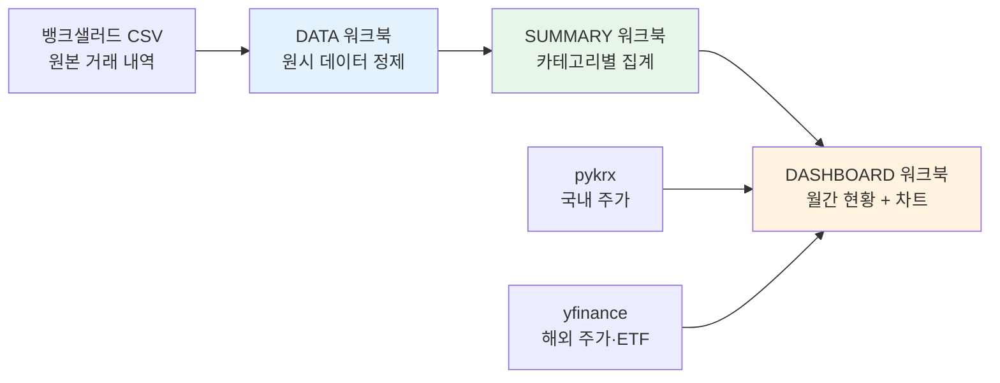

```toc
minLevel: 1
maxLevel: 1
```
# 제23장. 사례 1 — 개인금융 데이터 파이프라인 + Streamlit

> *"흩어진 금융 데이터를 한 화면으로 — 나만의 개인 재무 대시보드."*

---

### 0) 연결 고리 (Bridge)

18장 레시피 3(데이터 파이프라인)의 개인 금융 버전입니다. 뱅크샐러드(Banksalad)에서 내보낸 거래 내역 CSV를 원본 데이터로, 3단계 Excel 파이프라인 → pykrx/yfinance 주가 연동 → Streamlit 대시보드까지 이어지는 완전한 개인 재무 자동화 시스템을 다룹니다.

---

### 1) 문제 정의

#### 배경

```
개인 금융 관리의 현실:
  - 뱅크샐러드, 토스 등 앱이 분석을 제공하지만
    커스텀 뷰·투자 자산 연계는 제한적
  - 월급 통장, 주식 계좌, 적금, 카드 지출이 분산
  - "이번 달 얼마나 썼지?" → 앱 3개를 봐야 함
  - 주식 수익률과 생활비를 함께 보는 통합 뷰 없음

자동화 목표:
  입력: 뱅크샐러드 CSV 내보내기 (월 1회 수동)
  출력: 자동 분류된 지출·수입·투자 현황 대시보드
  추가: 주가 자동 연동으로 포트폴리오 현재 가치 계산
```

---

### 2) 데이터 구조 — 뱅크샐러드 CSV 형식

```python
# 뱅크샐러드 거래 내역 CSV 컬럼 구조
# (실제 내보내기 형식 기반)

BANKSALAD_COLUMNS = {
    "거래일시": "datetime",      # 2026-05-01 14:23:00
    "거래유형": "str",           # 지출/수입/이체
    "거래처": "str",             # 스타벅스, 쿠팡 등
    "카테고리": "str",           # 음식/쇼핑/교통 등
    "금액": "int",               # 원 단위 (음수: 지출)
    "잔액": "int",               # 거래 후 잔액
    "계좌": "str",               # 국민은행 입출금 등
    "메모": "str",               # 사용자 메모
}
```

---

### 3) 3단계 Excel 체인 파이프라인

전체 데이터 흐름은 3개의 Excel 워크북이 계층적으로 연결되는 구조입니다.



#### 1단계 — DATA 워크북: 원시 데이터 정제

```python
# src/pipeline/step1_data.py
import pandas as pd
import openpyxl
from pathlib import Path


# 카테고리 매핑 (뱅크샐러드 기본 → 커스텀 분류)
CATEGORY_MAP = {
    "음식/식당": "식비",
    "카페/음료": "식비",
    "편의점": "식비",
    "마트/슈퍼": "식비",
    "쇼핑": "쇼핑",
    "온라인쇼핑": "쇼핑",
    "교통": "교통",
    "주유소": "교통",
    "의료/건강": "의료",
    "문화/여가": "여가",
    "통신": "고정지출",
    "보험": "고정지출",
    "월세/관리비": "고정지출",
    "이체": "이체",
    "급여": "수입",
    "이자": "수입",
}


def process_banksalad_csv(csv_path: str, output_path: str) -> pd.DataFrame:
    """뱅크샐러드 CSV를 정제해서 DATA 워크북으로 저장한다.

    처리 내용:
    - 날짜 파싱 및 연·월 컬럼 추가
    - 카테고리 표준화
    - 이체 거래 제외 옵션
    - 음수 금액(지출) / 양수(수입) 분리

    Returns:
        정제된 DataFrame
    """
    df = pd.read_csv(csv_path, encoding='utf-8-sig')

    # 날짜 파싱
    df['거래일시'] = pd.to_datetime(df['거래일시'])
    df['연월'] = df['거래일시'].dt.to_period('M').astype(str)
    df['연도'] = df['거래일시'].dt.year
    df['월'] = df['거래일시'].dt.month
    df['일'] = df['거래일시'].dt.day
    df['요일'] = df['거래일시'].dt.day_name()

    # 카테고리 표준화
    df['분류'] = df['카테고리'].map(CATEGORY_MAP).fillna('기타')

    # 지출·수입 분리
    df['지출'] = df['금액'].apply(lambda x: abs(x) if x < 0 else 0)
    df['수입'] = df['금액'].apply(lambda x: x if x > 0 else 0)

    # 중복 거래 제거 (같은 날·같은 금액·같은 거래처)
    before = len(df)
    df = df.drop_duplicates(subset=['거래일시', '거래처', '금액'])
    after = len(df)
    if before != after:
        print(f"  중복 제거: {before - after}건")

    # Excel 저장
    with pd.ExcelWriter(output_path, engine='openpyxl') as writer:
        df.to_excel(writer, sheet_name='거래내역', index=False)
        # 원본 시트도 보존
        pd.read_csv(csv_path, encoding='utf-8-sig').to_excel(
            writer, sheet_name='원본', index=False
        )

    print(f"DATA 워크북 저장: {output_path} ({len(df)}건)")
    return df
```

#### 2단계 — SUMMARY 워크북: 카테고리별 집계

```python
# src/pipeline/step2_summary.py

def create_summary_workbook(df: pd.DataFrame, output_path: str) -> None:
    """정제된 거래 데이터를 카테고리·월별로 집계해서 SUMMARY 워크북을 생성한다."""

    wb = openpyxl.Workbook()

    # ── 시트 1: 월별 카테고리 피벗 ─────────────────────────
    ws1 = wb.active
    ws1.title = "월별_카테고리"

    pivot = df[df['지출'] > 0].pivot_table(
        values='지출',
        index='분류',
        columns='연월',
        aggfunc='sum',
        fill_value=0
    ).reset_index()

    _write_dataframe_to_sheet(ws1, pivot, header_color="1565C0")

    # ── 시트 2: 월별 수입/지출 요약 ─────────────────────────
    ws2 = wb.create_sheet("월별_요약")

    monthly = df.groupby('연월').agg(
        수입=('수입', 'sum'),
        지출=('지출', 'sum'),
    ).reset_index()
    monthly['저축'] = monthly['수입'] - monthly['지출']
    monthly['저축률'] = (monthly['저축'] / monthly['수입'] * 100).round(1)

    _write_dataframe_to_sheet(ws2, monthly, header_color="2E7D32")

    # ── 시트 3: 거래처별 TOP 20 ─────────────────────────────
    ws3 = wb.create_sheet("거래처_TOP20")

    top_merchants = (
        df[df['지출'] > 0]
        .groupby('거래처')['지출']
        .sum()
        .sort_values(ascending=False)
        .head(20)
        .reset_index()
    )
    top_merchants.columns = ['거래처', '총 지출']

    _write_dataframe_to_sheet(ws3, top_merchants, header_color="6A1B9A")

    wb.save(output_path)
    print(f"SUMMARY 워크북 저장: {output_path}")
```

#### 3단계 — DASHBOARD 워크북: 주가 연동 + 최종 집계

```python
# src/pipeline/step3_dashboard.py
import pykrx.stock as krx
import yfinance as yf
from datetime import datetime, timedelta


# 보유 주식 포트폴리오 설정
PORTFOLIO = {
    "국내": {
        "005930": {"name": "삼성전자", "shares": 50, "avg_price": 72000},
        "035720": {"name": "카카오", "shares": 100, "avg_price": 55000},
    },
    "해외": {
        "AAPL": {"name": "Apple", "shares": 10, "avg_price": 175.0},
        "QQQ": {"name": "QQQ ETF", "shares": 5, "avg_price": 420.0},
    }
}


def fetch_current_prices() -> dict:
    """pykrx와 yfinance로 현재 주가를 조회한다."""
    prices = {}
    today = datetime.now().strftime('%Y%m%d')
    yesterday = (datetime.now() - timedelta(days=3)).strftime('%Y%m%d')

    # 국내 주식 — pykrx
    for ticker, info in PORTFOLIO["국내"].items():
        try:
            df = krx.get_market_ohlcv_by_date(yesterday, today, ticker)
            if not df.empty:
                prices[ticker] = {
                    "current": int(df['종가'].iloc[-1]),
                    "name": info["name"]
                }
        except Exception as e:
            print(f"  국내 주가 조회 실패 ({ticker}): {e}")

    # 해외 주식·ETF — yfinance
    for ticker, info in PORTFOLIO["해외"].items():
        try:
            stock = yf.Ticker(ticker)
            hist = stock.history(period="2d")
            if not hist.empty:
                prices[ticker] = {
                    "current": round(float(hist['Close'].iloc[-1]), 2),
                    "name": info["name"]
                }
        except Exception as e:
            print(f"  해외 주가 조회 실패 ({ticker}): {e}")

    return prices


def calculate_portfolio_value(prices: dict) -> dict:
    """현재 주가 기준 포트폴리오 가치와 수익률을 계산한다."""
    results = []

    for section, holdings in PORTFOLIO.items():
        for ticker, info in holdings.items():
            price_data = prices.get(ticker, {})
            current_price = price_data.get('current', info['avg_price'])

            purchase_value = info['shares'] * info['avg_price']
            current_value = info['shares'] * current_price
            profit = current_value - purchase_value
            profit_rate = (profit / purchase_value * 100)

            results.append({
                "종목": info['name'],
                "티커": ticker,
                "구분": section,
                "보유 수량": info['shares'],
                "평균 단가": info['avg_price'],
                "현재가": current_price,
                "매입 금액": int(purchase_value),
                "현재 가치": int(current_value),
                "손익": int(profit),
                "수익률(%)": round(profit_rate, 2),
            })

    return results
```

---

### 4) Streamlit 대시보드

Excel 파이프라인으로 생성된 데이터를 Streamlit으로 시각화합니다.

```python
# app.py — Streamlit 대시보드
import streamlit as st
import pandas as pd
import plotly.express as px
import plotly.graph_objects as go
from pathlib import Path

st.set_page_config(
    page_title="개인 재무 대시보드",
    page_icon="💰",
    layout="wide"
)

@st.cache_data(ttl=3600)
def load_data():
    """Excel 파이프라인 결과 데이터를 로드한다."""
    summary_path = Path("output/SUMMARY.xlsx")
    if not summary_path.exists():
        return None, None, None

    monthly = pd.read_excel(summary_path, sheet_name="월별_요약")
    category = pd.read_excel(summary_path, sheet_name="월별_카테고리")
    top_merchants = pd.read_excel(summary_path, sheet_name="거래처_TOP20")
    return monthly, category, top_merchants


# ── 헤더 ────────────────────────────────────────────────────
st.title("💰 개인 재무 대시보드")
st.caption(f"마지막 업데이트: {Path('output/SUMMARY.xlsx').stat().st_mtime}")

monthly, category, top_merchants = load_data()

if monthly is None:
    st.warning("데이터가 없습니다. 파이프라인을 먼저 실행해주세요.")
    st.stop()

# ── 최근 달 KPI 카드 ─────────────────────────────────────────
latest = monthly.iloc[-1]
col1, col2, col3, col4 = st.columns(4)

with col1:
    st.metric(
        label="이번 달 수입",
        value=f"{latest['수입']:,}원",
        delta=f"{latest['수입'] - monthly.iloc[-2]['수입']:+,}원"
    )

with col2:
    st.metric(
        label="이번 달 지출",
        value=f"{latest['지출']:,}원",
        delta=f"{latest['지출'] - monthly.iloc[-2]['지출']:+,}원",
        delta_color="inverse"
    )

with col3:
    st.metric(
        label="저축액",
        value=f"{latest['저축']:,}원",
    )

with col4:
    st.metric(
        label="저축률",
        value=f"{latest['저축률']:.1f}%",
        delta=f"{latest['저축률'] - monthly.iloc[-2]['저축률']:+.1f}%p"
    )

st.divider()

# ── 수입/지출 트렌드 차트 ────────────────────────────────────
col_left, col_right = st.columns(2)

with col_left:
    st.subheader("📈 월별 수입·지출 추이")
    fig = go.Figure()
    fig.add_trace(go.Bar(
        x=monthly['연월'], y=monthly['수입'],
        name='수입', marker_color='#2196F3'
    ))
    fig.add_trace(go.Bar(
        x=monthly['연월'], y=monthly['지출'],
        name='지출', marker_color='#F44336'
    ))
    fig.add_trace(go.Scatter(
        x=monthly['연월'], y=monthly['저축률'],
        name='저축률(%)', yaxis='y2', mode='lines+markers',
        line=dict(color='#4CAF50', width=2)
    ))
    fig.update_layout(
        yaxis2=dict(overlaying='y', side='right', title='저축률(%)'),
        barmode='group', height=400
    )
    st.plotly_chart(fig, use_container_width=True)

with col_right:
    st.subheader("🍩 이번 달 카테고리별 지출")
    latest_month = monthly['연월'].iloc[-1]
    cat_data = category[['분류', latest_month]].copy()
    cat_data = cat_data[cat_data[latest_month] > 0]
    fig_pie = px.pie(
        cat_data, values=latest_month, names='분류',
        color_discrete_sequence=px.colors.qualitative.Set3
    )
    st.plotly_chart(fig_pie, use_container_width=True)

# ── 포트폴리오 섹션 ──────────────────────────────────────────
st.divider()
st.subheader("📊 투자 포트폴리오")

portfolio_path = Path("output/DASHBOARD.xlsx")
if portfolio_path.exists():
    portfolio_df = pd.read_excel(portfolio_path, sheet_name="포트폴리오")

    total_invest = portfolio_df['매입 금액'].sum()
    total_current = portfolio_df['현재 가치'].sum()
    total_profit = total_current - total_invest
    total_rate = total_profit / total_invest * 100

    c1, c2, c3 = st.columns(3)
    c1.metric("총 매입 금액", f"{total_invest:,}원")
    c2.metric("현재 평가액", f"{total_current:,}원",
              delta=f"{total_profit:+,}원")
    c3.metric("총 수익률", f"{total_rate:.2f}%")

    # 종목별 수익률 차트
    fig_bar = px.bar(
        portfolio_df.sort_values('수익률(%)', ascending=True),
        x='수익률(%)', y='종목', orientation='h',
        color='수익률(%)',
        color_continuous_scale=['#F44336', '#FFEB3B', '#4CAF50'],
        title="종목별 수익률"
    )
    st.plotly_chart(fig_bar, use_container_width=True)
```

---

### 5) 실행 자동화 — 월 1회 스크립트

```bash
#!/bin/bash
# run_finance_pipeline.sh
# 뱅크샐러드 CSV를 다운받은 후 이 스크립트를 실행

set -e

CSV_PATH=${1:-"~/Downloads/banksalad_export.csv"}
OUTPUT_DIR="./output"
DATE=$(date +%Y%m)

echo "━━━ 개인금융 파이프라인 시작 ━━━"
echo "소스: $CSV_PATH"

# 1단계: 데이터 정제
python src/pipeline/step1_data.py \
  --input "$CSV_PATH" \
  --output "$OUTPUT_DIR/DATA_$DATE.xlsx"

# 2단계: 집계
python src/pipeline/step2_summary.py \
  --input "$OUTPUT_DIR/DATA_$DATE.xlsx" \
  --output "$OUTPUT_DIR/SUMMARY.xlsx"

# 3단계: 주가 연동 + 대시보드
python src/pipeline/step3_dashboard.py \
  --summary "$OUTPUT_DIR/SUMMARY.xlsx" \
  --output "$OUTPUT_DIR/DASHBOARD.xlsx"

echo "━━━ 파이프라인 완료 ━━━"
echo "Streamlit 대시보드 실행: streamlit run app.py"

# 대시보드 자동 실행 (선택)
streamlit run app.py --server.port 8501
```

---

### 6) Claude 활용 포인트

이 파이프라인에서 Claude는 두 가지로 활용됩니다.

```
활용 1 — 파이프라인 코드 자동 생성:
  "뱅크샐러드 CSV 컬럼 구조를 보여줄게.
   카테고리 자동 분류 + 월별 집계 파이프라인을 만들어줘.
   pandas + openpyxl 사용, 주석 한국어."

활용 2 — 데이터 분석 인사이트:
  (SUMMARY.xlsx 첨부)
  "이번 달 지출 패턴을 분석해줘.
   전월 대비 특이한 변화가 있는지,
   저축률을 높이려면 어떤 카테고리를 줄이면 좋을지
   구체적인 수치 기반으로 설명해줘."
```

---

### 7) 최종 성과

```
[자동화 전후 비교]

월간 가계부 정리 시간:
  이전: 1~2시간 (Excel 수작업)
  이후: 10분 (CSV 다운로드 + 스크립트 실행)

인사이트 품질:
  이전: 감각 기반 ("이번 달 많이 쓴 것 같다")
  이후: 데이터 기반 ("식비 23% 증가, 스타벅스 8회 = 56,000원")

투자 현황 파악:
  이전: 증권 앱 3개 각각 확인
  이후: 한 화면에서 국내·해외 통합 수익률 확인

추가 기능 (Claude 활용):
  → 월말 자동 분석 리포트 생성
  → 연간 목표 저축률 달성 예측
  → 이상 지출 패턴 자동 감지
```

---

### 8) 한 줄 요약

> 💡 **Key Takeaway:** 개인금융 파이프라인은 **3단계 Excel 체인(데이터→집계→대시보드) + pykrx/yfinance 주가 연동 + Streamlit 시각화**로 구성되며, Claude는 파이프라인 코드 생성과 데이터 기반 인사이트 도출에 활용됩니다.

---

*다음 장: 24장. 사례 6 — AI 전략 보고서 자동화*