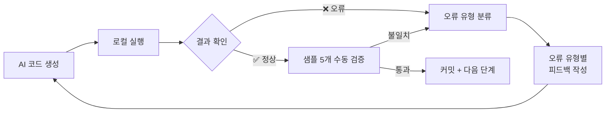

```toc
minLevel: 1
maxLevel: 1
```
# 제25장. 오류 처리와 디버깅 협업

> *"AI가 틀렸을 때가 진짜 실력이 드러나는 순간이다."*

---

### 0) 연결 고리 (Bridge)

6부의 실전 사례들을 보면 공통점이 있습니다. 모든 파이프라인이 첫 번째 시도에서 완성되지 않았다는 것입니다. 19장의 budget_parser.py는 v15까지 갔고, 21장의 HR 배정 로직은 엣지 케이스에서 반복 실패했습니다. 25장에서는 AI와 함께 오류를 처리하는 체계적인 방법론을 다룹니다. 오류를 빠르게 해결하는 것은 기술이 아니라 **피드백 루프를 잘 설계하는 것**입니다.

---

### 1) 오류의 유형 분류

AI 협업에서 발생하는 오류는 크게 4가지 유형으로 나뉩니다.

```
유형 1 — 문법·실행 오류 (Syntax/Runtime Error)
  증상: 코드가 즉시 멈추고 오류 메시지 출력
  예시: TypeError, KeyError, FileNotFoundError
  해결 난이도: 낮음 — 오류 메시지가 명확한 단서 제공

유형 2 — 논리 오류 (Logic Error)
  증상: 코드가 실행되지만 결과가 잘못됨
  예시: 병합 셀 처리 후 금액이 2배로 집계됨
  해결 난이도: 높음 — 오류 메시지 없어서 발견 어려움

유형 3 — AI 환각 오류 (Hallucination)
  증상: 존재하지 않는 함수·API·라이브러리 사용
  예시: pdfplumber.Table.get_merged_spans() — 실제 없는 메서드
  해결 난이도: 중간 — 실행 전 확인으로 예방 가능

유형 4 — 컨텍스트 소실 오류 (Context Loss)
  증상: AI가 이전 결정을 무시하고 다른 방식으로 구현
  예시: "httpx 쓰라고 했는데 requests를 또 썼어"
  해결 난이도: 낮음 — SKILL.md와 재지시로 해결
```

---

### 2) 오류 유형별 해결 전략

#### 유형 1 — 문법·실행 오류: 오류 메시지를 그대로 붙여넣기

```
[잘못된 보고 방식]
"실행이 안 돼요. 오류가 났어요."

[올바른 보고 방식]
"다음 오류가 발생했어. 수정해줘:

Traceback (most recent call last):
  File "src/json_structurer.py", line 847, in fill_merged_cells
    prev_value = prev_row[col_idx]
IndexError: list index out of range

실행 환경:
  Python 3.11
  입력 파일: /output/raw/budget_2026_p042.json
  해당 표: 42페이지 3번째 표"
```

**오류 메시지에 포함해야 할 정보:**
- 전체 Traceback (첫 줄~마지막 줄)
- 파일명과 줄 번호
- 실행 환경 (Python 버전, OS)
- 어떤 입력으로 실행했는지

#### 유형 2 — 논리 오류: 예상값과 실제값을 함께 제시

```
[논리 오류 보고 패턴]

"코드는 실행되는데 결과가 이상해.

현상:
  42페이지 표의 '과학기술혁신본부' 예산이
  실제 PDF에는 1,234,567백만 원인데
  DB에 2,469,134백만 원으로 저장됨 (정확히 2배)

예상 결과:
  curr_year_amount = 1234567

실제 결과:
  curr_year_amount = 2469134

의심되는 원인:
  fill_merged_cells()에서 병합 셀을 2번 처리하는 것 같음

관련 코드 첨부:"
```

#### 유형 3 — AI 환각 오류: 실제 존재 여부 확인 요청

```
AI가 생성한 코드에 의심스러운 메서드가 있을 때:

"이 코드에서 사용한 메서드들이 실제로 존재하는지 확인해줘.
 특히:
 - pdfplumber.Table.get_merged_spans()
 - pandas.DataFrame.auto_detect_types()
 이 두 메서드를 pdfplumber 공식 문서에서 확인해줘."

→ AI가 스스로 "get_merged_spans()는 실제로 없습니다.
   대신 page.extract_table()의 반환값을 분석해서
   병합을 감지해야 합니다"라고 수정
```

#### 유형 4 — 컨텍스트 소실: 재정향(Re-anchor)

```
[재정향 프롬프트 패턴]

"[SKILL.md 다시 첨부]
 방금 생성한 코드에서 SKILL.md 규칙 위반이 있어:
 
 위반 1: requests 사용 → httpx로 교체 (규칙 §3)
 위반 2: print() 디버깅 → logging으로 교체 (규칙 §3)
 위반 3: 타입 힌트 없음 → 모든 함수에 추가 (규칙 §2)
 
 세 가지를 수정한 버전으로 다시 작성해줘."
```

---

### 3) 반복 실패 루프 탈출법

가장 어려운 상황은 AI가 같은 방식으로 반복해서 실패하는 경우입니다.

#### 루프 감지 신호

```
다음 상황이 3회 이상 반복되면 루프에 빠진 것:

- 같은 유형의 오류가 반복됨
- AI가 수정했다고 하는데 결과가 동일함
- 점점 더 복잡한 해결책을 제시하지만 핵심 문제는 그대로
```

#### 루프 탈출 3단계

```
Step 1 — 현재 상태 요약 요청:
"지금까지 시도한 방법과 각각의 결과를 요약해줘.
 그리고 아직 시도하지 않은 다른 접근법을 3가지 제안해줘."

Step 2 — 문제 재정의:
"처음부터 다시 생각해보자.
 내가 원하는 것은 [핵심 목표] 야.
 지금 방식 말고 완전히 다른 방법으로 접근한다면?"

Step 3 — 단순화:
"현재 코드를 버리고,
 가장 단순한 방법으로 최소 동작 버전부터 만들어줘.
 병합 셀 처리는 일단 빼고, 단순 표만 처리하는 것부터."
```

#### 실전 예시 — budget_parser v15의 교훈

```
[v8~v12 구간에서 반복된 루프]

문제: 3단계 이상 중첩 병합 셀에서 IndexError

시도 1 (v8): prev_row 인덱스 범위 검사 추가 → 여전히 실패
시도 2 (v9): try-except로 감싸기 → 오류는 숨겨졌지만 데이터 누락
시도 3 (v10): 열 수 동적 계산 → 다른 표에서 새 오류
시도 4 (v11): None 체크 강화 → 증상만 다른 동일 문제

[v12에서 루프 탈출]

"지금까지 4번 시도했는데 계속 실패해.
 근본 원인이 뭔지 먼저 분석해줘.
 코드 수정 전에 원인 분석만 먼저."

AI 분석:
"근본 원인은 fill_merged_cells()가 표 열 수를
 첫 번째 행 기준으로 고정하기 때문입니다.
 병합으로 인해 행마다 열 수가 달라지면
 prev_row와 현재 행의 인덱스가 맞지 않습니다.
 
 해결책: 행별로 열 수를 동적으로 비교하거나,
 pdfplumber의 bbox 좌표를 이용해 병합 여부를
 기하학적으로 감지하는 방식으로 전환해야 합니다."

→ bbox 기반 접근으로 전환 → v13에서 해결
```

---

### 4) 예방적 디버깅 — 오류를 만들기 전에 잡기

#### 방어적 코드 작성 요청

```
코드를 생성할 때 처음부터 방어적으로 작성하도록 요청:

"다음 조건으로 parse_table() 함수를 작성해줘:

 방어 요건:
 1. 입력이 None이거나 빈 리스트면 빈 리스트 반환
 2. 각 행의 열 수가 다를 수 있음을 고려
 3. 금액 파싱 실패 시 None 저장 (예외 전파 금지)
 4. 오류 발생 행은 로그 기록 후 건너뜀 (전체 실패 금지)
 5. 처리 결과 요약 로그 출력
    (총 N행 처리, M행 성공, K행 실패)"
```

#### 테스트 케이스 먼저 작성

```
[TDD 방식 적용]
"parse_amount() 함수의 테스트 케이스를 먼저 작성해줘.
 다음 입력들을 모두 올바르게 처리해야 해:

 정상:  '1,234,567'    → 1234567
 정상:  '1234567'      → 1234567
 감소:  '(△123,456)'  → -123456
 감소:  '△123,456'    → -123456
 공란:  '-'            → None
 공란:  ''             → None
 공란:  None           → None
 이상:  'N/A'          → None
 이상:  '○'            → None

 pytest 형식으로 작성 후,
 모든 테스트를 통과하는 함수를 구현해줘."
```

---

### 5) 디버깅 협업 도구 활용

#### 로그 레벨 체계 요청

```python
# AI에게 로깅 체계를 포함한 코드를 요청하는 방법

"다음 로깅 체계를 적용해줘:

 DEBUG: 처리 중인 각 셀 값 (개발 시만 활성화)
 INFO:  단계별 진행 상황 (페이지 N/M 처리 중)
 WARNING: 예상과 다른 패턴 (열 수 불일치, None 발생)
 ERROR: 처리 실패한 행/페이지 (건너뜀)
 CRITICAL: 전체 파이프라인 중단 필요 상황

 실행 시 --debug 플래그로 DEBUG 레벨 활성화 가능하게."
```

#### Git bisect로 문제 발생 시점 추적

```bash
# 어느 커밋에서 버그가 생겼는지 이진 탐색
git bisect start
git bisect bad                    # 현재 버전 = 버그 있음
git bisect good v1.2.0            # 이 버전 = 정상이었음

# Git이 중간 커밋으로 이동시켜 줌
python test_parse.py              # 테스트 실행
git bisect good                   # 정상이면 good
git bisect bad                    # 버그면 bad
# (반복)

git bisect reset                  # 완료 후 원래 상태로
```

---

### 6) AI 피드백 루프 설계

#### 효과적인 검수 사이클



#### 검수 품질 기준 — 샘플 5개 원칙

```
자동화 파이프라인의 결과는 반드시 원본과 대조:

검수 방법:
  1. 무작위로 5개 항목 선택
  2. 원본 PDF/Excel에서 해당 값 직접 확인
  3. DB/출력 파일의 값과 비교
  4. 불일치 시 → 해당 케이스를 테스트 픽스처로 추가

합격 기준:
  5개 모두 일치 → 해당 단계 완료
  1개라도 불일치 → 오류 분석 후 재실행
```

---

### 7) 최악의 상황 — 데이터 손상 복구

```
[예방 — 3중 안전망]

1단계: Git 커밋 (AI 작업 전 항상)
  git add . && git commit -m "작업 전 백업"

2단계: 원본 파일 불변 규칙
  /data/ 폴더는 읽기 전용 처리
  chmod 444 data/*.pdf

3단계: DB 작업 전 스냅샷
  cp budget.db budget.db.backup.$(date +%Y%m%d)

[복구 시나리오]

시나리오 A — 코드 잘못됨:
  git checkout .               # 변경 코드 전체 되돌리기

시나리오 B — DB 일부 손상:
  cp budget.db.backup.20260501 budget.db
  # 손상 이후 처리된 파일만 재실행

시나리오 C — 원본 파일 실수로 수정:
  git checkout data/budget_2026.pdf
  # 또는 별도 백업에서 복원
```

---

### 8) 한 줄 요약

> 💡 **Key Takeaway:** AI 디버깅의 핵심은 **오류 메시지 전체 붙여넣기, 예상값과 실제값 동시 제시, 3회 반복 실패 시 루프 탈출 질문**이며, Git 커밋과 원본 파일 불변 원칙이 모든 상황의 안전망입니다.

---

*다음 장: 26장. 재사용 가능한 자산 만들기*