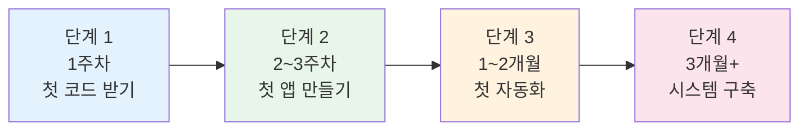

```toc
minLevel: 1
maxLevel: 1
```
# 제27장. 입문 로드맵

> *"코딩을 몰라도 된다. 어디서 시작할지만 알면 된다."*

---

### 0) 연결 고리 (Bridge)

지금까지 26개 장에 걸쳐 바이브코딩부터 에이전트 코딩, 20개 이상의 도구, 6개의 실전 사례를 다뤘습니다. 이제 "어디서 시작해야 하는가?"라는 질문으로 돌아옵니다. 27장은 코딩 경험이 전혀 없는 분들을 위한 단계별 로드맵입니다. 모든 것을 한꺼번에 배울 필요는 없습니다. 올바른 순서로 시작하면 첫 주 안에 실제로 쓸 수 있는 결과물을 만들 수 있습니다.

---

### 1) 시작 전 마음가짐

#### 버려야 할 오해 3가지

```
오해 1: "코딩을 먼저 배워야 AI 도구를 쓸 수 있다"
  → 사실: AI 도구를 쓰면서 필요한 코딩 개념이 자연스럽게 따라온다.
    코딩 문법보다 "무엇을 만들고 싶은지" 명확히 하는 것이 먼저다.

오해 2: "AI가 다 해주니까 결과를 그냥 쓰면 된다"
  → 사실: AI는 강력한 조수이지 책임자가 아니다.
    결과물을 검토하고 판단하는 것은 반드시 사람의 몫이다.

오해 3: "유료 플랜을 써야 제대로 할 수 있다"
  → 사실: Claude.ai 무료 플랜, Lovable 무료 플랜, Vercel 무료 플랜으로
    상당한 수준의 결과물을 만들 수 있다.
    유료 전환은 무료에서 한계를 느낀 후에 해도 늦지 않다.
```

#### 가져야 할 태도

```
✅ 결과보다 과정을 즐긴다
   첫 번째 코드가 실행되는 순간, 첫 번째 앱이 배포되는 순간을
   성취감으로 받아들이자.

✅ 오류를 두려워하지 않는다
   오류 메시지는 "뭔가 잘못됐다"가 아니라
   "어디가 잘못됐는지 알려주는 힌트"다.

✅ 작게 시작한다
   "완벽한 자동화 시스템"이 아니라
   "이 반복 작업 하나만 없애기"로 시작한다.
```

---

### 2) 4단계 로드맵



---

### 3) 단계 1 — 첫 코드 받기 (1주차)

**목표:** AI와 대화해서 실제로 동작하는 코드를 처음으로 받아보기

**도구:** Claude.ai (무료) — 가입만 하면 됩니다

#### Day 1~2: 첫 대화

```
실습 1 — 가장 단순한 시작:
[claude.ai 접속 후]

"안녕! 나는 코딩을 전혀 모르는데,
 Excel 파일의 A열 숫자들을 모두 더하는
 Python 코드를 만들어줄 수 있어?
 주석을 한국어로 달아줘."

→ Claude가 코드를 생성해줌
→ "이 코드를 실행하려면 어떻게 해야 해?"라고 추가 질문
→ Claude가 설치 방법부터 실행까지 안내
```

#### Day 3~4: 실제 업무에 적용

```
실습 2 — 내 업무에서 반복되는 작업 하나 찾기:
  예시: "매주 이 Excel에서 특정 부서 행만 뽑아서
         새 파일로 저장하는 게 번거로워"

→ 그 Excel 파일을 Claude에게 설명 (또는 첨부)
→ "이 작업을 자동화하는 코드를 만들어줘"

핵심 학습:
  - 결과를 보고 "이게 맞나?"를 판단하는 연습
  - 오류 메시지를 그대로 붙여넣어 수정 요청하기
```

#### Day 5~7: 첫 오류와 친해지기

```
이번 주의 목표는 코드를 "완벽하게 만드는 것"이 아니라
오류를 만나고 → AI에게 물어보고 → 해결하는
사이클을 3회 이상 경험하는 것입니다.

오류를 두려워하지 마세요.
v15까지 간 파이프라인도 처음은 오류였습니다.
```

**1주차 체크포인트:**
```
□ Claude.ai에서 코드를 받아서 실행해본 경험 1회 이상
□ 오류 메시지를 Claude에게 붙여넣어 해결한 경험 1회 이상
□ "이건 AI 없이는 못 했을 것 같다"는 느낌 1회 이상
```

---

### 4) 단계 2 — 첫 앱 만들기 (2~3주차)

**목표:** 코드 없이 실제로 동작하는 웹 앱을 만들고 URL로 공유하기

**도구:** Lovable (무료 플랜) + Vercel (무료)

#### Week 2: Lovable로 첫 앱

```
실습 3 — 팀 내부 도구 만들기:
[lovable.dev 접속]

"우리 팀의 주간 업무 보고를 수집하는 간단한 웹 앱을 만들어줘.

기능:
- 팀원 이름, 이번 주 한 일, 다음 주 할 일 입력 폼
- 제출하면 목록에 추가
- 관리자는 전체 목록 조회 가능

디자인: 깔끔하고 심플하게"

→ 약 3~5분 후 동작하는 앱과 URL 생성
→ 팀원에게 URL 공유해서 실제로 사용해보기
```

#### Week 3: GitHub 연동 + Vercel 배포

```
실습 4 — 내 코드 저장하기:
1. GitHub 계정 만들기 (github.com)
2. Lovable에서 "Connect to GitHub" 클릭
3. vercel.com에서 해당 레포 Import
4. 커스텀 도메인 없이도 https://내앱.vercel.app 자동 생성

핵심 이해:
  코드 → GitHub (저장) → Vercel (공개)
  이 흐름이 현대 웹 서비스 배포의 기본입니다.
```

**2~3주차 체크포인트:**
```
□ Lovable로 동작하는 앱 만들기 완료
□ GitHub 레포에 코드 저장 완료
□ Vercel URL로 다른 사람이 접속 가능한 상태
□ 팀원 1명 이상이 실제로 사용해본 경험
```

---

### 5) 단계 3 — 첫 자동화 (1~2개월차)

**목표:** 사람이 하던 반복 작업 하나를 완전히 없애기

**도구:** n8n (셀프 호스팅 또는 n8n.cloud 무료 체험) + Slack

#### Month 1: 첫 n8n 워크플로우

```
실습 5 — 가장 단순한 자동화:

"매일 오전 9시에 날씨 정보를 받아서
 Slack에 전송하고 싶어"

n8n 설정:
  트리거: Schedule (매일 09:00)
  노드 1: HTTP Request → 날씨 API
  노드 2: Slack → 날씨 메시지 전송

이 워크플로우가 완성되면:
  - 트리거, 처리 노드, 액션 노드의 개념을 이해한 것
  - 더 복잡한 자동화의 모든 기반이 완성된 것
```

#### Month 2: AI 포함 자동화

```
실습 6 — AI 요약 자동화:

내가 자주 확인하는 뉴스/공고/정보 소스를 찾아서:
  → RSS 수집
  → Claude API (또는 Ollama 로컬)로 3줄 요약
  → Slack 전송

이 워크플로우를 만들면:
  - 매일 확인하던 사이트 방문 시간 제거
  - AI API 연동 방법 이해
  - 10장에서 다룬 ICT 공고 수집 시스템의 축소판
```

**1~2개월차 체크포인트:**
```
□ n8n 워크플로우 1개 이상 실제 운영 중
□ "이 자동화 덕분에 안 해도 되게 된 작업" 1가지 이상
□ 오류 발생 시 n8n 실행 로그를 보고 원인 파악 가능
□ Slack 알림으로 결과를 확인하는 루틴 정착
```

---

### 6) 단계 4 — 시스템 구축 (3개월 이후)

**목표:** 여러 도구가 연결된 나만의 자동화 시스템 운영

**이 단계의 의미:**
```
단계 1~3은 개별 도구를 익히는 과정이었습니다.
단계 4는 그 도구들이 서로 연결되어
"시스템으로 동작"하기 시작하는 단계입니다.

예시:
  n8n이 공고를 수집하고 (자동화)
  Claude가 중요도를 분류하고 (AI)
  Notion에 저장되고 (협업)
  Slack으로 알림이 오고 (알림)
  Obsidian에 인사이트가 쌓이고 (지식 자산)
  SKILL.md가 업데이트되는 (재사용 자산)
  이 전체 흐름이 자동으로 돌아가는 것
```

#### 3개월차 목표 프로젝트

자신의 업무에서 가장 큰 시간을 절약할 수 있는 파이프라인 하나를 완성합니다.

```
선택지 예시:

정책 담당자:
  공공데이터 공고 자동 수집·분류·보고서 작성

기획자:
  경쟁사 뉴스·트렌드 자동 수집·요약·주간 리포트

연구자:
  논문·보고서 PDF 자동 파싱·DB 저장·검색 시스템

관리자:
  팀 업무 보고 수집·집계·월간 보고서 자동 생성
```

---

### 7) 학습 자원 가이드

#### 막혔을 때 찾아가는 곳

```
코드 오류:
  → Claude.ai에 오류 메시지 붙여넣기 (가장 빠름)
  → Stack Overflow (영문 검색)

n8n 문제:
  → n8n 공식 문서: docs.n8n.io
  → n8n Community: community.n8n.io

Supabase 문제:
  → Supabase 공식 문서: supabase.com/docs

Claude/AI API:
  → Anthropic 공식 문서: docs.anthropic.com

배포 문제:
  → Vercel 공식 문서: vercel.com/docs
```

#### 추천 학습 순서

```
Week 1: Claude.ai로 코드 받아서 실행해보기
Week 2: Lovable로 첫 앱 만들기
Week 3: GitHub + Vercel로 배포하기
Week 4: n8n 첫 워크플로우 만들기
Month 2: Obsidian으로 작업 기록 시작하기
Month 2: SKILL.md 첫 버전 작성하기
Month 3: 첫 완전 자동화 파이프라인 완성
```

---

### 8) 입문자가 가장 자주 묻는 질문

**Q. Python을 배워야 하나요?**
→ 필수는 아닙니다. 하지만 배우면 할 수 있는 것이 크게 늘어납니다. 완전히 처음이라면 Python 기초(변수, 반복문, 함수)만 이해해도 Claude가 생성한 코드를 읽고 판단할 수 있습니다. 코딩 자체를 배우는 것보다 "AI가 만든 코드를 이해하는 수준"이 현실적인 목표입니다.

**Q. 유료 플랜이 필요한가요?**
→ 처음 한 달은 전부 무료로 시작할 수 있습니다. Claude.ai 무료, Lovable 무료, Vercel 무료, n8n 셀프호스팅 무료입니다. 한계를 느끼면 그때 유료를 검토하세요.

**Q. 보안이 걱정됩니다. 회사 데이터를 AI에 넣어도 되나요?**
→ 개인정보, 미공개 기밀, 고객 데이터는 AI에 입력하지 마세요. 데이터를 익명화하거나 구조만 설명하는 방식으로 우회하면 대부분의 작업이 가능합니다. 조직의 AI 활용 정책을 먼저 확인하세요.

**Q. 어느 정도면 "잘 한다"고 할 수 있나요?**
→ 다음 3가지를 할 수 있으면 충분합니다: ① 내 업무의 반복 작업 하나를 자동화하기, ② AI가 만든 결과를 검토하고 수정 요청하기, ③ 잘 된 방법을 다음에도 쓸 수 있게 기록해두기.

---

### 9) 한 줄 요약

> 💡 **Key Takeaway:** 입문 로드맵의 핵심은 **1주차에 첫 코드, 3주차에 첫 앱, 2개월차에 첫 자동화** 순서로 작은 성공을 쌓아가는 것이며, 완벽한 시스템보다 "이 반복 작업 하나를 없애기"가 시작점입니다.

---

*다음 장: 28장. 좋은 프롬프트 쓰는 법*