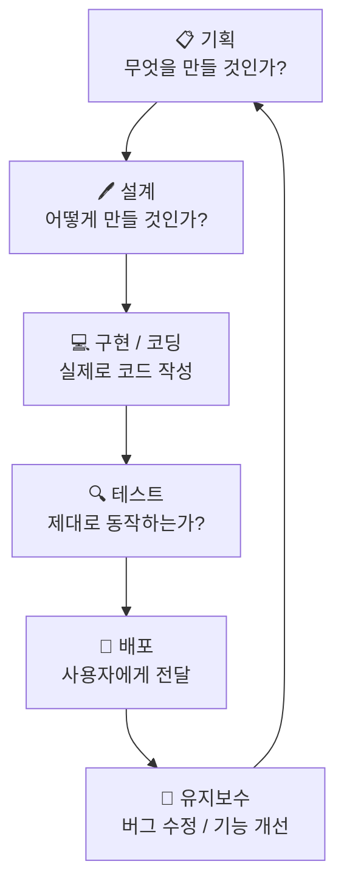
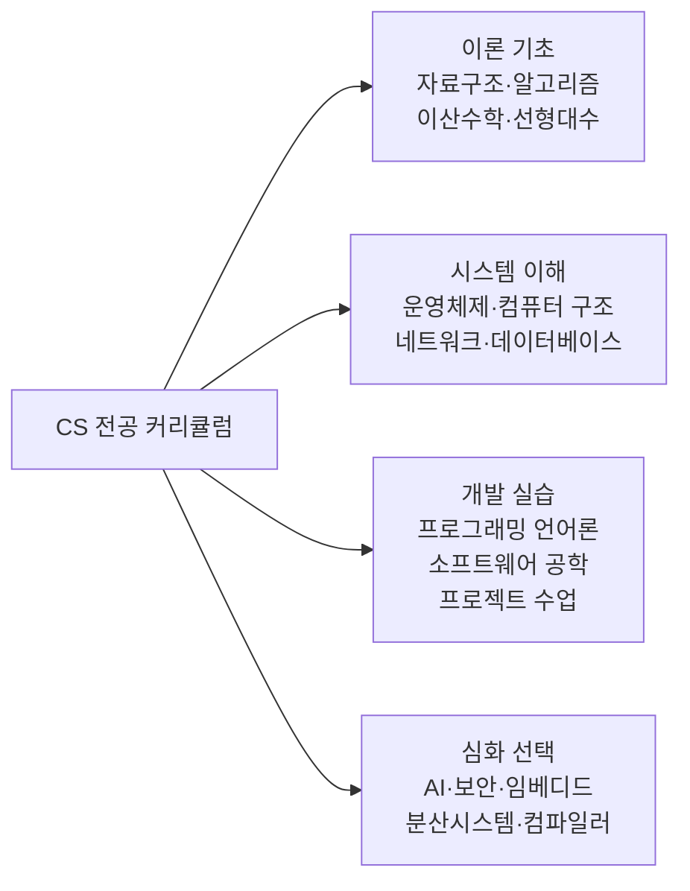
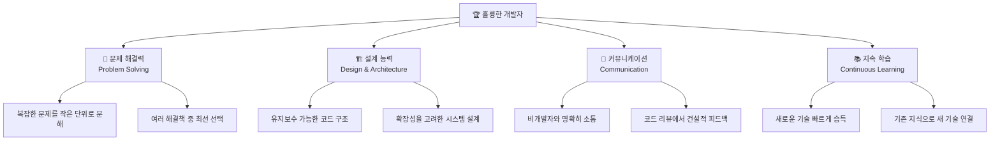

```toc
minLevel: 1
maxLevel: 1
```

# 📚 기술노트: 비전공자도 이해하는 소프트웨어 개발 완전 입문

---

# 제1장. 소프트웨어 개발이란 무엇인가?

> **이 장을 읽기 전에**
>
> 이 장은 프로그래밍 경험이 전혀 없어도 읽을 수 있습니다.  
> 코드보다 개념과 사고방식에 초점을 맞추며, 이후 모든 장의 토대가 됩니다.

---

## 1.1 개발이란 무엇인가?

### 0) 연결 고리 (Bridge)

이 책의 첫 번째 질문은 매우 단순하지만, 많은 사람이 정확히 대답하지 못하는 질문입니다.  
"개발이란 무엇인가?" — 이 정의를 명확히 하는 것이 이후 모든 내용을 이해하는 출발점입니다.

---

### 1) 개념 정의 및 필요성

#### ✅ 핵심 정의

**소프트웨어 개발(Software Development)**이란,  
**사람이 원하는 기능을 컴퓨터가 이해할 수 있는 언어로 명령을 작성하고,  
그 명령들의 집합(프로그램)을 설계·구현·테스트·배포하는 전 과정**을 말합니다.

흔히 "코딩(Coding)"과 동의어처럼 쓰이지만, 엄밀히는 다릅니다.

| 구분 | 코딩 (Coding) | 개발 (Development) |
|------|--------------|-------------------|
| 범위 | 코드를 타이핑하는 행위 자체 | 기획 → 설계 → 코딩 → 테스트 → 배포 전체 |
| 비유 | 벽돌을 쌓는 행위 | 건물을 짓는 전체 공사 |
| 주요 산출물 | 소스 코드 | 동작하는 소프트웨어 제품 |
| 필요 역량 | 문법, 타이핑 | 설계력, 문제 해결력, 협업 능력 포함 |

> 📌 **NOTE:** 코딩 부트캠프, 코딩 테스트 등의 표현이 "개발"의 의미로 혼용되는 경우가 많습니다. 이 책에서는 **개발 = 소프트웨어를 만드는 전체 과정**으로 통일하겠습니다.

---

#### ✅ 왜 개발이 필요한가?

우리가 일상에서 쓰는 거의 모든 디지털 제품 — 카카오톡, 유튜브, 인터넷 뱅킹, 네비게이션 — 은 모두 소프트웨어 개발의 결과물입니다.

컴퓨터, 스마트폰, 서버는 **스스로 무언가를 할 수 없습니다.**  
이 기계들은 오직 **명령(Instructions)을 받았을 때만 동작**합니다.  
소프트웨어 개발은 바로 그 "명령서"를 작성하는 일입니다.

```
[현실 세계의 문제]          [개발자의 역할]             [결과]
"친구에게 메시지를          → 메시지 입력 화면 설계,    → 카카오톡 앱
 보내고 싶다"                 전송 로직 구현,
                              서버 저장 처리
```

---

### 2) 핵심 원리 및 구조

#### ✅ 소프트웨어 개발의 전체 흐름

소프트웨어 하나가 만들어지는 과정은 크게 다섯 단계로 구성됩니다.



이 흐름은 한 번으로 끝나지 않습니다. 배포 후 사용자 피드백을 반영해 다시 기획하고 개선하는 **반복(Iteration)** 구조를 가집니다. 제5장에서 다룰 **애자일(Agile)** 방법론이 바로 이 반복 구조를 체계화한 것입니다.

---

#### ✅ 개발자는 어떤 일을 하는가?

많은 분들이 개발자를 "하루 종일 코드만 타이핑하는 사람"으로 상상합니다.  
실제 개발자의 하루는 다음과 같이 구성됩니다.

```
[실제 개발자의 하루 업무 구성 - 시니어 기준]

  코드 작성         ██████░░░░░░░░░░  약 30~40%
  코드 리뷰         ████░░░░░░░░░░░░  약 15~20%
  회의 / 소통       ████░░░░░░░░░░░░  약 15~20%
  설계 / 문서화     ███░░░░░░░░░░░░░  약 10~15%
  디버깅 / 테스트   ████░░░░░░░░░░░░  약 15~20%
```

> 📌 **NOTE:** 연차가 높아질수록 코드 작성 비율은 줄고, 설계·리뷰·소통의 비중이 늘어납니다. 
> "개발 잘하는 사람 = 코드 빨리 치는 사람"이라는 인식이 잘못된 이유입니다.

---

### 3) 코드 예제 및 실행 환경

개발이 무엇인지 느껴보기 위해, 가장 단순한 프로그램을 살펴보겠습니다.  
"Hello, World!"를 화면에 출력하는 프로그램입니다.

이 프로그램은 개발 세계의 관습적인 첫 번째 예제로, 1978년 브라이언 커니핸의 C 언어 교재에서 유래했습니다.

```python
# Python 3.x 기준
# 이 한 줄이 완전한 프로그램입니다.

print("Hello, World!")   # print() : 화면에 텍스트를 출력하는 함수
                          # "Hello, World!" : 출력할 내용 (문자열)
```

**실행 결과:**
```
Hello, World!
```

같은 기능을 다른 언어로 작성하면 이렇게 달라집니다.

```java
// Java 17 기준
// Java는 동일한 기능을 위해 더 많은 구조가 필요합니다.

public class HelloWorld {                   // 클래스(Class) 정의
    public static void main(String[] args) { // 프로그램의 시작점(Entry Point)
        System.out.println("Hello, World!"); // 화면 출력
    }
}
```

```javascript
// JavaScript (Node.js 18+ 기준)
// 웹 브라우저와 서버 양쪽에서 실행 가능합니다.

console.log("Hello, World!");  // console.log() : 콘솔에 출력하는 함수
```

> 📌 **NOTE:** 세 코드는 모두 동일한 결과를 출력합니다. 언어마다 문법(Syntax)은 다르지만, 컴퓨터에게 전달하는 명령의 본질은 같습니다. 언어 선택 기준은 제3장에서 자세히 다룹니다.

---

### 4) 실무 시나리오 (Best Practice)

#### ✅ 현업에서 "개발"이 시작되는 실제 상황

현업 개발자는 다음과 같은 상황에서 개발을 시작합니다.

**시나리오 1 — 신규 기능 개발**
> 기획팀: "사용자가 게시글에 이모지로 반응할 수 있는 기능을 추가해 주세요."  
> 개발자: 요구사항 분석 → DB 설계(반응 저장 방법) → API 설계 → 프론트엔드 UI → 테스트

**시나리오 2 — 버그 수정**
> 사용자 신고: "결제 완료 후 영수증 이메일이 안 와요."  
> 개발자: 로그 확인 → 원인 파악(이메일 서버 설정 오류) → 수정 → 재배포

**시나리오 3 — 성능 개선**
> 모니터링 알림: "특정 페이지 응답 시간이 3초 초과."  
> 개발자: 병목 지점 분석 → DB 쿼리 최적화 또는 캐시 도입 → 성능 측정 후 배포

#### ⚠️ 안티 패턴 (Anti-Pattern)

- **설계 없이 바로 코딩 시작하기:** 작은 기능이라도 데이터 흐름과 책임 범위를 먼저 그려야 합니다. 나중에 수정하는 비용이 처음 설계하는 비용보다 훨씬 큽니다.
- **"일단 동작하면 됐다" 마인드셋:** 동작하는 코드와 좋은 코드는 다릅니다. 유지보수 불가능한 코드는 팀 전체에 부채(Technical Debt)를 남깁니다.

---

### 5) 트러블슈팅 & 주의사항

#### ❓ 자주 하는 오해 1: "개발 = 수학을 잘해야 한다"

**사실:** 일반적인 웹/앱 개발에서 고등학교 수준 이상의 수학이 필요한 경우는 드뭅니다.  
수학이 중요한 분야는 머신러닝(통계·선형대수), 게임 물리 엔진, 암호학 등 특수 영역에 한정됩니다.  
논리적 사고력과 문제를 단계적으로 분해하는 능력이 수학 실력보다 더 중요합니다.

#### ❓ 자주 하는 오해 2: "영어를 잘해야 개발을 잘한다"

**사실:** 프로그래밍 언어의 키워드(if, for, return 등)가 영어 기반이므로 기초 영어 독해는 도움이 됩니다.  
그러나 영어 회화 능력과 개발 능력은 직접적인 상관관계가 없습니다.  
구글 검색과 공식 문서 독해 수준의 영어면 충분하며, 이는 개발 공부와 함께 자연스럽게 향상됩니다.

#### ❓ 자주 하는 오해 3: "코딩 테스트 = 개발 실력"

**사실:** 코딩 테스트(알고리즘 문제 풀이)는 개발 역량의 일부를 측정하는 채용 도구입니다.  
실제 업무 능력(설계, 협업, 디버깅, 커뮤니케이션)과는 다른 종류의 역량입니다.  
코딩 테스트에 약해도 훌륭한 개발자가 될 수 있고, 반대로 코딩 테스트를 잘 봐도 실무에 어려움을 겪는 경우가 있습니다.

---

### 6) 한 줄 요약

> 💡 **Key Takeaway:**  
> 소프트웨어 개발은 코드 타이핑이 아니라, **문제를 정의하고 → 설계하고 → 구현하고 → 검증하는 전체 사고 과정**이다.

---

## 1.2 전공자 vs 비전공자 — 진짜 차이는 무엇인가?

### 0) 연결 고리 (Bridge)

1.1절에서 개발이 단순 코딩이 아닌 사고와 설계의 과정임을 확인했습니다.  
그렇다면 자연스럽게 이런 질문이 따라옵니다. "CS(컴퓨터 과학) 전공자와 비전공자의 차이는 얼마나 클까요?"

---

### 1) 개념 정의 및 필요성

#### ✅ 용어 정의

- **전공자(CS Major):** 컴퓨터공학(Computer Science), 소프트웨어공학, 정보공학 등 관련 학과를 졸업한 개발자
- **비전공자(Non-CS Major):** 다른 전공(경영, 디자인, 인문학 등)을 졸업하거나 독학·부트캠프로 개발을 배운 개발자

IT 업계에서 비전공자 출신 개발자는 매우 흔합니다. 카카오, 네이버, 토스 등 주요 IT 기업 현직 개발자 중 상당수가 비전공자 출신입니다.

---

### 2) 핵심 원리 및 구조

#### ✅ 전공자가 대학에서 배우는 것

CS 학과의 커리큘럼은 대략 다음과 같습니다.



4년 동안 이론과 실습을 체계적으로 쌓습니다.  
가장 큰 자산은 **"왜 이렇게 동작하는가"를 설명할 수 있는 기초 이론**입니다.

#### ✅ 실제 차이를 구체적으로 비교

| 역량 영역 | 전공자 | 비전공자 |
|-----------|--------|----------|
| CS 이론 기초 | 체계적으로 학습함 | 독학 시 취약한 경우 많음 |
| 알고리즘 / 자료구조 | 수업에서 반복 훈련 | 별도 학습 필요 |
| 실무 프레임워크 경험 | 학교 수업은 이론 중심, 실무 경험은 부족할 수 있음 | 부트캠프·프로젝트로 빠르게 실무 접근 가능 |
| 도메인 지식 | 컴퓨터 분야에 국한 | 이전 전공(의료, 금융, 법률 등)을 강점으로 활용 가능 |
| 첫 취업까지 시간 | 상대적으로 짧음 | 비전공자 채용 전형 또는 포트폴리오로 돌파 가능 |
| 장기 성장 가능성 | 이론 기반 심화 용이 | 의지와 방향에 따라 전공자 이상 성장 가능 |

> 📌 **NOTE:** 위 표는 평균적 경향이며, 개인의 노력과 환경에 따라 크게 달라집니다.

---

#### ✅ 비전공자의 진짜 강점

비전공자는 약점도 있지만, 전공자가 갖지 못한 고유한 강점이 있습니다.

**1. 도메인 전문성(Domain Expertise)**

의료 분야를 알고 개발하는 사람은, 의료 서비스 개발에 있어 순수 CS 전공자보다 훨씬 빠르게 핵심을 이해하고 구현합니다. 금융, 법률, 교육, 물류 등 모든 산업 분야에서 도메인 지식을 가진 개발자는 매우 희귀하고 귀중합니다.

**2. 사용자 중심 사고**

기술만 아는 개발자는 "이렇게 구현하면 된다"고 생각하기 쉽습니다. 비전공자 출신 개발자는 일반 사용자의 관점을 더 쉽게 이해하는 경향이 있습니다.

**3. 빠른 목적 지향 학습**

전공자가 4년에 걸쳐 배우는 이론을 비전공자는 "필요한 것부터" 학습합니다. 비효율적으로 보일 수 있으나, 실무 적용 속도는 오히려 빠른 경우가 있습니다.

---

### 3) 코드 예제 및 실행 환경

전공자와 비전공자가 같은 문제를 해결하는 방식 차이를 코드로 살펴보겠습니다.  
**"1부터 100까지 더하기"** 문제입니다.

```python
# Python 3.x 기준

# --- 방법 1: 비전공자가 처음 접근하는 방식 ---
# 직관적이고 읽기 쉽다. 동작도 정확히 한다.

total = 0
for number in range(1, 101):   # 1부터 100까지 반복
    total = total + number       # 누적 합산
print(total)                     # 결과 출력

# 실행 결과: 5050


# --- 방법 2: CS 이론(가우스 공식)을 아는 방식 ---
# n*(n+1)/2 공식으로 반복 없이 즉시 계산

n = 100
total = n * (n + 1) // 2         # 정수 나눗셈 (//)으로 소수점 방지
print(total)

# 실행 결과: 5050
```

> 📌 **NOTE:** 방법 1도 완전히 정확하고 실무에서 문제없이 쓰입니다.  
> 방법 2는 수백만 번 반복 연산이 필요할 때 성능 차이가 납니다.  
> 대부분의 실무 상황에서는 **가독성이 높은 방법 1이 더 선호**됩니다.  
> CS 이론이 빛을 발하는 순간은 **성능이 매우 중요한 대규모 시스템**에서입니다.

---

### 4) 실무 시나리오 (Best Practice)

#### ✅ 비전공자가 실제로 성공하는 경로

많은 비전공자 개발자들이 다음 경로를 통해 성공적으로 취업하고 성장합니다.

```
[비전공자의 일반적인 성장 경로]

1단계: 기초 언어 학습 (Python 또는 JavaScript, 2~4개월)
    ↓
2단계: 프레임워크 학습 (Django, React 등, 2~3개월)
    ↓
3단계: 포트폴리오 프로젝트 제작 (1~3개 완성, 2~3개월)
    ↓
4단계: 기초 CS 이론 보강 (자료구조, 알고리즘, 네트워크, DB, 3~6개월)
    ↓
5단계: 첫 취업 또는 인턴십
    ↓
6단계: 실무에서 성장 (무한 반복)
```

> 📌 **TIP:** CS 이론을 처음부터 공부하면 동기부여가 떨어지기 쉽습니다.  
> 실무에서 필요성을 느낀 후 이론을 채우는 방식이 비전공자에게 효율적입니다.

#### ⚠️ 안티 패턴

- **전공자 커리큘럼을 그대로 따라가기:** 비전공자가 이산수학부터 시작하면 실습 경험 없이 지쳐 탈락하는 경우가 많습니다.
- **기술 스택 너무 많이 배우기:** 하나의 언어와 프레임워크로 완성된 프로젝트를 만드는 것이, 여러 언어를 조금씩 아는 것보다 훨씬 가치 있습니다.

---

### 5) 트러블슈팅 & 주의사항

#### ❓ "비전공자인데 코딩 테스트를 통과할 수 있을까요?"

**현실적 답변:** 네이버, 카카오 등 대형 IT 기업의 코딩 테스트는 CS 이론 기반 알고리즘 문제가 주를 이룹니다. 비전공자가 합격하려면 알고리즘 문제 풀이를 별도로 3~6개월 이상 훈련해야 합니다. 그러나 모든 회사가 이런 방식을 채택하지는 않습니다. 중소 IT 기업, 스타트업, 외국계 기업 중 다수는 포트폴리오와 과제 전형을 더 중시합니다.

#### ❓ "전공자도 모르는 게 많다던데 사실인가요?"

**사실:** 전공자도 학교에서 배운 언어(C, Java 등)와 실무에서 쓰는 언어(TypeScript, Go 등)가 다른 경우가 많습니다. 프레임워크, 클라우드, 도구들은 빠르게 바뀌기 때문에 전공자도 실무 입문 시 새로 배우는 것이 많습니다. IT 업계는 **학습이 멈추면 도태되는 분야**이므로, 전공자·비전공자 모두 끊임없이 배웁니다.

---

### 6) 한 줄 요약

> 💡 **Key Takeaway:**  
> 전공자와 비전공자의 차이는 **출발점의 차이일 뿐**, 장기적 역량은 학습 의지와 실무 경험이 결정한다.  
> 비전공자의 이전 도메인 지식은 약점이 아닌 차별화된 강점이 될 수 있다.

---

## 1.3 개발 잘하는 사람이란 어떤 사람인가?

### 0) 연결 고리 (Bridge)

1.2절에서 전공자와 비전공자의 차이를 살펴보며, 결국 장기적인 역량은 개인의 노력에 달려 있다는 사실을 확인했습니다.  
그렇다면 이제 구체적인 목표를 설정해야 합니다 — "개발을 잘한다"는 것은 구체적으로 어떤 상태를 의미할까요?

---

### 1) 개념 정의 및 필요성

"개발 잘하는 사람"에 대한 오해는 주로 두 가지입니다.

- **오해 1:** "코드를 빠르게 많이 짜는 사람"
- **오해 2:** "최신 기술을 가장 많이 아는 사람"

실제 현업에서 인정받는 개발자는 이 두 가지와는 다소 다릅니다.

---

### 2) 핵심 원리 및 구조

#### ✅ 개발 역량의 4가지 축

훌륭한 개발자는 다음 네 가지 역량이 균형 있게 발달되어 있습니다.



---

#### ✅ 역량별 구체적인 설명

**1. 문제 해결력 (Problem Solving)**

개발의 본질은 문제 해결입니다. 훌륭한 개발자는 다음 순서로 사고합니다.

```
1단계: 문제를 정확히 이해한다
       → "회원가입이 안 된다"는 증상을 "이메일 중복 검증 로직에서 예외 처리 누락"으로 정확히 파악

2단계: 문제를 작은 단위로 분해한다
       → "로그인 시스템 만들기"를 "입력 검증 → 비밀번호 암호화 → DB 조회 → 토큰 발급"으로 쪼갬

3단계: 여러 해결책을 떠올린다
       → 각 방법의 장단점을 비교하고 현재 상황에 가장 적합한 것을 선택

4단계: 검증 가능한 단위로 구현한다
       → 전체를 한 번에 짜지 않고, 테스트 가능한 작은 단위로 나눠 구현
```

**2. 설계 능력 (Design & Architecture)**

코드를 짜기 전에 **어떤 구조로 만들 것인가**를 결정하는 능력입니다.  
설계가 잘된 코드는 다음 특성을 가집니다.

| 특성 | 나쁜 예 | 좋은 예 |
|------|---------|---------|
| **가독성** | 변수명이 `a`, `b`, `tmp` | 변수명이 `userEmail`, `loginAttemptCount` |
| **단일 책임** | 하나의 함수가 200줄, 10가지 기능 수행 | 하나의 함수는 하나의 역할만 |
| **재사용성** | 같은 코드가 10곳에 복사·붙여넣기 | 공통 함수로 분리하여 한 곳에서 관리 |
| **확장성** | 새 기능 추가 시 기존 코드 전체 수정 필요 | 새 파일 추가만으로 기능 확장 가능 |

**3. 커뮤니케이션 (Communication)**

개발자는 혼자 일하지 않습니다. 다음 사람들과 매일 소통합니다.

- **기획자/PM:** "이 기능을 구현하려면 3일이 아닌 2주가 필요한 이유"를 설명
- **디자이너:** 디자인을 개발로 구현할 때 발생하는 기술적 제약 협의
- **다른 개발자:** 코드 리뷰에서 개선점을 명확하고 정중하게 전달
- **고객/사용자:** 기술 문제를 비전문가도 이해할 수 있는 언어로 설명

> 📌 **NOTE:** 시니어 개발자가 가장 중요하게 여기는 역량 중 하나가 커뮤니케이션 능력입니다. "코드는 짤 줄 알지만 설명을 못 하는 개발자"는 팀에서 협업하기 어렵습니다.

**4. 지속 학습 (Continuous Learning)**

IT 업계는 1~2년 사이에 주력 기술이 바뀔 수 있습니다.  
2010년대 인기 기술과 2024년 인기 기술은 상당 부분 다릅니다.

```
[기술 트렌드 변화 예시]

2010년대 초반  →  2024년 현재
jQuery          →  React / Vue / Svelte
서버 직접 운영  →  AWS / GCP / Azure
FTP 배포        →  CI/CD (GitHub Actions)
모놀리식 서버   →  마이크로서비스(MSA) / 서버리스
```

훌륭한 개발자는 **특정 기술에 집착하지 않고**, 기초 원리를 바탕으로 새로운 기술을 빠르게 습득합니다.

---

### 3) 코드 예제 및 실행 환경

같은 기능을 구현한 "나쁜 코드"와 "좋은 코드"를 비교해 보겠습니다.  
사용자 이름을 검증하는 함수입니다.

```python
# Python 3.x 기준

# ❌ 나쁜 코드 예시 — 설계 능력이 부족한 경우
def f(x):
    if len(x) < 2:           # 숫자 2가 무엇을 의미하는지 알 수 없음
        return False
    if len(x) > 20:          # 숫자 20이 무엇을 의미하는지 알 수 없음
        return False
    for c in x:
        if not c.isalnum():  # isalnum()이 왜 쓰이는지 주석 없음
            return False
    return True


# ✅ 좋은 코드 예시 — 가독성·재사용성·유지보수성을 고려한 경우
# 상수(Constants): 의미 있는 이름으로 숫자를 대체
MIN_USERNAME_LENGTH = 2
MAX_USERNAME_LENGTH = 20

def validate_username(username: str) -> bool:
    """
    사용자 이름의 유효성을 검증합니다.

    조건:
    - 길이: 2자 이상 20자 이하
    - 구성: 영문자(a-z, A-Z)와 숫자(0-9)만 허용

    Args:
        username (str): 검증할 사용자 이름

    Returns:
        bool: 유효하면 True, 아니면 False
    """
    if len(username) < MIN_USERNAME_LENGTH:
        return False

    if len(username) > MAX_USERNAME_LENGTH:
        return False

    # isalnum(): 영숫자(alphanumeric)로만 구성되어 있는지 확인
    if not username.isalnum():
        return False

    return True


# 테스트 예시
test_cases = [
    ("alice", True),       # 정상 이름
    ("a", False),          # 너무 짧음
    ("a" * 21, False),     # 너무 긺
    ("alice!!", False),    # 특수문자 포함
]

for name, expected in test_cases:
    result = validate_username(name)
    status = "✅ PASS" if result == expected else "❌ FAIL"
    print(f"{status} | 입력: '{name}' | 예상: {expected} | 결과: {result}")
```

**실행 결과:**
```
✅ PASS | 입력: 'alice' | 예상: True | 결과: True
✅ PASS | 입력: 'a' | 예상: False | 결과: False
✅ PASS | 입력: 'aaaaaaaaaaaaaaaaaaaaa' | 예상: False | 결과: False
✅ PASS | 입력: 'alice!!' | 예상: False | 결과: False
```

> 📌 **NOTE:** 두 코드는 동일하게 동작합니다. 그러나 6개월 후 "사용자 이름에 언더스코어(_)도 허용해 주세요"라는 요청이 왔을 때, 좋은 코드는 한 줄 수정으로 대응 가능하지만, 나쁜 코드는 의미를 파악하는 데만 시간이 걸립니다.

---

### 4) 실무 시나리오 (Best Practice)

#### ✅ 시니어 개발자가 주니어를 평가하는 실제 기준

현업 시니어 개발자들이 주니어를 코드 리뷰할 때 실제로 확인하는 항목입니다.

```
[코드 리뷰 체크리스트 - 현업 기준]

기능성
  □ 요구사항대로 동작하는가?
  □ 예외 상황(null, 빈 값, 잘못된 입력)을 처리하는가?

가독성
  □ 변수·함수 이름이 역할을 명확히 표현하는가?
  □ 복잡한 로직에 주석이 있는가?
  □ 한 함수가 한 가지 일만 하는가?

안전성
  □ 보안 취약점(SQL 인젝션, XSS 등)은 없는가?
  □ 민감한 정보(비밀번호, 토큰)가 로그에 노출되지 않는가?

성능
  □ 불필요한 반복 연산이 없는가?
  □ DB 조회를 N번 하는 것을 1번으로 줄일 수 있는가?

테스트
  □ 핵심 로직에 테스트 코드가 작성되어 있는가?
```

#### ⚠️ 안티 패턴

- **"나만 이해하면 된다" 마인드셋:** 코드는 협업 도구입니다. 6개월 후의 자신도 이해할 수 없는 코드는 좋은 코드가 아닙니다.
- **오버엔지니어링(Over-Engineering):** 현재 필요하지도 않은 기능을 미래를 대비해 복잡하게 설계하는 것. "지금 필요한 것을 단순하게"가 원칙입니다.

---

### 5) 트러블슈팅 & 주의사항

#### ❓ "좋은 코드를 어떻게 배울 수 있나요?"

다음 방법들이 실제로 효과적입니다.

1. **오픈 소스 코드 읽기:** GitHub에 공개된 유명 프로젝트(Django, React 등)의 소스코드를 읽으며 패턴을 익힌다.
2. **코드 리뷰 받기:** 멘토나 커뮤니티에서 자신의 코드를 리뷰받는 것이 가장 빠른 성장법이다.
3. **리팩토링 연습:** 과거에 작성한 코드를 지금의 시각으로 개선하는 연습을 정기적으로 한다.
4. **'클린 코드(Clean Code)' 도서 학습:** 로버트 마틴(Robert C. Martin)의 저서로, 좋은 코드를 작성하는 원칙을 체계적으로 다룹니다.

#### ❓ "얼마나 공부해야 취업할 수 있나요?"

**현실적인 기준:**
- **최소 기준:** 하나의 언어로 기능이 완성된 프로젝트 1개를 혼자 만들 수 있을 것
- **권장 기준:** 프론트엔드+백엔드+DB를 연결한 완성된 프로젝트 2~3개 + 기초 CS 이론(자료구조, 네트워크, DB)

평균적으로 주 40시간 기준 6개월~1년 정도의 집중 학습이 필요하나, 개인 편차가 매우 큽니다.

---

### 6) 한 줄 요약

> 💡 **Key Takeaway:**  
> 개발을 잘하는 사람은 **코드를 빠르게 짜는 사람이 아니라**,  
> 문제를 정확히 이해하고, 유지보수 가능하게 설계하며, 팀과 효과적으로 소통하고, 끊임없이 학습하는 사람이다.

---

## 📌 제1장 용어 사전

| 용어 | 정의 |
|------|------|
| 소프트웨어 개발 (Software Development) | 기획·설계·구현·테스트·배포를 아우르는 소프트웨어 제작 전 과정 |
| 코딩 (Coding) | 프로그래밍 언어로 소스 코드를 작성하는 행위 |
| CS (Computer Science) | 컴퓨터 과학. 알고리즘, 자료구조, 운영체제 등 컴퓨터의 이론적 기반 |
| 기술 부채 (Technical Debt) | 빠른 개발을 위해 타협한 코드 품질이 나중에 누적되어 발생하는 추가 비용 |
| 리팩토링 (Refactoring) | 외부 동작은 유지하면서 코드의 내부 구조를 개선하는 작업 |
| 오버엔지니어링 (Over-Engineering) | 현재 필요 이상으로 복잡하게 설계하는 것 |
| 도메인 지식 (Domain Knowledge) | 특정 산업 분야(의료, 금융, 물류 등)에 대한 전문 지식 |

---

## 🔖 제1장 핵심 정리

```
✅ 소프트웨어 개발 = 코딩 + 기획 + 설계 + 테스트 + 배포 전체 과정
✅ 전공자 vs 비전공자 = 출발점의 차이. 장기 역량은 학습 의지가 결정
✅ 개발 잘하는 사람 = 문제 해결력 + 설계 능력 + 커뮤니케이션 + 지속 학습
✅ 좋은 코드 = 동작하는 코드 + 읽기 쉬운 코드 + 유지보수 가능한 코드
```

---

> ➡️ **다음 장 예고:** 제2장에서는 소프트웨어의 종류를 웹, 앱, 하이브리드로 나누어 살펴보고,
> 프론트엔드와 백엔드가 어떻게 역할을 분담하는지 구체적으로 알아봅니다.