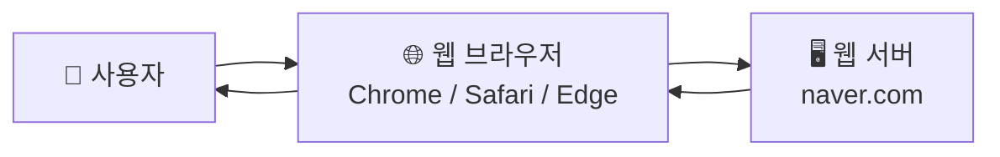
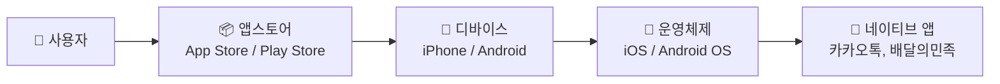
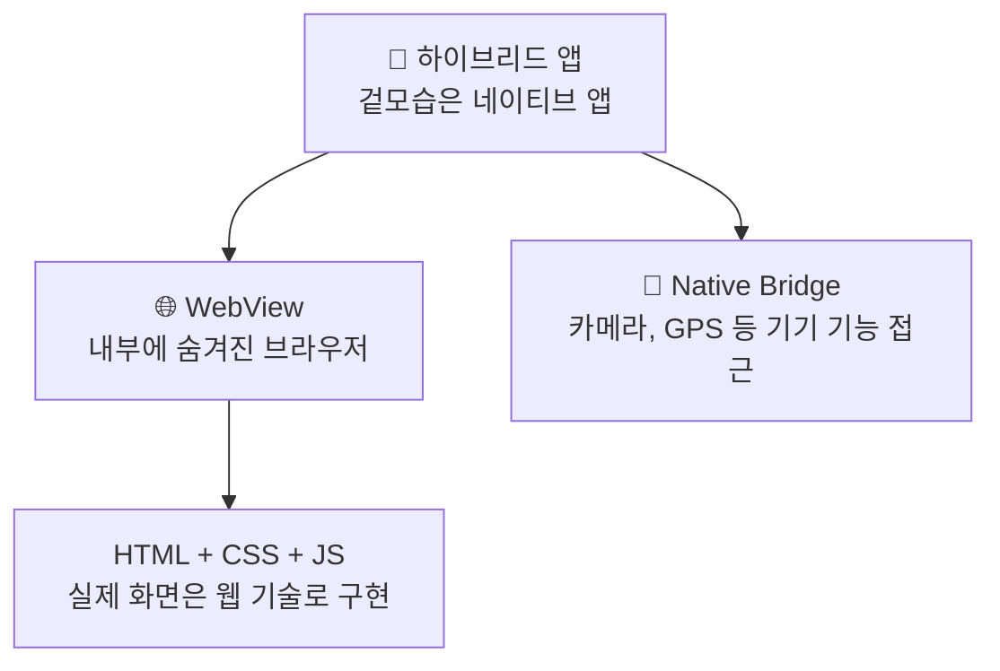
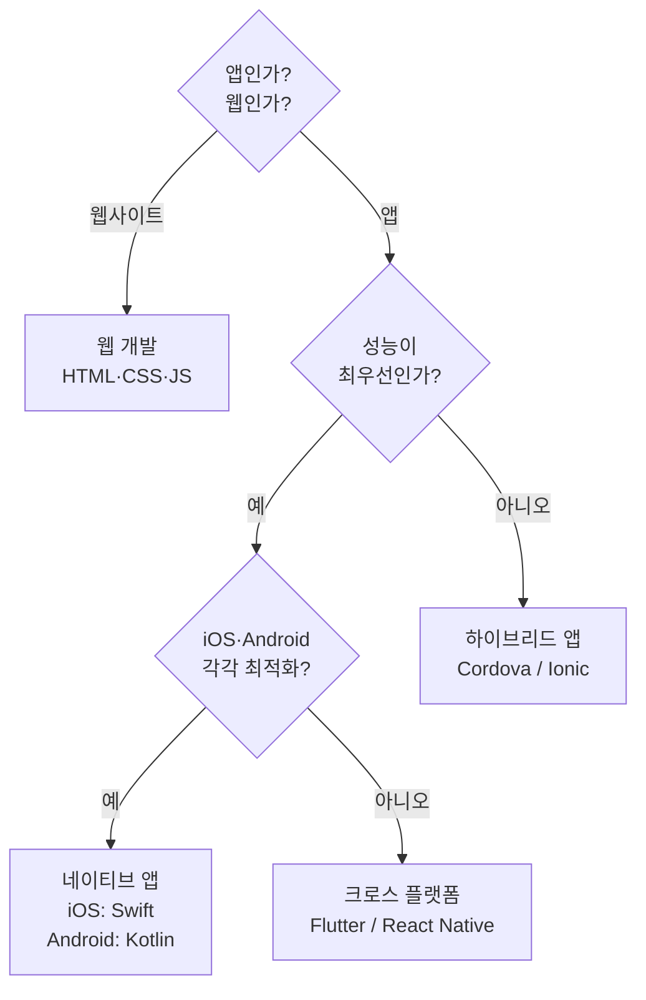
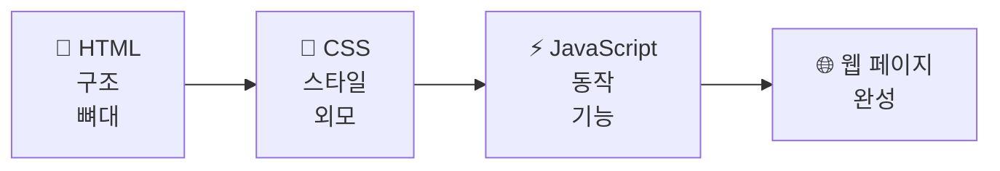
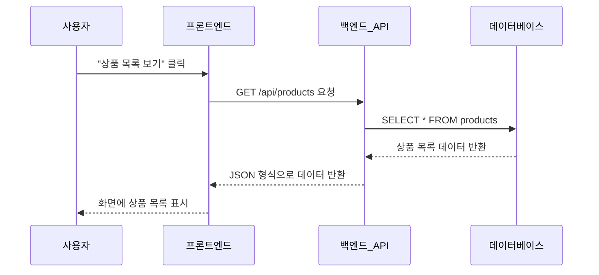
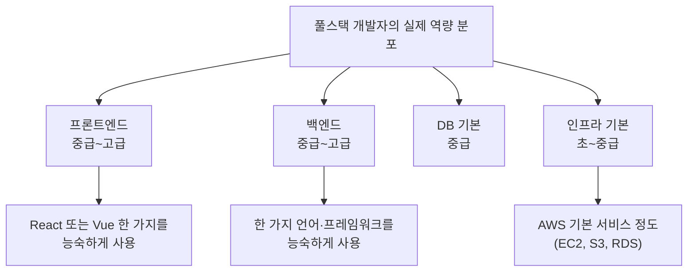

```toc
minLevel: 1
maxLevel: 1
```

# 📚 기술노트: 비전공자도 이해하는 소프트웨어 개발 완전 입문

---

# 제2장. 소프트웨어의 종류

> **이 장을 읽기 전에**
>
> 제1장에서 개발이 무엇인지 정의했습니다.  
> 이 장에서는 우리가 일상에서 접하는 소프트웨어가 실제로 어떤 종류로 나뉘는지, 각각 어떤 특성을 가지는지 이해합니다.  
> **전제 지식:** 스마트폰 앱과 웹사이트를 사용해 본 경험.

---

## 2.1 앱의 종류: 웹, 네이티브, 하이브리드

### 0) 연결 고리 (Bridge)

제1장에서 소프트웨어 개발의 전체 과정을 살펴보았습니다.  
이제 "그래서 우리가 만드는 소프트웨어는 구체적으로 어떤 종류인가?"라는 질문에 답할 차례입니다.  
"앱을 만들고 싶다"고 말할 때, 그 앱이 웹인지 네이티브인지에 따라 필요한 기술과 개발 방식이 완전히 달라집니다.

---

### 1) 개념 정의 및 필요성

사용자가 소프트웨어를 실행하는 **환경(플랫폼)**에 따라 크게 세 가지로 분류합니다.

| 종류 | 실행 환경 | 대표 예시 |
|------|----------|----------|
| 웹 (Web) | 웹 브라우저 (Chrome, Safari 등) | 네이버, 구글, 쿠팡 웹사이트 |
| 네이티브 앱 (Native App) | 운영체제 (iOS, Android) | 카카오톡, 인스타그램, 배달의민족 |
| 하이브리드 앱 (Hybrid App) | 웹 기술 + 앱 형태로 포장 | 일부 금융앱, 뱅크샐러드 초기 버전 등 |

---

### 2) 핵심 원리 및 구조

#### ✅ 웹 (Web)

웹은 **인터넷 브라우저를 통해 접근**하는 소프트웨어입니다.  
URL(주소)을 입력하거나 링크를 클릭해 바로 사용합니다. 설치가 필요 없습니다.



**웹의 특징:**

| 항목 | 내용 |
|------|------|
| 접근 방법 | URL 입력, 링크 클릭 — 설치 불필요 |
| 업데이트 | 서버에서 즉시 반영. 사용자가 아무것도 안 해도 됨 |
| 기기 제약 | 없음. PC, 태블릿, 스마트폰 브라우저에서 모두 실행 |
| 기기 기능 접근 | 제한적 (카메라, GPS 등 일부 제한) |
| 속도 | 네트워크 의존. 인터넷 없으면 사용 불가 |
| 개발 언어 | HTML, CSS, JavaScript (프론트엔드) |

> 📌 **NOTE:** 최근에는 **PWA(Progressive Web App)**라는 기술로 웹앱을 스마트폰 홈 화면에 설치하고 오프라인에서도 일부 사용할 수 있게 하는 방식도 등장했습니다.

---

#### ✅ 네이티브 앱 (Native App)

**운영체제(iOS 또는 Android)에 직접 설치**되어 실행되는 앱입니다.  
앱스토어(App Store, Google Play)에서 다운로드합니다.



**네이티브 앱의 특징:**

| 항목 | 내용 |
|------|------|
| 접근 방법 | 앱스토어에서 설치 필요 |
| 업데이트 | 사용자가 직접 업데이트 해야 함 |
| 기기 제약 | iOS 앱은 iOS 전용, Android 앱은 Android 전용 |
| 기기 기능 접근 | 카메라, GPS, 마이크, 진동 등 모든 기능 자유롭게 사용 |
| 속도 | 빠름. 기기 자원을 직접 사용 |
| 개발 언어 | iOS: Swift / Objective-C, Android: Kotlin / Java |

**네이티브 앱의 핵심 강점:**

게임, 카메라 앱, AR/VR 앱처럼 **디바이스 하드웨어를 최대로 활용**해야 하는 경우, 네이티브 개발이 유일한 선택입니다.  
또한 인터넷 없이도 사용 가능한 **오프라인 기능**을 완전히 지원합니다.

---

#### ✅ 하이브리드 앱 (Hybrid App)

웹 기술(HTML, CSS, JavaScript)로 개발하되, 앱 형태로 **포장**해서 배포하는 방식입니다.  
"웹뷰(WebView)"라는 기술을 사용해 앱 내부에 브라우저를 숨겨두는 방식입니다.



**하이브리드 앱의 특징:**

| 항목 | 내용 |
|------|------|
| 개발 효율 | 웹 코드 한 벌로 iOS·Android 동시 출시 가능 |
| 성능 | 네이티브보다 느린 경우가 많음 |
| 기기 기능 | 플러그인을 통해 제한적으로 접근 가능 |
| 대표 프레임워크 | Apache Cordova, Ionic, Capacitor |

---

#### ✅ 크로스 플랫폼 앱 (Cross-Platform App) — 하이브리드의 진화

하이브리드 앱의 성능 한계를 극복하려고 등장한 방식입니다.  
웹 기술이 아닌 **별도의 언어와 엔진**으로 iOS·Android 코드를 동시에 생성합니다.

| 프레임워크 | 개발 언어 | 특징 |
|-----------|----------|------|
| **React Native** | JavaScript | Facebook 개발. 네이티브 컴포넌트를 JavaScript로 제어 |
| **Flutter** | Dart | Google 개발. 자체 렌더링 엔진으로 고성능 UI |

> 📌 **TIP:** 스타트업에서 iOS·Android를 동시에 빠르게 출시해야 한다면 Flutter 또는 React Native가 현실적인 선택입니다. 대규모 서비스(카카오, 네이버 등)는 각 플랫폼 전담 네이티브 팀을 운영하는 경우가 많습니다.

---

#### ✅ 세 가지 앱 방식 종합 비교



---

### 3) 코드 예제 및 실행 환경

같은 "버튼을 누르면 알림 표시" 기능을 각 플랫폼에서 어떻게 구현하는지 비교해 보겠습니다.

```html
<!-- 웹 (HTML + JavaScript) 방식 -->
<!-- 별도 설치 없이 브라우저에서 바로 실행 -->

<!DOCTYPE html>
<html lang="ko">
<head>
    <meta charset="UTF-8">
    <title>웹 예제</title>
</head>
<body>
    <!-- 버튼 요소 -->
    <button onclick="showGreeting()">인사하기</button>

    <script>
        // 버튼 클릭 시 실행되는 함수
        function showGreeting() {
            alert("안녕하세요! 웹에서 실행 중입니다.");
        }
    </script>
</body>
</html>
```

```swift
// iOS 네이티브 (Swift 5.x 기준)
// Xcode에서 실행 / iPhone에 설치하여 사용

import UIKit  // iOS의 UI 기본 라이브러리

class ViewController: UIViewController {

    override func viewDidLoad() {
        super.viewDidLoad()

        // 버튼 생성
        let greetingButton = UIButton(type: .system)
        greetingButton.setTitle("인사하기", for: .normal)
        greetingButton.frame = CGRect(x: 100, y: 200, width: 150, height: 50)

        // 버튼 클릭 시 showGreeting 함수 연결
        greetingButton.addTarget(self, action: #selector(showGreeting), for: .touchUpInside)

        // 화면에 버튼 추가
        view.addSubview(greetingButton)
    }

    @objc func showGreeting() {
        // iOS에서 알림창(Alert)을 표시하는 방법
        let alertController = UIAlertController(
            title: "안녕하세요!",
            message: "iOS 네이티브에서 실행 중입니다.",
            preferredStyle: .alert
        )
        alertController.addAction(UIAlertAction(title: "확인", style: .default))
        present(alertController, animated: true)
    }
}
```

```dart
// Flutter (Dart 3.x 기준)
// iOS와 Android 동시 실행 가능

import 'package:flutter/material.dart';

void main() {
  runApp(const MyApp());  // 앱 시작점
}

class MyApp extends StatelessWidget {
  const MyApp({super.key});

  @override
  Widget build(BuildContext context) {
    return MaterialApp(
      home: Scaffold(
        body: Center(
          child: ElevatedButton(
            // 버튼 클릭 시 다이얼로그 표시
            onPressed: () {
              showDialog(
                context: context,
                builder: (context) => AlertDialog(
                  title: const Text("안녕하세요!"),
                  content: const Text("Flutter에서 실행 중입니다."),
                  actions: [
                    TextButton(
                      onPressed: () => Navigator.pop(context),
                      child: const Text("확인"),
                    ),
                  ],
                ),
              );
            },
            child: const Text("인사하기"),
          ),
        ),
      ),
    );
  }
}
```

> 📌 **NOTE:** 같은 기능을 구현하는데 웹은 10줄, iOS 네이티브는 35줄, Flutter는 38줄이 필요합니다.  
> 이 예제는 최단 코드이며, 실제 앱은 훨씬 복잡합니다.  
> 각 플랫폼마다 사고 방식(패러다임)이 다르기 때문에 단순 줄 수로 난이도를 비교하는 것은 적절하지 않습니다.

---

### 4) 실무 시나리오 (Best Practice)

#### ✅ 현업에서 플랫폼을 결정하는 실제 기준

스타트업 A사가 "음식 배달 서비스"를 개발한다고 가정하겠습니다.

```
[의사결정 시나리오]

상황: 개발자 3명, 자본금 제한, 6개월 내 MVP 출시 목표

질문 1: 주요 사용 환경은?
  → 스마트폰 앱 (음식 배달은 모바일이 주)

질문 2: iOS만? Android만? 둘 다?
  → 한국 시장 기준, Android 70% / iOS 30% → 둘 다 필요

질문 3: 성능이 매우 중요한가?
  → 지도, 실시간 위치 추적 → 어느 정도 중요

질문 4: 팀의 기술 스택은?
  → JavaScript/React 경험자 2명

결론: React Native 선택
  → 웹 개발자가 빠르게 배울 수 있음
  → iOS·Android 동시 출시 가능
  → 지도·위치 기능은 네이티브 모듈로 보완
```

#### ⚠️ 안티 패턴

- **처음부터 네이티브 iOS + 네이티브 Android 동시 개발:** 팀 규모와 예산이 충분하지 않으면 두 플랫폼을 동시에 개발·유지보수하는 것은 비효율적입니다. 검증되지 않은 서비스에는 크로스 플랫폼부터 시작하는 것을 권장합니다.
- **하이브리드 앱으로 고성능 기능 구현 시도:** 실시간 카메라 필터, 복잡한 애니메이션 등은 하이브리드 방식으로 구현하면 성능 문제가 반드시 발생합니다.

---

### 5) 트러블슈팅 & 주의사항

#### ❓ "웹앱과 모바일 앱 중 어떤 걸 먼저 배워야 하나요?"

**권장 답변:** 대부분의 경우 **웹 개발부터 시작**하는 것을 권장합니다.  
이유는 세 가지입니다.

1. 웹은 설치 없이 바로 결과를 확인할 수 있어 학습 속도가 빠릅니다.
2. React Native, Flutter 모두 웹 개념(이벤트, 상태 관리, API 통신)을 공유합니다.
3. 취업 시장에서 웹 개발자 수요가 가장 많습니다.

#### ❓ "웹사이트와 웹앱(Web App)은 다른 건가요?"

**사실:** 명확한 기술적 경계는 없으나, 일반적으로 구분합니다.

| 구분 | 웹사이트 (Website) | 웹앱 (Web App) |
|------|------------------|----------------|
| 주목적 | 정보 제공 | 사용자 인터랙션 |
| 예시 | 뉴스 사이트, 블로그 | 구글 Docs, 카카오 웹 채팅 |
| 특징 | 주로 읽기 중심 | 쓰기·수정·삭제 등 복잡한 상호작용 |

---

### 6) 한 줄 요약

> 💡 **Key Takeaway:**  
> 소프트웨어의 실행 환경(브라우저 vs iOS vs Android)에 따라 웹·네이티브·하이브리드로 나뉘며,  
> **팀 규모, 예산, 목표 성능, 기술 스택**을 고려해 가장 적합한 방식을 선택해야 한다.

---

## 2.2 프론트엔드와 백엔드 — 역할을 나누는 이유

### 0) 연결 고리 (Bridge)

2.1절에서 소프트웨어가 웹·앱·하이브리드로 나뉜다는 것을 알았습니다.  
그런데 이 소프트웨어 안에서 개발자들은 또 역할을 나눕니다 — 바로 **프론트엔드**와 **백엔드**입니다.  
왜 하나의 서비스를 두 팀이 나눠 만드는 걸까요?

---

### 1) 개념 정의 및 필요성

레스토랑을 예로 들겠습니다.

```
[레스토랑 비유]

  홀(Front of House)              주방(Back of House)
  ───────────────────              ──────────────────
  손님이 보는 공간                  손님에게 보이지 않는 공간
  메뉴판, 테이블, 인테리어          조리 과정, 재료 보관, 레시피
  웨이터가 주문 받음                쉐프가 요리 만듦

  ↕ (주문서를 통해 소통)

         소프트웨어로 대응
  ───────────────────              ──────────────────
  프론트엔드(Frontend)             백엔드(Backend)
  사용자가 보는 화면                서버·데이터 처리
  버튼, 입력창, 애니메이션          로직, DB, 보안
  HTTP 요청으로 소통 ────────────→ API 응답 반환
```

| 구분 | 프론트엔드 (Frontend) | 백엔드 (Backend) |
|------|---------------------|-----------------|
| 정의 | 사용자가 직접 보고 조작하는 화면 영역 | 서버에서 데이터를 처리하고 저장하는 영역 |
| 위치 | 사용자의 브라우저/앱 위에서 실행 | 서버 컴퓨터 위에서 실행 |
| 핵심 관심사 | 예쁜가? 빠른가? 쓰기 편한가? | 안전한가? 빠른가? 정확한가? |

---

### 2) 핵심 원리 및 구조

#### ✅ 프론트엔드 — 사용자와 직접 만나는 영역

프론트엔드 개발자가 만드는 것들입니다.

```
[프론트엔드 담당 영역 - 쇼핑몰 예시]

  ┌────────────────────────────────────────┐
  │  🛒 쿠팡                        [로그인]│  ← 헤더, 메뉴, 버튼 (레이아웃)
  ├────────────────────────────────────────┤
  │  [검색창: 상품을 검색하세요    🔍]       │  ← 입력창, 검색 버튼 (인터랙션)
  ├────────────────────────────────────────┤
  │  ┌──────┐ ┌──────┐ ┌──────┐           │
  │  │ 상품1 │ │ 상품2 │ │ 상품3 │           │  ← 상품 카드 (데이터 렌더링)
  │  │ 이미지│ │ 이미지│ │ 이미지│           │
  │  │ 1만원 │ │ 2만원 │ │ 3만원 │           │
  │  └──────┘ └──────┘ └──────┘           │
  ├────────────────────────────────────────┤
  │  로딩 중... ⏳                          │  ← 로딩 상태 표시
  └────────────────────────────────────────┘
```

**프론트엔드 핵심 기술 3가지:**



- **HTML(HyperText Markup Language):** 페이지의 뼈대. "여기에 제목이 있고, 여기에 이미지가 있다"는 구조 정의.
- **CSS(Cascading Style Sheets):** 색상, 폰트, 크기, 배치 등 시각적 디자인 적용.
- **JavaScript:** 버튼 클릭, 데이터 불러오기, 애니메이션 등 동적 기능 구현.

---

#### ✅ 백엔드 — 보이지 않는 곳에서 동작하는 엔진

백엔드 개발자가 만드는 것들입니다.

```
[백엔드 담당 영역 - 로그인 요청 처리 흐름]

  프론트엔드                     백엔드 서버                  데이터베이스
  ─────────                     ──────────                  ────────────
  사용자가 ID/PW 입력
       │
       │  HTTP POST 요청 전송
       │  { email: "user@test.com",
       │    password: "1234" }
       ↓
                          요청 수신
                               │
                          1. 입력값 검증
                             (이메일 형식 맞나?)
                               │
                          2. DB에서 사용자 조회 ────→  SELECT * FROM users
                                                       WHERE email = '...'
                          3. 비밀번호 암호화 비교  ←──  사용자 정보 반환
                               │
                          4. 로그인 토큰 생성
                               │
       HTTP 응답 반환 ←─────────┘
       { token: "eyJ..." }
       │
  토큰 저장 후 메인 페이지 이동
```

**백엔드 핵심 역할:**

| 역할 | 설명 | 예시 |
|------|------|------|
| **API 서버** | 프론트엔드의 요청을 받아 처리하고 데이터 반환 | 상품 목록 반환, 주문 처리 |
| **비즈니스 로직** | 서비스의 핵심 규칙 구현 | "쿠폰은 1인 1장", "재고가 없으면 구매 불가" |
| **데이터 관리** | DB에 데이터를 저장·조회·수정·삭제 | 회원가입 시 사용자 정보 저장 |
| **보안 처리** | 비밀번호 암호화, 인증 토큰 발급 | 비밀번호를 그대로 저장하지 않고 해시화 |
| **외부 서비스 연동** | 결제, 문자, 이메일 등 외부 API 연동 | 결제 완료 시 카카오페이 API 호출 |

---

#### ✅ 프론트엔드 ↔ 백엔드 통신: API

두 영역은 **API(Application Programming Interface)**를 통해 대화합니다.  
API는 "우리가 이런 형식으로 요청하면 이런 형식으로 답장해 준다"는 약속입니다.  
자세한 내용은 제4장에서 다룹니다.



---

### 3) 코드 예제 및 실행 환경

간단한 쇼핑몰 상품 조회 기능을 프론트엔드와 백엔드로 나눠서 구현해 보겠습니다.

**[백엔드] — Python, Flask 프레임워크 (Flask 3.x 기준)**

```python
# 백엔드 서버 코드
# 설치: pip install flask

from flask import Flask, jsonify  # Flask: 웹 서버 프레임워크, jsonify: 딕셔너리→JSON 변환

app = Flask(__name__)  # Flask 앱 생성

# 상품 데이터 (실제 서비스에서는 DB에서 조회)
PRODUCTS = [
    {"id": 1, "name": "무선 마우스", "price": 25000, "stock": 50},
    {"id": 2, "name": "기계식 키보드", "price": 89000, "stock": 15},
    {"id": 3, "name": "27인치 모니터", "price": 320000, "stock": 8},
]

# GET /api/products 요청이 오면 아래 함수 실행
@app.route("/api/products", methods=["GET"])
def get_products():
    """
    상품 목록을 반환하는 API 엔드포인트.
    프론트엔드에서 이 주소로 GET 요청을 보내면 상품 목록을 받습니다.
    """
    return jsonify({
        "status": "success",       # 요청 성공 여부
        "count": len(PRODUCTS),    # 상품 총 개수
        "data": PRODUCTS           # 상품 목록 데이터
    })

if __name__ == "__main__":
    app.run(debug=True, port=5000)  # 포트 5000에서 서버 실행
```

**API 응답 결과 (JSON 형식):**
```json
{
  "status": "success",
  "count": 3,
  "data": [
    {"id": 1, "name": "무선 마우스", "price": 25000, "stock": 50},
    {"id": 2, "name": "기계식 키보드", "price": 89000, "stock": 15},
    {"id": 3, "name": "27인치 모니터", "price": 320000, "stock": 8}
  ]
}
```

**[프론트엔드] — HTML + JavaScript (ES2022 기준)**

```html
<!DOCTYPE html>
<html lang="ko">
<head>
    <meta charset="UTF-8">
    <title>상품 목록</title>
    <style>
        /* CSS: 상품 카드 스타일 */
        .product-card {
            border: 1px solid #ddd;
            padding: 16px;
            margin: 8px;
            border-radius: 8px;
            display: inline-block;
            width: 200px;
        }
        .price { color: #e44d26; font-weight: bold; }
        .stock-low { color: orange; }
    </style>
</head>
<body>
    <h1>상품 목록</h1>
    <div id="product-container">로딩 중...</div>

    <script>
        // 백엔드 API에서 상품 목록을 가져오는 함수
        async function loadProducts() {
            const container = document.getElementById("product-container");

            try {
                // 백엔드 서버에 GET 요청 전송
                const response = await fetch("http://localhost:5000/api/products");
                const result = await response.json();  // JSON 파싱

                // 상품 카드 HTML 생성
                container.innerHTML = result.data
                    .map(product => `
                        <div class="product-card">
                            <h3>${product.name}</h3>
                            <p class="price">${product.price.toLocaleString()}원</p>
                            <p class="${product.stock < 10 ? 'stock-low' : ''}">
                                재고: ${product.stock}개
                                ${product.stock < 10 ? '(품절 임박)' : ''}
                            </p>
                        </div>
                    `)
                    .join("");

            } catch (error) {
                // 네트워크 오류 또는 서버 오류 시 에러 메시지 표시
                container.innerHTML = "상품을 불러오는 데 실패했습니다.";
                console.error("API 호출 오류:", error);
            }
        }

        // 페이지 로드 시 상품 목록 불러오기
        loadProducts();
    </script>
</body>
</html>
```

> 📌 **NOTE:** 위 예제에서 프론트엔드와 백엔드는 완전히 독립적인 코드입니다.  
> 백엔드를 Python 대신 Node.js나 Java로 바꿔도 프론트엔드 코드는 전혀 수정할 필요가 없습니다.  
> 이것이 **프론트엔드와 백엔드를 분리하는 핵심 이유**입니다.

---

### 4) 실무 시나리오 (Best Practice)

#### ✅ 현업 팀 구성 예시

중형 IT 서비스(MAU 50만 규모) 개발팀의 실제 구성입니다.

```
[팀 구성 예시 - 배달 서비스]

  프론트엔드 팀 (4명)
    - 웹 개발자 2명 (React)
    - iOS 개발자 1명 (Swift)
    - Android 개발자 1명 (Kotlin)

  백엔드 팀 (5명)
    - 주문 서비스 담당 2명 (Java / Spring)
    - 배달원 매칭 서비스 담당 1명
    - 결제 서비스 담당 1명
    - 인프라/DevOps 1명

  공통
    - 기획자(PM) 2명
    - 디자이너 2명
    - QA 엔지니어 1명
```

#### ⚠️ 안티 패턴

- **백엔드에 비즈니스 로직 없이 프론트엔드에서 전부 처리하기:** 예를 들어 "재고 확인 후 구매 버튼 활성화"를 프론트엔드에서만 처리하면, 사용자가 프론트엔드를 우회해 직접 API를 호출하여 재고가 없어도 주문이 가능해집니다. 중요한 비즈니스 로직은 반드시 **백엔드에서도** 검증해야 합니다.

---

### 5) 트러블슈팅 & 주의사항

#### ❓ "풀스택 개발자가 되면 더 좋은가요?"

**현실적 답변:**

| 구분 | 장점 | 단점 |
|------|------|------|
| 풀스택(Full-stack) | 혼자 전체 서비스 구현 가능, 스타트업·프리랜서에 유리 | 각 분야를 깊이 있게 파기 어려움 |
| 전문(Front/Back) | 특정 분야에서 높은 숙련도, 대형 팀에서 역할 명확 | 다른 영역 이해 부족 시 협업 어려움 |

**권장사항:** 처음에는 **한 분야를 깊이** 파는 것을 권장합니다. 프론트엔드 또는 백엔드 중 하나를 먼저 취업 수준으로 익힌 후, 반대쪽을 확장하면 진정한 풀스택 역량을 갖출 수 있습니다.

#### ❓ "CORS 오류가 발생했는데 무엇인가요?"

프론트엔드와 백엔드를 분리해서 개발하다 보면 반드시 마주치는 오류입니다.

> **WARNING:** CORS(Cross-Origin Resource Sharing)는 보안 메커니즘으로, 다른 출처(Origin)의 서버에 함부로 요청하는 것을 브라우저가 막는 것입니다. 예를 들어 `localhost:3000`(프론트엔드)에서 `localhost:5000`(백엔드)에 요청할 때 발생합니다. 해결 방법은 백엔드 서버에서 허용할 출처를 명시적으로 설정하는 것이며, 절대로 "모든 출처 허용(`*`)"으로 프로덕션 서버를 운영해서는 안 됩니다.

---

### 6) 한 줄 요약

> 💡 **Key Takeaway:**  
> 프론트엔드는 "사용자가 보는 화면", 백엔드는 "데이터를 처리하는 엔진"이며,  
> 두 영역은 **API를 통해 대화**하고 각자의 책임을 명확히 분리함으로써 팀 협업 효율을 극대화한다.

---

## 2.3 풀스택 개발자란 무엇인가?

### 0) 연결 고리 (Bridge)

2.2절에서 프론트엔드와 백엔드의 역할을 명확히 구분했습니다.  
그렇다면 두 영역을 모두 다루는 **풀스택(Full-stack) 개발자**는 어떤 존재인지, 현실에서 어떤 의미인지 살펴보겠습니다.

---

### 1) 개념 정의 및 필요성

**풀스택 개발자(Full-stack Developer)**란 프론트엔드와 백엔드 양쪽 모두를 개발할 수 있는 개발자를 말합니다.  
"스택(Stack)"은 소프트웨어를 구성하는 기술 레이어의 집합을 의미합니다.

```
[소프트웨어 스택(Stack) 구조]

  ┌─────────────────────────────┐
  │     프론트엔드 (UI)          │  ← 프론트엔드 스택
  │   React, HTML, CSS, JS      │
  ├─────────────────────────────┤
  │      백엔드 (API 서버)       │  ← 백엔드 스택
  │   Python/Django, Node.js    │
  ├─────────────────────────────┤
  │    데이터베이스 (DB)         │  ← 데이터 스택
  │   MySQL, PostgreSQL, Redis  │
  ├─────────────────────────────┤
  │    인프라 (서버/클라우드)     │  ← 인프라 스택
  │   AWS, Docker, Nginx        │
  └─────────────────────────────┘

  풀스택 개발자 = 위 레이어 대부분을 다룰 수 있는 개발자
```

---

### 2) 핵심 원리 및 구조

#### ✅ 풀스택의 현실

"풀스택"이라는 단어는 매력적이지만, 현실은 이렇습니다.



풀스택이라고 해서 모든 기술을 균등하게 잘 아는 것이 아닙니다.  
**프론트엔드 또는 백엔드 중 하나를 더 잘하면서**, 반대쪽도 기본 수준으로 다룰 수 있는 것이 현실적인 풀스택입니다.

#### ✅ 풀스택이 빛나는 상황

| 상황 | 이유 |
|------|------|
| 스타트업 초기 (1~3인 팀) | 인력이 부족해 혼자 전체를 담당해야 함 |
| 프리랜서 / 1인 개발 | 고객 요구사항을 처음부터 끝까지 혼자 처리 |
| 프로토타입 빠른 제작 | MVP(최소 기능 제품)를 단기간에 완성할 때 |
| 소규모 사내 툴 개발 | 팀 내부용 도구를 빠르게 만들 때 |

---

### 3) 코드 예제 및 실행 환경

풀스택 개발자가 혼자 만드는 간단한 메모 앱의 구조를 살펴보겠습니다.

```python
# 백엔드: Python Flask (Flask 3.x 기준)
# 전체 메모 CRUD API 서버

from flask import Flask, jsonify, request
from datetime import datetime

app = Flask(__name__)

# 메모 임시 저장소 (실제 서비스에서는 DB 사용)
memos = []
next_id = 1  # 메모 고유 ID 카운터

@app.route("/api/memos", methods=["GET"])
def get_all_memos():
    """모든 메모 목록 반환"""
    return jsonify({"data": memos})

@app.route("/api/memos", methods=["POST"])
def create_memo():
    """새 메모 생성"""
    global next_id
    body = request.json  # 프론트엔드에서 보낸 JSON 데이터

    # 입력값 검증
    if not body or not body.get("content"):
        return jsonify({"error": "내용을 입력해 주세요."}), 400  # 400: 잘못된 요청

    new_memo = {
        "id": next_id,
        "content": body["content"],                         # 메모 내용
        "created_at": datetime.now().isoformat()            # 생성 시간
    }

    memos.append(new_memo)
    next_id += 1

    return jsonify({"data": new_memo}), 201  # 201: 생성 성공

@app.route("/api/memos/<int:memo_id>", methods=["DELETE"])
def delete_memo(memo_id):
    """특정 메모 삭제"""
    global memos
    original_count = len(memos)
    memos = [memo for memo in memos if memo["id"] != memo_id]

    if len(memos) == original_count:
        return jsonify({"error": "해당 메모를 찾을 수 없습니다."}), 404  # 404: 없음

    return jsonify({"message": "삭제 완료"}), 200

if __name__ == "__main__":
    app.run(debug=True, port=5000)
```

> 📌 **NOTE:** 이 코드 하나로 메모 앱의 핵심 백엔드 기능이 완성됩니다.  
> 풀스택 개발자는 이 백엔드 코드에 더해 앞서 본 프론트엔드 코드(HTML + JS)까지 직접 작성합니다.

---

### 4) 실무 시나리오 (Best Practice)

#### ✅ 풀스택 개발자의 현실적인 커리어 경로

```
[권장 커리어 경로]

1단계: 한 분야 집중 (6개월~1년)
  → 프론트엔드(React) 또는 백엔드(Python/Django) 중 선택
  → 해당 분야로 첫 취업

2단계: 실무에서 반대쪽 자연스럽게 학습 (1~2년)
  → 협업하면서 프론트엔드 개발자는 API 구조를 이해하게 됨
  → 백엔드 개발자는 프론트엔드 요구사항을 파악하게 됨

3단계: 사이드 프로젝트로 반대쪽 직접 구현 (병행)
  → 본인이 약한 영역을 작은 프로젝트로 직접 경험

4단계: 풀스택 역량 보유
  → 필요 시 양쪽 모두 기여 가능
```

#### ⚠️ 안티 패턴

- **처음부터 풀스택을 목표로 넓게만 배우기:** 모든 기술을 얕게 알면 어느 분야도 취업 수준에 도달하지 못하는 경우가 발생합니다. 깊이 있는 한 분야가 먼저입니다.

---

### 5) 트러블슈팅 & 주의사항

#### ❓ "풀스택과 프론트엔드/백엔드 중 어느 직종이 연봉이 높은가요?"

**사실:** 연봉은 직종보다 **회사 규모, 경력, 실력**에 더 큰 영향을 받습니다.  
대형 IT 기업(네이버, 카카오, 토스 등)에서는 프론트엔드·백엔드 전문가를 선호하는 경향이 있습니다.  
스타트업에서는 풀스택 개발자를 높이 평가하는 경향이 있습니다.

---

### 6) 한 줄 요약

> 💡 **Key Takeaway:**  
> 풀스택 개발자는 "모든 것을 완벽히 아는 사람"이 아니라,  
> **한 분야를 깊이 알면서 다른 영역도 기본 이상 다룰 수 있는 사람**이다.

---

## 📌 제2장 용어 사전

| 용어 | 정의 |
|------|------|
| 네이티브 앱 (Native App) | iOS 또는 Android 운영체제에 직접 설치·실행되는 앱 |
| 하이브리드 앱 (Hybrid App) | 웹 기술로 개발하되 앱 형태로 포장해 배포하는 방식 |
| 크로스 플랫폼 (Cross-Platform) | 하나의 코드로 iOS·Android 양쪽 앱을 생성하는 방식 |
| 프론트엔드 (Frontend) | 사용자가 직접 보고 조작하는 화면 영역 |
| 백엔드 (Backend) | 서버에서 데이터를 처리하고 저장하는 영역 |
| API (Application Programming Interface) | 프론트엔드와 백엔드가 데이터를 주고받는 약속된 인터페이스 |
| 풀스택 (Full-stack) | 프론트엔드와 백엔드 양쪽을 모두 개발할 수 있는 역량 |
| WebView | 앱 내부에 브라우저를 내장하는 기술. 하이브리드 앱의 핵심 요소 |
| CORS | 브라우저 보안 정책. 다른 출처의 서버 요청을 제한함 |
| PWA | 웹 기술로 만든 앱을 기기 홈 화면에 설치 가능하게 하는 기술 |
| MVP | 최소 기능 제품(Minimum Viable Product). 핵심 기능만으로 빠르게 출시하는 전략 |

---

## 🔖 제2장 핵심 정리

```
✅ 소프트웨어 종류 = 웹 / 네이티브 앱 / 하이브리드 앱 (크로스 플랫폼 포함)
✅ 웹: 설치 불필요, 브라우저에서 실행 → HTML + CSS + JavaScript
✅ 네이티브: 기기 기능 완전 활용, 플랫폼별 별도 개발 필요
✅ 프론트엔드 = 사용자 화면 / 백엔드 = 데이터 처리 엔진
✅ 두 영역은 API를 통해 대화하며 각자의 책임을 독립적으로 유지
✅ 풀스택 = 한 분야 깊이 + 다른 분야 기본 이상
```

---

> ➡️ **다음 장 예고:** 제3장에서는 프론트엔드·백엔드 각각에서 실제로 사용되는 프로그래밍 언어와 프레임워크를 상세히 살펴보고, 어떤 언어를 선택해야 하는지 판단 기준을 제시합니다.