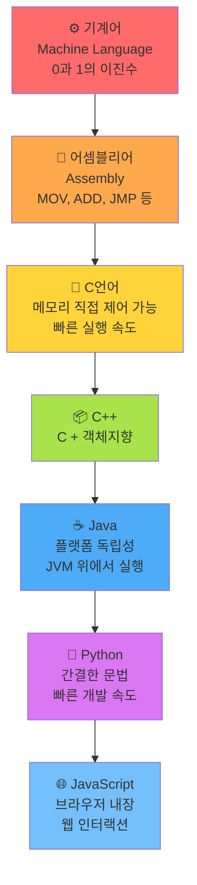
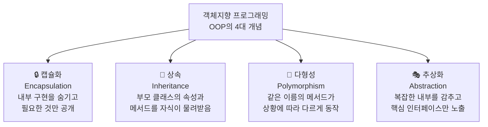
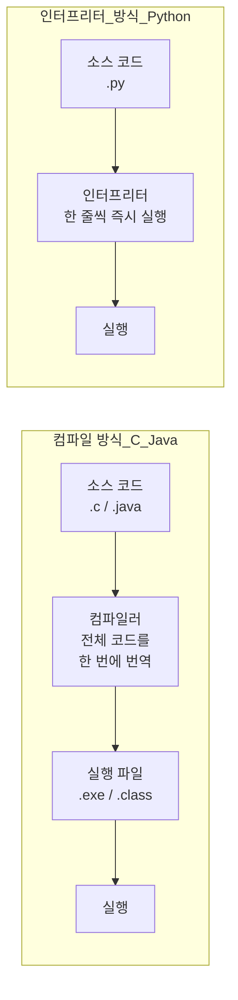
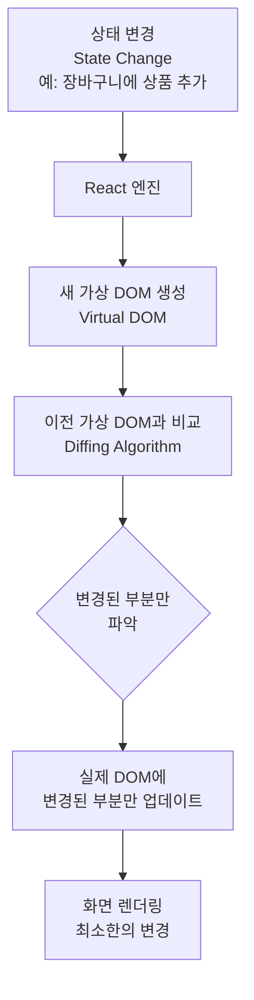
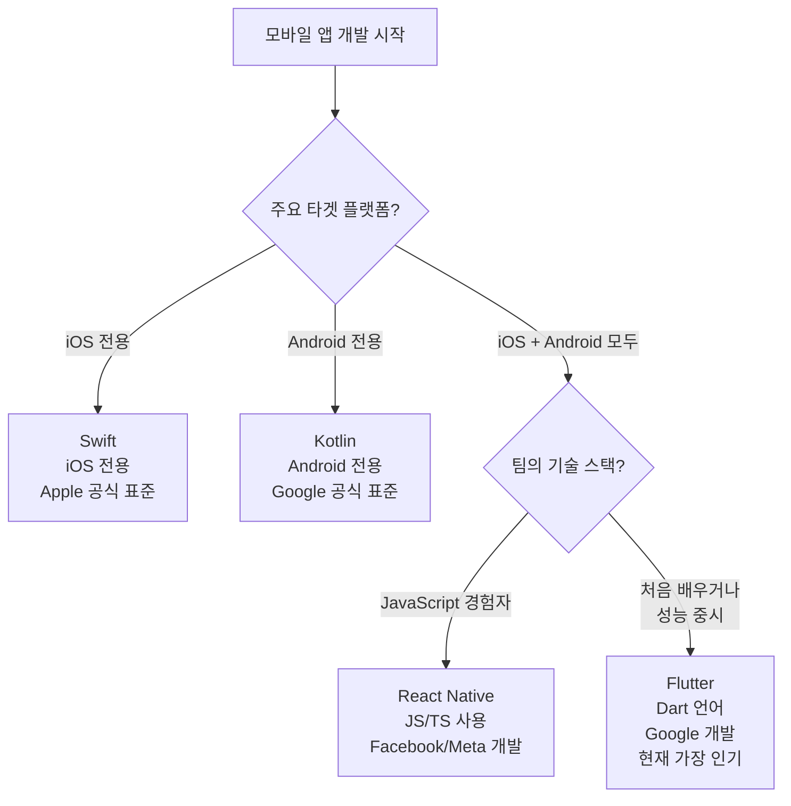
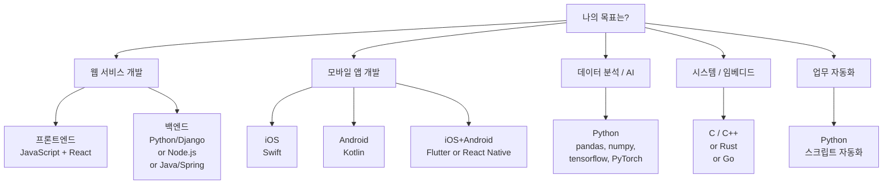

```toc
minLevel: 1
maxLevel: 1
```

# 제3장. 개발 언어 및 프레임워크

> **이 장을 읽기 전에**
>
> 제2장에서 소프트웨어가 웹·앱·하이브리드로 나뉘고, 프론트엔드와 백엔드 역할이 구분된다는 것을 배웠습니다.  
> 이 장에서는 실제로 그 소프트웨어를 만드는 도구인 **프로그래밍 언어**와 **프레임워크**를 깊이 살펴봅니다.  
> **전제 지식:** 제1장·제2장 내용 이해. 특별한 코딩 경험 불필요.

---

## 3.1 C언어와 C++ — 모든 언어의 조상

### 0) 연결 고리 (Bridge)

제2장에서 프론트엔드와 백엔드 개발에 각각 다른 언어가 쓰인다는 것을 확인했습니다.  
그런데 "왜 언어가 이렇게 많아졌을까?"를 이해하려면, 모든 현대 언어의 뿌리인 C언어부터 시작해야 합니다.  
C언어를 이해하면 이후 등장하는 Python, Java, JavaScript가 왜 그런 모습을 하게 되었는지 맥락이 생깁니다.

---

### 1) 개념 정의 및 필요성

#### ✅ C언어란 무엇인가?

**C언어(C Language)**는 1972년 벨 연구소(Bell Labs)의 데니스 리치(Dennis Ritchie)가 개발한 프로그래밍 언어입니다.  
원래 유닉스(Unix) 운영체제를 만들기 위해 설계되었으며, 오늘날 대부분의 운영체제·임베디드 시스템·하드웨어 드라이버의 기반이 되는 언어입니다.

```
[C언어의 역사적 위치]

  1950년대: 어셈블리 언어(Assembly)
    → 기계어에 가까운 저수준 언어. 인간이 읽기 매우 어려움.

  1972년: C언어 등장
    → 어셈블리보다 읽기 쉽지만, 기계어에 가까운 성능 유지
    → "고급 언어의 가독성 + 저수준 언어의 성능"이라는 혁신

  1983년: C++ 등장 (C의 확장)
    → C에 객체지향(OOP) 개념 추가

  이후: C 기반으로 수십 개의 언어 파생
    → Java, Python, JavaScript, Go, Rust 모두 C의 영향을 받음
```

#### ✅ 왜 여전히 중요한가?

오늘날 C언어는 다음 분야에서 여전히 핵심으로 사용됩니다.

| 분야 | 이유 |
|------|------|
| 운영체제 (Linux, Windows 커널) | 하드웨어를 직접 제어해야 하므로 성능이 최우선 |
| 임베디드 시스템 (세탁기, 자동차 ECU) | 메모리가 극히 제한된 환경에서 최소 자원 사용 |
| 게임 엔진 (Unreal Engine 코어) | 초당 수백만 번의 연산이 필요한 고성능 환경 |
| 데이터베이스 (MySQL, SQLite 내부) | 빠른 입출력 처리가 핵심 |

> 📌 **NOTE:** Python, JavaScript 같은 고수준 언어들도 내부적으로는 C 또는 C++로 구현되어 있습니다. Python 인터프리터(CPython) 자체가 C로 작성되어 있습니다.

---

### 2) 핵심 원리 및 구조

#### ✅ 저수준 언어 vs 고수준 언어

언어는 컴퓨터(기계)에 얼마나 가까운가에 따라 분류됩니다.



- **저수준(Low-level):** 기계에 가까움. 빠르지만 작성이 어렵고 코드가 길다.
- **고수준(High-level):** 인간에 가까움. 읽기 쉽고 빠르게 작성되지만 실행 속도는 상대적으로 느리다.

C언어는 이 스펙트럼에서 중간에 위치하며, **"시스템 프로그래밍 언어"**로 분류됩니다.

---

#### ✅ C언어의 핵심 특성: 메모리 직접 제어

C언어가 다른 언어와 결정적으로 다른 점은 **메모리를 개발자가 직접 관리**한다는 것입니다.

```c
/* C언어 (C11 표준 기준) */
/* 주의: 이 코드는 개념 이해용이며, 실제 실행 환경(gcc, clang)이 필요합니다 */

#include <stdio.h>   /* 표준 입출력 라이브러리 */
#include <stdlib.h>  /* 메모리 할당 함수가 포함된 라이브러리 */

int main() {
    /* 메모리 10개(int 크기 × 10)를 직접 할당 */
    /* malloc: memory allocation의 약자 */
    int *numbers = (int *)malloc(10 * sizeof(int));

    /* 메모리 할당 실패 시 NULL 반환 — 반드시 검사해야 함 */
    if (numbers == NULL) {
        printf("메모리 할당 실패\n");
        return 1;  /* 비정상 종료 */
    }

    /* 할당된 메모리에 값 저장 */
    for (int i = 0; i < 10; i++) {
        numbers[i] = i * i;  /* 0, 1, 4, 9, 16, 25, 36, 49, 64, 81 */
    }

    /* 결과 출력 */
    for (int i = 0; i < 10; i++) {
        printf("numbers[%d] = %d\n", i, numbers[i]);
    }

    /* ⚠️ 반드시 메모리를 직접 해제해야 함 — 안 하면 메모리 누수 발생 */
    free(numbers);
    numbers = NULL;  /* 해제 후 포인터를 NULL로 초기화 (안전 관행) */

    return 0;  /* 정상 종료 */
}
```

**실행 결과:**
```
numbers[0] = 0
numbers[1] = 1
numbers[2] = 4
numbers[3] = 9
numbers[4] = 16
...
numbers[9] = 81
```

> **WARNING:** C언어에서 `malloc()`으로 할당한 메모리를 `free()`로 해제하지 않으면 **메모리 누수(Memory Leak)**가 발생합니다. 서버처럼 장시간 실행되는 프로그램에서는 메모리가 계속 쌓여 결국 시스템이 멈춥니다. 이 문제를 해결하기 위해 Java, Python 등 고수준 언어는 **가비지 컬렉터(Garbage Collector)**가 자동으로 메모리를 관리합니다.

---

#### ✅ C++와 객체지향 프로그래밍 (OOP)

**C++(C Plus Plus)**는 1983년 비야네 스트로우스트룹(Bjarne Stroustrup)이 C에 **객체지향 프로그래밍(Object-Oriented Programming, OOP)** 개념을 추가해 만든 언어입니다.

**객체지향이란 무엇인가?**

현실 세계를 "사물(객체)"로 모델링해서 프로그래밍하는 방식입니다.

```
[비유: 자동차 공장]

  기존 방식(절차적 프로그래밍):
    "1. 바퀴를 만든다 → 2. 엔진을 만든다 → 3. 차체를 만든다 → 4. 조립한다"
    모든 것이 순서대로 나열된 명령어의 집합

  객체지향 방식:
    "자동차(Car)라는 설계도(클래스)를 정의한다"
    → 자동차는 색상, 속도, 연료량이라는 속성(Attribute)을 가진다
    → 자동차는 출발, 정지, 주유라는 행동(Method)을 할 수 있다
    → 이 설계도로 여러 자동차(객체, Object)를 찍어낸다
```

```cpp
// C++ (C++17 표준 기준)
// 자동차 클래스를 정의하는 예제

#include <iostream>  // 입출력 라이브러리
#include <string>    // 문자열 라이브러리

// 자동차 클래스(설계도) 정의
class Car {
private:  // 외부에서 직접 접근 불가 (캡슐화)
    std::string brand;   // 브랜드
    int speed;           // 현재 속도 (km/h)
    double fuel;         // 현재 연료량 (리터)

public:  // 외부에서 접근 가능
    // 생성자: 객체 생성 시 초기값 설정
    Car(std::string carBrand, double initialFuel) {
        brand = carBrand;
        speed = 0;           // 처음엔 정지 상태
        fuel = initialFuel;
    }

    // 출발 메서드
    void accelerate(int amount) {
        if (fuel <= 0) {
            std::cout << brand << ": 연료가 없습니다. 주유가 필요합니다." << std::endl;
            return;
        }
        speed += amount;
        fuel -= amount * 0.1;  // 가속할수록 연료 소모
        std::cout << brand << " 가속: 현재 속도 " << speed << "km/h, 연료 " << fuel << "L" << std::endl;
    }

    // 정지 메서드
    void brake() {
        speed = 0;
        std::cout << brand << " 정지." << std::endl;
    }

    // 상태 출력 메서드
    void printStatus() {
        std::cout << "=== " << brand << " 상태 ===" << std::endl;
        std::cout << "속도: " << speed << " km/h" << std::endl;
        std::cout << "연료: " << fuel << " L" << std::endl;
    }
};

int main() {
    // 설계도(Car 클래스)로 실제 자동차 객체 2개 생성
    Car hyundai("현대 아이오닉6", 50.0);
    Car kia("기아 EV6", 30.0);

    hyundai.accelerate(60);  // 현대 차 가속
    hyundai.accelerate(40);  // 추가 가속
    kia.accelerate(80);      // 기아 차 가속

    hyundai.printStatus();
    kia.printStatus();

    hyundai.brake();

    return 0;
}
```

**실행 결과:**
```
현대 아이오닉6 가속: 현재 속도 60km/h, 연료 44L
현대 아이오닉6 가속: 현재 속도 100km/h, 연료 40L
기아 EV6 가속: 현재 속도 80km/h, 연료 22L
=== 현대 아이오닉6 상태 ===
속도: 100 km/h
연료: 40 L
=== 기아 EV6 상태 ===
속도: 80 km/h
연료: 22 L
현대 아이오닉6 정지.
```

#### ✅ OOP의 4대 핵심 개념



> 📌 **NOTE:** OOP는 C++만의 개념이 아닙니다. Java, Python, JavaScript, Swift, Kotlin 모두 OOP를 지원합니다. C++가 최초로 대중화한 이 개념은 현대 프로그래밍의 기본 패러다임이 되었습니다.

---

### 3) 코드 예제 및 실행 환경

OOP의 **상속(Inheritance)** 개념을 Python으로 이해해 보겠습니다.  
(Python이 C++보다 문법이 간결해서 개념 전달에 유리합니다.)

```python
# Python 3.x 기준 — OOP 상속 개념 예제

# 부모 클래스(Parent Class): 모든 동물의 공통 속성과 행동
class Animal:
    def __init__(self, name: str, sound: str):
        self.name = name    # 이름
        self.sound = sound  # 울음소리

    def speak(self) -> str:
        """동물이 소리를 내는 메서드"""
        return f"{self.name}이(가) '{self.sound}' 하고 웁니다."

    def introduce(self) -> str:
        """자기소개 메서드"""
        return f"저는 {self.name}입니다."


# 자식 클래스(Child Class): Animal을 상속받은 개
class Dog(Animal):
    def __init__(self, name: str):
        # 부모 클래스의 __init__을 호출 (sound는 '멍멍'으로 고정)
        super().__init__(name, "멍멍")
        self.tricks = []  # 개만 가지는 추가 속성: 익힌 기술 목록

    def learn_trick(self, trick: str):
        """새로운 기술 익히기 — Dog 클래스만의 메서드"""
        self.tricks.append(trick)
        print(f"{self.name}이(가) '{trick}' 기술을 배웠습니다!")

    def show_tricks(self) -> str:
        if not self.tricks:
            return f"{self.name}은(는) 아직 배운 기술이 없습니다."
        return f"{self.name}의 기술 목록: {', '.join(self.tricks)}"


# 자식 클래스: Animal을 상속받은 고양이
class Cat(Animal):
    def __init__(self, name: str):
        super().__init__(name, "야옹")
        self.indoor = True  # 고양이만 가지는 추가 속성: 실내 고양이 여부

    # 부모의 speak() 메서드를 재정의(Override) — 다형성 적용
    def speak(self) -> str:
        return f"{self.name}이(가) 우아하게 '{self.sound}' 하고 웁니다."


# ─── 실행 ───────────────────────────────────────────────

# 객체 생성
my_dog = Dog("초코")
my_cat = Cat("나비")

# 공통 메서드 사용 (Animal에서 상속)
print(my_dog.introduce())   # 부모 메서드 그대로 사용
print(my_cat.introduce())

# speak() — 같은 이름이지만 Dog는 기본, Cat은 재정의된 버전 사용 (다형성)
print(my_dog.speak())
print(my_cat.speak())

# Dog만의 메서드
my_dog.learn_trick("앉아")
my_dog.learn_trick("손 내밀기")
my_dog.learn_trick("굴러")
print(my_dog.show_tricks())
```

**실행 결과:**
```
저는 초코입니다.
저는 나비입니다.
초코이(가) '멍멍' 하고 웁니다.
나비이(가) 우아하게 '야옹' 하고 웁니다.
초코이(가) '앉아' 기술을 배웠습니다!
초코이(가) '손 내밀기' 기술을 배웠습니다!
초코이(가) '굴러' 기술을 배웠습니다!
초코의 기술 목록: 앉아, 손 내밀기, 굴러
```

---

### 4) 실무 시나리오 (Best Practice)

#### ✅ C/C++가 현업에서 실제로 쓰이는 곳

| 분야 | 대표 제품/기술 | C/C++ 사용 이유 |
|------|--------------|----------------|
| 운영체제 | Linux 커널, Windows NT 커널 | 하드웨어 직접 제어, 최소 오버헤드 |
| 게임 엔진 | Unreal Engine, Unity 일부 | 실시간 60fps+ 렌더링에 필요한 성능 |
| 자동차 | 테슬라 FSD 시스템 일부, 현대 ECU | 수십 ms 이내 반응 필요 (안전 필수) |
| 브라우저 | Chrome(Chromium), Firefox | 수백만 명이 동시 사용하는 렌더링 엔진 |
| 데이터베이스 | MySQL, PostgreSQL, SQLite | 초당 수만 건의 입출력 처리 |

#### ⚠️ 안티 패턴

- **C/C++로 웹 서비스 백엔드 개발하기:** 이론적으로는 가능하지만, 개발 속도가 극히 느리고 유지보수가 어렵습니다. 웹 서비스 백엔드는 Python, Java, Node.js가 압도적으로 생산적입니다.
- **"C를 모르면 진짜 개발자가 아니다"는 사고:** 목적에 맞는 언어를 선택하는 것이 올바른 판단입니다. 웹 개발자가 C를 반드시 알아야 할 이유는 없습니다.

---

### 5) 트러블슈팅 & 주의사항

#### ❓ "C언어를 꼭 배워야 할까요?"

**현실적 답변:**
- **웹/앱 개발자 목표:** 직접 배울 필요는 없으나, 포인터·메모리·스택·힙 개념은 이해해두면 디버깅에 도움이 됩니다.
- **시스템 프로그래밍, 임베디드, 게임 개발 목표:** 필수입니다.
- **CS 기초 이해 목적:** C 코드를 읽을 수 있는 수준이면 충분합니다.

---

### 6) 한 줄 요약

> 💡 **Key Takeaway:**  
> C/C++는 "컴퓨터와 가장 가까운 언어"로, 성능이 최우선인 분야에서 여전히 핵심이며,  
> C++가 도입한 **객체지향 프로그래밍(OOP)**은 이후 등장한 거의 모든 언어의 설계 철학이 되었다.

---

## 3.2 Python — 왜 20년이 지나도 살아남는가?

### 0) 연결 고리 (Bridge)

3.1절에서 C/C++가 성능 중심의 저수준 언어라는 것을 확인했습니다.  
그렇다면 반대로 "성능보다 개발 속도"를 우선시하는 언어는 무엇일까요?  
그 자리에서 20년 이상 독보적인 위치를 차지하고 있는 언어가 바로 **Python**입니다.

---

### 1) 개념 정의 및 필요성

**Python**은 1991년 네덜란드 개발자 귀도 반 로섬(Guido van Rossum)이 만든 인터프리터 방식의 고수준 프로그래밍 언어입니다.  
이름의 유래는 영국 코미디 그룹 "몬티 파이선(Monty Python)"에서 따왔습니다.

**Python의 설계 철학:**

```python
# Python의 설계 철학 "The Zen of Python"을 확인하는 코드
# Python 인터프리터에서 실행 가능

import this
```

핵심 철학을 요약하면 다음과 같습니다.

```
"아름다운 것이 추한 것보다 낫다."
"명시적인 것이 암묵적인 것보다 낫다."
"단순한 것이 복잡한 것보다 낫다."
"가독성이 중요하다."
```

이 철학이 Python의 모든 문법 결정에 반영되어 있습니다.

---

### 2) 핵심 원리 및 구조

#### ✅ Python이 20년 이상 살아남는 5가지 이유

**이유 1: 압도적인 문법 간결성**

같은 기능을 구현할 때 코드 길이 차이를 비교해 보겠습니다.

```java
// Java 17 기준 — 1부터 10까지 짝수를 골라 제곱하여 출력
import java.util.Arrays;
import java.util.List;
import java.util.stream.Collectors;
import java.util.stream.IntStream;

public class EvenSquares {
    public static void main(String[] args) {
        List<Integer> result = IntStream.rangeClosed(1, 10)
            .filter(n -> n % 2 == 0)
            .map(n -> n * n)
            .boxed()
            .collect(Collectors.toList());
        System.out.println(result);
    }
}
// 출력: [4, 16, 36, 64, 100]
```

```python
# Python 3.x 기준 — 동일한 기능, 단 한 줄
result = [n ** 2 for n in range(1, 11) if n % 2 == 0]
print(result)
# 출력: [4, 16, 36, 64, 100]
```

> 📌 **NOTE:** Python의 리스트 컴프리헨션(List Comprehension)은 `[표현식 for 변수 in 반복가능객체 if 조건]` 구조입니다. Java 17줄 분량의 로직이 Python 1줄로 표현됩니다.

---

**이유 2: 인터프리터 방식 — 즉시 실행 가능**



- **컴파일 방식:** 전체 코드를 한 번에 번역 후 실행. 빠르지만 오류 확인이 느림.
- **인터프리터 방식:** 한 줄씩 즉시 실행. 개발 중 빠른 테스트 가능.

Python은 인터프리터 방식 덕분에 코드를 즉시 실행하고 결과를 확인할 수 있어 **학습 및 실험 속도**가 매우 빠릅니다.

---

**이유 3: 방대한 생태계 — 라이브러리의 보고**

Python은 전 세계 개발자들이 만든 수십만 개의 라이브러리가 **pip** 명령어 하나로 설치됩니다.

```bash
# pip: Python 패키지 관리자 (Package Installer for Python)

pip install pandas       # 데이터 분석 (엑셀 같은 테이블 데이터 처리)
pip install numpy        # 수치 연산 (행렬, 통계 계산)
pip install matplotlib   # 데이터 시각화 (차트, 그래프)
pip install scikit-learn # 머신러닝 알고리즘
pip install tensorflow   # 딥러닝 (Google 개발)
pip install django       # 웹 프레임워크 (백엔드 서버)
pip install flask        # 경량 웹 프레임워크
pip install requests     # HTTP 요청 (API 호출)
pip install selenium     # 웹 자동화 (브라우저 조작)
pip install openpyxl     # 엑셀 파일 처리
```

```
[Python이 강한 분야]

  데이터 분석 / 과학 계산  ████████████████████  최강
  머신러닝 / 딥러닝        ████████████████████  최강
  웹 백엔드 (API 서버)     ████████████░░░░░░░░  강함
  업무 자동화 / 스크립팅   ████████████████████  최강
  웹 크롤링               ████████████████░░░░  매우 강함
  시스템 프로그래밍        ██░░░░░░░░░░░░░░░░░░  약함
  모바일 앱 개발          ░░░░░░░░░░░░░░░░░░░░  거의 불가
  프론트엔드 (웹 브라우저) ░░░░░░░░░░░░░░░░░░░░  불가 (JS가 담당)
```

---

**이유 4: AI/ML 분야의 사실상 표준 언어**

2010년대 이후 인공지능·머신러닝 붐이 일어나면서 Python은 해당 분야의 **표준 언어**가 되었습니다.

```python
# Python 3.x + scikit-learn 기준
# 간단한 머신러닝 모델 학습 및 예측 예제

from sklearn.linear_model import LinearRegression  # 선형 회귀 모델
import numpy as np

# 학습 데이터: 공부 시간(시간) vs 시험 점수
study_hours = np.array([[1], [2], [3], [4], [5], [6], [7], [8]])
test_scores = np.array([40, 50, 55, 65, 70, 78, 85, 92])

# 모델 생성 및 학습
model = LinearRegression()
model.fit(study_hours, test_scores)  # 패턴 학습

# 예측: 9시간 공부하면 몇 점?
predicted_score = model.predict([[9]])
print(f"9시간 공부 시 예상 점수: {predicted_score[0]:.1f}점")

# 모델의 기울기와 절편 확인
print(f"점수 증가율: 1시간당 약 {model.coef_[0]:.1f}점 향상")
print(f"기저 점수: {model.intercept_:.1f}점")
```

**실행 결과:**
```
9시간 공부 시 예상 점수: 97.3점
점수 증가율: 1시간당 약 7.3점 향상
기저 점수: 33.4점
```

> 📌 **NOTE:** 이 코드는 머신러닝의 "선형 회귀(Linear Regression)"를 단 6줄로 구현합니다. C++로 같은 알고리즘을 구현하면 수백 줄이 필요합니다. Python의 라이브러리 생태계가 AI 분야에서 Python의 위상을 결정적으로 높인 이유입니다.

---

**이유 5: 업무 자동화의 최적 도구**

```python
# Python 3.x + openpyxl 기준
# 실무 자동화 예제: 여러 엑셀 파일의 합계를 자동으로 계산

import openpyxl  # pip install openpyxl
import os

def summarize_sales_reports(folder_path: str) -> dict:
    """
    지정된 폴더의 모든 Excel 파일에서 판매량을 합산합니다.

    Args:
        folder_path (str): Excel 파일들이 있는 폴더 경로

    Returns:
        dict: 상품별 총 판매량
    """
    total_sales = {}  # 상품별 합계를 저장할 딕셔너리

    # 폴더의 모든 .xlsx 파일 순회
    for filename in os.listdir(folder_path):
        if not filename.endswith(".xlsx"):
            continue  # xlsx 파일이 아니면 건너뜀

        file_path = os.path.join(folder_path, filename)
        workbook = openpyxl.load_workbook(file_path)
        sheet = workbook.active  # 첫 번째 시트 선택

        print(f"처리 중: {filename}")

        # 2행부터 데이터 읽기 (1행은 헤더라고 가정)
        for row in sheet.iter_rows(min_row=2, values_only=True):
            product_name = row[0]  # A열: 상품명
            quantity = row[1]      # B열: 판매량

            if product_name and quantity:
                # 딕셔너리에 누적 합산
                total_sales[product_name] = total_sales.get(product_name, 0) + quantity

    return total_sales

# 사용 예시 (실제 폴더 경로로 변경 필요)
# sales_data = summarize_sales_reports("./sales_reports/")
# for product, total in sorted(sales_data.items(), key=lambda x: x[1], reverse=True):
#     print(f"{product}: 총 {total:,}개 판매")
```

---

#### ✅ Python의 한계 — 솔직하게 말하면

| 한계 | 설명 | 대안 |
|------|------|------|
| **느린 실행 속도** | GIL(전역 인터프리터 잠금) 때문에 멀티스레딩 성능 제한 | 성능 필요 시 C/C++ 확장 또는 Go, Rust 사용 |
| **모바일 앱 개발 불가** | iOS, Android 네이티브 개발 불가 | Swift, Kotlin, Flutter |
| **웹 프론트엔드 불가** | 브라우저는 JavaScript만 실행 | JavaScript, TypeScript |
| **타입 오류 런타임 발생** | 정적 타입 언어에 비해 오류가 실행 중 발생 | 타입 힌트(Type Hint) + mypy로 보완 |

> 📌 **NOTE:** Python의 속도 한계는 분야에 따라 의미가 다릅니다. 웹 API 서버나 데이터 분석에서는 Python의 속도가 충분합니다. 초당 수백만 건의 트랜잭션을 처리해야 하는 금융 거래 시스템이나 게임 서버에서는 다른 언어를 고려합니다.

---

### 3) 코드 예제 및 실행 환경

Python의 핵심 문법을 한 파일로 정리합니다.

```python
# Python 3.10+ 기준 — 핵심 문법 종합 예제
# 실행: python example.py

# ──────────────────────────────────────────
# 1. 변수와 자료형 (타입 명시 없이 자동 추론)
# ──────────────────────────────────────────
name: str = "김철수"          # 문자열 (type hint 사용)
age: int = 28                 # 정수
height: float = 175.5         # 실수
is_developer: bool = True     # 불리언
skills: list = ["Python", "SQL", "Docker"]  # 리스트 (순서 있음, 수정 가능)
profile: dict = {             # 딕셔너리 (키-값 쌍)
    "name": name,
    "age": age,
    "skills": skills
}

print(f"이름: {name}, 나이: {age}세")  # f-string: 변수를 문자열 안에 삽입


# ──────────────────────────────────────────
# 2. 조건문
# ──────────────────────────────────────────
def evaluate_developer_level(years_of_experience: int) -> str:
    """경력 연차에 따라 개발자 레벨을 반환합니다."""
    if years_of_experience < 1:
        return "인턴"
    elif years_of_experience < 3:
        return "주니어"
    elif years_of_experience < 7:
        return "미들"
    else:
        return "시니어"

print(evaluate_developer_level(2))   # 주니어
print(evaluate_developer_level(10))  # 시니어


# ──────────────────────────────────────────
# 3. 반복문
# ──────────────────────────────────────────

# for문: 리스트의 각 요소를 순회
print("\n보유 기술:")
for index, skill in enumerate(skills, start=1):  # enumerate: 인덱스와 값을 동시에
    print(f"  {index}. {skill}")

# while문: 조건이 참인 동안 반복
attempt = 0
max_attempts = 3
while attempt < max_attempts:
    attempt += 1
    print(f"로그인 시도 {attempt}/{max_attempts}")
    if attempt == 2:
        print("  → 로그인 성공!")
        break  # 루프 즉시 종료


# ──────────────────────────────────────────
# 4. 함수 — 기본값 파라미터 & 타입 힌트
# ──────────────────────────────────────────
def calculate_salary(
    base_salary: int,
    bonus_rate: float = 0.1,   # 기본값: 10% 보너스
    tax_rate: float = 0.033    # 기본값: 3.3% 세금
) -> dict:
    """
    세후 실수령액과 보너스를 계산합니다.

    Args:
        base_salary: 기본급 (원)
        bonus_rate:  보너스 비율 (기본 10%)
        tax_rate:    세율 (기본 3.3%)

    Returns:
        dict: 보너스, 세금, 실수령액 포함
    """
    bonus = int(base_salary * bonus_rate)
    tax = int((base_salary + bonus) * tax_rate)
    net_salary = base_salary + bonus - tax

    return {
        "기본급": base_salary,
        "보너스": bonus,
        "세금": tax,
        "실수령액": net_salary
    }

result = calculate_salary(4_000_000)  # 기본급 400만원
for key, value in result.items():
    print(f"  {key}: {value:,}원")


# ──────────────────────────────────────────
# 5. 예외 처리 (오류가 발생해도 프로그램이 중단되지 않도록)
# ──────────────────────────────────────────
def safe_divide(dividend: float, divisor: float) -> float | None:
    """0으로 나누기를 안전하게 처리합니다."""
    try:
        result = dividend / divisor
        return result
    except ZeroDivisionError:
        print("오류: 0으로 나눌 수 없습니다.")
        return None
    finally:
        # finally 블록은 예외 발생 여부와 상관없이 항상 실행
        print("나눗셈 연산 완료.")

print(safe_divide(10, 2))   # 5.0
print(safe_divide(10, 0))   # 오류 메시지 출력 후 None 반환
```

**실행 결과:**
```
이름: 김철수, 나이: 28세
주니어
시니어

보유 기술:
  1. Python
  2. SQL
  3. Docker
로그인 시도 1/3
로그인 시도 2/3
  → 로그인 성공!
  기본급: 4,000,000원
  보너스: 400,000원
  세금: 145,200원
  실수령액: 4,254,800원
나눗셈 연산 완료.
5.0
오류: 0으로 나눌 수 없습니다.
나눗셈 연산 완료.
None
```

---

### 4) 실무 시나리오 (Best Practice)

#### ✅ Python이 실무에서 사용되는 대표 사례

**사례 1 — 데이터 파이프라인 (Data Pipeline)**
```
원천 데이터 수집 (pandas로 CSV/Excel 읽기)
→ 데이터 정제 (결측값 처리, 형식 통일)
→ 집계 및 분석 (groupby, pivot_table)
→ 시각화 (matplotlib, seaborn)
→ 리포트 자동 생성 (openpyxl로 Excel 출력)
```

**사례 2 — REST API 서버 (Django REST Framework)**
```python
# Django REST Framework 기준 (개념 코드)
# 상품 목록을 반환하는 API 엔드포인트

from rest_framework.decorators import api_view
from rest_framework.response import Response
from .models import Product
from .serializers import ProductSerializer

@api_view(["GET"])
def product_list(request):
    """
    GET /api/products/
    전체 상품 목록을 JSON 형식으로 반환합니다.
    """
    products = Product.objects.all()            # DB에서 전체 상품 조회
    serializer = ProductSerializer(products, many=True)  # 객체를 JSON으로 변환
    return Response(serializer.data)            # JSON 응답 반환
```

#### ⚠️ 안티 패턴

- **print()로만 디버깅하기:** 복잡한 코드에서 print() 디버깅은 한계가 있습니다. Python 내장 `pdb` 또는 IDE의 디버거를 사용하는 것을 권장합니다.
- **전역 변수 남발:** 함수 밖에서 전역 변수를 수정하면 코드 흐름 파악이 어려워집니다. 함수의 파라미터와 반환값으로 데이터를 명시적으로 전달하세요.

---

### 5) 트러블슈팅 & 주의사항

#### ❓ "Python 2와 Python 3의 차이가 있나요?"

**사실:** Python 2는 2020년 1월 1일부로 공식 지원이 종료되었습니다. 현재 새로운 프로젝트는 반드시 **Python 3**를 사용해야 합니다. Python 2 코드를 만나면 레거시(구형) 시스템이라고 보면 됩니다.

> **WARNING:** 일부 오래된 강의나 도서가 Python 2 문법을 사용합니다. `print "Hello"`처럼 괄호 없이 print를 사용하면 Python 2 코드입니다. Python 3에서는 반드시 `print("Hello")`처럼 괄호를 사용해야 합니다.

#### ❓ "IndentationError가 발생했습니다"

Python은 **들여쓰기(Indentation)로 코드 블록을 구분**합니다. 탭과 스페이스를 혼용하면 이 오류가 발생합니다.

```python
# ❌ 잘못된 예: 탭과 스페이스 혼용
def greet():
    print("안녕하세요")  # 스페이스 4개
	print("반갑습니다")   # 탭 1개 → IndentationError!

# ✅ 올바른 예: 스페이스 4개로 통일 (PEP 8 표준)
def greet():
    print("안녕하세요")  # 스페이스 4개
    print("반갑습니다")  # 스페이스 4개
```

---

### 6) 한 줄 요약

> 💡 **Key Takeaway:**  
> Python이 20년 이상 사랑받는 이유는 **간결한 문법, 방대한 라이브러리, AI/데이터 분야의 생태계 지배력** 때문이며,  
> 웹 백엔드·데이터 분석·업무 자동화 등 다목적으로 사용할 수 있는 현실적인 첫 번째 언어다.

---

## 3.3 프론트엔드 언어와 React — 브라우저가 이해하는 유일한 언어

### 0) 연결 고리 (Bridge)

3.2절에서 Python이 서버 사이드(백엔드)에서 강력한 언어임을 확인했습니다.  
그러나 Python은 웹 브라우저 위에서는 실행되지 않습니다.  
브라우저는 오직 **JavaScript**만을 이해합니다. 이 불변의 사실이 프론트엔드 언어 생태계 전체를 결정합니다.

---

### 1) 개념 정의 및 필요성

**JavaScript(JS)**는 1995년 넷스케이프(Netscape) 브라우저를 위해 개발된 언어입니다.  
브렌던 아이크(Brendan Eich)가 단 10일 만에 초안을 완성했다는 일화가 있습니다.

```
[웹 프론트엔드의 3요소]

  HTML     →  구조 (Structure)    "뼈대"    무엇이 있는가?
  CSS      →  스타일 (Style)      "외모"    어떻게 보이는가?
  JavaScript → 동작 (Behavior)   "근육"    어떻게 움직이는가?
```

JavaScript가 없다면 웹은 정적인 문서 모음에 불과합니다.  
버튼 클릭, 폼 입력 검증, 실시간 알림, 지도 드래그 — 모든 인터랙션이 JavaScript로 동작합니다.

---

### 2) 핵심 원리 및 구조

#### ✅ JavaScript의 핵심 특성

**1. 이벤트 기반(Event-Driven) 프로그래밍**

JavaScript는 사용자의 행동(이벤트)에 반응하는 방식으로 동작합니다.

```javascript
// JavaScript (ES2022 기준)
// 이벤트 기반 프로그래밍 예제

// HTML 요소를 JavaScript로 선택
const loginButton = document.getElementById("login-button");
const usernameInput = document.getElementById("username");
const passwordInput = document.getElementById("password");
const messageDiv = document.getElementById("message");

// 버튼 클릭 이벤트 등록
// "클릭이 발생하면 이 함수를 실행해라"
loginButton.addEventListener("click", function() {
    const username = usernameInput.value.trim();   // 앞뒤 공백 제거
    const password = passwordInput.value.trim();

    // 입력 검증
    if (!username || !password) {
        messageDiv.textContent = "아이디와 비밀번호를 모두 입력해 주세요.";
        messageDiv.style.color = "red";
        return;
    }

    // 실제 서비스에서는 여기서 서버에 로그인 요청을 보냄
    messageDiv.textContent = `${username}님, 환영합니다!`;
    messageDiv.style.color = "green";
});

// 입력 중 실시간 글자 수 표시 이벤트
usernameInput.addEventListener("input", function() {
    console.log(`현재 입력: ${this.value.length}자`);
});
```

---

**2. 비동기(Asynchronous) 처리 — JavaScript의 핵심 개념**

JavaScript는 기본적으로 **단일 스레드(Single Thread)**입니다.  
그러나 서버에 데이터를 요청하고 기다리는 동안 브라우저가 멈추면 안 됩니다.  
이를 해결하는 것이 **비동기 처리**입니다.

```javascript
// JavaScript ES2022 기준 — 비동기 처리 3단계 진화

// ── 1단계: 콜백(Callback) — 오래된 방식 ─────────────────
// "이 작업이 끝나면 이 함수를 호출해라"
function fetchUserDataOld(userId, callback) {
    setTimeout(function() {          // 서버 응답을 1초 지연으로 시뮬레이션
        const user = { id: userId, name: "김철수" };
        callback(null, user);        // 성공 시 콜백 호출
    }, 1000);
}

fetchUserDataOld(1, function(error, user) {
    if (error) {
        console.error("오류:", error);
        return;
    }
    console.log("사용자:", user.name);
    // 또 다른 비동기 작업이 필요하면 콜백 안에 콜백... → "콜백 지옥" 발생
});


// ── 2단계: Promise — 개선된 방식 ───────────────────────
function fetchUserData(userId) {
    return new Promise((resolve, reject) => {
        setTimeout(() => {
            const user = { id: userId, name: "이영희" };
            resolve(user);   // 성공 시 resolve 호출
            // 실패 시 reject(new Error("사용자 없음")) 호출
        }, 1000);
    });
}

fetchUserData(2)
    .then(user => {
        console.log("사용자:", user.name);
        return fetchUserData(3);     // Promise 체이닝: 순서대로 실행
    })
    .then(nextUser => console.log("다음 사용자:", nextUser.name))
    .catch(error => console.error("오류:", error));


// ── 3단계: async/await — 현대적이고 권장하는 방식 ────────
// Promise를 동기 코드처럼 읽기 쉽게 작성
async function loadUserProfile(userId) {
    try {
        // await: Promise가 완료될 때까지 기다림 (화면은 멈추지 않음)
        const user = await fetchUserData(userId);
        console.log(`사용자 이름: ${user.name}`);

        // 연속 비동기 작업도 순서대로 읽힘
        const orders = await fetchUserOrders(user.id);  // 주문 내역 조회
        console.log(`주문 수: ${orders.length}건`);

    } catch (error) {
        // 모든 비동기 오류를 한 곳에서 처리
        console.error("데이터 로드 실패:", error.message);
    }
}
```

> 📌 **NOTE:** `async/await`는 현재 가장 권장되는 비동기 처리 방식입니다. 코드가 위에서 아래로 순서대로 읽히므로 가독성이 높습니다. Promise와 async/await는 뒤에서 더 자세히 다룹니다(제4장 4.5절).

---

#### ✅ React — 왜 광범위하게 쓰이는가?

**React**는 2013년 Facebook(현 Meta)이 개발하여 오픈소스로 공개한 JavaScript **UI 라이브러리**입니다.

**React 등장 전의 문제:**

```
[React 등장 전 — 전통적인 방식의 문제]

  서버에서 HTML 완성본을 통째로 전송
    → 사용자가 버튼 하나를 클릭해도 페이지 전체 새로고침
    → 데이터 변경 시 화면 어느 부분을 업데이트해야 하는지 개발자가 직접 관리
    → 복잡한 UI에서 상태 추적이 극도로 어려움

  예:
  사용자 이름 변경
    → 헤더의 이름, 프로필 카드의 이름, 댓글의 이름 등
    → 여러 곳을 개발자가 일일이 찾아서 업데이트
    → 누락되는 경우 빈번히 발생
```

**React의 해결책 — 컴포넌트(Component)와 가상 DOM(Virtual DOM):**



- **가상 DOM(Virtual DOM):** 실제 화면(DOM)의 복사본을 메모리에 유지. 변경이 생기면 복사본에 먼저 반영 후 실제와 비교하여 달라진 부분만 업데이트.
- **컴포넌트(Component):** UI를 재사용 가능한 독립적인 조각으로 분리.

---

#### ✅ React 컴포넌트 이해하기

```jsx
// React 18 + JSX 기준
// JSX: JavaScript 안에 HTML처럼 보이는 문법을 사용 가능하게 해주는 확장

import { useState } from "react";  // 상태 관리 훅

// ── 자식 컴포넌트: 상품 카드 ──────────────────────────────
// 하나의 상품을 표시하는 재사용 가능한 UI 조각
function ProductCard({ product, onAddToCart }) {
    // product: 부모에서 전달받은 상품 데이터 (props)
    // onAddToCart: 부모에서 전달받은 함수 (props)

    return (
        <div style={{ border: "1px solid #ddd", padding: "16px", margin: "8px", borderRadius: "8px" }}>
            <h3>{product.name}</h3>
            <p style={{ color: "#e44d26", fontWeight: "bold" }}>
                {product.price.toLocaleString()}원
            </p>
            <p>재고: {product.stock}개</p>
            <button
                onClick={() => onAddToCart(product)}   // 클릭 시 부모 함수 실행
                disabled={product.stock === 0}          // 재고 없으면 버튼 비활성화
                style={{ backgroundColor: product.stock === 0 ? "#ccc" : "#007bff", color: "white", padding: "8px 16px", border: "none", borderRadius: "4px", cursor: product.stock === 0 ? "not-allowed" : "pointer" }}
            >
                {product.stock === 0 ? "품절" : "장바구니 담기"}
            </button>
        </div>
    );
}


// ── 부모 컴포넌트: 상품 목록 페이지 ──────────────────────────
function ProductListPage() {
    // useState: 컴포넌트의 상태(State) 관리
    // cartCount: 현재 장바구니 수량 (상태값)
    // setCartCount: 상태를 업데이트하는 함수
    const [cartCount, setCartCount] = useState(0);
    const [notification, setNotification] = useState("");

    // 상품 데이터 (실제 서비스에서는 API로 가져옴)
    const products = [
        { id: 1, name: "무선 마우스", price: 25000, stock: 5 },
        { id: 2, name: "기계식 키보드", price: 89000, stock: 0 },  // 품절
        { id: 3, name: "27인치 모니터", price: 320000, stock: 2 },
    ];

    // 장바구니 담기 핸들러
    function handleAddToCart(product) {
        setCartCount(prevCount => prevCount + 1);  // 이전 값 기반으로 안전하게 증가
        setNotification(`"${product.name}"이(가) 장바구니에 추가되었습니다!`);

        // 3초 후 알림 메시지 제거
        setTimeout(() => setNotification(""), 3000);
    }

    return (
        <div>
            {/* 헤더 */}
            <header style={{ padding: "16px", backgroundColor: "#007bff", color: "white" }}>
                <h1>🛒 쇼핑몰</h1>
                <span>장바구니: {cartCount}개</span>  {/* 상태 변경 시 자동 리렌더링 */}
            </header>

            {/* 알림 메시지 (상태에 따라 조건부 렌더링) */}
            {notification && (
                <div style={{ backgroundColor: "#d4edda", padding: "12px", color: "#155724" }}>
                    {notification}
                </div>
            )}

            {/* 상품 목록: 배열을 컴포넌트로 변환 */}
            <div style={{ display: "flex", flexWrap: "wrap" }}>
                {products.map(product => (
                    <ProductCard
                        key={product.id}               // React가 각 요소를 추적하는 고유 키
                        product={product}              // 상품 데이터 전달
                        onAddToCart={handleAddToCart}  // 함수 전달
                    />
                ))}
            </div>
        </div>
    );
}

export default ProductListPage;
```

> 📌 **NOTE:** React의 핵심은 **"상태(State)가 바뀌면 화면이 자동으로 바뀐다"**는 철학입니다. 개발자는 "어떤 데이터가 변했을 때 화면이 어떻게 보여야 하는가"만 선언하면 됩니다. React가 어느 부분을 어떻게 업데이트할지 알아서 처리합니다.

---

#### ✅ React 이벤트 처리 — 광범위하게 쓰이는 이유

```jsx
// React 18 기준 — 실무에서 자주 쓰이는 이벤트 처리 패턴

import { useState, useEffect } from "react";

function SearchComponent() {
    const [searchTerm, setSearchTerm] = useState("");       // 검색어
    const [results, setResults] = useState([]);             // 검색 결과
    const [isLoading, setIsLoading] = useState(false);      // 로딩 상태

    // useEffect: 특정 값이 변경될 때 자동으로 실행
    // searchTerm이 바뀔 때마다 실행됨
    useEffect(() => {
        if (searchTerm.length < 2) {  // 2자 미만이면 검색 안 함
            setResults([]);
            return;
        }

        // 디바운싱(Debouncing): 타이핑 중 매번 API 호출을 막고
        // 타이핑을 멈춘 후 500ms가 지나면 호출
        const debounceTimer = setTimeout(async () => {
            setIsLoading(true);
            try {
                const response = await fetch(`/api/search?q=${searchTerm}`);
                const data = await response.json();
                setResults(data.results);
            } catch (error) {
                console.error("검색 실패:", error);
            } finally {
                setIsLoading(false);
            }
        }, 500);

        // Cleanup: 다음 useEffect 실행 전 이전 타이머 취소
        return () => clearTimeout(debounceTimer);

    }, [searchTerm]);  // searchTerm이 변경될 때만 실행

    return (
        <div>
            <input
                type="text"
                value={searchTerm}
                onChange={(e) => setSearchTerm(e.target.value)}  // 입력할 때마다 상태 업데이트
                placeholder="검색어를 입력하세요..."
            />
            {isLoading && <p>검색 중...</p>}
            <ul>
                {results.map((item, index) => (
                    <li key={index}>{item.title}</li>
                ))}
            </ul>
        </div>
    );
}
```

---

### 3) 코드 예제 및 실행 환경 — JavaScript 핵심 문법

```javascript
// JavaScript ES2022 기준 — 현대 JS 핵심 문법 정리

// ── 1. 변수 선언 ──────────────────────────────────────────
const MAX_RETRY = 3;         // const: 재할당 불가 (상수)
let currentRetry = 0;        // let: 재할당 가능 (변수)
// var는 현대 JS에서 사용하지 않음 (스코프 문제로 혼란 발생)


// ── 2. 화살표 함수 (Arrow Function) ──────────────────────
// 기존 방식
function squareOld(number) {
    return number * number;
}

// 화살표 함수: 더 간결한 표현 (현대 JS에서 선호)
const square = (number) => number * number;
const squareVerbose = (number) => {  // 로직이 복잡하면 중괄호 사용
    const result = number * number;
    return result;
};

console.log(square(5));  // 25


// ── 3. 구조 분해 할당 (Destructuring) ───────────────────
const user = {
    id: 1,
    name: "홍길동",
    email: "hong@test.com",
    address: { city: "서울", district: "강남구" }
};

// 객체 구조 분해: 필요한 속성만 추출
const { name, email, address: { city } } = user;
console.log(name, email, city);  // 홍길동 hong@test.com 서울

// 배열 구조 분해
const colors = ["빨강", "초록", "파랑"];
const [firstColor, , thirdColor] = colors;  // 두 번째 요소 건너뜀
console.log(firstColor, thirdColor);  // 빨강 파랑


// ── 4. 스프레드 연산자 (Spread Operator: ...) ───────────
const baseSettings = { theme: "light", language: "ko" };
const userSettings = { fontSize: 14, theme: "dark" };  // theme 덮어씀

// 두 객체를 병합 (뒤에 오는 값이 앞을 덮어씀)
const mergedSettings = { ...baseSettings, ...userSettings };
console.log(mergedSettings);
// { theme: 'dark', language: 'ko', fontSize: 14 }

// 배열 복사 및 합치기
const numbers1 = [1, 2, 3];
const numbers2 = [4, 5, 6];
const combined = [...numbers1, ...numbers2];  // [1, 2, 3, 4, 5, 6]


// ── 5. 배열 고차 함수 (실무에서 매우 자주 사용) ───────────
const products = [
    { name: "마우스", price: 25000, category: "주변기기" },
    { name: "키보드", price: 89000, category: "주변기기" },
    { name: "모니터", price: 320000, category: "디스플레이" },
    { name: "마우스패드", price: 15000, category: "주변기기" },
];

// filter: 조건에 맞는 요소만 추출
const peripherals = products.filter(p => p.category === "주변기기");
console.log(`주변기기 수: ${peripherals.length}개`);  // 3개

// map: 각 요소를 변환
const productNames = products.map(p => p.name);
console.log(productNames);  // ['마우스', '키보드', '모니터', '마우스패드']

// reduce: 누적 연산
const totalPrice = products.reduce((sum, p) => sum + p.price, 0);
console.log(`총 가격: ${totalPrice.toLocaleString()}원`);  // 449,000원

// 체이닝: filter + map 연결
const expensiveNames = products
    .filter(p => p.price >= 50000)   // 5만원 이상만
    .map(p => `${p.name}(${p.price.toLocaleString()}원)`);  // 이름+가격 형식으로
console.log(expensiveNames);  // ['키보드(89,000원)', '모니터(320,000원)']
```

---

### 4) 실무 시나리오 (Best Practice)

#### ✅ 프론트엔드 프레임워크 비교

React 외에도 Vue, Angular 등이 있습니다.

| 구분 | React | Vue | Angular |
|------|-------|-----|---------|
| 개발사 | Meta (Facebook) | 커뮤니티 (Evan You) | Google |
| 유형 | UI 라이브러리 | 프레임워크 | 풀 프레임워크 |
| 학습 곡선 | 중간 | 낮음 | 높음 |
| 국내 채용 수요 | ████████████ 매우 많음 | ████████ 많음 | █████ 중간 |
| 적합한 상황 | 대규모·복잡한 SPA | 빠른 학습, 중소 규모 | 대규모 엔터프라이즈 |

> 📌 **TIP:** 한국 취업 시장 기준으로 React 수요가 압도적입니다. 프론트엔드를 처음 배운다면 React를 선택하는 것이 취업에 유리합니다.

---

### 5) 트러블슈팅 & 주의사항

> **WARNING:** JavaScript는 `==`와 `===` 두 종류의 동등 비교 연산자가 있습니다. `==`는 타입을 자동으로 변환하여 비교하므로 예상치 못한 결과가 나옵니다. 반드시 `===`(엄격한 동등 비교)를 사용하세요.

```javascript
// ES2022 기준 — == vs === 함정

console.log(0 == false);    // true  ← 위험: 타입 변환 발생
console.log(0 === false);   // false ← 올바름: 타입까지 비교
console.log("" == false);   // true  ← 위험
console.log("" === false);  // false ← 올바름
console.log(null == undefined);   // true  ← 특수 케이스
console.log(null === undefined);  // false

// ✅ 실무 규칙: 항상 ===를 사용하라
```

---

### 6) 한 줄 요약

> 💡 **Key Takeaway:**  
> JavaScript는 브라우저가 이해하는 유일한 언어이며,  
> React는 UI를 **컴포넌트 단위로 분리**하고 **상태 변화에 따른 자동 렌더링**으로 복잡한 인터페이스를 효율적으로 관리한다.

---

## 3.4 모바일 앱 언어 — iOS와 Android의 세계

### 0) 연결 고리 (Bridge)

3.3절에서 브라우저 위에서 동작하는 웹 프론트엔드 언어를 살펴봤습니다.  
이번에는 스마트폰 운영체제에서 직접 실행되는 **네이티브 모바일 앱** 개발 언어를 살펴봅니다.  
iOS와 Android는 서로 다른 회사(Apple과 Google)가 만든 운영체제로, 각각 다른 언어를 사용합니다.

---

### 1) 개념 정의 및 필요성

```
[모바일 앱 개발 언어 지도]

  iOS (Apple)
    ├── Objective-C   (구형, 1984년 등장)
    └── Swift         (현재 표준, 2014년 Apple 공개)

  Android (Google)
    ├── Java          (2008년~2017년 주력)
    └── Kotlin        (현재 표준, 2017년 Google 공식 채택)

  크로스 플랫폼 (iOS + Android 동시)
    ├── Flutter       (Google, Dart 언어)
    └── React Native  (Meta, JavaScript)
```

---

### 2) 핵심 원리 및 구조

#### ✅ Swift — Apple의 현대적 언어

**Swift**는 2014년 Apple이 Objective-C를 대체하기 위해 공개한 언어입니다.  
안전성(Safety), 속도(Speed), 표현력(Expressiveness)을 핵심 가치로 설계되었습니다.

```swift
// Swift 5.9 기준 — 핵심 문법 예제

import Foundation  // 기본 라이브러리

// ── 1. 타입 안전성 (Type Safety) ─────────────────────
// Swift는 컴파일 시점에 타입 오류를 잡아냄
var userName: String = "김철수"
var userAge: Int = 28
// userAge = "스물여덟"  // 컴파일 오류: String을 Int에 대입 불가

// 타입 추론: 값에서 타입을 자동으로 판단
let greeting = "안녕하세요"  // Swift가 String으로 추론
let piValue = 3.14159         // Double로 추론


// ── 2. 옵셔널 (Optional) — Swift의 핵심 안전 장치 ──────
// 값이 있을 수도, 없을 수도 있는 경우 Optional 타입 사용
// nil: 값이 없음을 나타내는 특별한 값

var middleName: String? = nil  // 중간 이름은 있을 수도 없을 수도 있음

// Optional Binding: 안전하게 값을 꺼내는 방법
if let name = middleName {
    print("중간 이름: \(name)")
} else {
    print("중간 이름이 없습니다.")  // 이 줄이 실행됨
}

// nil 병합 연산자: 값이 없으면 기본값 사용
let displayName = middleName ?? "이름 없음"
print(displayName)  // "이름 없음"


// ── 3. 구조체(Struct)와 클래스(Class) ────────────────
// Swift는 클래스보다 구조체 사용을 권장 (값 타입, 스레드 안전)
struct UserProfile {
    let id: Int               // let: 변경 불가
    var username: String      // var: 변경 가능
    var followersCount: Int

    // 계산 프로퍼티: 저장 없이 계산으로 반환
    var isInfluencer: Bool {
        return followersCount >= 10000
    }

    // 메서드 (mutating: 구조체의 속성을 변경하는 메서드)
    mutating func gainFollower() {
        followersCount += 1
    }
}

var myProfile = UserProfile(id: 1, username: "tech_shin", followersCount: 9999)
myProfile.gainFollower()
print("인플루언서 여부: \(myProfile.isInfluencer)")  // true


// ── 4. 클로저 (Closure) — 이름 없는 함수 ─────────────
// JavaScript의 화살표 함수와 유사한 개념

let numbers = [5, 3, 8, 1, 9, 2, 7]

// sorted: 정렬. 클로저로 정렬 기준 정의
let sortedNumbers = numbers.sorted { $0 < $1 }  // $0, $1: 클로저의 매개변수 단축 표현
print(sortedNumbers)  // [1, 2, 3, 5, 7, 8, 9]

// filter와 map 체이닝
let result = numbers
    .filter { $0 > 4 }        // 4보다 큰 것만
    .map { $0 * $0 }           // 제곱
    .sorted(by: >)             // 내림차순 정렬
print(result)  // [81, 64, 49, 25]
```

---

#### ✅ Kotlin — Android의 현대적 언어

**Kotlin**은 2011년 JetBrains(IntelliJ 개발사)이 만든 언어입니다.  
2017년 Google이 Android 공식 언어로 채택하면서 급속도로 확산되었습니다.  
Java와 100% 호환되면서 문법은 훨씬 간결합니다.

```kotlin
// Kotlin 1.9 기준 — Java와 비교하며 핵심 문법 이해

// ── Java vs Kotlin 비교: 데이터 클래스 ────────────────

// Java 방식 (약 30줄 필요)
// public class User {
//     private final String name;
//     private final int age;
//     public User(String name, int age) { this.name = name; this.age = age; }
//     public String getName() { return name; }
//     public int getAge() { return age; }
//     public boolean equals(Object obj) { ... }  // 10줄 이상
//     public int hashCode() { ... }
//     public String toString() { ... }
// }

// Kotlin 방식: data class 한 줄로 위 모든 기능 자동 생성
data class User(val name: String, val age: Int)

fun main() {
    val user1 = User("김철수", 28)
    val user2 = User("김철수", 28)

    println(user1)              // User(name=김철수, age=28) — toString 자동 생성
    println(user1 == user2)     // true — equals 자동 생성


    // ── Null 안전성 ──────────────────────────────────
    var nonNullName: String = "홍길동"
    // nonNullName = null  // 컴파일 오류: Kotlin은 기본적으로 null 불허

    var nullableName: String? = null  // ?를 붙여야만 null 허용
    println(nullableName?.length)     // Safe Call: null이면 null 반환
    println(nullableName ?: "이름 없음")  // Elvis 연산자: null이면 기본값


    // ── 확장 함수 (Extension Function) ──────────────
    // 기존 클래스에 새 메서드를 추가하는 강력한 기능
    fun String.toKoreanUppercase(): String {
        return this.uppercase().replace("A", "에이").replace("B", "비")
    }

    val email = "abc@test.com"
    // 확장 함수로 String 클래스에 직접 메서드 추가한 것처럼 사용
    // println(email.toKoreanUppercase())


    // ── 코루틴 (Coroutine) — Kotlin의 핵심 비동기 기술 ─
    // JavaScript의 async/await와 유사하지만 더 강력
    // (실제 실행을 위해 kotlinx.coroutines 라이브러리 필요)
    /*
    import kotlinx.coroutines.*

    suspend fun fetchUserData(userId: Int): User {
        delay(1000)  // 1초 대기 (네트워크 요청 시뮬레이션)
        return User("김철수", 28)
    }

    runBlocking {
        val user = fetchUserData(1)  // suspend 함수는 다른 suspend 함수에서 호출
        println("가져온 사용자: $user")
    }
    */

    // ── 스마트 캐스트 ─────────────────────────────────
    val value: Any = "Hello, Kotlin!"  // Any: 모든 타입의 부모

    if (value is String) {
        // is 검사 후 자동으로 String으로 캐스트됨 (스마트 캐스트)
        println("문자열 길이: ${value.length}")  // value를 String으로 사용
    }
}
```

---

#### ✅ Flutter — 단 하나의 코드로 iOS + Android

**Flutter**는 2018년 Google이 공개한 크로스 플랫폼 UI 프레임워크입니다.  
**Dart** 언어를 사용하며, 자체 렌더링 엔진(Skia/Impeller)으로 iOS·Android에서 동일한 UI를 구현합니다.

```dart
// Flutter 3.x + Dart 3 기준
// 간단한 카운터 앱 — Flutter의 기본 구조

import 'package:flutter/material.dart';

// 앱 진입점
void main() {
  runApp(const CounterApp());
}

// 최상위 앱 위젯
class CounterApp extends StatelessWidget {
  const CounterApp({super.key});

  @override
  Widget build(BuildContext context) {
    return MaterialApp(
      title: '카운터 앱',
      theme: ThemeData(colorScheme: ColorScheme.fromSeed(seedColor: Colors.blue)),
      home: const CounterPage(),
    );
  }
}

// 상태를 가지는 위젯 (StatefulWidget)
// 카운터 값이 변하므로 StatefulWidget 사용
class CounterPage extends StatefulWidget {
  const CounterPage({super.key});

  @override
  State<CounterPage> createState() => _CounterPageState();
}

class _CounterPageState extends State<CounterPage> {
  int _count = 0;  // 상태: 카운터 값

  void _increment() {
    setState(() {  // setState: 상태 변경 시 UI 자동 재빌드
      _count++;
    });
  }

  void _decrement() {
    setState(() {
      if (_count > 0) _count--;  // 0 미만으로 내려가지 않도록
    });
  }

  @override
  Widget build(BuildContext context) {
    return Scaffold(
      appBar: AppBar(title: const Text('카운터')),
      body: Center(
        child: Column(
          mainAxisAlignment: MainAxisAlignment.center,
          children: [
            const Text('현재 카운트:', style: TextStyle(fontSize: 18)),
            Text(
              '$_count',
              style: const TextStyle(fontSize: 72, fontWeight: FontWeight.bold),
            ),
            Row(
              mainAxisAlignment: MainAxisAlignment.center,
              children: [
                // 감소 버튼
                FloatingActionButton(
                  onPressed: _decrement,
                  heroTag: "decrement",
                  child: const Icon(Icons.remove),
                ),
                const SizedBox(width: 24),  // 간격
                // 증가 버튼
                FloatingActionButton(
                  onPressed: _increment,
                  heroTag: "increment",
                  child: const Icon(Icons.add),
                ),
              ],
            ),
          ],
        ),
      ),
    );
  }
}
```

---

### 3) 모바일 플랫폼 선택 가이드



---

### 4) 실무 시나리오 (Best Practice)

#### ✅ 국내 채용 시장 기준 모바일 언어 수요 (2024년 기준)

| 언어/프레임워크 | 수요 | 주요 채용 기업 유형 |
|---------------|------|------------------|
| Kotlin (Android) | ████████████ 높음 | 대기업, 중견기업 전반 |
| Swift (iOS) | ████████████ 높음 | 대기업, 중견기업 전반 |
| Flutter | ████████ 증가 중 | 스타트업, 외주 개발 |
| React Native | ██████ 중간 | 스타트업, 웹 개발팀 확장 |

#### ⚠️ 안티 패턴

- **iOS·Android 동시에 네이티브로 시작하기:** 두 플랫폼을 모두 처음부터 네이티브로 배우는 것은 시간이 두 배로 필요합니다. Flutter로 시작해 하나의 언어로 양쪽을 경험한 후, 심화가 필요할 때 네이티브로 전환하는 경로가 효율적입니다.

---

### 5) 트러블슈팅 & 주의사항

#### ❓ "Kotlin과 Java는 뭐가 다른가요?"

Kotlin은 Java의 단점을 해결하기 위해 설계되었습니다.

| 항목 | Java | Kotlin |
|------|------|--------|
| Null 안전성 | NullPointerException 빈번 | 컴파일 시점에 null 오류 방지 |
| 데이터 클래스 | 수십 줄 필요 | data class 한 줄 |
| 코루틴 비동기 | 복잡한 Thread/RxJava | 간결한 coroutine |
| 함수형 프로그래밍 | 제한적 | 완전 지원 |
| Android 지원 | 레거시 코드 많음 | 현재 표준 |

---

### 6) 한 줄 요약

> 💡 **Key Takeaway:**  
> iOS는 Swift, Android는 Kotlin이 현재 표준이며,  
> 빠른 출시와 비용 효율이 중요하다면 Flutter(Dart)로 양쪽을 동시에 개발하는 크로스 플랫폼 전략이 현실적이다.

---

## 3.5 언어 선택 기준과 프레임워크 이해

### 0) 연결 고리 (Bridge)

이 장에서 C/C++, Python, JavaScript/React, Swift/Kotlin/Flutter를 살펴봤습니다.  
마지막으로 가장 실용적인 질문에 답합니다: "**나는 어떤 언어를 선택해야 하는가?**"  
그리고 반복적으로 등장한 "프레임워크"가 정확히 무엇인지 정리합니다.

---

### 1) 개념 정의 및 필요성

#### ✅ 프레임워크(Framework) vs 라이브러리(Library)

개발에 입문하면 "프레임워크"와 "라이브러리"라는 단어가 혼용됩니다.  
두 개념의 차이를 명확히 구분해야 합니다.

```
[비유: 집 짓기]

  라이브러리 = 공구 상자
    → 필요할 때 꺼내 쓰는 도구 모음
    → 개발자가 언제, 어떻게 쓸지 결정
    → 예: Python의 requests(HTTP 요청), numpy(수치 연산)

  프레임워크 = 건물의 뼈대 + 공사 규칙
    → 이미 정해진 구조에 맞춰 개발자가 코드를 채워 넣음
    → 프레임워크가 흐름을 제어하고 개발자의 코드를 호출
    → 예: Django(웹 프레임워크), Flutter(UI 프레임워크)
```

핵심 차이는 **제어의 주체(Inversion of Control)**입니다.

```
라이브러리: 개발자의 코드 → 라이브러리 호출
프레임워크: 프레임워크 → 개발자의 코드 호출  (제어권이 역전됨)
```

---

### 2) 핵심 원리 및 구조

#### ✅ 언어 선택 기준 — 목적별 가이드



---

#### ✅ 목적별 추천 첫 번째 언어 (초보자 기준)

| 목표 | 첫 번째 언어 | 이유 |
|------|------------|------|
| 웹 백엔드 개발자 | **Python** | 문법 쉬움, Django/Flask 생태계, 취업 수요 풍부 |
| 웹 프론트엔드 개발자 | **JavaScript** | 브라우저 필수 언어, React로 자연스럽게 연결 |
| 데이터 분석가 / AI | **Python** | 사실상 업계 표준 |
| iOS 개발자 | **Swift** | Apple 공식 표준, 장기적으로 Objective-C보다 유리 |
| Android 개발자 | **Kotlin** | Google 공식 표준, Java보다 간결 |
| 모바일 (양 플랫폼) | **Flutter (Dart)** | 하나로 양쪽 출시, 생태계 급성장 |
| 업무 자동화 | **Python** | 엑셀/웹 자동화 라이브러리 풍부 |
| 전반적 CS 기초 이해 | **Python** | 알고리즘·자료구조 학습 최적 환경 |

> 📌 **TIP:** "어떤 언어가 최고인가?"라는 질문은 "어떤 공구가 최고인가?"와 같습니다. 목적에 따라 최적의 도구가 다릅니다. 중요한 것은 **하나를 깊이 익히는 것**이며, 두 번째 언어는 첫 번째보다 훨씬 빠르게 배울 수 있습니다.

---

#### ✅ 주요 프레임워크 전체 지도

```
[언어별 주요 프레임워크 및 라이브러리 지도]

Python
  ├── 웹 백엔드:   Django (풀스택), Flask (경량), FastAPI (고성능 API)
  ├── 데이터 분석: pandas, numpy, matplotlib, seaborn
  ├── AI/ML:       scikit-learn, TensorFlow, PyTorch
  └── 자동화:      selenium, openpyxl, requests

JavaScript / TypeScript
  ├── 프론트엔드:  React, Vue, Angular, Svelte
  ├── 백엔드:      Node.js + Express, NestJS
  └── 모바일:      React Native

Java
  └── 백엔드:      Spring Framework, Spring Boot

Kotlin
  ├── Android:     Android SDK, Jetpack Compose
  └── 백엔드:      Ktor, Spring Boot (Kotlin)

Swift
  └── iOS/macOS:   SwiftUI, UIKit

Dart
  └── 크로스플랫폼: Flutter

Go (Golang)
  └── 백엔드/시스템: 표준 라이브러리 중심, Gin (웹 프레임워크)

Rust
  └── 시스템/WebAssembly: 표준 라이브러리 중심
```

---

### 3) 코드 예제 및 실행 환경

같은 "TODO 목록" API를 다른 언어/프레임워크로 구현한 예입니다.  
동일한 기능을 다른 방식으로 표현하는 것을 비교하세요.

```python
# Python + FastAPI (FastAPI 0.100+ 기준)
# pip install fastapi uvicorn

from fastapi import FastAPI, HTTPException
from pydantic import BaseModel
from typing import Optional

app = FastAPI()

# 데이터 모델 정의 (Pydantic으로 자동 검증)
class TodoItem(BaseModel):
    title: str
    completed: bool = False
    description: Optional[str] = None

# 임시 저장소
todos: list[dict] = []
next_id: int = 1

@app.get("/todos")
def get_todos():
    """전체 TODO 목록 반환"""
    return {"data": todos, "count": len(todos)}

@app.post("/todos", status_code=201)
def create_todo(item: TodoItem):
    """새 TODO 생성"""
    global next_id
    new_todo = {"id": next_id, **item.dict()}  # Pydantic 모델을 딕셔너리로 변환
    todos.append(new_todo)
    next_id += 1
    return {"data": new_todo}

@app.put("/todos/{todo_id}")
def update_todo(todo_id: int, item: TodoItem):
    """TODO 수정"""
    for index, todo in enumerate(todos):
        if todo["id"] == todo_id:
            todos[index] = {"id": todo_id, **item.dict()}
            return {"data": todos[index]}
    raise HTTPException(status_code=404, detail="해당 TODO를 찾을 수 없습니다.")

@app.delete("/todos/{todo_id}")
def delete_todo(todo_id: int):
    """TODO 삭제"""
    global todos
    original_count = len(todos)
    todos = [t for t in todos if t["id"] != todo_id]
    if len(todos) == original_count:
        raise HTTPException(status_code=404, detail="해당 TODO를 찾을 수 없습니다.")
    return {"message": "삭제 완료"}

# 실행: uvicorn main:app --reload
# 자동 API 문서: http://localhost:8000/docs (FastAPI의 강점!)
```

```javascript
// Node.js + Express (Express 4.x 기준)
// npm install express

const express = require("express");
const app = express();

app.use(express.json());  // JSON 요청 파싱

// 임시 저장소
let todos = [];
let nextId = 1;

// GET /todos — 전체 목록
app.get("/todos", (req, res) => {
    res.json({ data: todos, count: todos.length });
});

// POST /todos — 새 TODO 생성
app.post("/todos", (req, res) => {
    const { title, completed = false, description } = req.body;

    if (!title) {
        return res.status(400).json({ error: "title은 필수입니다." });
    }

    const newTodo = { id: nextId++, title, completed, description };
    todos.push(newTodo);
    res.status(201).json({ data: newTodo });
});

// DELETE /todos/:id — 삭제
app.delete("/todos/:id", (req, res) => {
    const id = parseInt(req.params.id);
    const originalLength = todos.length;
    todos = todos.filter(t => t.id !== id);

    if (todos.length === originalLength) {
        return res.status(404).json({ error: "해당 TODO를 찾을 수 없습니다." });
    }

    res.json({ message: "삭제 완료" });
});

app.listen(3000, () => console.log("서버 실행 중: http://localhost:3000"));
```

> 📌 **NOTE:** 두 코드는 동일한 API를 구현합니다. FastAPI(Python)는 Pydantic으로 입력 검증과 API 문서화가 자동 처리되는 장점이 있고, Express(Node.js)는 JavaScript로 프론트엔드와 동일한 언어를 사용하는 장점이 있습니다. 어느 것이 "더 좋다"가 아니라 팀 상황에 맞는 선택이 필요합니다.

---

### 4) 실무 시나리오 (Best Practice)

#### ✅ 신규 프로젝트 언어 선택 의사결정 체크리스트

```
[프로젝트 언어 선택 체크리스트]

팀 요소
  □ 팀원이 이미 잘 아는 언어가 있는가?
    → 있다면 그 언어가 1순위 (학습 비용 없음)
  □ 채용이 필요한가?
    → 채용 수요가 많은 언어(Python, JavaScript, Java, Kotlin) 우선

기술 요소
  □ 성능이 최우선인가? (초당 수만 건 트랜잭션)
    → Go, Java, Rust 고려
  □ AI/ML 기능이 핵심인가?
    → Python 필수
  □ 실시간 기능이 필요한가? (채팅, 알림)
    → Node.js, Go 고려

비즈니스 요소
  □ 출시 기간이 촉박한가?
    → 팀이 잘 아는 언어, 또는 Python/JavaScript (빠른 개발)
  □ 장기 유지보수가 중요한가?
    → 타입 안전성이 높은 언어 (TypeScript, Java, Kotlin, Swift)

결론: 위 조건을 모두 충족하는 언어를 선택.
      모든 조건을 만족하는 "완벽한" 언어는 없으므로 트레이드오프를 인정하고 결정.
```

---

### 5) 트러블슈팅 & 주의사항

#### ❓ "언어를 너무 많이 배우려 하면 어떻게 되나요?"

**현실적 경고:** "언어 수집가(Language Collector)"가 되는 함정이 있습니다.  
Python도 조금, JavaScript도 조금, Java도 조금 아는 상태는 **어느 언어로도 실무 수준 작업을 못 하는** 상태입니다.

```
[잘못된 학습 경로]
Python 1개월 → 지루해서 JavaScript 전환 → 지루해서 Java 전환
→ 6개월 후 어느 언어도 취업 수준 미달

[올바른 학습 경로]
Python 집중 6개월 → 프로젝트 완성 → 취업 또는 심화
→ 필요에 따라 두 번째 언어 추가
```

---

### 6) 한 줄 요약

> 💡 **Key Takeaway:**  
> 언어 선택의 기준은 "유행"이 아니라 **목적·팀·생태계**이며,  
> 프레임워크는 "규칙이 있는 뼈대", 라이브러리는 "필요할 때 꺼내는 도구"로,  
> 가장 중요한 것은 **하나를 실무 수준으로 익히는 깊이**다.

---

## 📌 제3장 용어 사전

| 용어 | 정의 |
|------|------|
| 인터프리터 (Interpreter) | 소스 코드를 한 줄씩 읽어 즉시 실행하는 방식. Python이 이 방식 |
| 컴파일러 (Compiler) | 소스 코드 전체를 한 번에 기계어로 번역하는 프로그램. C, Java가 이 방식 |
| 객체지향 프로그래밍 (OOP) | 현실 세계를 객체(Object)로 모델링하는 프로그래밍 패러다임 |
| 클래스 (Class) | 객체의 설계도. 속성(데이터)과 메서드(행동)를 정의 |
| 객체 (Object) | 클래스(설계도)로 찍어낸 실체. 인스턴스(Instance)라고도 함 |
| 가비지 컬렉터 (GC) | 사용하지 않는 메모리를 자동으로 해제하는 런타임 기능 |
| 프레임워크 (Framework) | 개발의 뼈대. 제어권이 프레임워크에 있고 개발자가 코드를 채움 |
| 라이브러리 (Library) | 개발자가 필요할 때 꺼내 쓰는 코드 모음. 제어권이 개발자에게 있음 |
| 가상 DOM (Virtual DOM) | React가 실제 DOM과 별도로 메모리에 유지하는 DOM 복사본 |
| 컴포넌트 (Component) | React에서 UI를 구성하는 독립적이고 재사용 가능한 코드 단위 |
| 훅 (Hook) | React에서 상태 관리, 생명주기 등을 함수형 컴포넌트에서 사용하는 API |
| 옵셔널 (Optional) | Swift/Kotlin에서 값이 있거나 없을(null) 수 있는 타입 |
| 코루틴 (Coroutine) | Kotlin에서 비동기 코드를 동기 코드처럼 작성할 수 있게 하는 기술 |
| pip | Python 패키지 관리자. `pip install 패키지명`으로 라이브러리 설치 |
| npm | Node.js 패키지 관리자. `npm install 패키지명`으로 라이브러리 설치 |
| TypeScript | JavaScript에 정적 타입 시스템을 추가한 언어. 대규모 프로젝트에서 선호 |

---

## 🔖 제3장 핵심 정리

```
✅ C/C++:       성능 최우선 분야(OS, 게임 엔진, 임베디드). OOP의 발원지
✅ Python:       간결한 문법 + 방대한 생태계. AI/데이터 분야 사실상 표준
✅ JavaScript:   브라우저가 이해하는 유일한 언어. 프론트엔드의 필수
✅ React:        컴포넌트 기반 UI 라이브러리. 국내 프론트엔드 채용 1위
✅ Swift:        iOS 개발의 현재 표준 (Objective-C 대체)
✅ Kotlin:       Android 개발의 현재 표준 (Java 대체)
✅ Flutter:      단일 코드로 iOS+Android 동시 개발. 스타트업에서 급성장
✅ 프레임워크 vs 라이브러리: 제어권의 차이. 프레임워크가 개발자 코드를 호출
✅ 언어 선택:    목적·팀·생태계 기준. 하나를 깊이 익히는 것이 핵심
```

---

> ➡️ **다음 장 예고:** 제4장에서는 언어를 넘어 모든 개발자가 반드시 알아야 할 **필수 지식** — 자료구조, API/REST, 동기/비동기, JSON/XML — 을 구체적인 예제와 함께 깊이 살펴봅니다.